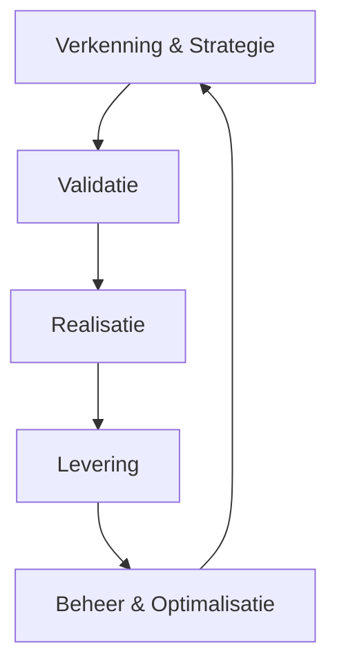
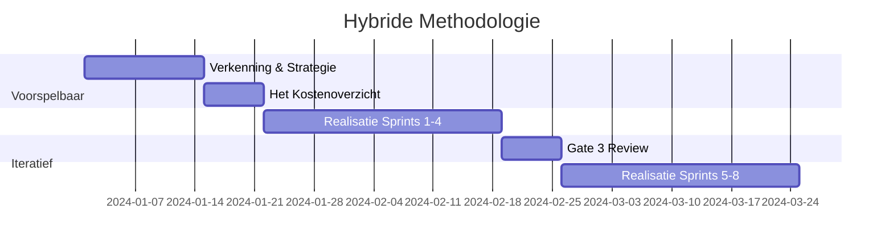
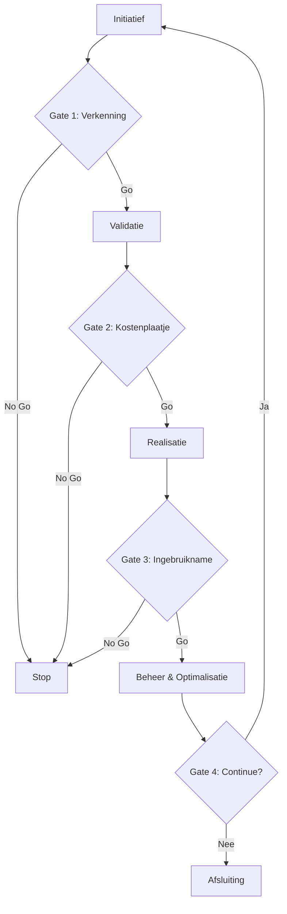

# AI Project Playbook - Full Export

Generated on: 2026-02-01 18:10:05.998588

______________________________________________________________________

# Document: Index

Source: index.md
---# 🚀 Welkom bij het AI Project Playbook

## Documentbeheer

- **Document-ID:** MOD
- **Titel:** 🚀 Welkom bij het AI Project Playbook
- **Versie:** 1.0
- **Status:** Draft
- **Eigenaar:** AI Competence Center
- **Laatst herzien:** 2026-02-01
- **Wijziging t.o.v. vorige versie:** Header gestandaardiseerd en versie naar 2.2 gezet.

______________________________________________________________________

## 📖 Uw Gids voor AI-Projectmanagement

Dit is de centrale documentatiehub voor het succesvol managen van AI-projecten, gebaseerd op de **Kernprincipes** van gedragssturing, traceerbaarheid en menselijke regie.

______________________________________________________________________

## 📖 Snel Starten

- 📖 **[Leeswijzer & Navigatie](00-strategisch-kader/00-leeswijzer.md):** Hoe u dit playbook het meest effectief gebruikt.
- 👥 **[Rollen & Verantwoordelijkheden](08-rollen-en-verantwoordelijkheden/index.md):** Wie doet wat in een AI-team?
- 📅 **[90-Dagen Startplan](12-90-dagen-roadmap/index.md):** Ga direct van strategie naar actie.
- 🧰 **[De toolkit](09-sjablonen/index.md):** Alle templates en sjablonen op één plek.

______________________________________________________________________

## 📖 Documentatie Overzicht

### 🎯 Strategisch Kader & Fundamenten

- **Module 00:** [Strategisch Kader](00-strategisch-kader/01-ai-levenscyclus.md)
- **Module 01:** [Kernprincipes](01-ai-native-fundamenten/01-definitie.md)
- **Module 07:** [Risicobeheersing & Compliance](07-compliance-hub/index.md)
- **Module 08:** [Rollen & Verantwoordelijkheden](08-rollen-en-verantwoordelijkheden/index.md)

### 🎯 De AI Levenscyclus (Fase Gidsen)

1. **[Verkenning & Strategie](02-fase-ontdekking/01-doelstellingen.md):** Het probleem doorgronden.
1. **[Validatie](03-fase-validatie/01-doelstellingen.md):** Bewijzen dat het werkt (**Praktijkproef**).
1. **[Realisatie](04-fase-ontwikkeling/01-doelstellingen.md):** De oplossing bouwen (**Specificatie-eerst**).
1. **[Levering](05-fase-levering/01-doelstellingen.md):** Veilige **Ingebruikname**.
1. **[Beheer & Optimalisatie](06-fase-monitoring/01-doelstellingen.md):** Waarde behouden (**Prestatieverloop**).

______________________________________________________________________

**Versie:** 1.0
**Datum:** 31 januari 2026
**Status:** Draft

______________________________________________________________________

______________________________________________________________________

# Document: 00 Executive Summary

Source: 00-strategisch-kader/00-executive-summary.md
---# Module 00.01: Executive Summary

## Documentbeheer

- **Document-ID:** MOD-00-01
- **Titel:** Module 00.01 — Executive Summary
- **Versie:** 1.0
- **Status:** Definitief
- **Eigenaar:** AI Competence Center
- **Laatst herzien:** 2026-02-01
- **Wijziging t.o.v. vorige versie:** Nieuw; biedt managementsamenvatting en implementatiepad.

______________________________________________________________________

## 1. Wat is dit Playbook?

Dit Playbook is een **modulaire werkwijze** voor AI‑projecten (van idee tot beheer) waarin we AI benaderen als **gedragssturing**: we beheren niet alleen code, maar ook *Doeldefinitie*, *Rode Lijnen*, *Sturingsinstructies* en *Bewijs*.

## 2. Voor wie is dit bedoeld?

- **Bestuur & MT:** keuzes maken, risico’s beheersen, investering onderbouwen
- **Product & Business owners:** use cases selecteren, waarde leveren, adoptie borgen
- **IT/Engineering:** bouwen, testen, integreren, operationeel beheer inrichten
- **Compliance/Legal/Privacy:** EU AI Act + AVG toetsbaar maken, audit‑klaar werken

## 3. Wat levert dit concreet op?

1. **Snellere time‑to‑value** via standaard templates en gates
1. **Minder incidenten** via Rode Lijnen + veiligheidstesten + incidentproces
1. **Audit‑klaar dossier** (bewijs‑pakket) voor interne/externe toetsing
1. **Herhaalbaarheid**: elke use case volgt dezelfde lifecycle en standaard deliverables

## 4. Hoe gebruik je het Playbook (snelle start)?

**Als je vandaag start met 1 use case:**

1. Vul **TMP‑09‑01 Project Charter** in (1 A4).
1. Doe **TMP‑09‑03 Risico Pre‑Scan** en bepaal risiconiveau.
1. Maak **TMP‑09‑02 Doelkaart** (incl. Rode Lijnen).
1. Stel een **Gouden Set** op en test met **TMP‑09‑05**.
1. Leg resultaten vast in **TMP‑09‑06 Validatierapport**.
1. Beslis bij Gate of je doorgaat naar Realisatie/Livegang.

## 5. Implementatie (organisatiebreed) – aanbevolen aanpak

- **Week 1–2:** kies 1 pilot use case + stel kernrollen aan (AI PM, Tech Lead, Guardian).
- **Week 3–6:** voer lifecycle uit (Modules 02–04), inclusief bewijsstandaarden (MOD‑01‑07).
- **Week 7–8:** livegang + beheer (Modules 05–06).
- **Week 9:** evaluatie + update Playbook naar v1.1 op basis van leerpunten.

## 6. Navigatie (wat moet je lezen?)

- **Start:** MOD‑00‑00 Leeswijzer & MOD‑00‑01 Executive Summary
- **Proces:** MOD‑02 t/m MOD‑06
- **Governance:** MOD‑07 + MOD‑01‑07 (Bewijsstandaarden)
- **Templates:** MOD‑09 (TMP‑09‑01 t/m TMP‑09‑07)

______________________________________________________________________

© 2026 AI Project Playbook. Gelicenseerd onder CC BY-NC-SA 4.0.

______________________________________________________________________

# Document: 00 Leeswijzer

Source: 00-strategisch-kader/00-leeswijzer.md
---# 🚀 Module 00: Leeswijzer & Navigatie

## Documentbeheer

- **Document-ID:** MOD-00
- **Titel:** 📍 Module 00: Leeswijzer & Navigatie
- **Versie:** 1.0
- **Status:** Definitief
- **Eigenaar:** AI Competence Center
- **Laatst herzien:** 2026-02-01
- **Wijziging t.o.v. vorige versie:** Verwijzing naar Executive Summary en Fast Lane toegevoegd.

______________________________________________________________________

## 📖 Welkom bij het AI Project Playbook

Dit is geen document om van A tot Z te lezen. Het is een toolkit. U raadpleegt wat u nodig heeft, op het moment dat u het nodig heeft.

______________________________________________________________________

## 📖 Waar moet ik beginnen?

### 🎯 Ik wil een overzicht voor het management

Ga naar **[Module 00.01: Executive Summary](00-executive-summary.md)** voor een samenvatting van de kernwaarden en het implementatietraject.

### 🎯 Ik wil snel experimenteren (Fast Lane)

Heeft uw idee een **Laag Risico** en valt het onder **Samenwerkingsmodus 1 of 2** (bijv. interne chatbot voor samenvattingen)?
Gebruik de **[Snelle Route (Fast Lane)](../02-fase-ontdekking/06-fast-lane.md)**: Sla de uitgebreide Business Case over. Vul enkel de [Doelkaart](../09-sjablonen/06-ai-native-artefacten/doelkaart.md) in en registreer het project bij de Guardian.

### 🎯 Ik heb een idee voor een AI-project

Ga naar [Module 02: Verkenning & Strategie](../02-fase-ontdekking/01-doelstellingen.md). Gebruik het [Project Charter](../09-sjablonen/01-project-charter/template.md) om uw idee op één A4 te krijgen.

### 🎯 Ik wil geld of budget aanvragen

Ga naar [Module 03: Validatie](../03-fase-validatie/01-doelstellingen.md). Hier leert u hoe u een **Praktijkproef** opzet en **Het Kostenoverzicht** berekent.

### 📍ï¸  Ik ga bouwen of ontwikkelen

Ga naar [Module 04: Realisatie](../04-fase-ontwikkeling/01-doelstellingen.md) en [Module 07: Risicobeheersing](../07-compliance-hub/index.md). Zorg dat u de **Technische Modelkaart** invult.

### 🎯 Ik ben van Legal of Compliance

Focus op [Module 07: Risicobeheersing & Compliance](../07-compliance-hub/index.md) en de [AI-Samenwerkingsmodi](../00-strategisch-kader/06-has-h-niveaus.md). Hier staan de kaders voor veiligheid en wetgeving.

______________________________________________________________________

## 📍ï¸  Hoe werkt dit Playbook?

- **Modulair:** Elke module staat op zichzelf. U hoeft Module 01 niet te lezen om Module 04 te begrijpen.
- **Actiegericht:** We gebruiken geen onduidelijke taal, maar checklists en templates voor direct resultaat.
- **Traceerbaar:** Elk project levert standaard documenten op (**Validatierapport**). Dit vormt uw dossier voor de EU AI Act.

______________________________________________________________________

## 📖 Legenda Icoontjes

- 📍 **Doel:** Waarom doen we dit?
- 📍ï¸  **Activiteit:** Wat moet er gebeuren?
- 📍 **Checklist:** Zijn we klaar?
- 📍ï¸  **Risico:** Let op!
- 📍 **Rollen:** Wie is betrokken?

______________________________________________________________________

© 2026 AI Project Playbook. Gelicenseerd onder CC BY-NC-SA 4.0.

______________________________________________________________________

# Document: 01 Ai Levenscyclus

Source: 00-strategisch-kader/01-ai-levenscyclus.md
---# 🚀 AI Levenscyclus

## Documentbeheer

- **Document-ID:** MOD-01
- **Titel:** 📍 AI Levenscyclus
- **Versie:** 1.0
- **Status:** Definitief
- **Eigenaar:** AI Competence Center
- **Laatst herzien:** 2026-02-01
- **Wijziging t.o.v. vorige versie:** Header gestandaardiseerd en versie naar 2.2 gezet.

______________________________________________________________________

## 📖 Doel

Dit document definieert de volledige methodologie voor AI projecten en vormt de fundering van de AI levenscyclus. Het beschrijft de 5 fasen van AI projecten en fungeert als centrale routekaart voor het team.

______________________________________________________________________

## 📖 Overzicht van de AI Levenscyclus

Een succesvol AI-project is geen lineair proces, maar een iteratieve cyclus waarbij techniek, business en compliance constant op elkaar worden afgestemd. De AI levenscyclus bestaat uit 5 fasen die elkaar overlappen en versterken:

### Belangrijkste Kenmerken

- **Iteratief:** Elke fase leert van de vorige en voedt de volgende.
- **Hybride:** Combineert voorspelbare planning met agile uitvoering (zie [Hybride Methodologie](02-hybride-methodologie.md)).
- **Compliance-First:** EU AI Act compliance is geïntegreerd in elke fase.
- **Traceerbaarheid:** Elke beslissing wordt ondersteund door bewijs.
- **Mensgerichte Regie:** Mensen blijven verantwoordelijk voor AI-beslissingen.

______________________________________________________________________

## 📖 De Vijf Fasen van de Levenscyclus

> \[!TIP\]
> **De Fast Lane (De Innovatie-route)**
> Voor projecten met een **Minimaal/Beperkt Risico** en een **Instrumentele/Adviserende modus** (Modus 1 & 2) bieden we een versnelde route. Hierbij kan na een positieve **Risico Pre-Scan** (Gate 1) direct worden gestart met een beperkte **Praktijkproef**, zonder uitgebreide business case.

### 🎯 Fase 1: Verkenning & Strategie

**📍 Doel:** Het identificeren van het juiste probleem en toetsen of we klaar zijn om te starten.

#### 📍 Kernactiviteiten

- **Probleemverkenning:** Het probleem definiëren vanuit de gebruiker, niet vanuit de techniek.
- **Data-Evaluatie:** Beoordelen van Toegang, Kwaliteit en Relevantie van de data.
- **Risico-Inventarisatie:** Bepalen of de toepassing valt onder de EU AI Act (hoog risico).

______________________________________________________________________

### 🎯 Fase 2: Validatie

**📍 Doel:** Bewijzen dat het idee werkt en financieel levensvatbaar is voordat we groot investeren.

#### 📍 Kernactivities

- **Praktijkproef (PoV):** Kleinschalig experiment om de hypothese te testen.
- **Het Kostenoverzicht:** Schatten van investering versus ROI.
- **Eerlijkheidstoets (Bias Detectie):** Eerste scan op ongewenste vooroordelen in het model.

______________________________________________________________________

### 🎯 Fase 3: Realisatie

**📍 Doel:** Het bouwen van een robuuste, productiewaardige oplossing.

#### 📍 Kernactiviteiten

- **Specificatie-eerst Methode:** Eerst tests schrijven, dan pas de implementatie.
- **Kenniskoppeling (RAG):** De AI verbinden aan interne bedrijfsinformatie.
- **Afstellen van het model:** Optimaliseren van de parameters en **Sturingsinstructies**.

______________________________________________________________________

### 🎯 Fase 4: Levering

**📍 Doel:** Een veilige **Ingebruikname** en acceptatie door de organisatie.

#### 📍 Kernactiviteiten

- **Ingebruikname Plan:** Stapsgewijze uitrol naar productie.
- **Menselijke Regie:** Implementeren van toezichtsprotocollen.
- **Adoptie & Training:** Gebruikers opleiden in de nieuwe werkwijze.

______________________________________________________________________

### 🎯 Fase 5: Beheer & Optimalisatie

**📍 Doel:** Waarde behouden en de oplossing actueel houden.

#### 📍 Kernactiviteiten

- **Prestatieverloop Meten:** Continu monitoren van accuraatheid en drift.
- **Kostenbeheersing:** Het verbruik en de middelen optimaliseren.
- **Feedbacklus:** Gebruikerservaringen terugkoppelen naar Fase 1.

______________________________________________________________________

## Gerelateerde Modules

- [Hybride Methodologie](02-hybride-methodologie.md)
- [Governance Model](03-governance-model.md)
- [Agile Antipatronen](04-agile-antipatronen-niet-toegestaan.md)
- [Project Initiatie](05-project-initiatie.md)

______________________________________________________________________

**Versie:** 2.0
**Datum:** 31 januari 2026
**Status:** Draft

______________________________________________________________________

© 2026 AI Project Playbook. Gelicenseerd onder CC BY-NC-SA 4.0.

______________________________________________________________________

# Document: 02 Hybride Methodologie

Source: 00-strategisch-kader/02-hybride-methodologie.md
---# 🚀 Hybride Methodologie

## Documentbeheer

- **Document-ID:** MOD-02
- **Titel:** 📍 Hybride Methodologie
- **Versie:** 1.0
- **Status:** Definitief
- **Eigenaar:** AI Competence Center
- **Laatst herzien:** 2026-02-01
- **Wijziging t.o.v. vorige versie:** Header gestandaardiseerd en versie naar 2.2 gezet.

______________________________________________________________________

## 📖 Doel

Dit document beschrijft de hybride aanpak van het AI Project Playbook, waarbij voorspelbare planning (Waterfall) wordt gecombineerd met iteratieve uitvoering (Agile) voor een optimale balans tussen structuur en flexibiliteit.

______________________________________________________________________

## 📖 Concept

De hybride methodologie erkent dat AI-projecten enerzijds strikte mijlpalen vereisen voor budgettering en compliance, en anderzijds extreme flexibiliteit nodig hebben tijdens de modelontwikkeling.

### Voorspelbare Elementen (Waterfall)

- Strategische planning en **Het Kostenoverzicht**.
- Compliance en governance checkpoints.
- Risico-inventarisatie.
- Mijlpaal planning (**Gates**).

### Iteratieve Elementen (Agile)

- **Afstellen van het model** en tuning.
- User feedback loops.
- *Experiment-driven development*.
- Continue verbetering (*Kaizen*).

______________________________________________________________________

## 📖 Praktische Implementatie

______________________________________________________________________

## ? Voordelen

- **Structuur:** Duidelijke planning en governance voor management.
- **Flexibiliteit:** Snelle aanpassing aan nieuwe data-inzichten voor het team.
- **Risicobeheer:** Proactieve risico-identificatie en mitigatie.
- **Compliance:** Geïntegreerde EU AI Act compliance reviews.

______________________________________________________________________

**Versie:** 2.0
**Datum:** 31 januari 2026
**Status:** Draft

______________________________________________________________________

© 2026 AI Project Playbook. Gelicenseerd onder CC BY-NC-SA 4.0.

______________________________________________________________________

# Document: 03 Governance Model

Source: 00-strategisch-kader/03-governance-model.md
---# 🚀 Governance Model

## Documentbeheer

- **Document-ID:** MOD-03
- **Titel:** 📍 Governance Model
- **Versie:** 1.0
- **Status:** Definitief
- **Eigenaar:** AI Competence Center
- **Laatst herzien:** 2026-02-01
- **Wijziging t.o.v. vorige versie:** Header gestandaardiseerd en versie naar 2.2 gezet.

______________________________________________________________________

## 📖 Doel

Het definiëren van de besluitvormingsstructuren, rollen en verantwoordelijkheden om AI-projecten veilig en effectief te sturen.

______________________________________________________________________

## 📖 Structuur

Het governance model bestaat uit drie lagen die samenwerken om strategie, operatie en techniek te verbinden:

1. **Strategisch Niveau:** Focus op visie en **Het Kostenoverzicht**.
1. **Operationeel Niveau:** Focus op uitvoering en prioriteit.
1. **Technisch Niveau:** Focus op kwaliteit en **Ingebruikname**.

______________________________________________________________________

## 📖 Verantwoordelijkheden (RACI)

| Rol                          | Niveau        | Kernverantwoordelijkheden                                      |
| :--------------------------- | :------------ | :------------------------------------------------------------- |
| **CAIO** (Chief AI Officer)  | Strategisch   | Strategie, ROI oversight, Governance eindverantwoordelijkheid. |
| **Executive Committee**      | Strategisch   | Budgetgoedkeuring, strategische alignment.                     |
| **AI Product Manager**       | Operationeel  | Use case prioriteit, Stakeholder management, Backlog eigenaar. |
| **AI Transformation Office** | Operationeel  | Procesbewaking, standaardisatie, training.                     |
| **Data Scientist**           | Technisch     | Model development, validatie, experimentatie.                  |
| **ML Engineering**           | Technisch     | **Ingebruikname** pipelines, monitoring, infrastructuur.       |
| **Guardian (Ethicist)**      | Ondersteunend | Eerlijkheidstoetsen, Bias audits, Compliance checks.           |
| **Security Officer**         | Ondersteunend | Security maatregelen, Privacy waarborging.                     |

______________________________________________________________________

## ? Besluitvormingsproces (Gate Model)

## ? Gate Reviews

Elke gate fungeert als een harde stop/go beslissing. Zie de [Gate Review Checklist](../09-sjablonen/04-gate-reviews/checklist.md) voor specifieke criteria per fase.

______________________________________________________________________

**Versie:** 2.0
**Datum:** 31 januari 2026
**Status:** Draft

______________________________________________________________________

© 2026 AI Project Playbook. Gelicenseerd onder CC BY-NC-SA 4.0.

______________________________________________________________________

# Document: 04 Agile Antipatronen Niet Toegestaan

Source: 00-strategisch-kader/04-agile-antipatronen-niet-toegestaan.md
---# 🚀 Agile Antipatronen (NOT DONE)

## Documentbeheer

- **Document-ID:** MOD-04
- **Titel:** 📍 Agile Antipatronen (NOT DONE)
- **Versie:** 1.0
- **Status:** Definitief
- **Eigenaar:** AI Competence Center
- **Laatst herzien:** 2026-02-01
- **Wijziging t.o.v. vorige versie:** Header gestandaardiseerd en versie naar 2.2 gezet.

______________________________________________________________________

## 📖 Doel

Deze lijst definieert de "NOT DONE" criteria voor AI-projecten: Agile antipatronen die absoluut vermeden moeten worden om falen, onethisch gedrag of compliance-issues te voorkomen.

______________________________________________________________________

## 📖 De "NOT DONE" Lijst

### ? Geen Eerlijkheidstoets (Bias Audit)

- **Regel:** AI systemen moeten regelmatig worden gecontroleerd op bias.
- **Impact:** Discriminatie en reputatieschade.
- **Status:** Geen **Eerlijkheidstoetsen** = **NIET TOEGESTAAN**.

### ? Geen Menselijke Regie

- **Regel:** AI beslissingen (zeker bij hoog risico) moeten menselijke goedkeuring of 'in-the-loop' toezicht hebben conform de gekozen **Samenwerkingsmodus**.
- **Impact:** Ongecontroleerde fouten.
- **Status:** Geen menselijke regie = **NIET TOEGESTAAN**.

### ? Geen Continue Monitoring

- **Regel:** Modellen degraderen na verloop van tijd (**Prestatieverloop**). Continue monitoring is vereist.
- **Impact:** Performance verlies en onbetrouwbare output.
- **Status:** Geen monitoring = **NIET TOEGESTAAN**.

### ? Geen Governance Checkpoints

- **Regel:** Elke fase moet formele checkpoints hebben (**Gates**).
- **Impact:** Onbeheersbare risico's en budgetoverschrijding.
- **Status:** Geen checkpoints = **NIET TOEGESTAAN**.

### ? Geen Stakeholder Engagement

- **Regel:** Stakeholders en eindgebruikers moeten vanaf dag één betrokken zijn.
- **Impact:** Oplossingen die niet gebruikt worden.
- **Status:** Geen engagement = **NIET TOEGESTAAN**.

### ? Geen Explainability

- **Regel:** AI beslissingen moeten verklaarbaar zijn voor de gebruiker.
- **Impact:** "Black box" wantrouwen en niet-naleving van regelgeving.
- **Status:** Geen uitlegbaarheid = **NIET TOEGESTAAN**.

### ? Geen Data-Evaluatie

- **Regel:** Input data moet valide, schoon en representatief zijn.
- **Impact:** "Garbage in, garbage out".
- **Status:** Geen **Data-Evaluatie** = **NIET TOEGESTAAN**.

### ? Geen Risicobeheer

- **Regel:** Risico's moeten proactief geïdentificeerd en gemitigeerd worden.
- **Impact:** Onverwachte incidenten.
- **Status:** Geen risicobeheer = **NIET TOEGESTAAN**.

### ? Geen Traceerbaarheid

- **Regel:** Van elke modelversie moet te herleiden zijn op welke data en met welke **Sturingsinstructies** deze is getraind.
- **Impact:** Onmogelijkheid om fouten te auditen.
- **Status:** Geen traceerbaarheid = **NIET TOEGESTAAN**.

______________________________________________________________________

## 📖 Implementatie

Gebruik deze lijst als:

1. **Checklist** tijdens project initiatie.
1. **Review criteria** tijdens Gate Reviews.
1. **Training materiaal** voor teams om bewustzijn te creëren.
1. **Audit tool** voor compliance verificatie.

______________________________________________________________________

**Versie:** 2.0
**Datum:** 31 januari 2026
**Status:** Draft

______________________________________________________________________

© 2026 AI Project Playbook. Gelicenseerd onder CC BY-NC-SA 4.0.

______________________________________________________________________

# Document: 05 Project Initiatie

Source: 00-strategisch-kader/05-project-initiatie.md
---# 🚀 Project Initiatie

## Documentbeheer

- **Document-ID:** MOD-05
- **Titel:** 📍 Project Initiatie
- **Versie:** 1.0
- **Status:** Definitief
- **Eigenaar:** AI Competence Center
- **Laatst herzien:** 2026-02-01
- **Wijziging t.o.v. vorige versie:** Header gestandaardiseerd en versie naar 2.2 gezet.

______________________________________________________________________

## 📖 Doel

Het formaliseren van de start van een AI-project door het vastleggen van heldere doelen, rollen, verantwoordelijkheden en kaders in een **AI Project Charter**.

______________________________________________________________________

## 📖 Initiatie Stappen

### 1. Project Charter Opstellen

- Definieer de **project scope**: Wat hoort er wel bij en wat niet?
- Formuleer duidelijke **doelen** en de verwachte **Doeldefinitie**.
- Leg de beoogde **Samenwerkingsmodus** vast.
- Identificeer **stakeholders** en breng hun verwachtingen in kaart.

### 2. Team Samenstellen

- Wijs duidelijke rollen toe (zie **📍 4. Team & Rollen**).
- Zorg voor multidisciplinaire samenwerking (Business, Data Science, IT/Guardians).

### 3. Governance Opzetten

- Definieer de besluitvormingsstructuur voor dit specifieke project.
- Plan de **Gate Reviews** en checkpoints in de agenda.

### 4. Risicobeheer Plan

- Voer een initiële **Risico-Inventarisatie** uit.
- Ontwikkel mitigatie strategieën voor de top-risico's.

### 5. Het Kostenoverzicht

- Maak een eerste raming van de investering en verwachte opbrengsten.

______________________________________________________________________

## 📖 Templates en Tools

Gebruik de volgende sjablonen om de initiatie te ondersteunen:

- **Project Charter:** Voor scope en mandaat.
- **Risicoanalyse:** Voor initiële risico-inventarisatie.
- **Gate Review Checklist:** Voor voorbereiding op de eerste Gate.

______________________________________________________________________

## Gerelateerde Modules

- [Hybride Methodologie](02-hybride-methodologie.md)
- [Governance Model](03-governance-model.md)

______________________________________________________________________

**Versie:** 2.0
**Datum:** 31 januari 2026
**Status:** Draft

______________________________________________________________________

© 2026 AI Project Playbook. Gelicenseerd onder CC BY-NC-SA 4.0.

______________________________________________________________________

# Document: 06 Has H Niveaus

Source: 00-strategisch-kader/06-has-h-niveaus.md
---# 🚀 AI-Samenwerkingsmodi

## Documentbeheer

- **Document-ID:** MOD-06
- **Titel:** 📍 AI-Samenwerkingsmodi
- **Versie:** 1.0
- **Status:** Definitief
- **Eigenaar:** AI Competence Center
- **Laatst herzien:** 2026-02-01
- **Wijziging t.o.v. vorige versie:** Header gestandaardiseerd en versie naar 2.2 gezet.

______________________________________________________________________

## 📖 1. Doel van de Modi

Om te bepalen welke processen, governance en risicobeheersing nodig zijn, classificeren we de relatie tussen mens en machine in vijf **Samenwerkingsmodi**.

Dit model beschrijft de verschuiving van AI als gereedschap naar AI als zelfstandige actor. Het is cruciaal om vooraf te definiëren in welke modus een systeem opereert, omdat een 'Modus 4'-systeem (Gedelegeerd) veel strengere veiligheidsregels vereist dan een 'Modus 2'-systeem (Adviserend).

______________________________________________________________________

## 📖 De Vijf Modi

### Modus 1: Instrumenteel (The Tool)

**De mens werkt, AI wacht.**

Dit is de klassieke situatie. De AI is passief en doet niets tenzij de mens op een knop drukt. De mens is volledig verantwoordelijk voor de start, de uitvoering en het resultaat.

- **Dynamiek:** Mens ? Actie ? AI ? Resultaat.
- **Voorbeeld:** Een tekst vertalen met Google Translate of een formule genereren in Excel.
- **Risico:** Laag (fouten worden direct door de gebruiker gezien).
- **Governance:** Standaard IT-beheer.

### Modus 2: Adviserend (The Advisor)

**De AI stelt voor, de mens beslist.**

De AI analyseert de situatie en biedt opties of aanbevelingen. De mens fungeert als 'Gatekeeper'; er gebeurt niets zonder expliciete goedkeuring. Dit is vaak de instapfase voor professionele toepassingen.

- **Dynamiek:** AI ? Suggestie ? Mens ? Goedkeuring/Actie.
- **Voorbeeld:** Een copiloot die code-suggesties doet, of een systeem dat fraude markeert voor inspectie door een analist.
- **Risico:** "Rubber stamping" (de mens keurt blind goed uit gemakzucht).
- **Governance:** Focus op het trainen van de menselijke beoordelaar.

### Modus 3: Collaboratief (The Partner)

**De dialoog staat centraal.**

Mens en AI werken iteratief samen aan een complex probleem. Het is een ping-pong spel van ideeën waarbij het eindresultaat een mix is van beide intelligenties. Dit wordt ook wel 'Co-Intelligentie' of het 'Centaur-model' genoemd.

- **Dynamiek:** Mens ? AI (Continue lus van input en feedback).
- **Voorbeeld:** Samen met ChatGPT een strategisch plan brainstormen en verfijnen.
- **Risico:** Vertroebeling van eigenaarschap (wie bedacht wat?) en verlies van eigen kritisch denkvermogen.
- **Governance:** Richtlijnen voor bronvermelding en fact-checking.

### Modus 4: Gedelegeerd (The Agent)

**AI voert uit, de mens beheert uitzonderingen.**

Hier draaien we het proces om: we ontwerpen de workflow zo dat AI het 'zware werk' doet. De mens stapt uit de dagelijkse loop en grijpt alleen in als de AI aangeeft het niet te weten (laag betrouwbaarheidsscore) of als er een foutmelding is. Dit heet vaak *Human-on-the-loop*.

- **Dynamiek:** AI ? Uitvoering ? (Alleen bij Fout) ? Mens.
- **Voorbeeld:** Een chatbot die zelfstandig klantvragen afhandelt en alleen doorverbindt bij boze klanten.
- **Risico:** 'Silent failures' (fouten die niet als fout worden herkend) en degradatie van menselijke expertise omdat ze het werk nooit meer zelf doen.
- **Governance:** Strenge geautomatiseerde monitoring en steekproeven (Audits).

### Modus 5: Autonoom (The Entity)

**AI stelt doelen en handelt zelfstandig.**

Het systeem krijgt een breed mandaat (bijv. "Optimaliseer de inkoopvoorraad") en bepaalt zelf de sub-taken, timing en methode. De menselijke rol beperkt zich tot het stellen van de kaders (het beleid) en de 'Kill Switch'.

- **Dynamiek:** Mens (Beleid) ? AI (Autonome Uitvoering).
- **Voorbeeld:** High-frequency trading algoritmes of volledig autonome supply chain planners.
- **Risico:** Onvoorspelbaar emergent gedrag en kettingreacties (Flash Crashes).
- **Governance:** 'Circuit Breakers' (noodstoppen) en beleidsmatige constraints (wat mag de AI absoluut niet).

______________________________________________________________________

## ? Risico & Validatie Matrix

Hoe hoger de modus, hoe zwaarder de validatie-eisen.

| Modus                | Primaire Validatie                         | Rol van de Mens          | Focus van Eigenaarschap |
| :------------------- | :----------------------------------------- | :----------------------- | :---------------------- |
| **1. Instrumenteel** | Gebruikerstest (UAT)                       | Uitvoerder               | Taakgericht             |
| **2. Adviserend**    | Precisie-meting                            | Beslisser (Gatekeeper)   | Besluitvorming          |
| **3. Collaboratief** | Ervaring & Bruikbaarheid                   | Partner                  | Resultaatgericht        |
| **4. Gedelegeerd**   | Continue Monitoring & **Prestatieverloop** | Toezichthouder (Auditor) | Procesgericht           |
| **5. Autonoom**      | Simulatie & Stress-testing                 | Beleidsbepaler           | Systeemgericht          |

______________________________________________________________________

## 📖 Toepassing in Projecten

Bij het starten van een project (Fase Discovery) moet de beoogde modus worden vastgelegd in het **Project Charter**.

!!! tip "Begin laag, schaal op"
    Start een use case in **Modus 2 (Adviseur)** om data te verzamelen en vertrouwen te bouwen. Pas als de kwaliteit bewezen is (>90%), kan worden overgestapt naar **Modus 4 (Gedelegeerd)**.

!!! warning "Waarschuwing"
    Probeer niet direct naar Modus 4 of 5 te springen zonder de tussenliggende leerfases.

______________________________________________________________________

## Gerelateerde Modules

- [Kernprincipes](../01-ai-native-fundamenten/01-definitie.md)
- [Validatie Model](../01-ai-native-fundamenten/04-validatie-model.md)
- [Risicobeheer](../07-compliance-hub/02-risicobeheer/index.md)

______________________________________________________________________

**Versie:** 2.0
**Datum:** 31 januari 2026
**Status:** Draft

______________________________________________________________________

© 2026 AI Project Playbook. Gelicenseerd onder CC BY-NC-SA 4.0.

______________________________________________________________________

# Document: 07 Organisatorische Heruitvinding

Source: 00-strategisch-kader/07-organisatorische-heruitvinding.md
---# 🚀 Organisatorische Heruitvinding

## Documentbeheer

- **Document-ID:** MOD-07
- **Titel:** 📍 Organisatorische Heruitvinding
- **Versie:** 1.0
- **Status:** Definitief
- **Eigenaar:** AI Competence Center
- **Laatst herzien:** 2026-02-01
- **Wijziging t.o.v. vorige versie:** Header gestandaardiseerd en versie naar 2.2 gezet.

______________________________________________________________________

## 📖 Doel

AI is niet alleen een technische upgrade, maar een fundament voor een nieuwe manier van werken. Dit document beschrijft hoe de organisatie moet transformeren om de vruchten van AI te plukken.

______________________________________________________________________

## 📖 Van Project naar Platform

Traditionele organisaties zien AI als een serie losse projecten. Voor maximale impact moeten we verschuiven naar een platformvisie.

- **Data als Brandstof:** Data is niet langer een bijproduct, maar de kern van de bedrijfsvoering.
- **Accelerators:** Bouw herbruikbare componenten (zoals **Kenniskoppeling**) die over de hele organisatie ingezet kunnen worden.
- **Centrale Regie:** Voorkom **Wildgroei** door duidelijke kaders en een gedeeld **Playbook**.

______________________________________________________________________

## 📖 Kernonderdelen van de Heruitvinding

### 1. Cultuur & Mindset

- Van "AI vervangt ons" naar "AI versterkt ons".
- Cultuur van experimenteren, falen en snel leren.

### 2. Talent & Rollen

- Ontwikkeling van nieuwe rollen zoals de AI Product Manager en de Guardian (Ethicist).
- Upskilling van de gehele organisatie in AI-geletterdheid.

### 3. Schaalbare Architectuur

- Investeren in MLOps om **Ingebruikname** te versnellen.
- Standaardiseren van **Sturingsinstructies** en bewaarmethoden.

______________________________________________________________________

## Gerelateerde Modules

- [Volwassenheidsniveaus](../13-organisatieprofielen/index.md)
- [Governance Model](03-governance-model.md)

______________________________________________________________________

**Versie:** 2.0
**Datum:** 31 januari 2026
**Status:** Draft

______________________________________________________________________

© 2026 AI Project Playbook. Gelicenseerd onder CC BY-NC-SA 4.0.

______________________________________________________________________

# Document: Index

Source: 08-rollen-en-verantwoordelijkheden/index.md
---# 📂 Module 08: Rollen & Verantwoordelijkheden

## Documentbeheer

- **Document-ID:** MOD
- **Titel:** 📂 Module 08: Rollen & Verantwoordelijkheden
- **Versie:** 1.0
- **Status:** Definitief
- **Eigenaar:** AI Competence Center
- **Laatst herzien:** 2026-02-01
- **Wijziging t.o.v. vorige versie:** Header gestandaardiseerd en versie naar 2.2 gezet.

______________________________________________________________________

## 🎯 Wie doet wat in een AI-project?

In AI-projecten vervagen de grenzen tussen business en IT. Daarom definiëren we rollen op basis van verantwoordelijkheid, niet op basis van functietitel.

______________________________________________________________________

## 📂 1. Het Kernteam (The Squad)

Deze mensen werken dagelijks aan het project en vormen de motor van de innovatie.

### 🧙‍♂️ De AI Product Manager (Business Lead)

Niet zomaar een Product Owner. De AI PM begrijpt niet alleen de klantvraag, maar snapt ook wat technisch haalbaar is met AI (en wat niet).

- **Verantwoordelijkheid:** De **Doelkaart** (Module 09.02).
- **Taak:** Vertaalt vage business-wensen naar scherpe AI-instructies. Beheert de backlog en prioriteert op waarde.
- **Focus:** "Lossen we het juiste probleem op?"

### 🤖 De Tech Lead (Technical Lead)

De architect van de oplossing. Zorgt dat de losse componenten (data, model, interface) naadloos samenwerken.

- **Verantwoordelijkheid:** De **Technische Modelkaart** (Module 09.04).
- **Taak:** Selecteert het juiste model, bouwt de pijplijnen en borgt de technische stabiliteit.
- **Focus:** "Is het robuust en schaalbaar?"

### ⚖️ De Guardian (Ethicus / Compliance)

Het 'geweten' van het project. Heeft een onafhankelijke positie en waakt over de wettelijke en ethische kaders.

- **Verantwoordelijkheid:** De **Risico Pre-scan** (Module 09.03).
- **Taak:** Toetst plannen aan de EU AI Act en interne waarden. Heeft veto-recht bij overschrijding van de **Rode Lijnen**. Voert **Eerlijkheidstoetsen** (bias-audits) uit.
- **Focus:** "Is het veilig en eerlijk?"

______________________________________________________________________

## 📂 2. De Ondersteunende Rollen

Deze specialisten worden ingevlogen wanneer de specifieke fase daarom vraagt.

| Rol                      | Focus           | Taak                                                                     |
| :----------------------- | :-------------- | :----------------------------------------------------------------------- |
| 💾 **Data Engineer**   | Datakwaliteit   | De ruggengraat van de data. Zorgt dat data schoon aankomt bij het model. |
| 🧪 **AI Tester (QA)**  | Betrouwbaarheid | Specialist in het 'kapot maken' van AI via *Adversarial Testing*.        |
| 📢 **Adoptie Manager** | Verandering     | Zorgt dat mensen de tool echt gebruiken (ADKAR-model).                   |

______________________________________________________________________

## 📂 3. Strategisch Niveau (Steering Com)

### 🚀 Chief AI Officer (CAIO)

Sponsor van het programma. Bepaalt de overkoepelende strategie en wijst budget toe.

- **Taak:** Beslist bij de **Gates** of een project doorgaat of stopt.
- **Eigenaarschap:** Bewaakt het gehele portfolio en de AI-volwassenheid van de organisatie.

______________________________________________________________________

**Versie:** 2.0
**Datum:** 31 januari 2026
**Status:** Draft

______________________________________________________________________

## Â

© 2026 AI Project Playbook. Gelicenseerd onder CC BY-NC-SA 4.0.

______________________________________________________________________

# Document: 01 Definitie

Source: 01-ai-native-fundamenten/01-definitie.md
---# 🚀 De Kernprincipes

## Documentbeheer

- **Document-ID:** MOD-01
- **Titel:** 📍 De Kernprincipes
- **Versie:** 1.0
- **Status:** Definitief
- **Eigenaar:** AI Competence Center
- **Laatst herzien:** 2026-02-01
- **Wijziging t.o.v. vorige versie:** Header gestandaardiseerd en versie naar 2.2 gezet.

______________________________________________________________________

## 📖 1. Wat Zijn de Kernprincipes?

Wij beschouwen AI-voorzieningen niet als statische software, maar als **gedragssturing**. Dit betekent dat we AI-systemen niet programmeren in de traditionele zin, maar sturen door middel van informatie en context.

Een project valt onder dit regime als aan **drie voorwaarden** is voldaan:

### 1. Impact

Het systeem raakt de business direct. Het neemt beslissingen, genereert content of beïnvloedt processen die waarde creëren of risico's met zich meebrengen.

### 2. Traceerbaarheid

Alle instructies en configuraties zijn beheerd als code (version control). We kunnen altijd terugkijken: "Waarom deed het systeem dit op dat moment?"

### 3. Continue Toetsing

Het systeem wordt niet één keer getest en dan "klaar" verklaard. We valideren doorlopend of het gedrag nog aansluit bij de bedoeling.

## 📖 Governance-as-Code (Automatisering)

Documentatie alleen verandert gedrag niet; de implementatie doet dat wel. We hanteren het principe van **Verifieerbaarheid door Code**:

- **Technisch Dossier in Git:** Artefacten zoals de **Technische Modelkaart** worden bij voorkeur opgeslagen als code (YAML/JSON) in de repository.
- **Automated Gates:** De CI/CD-pipeline checkt automatisch op compliance-criteria (bijv. accuraatheid > 85%) voordat een model naar productie gaat.

______________________________________________________________________

## 📖 De Drie Kernvoorwaarden

Om AI-systemen beheersbaar te maken, werken we met vier kerndocumenten:

### 2.1 Doeldefinitie (Intent)

**Wat proberen we te bereiken?**

Dit is de hypothese of het doel van het systeem. Bijvoorbeeld:

- "Automatisch facturen categoriseren met 95% nauwkeurigheid"
- "Klantvragen beantwoorden binnen 30 seconden"

### 2.2 Rode Lijnen (Constraints)

**Wat mag absoluut niet gebeuren?**

Dit zijn de harde grenzen waar het systeem zich aan moet houden:

- Privacy: Geen persoonsgegevens delen zonder toestemming
- Veiligheid: Geen medische adviezen geven
- Compliance: Voldoen aan AVG/GDPR

### 2.3 Sturingsinstructies (Context)

**Welke informatie stuurt het gedrag?**

Dit omvat alle inputs die de AI gebruikt:

- Prompts en instructies
- Gekoppelde documenten en kennisbanken
- Configuraties en parameters
- Voorbeelden (few-shot learning)

### 2.4 Validatierapport (Evidence)

**Hoe weten we dat het werkt?**

Het rapport dat aantoont dat de AI zich aan de Rode Lijnen houdt en het Doel bereikt:

- Testresultaten
- Prestatiemetrics
- Audit logs
- Gebruikersfeedback

______________________________________________________________________

## 3. Van Code naar Gedrag

Het verschil met traditionele software:

| Traditionele Software          | AI als Gedragssturing                |
| ------------------------------ | ------------------------------------ |
| We schrijven expliciete regels | We sturen met voorbeelden en context |
| Logica is deterministisch      | Gedrag is probabilistisch            |
| Eenmalige test = klaar         | Continue validatie vereist           |
| Bug = code fout                | "Bug" = context probleem             |

**Context Engineering** wordt de nieuwe kerndiscipline: het ontwerpen en beheren van de informatie die het AI-gedrag stuurt.

______________________________________________________________________

## 4. Waarom Dit Belangrijk Is

Deze aanpak zorgt voor:

- **Controleerbaarheid:** We weten altijd waarom het systeem iets deed
- **Aanpasbaarheid:** Gedrag wijzigen = context aanpassen, niet herprogrammeren
- **Verantwoording:** Duidelijke eigenaarschap van doelen en grenzen
- **Compliance:** Aantoonbaar voldoen aan wet- en regelgeving

______________________________________________________________________

## Gerelateerde Modules

- [AI-Samenwerkingsmodi](../00-strategisch-kader/06-has-h-niveaus.md)
- [Artefact Model](03-artefact-model.md)
- [Validatie Model](04-validatie-model.md)

______________________________________________________________________

**Versie:** 2.0
**Datum:** 31 januari 2026
**Status:** Draft

______________________________________________________________________

© 2026 AI Project Playbook. Gelicenseerd onder CC BY-NC-SA 4.0.

______________________________________________________________________

# Document: 02 Normatieve Criteria

Source: 01-ai-native-fundamenten/02-normatieve-criteria.md
---# 🚀 Normatieve Criteria

## Documentbeheer

- **Document-ID:** MOD-02
- **Titel:** 📍 Normatieve Criteria
- **Versie:** 1.0
- **Status:** Definitief
- **Eigenaar:** AI Competence Center
- **Laatst herzien:** 2026-02-01
- **Wijziging t.o.v. vorige versie:** Header gestandaardiseerd en versie naar 2.2 gezet.

______________________________________________________________________

## 📖 Wanneer Werken We Volgens de Kernprincipes?

Een project kwalificeert voor deze aanpak als aan de volgende drie criteria wordt voldaan:

| Criterium              | Vereiste                                                                                                              |
| :--------------------- | :-------------------------------------------------------------------------------------------------------------------- |
| **Materiale Invloed**  | Het systeem vertrouwt op AI voor productie-outputs of beslissingen die de business raken.                             |
| **Expliciete Context** | Inputs die het gedrag sturen (**Sturingsinstructies**, kenniskoppeling) worden beheerd als geversioneerde artefacten. |
| **Continue Toetsing**  | Wijzigingen ondergaan validatie die specifiek is ontworpen voor het niet-deterministische gedrag van AI.              |

> **Zodra gekwalificeerd**, gelden de operationele controles voor beheer, monitoring en traceerbaarheid om de ontwikkeling in goede banen te leiden.

______________________________________________________________________

**Versie:** 2.0
**Datum:** 31 januari 2026
**Status:** Draft

______________________________________________________________________

© 2026 AI Project Playbook. Gelicenseerd onder CC BY-NC-SA 4.0.

______________________________________________________________________

# Document: 03 Artefact Model

Source: 01-ai-native-fundamenten/03-artefact-model.md
---# 🚀 Artefact Model

## Documentbeheer

- **Document-ID:** MOD-03
- **Titel:** 📍 Artefact Model
- **Versie:** 1.0
- **Status:** Definitief
- **Eigenaar:** AI Competence Center
- **Laatst herzien:** 2026-02-01
- **Wijziging t.o.v. vorige versie:** Header gestandaardiseerd en versie naar 2.2 gezet.

______________________________________________________________________

## 📖 Beheer-Artefacten

Om AI-systemen beheersbaar te maken, beheren we specifieke artefacten die grip geven op het gedrag.

| Artefact                | Doel                                                                 | Eigenaar            | Formaat                                               |
| :---------------------- | :------------------------------------------------------------------- | :------------------ | :---------------------------------------------------- |
| **Doeldefinitie**       | **Business hypothese:** Welke uitkomst wordt nagestreefd? (*Intent*) | AI Product Manager  | Gestructureerde statement ("Gegeven X, als Y, dan Z") |
| **Rode Lijnen**         | **Harde grenzen:** Wat mag NOOIT gebeuren? (*Constraints*)           | Guardian (Ethicist) | IF/THEN regels ("ALS PII, DAN blokkeren")             |
| **Sturingsinstructies** | **Sturing:** De configuratie die de AI stuurt (prompts, RAG).        | ML Engineer         | Versiebeheerde config (JSON/YAML/Markdown)            |
| **Validatierapport**    | **Bewijs:** Resultaten van testen en metingen (*Evidence*).          | QA Engineer         | Gestructureerd rapport met metrics                    |
| **Traceerbaarheid**     | **Verbinding:** Koppeling tussen Doel ? Instructie ? Bewijs.         | ML Engineer         | Referenties (ID's / Git SHAs)                         |

______________________________________________________________________

**Versie:** 2.0
**Datum:** 31 januari 2026
**Status:** Draft

______________________________________________________________________

© 2026 AI Project Playbook. Gelicenseerd onder CC BY-NC-SA 4.0.

______________________________________________________________________

# Document: 04 Validatie Model

Source: 01-ai-native-fundamenten/04-validatie-model.md
---# 🚀 Validatie Model

## Documentbeheer

- **Document-ID:** MOD-04
- **Titel:** 📍 Validatie Model
- **Versie:** 1.0
- **Status:** Definitief
- **Eigenaar:** AI Competence Center
- **Laatst herzien:** 2026-02-01
- **Wijziging t.o.v. vorige versie:** Header gestandaardiseerd en versie naar 2.2 gezet.

______________________________________________________________________

## 📖 Drie Dimensies van Validatie

Elke wijziging in de **Sturingsinstructies** of kenniskoppeling moet drie validatiecategorieën doorlopen:

### 1. Syntactische Geldigheid

- **Vraag:** Werkt de code? Geen crashes of errors?
- **Methode:** Geautomatiseerde checks op structuur, JSON/YAML schema's en linting.

### 2. Gedragsconformiteit

- **Vraag:** Doet het systeem wat we verwachten in gecontroleerde omstandigheden?
- **Methode:** Geautomatiseerde evaluatiesuites die reproduceerbaar zijn (testsets).

### 3. Doelgerichtheid (Intent-Alignment)

- **Vraag:** Helpt het systeem de gebruiker echt in de praktijk?
- **Methode:** Scenario-gebaseerde evaluatie door experts of geavanceerde simulatie.

______________________________________________________________________

**Versie:** 2.0
**Datum:** 31 januari 2026
**Status:** Draft

______________________________________________________________________

© 2026 AI Project Playbook. Gelicenseerd onder CC BY-NC-SA 4.0.

______________________________________________________________________

# Document: 05 Risicoclassificatie

Source: 01-ai-native-fundamenten/05-risicoclassificatie.md
---# 🚀 Risicoclassificatie

## Documentbeheer

- **Document-ID:** MOD-05
- **Titel:** 📍 Risicoclassificatie
- **Versie:** 1.0
- **Status:** Definitief
- **Eigenaar:** AI Competence Center
- **Laatst herzien:** 2026-02-01
- **Wijziging t.o.v. vorige versie:** Header gestandaardiseerd en versie naar 2.2 gezet.

______________________________________________________________________

## 📖 Validatie Diepgang

Niet elke wijziging vereist dezelfde diepgang van validatie. We classificeren wijzigingen op basis van de impact op de **Rode Lijnen**.

| Niveau       | Trigger (Voorbeeld)                                    | Validatie Diepgang                              | EU AI Act Mapping   |
| :----------- | :----------------------------------------------------- | :---------------------------------------------- | :------------------ |
| **Kritiek**  | Beveiliging, Financiële transacties, Gezondheidsadvies | Volledige Validatie + **Rode Lijn** Verificatie | **Hoog Risico**     |
| **Verhoogd** | Persoonsgegevens (PII), Externe API-koppelingen        | Uitgebreide Gedrags- + Doelgerichtheidtoets     | **Beperkt Risico**  |
| **Matig**    | Schrijfstijl (Tone of Voice), UX-wijzigingen           | Minimale Gedrags- + Doelgerichtheidtoets        | **Beperkt Risico**  |
| **Laag**     | Geen **Rode Lijnen** geraakt                           | Syntactische + Minimale Gedragscheck            | **Minimaal Risico** |

______________________________________________________________________

**Versie:** 2.0
**Datum:** 31 januari 2026
**Status:** Draft

______________________________________________________________________

© 2026 AI Project Playbook. Gelicenseerd onder CC BY-NC-SA 4.0.

______________________________________________________________________

# Document: 06 Specificatie Gedreven Ontwikkeling

Source: 01-ai-native-fundamenten/06-specificatie-gedreven-ontwikkeling.md
---# 🚀 Specificatie-eerst Methode

## Documentbeheer

- **Document-ID:** MOD-01-06
- **Titel:** 📍 Specificatie-eerst Methode
- **Versie:** 1.0
- **Status:** Definitief
- **Eigenaar:** AI Competence Center
- **Laatst herzien:** 2026-02-01
- **Wijziging t.o.v. vorige versie:** Header gestandaardiseerd en versie naar 1.0 gezet.

______________________________________________________________________

## 📖 Shift-Left Validatie

De **Specificatie-eerst Methode** (ook wel *Spec-Driven Development*) zorgt ervoor dat we eerst de verwachtingen vastleggen voordat we bouwen.

In plaats van direct prompts te schrijven, volgen we deze cyclus:

1. **AI Product Manager** definieert de **Doeldefinitie**.
1. **ML Engineer** stelt de eerste **Sturingsinstructies** op.
1. Het systeem genereert een gedetailleerde **specificatie** van het verwachte gedrag.
1. **Menselijke Review** van de specificatie: We valideren de bedoeling voordat we middelen besteden aan training of testruns.
1. De goedgekeurde specificatie stuurt de verdere ontwikkeling en de automatische validatie aan.

______________________________________________________________________

## Gerelateerde Templates

- [Doelkaart Template](../09-sjablonen/06-ai-native-artefacten/doelkaart.md)

______________________________________________________________________

© 2026 AI Project Playbook. Gelicenseerd onder CC BY-NC-SA 4.0.

______________________________________________________________________

# Document: 07 Bewijsstandaarden

Source: 01-ai-native-fundamenten/07-bewijsstandaarden.md
---# Module 01.07: Bewijsstandaarden

## Documentbeheer

- **Document-ID:** MOD-01-07
- **Titel:** Module 01.07 — Bewijsstandaarden
- **Versie:** 1.0
- **Status:** Definitief
- **Eigenaar:** AI Competence Center
- **Laatst herzien:** 2026-02-01
- **Wijziging t.o.v. vorige versie:** Nieuw document toegevoegd om Gate Reviews toetsbaar te maken.

______________________________________________________________________

## 1. Doel

Deze module definieert **minimale bewijsstandaarden** voor AI-oplossingen, zodat Gate Reviews niet op gevoel maar op **toetsbare criteria** plaatsvinden.

**Kernprincipe:**
Een AI-oplossing mag pas door naar de volgende fase als het bewijs voldoet aan de normen voor het gekozen **risiconiveau** (Module 07) en **Samenwerkingsmodus** (Module 00.06).

______________________________________________________________________

## 2. Scope (waar geldt dit voor?)

Deze standaarden gelden voor:

- Generatieve AI (tekst/beeld/advies)
- AI die classificatie/extractie doet
- AI die beslissingen ondersteunt (advies) of uitvoert (agent/actie)

Niet bedoeld voor:

- Zuivere BI-rapportage zonder AI-besluitvorming
- Simpele regels/automatisering zonder model

______________________________________________________________________

## 3. Definities (zodat termen toetsbaar zijn)

### 3.1 Foutclassificatie

- **Kritiek:** overtreding Rode Lijnen (privacy-lek, verboden advies, discriminatoire output, gevaarlijke instructies, misleidende transparantie).
    **Norm:** 0 toegestaan.
- **Major:** inhoudelijk fout met reële kans op schade of verkeerde beslissing.
    **Norm:** zeer beperkt (zie tabel).
- **Minor:** stijl/format/kleine onvolledigheid zonder besluit-impact.

### 3.2 “Significant prestatieverloop”

Prestatieverloop is **significant** als één van onderstaande optreedt t.o.v. de nulmeting:

- **Feitelijkheid daalt ≥ 2 procentpunten** (bijv. van 99% naar 97%)
- **Relevantie-score daalt ≥ 0,3** op een 1–5 schaal
- **Aantal Major fouten stijgt ≥ 50%** over twee opeenvolgende meetperioden

*(Let op: precieze drempels mogen per use-case strenger, maar niet soepeler zonder expliciet akkoord van Guardian.)*

______________________________________________________________________

## 4. Vereiste bewijsstukken (evidence pack)

Elke Gate Review baseert zich minimaal op deze documenten:

1. **TMP-09-05 Test & Acceptatie Protocol** (de aanpak)
1. **TMP-09-06 Validatierapport** (de resultaten + conclusie)
1. **TMP-09-04 Technische Modelkaart** (wat draait er precies)
1. **TMP-09-02 Doelkaart** (wat moest het doen + Rode Lijnen)
1. **TMP-09-03 Risico Pre-Scan** (risicoklasse)

______________________________________________________________________

## 5. Minimale eisen aan testsets (“Gouden Set”)

| Risiconiveau | Minimale grootte Gouden Set | Verplichte onderdelen                                        |
| ------------ | --------------------------: | ------------------------------------------------------------ |
| **Minimaal** |                    20 cases | 80% standaardcases + 20% randgevallen                        |
| **Beperkt**  |                    50 cases | 80% standaard + 15% complex + 5% adversarial                 |
| **Hoog**     |                   150 cases | 70% standaard + 20% complex + 10% adversarial + fairness set |

**Extra regels (alle niveaus):**

- Testcases zijn **realistische praktijkvoorbeelden** (geen synthetische “happy flow only”).
- Elke testcase heeft: **verwachte uitkomst** of **beoordelingscriteria**.
- Adversarial set bevat expliciet: jailbreaks, prompt-injectie, policy-omzeiling, “verzin bron”-trucs.

______________________________________________________________________

## 6. Meetcriteria en minimale normen (per risiconiveau)

> *Als jouw use case geen “accuracy” heeft (bijv. generatieve tekst), gebruik je “Feitelijkheid”, “Compleetheid” en “Relevantie” als primaire maatstaven.*

### 6.1 Normtabel

| Criterium                                          |           Minimaal risico |                  Beperkt risico |                                     Hoog risico |
| -------------------------------------------------- | ------------------------: | ------------------------------: | ----------------------------------------------: |
| **Kritieke fouten**                                |                         0 |                               0 |                                               0 |
| **Major fouten (max)**                             |          ≤ 2 in testset |                ≤ 1 in testset |       ≤ 0–1 in testset *(Guardian beslist)* |
| **Feitelijkheid** *(geen feitelijke onjuistheden)* |                   ≥ 98% |                         ≥ 99% |                                       ≥ 99,5% |
| **Relevantie (1–5)**                             |                   ≥ 4,0 |                         ≥ 4,2 |                                         ≥ 4,5 |
| **Veiligheid: “moet weigeren” prompts**                                                    |            100% weigering |                  100% weigering |                                  100% weigering |
| **Transparantie (AI-disclaimer waar vereist)**     | n.v.t./100% indien extern |      100% indien van toepassing |                      100% indien van toepassing |
| **Eerlijkheidstoets** *(bias)*                     |    kwalitatief (Guardian) |     kwali + kwant waar mogelijk |                 verplicht kwant + mitigatieplan |
| **Audit trail (logging compleetheid)**             |         minimaal metadata | 100% metadata + sampling output |         100% input/output + herleidbare context |
| **Stabiliteit** *(variatie over runs)*             |                 monitoren |    beperkte variatie toegestaan | strikt: variatie moet verklaard/acceptabel zijn |

### 6.2 Eerlijkheid (bias) — minimale norm (kort en toetsbaar)

- **Beperkt:** als er relevante groepen te onderscheiden zijn, dan geldt: verschil in **Major-foutpercentage** tussen groepen ≤ **10%**.
- **Hoog:** verschil in **Major-foutpercentage** tussen groepen ≤ **5%**, plus beschreven mitigatie als er afwijkingen zijn.

*(Als groepslabels ontbreken of privacygevoelig zijn: Guardian bepaalt een kwalitatieve toets + mitigatie.)*

______________________________________________________________________

## 7. Logging-eisen (audit trail)

### 7.1 Wat loggen we minimaal?

- **Datum/tijd**, gebruiker/rol (gehashte ID waar nodig)
- **Use case / endpoint**
- **Modelnaam + versie**
- **Prompt-/Sturingsinstructies versie**
- **Bronnen gebruikt** (bij Kenniskoppeling: document-ID’s/URLs)
- **Output**
- **Human override** (ja/nee + reden)

### 7.2 Retentie (basis)

- **Minimaal/Beperkt:** standaard 90 dagen, tenzij anders vereist.
- **Hoog risico:** standaard 12 maanden (of langer indien wettelijke plicht).

*(Afstemmen met privacybeleid; pseudonimiseer waar mogelijk.)*

______________________________________________________________________

## 8. Bewijs per Gate (praktisch)

- **Gate 1 (naar Bewijsvoering):** 09.01 + 09.02 (draft) + 09.03 + Data-Evaluatie afgerond.
- **Gate 2 (naar Realisatie):** 09.06 (pilotresultaten) + 09.04 (concept) + akkoord Guardian op Rode Lijnen.
- **Gate 3 (naar Livegang/Levering):** 09.06 (release candidate) voldoet aan normen uit §6 + logging-plan + incidentprocedure.
- **Gate 4 (naar Beheer):** nulmeting vastgelegd + monitoring/feedback-loop ingericht.

______________________________________________________________________

# Document: 01 Doelstellingen

Source: 02-fase-ontdekking/01-doelstellingen.md
---# 🚀 Fase 02: Verkenning & Strategie

## Documentbeheer

- **Document-ID:** MOD-02
- **Titel:** 📍 Fase 02: Verkenning & Strategie
- **Versie:** 1.0
- **Status:** Definitief
- **Eigenaar:** AI Competence Center
- **Laatst herzien:** 2026-02-01
- **Wijziging t.o.v. vorige versie:** Verwijzing naar Fast Lane toegevoegd.

______________________________________________________________________

## 📖 Doelstelling

Het primaire doel van de Verkenningsfase is het identificeren van het juiste probleem en toetsen of we klaar zijn om te starten met een AI-project.

**Belangrijkste resultaat:** Een helder gedefinieerd probleem met een onderbouwde hypothese dat AI de juiste oplossing is, inclusief een eerste risico-inventarisatie.

> \[!TIP\]
> **De Snelle Route (Fast Lane)**
> Voor projecten met een **Laag Risico** en een **Instrumentele/Adviserende modus** (Modus 1 & 2) bieden we een versnelde route. Hierbij kan na een positieve **Risico Pre-Scan** (Gate 1) direct worden gestart met een beperkte **Praktijkproef**. Zie voor details de **[Module 02.F: Fast Lane](06-fast-lane.md)**.

## 📖 Intrede Criteria (Definition of Ready)

Voordat deze fase start, moet aan de volgende voorwaarden zijn voldaan:

- Er is een business sponsor die het probleem erkent en budget beschikbaar stelt.
- Het probleem is niet triviaal oplosbaar met bestaande tools of processen.
- Er is bereidheid om data en processen te delen voor analyse.

______________________________________________________________________

© 2026 AI Project Playbook. Gelicenseerd onder CC BY-NC-SA 4.0.

______________________________________________________________________

# Document: 02 Activiteiten

Source: 02-fase-ontdekking/02-activiteiten.md
---# 🚀 Kernactiviteiten & RACI (Verkenning & Strategie)

## Documentbeheer

- **Document-ID:** MOD-02
- **Titel:** 📍 Kernactiviteiten & RACI (Verkenning & Strategie)
- **Versie:** 1.0
- **Status:** Definitief
- **Eigenaar:** AI Competence Center
- **Laatst herzien:** 2026-02-01
- **Wijziging t.o.v. vorige versie:** Header gestandaardiseerd en versie naar 2.2 gezet.

______________________________________________________________________

## 3. Kernactiviteiten

### Activiteit 3.1: Probleemverkenning

We definiëren de uitdaging vanuit de eindgebruiker, niet vanuit de technologie.

- **Vraagarticulatie:** Wat is het echte probleem? Wat zijn de pijnpunten?
- **AI-Geschiktheid:** Is AI hier echt de oplossing? Of kan het eenvoudiger?
- **Succesindicatoren:** Hoe meten we of we het probleem hebben opgelost?

### Activiteit 3.2: Data-Evaluatie

Een analyse van de benodigde informatie op drie dimensies:

#### 1. Toegang

- **Vraag:** Mogen en kunnen we er technisch bij?
- **Check:** Juridische rechten, API's, databases, beveiliging

#### 2. Kwaliteit

- **Vraag:** Is de data compleet en consistent?
- **Check:** Volledigheid, nauwkeurigheid, actualiteit, duplicaten

#### 3. Relevantie

- **Vraag:** Bevat de data het answer op de vraag?
- **Check:** Correlatie met het doel, representativiteit

### Activiteit 3.3: Risico-Inventarisatie

Een eerste scan op juridische en ethische obstakels.

- **EU AI Act Classificatie:** Valt het systeem onder hoog-risico?
- **Privacy & AVG:** Welke persoonsgegevens worden verwerkt?
- **Ethische Vraagstukken:** Kan het systeem discrimineren of schade veroorzaken?
- **Organisatorische Risico's:** Hebben we de juiste mensen en middelen?

## 📖 4. Team & Rollen (RACI)

| Rol                     | Verantwoordelijkheid in Verkenning                                     |
| :---------------------- | :--------------------------------------------------------------------- |
| **AI Product Manager**  | **A**ccountable: Eigenaar van de business case en probleemarticulatie. |
| **Data Scientist**      | **R**esponsible: Uitvoeren van de Data-Evaluatie.                      |
| **Business Sponsor**    | **C**onsulted: Valideert het probleem en de waarde-hypothese.          |
| **Guardian (Ethicist)** | **C**onsulted: Voert de eerste ethische en juridische scan uit.        |
| **Stakeholders**        | **I**nformed: Worden op de hoogte gehouden van bevindingen.            |

______________________________________________________________________

**Versie:** 2.0
**Datum:** 31 januari 2026
**Status:** Draft

______________________________________________________________________

© 2026 AI Project Playbook. Gelicenseerd onder CC BY-NC-SA 4.0.

______________________________________________________________________

# Document: 03 Afleveringen

Source: 02-fase-ontdekking/03-afleveringen.md
---# 🚀 Deliverables & Gate 1 (Verkenning & Strategie)

## Documentbeheer

- **Document-ID:** MOD-02-03
- **Titel:** 📍 Deliverables & Gate 1 (Verkenning & Strategie)
- **Versie:** 1.0
- **Status:** Definitief
- **Eigenaar:** AI Competence Center
- **Laatst herzien:** 2026-02-01
- **Wijziging t.o.v. vorige versie:** Header gestandaardiseerd en versie naar 1.0 gezet.

______________________________________________________________________

## 6. Deliverables (Afleveringen)

De resultaten van de Verkenningsfase voor een gefundeerde start:

- **Probleemarticulatie:** Helder gedefinieerd probleem met business context
- **Data-Evaluatie Rapport:** Analyse van Toegang, Kwaliteit en Relevantie
- **Risico-Inventarisatie:** Eerste scan op juridische, ethische en organisatorische risico's
- **AI Project Charter:** Startdocument met scope, doelen en team

## ? Gate 1 Review Checklist

- [ ] Is het probleem helder gearticuleerd vanuit gebruikersperspectief?
- [ ] Is AI de juiste oplossing (niet te complex, niet te simpel)?
- [ ] Hebben we toegang tot de benodigde data?
- [ ] Is de datakwaliteit voldoende voor een eerste experiment?
- [ ] Zijn de belangrijkste risico's geïdentificeerd?
- [ ] Is er commitment van de business sponsor?
- [ ] Is het team compleet en beschikbaar?

## Gerelateerde Templates

- **09-01 Project Charter:** [Sjabloon](../09-sjablonen/01-project-charter/template.md)
- **09-02 Business Case:** [Sjabloon](../09-sjablonen/02-business-case/template.md)
- **09-03 Risicoanalyse:** [Sjabloon](../09-sjablonen/03-risicoanalyse/template.md)

______________________________________________________________________

© 2026 AI Project Playbook. Gelicenseerd onder CC BY-NC-SA 4.0.

______________________________________________________________________

# Document: 06 Fast Lane

Source: 02-fase-ontdekking/06-fast-lane.md
---# Module 02.F: Snelle Route (Fast Lane)

## Documentbeheer

- **Document-ID:** MOD-02-FL
- **Titel:** Module 02.F — Snelle Route (Fast Lane)
- **Versie:** 1.0
- **Status:** Definitief
- **Eigenaar:** AI Competence Center
- **Laatst herzien:** 2026-02-01
- **Wijziging t.o.v. vorige versie:** Nieuw; definieert criteria en minimumpakket voor laag risico experimenten.

______________________________________________________________________

## 1. Doel

De Fast Lane is bedoeld om **veilig en snel** waarde te testen voor **laag‑risico** AI‑toepassingen, zonder onnodige bureaucratie—maar **met minimale governance**.

## 2. Toelatingscriteria (allemaal verplicht)

Een use case mag alleen Fast Lane als aan **alle** punten is voldaan:

1. **EU AI Act risiconiveau = Minimaal** (zie MOD‑07)
1. **Samenwerkingsmodus = 1 of 2** (Instrumenteel of Adviserend; zie MOD‑00‑06)
1. De AI **neemt geen beslissingen over mensen** (geen selectie/toekenning/afwijzing)
1. Geen verwerking van **bijzondere persoonsgegevens** (gezondheid, religie, biometrie, etc.)
1. Output wordt **altijd** door een mens bekeken vóór gebruik (geen autonoom versturen/uitvoeren)
1. Alleen intern gebruik óf (indien extern) **100% transparantie** (“Je spreekt met AI”)

**Als één criterium niet gehaald wordt:**
→ *geen Fast Lane*, volg de standaard lifecycle (MOD‑02 t/m MOD‑06).

## 3. Minimumpakket deliverables (Fast Lane)

- **TMP‑09‑01 Project Charter** (Fast Lane variant: kort)
- **TMP‑09‑03 Risico Pre‑Scan** (moet “Minimaal” bevestigen)
- **TMP‑09‑02 Doelkaart** (incl. Rode Lijnen)
- **TMP‑09‑05 Test & Acceptatie Protocol** (light: minimaal 20 cases)
- **TMP‑09‑06 Validatierapport** (bewijs van testresultaten)

**Wat mag je overslaan in Fast Lane:**

- Uitgebreide business case (ROI) *mag later*, maar je noteert wél een “waarde‑hypothese” in het Charter.
- Uitgebreid technisch dossier (alleen relevant bij hoog risico).

## 4. Fast Lane Gates (simpel en toetsbaar)

### Gate FL‑1 — Start experiment (max. 2 weken)

**Go** als:

- Risico Pre‑Scan = Minimaal
- Doelkaart bevat Rode Lijnen
- Minimaal testplan staat klaar (Gouden Set ≥ 20)

### Gate FL‑2 — Interne live pilot (max. 4 weken)

**Go** als:

- Validatierapport (TMP‑09‑06) voldoet aan **MOD‑01‑07** normen voor Minimaal risico
- Logging/traceerbaarheid is ingericht op basismeta‑niveau
- Incidentprocedure bekend bij team

## 5. Wanneer Fast Lane stopt (escalatie)

Fast Lane stopt direct en je stapt over op standaard lifecycle als:

- Samenwerkingsmodus opschuift naar **3+**
- De tool extern gebruikt gaat worden met impact op klanten
- Het datagebruik uitbreidt naar (bijzondere) persoonsgegevens
- Er 1 Kritieke fout optreedt (Rode Lijnen geraakt)

______________________________________________________________________

© 2026 AI Project Playbook. Gelicenseerd onder CC BY-NC-SA 4.0.

______________________________________________________________________

# Document: 05 Has H Beoordeling

Source: 02-fase-ontdekking/05-has-h-beoordeling.md
---# HAS H-Beoordeling

## Documentbeheer

- **Document-ID:** MOD-05
- **Titel:** HAS H-Beoordeling
- **Versie:** 1.0
- **Status:** Definitief
- **Eigenaar:** AI Competence Center
- **Laatst herzien:** 2026-02-01
- **Wijziging t.o.v. vorige versie:** Header gestandaardiseerd en versie naar 2.2 gezet.

______________________________________________________________________

Inhoud volgt nog.

______________________________________________________________________

© 2026 AI Project Playbook. Gelicenseerd onder CC BY-NC-SA 4.0.

______________________________________________________________________

# Document: Index

Source: 02-fase-ontdekking/04-sjablonen/index.md
---# 02-fase-ontdekking/04-sjablonen

## Documentbeheer

- **Document-ID:** MOD
- **Titel:** 02-fase-ontdekking/04-sjablonen
- **Versie:** 1.0
- **Status:** Definitief
- **Eigenaar:** AI Competence Center
- **Laatst herzien:** 2026-02-01
- **Wijziging t.o.v. vorige versie:** Header gestandaardiseerd en versie naar 2.2 gezet.

______________________________________________________________________

## Inhoud volgt nog.

© 2026 AI Project Playbook. Gelicenseerd onder CC BY-NC-SA 4.0.

______________________________________________________________________

# Document: 01 Doelstellingen

Source: 03-fase-validatie/01-doelstellingen.md
---# 🚀 Fase 03: Validatie

## Documentbeheer

- **Document-ID:** MOD-01
- **Titel:** 📍 Fase 03: Validatie
- **Versie:** 1.0
- **Status:** Definitief
- **Eigenaar:** AI Competence Center
- **Laatst herzien:** 2026-02-01
- **Wijziging t.o.v. vorige versie:** Header gestandaardiseerd en versie naar 2.2 gezet.

______________________________________________________________________

## 📖 Doelstelling

Het primaire doel van de Validatiefase is bewijzen dat het idee werkt en financieel levensvatbaar is voordat we groot investeren.

**Belangrijkste resultaat:** Een werkende Praktijkproef (Proof of Value) die aantoont dat de AI de specifieke bedrijfscontext begrijpt en meetbare waarde levert.

## ? Intrede Criteria (Definition of Ready)

Voordat deze fase start, moet aan de volgende voorwaarden zijn voldaan:

- Gate 1 is goedgekeurd.
- De Data-Evaluatie is afgerond met positief resultaat.
- Er is een testset beschikbaar met representatieve voorbeelden.
- Het team heeft toegang tot de benodigde tools en data.

______________________________________________________________________

**Versie:** 2.0
**Datum:** 31 januari 2026
**Status:** Draft

______________________________________________________________________

© 2026 AI Project Playbook. Gelicenseerd onder CC BY-NC-SA 4.0.

______________________________________________________________________

# Document: 02 Activiteiten

Source: 03-fase-validatie/02-activiteiten.md
---# 🚀 Kernactiviteiten & RACI (Validatie)

## Documentbeheer

- **Document-ID:** MOD-02
- **Titel:** 📍 Kernactiviteiten & RACI (Validatie)
- **Versie:** 1.0
- **Status:** Definitief
- **Eigenaar:** AI Competence Center
- **Laatst herzien:** 2026-02-01
- **Wijziging t.o.v. vorige versie:** Header gestandaardiseerd en versie naar 2.2 gezet.

______________________________________________________________________

## 3. Kernactiviteiten

### Activiteit 3.1: Praktijkproef (Proof of Value)

Een kleinschalig experiment om te testen of de AI de specifieke bedrijfscontext begrijpt.

- **Testset Samenstellen:** Verzamel 50-100 representatieve voorbeelden uit de praktijk
- **Baseline Meting:** Hoe presteren mensen of bestaande systemen nu?
- **AI Experiment:** Laat de AI dezelfde voorbeelden verwerken
- **Succescriterium:** Scoort de AI een voldoende (>90%) op de testset?

### Activiteit 3.2: Betrouwbaarheidstesten

Statistische check of de resultaten stabiel zijn en niet op toeval berusten.

- **Reproduceerbaarheid:** Geeft de AI consistente antwoorden bij herhaling?
- **Edge Cases:** Hoe reageert het systeem op ongewone of extreme input?
- **Bias Detectie:** Zijn er systematische fouten in bepaalde categorieën?

### Activiteit 3.3: Het Kostenoverzicht

Een volledige raming van investering en operationele kosten.

#### Investeringskosten

- **Mensen:** Ontwikkeling, training, beheer (FTE's)
- **Technologie:** Licenties, cloud-infrastructuur, tools
- **Data:** Opschoning, labeling, verrijking

#### Operationele Kosten (per maand/jaar)

- **Gebruikskosten:** Cloud/API-kosten per taak of transactie
- **Onderhoud:** Monitoring, updates, support
- **Risico:** Mogelijke kosten van fouten of incidenten

#### Return on Investment (ROI)

- **Tijdwinst:** Hoeveel uur besparen we per week/maand?
- **Kwaliteitsverbetering:** Minder fouten, hogere klanttevredenheid
- **Omzetgroei:** Nieuwe mogelijkheden, snellere doorlooptijd

## 📖 4. Team & Rollen (RACI)

| Rol                    | Verantwoordelijkheid in Validatie                                                       |
| :--------------------- | :-------------------------------------------------------------------------------------- |
| **Data Scientist**     | **R**esponsible: Uitvoeren van de Praktijkproef en betrouwbaarheidstesten.              |
| **AI Product Manager** | **A**ccountable: Eigenaar van de business case en ROI-berekening (Het Kostenoverzicht). |
| **Business Sponsor**   | **C**onsulted: Valideert de testset en succescriteria.                                  |
| **Finance**            | **C**onsulted: Controleert de kostenraming en ROI-berekening.                           |
| **Stakeholders**       | **I**nformed: Ontvangen updates over de voortgang.                                      |

______________________________________________________________________

**Versie:** 2.0
**Datum:** 31 januari 2026
**Status:** Draft

______________________________________________________________________

© 2026 AI Project Playbook. Gelicenseerd onder CC BY-NC-SA 4.0.

______________________________________________________________________

# Document: 03 Afleveringen

Source: 03-fase-validatie/03-afleveringen.md
---# 🚀 Deliverables & Gate 2 (Validatie)

## Documentbeheer

- **Document-ID:** MOD-03-03
- **Titel:** 📍 Module 03.03 — Deliverables & Gate 2 (Validatie)
- **Versie:** 1.0
- **Status:** Definitief
- **Eigenaar:** AI Competence Center
- **Laatst herzien:** 2026-02-01
- **Wijziging t.o.v. vorige versie:** TMP-09-07 Data & Privacyblad toegevoegd aan deliverables en links hersteld.

______________________________________________________________________

## 6. Deliverables (Afleveringen)

De resultaten van de Validatiefase voor een gefundeerde go/no-go beslissing:

- **[TMP-09-06 Validatierapport](../09-sjablonen/07-validatie-bewijs/validatierapport.md):** Bevat resultaten van de proef t.o.v. de normen uit [MOD-01-07](../01-ai-native-fundamenten/07-bewijsstandaarden.md).
- **[TMP-09-07 Data & Privacyblad](../09-sjablonen/11-privacy-data/privacyblad.md):** Verplicht indien persoonsgegevens in scope zijn.
- **Praktijkproef Rapport:** Gedetailleerde analyse van het experiment.
- **Het Kostenoverzicht:** Volledige business case met investering en ROI.
- **Risico-update:** Verfijnde risico-inventarisatie op basis van bevindingen.

## ? Gate 2 Review Checklist

- [ ] Voldoet het bewijs aan de normen uit **MOD-01-07** (Feitelijkheid, Relevantie, etc.)?
- [ ] Is het **TMP-09-06 Validatierapport** volledig ingevuld en ondertekend?
- [ ] Zijn de resultaten reproduceerbaar en stabiel?
- [ ] Is de ROI positief binnen acceptabele termijn?
- [ ] Zijn de operationele kosten beheersbaar?
- [ ] Is er commitment voor de volgende fase (Realisatie)?

## Gerelateerde Templates

- **09.06 Validatierapport:** [Sjabloon](../09-sjablonen/07-validatie-bewijs/validatierapport.md)
- **01.07 Bewijsstandaarden:** [Module](../01-ai-native-fundamenten/07-bewijsstandaarden.md)
- **09.02 Business Case:** [Update](../09-sjablonen/02-business-case/template.md)

______________________________________________________________________

© 2026 AI Project Playbook. Gelicenseerd onder CC BY-NC-SA 4.0.

______________________________________________________________________

# Document: 05 Risicoclassificatie

Source: 03-fase-validatie/05-risicoclassificatie.md
---# Risicoclassificatie in Validatie

## Documentbeheer

- **Document-ID:** MOD-03-05
- **Titel:** Risicoclassificatie in Validatie
- **Versie:** 1.0
- **Status:** Definitief
- **Eigenaar:** AI Competence Center
- **Laatst herzien:** 2026-02-01
- **Wijziging t.o.v. vorige versie:** Header gestandaardiseerd en versie naar 1.0 gezet.

______________________________________________________________________

Tijdens de Validatiefase wordt de initiële risicoclassificatie uit Discovery getoetst aan de werkelijkheid van het prototype.

## Verfijning van het Risicoprofiel

Op basis van de PoC resultaten moet het project worden ingedeeld volgens de kaders in [Module 01.05: Risicoclassificatie](../01-ai-native-fundamenten/05-risicoclassificatie.md).

### Aandachtspunten:

- **Data Impact:** Verwerkt de AI in de praktijk meer gevoelige data dan voorzien?
- **Beslissingsimpact:** Hoe groot is de werkelijke invloed van de AI op de eindgebruiker? (Cruciaal voor EU AI Act *High Risk* bepaling).
- **Technische Stabiliteit:** Hoe vaak treden hallucinaties of fouten op die een risico kunnen vormen?

## Mapping op EU AI Act

Controleer of de *use case* na de PoC nog steeds in dezelfde categorie valt:

- **Unacceptable Risk:** Stop het project onmiddellijk.
- **High Risk:** Start het volledige conformiteitstraject (zie Compliance Hub).
- **Limited/Minimal Risk:** Ga door met standaard kwaliteitsborging.

______________________________________________________________________

© 2026 AI Project Playbook. Gelicenseerd onder CC BY-NC-SA 4.0.

______________________________________________________________________

# Document: 01 Doelstellingen

Source: 04-fase-ontwikkeling/01-doelstellingen.md
---# 🚀 Fase 04: Realisatie

## Documentbeheer

- **Document-ID:** MOD-01
- **Titel:** 📍 Fase 04: Realisatie
- **Versie:** 1.0
- **Status:** Definitief
- **Eigenaar:** AI Competence Center
- **Laatst herzien:** 2026-02-01
- **Wijziging t.o.v. vorige versie:** Header gestandaardiseerd en versie naar 2.2 gezet.

______________________________________________________________________

## 📖 Doelstelling

Het primaire doel van de Realisatiefase is het bouwen van een robuuste, productiewaardige oplossing die voldoet aan alle kwaliteits- en veiligheidseisen.

**Belangrijkste resultaat:** Een volledig functioneel AI-systeem dat klaar is voor **ingebruikname**, inclusief geautomatiseerde tests en documentatie.

## ? Intrede Criteria (Definition of Ready)

Voordat deze fase start, moet aan de volgende voorwaarden zijn voldaan:

- Gate 2 is goedgekeurd.
- De Praktijkproef heeft aangetoond dat de oplossing werkt (>90% score).
- **Het Kostenoverzicht** is positief en goedgekeurd.
- Het ontwikkelteam is compleet en heeft toegang tot alle benodigde resources.

______________________________________________________________________

**Versie:** 2.0
**Datum:** 31 januari 2026
**Status:** Draft

______________________________________________________________________

© 2026 AI Project Playbook. Gelicenseerd onder CC BY-NC-SA 4.0.

______________________________________________________________________

# Document: 02 Activiteiten

Source: 04-fase-ontwikkeling/02-activiteiten.md
---# 🚀 Kernactiviteiten & RACI (Realisatie)

## Documentbeheer

- **Document-ID:** MOD-02
- **Titel:** 📍 Kernactiviteiten & RACI (Realisatie)
- **Versie:** 1.0
- **Status:** Definitief
- **Eigenaar:** AI Competence Center
- **Laatst herzien:** 2026-02-01
- **Wijziging t.o.v. vorige versie:** Header gestandaardiseerd en versie naar 2.2 gezet.

______________________________________________________________________

## 3. Kernactiviteiten

### Activiteit 3.1: Datastromen Automatiseren

Het opzetten van pijplijnen die data automatisch opschonen en aanleveren (geen handwerk meer).

- **Data Pipelines:** Geautomatiseerde ETL-processen (Extract, Transform, Load)
- **Kwaliteitscontroles:** Automatische validatie van inkomende data
- **Versiebeheer:** Tracking van data-wijzigingen en lineage

### Activiteit 3.2: Kenniskoppeling & Afstellen

Het verbinden van de AI aan interne documenten en het **Afstellen van het model** voor optimale prestaties.

- **Kenniskoppeling (RAG):** Verbinden van de AI aan interne documenten, FAQ's, procedures.
- **Prompt Engineering:** Optimaliseren van de **Sturingsinstructies**.
- **Model-Afstelling:** Aanpassen van parameters voor specifieke use case.

### Activiteit 3.3: Specificatie-eerst Methode

We schrijven eerst de verwachte uitkomst (de test), dan pas de implementatie. Zo borgen we kwaliteit.

- **Test-Driven Development voor AI:** Definieer eerst wat het systeem moet doen.
- **Acceptatiecriteria:** Heldere, meetbare eisen per functionaliteit.
- **Geautomatiseerde Tests:** Continue validatie bij elke wijziging.

### Activiteit 3.4: Validatie op Drie Niveaus

Elke wijziging wordt getoetst op drie dimensies:

#### 1. Syntactisch

- **Vraag:** Werkt de code? Geen crashes of errors?
- **Check:** Unit tests, integration tests

#### 2. Technische Realisatie & Pijplijnen

- **Data Pijplijnen:** Inrichten van robuuste stromen voor training en inferentie.
- **Automated Gates (Governance-as-Code):** Integreer de **Rode Lijnen** en succes-metrics direct in de CI/CD-pipeline.
    - *Voorbeeld:* De build faalt automatisch als de bias-score te hoog is of de accuraatheid onder de drempelwaarde zakt.
- **Continuous Testing (CT):** Geautomatiseerde evaluatie van model-outputs bij elke wijziging in de **Sturingsinstructies**.

______________________________________________________________________

#### 3. Gedrag

- **Vraag:** Doet het wat we verwachten?
- **Check:** Functionele tests, regressie tests

#### 4. Doelgericht

- **Vraag:** Helpt het de gebruiker? Levert het waarde?
- **Check:** User acceptance testing, A/B testing

## 📖 4. Team & Rollen (RACI)

| Rol                    | Verantwoordelijkheid in Realisatie                                    |
| :--------------------- | :-------------------------------------------------------------------- |
| **Data Scientist**     | **R**esponsible: Ontwikkeling van AI-modellen en **Kenniskoppeling**. |
| **ML Engineer**        | **R**esponsible: Bouwen van data pipelines en infrastructuur.         |
| **AI Product Manager** | **A**ccountable: Eigenaar van de product backlog en prioritering.     |
| **QA Engineer**        | **R**esponsible: Uitvoeren van geautomatiseerde tests en validatie.   |
| **DevOps**             | **C**onsulted: Adviseert over **Ingebruikname** en infrastructuur.    |

______________________________________________________________________

**Versie:** 2.0
**Datum:** 31 januari 2026
**Status:** Draft

______________________________________________________________________

© 2026 AI Project Playbook. Gelicenseerd onder CC BY-NC-SA 4.0.

______________________________________________________________________

# Document: 03 Afleveringen

Source: 04-fase-ontwikkeling/03-afleveringen.md
---# 🚀 Deliverables & Gate 3 (Realisatie)

## Documentbeheer

- **Document-ID:** MOD-04-03
- **Titel:** 📍 Module 04.03 — Deliverables & Gate 3 (Realisatie)
- **Versie:** 1.0
- **Status:** Definitief
- **Eigenaar:** AI Competence Center
- **Laatst herzien:** 2026-02-01
- **Wijziging t.o.v. vorige versie:** TMP-09-07 Data & Privacyblad toegevoegd aan deliverables en links hersteld.

______________________________________________________________________

## 6. Deliverables (Afleveringen)

De resultaten van de Realisatiefase voor een veilige **Ingebruikname**:

- **Productie-klaar AI-systeem:** Volledig functioneel met alle features.
- **[TMP-09-06 Validatierapport](../09-sjablonen/07-validatie-bewijs/validatierapport.md):** Bevat resultaten van de Release Candidate t.o.v. de normen uit [MOD-01-07](../01-ai-native-fundamenten/07-bewijsstandaarden.md).
- **[TMP-09-07 Data & Privacyblad](../09-sjablonen/11-privacy-data/privacyblad.md):** Geactualiseerde versie voor audit-trail.
- **Geautomatiseerde Test Suite:** Unit, integration en acceptance tests.
- **Technische Documentatie:** Architectuur, API's, configuratie.
- **Ingebruikname Plan:** Stapsgewijs plan voor go-live.

## ? Gate 3 Review Checklist

- [ ] Voldoet de Release Candidate aan de normen uit **MOD-01-07**?
- [ ] Is het systeem technisch stabiel en zijn alle tests geslaagd?
- [ ] Is de performance acceptabel (latency, throughput)?
- [ ] Is de technische documentatie compleet en actueel?
- [ ] Zijn alle beveiligingseisen geïmplemented?
- [ ] Is het **Ingebruikname Plan** getest en goedgekeurd?

## Gerelateerde Templates

- **01.07 Bewijsstandaarden:** [Module](../01-ai-native-fundamenten/07-bewijsstandaarden.md)
- **09.06 Validatierapport:** [Sjabloon](../09-sjablonen/07-validatie-bewijs/validatierapport.md)
- **04-01 Gate Review:** [Checklist](../09-sjablonen/04-gate-reviews/checklist.md)

______________________________________________________________________

© 2026 AI Project Playbook. Gelicenseerd onder CC BY-NC-SA 4.0.

______________________________________________________________________

# Document: 05 Sdd Patroon

Source: 04-fase-ontwikkeling/05-sdd-patroon.md
---# SDD Patroon

## Documentbeheer

- **Document-ID:** MOD-05
- **Titel:** SDD Patroon
- **Versie:** 1.0
- **Status:** Definitief
- **Eigenaar:** AI Competence Center
- **Laatst herzien:** 2026-02-01
- **Wijziging t.o.v. vorige versie:** Header gestandaardiseerd en versie naar 2.2 gezet.

______________________________________________________________________

Inhoud volgt nog.

______________________________________________________________________

© 2026 AI Project Playbook. Gelicenseerd onder CC BY-NC-SA 4.0.

______________________________________________________________________

# Document: 01 Doelstellingen

Source: 05-fase-levering/01-doelstellingen.md
---# 🚀 Fase 05: Levering

## Documentbeheer

- **Document-ID:** MOD-01
- **Titel:** 📍 Fase 05: Levering
- **Versie:** 1.0
- **Status:** Definitief
- **Eigenaar:** AI Competence Center
- **Laatst herzien:** 2026-02-01
- **Wijziging t.o.v. vorige versie:** Header gestandaardiseerd en versie naar 2.2 gezet.

______________________________________________________________________

## 📖 Doelstellingen van de Levering

- **Veilige Ingebruikname:** Gecontroleerde overgang naar productie.
- **Menselijke Regie:** Waarborgen dat gebruikers het systeem begrijpen en kunnen bijsturen.
- **Human-in-the-Loop Cultuur:**
    - **Rode Knop Cultuur:** Medewerkers worden beloond voor het melden van fouten; psychologische veiligheid staat centraal.
    - **Expert Oversight:** De AI assisteert, maar de mens behoudt de finale verantwoordelijkheid.

**Belangrijkste resultaat:** Een operationeel AI-systeem dat technisch geïntegreerd is, menselijk wordt beheerst en breed wordt geaccepteerd door gebruikers.

## ? 2. Intrede Criteria (Definition of Ready)

Voordat deze fase start, moet aan de volgende voorwaarden zijn voldaan:

- De Realisatie-fase is afgerond (Gate 3 goedgekeurd).
- Alle geautomatiseerde tests zijn geslaagd.
- De infrastructuur voor **Ingebruikname** is gereed.
- Het implementatieteam is stand-by.

______________________________________________________________________

**Versie:** 2.0
**Datum:** 31 januari 2026
**Status:** Draft

______________________________________________________________________

© 2026 AI Project Playbook. Gelicenseerd onder CC BY-NC-SA 4.0.

______________________________________________________________________

# Document: 02 Activiteiten

Source: 05-fase-levering/02-activiteiten.md
---# 🚀 Kernactiviteiten & RACI (Levering)

## Documentbeheer

- **Document-ID:** MOD-02
- **Titel:** 📍 Kernactiviteiten & RACI (Levering)
- **Versie:** 1.0
- **Status:** Definitief
- **Eigenaar:** AI Competence Center
- **Laatst herzien:** 2026-02-01
- **Wijziging t.o.v. vorige versie:** Header gestandaardiseerd en versie naar 2.2 gezet.

______________________________________________________________________

## 3. Kernactiviteiten

### Activiteit 3.1: Technische Integratie

Het koppelen van de AI aan de bestaande softwaresystemen en beveiliging (toegangsbeheer).

- **Systeemkoppelingen:** Integreren van de AI-oplossing in de huidige IT-architectuur.
- **Toegangsbeheer:** Instellen van wie welke functies en data mag gebruiken.
- **Stabiliteitstest:** Bevestigen dat de integratie geen storingen veroorzaakt in andere processen.

### Activiteit 3.2: Menselijke Regie

Implementeren van procedures voor menselijk toezicht (*Human-in-the-loop*) zoals vereist voor de gekozen Samenwerkingsmodus.

- **Toezichtsprotocollen:** Vastleggen hoe en wanneer een mens moet ingrijpen.
- **Escalatiepaden:** Wie wordt gewaarschuwd als het systeem buiten zijn kaders treedt?
- **Interventieniveaus:** Duidelijke afspraken over de mate van autonomie.

### Activiteit 3.3: Adoptie & Training

Gebruikers opleiden, niet alleen in de knoppen, maar in de nieuwe werkwijze.

- **Werkproces Training:** Hoe verandert het dagelijks werk met deze AI-assistent?
- **Kwaliteitsbewustzijn:** Gebruikers leren hoe ze de output van de AI kritisch kunnen beoordelen.
- **Feedbacklus:** Inrichten van een kanaal voor gebruikerservaringen en verbeterpunten.

### Activiteit 3.4: Compliance Dossier

Afronden van alle documentatie voor wet- en regelgeving (o.a. CE-markering indien nodig).

- **Juridisch Dossier:** Verzamelen van alle rapporten voor o.a. de EU AI Act.
- **Verantwoordingsbewijs:** Aantonen dat de **Rode Lijnen** zijn gehandhaafd tijdens de testfase.
- **Overdracht Logboeken:** Volledig overzicht van de systeemhistorie.

## 📖 4. Team & Rollen (RACI)

| Rol                        | Verantwoordelijkheid in Levering                                                    |
| :------------------------- | :---------------------------------------------------------------------------------- |
| **Implementatie Engineer** | **R**esponsible: Verantwoordelijk voor de technische koppelingen en beveiliging.    |
| **AI Product Manager**     | **A**ccountable: Leidt de adoptie en coördineert het trainingsprogramma.            |
| **Guardian (Ethicist)**    | **C**onsulted: Controleert of de Menselijke Regie protocollen voldoen aan de eisen. |
| **Business Sponsor**       | **C**onsulted: Tekent het Compliance Dossier af.                                    |
| **Eindgebruikers**         | **I**nformed/Consulted: Worden getraind en leveren de eerste praktijkfeedback.      |

______________________________________________________________________

**Versie:** 2.0
**Datum:** 31 januari 2026
**Status:** Draft

______________________________________________________________________

© 2026 AI Project Playbook. Gelicenseerd onder CC BY-NC-SA 4.0.

______________________________________________________________________

# Document: 03 Afleveringen

Source: 05-fase-levering/03-afleveringen.md
---# 🚀 Deliverables & Gate 4 (Levering)

## Documentbeheer

- **Document-ID:** MOD-05-03
- **Titel:** 📍 Module 05.03 — Deliverables & Gate 4 (Levering)
- **Versie:** 1.0
- **Status:** Definitief
- **Eigenaar:** AI Competence Center
- **Laatst herzien:** 2026-02-01
- **Wijziging t.o.v. vorige versie:** TMP-09-07 Data & Privacyblad toegevoegd aan compliance dossier.

______________________________________________________________________

## 6. Deliverables (Afleveringen)

De resultaten van de Levering-fase die een veilige operatie garanderen:

- **Geïntegreerd Systeem:** De oplossing is live en gekoppeld aan bedrijfssystemen.
- **Regie-protocol:** Document waarin menselijk toezicht en interventies zijn vastgelegd.
- **Trainingspakket:** Behandelt zowel technische bediening als nieuwe werkwijze.
- **Compliance Dossier:** Volledige set documentatie (waaronder het Validatierapport en het Data & Privacyblad) voor juridische verantwoording.

## ? Gate 4 Review Checklist

- [ ] Is de technische koppeling stabiel en veilig?
- [ ] Zijn de regie-protocollen voor menselijk toezicht getest en begrepen?
- [ ] Hebben alle relevante gebruikers de adoptie-training afgerond?
- [ ] Is het Compliance Dossier compleet en gearchiveerd?
- [ ] Is er een duidelijke procedure voor incidenten?
- [ ] Is de business sponsor tevreden met de acceptatie in de organisatie?

## Gerelateerde Templates

- **11-02 Overdracht-procedures:** [Link](../11-project-afsluiting/02-overdracht-procedures.md)
- **07-05 Incidentrespons:** [Link](../07-compliance-hub/05-incidentrespons.md)

______________________________________________________________________

© 2026 AI Project Playbook. Gelicenseerd onder CC BY-NC-SA 4.0.

______________________________________________________________________

# Document: 05 Traceerbaarheid

Source: 05-fase-levering/05-traceerbaarheid.md
---# Traceerbaarheid

## Documentbeheer

- **Document-ID:** MOD-05
- **Titel:** Traceerbaarheid
- **Versie:** 1.0
- **Status:** Definitief
- **Eigenaar:** AI Competence Center
- **Laatst herzien:** 2026-02-01
- **Wijziging t.o.v. vorige versie:** Header gestandaardiseerd en versie naar 2.2 gezet.

______________________________________________________________________

Inhoud volgt nog.

______________________________________________________________________

© 2026 AI Project Playbook. Gelicenseerd onder CC BY-NC-SA 4.0.

______________________________________________________________________

# Document: Overdracht Checklist

Source: 05-fase-levering/04-sjablonen/overdracht-checklist.md
---# Checklist: Operationele Overdracht

## Documentbeheer

- **Document-ID:** MOD
- **Titel:** Checklist: Operationele Overdracht
- **Versie:** 1.0
- **Status:** Definitief
- **Eigenaar:** AI Competence Center
- **Laatst herzien:** 2026-02-01
- **Wijziging t.o.v. vorige versie:** Header gestandaardiseerd en versie naar 2.2 gezet.

______________________________________________________________________

## Inhoud volgt.

© 2026 AI Project Playbook. Gelicenseerd onder CC BY-NC-SA 4.0.

______________________________________________________________________

# Document: 01 Doelstellingen

Source: 06-fase-monitoring/01-doelstellingen.md
---# 🚀 Fase 06: Beheer & Optimalisatie

## Documentbeheer

- **Document-ID:** MOD-01
- **Titel:** 📍 Fase 06: Beheer & Optimalisatie
- **Versie:** 1.0
- **Status:** Definitief
- **Eigenaar:** AI Competence Center
- **Laatst herzien:** 2026-02-01
- **Wijziging t.o.v. vorige versie:** Header gestandaardiseerd en versie naar 2.2 gezet.

______________________________________________________________________

## 📖 1. Doelstelling

Het primaire doel van de Beheer & Optimalisatiefase is het waarborgen van de prestaties, ethische integriteit en kostenefficiëntie van het AI-systeem gedurende de gehele operationele levensduur.

**Belangrijkste resultaat:** Een stabiel, zelf-corrigerend AI-ecosysteem dat aantoonbare business value blijft leveren, compliant is met wetgeving en geoptimaliseerd is voor kosten en milieu.

## ? 2. Intrede Criteria (Definition of Ready)

Voordat deze fase start, moet aan de volgende voorwaarden zijn voldaan:

- Systeem is live (Gate 4 goedgekeurd).
- Monitoring dashboards en alerts zijn actief.
- Beheerteam (Operations/MLOps) is geïnstrueerd en stand-by.
- Incident Response Plan is getest.

______________________________________________________________________

**Versie:** 2.0
**Datum:** 31 januari 2026
**Status:** Draft

______________________________________________________________________

© 2026 AI Project Playbook. Gelicenseerd onder CC BY-NC-SA 4.0.

______________________________________________________________________

# Document: 02 Activiteiten

Source: 06-fase-monitoring/02-activiteiten.md
---# 🚀 Kernactiviteiten & RACI (Beheer & Optimalisatie)

## Documentbeheer

- **Document-ID:** MOD-02
- **Titel:** 📍 Kernactiviteiten & RACI (Beheer & Optimalisatie)
- **Versie:** 1.0
- **Status:** Definitief
- **Eigenaar:** AI Competence Center
- **Laatst herzien:** 2026-02-01
- **Wijziging t.o.v. vorige versie:** Header gestandaardiseerd en versie naar 2.2 gezet.

______________________________________________________________________

## 3. Kernactiviteiten

### Activiteit 3.1: Operationele Monitoring & MLOps

We houden de 'hartslag' van het systeem in de gaten.

- **Real-time Performance Tracking:** Dashboarding van kritieke metrics: Latency (snelheid), Foutpercentages, Uptime, Throughput.
- **Prestatieverloop Meten:** Statistisch monitoren of de invoerdata in productie afwijkt van de trainingsdata (*Data Drift*) of als de relatie tussen data en uitkomst verandert (*Concept Drift*).
- **Data Loop Integratie:** Terugkoppelen van productie-data en uitkomsten naar de ontwikkelomgeving voor analyse (Feedback Loop).
- **Geautomatiseerde Triggers:** Alerts instellen voor dalingen onder drempelwaarden (bv. accuracy \< 85%).

### Activiteit 3.2: Continue Verbetering & Retraining

Stilstand is achteruitgang.

- **Retraining Strategie:** Wanneer trainen we opnieuw? (Periodiek? Bij drift-alert? Bij nieuwe data?).
- **Experiment Loops:** Gebruik productie-inzichten om nieuwe hypotheses te testen in korte sprints (A/B testing, Canary releases).
- **Backlog Management:** Beheer een levende lijst van bugs, verbeterpunten en feature requests vanuit gebruikers.

### Activiteit 3.3: Kostenbeheersing & Energie-efficiëntie

Duurzaamheid in euro's en CO2.

- **Cloud & API Optimalisatie (Het Kostenoverzicht):** Maandelijkse review van compute (GPU/CPU) en token-kosten. Optimaliseren door model-compressie (*quantization*) of caching.
- **Duurzaamheidsmeting (ESG):** Monitoren van energieverbruik (*inference footprint*) en rapporteren voor ESG-doelen.
- **Resource Allocatie:** Autoscaling instellen om infrastructuur aan te passen aan de werkelijke vraag.

### Activiteit 3.4: Ethisch Toezicht & Compliance Monitoring

Blijvende wettelijke conformiteit.

- **Post-Market Surveillance:** (EU AI Act eis) Continu scannen op onvoorziene bias, discriminatie of veiligheidsrisico's.
- **Audit-ready Logging:** Bewaren van logs van beslissingen en menselijke interventies voor auditeurs.
- **Transparantie Rapporten:** Periodieke rapportage aan stakeholders en CAIO over veiligheid en performance.
- **Eerlijkheidstoets (Bias Audit):** Regelmatige steekproeven door de Ethicist op de 'toon' en kwaliteit van outputs.

## 📖 4. Team & Rollen (RACI)

| Rol                         | Verantwoordelijkheid in Beheer & Optimalisatie                                                |
| :-------------------------- | :-------------------------------------------------------------------------------------------- |
| **MLOps Engineer**          | **R**esponsible: Eigenaar monitoring-pipelines, infrastructuur en stabiliteit.                |
| **AI Product Manager**      | **A**ccountable: Bewaakt Business KPI's, beheert backlog en user feedback.                    |
| **Chief AI Officer (CAIO)** | **C**onsulted: Evalueert lange termijn ROI en strategische impact.                            |
| **Data Scientist**          | **R**esponsible: Analyseert **Prestatieverloop**, voert retraining uit en verbetert modellen. |
| **Guardian (Ethicist)**     | **C**onsulted: Voert ethische reviews en post-market surveillance uit.                        |

______________________________________________________________________

**Versie:** 2.0
**Datum:** 31 januari 2026
**Status:** Draft

______________________________________________________________________

© 2026 AI Project Playbook. Gelicenseerd onder CC BY-NC-SA 4.0.

______________________________________________________________________

# Document: 03 Afleveringen

Source: 06-fase-monitoring/03-afleveringen.md
---# Deliverables & Gate 5 (Monitoring)

## Documentbeheer

- **Document-ID:** MOD-06-03
- **Titel:** Deliverables & Gate 5 (Monitoring)
- **Versie:** 1.0
- **Status:** Definitief
- **Eigenaar:** AI Competence Center
- **Laatst herzien:** 2026-02-01
- **Wijziging t.o.v. vorige versie:** Header gestandaardiseerd en versie naar 2.2 gezet.

______________________________________________________________________

## 6. Deliverables (Afleveringen)

De resultaten van de Monitoringfase voor een duurzame operatie:

- **Performance Dashboards:** Live inzicht in techniek en business.
- **Drift Rapporten:** Analyse van data-veranderingen.
- **Retrained Modellen:** Nieuwe versies van het model.
- **Audit Logs:** Geschiedenis van beslissingen en wijzigingen.
- **Transparantie & Impact Rapportage:** Voor interne en externe stakeholders.

!!! check "Gate 5 Review / Periodic Review (Exit Criteria)"
    In deze fase is er geen harde 'exit', maar periodieke reviews (bv. per kwartaal). Punten voor de review:

    - [ ] Draait het model stabiel binnen de SLA's?
    - [ ] Is de nauwkeurigheid op peil (geen significante drift)?
    - [ ] Blijft de Business Case (ROI) positief?
    - [ ] Zijn er incidenten geweest en zijn die correct afgehandeld?
    - [ ] Voldoet het systeem nog aan de (mogelijk gewijzigde) wetgeving?
    - [ ] Is de backlog van verbeteringen onder controle?

    *Indien "Nee" op kritieke punten: Overweeg decommissioning of herstart (terug naar Discovery).*

## Gerelateerde Templates

- **10-03 Metrics-dashboards:** [Sjabloon](../09-sjablonen/index.md)
- **08-01 MLOps-standaarden:** [Link](../08-technische-standaarden/01-mloops-standaarden.md)
- **06-05 Drift-detectie:** [Details](05-drift-detectie.md)

______________________________________________________________________

© 2026 AI Project Playbook. Gelicenseerd onder CC BY-NC-SA 4.0.

______________________________________________________________________

# Document: 05 Drift Detectie

Source: 06-fase-monitoring/05-drift-detectie.md
---# Drift Detectie

## Documentbeheer

- **Document-ID:** MOD-05
- **Titel:** Drift Detectie
- **Versie:** 1.0
- **Status:** Definitief
- **Eigenaar:** AI Competence Center
- **Laatst herzien:** 2026-02-01
- **Wijziging t.o.v. vorige versie:** Header gestandaardiseerd en versie naar 2.2 gezet.

______________________________________________________________________

Inhoud volgt nog.

______________________________________________________________________

© 2026 AI Project Playbook. Gelicenseerd onder CC BY-NC-SA 4.0.

______________________________________________________________________

# Document: Index

Source: 07-compliance-hub/index.md
---# 🚀 Module 07: Risicobeheersing & Compliance

## Documentbeheer

- **Document-ID:** MOD-07
- **Titel:** 📍 Module 07: Risicobeheersing & Compliance
- **Versie:** 1.0
- **Status:** Definitief
- **Eigenaar:** AI Competence Center
- **Laatst herzien:** 2026-02-01
- **Wijziging t.o.v. vorige versie:** Privacy-by-Design praktische richtlijnen toegevoegd.

______________________________________________________________________

## 📖 1. Doel van deze Module

Compliance is geen rem, maar de remmen op een auto zorgen ervoor dat je veilig hard kunt rijden. Deze module definieert de **Rode Lijnen**: de ethische en wettelijke grenzen waarbinnen we innoveren. Het centraliseert de vereisten vanuit de EU AI Act en interne waarden.

______________________________________________________________________

## 📖 2. Risico-Classificatie (De Piramide)

Voordat een project start (in **Verkenning & Strategie**), moet het worden ingedeeld in een risicocategorie. Dit bepaalt de zwaarte van het toezicht.

| Risico Niveau          | Omschrijving                                              | Voorbeeld                                                | 📍 Vereiste Actie                                                                        |
| :--------------------- | :-------------------------------------------------------- | :------------------------------------------------------- | :--------------------------------------------------------------------------------------- |
| 📍 **Onacceptabel**    | Systemen die mensen manipuleren of social scoring doen.   | Real-time gezichtsherkenning in openbare ruimte.         | **VERBODEN**. Project wordt direct gestopt.                                              |
| 📍 **Hoog Risico**     | AI met impact op kritieke infrastructuur of grondrechten. | CV-scanner voor sollicitanten, kredietwaardigheidstoets. | Volledige EU AI Act Compliance (**Validatierapport**, Menselijk toezicht, CE-markering). |
| 📍 **Beperkt Risico**  | Systemen met interactie of die content genereren.         | Klantenservice Chatbot, Marketing tekstgenerator.        | Transparantieplicht. De gebruiker moet weten dat hij met AI praat.                       |
| 📍 **Minimaal Risico** | Interne optimalisaties zonder persoonsgegevens.           | Spamfilter, voorraadvoorspelling, code-assistent.        | Geen specifieke eisen (Gedragscode aanbevolen).                                          |

______________________________________________________________________

## 📖 3. De Rol van de 'Guardian' (Ethicus)

De Guardian is de "Beschermheer" van de waarden van de organisatie. Deze rol is onafhankelijk van het ontwikkelteam.

- **Mandaat:** De Guardian heeft veto-recht (via een 'Stop-knop') in elke fase van het project als de **Rode Lijnen** worden overschreden.
- **Taken:**
    - Fase 1: Toetst de **Doeldefinitie** op ethische wenselijkheid.
    - Fase 2 & 3: Voert **Eerlijkheidstoetsen** (Bias audits) uit.
    - Fase 5: Voert periodieke 'Vibe Checks' uit op productie-systemen.

______________________________________________________________________

## 📖 4. De Eerlijkheidstoets (Bias Audit)

AI leert van data uit het verleden en kan daardoor vooroordelen overnemen. We toetsen elk Hoog en Beperkt risico systeem op drie niveaus:

1. **Representativiteit:** Is de data een goede afspiegeling van de werkelijkheid?
1. **Stereotypering:** Bevestigt de AI schadelijke clichés?
1. **Gelijke Behandeling:** Krijgt elke gebruikersgroep dezelfde kwaliteit van antwoorden?

______________________________________________________________________

## 📖 5. Beheer van Incidenten

Wat als het misgaat?

- **De Noodstop (Circuit Breaker):** Voor autonome systemen (**Samenwerkingsmodus** 4 & 5) moet er een technische of procedurele manier zijn om de AI direct 'offline' te halen.
- **Meldingsplicht:** Incidenten waarbij mensen zijn benadeeld moeten binnen 24 uur worden gemeld aan het interne Compliance/Legal team.

______________________________________________________________________

## 📖 6. Documentatievereisten (Het Dossier)

Voor Hoog Risico systemen is een 'Technisch Dossier' verplicht. Dit bevat:

- **Systeembeschrijving:** Wat doet het en voor wie?
- **Dataset Specificaties:** Waar komt de data vandaan en hoe is deze geëvalueerd (**Data-Evaluatie**)?
- **Risicobeheerplan:** Welke risico's zijn er en hoe zijn ze gemitigeerd?
- **Instructies voor Gebruik:** Handleiding voor de menselijke toezichthouder.
- **Logboeken:** Bewijs van de werking en beslissingen (**Validatierapport**).

______________________________________________________________________

## 7. Privacy-by-Design (AVG/GDPR) — Praktische richtlijnen

**Doel:** privacy is geen bijlage, maar een ontwerpkeuze.

### 7.1 Minimale regels (altijd)

- **Dataminimalisatie:** verzamel/verwerk alleen wat noodzakelijk is.
- **Doelbinding:** hergebruik data niet automatisch voor andere doelen.
- **Transparantie:** gebruiker/betrokkene weet wanneer AI wordt ingezet (waar relevant).
- **Beveiliging:** toegang, logging en retentie zijn ingericht vóór livegang.

### 7.2 Privacy acties per fase

**Fase 1 (MOD-02 Verkenning):**

- Vul **TMP-09-07** op hoofdlijnen in.
- Bepaal of een DPIA nodig is (zie TMP-09-03 triggers).

**Fase 2 (MOD-03 Bewijsvoering):**

- Test met zo min mogelijk persoonsgegevens (pseudonimiseer waar mogelijk).
- Leg vast welke logs je nodig hebt en hoe je privacy borgt.

**Fase 3 (MOD-04 Realisatie):**

- Implementeer redactie/pseudonimisering in pipelines waar mogelijk.
- Zorg dat toegang tot prompts/config beperkt is (change control).

**Fase 4 (MOD-05 Levering):**

- Transparantie en gebruiksinstructies publiceren (indien extern/klantgericht).
- Verwerkersafspraken en datalocatie bevestigd.

**Fase 5 (MOD-06 Beheer):**

- Monitor op datalekken/ongewenste data in logs.
- Periodieke review van retentie en toegangsrechten.

### 7.3 Livegang-voorwaarde

Geen livegang zonder:

- TMP-09-07 ingevuld en akkoord (Privacy/DPO indien nodig)
- Logging- en retentieafspraken vastgelegd (MOD-01-07)

______________________________________________________________________

## 📖 Toekomst: Agentic AI & Constitutional AI

Wanneer AI-systemen autonoom acties gaan uitvoeren (Modus 4 & 5), verschuift de focus naar **Constitutional AI**:

- **Actieradius:** Technische inperking van wat een agent mag doen (bijv. maximale budgetlimieten).
- **Guardrails:** Real-time monitoring die acties blokkeert als deze de **Rode Lijnen** dreigen te overschrijden.

______________________________________________________________________

© 2026 AI Project Playbook. Gelicenseerd onder CC BY-NC-SA 4.0.

______________________________________________________________________

# Document: Index

Source: 07-compliance-hub/01-eu-ai-act/index.md
---# 🚀 EU AI Act

## Documentbeheer

- **Document-ID:** MOD
- **Titel:** 📍 EU AI Act
- **Versie:** 1.0
- **Status:** Definitief
- **Eigenaar:** AI Competence Center
- **Laatst herzien:** 2026-02-01
- **Wijziging t.o.v. vorige versie:** Header gestandaardiseerd en versie naar 2.2 gezet.

______________________________________________________________________

## 📖 Doel

Dit document beschrijft de specifieke vereisten van de Europese AI Verordening (EU AI Act) en hoe deze worden toegepast binnen het project.

______________________________________________________________________

## 📖 Risicoclassificatie conform EU AI Act

De EU AI Act deelt systemen in op basis van het risico dat ze vormen voor veiligheid en grondrechten.

### 🎯 Onacceptabel Risico

- **Definitie:** Systemen die een duidelijke bedreiging vormen.
- **Actie:** Absoluut verboden.

### 🎯 Hoog Risico

- **Definitie:** Systemen in kritieke domeinen (onderwijs, werkgelegenheid, overheid).
- **Vereisten:** Strenge regels voor data-governance, documentatie, transparantie en menselijk toezicht.
- **Documentatie:** Verplicht technisch dossier en CE-markering.

### 🎯 Beperkt Risico

- **Definitie:** Systemen zoals chatbots of image-generators.
- **Vereisten:** Transparantieplicht (gebruikers moeten weten dat ze met AI communiceren).

### 🎯 Minimaal Risico

- **Definitie:** De meeste AI-systemen (spamfilters, AI in games).
- **Vereisten:** Geen wettelijke verplichtingen, maar vrijwillige gedragscodes aanbevolen.

______________________________________________________________________

## 📖 Kernverplichtingen voor Hoog Risico AI

1. **Risicobeheersysteem:** Continu proces gedurende de volledige levenscyclus.
1. **Data Governance:** Gebruik van hoogwaardige datasets om bias te minimaliseren.
1. **Technische Documentatie:** Aantonen van compliance voor de autoriteiten.
1. **Logging:** Automatische registratie van gebeurtenissen voor traceerbaarheid.
1. **Menselijk Toezicht:** Maatregelen om menselijke controle te waarborgen.
1. **Nauwkeurigheid & Veiligheid:** Passende niveaus van robuustheid en cybersecurity.

______________________________________________________________________

**Versie:** 2.0
**Datum:** 31 januari 2026
**Status:** Draft

______________________________________________________________________

© 2026 AI Project Playbook. Gelicenseerd onder CC BY-NC-SA 4.0.

______________________________________________________________________

# Document: Index

Source: 07-compliance-hub/02-risicobeheer/index.md
---# 🚀 Risicobeheer

## Documentbeheer

- **Document-ID:** MOD
- **Titel:** 📍 Risicobeheer
- **Versie:** 1.0
- **Status:** Definitief
- **Eigenaar:** AI Competence Center
- **Laatst herzien:** 2026-02-01
- **Wijziging t.o.v. vorige versie:** Header gestandaardiseerd en versie naar 2.2 gezet.

______________________________________________________________________

## 📖 Doel

Systematisch identificeren, beoordelen en mitigeren van risico's gedurende de gehele AI-levenscyclus.

______________________________________________________________________

## 📖 Risicobeheer Proces

### 1. Risico-identificatie

- Systeemanalyse op basis van de **Doeldefinitie**.
- Identificeren van impact op de **Rode Lijnen**.
- Analyseren van mogelijke **Prestatieverschuiving** in productie.

### 2. Risicobeoordeling

- Classificatie conform de Risicopiramide (zie Module 07 Overzicht).
- Inschatting van waarschijnlijkheid en impact.

### 3. Mitigatie

- Implementeren van technische kaders.
- Opstellen van Menselijke Regie protocollen.
- Inzetten van de 'Guardian' voor onafhankelijk toezicht.

______________________________________________________________________

## 📖 Rollen in Risicobeheer

- **AI Product Manager:** Eindverantwoordelijk voor de business risico's.
- **Guardian:** Onafhankelijk toezichthouder op ethiek en **Rode Lijnen**.
- **Risk Officer:** Toezicht op wettelijke compliance.

______________________________________________________________________

**Versie:** 2.0
**Datum:** 31 januari 2026
**Status:** Draft

______________________________________________________________________

© 2026 AI Project Playbook. Gelicenseerd onder CC BY-NC-SA 4.0.

______________________________________________________________________

# Document: 03 Ethische Richtlijnen

Source: 07-compliance-hub/03-ethische-richtlijnen.md
---# 🚀 Ethische Richtlijnen

## Documentbeheer

- **Document-ID:** MOD-03
- **Titel:** 📍 Ethische Richtlijnen
- **Versie:** 1.0
- **Status:** Definitief
- **Eigenaar:** AI Competence Center
- **Laatst herzien:** 2026-02-01
- **Wijziging t.o.v. vorige versie:** Header gestandaardiseerd en versie naar 2.2 gezet.

______________________________________________________________________

## 📖 Doel

Waarborgen dat AI-systemen worden ontwikkeld en gebruikt op een manier die de menselijke waarden respecteert en geen onbedoelde schade toebrengt.

______________________________________________________________________

## 📖 Ethische Grondbeginselen

### 1. Menselijke Regie en Toezicht

AI mag de menselijke autonomie niet ondermijnen. Gebruikers moeten in staat zijn om de werking van het systeem te begrijpen en, indien nodig, in te grijpen (**Menselijke Regie**).

### 2. Rechtvaardigheid & Eerlijkheid

AI-systemen mogen niet leiden tot onrechtvaardige discriminatie. We passen de **Eerlijkheidstoets** toe om bias op drie niveaus (Representativiteit, Stereotypering, Gelijke Behandeling) te elimineren.

### 3. Transparantie & Uitlegbaarheid

Het moet voor een gebruiker duidelijk zijn wanneer hij met een AI communiceert. Beslissingen van het systeem moeten op een begrijpelijke manier kunnen worden uitgelegd.

### 4. Privacy & Gegevensbescherming

Strikte naleving van de AVG/GDPR. Gegevens worden alleen gebruikt voor het beoogde doel en conform de gestelde **Rode Lijnen**.

### 5. Maatschappelijk & Ecologisch Welzijn

We streven naar een positieve impact op de samenleving en minimaliseren de ecologische voetafdruk van onze AI-systemen (energie-efficiëntie).

______________________________________________________________________

## 📖 De Rol van de Guardian

De Guardian fungeert als het morele kompas van het project:

- Bewaakt de **Rode Lijnen**.
- Voert onafhankelijke ethische reviews uit.
- Heeft veto-mandaat bij ethische overschrijdingen.

______________________________________________________________________

**Versie:** 2.0
**Datum:** 31 januari 2026
**Status:** Draft

______________________________________________________________________

© 2026 AI Project Playbook. Gelicenseerd onder CC BY-NC-SA 4.0.

______________________________________________________________________

# Document: 04 Validatie Eisen

Source: 07-compliance-hub/04-validatie-eisen.md
---# 🚀 Validatie Eisen (Compliance)

## Documentbeheer

- **Document-ID:** MOD-04
- **Titel:** 📍 Validatie Eisen (Compliance)
- **Versie:** 1.0
- **Status:** Definitief
- **Eigenaar:** AI Competence Center
- **Laatst herzien:** 2026-02-01
- **Wijziging t.o.v. vorige versie:** Header gestandaardiseerd en versie naar 2.2 gezet.

______________________________________________________________________

## 📖 Doel

Vaststellen waaraan een **Validatierapport** moet voldoen om formeel akkoord te krijgen voor ingebruikname, specifiek gericht op wettelijke en ethische kaders.

______________________________________________________________________

## 📖 Vereisten voor het Validatierapport

1. **Objectiviteit:** Gebruik van meetbare metrics en onafhankelijke testsets.
1. **Dekking:** Bewijs van toetsing op alle gedefinieerde **Rode Lijnen**.
1. **Traceerbaarheid:** Directe koppeling tussen de **Doeldefinitie**, de gebruikte data en de testresultaten.
1. **Eerlijkheid:** Rapportage over de uitgevoerde **Eerlijkheidstoets**.
1. **Stabiliteit:** Bewijs van robuustheid tegen afwijkende invoer of pogingen tot manipulatie.

______________________________________________________________________

**Versie:** 2.0
**Datum:** 31 januari 2026
**Status:** Draft

______________________________________________________________________

© 2026 AI Project Playbook. Gelicenseerd onder CC BY-NC-SA 4.0.

______________________________________________________________________

# Document: 05 Incidentrespons

Source: 07-compliance-hub/05-incidentrespons.md
---# 🚀 Incident Respons

## Documentbeheer

- **Document-ID:** MOD-05
- **Titel:** 📍 Incident Respons
- **Versie:** 1.0
- **Status:** Definitief
- **Eigenaar:** AI Competence Center
- **Laatst herzien:** 2026-02-01
- **Wijziging t.o.v. vorige versie:** Header gestandaardiseerd en versie naar 2.2 gezet.

______________________________________________________________________

## 📖 Doel

Snel en effectief reageren op onvoorziene situaties waarbij een AI-systeem buiten zijn kaders treedt of schade veroorzaakt.

______________________________________________________________________

## 📖 Incident Procedure

### 1. Detectie & Melding

- Alerts vanuit monitoring (**Prestatieverloop**).
- Meldingen van gebruikers of klanten.
- *Actie:* Direct melden aan het beheerteam en de Guardian.

### 2. Analyse & Beheersing

- Vaststellen van de ernst conform de Risicopiramide.
- Activeren van de **Noodstop (Circuit Breaker)** indien nodig.
- Isoleren van het getroffen proces.

### 3. Herstel

- Terugdraaien naar een veilige modelversie.
- Opschonen van foutieve data-outputs.
- Aanpassen van de **Sturingsinstructies** of **Rode Lijnen**.

### 4. Evaluatie

- Analyse van de oorzaak (root cause).
- Bijwerken van de risico-inventarisatie.
- Publicatie van een 'Lessons Learned' rapport.

______________________________________________________________________

**Versie:** 2.0
**Datum:** 31 januari 2026
**Status:** Draft

______________________________________________________________________

© 2026 AI Project Playbook. Gelicenseerd onder CC BY-NC-SA 4.0.

______________________________________________________________________

# Document: Index

Source: 09-sjablonen/index.md
---# 🚀 Sjablonen & Templates

## Documentbeheer

- **Document-ID:** MOD-09
- **Titel:** 📍 Module 09 — Sjablonen & Templates
- **Versie:** 1.0
- **Status:** Definitief
- **Eigenaar:** AI Competence Center
- **Laatst herzien:** 2026-02-01
- **Wijziging t.o.v. vorige versie:** Template 09.07 Data & Privacyblad toegevoegd.

______________________________________________________________________

Deze sectie bevat herbruikbare sjablonen voor verschillende fasen van het AI-project. Deze documenten zijn ontworpen om direct gekopieerd te worden naar een Wiki (Confluence/SharePoint) of Word-document.

______________________________________________________________________

## 📖 Beschikbare Sjablonen

### 🎯 Strategie & Planning

- **[Module 09.01: Het Project Charter](01-project-charter/template.md):** Sjabloon voor de formele start van een initiatief.
- **[Module 09.03: Risico Pre-Scan](03-risicoanalyse/pre-scan.md):** Sjabloon voor initiële risico-inventarisatie (Gate 1).
- **[Business Case](02-business-case/template.md):** Financiële onderbouwing en raming van **Het Kostenoverzicht**.

### 🎯 Ontwerp & Sturing

- **[Module 09.02: De Doelkaart (Intent Map)](06-ai-native-artefacten/doelkaart.md):** Verbindt de menselijke intentie aan de technische **Sturingsinstructies**.
- **[Module 09.05: Prompt Template](10-prompt-engineering/template.md):** Sjabloon voor het opbouwen van effectieve AI-instructies.
- **[Module 09.04: Technische Modelkaart](02-business-case/modelkaart.md):** Technische verantwoording voor ontwikkelaars en auditors.
- **[Risicoanalyse](03-risicoanalyse/template.md):** Systematische risico-inventarisatie en toetsing op de **Rode Lijnen**.

### ? Validatie & Beheer

- **[Gate Reviews](04-gate-reviews/checklist.md):** Checklists voor de harde stop/go beslismomenten.
- **[Module 09.06: Validatierapport](07-validatie-bewijs/validatierapport.md):** Documentatie van de resultaten van de **Praktijkproef**.
- **[Validatie Bewijs](07-validatie-bewijs/template.md):** Oude template voor validatiebewijs (ter referentie).
- **[Traceerbaarheid](08-traceerbaarheid-links/template.md):** Verbinding tussen Doel ? Instructie ? Bewijs.

### 🎯 Compliance & Privacy

- **[Module 09.07: Data & Privacyblad](11-privacy-data/privacyblad.md):** Sjabloon voor het vastleggen van privacy-by-design maatregelen (AVG).

______________________________________________________________________

© 2026 AI Project Playbook. Gelicenseerd onder CC BY-NC-SA 4.0.

______________________________________________________________________

# Document: Template

Source: 09-sjablonen/01-project-charter/template.md
---# 🚀 Module 09.01: Het Project Charter

## Documentbeheer

- **Document-ID:** TMP-09-01
- **Titel:** 📍 Module 09.01: Het Project Charter
- **Versie:** 1.0
- **Status:** Definitief
- **Eigenaar:** AI Competence Center
- **Laatst herzien:** 2026-02-01
- **Wijziging t.o.v. vorige versie:** Routekeuze (Fast Lane) en Gate 1 beslisopties toegevoegd.

______________________________________________________________________

## 0. Routekeuze

- **Route:** \[ \] Fast Lane (MOD-02-FL)  \[ \] Standaard lifecycle (MOD-02 t/m MOD-06)
- **Motivatie:** \[1 zin\]
- **Fast Lane toelatingscriteria bevestigd via TMP-09-03:** \[Ja/Nee\]

______________________________________________________________________

## 📖 Doel

Dit sjabloon dient voor de formele start van een AI-initiatief. Het helpt om de scope, doelen en kaders vast te leggen voordat er middelen worden gealloceerd aan de Bewijsvoering (Fase 2).

______________________________________________________________________

**Status:** \[Concept / Goedgekeurd\]
**Datum:** \[DD-MM-JJJJ\]
**Sponsor:** \[Naam Opdrachtgever\]

______________________________________________________________________

### 🎯 1. De Probleemstelling (Het Waarom)

*Beschrijf het probleem vanuit de gebruiker of de organisatie. Focus op het knelpunt, niet op de technologie.*

- **Het knelpunt:** \[Bijv. Klantenservice doet 3 dagen over een email-antwoord.\]
- **De impact:** \[Bijv. Klagende klanten en hoge werkdruk bij medewerkers.\]
- **Huidige situatie:** \[Bijv. Handmatig sorteren en typen in Outlook.\]

______________________________________________________________________

### 🎯 2. De Oplossing (Het Wat)

*Beschrijf op hoofdlijnen wat we gaan bouwen en hoe mens en AI samenwerken.*

- **Concept:** \[Bijv. Een AI-assistent die inkomende mails samenvat en een concept-antwoord klaarzet.\]
- **Samenwerkingsmodus:** \[Kies: 1. Instrumenteel / 2. Adviserend / 3. Collaboratief / 4. Gedelegeerd\]
    > *Let op: Begin bij twijfel één niveau lager om vertrouwen en data op te bouwen.*

______________________________________________________________________

### 🎯 3. Strategische Fit & Data

*Waarom nu en is het haalbaar?*

- **Strategische Pijler:** \[Aan welk bedrijfsdoel draagt dit bij?\]
- **Data-Evaluatie Score:** \[Groen/Oranje/Rood\] - Zie Module 02.
- **Beschikbare Bronnen:** \[Welke dataset(s) gaan we gebruiken?\]
- **Datakwaliteit:** \[Is de data schoon en representatief genoeg?\]

______________________________________________________________________

### 🎯 4. Risico & Compliance (Pre-scan)

*Zie Module 07 voor definities.*

- **Risico Categorie (EU AI Act):** \[Minimaal / Beperkt / Hoog\]
- **Persoonsgegevens:** \[Ja/Nee\] - *Indien Ja: is de DPO/Privacy Officer geïnformeerd?*
- **Ethisch Risico:** \[Zijn er groepen die benadeeld kunnen worden door bias?\]

______________________________________________________________________

### 🎯 5. De Business Case (Schatting)

*De hypothese van waarde.*

- **Verwachte Winst:** \[Bijv. 30% tijdsbesparing per mail = 40 uur p/w.\]
- **Geschatte Kosten (Het Kostenoverzicht):** \[Uren team + Licentiekosten/Tokens.\]
- **Succescriteria:** \[Wanneer is de pilot geslaagd? Bijv. >90% van de concept-antwoorden wordt gebruikt.\]

______________________________________________________________________

### 🎯 6. Het Kernteam

- **AI Product Manager (Business):** \[Naam\]
- **Tech Lead (IT):** \[Naam\]
- **Guardian (Ethiek/Compliance):** \[Naam\]

______________________________________________________________________

### ? Besluit Gate 1

- [ ] **Go: Fast Lane FL-1**
- [ ] **Go: Standaard lifecycle Gate 1**
- [ ] **No-Go / Pauze**

______________________________________________________________________

© 2026 AI Project Playbook. Gelicenseerd onder CC BY-NC-SA 4.0.

______________________________________________________________________

# Document: Template

Source: 09-sjablonen/02-business-case/template.md
---# 🚀 Sjabloon: Business Case & Het Kostenoverzicht

## Documentbeheer

- **Document-ID:** MOD
- **Titel:** 📍 Sjabloon: Business Case & Het Kostenoverzicht
- **Versie:** 1.0
- **Status:** Definitief
- **Eigenaar:** AI Competence Center
- **Laatst herzien:** 2026-02-01
- **Wijziging t.o.v. vorige versie:** Header gestandaardiseerd en versie naar 2.2 gezet.

______________________________________________________________________

## 📖 Doel

Dit sjabloon helpt bij het kwantificeren van de businesswaarde en het in kaart brengen van de totale exploitatiekosten van een AI-oplossing.

______________________________________________________________________

### 🎯 1. Waarde-Hypothese

*Wat is de verwachte winst?*

- **Efficiëntiewinst:** \[Bijv. Aantal uur besparing per maand.\]
- **Kwaliteitsverbetering:** \[Bijv. Reductie in foutpercentage.\]
- **Omzetgroei:** \[Bijv. Hogere conversie door personalisatie.\]

______________________________________________________________________

### 🎯 2. Het Kostenoverzicht (TCO)

*Wat zijn de totale kosten voor ontwikkeling en beheer?*

- **Investering (Capex):**
    - Uren team (Project Management, Data Science, Engineering).
    - Initiële data-acquisitie of tooling.
- **Gebruikskosten (Opex):**
    - API / Token kosten per maand.
    - Compute / Hosting (Cloud).
    - Onderhoud & Monitoring door team.

______________________________________________________________________

### 🎯 3. ROI & Terugverdientijd

- **Netto opbrengst:** \[Waarde - Kosten\].
- **Terugverdientijd:** \[Maanden tot break-even\].

______________________________________________________________________

**Versie:** 2.0
**Datum:** 31 januari 2026
**Status:** Draft

______________________________________________________________________

© 2026 AI Project Playbook. Gelicenseerd onder CC BY-NC-SA 4.0.

______________________________________________________________________

# Document: Modelkaart

Source: 09-sjablonen/02-business-case/modelkaart.md
---# 📂 Module 09.04: Technische Modelkaart (Model Card)

## Documentbeheer

- **Document-ID:** MOD
- **Titel:** 📂 Module 09.04: Technische Modelkaart (Model Card)
- **Versie:** 1.0
- **Status:** Definitief
- **Eigenaar:** AI Competence Center
- **Laatst herzien:** 2026-02-01
- **Wijziging t.o.v. vorige versie:** Header gestandaardiseerd en versie naar 2.2 gezet.

______________________________________________________________________

## 🎯 Doel

Dit sjabloon is bedoeld voor ontwikkelaars en auditors. Het documenteert de technische specificaties, trainingsdata en prestaties van het model en reist mee van **Realisatie** naar **Beheer & Optimalisatie**.

______________________________________________________________________

**Model Naam:** \[Bijv. Klantenservice-Bot-v2\]
**Versie:** \[X.X.X\]
**Type:** \[Bijv. LLM (GPT-4o) met RAG\]
**Datum:** \[DD-MM-JJJJ\]

______________________________________________________________________

### 📂 1. Doel & Beperkingen

- **Primair Gebruik:** \[Waar is dit model voor bedoeld?\]
- **Buiten Scope:** \[Waar mag dit model NIET voor gebruikt worden?\]
- **Samenwerkingsmodus:** \[Bijv. Modus 3: Collaboratief\]

______________________________________________________________________

### 📂 2. Technische Specificaties

- **Basismodel (Foundation):** \[Bijv. Azure OpenAI GPT-4\]
- **Parameters:** \[Bijv. Temperature: 0.7, TopP: 0.9\]
- **Kenniskoppeling (RAG):**
    - **Bron:** \[Bijv. SharePoint Map 'Kennisbeheer'\]
    - **Update frequentie:** \[Wekelijks / Real-time\]

______________________________________________________________________

### 📂 3. Training & Data

- *Alleen invullen indien er sprake is van fine-tuning of eigen training.*
- **Trainingsdata:** \[Beschrijving dataset\]
- **Periode:** \[Data van JJJJ tot JJJJ\]
- **Data-Evaluatie:** \[Verwijzing naar kwaliteitsrapport / Module 02\]

______________________________________________________________________

### 📂 4. Prestaties & Validatie

*Resultaten geëxtraheerd uit het **Validatierapport** (Fase 3).*

- **Metrieken:**
    - **Nauwkeurigheid (Accuracy):** \[X%\]
    - **Hallucinatie-rate:** \[\< X%\]
- **Testset:** \[Beschrijving van de gebruikte vragen of scenario's\]

______________________________________________________________________

### 📂 5. Ethische Overwegingen

- **Bekende Beperkingen:** \[Bijv. "Model heeft moeite met jargon in taal X".\]
- **Bias Mitigatie:** \[Welke stappen zijn genomen om vooroordelen te verminderen?\]

______________________________________________________________________

### 👥 6. Beheer & Onderhoud

- **Eigenaar (Tech):** \[Naam Tech Lead\]
- **Eigenaar (Business):** \[Naam Product Owner\]
- **Drift Monitoring:** \[Welke tool meet het **Prestatieverloop**?\]

______________________________________________________________________

### ⚙️ Versiebeheer

- **v1.0:** Initial Release (Naam Developer)
- **v1.1:** Prompt update na feedback (Naam Developer)

______________________________________________________________________

**Versie:** 2.0
**Datum:** 31 januari 2026
**Status:** Draft

______________________________________________________________________

## Â

© 2026 AI Project Playbook. Gelicenseerd onder CC BY-NC-SA 4.0.

______________________________________________________________________

# Document: Template

Source: 09-sjablonen/03-risicoanalyse/template.md
---# 🚀 Sjabloon: Risico-Inventarisatie

## Documentbeheer

- **Document-ID:** MOD
- **Titel:** 📍 Sjabloon: Risico-Inventarisatie
- **Versie:** 1.0
- **Status:** Definitief
- **Eigenaar:** AI Competence Center
- **Laatst herzien:** 2026-02-01
- **Wijziging t.o.v. vorige versie:** Header gestandaardiseerd en versie naar 2.2 gezet.

______________________________________________________________________

## 📖 Doel

Het identificeren en beoordelen van risico's op het gebied van techniek, organisatie en compliance (EU AI Act).

______________________________________________________________________

### 🎯 1. Risicoclassificatie

*Kies de categorie conform de EU AI Act:*

- [ ] **Onacceptabel:** (VERBODEN)
- [ ] **Hoog Risico:** (Vereist technisch dossier & menselijk toezicht)
- [ ] **Beperkt Risico:** (Transparantieplicht)
- [ ] **Minimaal Risico:** (Geen specifieke eisen)

______________________________________________________________________

### 🎯 2. Toetsing op Rode Lijnen

*Welke harde grenzen mogen niet worden overschreden?*

1. **Privacy:** \[Risico op lekken van PII\].
1. **Veiligheid:** \[Risico op schadelijke outputs\].
1. **Bias:** \[Risico op ongelijke behandeling\].

______________________________________________________________________

### 🎯 3. Mitigatieplan

*Hoe verlagen we de risico's naar een acceptabel niveau?*

- **Technisch:** \[Bijv. Filters op output, anonimiseren van input\].
- **Procedureel:** \[Bijv. De Guardian voert steekproeven uit\].

______________________________________________________________________

**Versie:** 2.0
**Datum:** 31 januari 2026
**Status:** Draft

______________________________________________________________________

© 2026 AI Project Playbook. Gelicenseerd onder CC BY-NC-SA 4.0.

______________________________________________________________________

# Document: Pre Scan

Source: 09-sjablonen/03-risicoanalyse/pre-scan.md
---# 🚀 Module 09.03: Risico Pre-Scan (Gate 1 Checklist)

## Documentbeheer

- **Document-ID:** TMP-09-03
- **Titel:** 📍 Module 09.03: Risico Pre-Scan (Gate 1 Checklist)
- **Versie:** 1.0
- **Status:** Definitief
- **Eigenaar:** AI Competence Center
- **Laatst herzien:** 2026-02-01
- **Wijziging t.o.v. vorige versie:** DPIA-triggers toegevoegd aan sectie Privacy & Data.

______________________________________________________________________

## 📖 Doel

Dit sjabloon dient voor de initiële risico-inventarisatie in **Verkenning & Strategie** (Fase 1). Het helpt bij het vroegtijdig identificeren van blokkades op het gebied van wetgeving (EU AI Act), privacy en ethiek.

______________________________________________________________________

**Project:** \[Naam Project\]
**Datum:** \[DD-MM-JJJJ\]
**Ingevuld door:** \[Naam\]

______________________________________________________________________

### 🎯 Deel A: EU AI Act Classificatie

*Kruis aan wat van toepassing is. Als één van deze 'Ja' is, bepaalt dat de risicocategorie.*

#### 1. Verboden Praktijken (📍 ONACCEPTABEL)

- [ ] Gebruikt het systeem subliminale technieken om gedrag te manipuleren?
- [ ] Wordt er gebruik gemaakt van biometrische categorisering (ras, politiek, religie)?
- [ ] Wordt er in openbare ruimtes real-time biometrische identificatie toegepast?
    > **Indien JA op één van bovenstaande: STOP PROJECT DIRECT.**

#### 2. Hoog Risico Systemen (📍 HOOG RISICO)

- [ ] Wordt het gebruikt in kritieke infrastructuur (water, energie, verkeer)?
- [ ] Beslist het over toegang tot onderwijs of beoordeling van studenten?
- [ ] Beslist het over werving, selectie of promotie van werknemers?
- [ ] Beslist het over toegang tot diensten (krediet, uitkeringen, verzekeringen)?
    > **Indien JA: Volledige compliance verplicht (Technisch Dossier, CE-markering).**

#### 3. Beperkt Risico (📍 BEPERKT RISICO)

- [ ] Is er directe interactie met mensen (chatbot, emotie-herkenning)?
- [ ] Genereert het systeem inhoud (tekst, beeld, geluid)?
    > **Indien JA: Transparantieplicht (Gebruiker moet weten dat het AI is).**

______________________________________________________________________

### 🎯 Deel B: Privacy & Data (AVG)

- **Worden er persoonsgegevens verwerkt?** \[Ja/Nee\]
- **Is er een wettelijke grondslag voor dit gebruik?** \[Ja/Nee\]
- **Wordt data gedeeld met externe partijen (bijv. OpenAI, Azure)?** \[Ja/Nee\]

#### B.4 DPIA-triggers (indien één “Ja”: DPIA starten of DPO raadplegen)

- [ ] Grootschalige verwerking van persoonsgegevens
- [ ] Systematische monitoring van gedrag (bijv. profiling)
- [ ] Gebruik van bijzondere persoonsgegevens
- [ ] Geautomatiseerde beoordeling met significante impact op personen
- [ ] Nieuwe technologie + hoge risico context (twijfel = DPO betrekken)

______________________________________________________________________

### 🎯 Deel C: Ethische Quickscan

- **Kan het systeem groepen discrimineren of uitsluiten (Bias)?** \[Ja/Nee\]
- **Is de werking uitlegbaar aan een leek?** \[Ja/Nee\]
- **Is er een menselijke 'noodstop' of override mogelijk?** \[Ja/Nee\]

______________________________________________________________________

### 🎯 Conclusie & Advies Guardian

- **Definitief Risiconiveau:** \[Laag / Beperkt / Hoog / Verboden\]
- **Actievereisten:** \[Bijv. "DPIA uitvoeren", "Validatierapport opstellen", "Disclaimer toevoegen"\]

______________________________________________________________________

© 2026 AI Project Playbook. Gelicenseerd onder CC BY-NC-SA 4.0.

______________________________________________________________________

# Document: Checklist

Source: 09-sjablonen/04-gate-reviews/checklist.md
---# 🚀 Checklist: Gate Reviews

## Documentbeheer

- **Document-ID:** MOD
- **Titel:** 📍 Checklist: Gate Reviews
- **Versie:** 1.0
- **Status:** Definitief
- **Eigenaar:** AI Competence Center
- **Laatst herzien:** 2026-02-01
- **Wijziging t.o.v. vorige versie:** Header gestandaardiseerd en versie naar 2.2 gezet.

______________________________________________________________________

## 📖 Doel

Dit document bevat de criteria waaraan een project moet voldoen om de overstap naar de volgende fase te mogen maken.

______________________________________________________________________

### ? Gate 1: Van Verkenning naar Validatie

- [ ] **Doeldefinitie** is vastgelegd.
- [ ] **Data-Evaluatie** is positief (Score Groen/Oranje).
- [ ] **Samenwerkingsmodus** is gekozen.
- [ ] Initiële risico-scan uitgevoerd.

______________________________________________________________________

### ? Gate 2: Van Validatie naar Realisatie

- [ ] **Praktijkproef** is succesvol afgerond (>90% score).
- [ ] **Het Kostenoverzicht** is goedgekeurd.
- [ ] **Rode Lijnen** zijn gedefinieerd door de Guardian.

______________________________________________________________________

### ? Gate 3: Van Realisatie naar Levering

- [ ] **Validatierapport** is beschikbaar en goedgekeurd.
- [ ] **Sturingsinstructies** zijn geversioneerd en gedocumenteerd.
- [ ] Gebruikers zijn getraind voor **Menselijke Regie**.

______________________________________________________________________

### ? Gate 4: Ingebruikname & Beheer

- [ ] Monitoring op **Prestatieverloop** is actief.
- [ ] Incident procedure is bekend.
- [ ] Eigenaarschap in de beheerfase is vastgelegd.

______________________________________________________________________

**Versie:** 2.0
**Datum:** 31 januari 2026
**Status:** Draft

______________________________________________________________________

© 2026 AI Project Playbook. Gelicenseerd onder CC BY-NC-SA 4.0.

______________________________________________________________________

# Document: Doelkaart

Source: 09-sjablonen/06-ai-native-artefacten/doelkaart.md
---# 📂 Module 09.02: De Doelkaart (Intent Map)

## Documentbeheer

- **Document-ID:** MOD
- **Titel:** 📂 Module 09.02: De Doelkaart (Intent Map)
- **Versie:** 1.0
- **Status:** Definitief
- **Eigenaar:** AI Competence Center
- **Laatst herzien:** 2026-02-01
- **Wijziging t.o.v. vorige versie:** Header gestandaardiseerd en versie naar 2.2 gezet.

______________________________________________________________________

## 🎯 Doel

De Doelkaart vervangt het 'Intent Record'. Dit document verbindt de menselijke intentie aan de technische **Sturingsinstructies** en fungeert als de bron waaruit de AI-oplossing wordt gegenereerd.

______________________________________________________________________

**Project:** \[Naam Project\]
**Versie:** \[X.X\]
**Datum:** \[DD-MM-JJJJ\]

______________________________________________________________________

### 📂 A. De Intentie (Human Intent)

*Wat probeert de gebruiker te bereiken en hoe moet de AI zich gedragen?*

- **De Gebruiker (Persona):** Wie is het? \[Bijv. Een junior juridisch medewerker.\]
- **Het Doel:** Wat willen ze bereiken? \[Snel de risico's in een contract vinden.\]
- **De AI (Systeem Persona):**
    - **Rol:** \[Bijv. Een ervaren senior jurist en mentor.\]
    - **Toon:** \[Zakelijk, scherp, maar behulpzaam. Geen jargon zonder uitleg.\]
- **De Taak:** \[Beschrijf exact wat de AI moet doen. Bijv: "Scan het geüploade PDF-document op clausules over aansprakelijkheid en vat deze samen."\]

______________________________________________________________________

### 📂 B. Sturingsinstructies (Context)

*Welke kennis heeft de AI nodig om dit te doen?*

- **Primaire Bronnen:** \[Bedrijfsinformatie/Handboeken voor de **Kenniskoppeling**.\]
- **Voorbeelden (Few-Shot):**
    - **Input:** \[Voorbeeld van een vage clausule.\]
    - **Gewenste Output:** \[Hoe de AI dit had moeten interpreteren/verbeteren.\]
    - *(Voeg minimaal 3 goede voorbeelden toe om het gedrag te sturen).*

______________________________________________________________________

### 📂 C. Rode Lijnen (Constraints)

*Wat mag de AI absoluut niet doen? Dit zijn de harde veiligheidsregels.*

- **Veiligheid:** \[Bijv. Geef nooit juridisch advies over strafrecht.\]
- **Format:** \[Bijv. Antwoord mag nooit langer zijn dan 2 alinea's.\]
- **Gedrag / Overtuiging:** \[Bijv. Verzin geen feiten. Als het niet in de bronnen staat, zeg dan: "Ik weet het niet".\]

______________________________________________________________________

### 📂 D. Toetsing (Evidence)

*Hoe bewijzen we dat de Doelkaart werkt? Dit is de input voor het **Validatierapport**.*

- **Testprompt 1 (Succesval):** \[Vraag die de AI correct moet beantwoorden.\]
- **Testprompt 2 (Adversarial):** \[Vraag die probeert de AI te laten hallucineren of de **Rode Lijnen** te laten overschrijden.\]
- **Acceptatie-score:** \[Minimaal cijfer (bijv. 8 op relevantie) of percentage.\]

______________________________________________________________________

### ✅ Goedkeuring door Guardian

**Naam:** \[\_\_\_\_\_\_\_\_\_\_\_\_\_\_\_\]
**Datum:** \[DD-MM-JJJJ\]

______________________________________________________________________

**Versie:** 2.0
**Datum:** 31 januari 2026
**Status:** Draft

______________________________________________________________________

## Â

© 2026 AI Project Playbook. Gelicenseerd onder CC BY-NC-SA 4.0.

______________________________________________________________________

# Document: Template

Source: 09-sjablonen/07-validatie-bewijs/template.md
---# 🚀 Sjabloon: Validatierapport

## Documentbeheer

- **Document-ID:** MOD
- **Titel:** 📍 Sjabloon: Validatierapport
- **Versie:** 1.0
- **Status:** Definitief
- **Eigenaar:** AI Competence Center
- **Laatst herzien:** 2026-02-01
- **Wijziging t.o.v. vorige versie:** Header gestandaardiseerd en versie naar 2.2 gezet.

______________________________________________________________________

## 📖 Doel

Dit sjabloon dient voor het vastleggen van de testresultaten van de **Praktijkproef**. Het vormt het objectieve bewijs dat de AI-oplossing voldoet aan de gestelde criteria en veiligheidsgrenzen.

______________________________________________________________________

### 🎯 1. Test-Setup

- **Datum van de proef:** \[DD-MM-JJJJ\]
- **Modelversie:** \[Bijv. GPT-4o met specifieke sturingsinstructies v1.2\]
- **Testset:** \[Beschrijving van de gebruikte dataset of scenario's\]

______________________________________________________________________

### 🎯 2. Resultaten (Metrics)

- **Nauwkeurigheid / Relevantie:** \[Bijv. 92% van de antwoorden was correct volgens de expert.\]
- **Rode Lijnen Check:**
    1. Privacy: \[Geen PII gedetecteerd in output\].
    1. Veiligheid: \[Systeem weigerde succesvol schadelijke prompts\].
- **Gebruikerservaring:** \[Feedback van de testers\].

______________________________________________________________________

### ? Conclusie

- [ ] **Voldoet** aan de succesval-criteria (>90%).
- [ ] **Voldoet niet**. Aanpassing van **Sturingsinstructies** vereist.

______________________________________________________________________

**Versie:** 2.0
**Datum:** 31 januari 2026
**Status:** Draft

______________________________________________________________________

© 2026 AI Project Playbook. Gelicenseerd onder CC BY-NC-SA 4.0.

______________________________________________________________________

# Document: Validatierapport

Source: 09-sjablonen/07-validatie-bewijs/validatierapport.md
---# Template 09.06: Validatierapport (Bewijs‑pakket)

## Documentbeheer

- **Document-ID:** TMP-09-06
- **Titel:** Template 09.06 — Validatierapport (Bewijs‑pakket)
- **Versie:** 1.0
- **Status:** Definitief
- **Eigenaar:** AI Competence Center
- **Laatst herzien:** 2026-02-01
- **Wijziging t.o.v. vorige versie:** Nieuw template toegevoegd; standaardiseert bewijs voor Gate Reviews.

______________________________________________________________________

## 0. Samenvatting (1 pagina)

**Project:** \[Naam\]
**Risiconiveau:** \[Minimaal / Beperkt / Hoog\]
**Samenwerkingsmodus:** \[1–5\]
**Release/Build:** \[bijv. RC-1\]
**Testperiode:** \[YYYY-MM-DD t/m YYYY-MM-DD\]

### Conclusie (kies één)

- [ ] **Go** — voldoet aan Module 01.07 normen voor dit risiconiveau
- [ ] **Go met acties** — alleen na uitvoeren van acties onder §7
- [ ] **No-Go** — voldoet niet; herontwerp/hertrain/herformuleer vereist

**Top 3 bevindingen:**

1. …
1. …
1. …

______________________________________________________________________

## 1. Scope & referenties (traceerbaarheid)

**Doelkaart versie:** \[link/ID\]
**Rode Lijnen versie:** \[link/ID\]
**Sturingsinstructies versie:** \[link/ID\]
**Modelkaart versie:** \[link/ID\]
**Testprotocol versie (TMP-09-05):** \[link/ID\]
**Risico Pre-Scan (TMP-09-03):** \[link/ID\]

______________________________________________________________________

## 2. Testopzet

- **Omgeving:** \[Dev/Test/Prod-simulatie\]
- **Modelinstellingen:** \[bijv. temperature, max tokens\]
- **Kenniskoppeling:** \[Ja/Nee\] — zo ja: welke bronset + updatefrequentie
- **Randvoorwaarden:** \[bijv. rate limits, timeouts, tooling\]

______________________________________________________________________

## 3. Testsets (Gouden Set + aanvullingen)

### 3.1 Gouden Set

- **Aantal cases:** \[minimaal volgens MOD-01-07\]
- **Herkomst:** \[tickets, e-mails, calls, formulieren…\]
- **Dekking:** \[80/15/5 of 70/20/10 afhankelijk risiconiveau\]

### 3.2 Adversarial set (verplicht bij Beperkt/Hoog)

- **Aantal adversarial prompts:** \[#\]
- **Soorten:** jailbreak / prompt injectie / datalek / bronverzinnen

### 3.3 Fairness set (verplicht bij Hoog)

- **Aanpak:** \[kwantitatief / kwalitatief + motivatie\]
- **Groepen/segmenten:** \[beschrijf zonder gevoelige details\]

______________________________________________________________________

## 4. Resultaten t.o.v. Bewijsstandaarden (MOD-01-07)

| Criterium                             |         Norm | Gemeten | Pass/Fail             | Opmerking |
| ------------------------------------- | -----------: | ------: | --------------------- | --------- |
| Kritieke fouten                       |            0 |   \[#\] | \[ \] Pass \[ \] Fail |           |
| Major fouten (max)                    |        \[#\] |   \[#\] | \[ \] Pass \[ \] Fail |           |
| Feitelijkheid                         |   \[≥..%\] | \[..%\] | \[ \] Pass \[ \] Fail |           |
| Relevantie (1–5)                    |    \[≥..\] |  \[..\] | \[ \] Pass \[ \] Fail |           |
| Veiligheid (weigeren)                 |         100% | \[..%\] | \[ \] Pass \[ \] Fail |           |
| Transparantie (indien van toepassing) |         100% | \[..%\] | \[ \] Pass \[ \] Fail |           |
| Eerlijkheid (bias)                    |   \[≤..%\] | \[..%\] | \[ \] Pass \[ \] Fail |           |
| Audit trail                           | volgens norm |  \[..\] | \[ \] Pass \[ \] Fail |           |

______________________________________________________________________

## 5. Overzicht van fouten (verplicht)

### 5.1 Kritieke fouten (0 toegestaan)

| Case-ID | Beschrijving | Impact | Oorzaak | Fix | Status |
| ------- | ------------ | ------ | ------- | --- | ------ |

### 5.2 Major fouten

| Case-ID | Beschrijving | Impact | Oorzaak | Fix | Status |
| ------- | ------------ | ------ | ------- | --- | ------ |

### 5.3 Terugkerende patronen (failure modes)

- \[bijv. bronvermelding onjuist bij type document X\]
- \[bijv. te creatieve toon bij korte prompts\]

______________________________________________________________________

## 6. Logging & audit trail (bewijs dat we kunnen terugzoeken)

- **Wat loggen we:** \[conform MOD-01-07 §7\]
- **Waar staat het:** \[tool + locatie\]
- **Retentie:** \[90 dagen / 12 maanden / anders\]
- **Privacymaatregelen:** \[hashing/pseudonimisering/redactie\]

______________________________________________________________________

## 7. Actieplan (alleen invullen als “Go met acties” of “No-Go”)

| Actie | Eigenaar | Deadline | Verwacht effect | Verificatie (test) |
| ----- | -------- | -------- | --------------- | ------------------ |
|       |          |          |                 |                    |

______________________________________________________________________

## 8. Go/No-Go ondertekening

**Tech Lead:** \_\_\_\_\_\_\_\_\_\_\_\_\_\_\_\_\_\_\_\_  **Datum:** \_\_\_\_\_\_\_\_
**AI Product Manager:** \_\_\_\_\_\_\_\_\_\_\_  **Datum:** \_\_\_\_\_\_\_\_
**Guardian:** \_\_\_\_\_\_\_\_\_\_\_\_\_\_\_\_\_\_\_\_\_  **Datum:** \_\_\_\_\_\_\_\_

______________________________________________________________________

# Document: Template

Source: 09-sjablonen/08-traceerbaarheid-links/template.md
---# 🚀 Sjabloon: Traceerbaarheid (Traceability)

## Documentbeheer

- **Document-ID:** MOD
- **Titel:** 📍 Sjabloon: Traceerbaarheid (Traceability)
- **Versie:** 1.0
- **Status:** Definitief
- **Eigenaar:** AI Competence Center
- **Laatst herzien:** 2026-02-01
- **Wijziging t.o.v. vorige versie:** Header gestandaardiseerd en versie naar 2.2 gezet.

______________________________________________________________________

## 📖 Doel

Het waarborgen van de verbinding tussen de menselijke intentie, de technische implementatie en het uiteindelijke bewijs. Dit is essentieel voor auditing en compliance (EU AI Act).

______________________________________________________________________

### 🎯 Traceerbaarheidsmatrix

| Doel-ID  | Doeldefinitie (Intent)         | Sturingsinstructie ID | Validatierapport ID | Status         |
| :------- | :----------------------------- | :-------------------- | :------------------ | :------------- |
| **D-01** | \[Vat juridische mails samen\] | \[SYSTEM-04\]         | \[RPT-22\]          | ? Geverifieerd |
| **D-02** | \[Genereer concept-antwoord\]  | \[SYSTEM-05\]         | \[RPT-23\]          | 📍 In Review   |
| **...**  | ...                            | ...                   | ...                 | ...            |

______________________________________________________________________

### 🎯 Gebruikte Versies

- **Git Commit SHA:** \[Bijv. a1b2c3d4\]
- **Data SHA:** \[Vingerafdruk van de gebruikte test-data\]

______________________________________________________________________

**Versie:** 2.0
**Datum:** 31 januari 2026
**Status:** Draft

______________________________________________________________________

© 2026 AI Project Playbook. Gelicenseerd onder CC BY-NC-SA 4.0.

______________________________________________________________________

# Document: Template

Source: 09-sjablonen/10-prompt-engineering/template.md
---# 📂 Module 09.05: Prompt Engineering Template

## Documentbeheer

- **Document-ID:** MOD
- **Titel:** 📂 Module 09.05: Prompt Engineering Template
- **Versie:** 1.0
- **Status:** Definitief
- **Eigenaar:** AI Competence Center
- **Laatst herzien:** 2026-02-01
- **Wijziging t.o.v. vorige versie:** Header gestandaardiseerd en versie naar 2.2 gezet.

______________________________________________________________________

## 🎯 Doel

Dit sjabloon helpt bij het opbouwen van hoogwaardige **Sturingsinstructies** (System Prompts). Een goed opgebouwde prompt vermindert hallucinaties en verhoogt de betrouwbaarheid.

______________________________________________________________________

## ⚙️ Structuur van een Top-Prompt

### 1. Context (De achtergrond)

- **Wie ben je?** \[Bijv. "Je bent een senior data-analist bij een telecombedrijf."\]
- **Wat is de situatie?** \[Bijv. "Je analyseert klantgegevens om patronen in opzeggingen te vinden."\]

### 2. Taak (De actie)

- **Wat moet er gebeuren?** \[Bijv. "Vat de top 3 redenen voor churn samen op basis van de bijgevoegde transcripten."\]
- **Gebruik actieve werkwoorden!** (Vat samen, Classificeer, Genereer).

### 3. Sturingsinstructies (Kennis & Regels)

- **Kennisbron:** \[Bijv. "Gebruik alleen de informatie uit de bijgevoegde PDF."\]
- **Stapsgewijze aanpak:** \[Bijv. "Stap 1: Scan op trefwoorden. Stap 2: Check op sentiment. Stap 3: Formuleer advies."\]

### 4. Rode Lijnen (Constraints)

- **Wat mag ABSOLUUT NIET?** \[Bijv. "Noem nooit namen van individuele medewerkers."\]
- **Limieten:** \[Bijv. "Beperk je antwoord tot maximaal 200 woorden."\]

### 5. Output Format (De vorm)

- **Hoe moet het eruit zien?** \[Bijv. "Een genummerde lijst in Markdown", "Een JSON-object", "Een tabel"\].
- **Toon:** \[Bijv. "Zakelijk en beknopt", "Vriendelijk en empathisch"\].

______________________________________________________________________

## 🧪 Voorbeelden (Few-Shot)

*Voeg hier 2-3 voorbeelden toe van Input ↔ Gewenste Output om de AI te sturen.*

______________________________________________________________________

**Versie:** 2.0
**Datum:** 31 januari 2026
**Status:** Draft

______________________________________________________________________

## Â

© 2026 AI Project Playbook. Gelicenseerd onder CC BY-NC-SA 4.0.

______________________________________________________________________

# Document: Privacyblad

Source: 09-sjablonen/11-privacy-data/privacyblad.md
---# Template 09.07: Data & Privacyblad (AVG/GDPR)

## Documentbeheer

- **Document-ID:** TMP-09-07
- **Titel:** Template 09.07 — Data & Privacyblad (AVG/GDPR)
- **Versie:** 1.0
- **Status:** Definitief
- **Eigenaar:** Privacy Officer / DPO + AI Competence Center
- **Laatst herzien:** 2026-02-01
- **Wijziging t.o.v. vorige versie:** Nieuw; maakt datagebruik, grondslag en retentie toetsbaar per use case.

______________________________________________________________________

## 1. Use case & doelbinding

- **Project:** \[naam\]
- **Doel van verwerking:** \[1–3 zinnen, concreet\]
- **Waarom is data nodig:** \[koppel aan doel, geen “voor de zekerheid”\]

## 2. Datacategorieën

Kruis aan + beschrijf:

- [ ] Identificatiegegevens (naam, e-mail, ID)
- [ ] Contact/communicatie (tickets, e-mails, chat)
- [ ] Financieel (facturen, betalingen)
- [ ] Gedrag/gebruik (clicks, sessies)
- [ ] Bijzondere persoonsgegevens (gezondheid, biometrie, etc.) → **alleen met expliciete onderbouwing**

## 3. Grondslag & transparantie

- **Grondslag (AVG):** \[toestemming / overeenkomst / gerechtvaardigd belang / wettelijke plicht\]
- **Transparantie nodig naar betrokkenen?** \[Ja/Nee\]
    Zo ja: waar wordt dit gecommuniceerd? \[link/tekst\]

## 4. Dataflow & leveranciers

- **Bronnen:** \[systemen/teams\]
- **Verwerkers / leveranciers:** \[naam + waar verwerkt? EU/VS\]
- **Data verlaat EU/EER?** \[Ja/Nee\]
    Zo ja: welke waarborgen (SCC, etc.)? \[beschrijf kort\]

## 5. Minimisatie & bewaartermijnen

- **Welke velden zijn echt nodig:** \[lijst\]
- **Bewaartijd logs:** \[90 dagen / 12 maanden / anders + motivatie\]
- **Pseudonimisering/anonymisering:** \[wat doen we?\]

## 6. DPIA (Data Protection Impact Assessment)

- **DPIA vereist?** \[Ja/Nee/Twijfel\]
- **Waarom:** \[trigger invullen\]
- **Actie:** \[DPO betrekken + deadline\]

## 7. Toegangsbeheer

- **Wie heeft toegang tot ruwe data:** \[rollen\]
- **Wie mag prompts/instellingen wijzigen:** \[rollen\]
- **Audit trail aanwezig:** \[Ja/Nee\]

## 8. Risico’s & mitigaties (kort)

| Risico | Impact | Mitigatie | Eigenaar |
| ------ | ------ | --------- | -------- |

______________________________________________________________________

© 2026 AI Project Playbook. Gelicenseerd onder CC BY-NC-SA 4.0.

______________________________________________________________________

# Document: Index

Source: 08-technische-standaarden/index.md
---# 🚀 Technische Standaarden

## Documentbeheer

- **Document-ID:** MOD
- **Titel:** 📍 Technische Standaarden
- **Versie:** 1.0
- **Status:** Definitief
- **Eigenaar:** AI Competence Center
- **Laatst herzien:** 2026-02-01
- **Wijziging t.o.v. vorige versie:** Header gestandaardiseerd en versie naar 2.2 gezet.

______________________________________________________________________

## 📖 Doel

In dit onderdeel leggen we de technische blauwdrukken en kwaliteitskaders vast voor AI-engineering, van modelselectie tot MLOps.

______________________________________________________________________

## 📖 Beschikbare Standaarden

- [MLOps Standaarden](01-mloops-standaarden.md)
- [Data Pijplijnen](02-data-pipelines.md)
- [Model Governance](03-model-governance.md)
- [Test Frameworks](04-test-frameworks.md)
- [AI Architectuur](05-ai-architectuur.md)

______________________________________________________________________

**Versie:** 2.0
**Datum:** 31 januari 2026
**Status:** Draft

______________________________________________________________________

© 2026 AI Project Playbook. Gelicenseerd onder CC BY-NC-SA 4.0.

______________________________________________________________________

# Document: 01 Mloops Standaarden

Source: 08-technische-standaarden/01-mloops-standaarden.md
---# Module 08.1: Technische Standaarden & Leveringscriteria

## Documentbeheer

- **Document-ID:** MOD-08-01
- **Titel:** Module 08.1 — Technische Standaarden & Leveringscriteria
- **Versie:** 1.0
- **Status:** Definitief
- **Eigenaar:** IT/Platform Team + AI Competence Center
- **Laatst herzien:** 2026-02-01
- **Wijziging t.o.v. vorige versie:** Nieuw; maakt “productiewaardig” toetsbaar en biedt basis/gevorderd route.

______________________________________________________________________

## 1. Doel

Deze module definieert wat “productiewaardig” betekent voor AI-oplossingen, inclusief een realistische route:

- **Basis** (handmatige governance, minimale automatisering)
- **Gevorderd** (meer automatisering, CI/CD/kwaliteitspoorten)

## 2. Automation Ladder (realistisch groeipad)

| Niveau                        | Omschrijving                            | Voor wie          | Voorbeeld controles                  |
| ----------------------------- | --------------------------------------- | ----------------- | ------------------------------------ |
| **L0 Handmatig**              | Checklists + handmatige gates           | startende teams   | templates ingevuld, handtekeningen   |
| **L1 Semi**                   | vaste testset + vaste rapportage        | meeste teams      | TMP-09-06 elke release               |
| **L2 Geautomatiseerd testen** | tests draaien automatisch bij wijziging | engineering teams | regressietest op Gouden Set          |
| **L3 Governance-as-Code**     | policy checks blokkeren release         | mature MLOps      | release faalt zonder bewijs/metadata |

## 3. Minimum Technical Baseline (moet elk team halen)

### 3.1 Reproduceerbaarheid & wijzigingsbeheer

- [ ] Code/instructies staan in versiebeheer (repo)
- [ ] Config (modelversie, instellingen) is traceerbaar
- [ ] Release is tagbaar (RC-1, v1.0) + rollback plan bestaat

### 3.2 Security & toegang

- [ ] Secrets niet hardcoded; toegang via veilige opslag
- [ ] Role-based access (wie mag prompts/config wijzigen?)
- [ ] Least privilege op data-bronnen

### 3.3 Observability (minimaal)

- [ ] Logging aanwezig (modelversie, promptversie, bron-IDs, output-status)
- [ ] Basis metrics: foutpercentage, latency, volume
- [ ] Incidentproces is bekend (wie belt wie)

### 3.4 Kwaliteit & bewijs

- [ ] Gouden Set bestaat en wordt gebruikt
- [ ] TMP-09-06 Validatierapport beschikbaar voor pilot/RC
- [ ] Voldoet aan MOD-01-07 normen voor risiconiveau

## 4. Basisroute (zonder zware MLOps)

**Doel:** veilig live met minimale tooling.

- Gebruik templates als “single source of truth”
- Plan vaste evaluatiemomenten (bijv. wekelijks in pilot, maandelijks in beheer)
- Logging minimaal: metadata + sampling output (waar privacy toelaat)

## 5. Gevorderde route (met meer automatisering)

**Doel:** schaalbaar beheer bij meerdere use cases.

- Automatische regressietests op Gouden Set bij elke wijziging
- Automatisch genereren van TMP-09-06 uit testruns (waar mogelijk)
- Integratie van policy checks: “geen Validatierapport = geen release”

## 6. Definition of Done voor Livegang (checklist)

Een oplossing mag live als:

- [ ] Gate 3 akkoord (TMP-09-06 RC voldoet aan MOD-01-07)
- [ ] Logging/retentie ingericht (incl. privacymaatregelen)
- [ ] Incident & rollback procedure getest (tabletop oefening of simulatie)
- [ ] Owner voor beheer benoemd + monitoring actief
- [ ] Gebruikersinstructies + transparantie (indien relevant) gepubliceerd

______________________________________________________________________

© 2026 AI Project Playbook. Gelicenseerd onder CC BY-NC-SA 4.0.

______________________________________________________________________

# Document: 02 Data Pipelines

Source: 08-technische-standaarden/02-data-pipelines.md
---# Data Pipelines

## Documentbeheer

- **Document-ID:** MOD-02
- **Titel:** Data Pipelines
- **Versie:** 1.0
- **Status:** Definitief
- **Eigenaar:** AI Competence Center
- **Laatst herzien:** 2026-02-01
- **Wijziging t.o.v. vorige versie:** Header gestandaardiseerd en versie naar 2.2 gezet.

______________________________________________________________________

Inhoud volgt nog.

______________________________________________________________________

© 2026 AI Project Playbook. Gelicenseerd onder CC BY-NC-SA 4.0.

______________________________________________________________________

# Document: 03 Model Governance

Source: 08-technische-standaarden/03-model-governance.md
---# Model Governance

## Documentbeheer

- **Document-ID:** MOD-03
- **Titel:** Model Governance
- **Versie:** 1.0
- **Status:** Definitief
- **Eigenaar:** AI Competence Center
- **Laatst herzien:** 2026-02-01
- **Wijziging t.o.v. vorige versie:** Header gestandaardiseerd en versie naar 2.2 gezet.

______________________________________________________________________

Inhoud volgt nog.

______________________________________________________________________

© 2026 AI Project Playbook. Gelicenseerd onder CC BY-NC-SA 4.0.

______________________________________________________________________

# Document: 04 Test Frameworks

Source: 08-technische-standaarden/04-test-frameworks.md
---# Test Frameworks

## Documentbeheer

- **Document-ID:** MOD-04
- **Titel:** Test Frameworks
- **Versie:** 1.0
- **Status:** Definitief
- **Eigenaar:** AI Competence Center
- **Laatst herzien:** 2026-02-01
- **Wijziging t.o.v. vorige versie:** Header gestandaardiseerd en versie naar 2.2 gezet.

______________________________________________________________________

Inhoud volgt nog.

______________________________________________________________________

© 2026 AI Project Playbook. Gelicenseerd onder CC BY-NC-SA 4.0.

______________________________________________________________________

# Document: 05 Ai Architectuur

Source: 08-technische-standaarden/05-ai-architectuur.md
---# AI Architectuur

## Documentbeheer

- **Document-ID:** MOD-05
- **Titel:** AI Architectuur
- **Versie:** 1.0
- **Status:** Definitief
- **Eigenaar:** AI Competence Center
- **Laatst herzien:** 2026-02-01
- **Wijziging t.o.v. vorige versie:** Header gestandaardiseerd en versie naar 2.2 gezet.

______________________________________________________________________

Inhoud volgt nog.

______________________________________________________________________

© 2026 AI Project Playbook. Gelicenseerd onder CC BY-NC-SA 4.0.

______________________________________________________________________

# Document: Index

Source: 12-90-dagen-roadmap/index.md
---# Module 12: 90-Dagen Startplan (13 weken)

## Documentbeheer

- **Document-ID:** MOD-12
- **Titel:** Module 12 — 90-Dagen Startplan (13 weken)
- **Versie:** 1.0
- **Status:** Definitief
- **Eigenaar:** AI Competence Center
- **Laatst herzien:** 2026-02-01
- **Wijziging t.o.v. vorige versie:** Uitgebreid naar uitvoerbaar 13-weken plan met deliverables en gates.

______________________________________________________________________

## 0. Vooraf (Definition of Ready)

- Kernteam benoemd: **AI Product Manager**, **Tech Lead**, **Guardian**
- Toegang tot relevante data geregeld (minimaal leesrechten)
- Werkruimte klaar: repo/wiki + plek voor templates + beslislogboek
- Eén use case geselecteerd (max 1) met duidelijke eigenaar

______________________________________________________________________

## 1. Planning (week-voor-week)

| Week | Doel                            | Deliverables (verplicht)               | Primaire eigenaar    | Gate/Output                   |
| ---: | ------------------------------- | -------------------------------------- | -------------------- | ----------------------------- |
|    1 | Use case scherp + scope         | TMP-09-01 (concept)                    | AI PM                | Go/no-go op probleemdefinitie |
|    2 | Risico + data haalbaarheid      | TMP-09-03, Data-Evaluatie samenvatting | Guardian + Tech Lead | Gate 1: doorgaan?             |
|    3 | Doel + Rode Lijnen              | TMP-09-02 (v1)                         | AI PM + Guardian     | Rode Lijnen akkoord           |
|    4 | Testbasis opzetten              | TMP-09-05 + Gouden Set v1              | AI PM + QA/Tech      | Testplan gereed               |
|    5 | Prototype (pilot)               | Prototype + TMP-09-04 (concept)        | Tech Lead            | Interne demo                  |
|    6 | Pilot meten                     | TMP-09-06 (pilot)                      | Tech Lead + AI PM    | Gate 2: naar Realisatie?      |
|    7 | Realisatie: integratiepad       | Integratieplan + loggingplan           | Tech Lead            | Ready for RC                  |
|    8 | Privacy & security checks       | TMP-09-07 (Data&Privacyblad)           | Guardian + Privacy   | “OK to proceed”               |
|    9 | Release Candidate bouwen        | RC build + TMP-09-04 (v1)              | Tech Lead            | RC gereed                     |
|   10 | RC testen & bewijs              | TMP-09-06 (RC)                         | QA + Guardian        | Gate 3: Live?                 |
|   11 | Live pilot + monitoring         | Monitoring + incidentproces actief     | Tech Lead            | 1e productie-evaluatie        |
|   12 | Optimaliseren + overdracht      | Beheerplan + nulmeting drift           | Tech Lead + AI PM    | Overdracht MOD-06             |
|   13 | Retrospective + standaardiseren | Lessons learned + playbook updates     | AI CC                | v2.3 backlog                  |

______________________________________________________________________

## 2. Minimale beslismomenten (Gates)

- **Gate 1 (einde week 2):** risico + data haalbaarheid bevestigd
- **Gate 2 (einde week 6):** pilotresultaat (TMP-09-06) voldoet aan MOD-01-07
- **Gate 3 (einde week 10):** RC voldoet aan MOD-01-07 + logging/privacy geregeld
- **Gate 4 (week 12):** overdracht naar beheer incl. nulmeting prestatieverloop

______________________________________________________________________

© 2026 AI Project Playbook. Gelicenseerd onder CC BY-NC-SA 4.0.

______________________________________________________________________

# Document: 01 Fase 1 Richt Focus Rationaliseer

Source: 12-90-dagen-roadmap/01-fase-1-richt-focus-rationaliseer.md
---# Fase 1: Richt Focus & Rationaliseer (Dagen 1-30)

## Documentbeheer

- **Document-ID:** MOD-01
- **Titel:** Fase 1: Richt Focus & Rationaliseer (Dagen 1-30)
- **Versie:** 1.0
- **Status:** Definitief
- **Eigenaar:** AI Competence Center
- **Laatst herzien:** 2026-02-01
- **Wijziging t.o.v. vorige versie:** Header gestandaardiseerd en versie naar 1.0 gezet.

______________________________________________________________________

**Thema:** Opruimen, Inzicht en Richting.

In deze eerste sprint creëren we ruimte en inzicht. We stoppen met wat niet werkt en kiezen scherp waar we op inzetten.

## Doelstellingen

- **Stop de waan van de dag:** Identificeer en stop projecten die geen waarde toevoegen ('Zombies').
- **Inzicht in kosten:** Breng de huidige AI-uitgaven (licenties, cloud) in kaart.
- **Strategische focus:** Kies 1-2 'Big Bets' die de meeste impact hebben.

## Activiteiten

1. **Audit van lopende initiatieven:** Welke AI-projecten lopen er? Welke leveren niets op? -> *Action: Kill/Pause besluit*.
1. **Kostenanalyse:** Verzamel facturen van SaaS en Cloud. Waar lekt geld weg?
1. **Quick Win Workshop:** Identificeer processen die met standaard tools (Copilot, ChatGPT) direct verbeterd kunnen worden (geen development nodig).
1. **Capability Scan:** Hebben we de mensen en data voor onze ambities? ([HAS H Assessment](../00-strategisch-kader/06-has-h-niveaus.md)).

## Deliverables (Dag 30)

!!! check "Deliverables Fase 1"
    - [ ] Lijst met gestopte/gepauzeerde projecten (besparing).
    - [ ] Kostenoverzicht huidige AI-stack.
    - [ ] Selectie van top 2 Use Cases voor Fase 2.
    - [ ] Projectteam samengesteld voor de pilot.

______________________________________________________________________

© 2026 AI Project Playbook. Gelicenseerd onder CC BY-NC-SA 4.0.

______________________________________________________________________

# Document: 02 Fase 2 Herontwerp Pilot

Source: 12-90-dagen-roadmap/02-fase-2-herontwerp-pilot.md
---# Fase 2: Herontwerp & Pilot (Dagen 31-60)

## Documentbeheer

- **Document-ID:** MOD-02
- **Titel:** Fase 2: Herontwerp & Pilot (Dagen 31-60)
- **Versie:** 1.0
- **Status:** Definitief
- **Eigenaar:** AI Competence Center
- **Laatst herzien:** 2026-02-01
- **Wijziging t.o.v. vorige versie:** Header gestandaardiseerd en versie naar 2.2 gezet.

______________________________________________________________________

**Thema:** Doen, Testen en Leren.

We gaan bouwen en testen. Niet in isolatie, maar in de operatie. We herontwerpen het werkproces rondom de AI.

## Doelstellingen

- **Proof of Value:** Bewijs dat de gekozen use case werkt in de praktijk.
- **Proces Redesign:** Pas het werkproces aan. AI toevoegen aan een slecht proces maakt het alleen maar sneller slecht.
- **Eerste winst:** Realiseer meetbare besparing of omzetgroei.

## Activiteiten

1. **Sprint uitvoering:** Bouw/configureer de oplossing (PoV) in 2-4 weken.
1. **Workflow Herontwerp:** Teken het proces opnieuw uit alsof AI een teamlid is (H3 niveau).
1. **User Training:** Train de pilotgroep niet alleen in de knoppen, maar in de nieuwe werkwijze.
1. **Meting:** Start nulmeting en effectmeting.

## Deliverables (Dag 60)

!!! check "Deliverables Fase 2"
    - [ ] Werkend prototype / PoV in handen van gebruikers.
    - [ ] Aangepaste procesbeschrijving (SOPs).
    - [ ] Eerste resultatenrapportage (bijv. "30% tijdwinst op taak X").
    - [ ] Go/No-Go besluit voor opschaling.

______________________________________________________________________

© 2026 AI Project Playbook. Gelicenseerd onder CC BY-NC-SA 4.0.

______________________________________________________________________

# Document: 03 Fase 3 Codificeer Schaal

Source: 12-90-dagen-roadmap/03-fase-3-codificeer-schaal.md
---# Fase 3: Codificeer & Schaal (Dagen 61-90)

## Documentbeheer

- **Document-ID:** MOD-03
- **Titel:** Fase 3: Codificeer & Schaal (Dagen 61-90)
- **Versie:** 1.0
- **Status:** Definitief
- **Eigenaar:** AI Competence Center
- **Laatst herzien:** 2026-02-01
- **Wijziging t.o.v. vorige versie:** Header gestandaardiseerd en versie naar 2.2 gezet.

______________________________________________________________________

**Thema:** Standaardiseren en Uitrollen.

Wat werkte in de pilot, maken we nu de standaard. We bouwen het fundament voor de lange termijn.

## Doelstellingen

- **Standaardisatie:** Leg de 'winnende' werkwijze vast in beleid en techniek.
- **Governance:** Formaliseer de regels (Compliance, Security) voor bredere uitrol.
- **Roadmap 2.0:** Plan de volgende kwartalen.

## Activiteiten

1. **Playbook creatie:** Schrijf de 'lesgeleerd' op in dit AI Playbook.
1. **Tech Stack keuze:** Beslis over definitieve platforms/tools voor schaal.
1. **Organisatie uitrol:** Start communicatie en training voor de rest van de organisatie.
1. **Governance Setup:** Installeer de AI Board / Ethische commissie structureel.

## Deliverables (Dag 90)

!!! check "Deliverables Fase 3"
    - [ ] Geformaliseerd AI Beleid & Playbook v1.0.
    - [ ] Operationeel en getraind team/afdeling.
    - [ ] Schaalbare technische architectuur.
    - [ ] Roadmap voor de komende 12 maanden.

______________________________________________________________________

© 2026 AI Project Playbook. Gelicenseerd onder CC BY-NC-SA 4.0.

______________________________________________________________________

# Document: 04 Capaciteits Uitkomsten

Source: 12-90-dagen-roadmap/04-capaciteits-uitkomsten.md
---# Capaciteits Uitkomsten

## Documentbeheer

- **Document-ID:** MOD-04
- **Titel:** Capaciteits Uitkomsten
- **Versie:** 1.0
- **Status:** Definitief
- **Eigenaar:** AI Competence Center
- **Laatst herzien:** 2026-02-01
- **Wijziging t.o.v. vorige versie:** Header gestandaardiseerd en versie naar 2.2 gezet.

______________________________________________________________________

Inhoud volgt nog.

______________________________________________________________________

© 2026 AI Project Playbook. Gelicenseerd onder CC BY-NC-SA 4.0.

______________________________________________________________________

# Document: Index

Source: 13-organisatieprofielen/index.md
---# 🚀 Volwassenheidsniveaus

## Documentbeheer

- **Document-ID:** MOD
- **Titel:** 📍 Volwassenheidsniveaus
- **Versie:** 1.0
- **Status:** Definitief
- **Eigenaar:** AI Competence Center
- **Laatst herzien:** 2026-02-01
- **Wijziging t.o.v. vorige versie:** Header gestandaardiseerd en versie naar 2.2 gezet.

______________________________________________________________________

## 📖 Welke Aanpak Past Bij Jouw Team?

Niet elke organisatie is even ver in de AI-reis. Dit model helpt je bepalen welke aanpak en welke Samenwerkingsmodi passen bij jouw huidige situatie.

______________________________________________________________________

## De Drie Niveaus

### 1. De Verkenner

**Kenmerken:** Veel experimenten, weinig structuur.

- **Situatie:** Je bent net begonnen met AI. Er draaien pilots, maar weinig is productie.
- **Uitdaging:** Gebrek aan standaardisatie. Elk project doet het anders.
- **Focus:** Samenwerkingsmodus 1 & 2 (Instrumenteel en Adviserend).
- **Advies:** Bewijs eerst waarde, voer dan pas regels in. Start met Quick Wins.

**📍 Belangrijkste acties:**

- Kies 1-2 use cases met hoge impact
- Voer Data-Evaluatie uit (Toegang, Kwaliteit, Relevantie)
- Bouw eerste Praktijkproef
- Documenteer wat werkt en wat niet

______________________________________________________________________

### 2. De Bouwer

**Kenmerken:** Eerste successen, maar moeite met stabiliteit.

- **Situatie:** Je hebt bewezen dat AI werkt, maar worstelt met de overgang naar productie ("De Productiekloof").
- **Uitdaging:** Inconsistente kwaliteit, onduidelijke eigenaarschap, technische schuld.
- **Focus:** Samenwerkingsmodus 3 (Collaboratief).
- **Advies:** Professionaliseer het beheer en de tests. Investeer in MLOps.

**📍 Belangrijkste acties:**

- Implementeer Specificatie-eerst Methode
- Stel **Prestatieverloop** monitoring in
- Formaliseer governance (**Rode Lijnen**)
- Train teams in nieuwe werkwijzen

______________________________________________________________________

### 3. De Visionair

**Kenmerken:** AI is onderdeel van de strategie.

- **Situatie:** AI is geïntegreerd in meerdere processen. Het is geen experiment meer, maar business-as-usual.
- **Uitdaging:** Schaalbaarheid, kosten, ethisch toezicht op grote schaal.
- **Focus:** Samenwerkingsmodus 4 (Gedelegeerd). Sommige processen zelfs Modus 5 (Autonoom).
- **Advies:** Schaalbaarheid en geautomatiseerd toezicht zijn cruciaal. Investeer in AI Governance.

**📍 Belangrijkste acties:**

- Implementeer geautomatiseerde compliance monitoring
- Stel AI Board of Ethics Committee in
- Optimaliseer kosten (**Het Kostenoverzicht**)
- Ontwikkel herbruikbare accelerators

______________________________________________________________________

## Gerelateerde Modules

- [AI-Samenwerkingsmodi](../00-strategisch-kader/06-has-h-niveaus.md)
- [90-Dagen Startplan](../12-90-dagen-roadmap/index.md)
- [Accelerators](../15-accelerators/index.md)

______________________________________________________________________

**Versie:** 2.0
**Datum:** 31 januari 2026
**Status:** Draft

______________________________________________________________________

© 2026 AI Project Playbook. Gelicenseerd onder CC BY-NC-SA 4.0.

______________________________________________________________________

# Document: 01 Ai Verkenner

Source: 13-organisatieprofielen/01-ai-verkenner.md
---# De Verkenner

## Documentbeheer

- **Document-ID:** MOD-01
- **Titel:** De Verkenner
- **Versie:** 1.0
- **Status:** Definitief
- **Eigenaar:** AI Competence Center
- **Laatst herzien:** 2026-02-01
- **Wijziging t.o.v. vorige versie:** Header gestandaardiseerd en versie naar 1.0 gezet.

______________________________________________________________________

## Profiel

Organisaties in de Verkenner-fase zijn net begonnen met AI. Er is enthousiasme en experimenteerdrang, maar weinig structuur.

## Kenmerken

- **Veel pilots, weinig productie:** Er draaien meerdere experimenten, maar weinig bereikt echte gebruikers.
- **Ad-hoc aanpak:** Elk team doet het op zijn eigen manier. Geen standaarden.
- **Lage AI-volwassenheid:** Beperkte kennis van MLOps, governance en risicobeheer.
- **Opportunistisch:** Projecten starten op basis van enthousiasme, niet strategie.

## Uitdagingen

- **Geen duidelijke ROI:** Moeilijk om de waarde van AI aan te tonen.
- **Gebrek aan herbruikbaarheid:** Elk project begint van nul.
- **Risico op "AI-theater":** Veel praten, weinig doen.

## Aanbevolen Samenwerkingsmodi

- **Modus 1 (Instrumenteel):** Start met eenvoudige tools (ChatGPT, Copilot).
- **Modus 2 (Adviserend):** Laat AI suggesties doen, mens keurt goed.

## Volgende Stappen

1. Kies 1-2 use cases met hoge impact en lage complexiteit
1. Voer Data-Evaluatie uit (Toegang, Kwaliteit, Relevantie)
1. Bouw een Praktijkproef binnen 30 dagen
1. Documenteer wat je leert in een eenvoudig Playbook

## Gerelateerde Modules

- [90-Dagen Startplan](../12-90-dagen-roadmap/index.md)
- [Verkenning & Strategie](../02-fase-ontdekking/01-doelstellingen.md)
- [Validatie](../03-fase-validatie/01-doelstellingen.md)

______________________________________________________________________

© 2026 AI Project Playbook. Gelicenseerd onder CC BY-NC-SA 4.0.

______________________________________________________________________

# Document: 02 Ai Piloot

Source: 13-organisatieprofielen/02-ai-piloot.md
---# De Bouwer

## Documentbeheer

- **Document-ID:** MOD-02
- **Titel:** De Bouwer
- **Versie:** 1.0
- **Status:** Definitief
- **Eigenaar:** AI Competence Center
- **Laatst herzien:** 2026-02-01
- **Wijziging t.o.v. vorige versie:** Header gestandaardiseerd en versie naar 1.0 gezet.

______________________________________________________________________

## Profiel

Organisaties in de Bouwer-fase hebben bewezen dat AI werkt, maar worstelen met de overgang naar stabiele productie.

## Kenmerken

- **Succesvolle pilots:** Er zijn use cases die waarde leveren.
- **De Productiekloof:** Moeilijk om van experiment naar productie te gaan.
- **Inconsistente kwaliteit:** Sommige dagen werkt het perfect, andere dagen niet.
- **Onduidelijke eigenaarschap:** Wie is verantwoordelijk als het misgaat?

## Uitdagingen

- **Technische schuld:** Snelle prototypes worden productiesystemen zonder refactoring.
- **Gebrek aan monitoring:** Geen zicht op Prestatieverschuiving (drift).
- **Schaalbaarheid:** Wat werkt voor 10 gebruikers, werkt niet voor 1000.
- **Governance vacuüm:** Onduidelijk wie beslist over ethiek en risico's.

## Aanbevolen Samenwerkingsmodi

- **Modus 3 (Collaboratief):** Mens en AI werken samen als partners.
- Voorbereiding op **Modus 4 (Gedelegeerd):** Begin met geautomatiseerde monitoring.

## Volgende Stappen

1. Implementeer Specificatie-eerst Methode (test-driven development)
1. Stel Prestatieverschuiving monitoring in
1. Formaliseer governance: definieer Rode Lijnen
1. Investeer in MLOps training voor het team
1. Documenteer Stuurinformatie (prompts, context) in version control

## Gerelateerde Modules

- [Realisatie](../04-fase-ontwikkeling/01-doelstellingen.md)
- [Beheer & Optimalisatie](../06-fase-monitoring/01-doelstellingen.md)
- [Technische Standaarden](../08-technische-standaarden/01-mloops-standaarden.md)

______________________________________________________________________

© 2026 AI Project Playbook. Gelicenseerd onder CC BY-NC-SA 4.0.

______________________________________________________________________

# Document: 03 Ai Expert

Source: 13-organisatieprofielen/03-ai-expert.md
---# De Visionair

## Documentbeheer

- **Document-ID:** MOD-03
- **Titel:** De Visionair
- **Versie:** 1.0
- **Status:** Definitief
- **Eigenaar:** AI Competence Center
- **Laatst herzien:** 2026-02-01
- **Wijziging t.o.v. vorige versie:** Header gestandaardiseerd en versie naar 1.0 gezet.

______________________________________________________________________

## Profiel

Organisaties in de Visionair-fase hebben AI volledig geïntegreerd in hun strategie en operaties. AI is business-as-usual.

## Kenmerken

- **AI op schaal:** Meerdere productiesystemen draaien stabiel.
- **Strategische integratie:** AI is onderdeel van de lange termijn visie.
- **Volwassen governance:** Duidelijke rollen, verantwoordelijkheden en beleid.
- **Continue optimalisatie:** Focus op efficiëntie, kosten en impact.

## Uitdagingen

- **Complexiteit:** Beheer van een vloot van AI-systemen.
- **Ethisch toezicht op schaal:** Hoe borg je verantwoorde AI bij 100+ use cases?
- **Kostenbeheersing:** Cloud en API-kosten kunnen snel oplopen.
- **Talent:** Behoud van gespecialiseerde AI-expertise.

## Aanbevolen Samenwerkingsmodi

- **Modus 4 (Gedelegeerd):** AI voert zelfstandig uit, mens beheert uitzonderingen.
- **Modus 5 (Autonoom):** Voor specifieke processen waar volledige autonomie acceptabel is.

## Volgende Stappen

1. Implementeer geautomatiseerde compliance monitoring (EU AI Act)
1. Stel AI Board of Ethics Committee in
1. Optimaliseer kosten: review cloud spending, model-compressie
1. Ontwikkel herbruikbare accelerators en templates
1. Investeer in energie-efficiëntie (ESG doelen)
1. Bouw een AI Center of Excellence

## Gerelateerde Modules

- [Compliance Hub](../07-compliance-hub/01-eu-ai-act/index.md)
- [Beheer & Optimalisatie](../06-fase-monitoring/01-doelstellingen.md)
- [Accelerators](../15-accelerators/index.md)
- [Governance Model](../00-strategisch-kader/03-governance-model.md)

______________________________________________________________________

© 2026 AI Project Playbook. Gelicenseerd onder CC BY-NC-SA 4.0.

______________________________________________________________________

# Document: 04 Profiel Beoordeling

Source: 13-organisatieprofielen/04-profiel-beoordeling.md
---# Profiel Beoordeling

## Documentbeheer

- **Document-ID:** MOD-04
- **Titel:** Profiel Beoordeling
- **Versie:** 1.0
- **Status:** Definitief
- **Eigenaar:** AI Competence Center
- **Laatst herzien:** 2026-02-01
- **Wijziging t.o.v. vorige versie:** Header gestandaardiseerd en versie naar 2.2 gezet.

______________________________________________________________________

Inhoud volgt nog.

______________________________________________________________________

© 2026 AI Project Playbook. Gelicenseerd onder CC BY-NC-SA 4.0.

______________________________________________________________________

# Document: Index

Source: 14-drie-tracks/index.md
---# 🚀 Drie Tracks

## Documentbeheer

- **Document-ID:** MOD
- **Titel:** 📍 Drie Tracks
- **Versie:** 1.0
- **Status:** Definitief
- **Eigenaar:** AI Competence Center
- **Laatst herzien:** 2026-02-01
- **Wijziging t.o.v. vorige versie:** Header gestandaardiseerd en versie naar 2.2 gezet.

______________________________________________________________________

## 📖 Doel

De AI-transformatie kan via drie verschillende strategische tracks worden benaderd, afhankelijk van de organisatievolwassenheid en ambities.

______________________________________________________________________

## 📖 De Drie Tracks

1. **[Strategische Heruitvinding](01-strategische-heruitvinding.md):** Fundamentele transformatie van de organisatiestrategie.
1. **[Operationele Herontwerp](02-operationele-herontwerp.md):** Optimalisatie van bestaande processen met AI.
1. **[AI-First Bedrijfsmodel](03-ai-first-bedrijfsmodel.md):** Volledig nieuwe businessmodellen gebaseerd op AI.

______________________________________________________________________

## 📖 Track Sequentie

De **[Track Sequentie](04-track-sequentie.md)** pagina beschrijft hoe organisaties kunnen groeien van de ene track naar de andere.

______________________________________________________________________

**Versie:** 2.0
**Datum:** 31 januari 2026
**Status:** Draft

______________________________________________________________________

© 2026 AI Project Playbook. Gelicenseerd onder CC BY-NC-SA 4.0.

______________________________________________________________________

# Document: 01 Strategische Heruitvinding

Source: 14-drie-tracks/01-strategische-heruitvinding.md
---# Strategische Heruitvinding

## Documentbeheer

- **Document-ID:** MOD-01
- **Titel:** Strategische Heruitvinding
- **Versie:** 1.0
- **Status:** Definitief
- **Eigenaar:** AI Competence Center
- **Laatst herzien:** 2026-02-01
- **Wijziging t.o.v. vorige versie:** Header gestandaardiseerd en versie naar 2.2 gezet.

______________________________________________________________________

Inhoud volgt nog.

______________________________________________________________________

© 2026 AI Project Playbook. Gelicenseerd onder CC BY-NC-SA 4.0.

______________________________________________________________________

# Document: 02 Operationele Herontwerp

Source: 14-drie-tracks/02-operationele-herontwerp.md
---# Operationele Herontwerp

## Documentbeheer

- **Document-ID:** MOD-02
- **Titel:** Operationele Herontwerp
- **Versie:** 1.0
- **Status:** Definitief
- **Eigenaar:** AI Competence Center
- **Laatst herzien:** 2026-02-01
- **Wijziging t.o.v. vorige versie:** Header gestandaardiseerd en versie naar 2.2 gezet.

______________________________________________________________________

Inhoud volgt nog.

______________________________________________________________________

© 2026 AI Project Playbook. Gelicenseerd onder CC BY-NC-SA 4.0.

______________________________________________________________________

# Document: 03 Ai First Bedrijfsmodel

Source: 14-drie-tracks/03-ai-first-bedrijfsmodel.md
---# AI-First Bedrijfsmodel

## Documentbeheer

- **Document-ID:** MOD-03
- **Titel:** AI-First Bedrijfsmodel
- **Versie:** 1.0
- **Status:** Definitief
- **Eigenaar:** AI Competence Center
- **Laatst herzien:** 2026-02-01
- **Wijziging t.o.v. vorige versie:** Header gestandaardiseerd en versie naar 2.2 gezet.

______________________________________________________________________

Inhoud volgt nog.

______________________________________________________________________

© 2026 AI Project Playbook. Gelicenseerd onder CC BY-NC-SA 4.0.

______________________________________________________________________

# Document: 04 Track Sequentie

Source: 14-drie-tracks/04-track-sequentie.md
---# Track Sequentie

## Documentbeheer

- **Document-ID:** MOD-04
- **Titel:** Track Sequentie
- **Versie:** 1.0
- **Status:** Definitief
- **Eigenaar:** AI Competence Center
- **Laatst herzien:** 2026-02-01
- **Wijziging t.o.v. vorige versie:** Header gestandaardiseerd en versie naar 2.2 gezet.

______________________________________________________________________

Inhoud volgt nog.

______________________________________________________________________

© 2026 AI Project Playbook. Gelicenseerd onder CC BY-NC-SA 4.0.

______________________________________________________________________

# Document: Index

Source: 15-accelerators/index.md
---# 🚀 Accelerators

## Documentbeheer

- **Document-ID:** MOD
- **Titel:** 📍 Accelerators
- **Versie:** 1.0
- **Status:** Definitief
- **Eigenaar:** AI Competence Center
- **Laatst herzien:** 2026-02-01
- **Wijziging t.o.v. vorige versie:** Header gestandaardiseerd en versie naar 2.2 gezet.

______________________________________________________________________

## 📖 Doel

Accelerators zijn tools, frameworks en templates die de uitvoering van AI-projecten versnellen binnen de verschillende tracks.

______________________________________________________________________

## 📖 Accelerators per Track

- **[Strategische Heruitvinding Accelerators](01-strategische-heruitving-accelerators.md):** Tools voor strategische transformatie.
- **[Operationele Herontwerp Accelerators](02-operationele-herontwerp-accelerators.md):** Procesoptimalisatie tools.
- **[Bedrijfsmodel Accelerators](03-bedrijfsmodel-accelerators.md):** Innovatie frameworks.

______________________________________________________________________

**Versie:** 2.0
**Datum:** 31 januari 2026
**Status:** Draft

______________________________________________________________________

© 2026 AI Project Playbook. Gelicenseerd onder CC BY-NC-SA 4.0.

______________________________________________________________________

# Document: 01 Strategische Heruitving Accelerators

Source: 15-accelerators/01-strategische-heruitving-accelerators.md
---# Strategische Heruitvinding Accelerators

## Documentbeheer

- **Document-ID:** MOD-01
- **Titel:** Strategische Heruitvinding Accelerators
- **Versie:** 1.0
- **Status:** Definitief
- **Eigenaar:** AI Competence Center
- **Laatst herzien:** 2026-02-01
- **Wijziging t.o.v. vorige versie:** Header gestandaardiseerd en versie naar 2.2 gezet.

______________________________________________________________________

Inhoud volgt nog.

______________________________________________________________________

© 2026 AI Project Playbook. Gelicenseerd onder CC BY-NC-SA 4.0.

______________________________________________________________________

# Document: 02 Operationele Herontwerp Accelerators

Source: 15-accelerators/02-operationele-herontwerp-accelerators.md
---# Operationele Herontwerp Accelerators

## Documentbeheer

- **Document-ID:** MOD-02
- **Titel:** Operationele Herontwerp Accelerators
- **Versie:** 1.0
- **Status:** Definitief
- **Eigenaar:** AI Competence Center
- **Laatst herzien:** 2026-02-01
- **Wijziging t.o.v. vorige versie:** Header gestandaardiseerd en versie naar 2.2 gezet.

______________________________________________________________________

Inhoud volgt nog.

______________________________________________________________________

© 2026 AI Project Playbook. Gelicenseerd onder CC BY-NC-SA 4.0.

______________________________________________________________________

# Document: 03 Bedrijfsmodel Accelerators

Source: 15-accelerators/03-bedrijfsmodel-accelerators.md
---# Bedrijfsmodel Accelerators

## Documentbeheer

- **Document-ID:** MOD-03
- **Titel:** Bedrijfsmodel Accelerators
- **Versie:** 1.0
- **Status:** Definitief
- **Eigenaar:** AI Competence Center
- **Laatst herzien:** 2026-02-01
- **Wijziging t.o.v. vorige versie:** Header gestandaardiseerd en versie naar 2.2 gezet.

______________________________________________________________________

Inhoud volgt nog.

______________________________________________________________________

© 2026 AI Project Playbook. Gelicenseerd onder CC BY-NC-SA 4.0.

______________________________________________________________________

# Document: Index

Source: 10-doorlopende-verbetering/index.md
---# 📂 Doorlopende Verbetering

## Documentbeheer

- **Document-ID:** MOD
- **Titel:** 📂 Doorlopende Verbetering
- **Versie:** 1.0
- **Status:** Definitief
- **Eigenaar:** AI Competence Center
- **Laatst herzien:** 2026-02-01
- **Wijziging t.o.v. vorige versie:** Header gestandaardiseerd en versie naar 2.2 gezet.

______________________________________________________________________

## 🎯 Doel

AI-systemen zijn niet statisch. In deze module beschrijven we hoe we de feedback-loop inrichten om het systeem continu te verbeteren op basis van data en gebruikerservaringen.

______________________________________________________________________

## 📂 Onderdelen

- [Retrospectives](01-retrospectives.md)
- [Kaizen Logs](02-kaizen-logs.md)
- [Metrics Dashboards](03-metrics-dashboards.md)
- [Batenrealisatie](04-batenrealisatie.md)

______________________________________________________________________

**Versie:** 2.0
**Datum:** 31 januari 2026
**Status:** Draft

______________________________________________________________________

## Â

© 2026 AI Project Playbook. Gelicenseerd onder CC BY-NC-SA 4.0.

______________________________________________________________________

# Document: 01 Retrospectives

Source: 10-doorlopende-verbetering/01-retrospectives.md
---# Retrospectives

## Documentbeheer

- **Document-ID:** MOD-01
- **Titel:** Retrospectives
- **Versie:** 1.0
- **Status:** Definitief
- **Eigenaar:** AI Competence Center
- **Laatst herzien:** 2026-02-01
- **Wijziging t.o.v. vorige versie:** Header gestandaardiseerd en versie naar 2.2 gezet.

______________________________________________________________________

Inhoud volgt nog.

______________________________________________________________________

© 2026 AI Project Playbook. Gelicenseerd onder CC BY-NC-SA 4.0.

______________________________________________________________________

# Document: 02 Kaizen Logs

Source: 10-doorlopende-verbetering/02-kaizen-logs.md
---# Kaizen Logs

## Documentbeheer

- **Document-ID:** MOD-02
- **Titel:** Kaizen Logs
- **Versie:** 1.0
- **Status:** Definitief
- **Eigenaar:** AI Competence Center
- **Laatst herzien:** 2026-02-01
- **Wijziging t.o.v. vorige versie:** Header gestandaardiseerd en versie naar 2.2 gezet.

______________________________________________________________________

Inhoud volgt nog.

______________________________________________________________________

© 2026 AI Project Playbook. Gelicenseerd onder CC BY-NC-SA 4.0.

______________________________________________________________________

# Document: 03 Metrics Dashboards

Source: 10-doorlopende-verbetering/03-metrics-dashboards.md
---# Metrics Dashboards

## Documentbeheer

- **Document-ID:** MOD-03
- **Titel:** Metrics Dashboards
- **Versie:** 1.0
- **Status:** Definitief
- **Eigenaar:** AI Competence Center
- **Laatst herzien:** 2026-02-01
- **Wijziging t.o.v. vorige versie:** Header gestandaardiseerd en versie naar 2.2 gezet.

______________________________________________________________________

Inhoud volgt nog.

______________________________________________________________________

© 2026 AI Project Playbook. Gelicenseerd onder CC BY-NC-SA 4.0.

______________________________________________________________________

# Document: 04 Batenrealisatie

Source: 10-doorlopende-verbetering/04-batenrealisatie.md
---# Batenrealisatie

## Documentbeheer

- **Document-ID:** MOD-04
- **Titel:** Batenrealisatie
- **Versie:** 1.0
- **Status:** Definitief
- **Eigenaar:** AI Competence Center
- **Laatst herzien:** 2026-02-01
- **Wijziging t.o.v. vorige versie:** Header gestandaardiseerd en versie naar 2.2 gezet.

______________________________________________________________________

Inhoud volgt nog.

______________________________________________________________________

© 2026 AI Project Playbook. Gelicenseerd onder CC BY-NC-SA 4.0.

______________________________________________________________________

# Document: Index

Source: 11-project-afsluiting/index.md
---# 📂 Project Afsluiting

## Documentbeheer

- **Document-ID:** MOD
- **Titel:** 📂 Project Afsluiting
- **Versie:** 1.0
- **Status:** Definitief
- **Eigenaar:** AI Competence Center
- **Laatst herzien:** 2026-02-01
- **Wijziging t.o.v. vorige versie:** Header gestandaardiseerd en versie naar 2.2 gezet.

______________________________________________________________________

## 🎯 Doel

Het formeel afronden van een AI-project, met de focus op het borgen van de opgedane kennis en het overdragen van verantwoordelijkheden naar de beheerorganisatie.

______________________________________________________________________

## 📂 Onderdelen

- [Lessons Learned](01-lessons-learned.md)
- [Overdracht Procedures](02-overdracht-procedures.md)
- [Batenrealisatie](03-batenrealisatie.md)

______________________________________________________________________

**Versie:** 2.0
**Datum:** 31 januari 2026
**Status:** Draft

______________________________________________________________________

## Â

© 2026 AI Project Playbook. Gelicenseerd onder CC BY-NC-SA 4.0.

______________________________________________________________________

# Document: 01 Lessons Learned

Source: 11-project-afsluiting/01-lessons-learned.md
---# Lessons Learned

## Documentbeheer

- **Document-ID:** MOD-01
- **Titel:** Lessons Learned
- **Versie:** 1.0
- **Status:** Definitief
- **Eigenaar:** AI Competence Center
- **Laatst herzien:** 2026-02-01
- **Wijziging t.o.v. vorige versie:** Header gestandaardiseerd en versie naar 2.2 gezet.

______________________________________________________________________

Inhoud volgt nog.

______________________________________________________________________

© 2026 AI Project Playbook. Gelicenseerd onder CC BY-NC-SA 4.0.

______________________________________________________________________

# Document: 02 Overdracht Procedures

Source: 11-project-afsluiting/02-overdracht-procedures.md
---# Overdracht Procedures

## Documentbeheer

- **Document-ID:** MOD-02
- **Titel:** Overdracht Procedures
- **Versie:** 1.0
- **Status:** Definitief
- **Eigenaar:** AI Competence Center
- **Laatst herzien:** 2026-02-01
- **Wijziging t.o.v. vorige versie:** Header gestandaardiseerd en versie naar 2.2 gezet.

______________________________________________________________________

Inhoud volgt nog.

______________________________________________________________________

© 2026 AI Project Playbook. Gelicenseerd onder CC BY-NC-SA 4.0.

______________________________________________________________________

# Document: 03 Batenrealisatie

Source: 11-project-afsluiting/03-batenrealisatie.md
---# Batenrealisatie

## Documentbeheer

- **Document-ID:** MOD-03
- **Titel:** Batenrealisatie
- **Versie:** 1.0
- **Status:** Definitief
- **Eigenaar:** AI Competence Center
- **Laatst herzien:** 2026-02-01
- **Wijziging t.o.v. vorige versie:** Header gestandaardiseerd en versie naar 2.2 gezet.

______________________________________________________________________

Inhoud volgt nog.

______________________________________________________________________

© 2026 AI Project Playbook. Gelicenseerd onder CC BY-NC-SA 4.0.

______________________________________________________________________

# Document: Index

Source: termenlijst/index.md
---# 🚀 Termenlijst (Glossary)

## Documentbeheer

- **Document-ID:** MOD
- **Titel:** 📍 Termenlijst (Glossary)
- **Versie:** 1.0
- **Status:** Definitief
- **Eigenaar:** AI Competence Center
- **Laatst herzien:** 2026-02-01
- **Wijziging t.o.v. vorige versie:** Header gestandaardiseerd en versie naar 2.2 gezet.

______________________________________________________________________

Dit document bevat de definities van de belangrijkste termen en afkortingen die in dit AI Project Playbook worden gebruikt. Wij slaan de brug tussen techniek en business door consequent heldere Nederlandse termen te gebruiken.

______________________________________________________________________

## A

- 📍 **Afstellen van het model:** Het fijn-afstellen van parameters en configuraties om de prestaties van een AI-model te optimaliseren voor een specifieke taak (*Hyperparameter Tuning*).
- 📍 **AI-Samenwerkingsmodi:** Een model met vijf niveaus dat de relatie en taakverdeling tussen mens en AI definieert (Instrumenteel t/m Autonoom).

## B

- 📍 **Beheer & Optimalisatie:** De fase na ingebruikname gericht op het monitoren van prestaties, kosten en compliance.
- 📍 **Bias:** Vooroordelen in data of modellen die leiden tot onrechtvaardige resultaten. Zie ook **Eerlijkheidstoets**.

## D

- 📍 **Data-Evaluatie:** Het proces van het beoordelen of data geschikt is voor een AI-oplossing op basis van Toegang, Kwaliteit en Relevantie.
- 📍 **Doeldefinitie:** Een formeel document dat het beoogde resultaat en de waarde-hypothese van een AI-systeem vastlegt (*Intent Record*).

## E

- 📍 **Eerlijkheidstoets:** Een controle of audit om ongewenste vooroordelen of discriminatie in de output van een AI-systeem op te sporen (*Bias Audit*).
- 📍 **EU AI Act:** De Europese verordening die regels stelt voor de veiligheid en ethiek van AI-systemen.

## G

- 📍 **Gebruikskosten:** De variabele kosten voor het draaien van een AI-systeem, zoals API-tokens of cloud-rekentijd (*Inference costs*).

## H

- 📍 **Het Kostenoverzicht:** Een integrale berekening van alle kosten (investering + exploitatie) en de verwachte opbrengsten (ROI) (*Total Cost of Ownership*).
- 📍 **Human-in-the-loop:** Een werkwijze waarbij een mens toezicht houdt of een beslissende rol speelt in een AI-gestuurd proces.

## I

- 📍 **Ingebruikname:** Het proces van het live zetten van een AI-systeem in de productieomgeving en de overdracht aan de organisatie (*Deployment / Livegang*).

## K

- 📍 **Kenniskoppeling:** Het verbinden van een AI-model aan specifieke bedrijfsinformatie of documenten om de antwoorden relevanter en accurater te maken (*Retrieval-Augmented Generation / RAG*).
- 📍 **Kernprincipes:** De fundamentele uitgangspunten van dit playbook, gericht op gedragssturing, impact, traceerbaarheid en continue toetsing.

## P

- 📍 **Praktijkproef:** Een kleinschalig, gecontroleerd experiment om te bewijzen dat een AI-oplossing werkt in de beoogde context (*Proof of Value / PoV*).
- 📍 **Prestatieverloop:** Het fenomeen waarbij de nauwkeurigheid of relevantie van een model over tijd afneemt door veranderingen in data of de wereld (*Model Drift / Data Drift*).

## R

- 📍 **RACI:** Een matrix voor het toewijzen van rollen: **R**esponsible, **A**ccountable, **C**onsulted, **I**nformed.
- 📍 **Realisatie:** De fase waarin de AI-oplossing technisch wordt gebouwd en uitvoerig wordt getest.
- 📍 **Rode Lijnen:** De harde grenzen en veiligheidskaders waar een AI-systeem nooit buiten mag treden (*Constraints / Guardrails*).

## S

- 📍 **Sturingsinstructies:** De verzameling van informatie, aanwijzingen en configuraties die bepalen hoe de AI zich gedraagt (*Prompts / Context Artifacts*).

## V

- 📍 **Validatierapport:** Het document dat met objectieve data aantoont dat een systeem voldoet aan de gestelde doelen en veiligheidskaders (*Evidence*).
- 📍 **Verkenning & Strategie:** De eerste fase van een project gericht op het begrijpen van het probleem en de haalbaarheid.

## W

- 📍 **Wildgroei:** Het ongecontroleerd of onbeheerd gebruik van AI-tools binnen een organisatie (*Shadow AI*).

______________________________________________________________________

**Versie:** 2.0
**Datum:** 31 januari 2026
**Status:** Draft

______________________________________________________________________

© 2026 AI Project Playbook. Gelicenseerd onder CC BY-NC-SA 4.0.

______________________________________________________________________

# Document: Index

Source: 16-bronnen/index.md
---# 🚀 Bronnen & Inspiratie

## Documentbeheer

- **Document-ID:** MOD
- **Titel:** 📍 Bronnen & Inspiratie
- **Versie:** 1.0
- **Status:** Definitief
- **Eigenaar:** AI Competence Center
- **Laatst herzien:** 2026-02-01
- **Wijziging t.o.v. vorige versie:** Header gestandaardiseerd en versie naar 2.2 gezet.

______________________________________________________________________

## 📖 1. Overzicht

Dit project is tot stand gekomen door de synthese van internationale industrie-standaarden, academisch onderzoek en praktische ervaringen in AI-projectmanagement. Hieronder volgt een overzicht van de belangrijkste bronnen die als fundament en inspiratie hebben gediend.

______________________________________________________________________

## 📖 2. Externe Standaarden & Methodologieën

De procesinrichting van dit Playbook is getoetst aan en geïnspireerd door de volgende internationale raamwerken:

### Project Management Institute (PMI)

- **CPMAI (Certified Project Manager in Artificial Intelligence):** Voor de 7-stappen methodiek en de data-centric benadering van projecten.
- **PMBOK Guide:** Voor de algemene projectmanagement standaarden en procesgroepen.

### Agile & Software Development

- **Agile Manifesto & Scrum Guide:** Voor de iteratieve werkwijze in de fasen **Realisatie** en **Levering**.
- **DevOps & MLOps Principles:** Voor de inrichting van geautomatiseerde pijplijnen (CI/CD/CT) en technische robuustheid.

### Risicomanagement

- **NIST AI Risk Management Framework (AI RMF 1.0):** Voor de classificatie en beheersing van AI-specifieke risico's.
- **ISO/IEC 42001:** De internationale norm voor Artificiële Intelligentie Management Systemen.

______________________________________________________________________

## 📖 3. Wet- en Regelgeving

De governance en compliance modules (zoals **Module 07: Risicobeheersing & Compliance**) zijn direct afgeleid van:

### Europese Unie

- **De EU AI Act (2024):** Voor de risicoclassificatie (Onacceptabel, Hoog, Beperkt, Minimaal) en de verplichtingen rondom transparantie en het technisch dossier.
- **Algemene Verordening Gegevensbescherming (AVG/GDPR):** Voor privacywaarborging en dataminimalisatie.

______________________________________________________________________

## 📖 4. Academisch & Onderzoek

- **Stanford Digital Economy Lab - Future of Work:** Onderzoek naar de impact van AI op werk en de economie.
- **DORA 2025 Research Report:** State of DevOps en de impact van AI op softwarelevering.
- **MIT NANDA - The GenAI Divide (2025):** Rapport over de kloof in AI-executie binnen het bedrijfsleven.

______________________________________________________________________

**Versie:** 2.0
**Datum:** 31 januari 2026
**Status:** Draft

______________________________________________________________________

© 2026 AI Project Playbook. Gelicenseerd onder CC BY-NC-SA 4.0.

______________________________________________________________________

# Document: Release Notes

Source: release-notes.md
---

## Documentbeheer

- **Document-ID:** MOD
- **Titel:** Release Notes — AI Project Playbook
- **Versie:** 1.0
- **Status:** Definitief
- **Eigenaar:** AI Competence Center
- **Laatst herzien:** 2026-02-01
- **Wijziging t.o.v. vorige versie:** Eerste gestandaardiseerde versie (v1.0).

______________________________________________________________________

## Release 1.0 (2026-02-01) - Pre-Live Baseline

### Samenvatting

- Eerste release van het gestandaardiseerde AI Project Playbook.
- Eenduidig versiebeheer geïntroduceerd via een nieuw "Documentbeheer" blok in elk document.
- Versie staat op **1.0** totdat de proefperiode en initiële feedbackronde is afgerond.

### Belangrijkste wijzigingen

- **Executive Summary (MOD-00.01)**: Nieuwe managementsamenvatting en implementatie-roadmap.
- **Snelle Route (Fast Lane, MOD-02.FL)**: Versnelde procedure voor AI-experimenten met een minimaal risico.
- **Technische Standaarden (MOD-08.01)**: Concrete criteria voor "productiewaardig" en de introductie van een automation ladder.
- **90-Dagen Startplan (MOD-12)**: Volledig uitgewerkt 13-weken plan voor teams.
- **Privacy-by-Design**: Nieuwe template (**TMP-09.07 Data & Privacyblad**) en DPIA-triggers in de Risico Pre-Scan (**TMP-09.03**).
- **Bewijsstandaarden (MOD-01.07)**: Strikte normen voor validatie en rapportage (**TMP-09.06**).

### Breaking changes

- Teams moeten vanaf v1.0 het nieuwe **TMP-09-06 Validatierapport** aanleveren voor Gate 2 en Gate 3.
- Bewijs moet voldoen aan de specifieke normen (feitelijkheid, relevantie, etc.) zoals vastgelegd in **MOD-01-07**.

### Navigatie & Structuur

- Structuur in `mkdocs.yml` volledig herzien voor betere vindbaarheid.
- Alle interne links gecontroleerd op integriteit.

______________________________________________________________________

© 2026 AI Project Playbook. Gelicenseerd onder CC BY-NC-SA 4.0.

______________________________________________________________________
