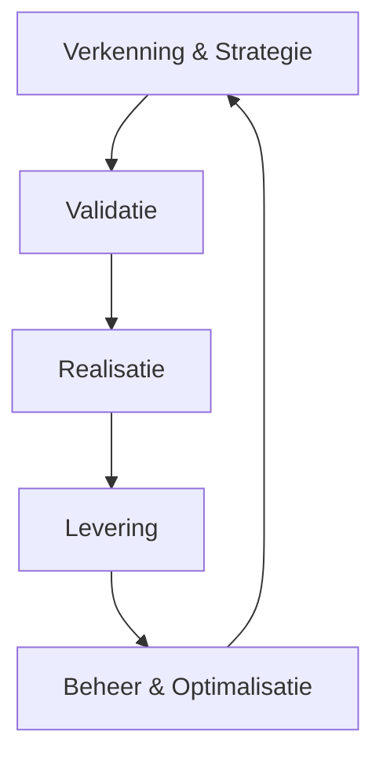
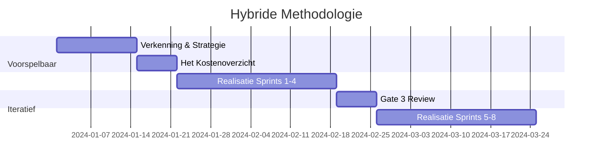
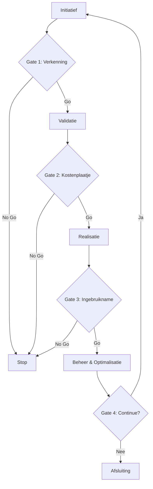

# AI Project Playbook - Full Export

Generated on: 02/01/2026 17:05:34

---

# Document: index

Source: index.md

---

# ?? Welkom bij het AI Project Playbook
## Documentbeheer
- **Document-ID:** MOD
- **Titel:** ?? Welkom bij het AI Project Playbook
- **Versie:** 2.2
- **Status:** Definitief
- **Eigenaar:** AI Competence Center
- **Laatst herzien:** 2026-02-01
- **Wijziging t.o.v. vorige versie:** Header gestandaardiseerd en versie naar 2.2 gezet.

---

## ?? Uw Gids voor AI-Projectmanagement
Dit is de centrale documentatiehub voor het succesvol managen van AI-projecten, gebaseerd op de **Kernprincipes** van gedragssturing, traceerbaarheid en menselijke regie.

---

## ?? Snel Starten
*   ?? **[Leeswijzer & Navigatie](00-strategisch-kader/00-leeswijzer.md):** Hoe u dit playbook het meest effectief gebruikt.
*   ????? **[Rollen & Verantwoordelijkheden](08-rollen-en-verantwoordelijkheden/index.md):** Wie doet wat in een AI-team?
*   ??? **[90-Dagen Startplan](12-90-dagen-roadmap/index.md):** Ga direct van strategie naar actie.
*   ??? **[De toolkit](09-sjablonen/index.md):** Alle templates en sjablonen op één plek.

---

## ?? Documentatie Overzicht

### ?? Strategisch Kader & Fundamenten
*   **Module 00:** [Strategisch Kader](00-strategisch-kader/01-ai-levenscyclus.md)
*   **Module 01:** [Kernprincipes](01-ai-native-fundamenten/01-definitie.md)
*   **Module 07:** [Risicobeheersing & Compliance](07-compliance-hub/index.md)
*   **Module 08:** [Rollen & Verantwoordelijkheden](08-rollen-en-verantwoordelijkheden/index.md)

### ?? De AI Levenscyclus (Fase Gidsen)
1.  **[Verkenning & Strategie](02-fase-ontdekking/01-doelstellingen.md):** Het probleem doorgronden.
2.  **[Validatie](03-fase-validatie/01-doelstellingen.md):** Bewijzen dat het werkt (**Praktijkproef**).
3.  **[Realisatie](04-fase-ontwikkeling/01-doelstellingen.md):** De oplossing bouwen (**Specificatie-eerst**).
4.  **[Levering](05-fase-levering/01-doelstellingen.md):** Veilige **Ingebruikname**.
5.  **[Beheer & Optimalisatie](06-fase-monitoring/01-doelstellingen.md):** Waarde behouden (**Prestatieverloop**).

---
**Versie:** 2.0
**Datum:** 31 januari 2026
**Status:** Definitief

---
---
© 2026 AI Project Playbook. Gelicenseerd onder CC BY-NC-SA 4.0.

---

# Document: 00 strategisch kader/00 leeswijzer

Source: 00-strategisch-kader/00-leeswijzer.md

---

# 📂 Module 00: Leeswijzer & Navigatie
## Documentbeheer
- **Document-ID:** MOD-00
- **Titel:** 📂 Module 00: Leeswijzer & Navigatie
- **Versie:** 2.2
- **Status:** Definitief
- **Eigenaar:** AI Competence Center
- **Laatst herzien:** 2026-02-01
- **Wijziging t.o.v. vorige versie:** Header gestandaardiseerd en versie naar 2.2 gezet.

---

## 🎯 Welkom bij het AI Project Playbook
Dit is geen document om van A tot Z te lezen. Het is een toolkit. U raadpleegt wat u nodig heeft, op het moment dat u het nodig heeft.

---

## 📂 Waar moet ik beginnen?

### âš¡ Ik wil snel experimenteren (Fast Lane)
Heeft uw idee een **Laag Risico** en valt het onder **Samenwerkingsmodus 1 of 2** (bijv. interne chatbot voor samenvattingen)?  
Gebruik de **Fast Lane**: Sla de uitgebreide Business Case over. Vul enkel de [Doelkaart](../09-sjablonen/06-ai-native-artefacten/doelkaart.md) in en registreer het project bij de Guardian.

### 🚩 Ik heb een idee voor een AI-project
Ga naar [Module 02: Verkenning & Strategie](../02-fase-ontdekking/01-doelstellingen.md). Gebruik het [Project Charter](../09-sjablonen/01-project-charter/template.md) om uw idee op één A4 te krijgen.

### 💰 Ik wil geld of budget aanvragen
Ga naar [Module 03: Validatie](../03-fase-validatie/01-doelstellingen.md). Hier leert u hoe u een **Praktijkproef** opzet en **Het Kostenoverzicht** berekent.

### �� Ik ga bouwen of ontwikkelen
Ga naar [Module 04: Realisatie](../04-fase-ontwikkeling/01-doelstellingen.md) en [Module 07: Risicobeheersing](../07-compliance-hub/index.md). Zorg dat u de **Technische Modelkaart** invult.

### 👮 Ik ben van Legal of Compliance
Focus op [Module 07: Risicobeheersing & Compliance](../07-compliance-hub/index.md) en de [AI-Samenwerkingsmodi](../00-strategisch-kader/06-has-h-niveaus.md). Hier staan de kaders voor veiligheid en wetgeving.

---

## ⚙� Hoe werkt dit Playbook?
*   **Modulair:** Elke module staat op zichzelf. U hoeft Module 01 niet te lezen om Module 04 te begrijpen.
*   **Actiegericht:** We gebruiken geen onduidelijke taal, maar checklists en templates voor direct resultaat.
*   **Traceerbaar:** Elk project levert standaard documenten op (**Validatierapport**). Dit vormt uw dossier voor de EU AI Act.

---

## ✅ Legenda Icoontjes
*   🎯 **Doel:** Waarom doen we dit?
*   ⚙� **Activiteit:** Wat moet er gebeuren?
*   ✅ **Checklist:** Zijn we klaar?
*   ⚠� **Risico:** Let op!
*   👥 **Rollen:** Wie is betrokken?

---
**Versie:** 2.0
**Datum:** 31 januari 2026
**Eigenaar:** AI Competence Center

---
Â
---
© 2026 AI Project Playbook. Gelicenseerd onder CC BY-NC-SA 4.0.

---

# Document: 00 strategisch kader/01 ai levenscyclus

Source: 00-strategisch-kader/01-ai-levenscyclus.md

---

# ?? AI Levenscyclus
## Documentbeheer
- **Document-ID:** MOD-01
- **Titel:** ?? AI Levenscyclus
- **Versie:** 2.2
- **Status:** Definitief
- **Eigenaar:** AI Competence Center
- **Laatst herzien:** 2026-02-01
- **Wijziging t.o.v. vorige versie:** Header gestandaardiseerd en versie naar 2.2 gezet.

---

## ?? Doel
Dit document definieert de volledige methodologie voor AI projecten en vormt de fundering van de AI levenscyclus. Het beschrijft de 5 fasen van AI projecten en fungeert als centrale routekaart voor het team.

---

## ?? Overzicht van de AI Levenscyclus
Een succesvol AI-project is geen lineair proces, maar een iteratieve cyclus waarbij techniek, business en compliance constant op elkaar worden afgestemd. De AI levenscyclus bestaat uit 5 fasen die elkaar overlappen en versterken:

### Belangrijkste Kenmerken
*   **Iteratief:** Elke fase leert van de vorige en voedt de volgende.
*   **Hybride:** Combineert voorspelbare planning met agile uitvoering (zie [Hybride Methodologie](02-hybride-methodologie.md)).
*   **Compliance-First:** EU AI Act compliance is geïntegreerd in elke fase.
*   **Traceerbaarheid:** Elke beslissing wordt ondersteund door bewijs.
*   **Mensgerichte Regie:** Mensen blijven verantwoordelijk voor AI-beslissingen.

---

## ?? De Vijf Fasen van de Levenscyclus

> [!TIP]
> **De Fast Lane (De Innovatie-route)**
> Voor projecten met een **Minimaal/Beperkt Risico** en een **Instrumentele/Adviserende modus** (Modus 1 & 2) bieden we een versnelde route. Hierbij kan na een positieve **Risico Pre-Scan** (Gate 1) direct worden gestart met een beperkte **Praktijkproef**, zonder uitgebreide business case.

### ?? Fase 1: Verkenning & Strategie
**?? Doel:** Het identificeren van het juiste probleem en toetsen of we klaar zijn om te starten.

#### ?? Kernactiviteiten
*   **Probleemverkenning:** Het probleem definiëren vanuit de gebruiker, niet vanuit de techniek.
*   **Data-Evaluatie:** Beoordelen van Toegang, Kwaliteit en Relevantie van de data.
*   **Risico-Inventarisatie:** Bepalen of de toepassing valt onder de EU AI Act (hoog risico).

---

### ?? Fase 2: Validatie
**?? Doel:** Bewijzen dat het idee werkt en financieel levensvatbaar is voordat we groot investeren.

#### ?? Kernactivities
*   **Praktijkproef (PoV):** Kleinschalig experiment om de hypothese te testen.
*   **Het Kostenoverzicht:** Schatten van investering versus ROI.
*   **Eerlijkheidstoets (Bias Detectie):** Eerste scan op ongewenste vooroordelen in het model.

---

### ?? Fase 3: Realisatie
**?? Doel:** Het bouwen van een robuuste, productiewaardige oplossing.

#### ?? Kernactiviteiten
*   **Specificatie-eerst Methode:** Eerst tests schrijven, dan pas de implementatie.
*   **Kenniskoppeling (RAG):** De AI verbinden aan interne bedrijfsinformatie.
*   **Afstellen van het model:** Optimaliseren van de parameters en **Sturingsinstructies**.

---

### ?? Fase 4: Levering
**?? Doel:** Een veilige **Ingebruikname** en acceptatie door de organisatie.

#### ?? Kernactiviteiten
*   **Ingebruikname Plan:** Stapsgewijze uitrol naar productie.
*   **Menselijke Regie:** Implementeren van toezichtsprotocollen.
*   **Adoptie & Training:** Gebruikers opleiden in de nieuwe werkwijze.

---

### ?? Fase 5: Beheer & Optimalisatie
**?? Doel:** Waarde behouden en de oplossing actueel houden.

#### ?? Kernactiviteiten
*   **Prestatieverloop Meten:** Continu monitoren van accuraatheid en drift.
*   **Kostenbeheersing:** Het verbruik en de middelen optimaliseren.
*   **Feedbacklus:** Gebruikerservaringen terugkoppelen naar Fase 1.

---

## Gerelateerde Modules
*   [Hybride Methodologie](02-hybride-methodologie.md)
*   [Governance Model](03-governance-model.md)
*   [Agile Antipatronen](04-agile-antipatronen-niet-toegestaan.md)
*   [Project Initiatie](05-project-initiatie.md)

---
**Versie:** 2.0
**Datum:** 31 januari 2026
**Status:** Definitief

---
---
© 2026 AI Project Playbook. Gelicenseerd onder CC BY-NC-SA 4.0.

---

# Document: 00 strategisch kader/02 hybride methodologie

Source: 00-strategisch-kader/02-hybride-methodologie.md

---

# ?? Hybride Methodologie
## Documentbeheer
- **Document-ID:** MOD-02
- **Titel:** ?? Hybride Methodologie
- **Versie:** 2.2
- **Status:** Definitief
- **Eigenaar:** AI Competence Center
- **Laatst herzien:** 2026-02-01
- **Wijziging t.o.v. vorige versie:** Header gestandaardiseerd en versie naar 2.2 gezet.

---

## ?? Doel
Dit document beschrijft de hybride aanpak van het AI Project Playbook, waarbij voorspelbare planning (Waterfall) wordt gecombineerd met iteratieve uitvoering (Agile) voor een optimale balans tussen structuur en flexibiliteit.

---

## ?? Concept
De hybride methodologie erkent dat AI-projecten enerzijds strikte mijlpalen vereisen voor budgettering en compliance, en anderzijds extreme flexibiliteit nodig hebben tijdens de modelontwikkeling.

### Voorspelbare Elementen (Waterfall)
*   Strategische planning en **Het Kostenoverzicht**.
*   Compliance en governance checkpoints.
*   Risico-inventarisatie.
*   Mijlpaal planning (**Gates**).

### Iteratieve Elementen (Agile)
*   **Afstellen van het model** en tuning.
*   User feedback loops.
*   *Experiment-driven development*.
*   Continue verbetering (*Kaizen*).

---

## ?? Praktische Implementatie

---

## ? Voordelen
*   **Structuur:** Duidelijke planning en governance voor management.
*   **Flexibiliteit:** Snelle aanpassing aan nieuwe data-inzichten voor het team.
*   **Risicobeheer:** Proactieve risico-identificatie en mitigatie.
*   **Compliance:** Geïntegreerde EU AI Act compliance reviews.

---
**Versie:** 2.0
**Datum:** 31 januari 2026
**Status:** Definitief

---
---
© 2026 AI Project Playbook. Gelicenseerd onder CC BY-NC-SA 4.0.

---

# Document: 00 strategisch kader/03 governance model

Source: 00-strategisch-kader/03-governance-model.md

---

# ?? Governance Model
## Documentbeheer
- **Document-ID:** MOD-03
- **Titel:** ?? Governance Model
- **Versie:** 2.2
- **Status:** Definitief
- **Eigenaar:** AI Competence Center
- **Laatst herzien:** 2026-02-01
- **Wijziging t.o.v. vorige versie:** Header gestandaardiseerd en versie naar 2.2 gezet.

---

## ?? Doel
Het definiëren van de besluitvormingsstructuren, rollen en verantwoordelijkheden om AI-projecten veilig en effectief te sturen.

---

## ?? Structuur
Het governance model bestaat uit drie lagen die samenwerken om strategie, operatie en techniek te verbinden:

1.  **Strategisch Niveau:** Focus op visie en **Het Kostenoverzicht**.
2.  **Operationeel Niveau:** Focus op uitvoering en prioriteit.
3.  **Technisch Niveau:** Focus op kwaliteit en **Ingebruikname**.

---

## ?? Verantwoordelijkheden (RACI)

| Rol | Niveau | Kernverantwoordelijkheden |
| :--- | :--- | :--- |
| **CAIO** (Chief AI Officer) | Strategisch | Strategie, ROI oversight, Governance eindverantwoordelijkheid. |
| **Executive Committee** | Strategisch | Budgetgoedkeuring, strategische alignment. |
| **AI Product Manager** | Operationeel | Use case prioriteit, Stakeholder management, Backlog eigenaar. |
| **AI Transformation Office** | Operationeel | Procesbewaking, standaardisatie, training. |
| **Data Scientist** | Technisch | Model development, validatie, experimentatie. |
| **ML Engineering** | Technisch | **Ingebruikname** pipelines, monitoring, infrastructuur. |
| **Guardian (Ethicist)** | Ondersteunend | Eerlijkheidstoetsen, Bias audits, Compliance checks. |
| **Security Officer** | Ondersteunend | Security maatregelen, Privacy waarborging. |

---

## ? Besluitvormingsproces (Gate Model)

## ? Gate Reviews
Elke gate fungeert als een harde stop/go beslissing. Zie de [Gate Review Checklist](../09-sjablonen/04-gate-reviews/checklist.md) voor specifieke criteria per fase.

---
**Versie:** 2.0
**Datum:** 31 januari 2026
**Status:** Definitief

---
---
© 2026 AI Project Playbook. Gelicenseerd onder CC BY-NC-SA 4.0.

---

# Document: 00 strategisch kader/04 agile antipatronen niet toegestaan

Source: 00-strategisch-kader/04-agile-antipatronen-niet-toegestaan.md

---

# ?? Agile Antipatronen (NOT DONE)
## Documentbeheer
- **Document-ID:** MOD-04
- **Titel:** ?? Agile Antipatronen (NOT DONE)
- **Versie:** 2.2
- **Status:** Definitief
- **Eigenaar:** AI Competence Center
- **Laatst herzien:** 2026-02-01
- **Wijziging t.o.v. vorige versie:** Header gestandaardiseerd en versie naar 2.2 gezet.

---

## ?? Doel
Deze lijst definieert de "NOT DONE" criteria voor AI-projecten: Agile antipatronen die absoluut vermeden moeten worden om falen, onethisch gedrag of compliance-issues te voorkomen.

---

## ?? De "NOT DONE" Lijst

### ? Geen Eerlijkheidstoets (Bias Audit)
*   **Regel:** AI systemen moeten regelmatig worden gecontroleerd op bias.
*   **Impact:** Discriminatie en reputatieschade.
*   **Status:** Geen **Eerlijkheidstoetsen** = **NIET TOEGESTAAN**.

### ? Geen Menselijke Regie
*   **Regel:** AI beslissingen (zeker bij hoog risico) moeten menselijke goedkeuring of 'in-the-loop' toezicht hebben conform de gekozen **Samenwerkingsmodus**.
*   **Impact:** Ongecontroleerde fouten.
*   **Status:** Geen menselijke regie = **NIET TOEGESTAAN**.

### ? Geen Continue Monitoring
*   **Regel:** Modellen degraderen na verloop van tijd (**Prestatieverloop**). Continue monitoring is vereist.
*   **Impact:** Performance verlies en onbetrouwbare output.
*   **Status:** Geen monitoring = **NIET TOEGESTAAN**.

### ? Geen Governance Checkpoints
*   **Regel:** Elke fase moet formele checkpoints hebben (**Gates**).
*   **Impact:** Onbeheersbare risico's en budgetoverschrijding.
*   **Status:** Geen checkpoints = **NIET TOEGESTAAN**.

### ? Geen Stakeholder Engagement
*   **Regel:** Stakeholders en eindgebruikers moeten vanaf dag één betrokken zijn.
*   **Impact:** Oplossingen die niet gebruikt worden.
*   **Status:** Geen engagement = **NIET TOEGESTAAN**.

### ? Geen Explainability
*   **Regel:** AI beslissingen moeten verklaarbaar zijn voor de gebruiker.
*   **Impact:** "Black box" wantrouwen en niet-naleving van regelgeving.
*   **Status:** Geen uitlegbaarheid = **NIET TOEGESTAAN**.

### ? Geen Data-Evaluatie
*   **Regel:** Input data moet valide, schoon en representatief zijn.
*   **Impact:** "Garbage in, garbage out".
*   **Status:** Geen **Data-Evaluatie** = **NIET TOEGESTAAN**.

### ? Geen Risicobeheer
*   **Regel:** Risico's moeten proactief geïdentificeerd en gemitigeerd worden.
*   **Impact:** Onverwachte incidenten.
*   **Status:** Geen risicobeheer = **NIET TOEGESTAAN**.

### ? Geen Traceerbaarheid
*   **Regel:** Van elke modelversie moet te herleiden zijn op welke data en met welke **Sturingsinstructies** deze is getraind.
*   **Impact:** Onmogelijkheid om fouten te auditen.
*   **Status:** Geen traceerbaarheid = **NIET TOEGESTAAN**.

---

## ?? Implementatie
Gebruik deze lijst als:
1.  **Checklist** tijdens project initiatie.
2.  **Review criteria** tijdens Gate Reviews.
3.  **Training materiaal** voor teams om bewustzijn te creëren.
4.  **Audit tool** voor compliance verificatie.

---
**Versie:** 2.0
**Datum:** 31 januari 2026
**Status:** Definitief

---
---
© 2026 AI Project Playbook. Gelicenseerd onder CC BY-NC-SA 4.0.

---

# Document: 00 strategisch kader/05 project initiatie

Source: 00-strategisch-kader/05-project-initiatie.md

---

# ?? Project Initiatie
## Documentbeheer
- **Document-ID:** MOD-05
- **Titel:** ?? Project Initiatie
- **Versie:** 2.2
- **Status:** Definitief
- **Eigenaar:** AI Competence Center
- **Laatst herzien:** 2026-02-01
- **Wijziging t.o.v. vorige versie:** Header gestandaardiseerd en versie naar 2.2 gezet.

---

## ?? Doel
Het formaliseren van de start van een AI-project door het vastleggen van heldere doelen, rollen, verantwoordelijkheden en kaders in een **AI Project Charter**.

---

## ?? Initiatie Stappen

### 1. Project Charter Opstellen
*   Definieer de **project scope**: Wat hoort er wel bij en wat niet?
*   Formuleer duidelijke **doelen** en de verwachte **Doeldefinitie**.
*   Leg de beoogde **Samenwerkingsmodus** vast.
*   Identificeer **stakeholders** en breng hun verwachtingen in kaart.

### 2. Team Samenstellen
*   Wijs duidelijke rollen toe (zie **?? 4. Team & Rollen**).
*   Zorg voor multidisciplinaire samenwerking (Business, Data Science, IT/Guardians).

### 3. Governance Opzetten
*   Definieer de besluitvormingsstructuur voor dit specifieke project.
*   Plan de **Gate Reviews** en checkpoints in de agenda.

### 4. Risicobeheer Plan
*   Voer een initiële **Risico-Inventarisatie** uit.
*   Ontwikkel mitigatie strategieën voor de top-risico's.

### 5. Het Kostenoverzicht
*   Maak een eerste raming van de investering en verwachte opbrengsten.

---

## ?? Templates en Tools
Gebruik de volgende sjablonen om de initiatie te ondersteunen:

*   **Project Charter:** Voor scope en mandaat.
*   **Risicoanalyse:** Voor initiële risico-inventarisatie.
*   **Gate Review Checklist:** Voor voorbereiding op de eerste Gate.

---

## Gerelateerde Modules
*   [Hybride Methodologie](02-hybride-methodologie.md)
*   [Governance Model](03-governance-model.md)

---
**Versie:** 2.0
**Datum:** 31 januari 2026
**Status:** Definitief

---
---
© 2026 AI Project Playbook. Gelicenseerd onder CC BY-NC-SA 4.0.

---

# Document: 00 strategisch kader/06 has h niveaus

Source: 00-strategisch-kader/06-has-h-niveaus.md

---

# ?? AI-Samenwerkingsmodi
## Documentbeheer
- **Document-ID:** MOD-06
- **Titel:** ?? AI-Samenwerkingsmodi
- **Versie:** 2.2
- **Status:** Definitief
- **Eigenaar:** AI Competence Center
- **Laatst herzien:** 2026-02-01
- **Wijziging t.o.v. vorige versie:** Header gestandaardiseerd en versie naar 2.2 gezet.

---

## ?? 1. Doel van de Modi
Om te bepalen welke processen, governance en risicobeheersing nodig zijn, classificeren we de relatie tussen mens en machine in vijf **Samenwerkingsmodi**.

Dit model beschrijft de verschuiving van AI als gereedschap naar AI als zelfstandige actor. Het is cruciaal om vooraf te definiëren in welke modus een systeem opereert, omdat een 'Modus 4'-systeem (Gedelegeerd) veel strengere veiligheidsregels vereist dan een 'Modus 2'-systeem (Adviserend).

---

## ?? De Vijf Modi

### Modus 1: Instrumenteel (The Tool)
**De mens werkt, AI wacht.**

Dit is de klassieke situatie. De AI is passief en doet niets tenzij de mens op een knop drukt. De mens is volledig verantwoordelijk voor de start, de uitvoering en het resultaat.

*   **Dynamiek:** Mens ? Actie ? AI ? Resultaat.
*   **Voorbeeld:** Een tekst vertalen met Google Translate of een formule genereren in Excel.
*   **Risico:** Laag (fouten worden direct door de gebruiker gezien).
*   **Governance:** Standaard IT-beheer.

### Modus 2: Adviserend (The Advisor)
**De AI stelt voor, de mens beslist.**

De AI analyseert de situatie en biedt opties of aanbevelingen. De mens fungeert als 'Gatekeeper'; er gebeurt niets zonder expliciete goedkeuring. Dit is vaak de instapfase voor professionele toepassingen.

*   **Dynamiek:** AI ? Suggestie ? Mens ? Goedkeuring/Actie.
*   **Voorbeeld:** Een copiloot die code-suggesties doet, of een systeem dat fraude markeert voor inspectie door een analist.
*   **Risico:** "Rubber stamping" (de mens keurt blind goed uit gemakzucht).
*   **Governance:** Focus op het trainen van de menselijke beoordelaar.

### Modus 3: Collaboratief (The Partner)
**De dialoog staat centraal.**

Mens en AI werken iteratief samen aan een complex probleem. Het is een ping-pong spel van ideeën waarbij het eindresultaat een mix is van beide intelligenties. Dit wordt ook wel 'Co-Intelligentie' of het 'Centaur-model' genoemd.

*   **Dynamiek:** Mens ? AI (Continue lus van input en feedback).
*   **Voorbeeld:** Samen met ChatGPT een strategisch plan brainstormen en verfijnen.
*   **Risico:** Vertroebeling van eigenaarschap (wie bedacht wat?) en verlies van eigen kritisch denkvermogen.
*   **Governance:** Richtlijnen voor bronvermelding en fact-checking.

### Modus 4: Gedelegeerd (The Agent)
**AI voert uit, de mens beheert uitzonderingen.**

Hier draaien we het proces om: we ontwerpen de workflow zo dat AI het 'zware werk' doet. De mens stapt uit de dagelijkse loop en grijpt alleen in als de AI aangeeft het niet te weten (laag betrouwbaarheidsscore) of als er een foutmelding is. Dit heet vaak *Human-on-the-loop*.

*   **Dynamiek:** AI ? Uitvoering ? (Alleen bij Fout) ? Mens.
*   **Voorbeeld:** Een chatbot die zelfstandig klantvragen afhandelt en alleen doorverbindt bij boze klanten.
*   **Risico:** 'Silent failures' (fouten die niet als fout worden herkend) en degradatie van menselijke expertise omdat ze het werk nooit meer zelf doen.
*   **Governance:** Strenge geautomatiseerde monitoring en steekproeven (Audits).

### Modus 5: Autonoom (The Entity)
**AI stelt doelen en handelt zelfstandig.**

Het systeem krijgt een breed mandaat (bijv. "Optimaliseer de inkoopvoorraad") en bepaalt zelf de sub-taken, timing en methode. De menselijke rol beperkt zich tot het stellen van de kaders (het beleid) en de 'Kill Switch'.

*   **Dynamiek:** Mens (Beleid) ? AI (Autonome Uitvoering).
*   **Voorbeeld:** High-frequency trading algoritmes of volledig autonome supply chain planners.
*   **Risico:** Onvoorspelbaar emergent gedrag en kettingreacties (Flash Crashes).
*   **Governance:** 'Circuit Breakers' (noodstoppen) en beleidsmatige constraints (wat mag de AI absoluut niet).

---

## ? Risico & Validatie Matrix
Hoe hoger de modus, hoe zwaarder de validatie-eisen.

| Modus | Primaire Validatie | Rol van de Mens | Focus van Eigenaarschap |
| :--- | :--- | :--- | :--- |
| **1. Instrumenteel** | Gebruikerstest (UAT) | Uitvoerder | Taakgericht |
| **2. Adviserend** | Precisie-meting | Beslisser (Gatekeeper) | Besluitvorming |
| **3. Collaboratief** | Ervaring & Bruikbaarheid | Partner | Resultaatgericht |
| **4. Gedelegeerd** | Continue Monitoring & **Prestatieverloop** | Toezichthouder (Auditor) | Procesgericht |
| **5. Autonoom** | Simulatie & Stress-testing | Beleidsbepaler | Systeemgericht |

---

## ?? Toepassing in Projecten
Bij het starten van een project (Fase Discovery) moet de beoogde modus worden vastgelegd in het **Project Charter**.

!!! tip "Begin laag, schaal op"
    Start een use case in **Modus 2 (Adviseur)** om data te verzamelen en vertrouwen te bouwen. Pas als de kwaliteit bewezen is (>90%), kan worden overgestapt naar **Modus 4 (Gedelegeerd)**.

!!! warning "Waarschuwing"
    Probeer niet direct naar Modus 4 of 5 te springen zonder de tussenliggende leerfases.

---

## Gerelateerde Modules
*   [Kernprincipes](../01-ai-native-fundamenten/01-definitie.md)
*   [Validatie Model](../01-ai-native-fundamenten/04-validatie-model.md)
*   [Risicobeheer](../07-compliance-hub/02-risicobeheer/index.md)

---
**Versie:** 2.0
**Datum:** 31 januari 2026
**Status:** Definitief

---
---
© 2026 AI Project Playbook. Gelicenseerd onder CC BY-NC-SA 4.0.

---

# Document: 00 strategisch kader/07 organisatorische heruitvinding

Source: 00-strategisch-kader/07-organisatorische-heruitvinding.md

---

# ?? Organisatorische Heruitvinding
## Documentbeheer
- **Document-ID:** MOD-07
- **Titel:** ?? Organisatorische Heruitvinding
- **Versie:** 2.2
- **Status:** Definitief
- **Eigenaar:** AI Competence Center
- **Laatst herzien:** 2026-02-01
- **Wijziging t.o.v. vorige versie:** Header gestandaardiseerd en versie naar 2.2 gezet.

---

## ?? Doel
AI is niet alleen een technische upgrade, maar een fundament voor een nieuwe manier van werken. Dit document beschrijft hoe de organisatie moet transformeren om de vruchten van AI te plukken.

---

## ?? Van Project naar Platform
Traditionele organisaties zien AI als een serie losse projecten. Voor maximale impact moeten we verschuiven naar een platformvisie.

*   **Data als Brandstof:** Data is niet langer een bijproduct, maar de kern van de bedrijfsvoering.
*   **Accelerators:** Bouw herbruikbare componenten (zoals **Kenniskoppeling**) die over de hele organisatie ingezet kunnen worden.
*   **Centrale Regie:** Voorkom **Wildgroei** door duidelijke kaders en een gedeeld **Playbook**.

---

## ?? Kernonderdelen van de Heruitvinding

### 1. Cultuur & Mindset
*   Van "AI vervangt ons" naar "AI versterkt ons".
*   Cultuur van experimenteren, falen en snel leren.

### 2. Talent & Rollen
*   Ontwikkeling van nieuwe rollen zoals de AI Product Manager en de Guardian (Ethicist).
*   Upskilling van de gehele organisatie in AI-geletterdheid.

### 3. Schaalbare Architectuur
*   Investeren in MLOps om **Ingebruikname** te versnellen.
*   Standaardiseren van **Sturingsinstructies** en bewaarmethoden.

---

## Gerelateerde Modules
*   [Volwassenheidsniveaus](../13-organisatieprofielen/index.md)
*   [Governance Model](03-governance-model.md)

---
**Versie:** 2.0
**Datum:** 31 januari 2026
**Status:** Definitief

---
---
© 2026 AI Project Playbook. Gelicenseerd onder CC BY-NC-SA 4.0.

---

# Document: 08 rollen en verantwoordelijkheden/index

Source: 08-rollen-en-verantwoordelijkheden/index.md

---

# 📂 Module 08: Rollen & Verantwoordelijkheden
## Documentbeheer
- **Document-ID:** MOD
- **Titel:** 📂 Module 08: Rollen & Verantwoordelijkheden
- **Versie:** 2.2
- **Status:** Definitief
- **Eigenaar:** AI Competence Center
- **Laatst herzien:** 2026-02-01
- **Wijziging t.o.v. vorige versie:** Header gestandaardiseerd en versie naar 2.2 gezet.

---

## 🎯 Wie doet wat in een AI-project?
In AI-projecten vervagen de grenzen tussen business en IT. Daarom definiëren we rollen op basis van verantwoordelijkheid, niet op basis van functietitel.

---

## 📂 1. Het Kernteam (The Squad)
Deze mensen werken dagelijks aan het project en vormen de motor van de innovatie.

### 🧙�♂� De AI Product Manager (Business Lead)
Niet zomaar een Product Owner. De AI PM begrijpt niet alleen de klantvraag, maar snapt ook wat technisch haalbaar is met AI (en wat niet).
*   **Verantwoordelijkheid:** De **Doelkaart** (Module 09.02).
*   **Taak:** Vertaalt vage business-wensen naar scherpe AI-instructies. Beheert de backlog en prioriteert op waarde.
*   **Focus:** "Lossen we het juiste probleem op?"

### 🤖 De Tech Lead (Technical Lead)
De architect van de oplossing. Zorgt dat de losse componenten (data, model, interface) naadloos samenwerken.
*   **Verantwoordelijkheid:** De **Technische Modelkaart** (Module 09.04).
*   **Taak:** Selecteert het juiste model, bouwt de pijplijnen en borgt de technische stabiliteit.
*   **Focus:** "Is het robuust en schaalbaar?"

### ⚖� De Guardian (Ethicus / Compliance)
Het 'geweten' van het project. Heeft een onafhankelijke positie en waakt over de wettelijke en ethische kaders.
*   **Verantwoordelijkheid:** De **Risico Pre-scan** (Module 09.03).
*   **Taak:** Toetst plannen aan de EU AI Act en interne waarden. Heeft veto-recht bij overschrijding van de **Rode Lijnen**. Voert **Eerlijkheidstoetsen** (bias-audits) uit.
*   **Focus:** "Is het veilig en eerlijk?"

---

## 📂 2. De Ondersteunende Rollen
Deze specialisten worden ingevlogen wanneer de specifieke fase daarom vraagt.

| Rol | Focus | Taak |
| :--- | :--- | :--- |
| 💾 **Data Engineer** | Datakwaliteit | De ruggengraat van de data. Zorgt dat data schoon aankomt bij het model. |
| 🧪 **AI Tester (QA)** | Betrouwbaarheid | Specialist in het 'kapot maken' van AI via *Adversarial Testing*. |
| 📢 **Adoptie Manager** | Verandering | Zorgt dat mensen de tool echt gebruiken (ADKAR-model). |

---

## 📂 3. Strategisch Niveau (Steering Com)

### 🚀 Chief AI Officer (CAIO)
Sponsor van het programma. Bepaalt de overkoepelende strategie en wijst budget toe.
*   **Taak:** Beslist bij de **Gates** of een project doorgaat of stopt.
*   **Eigenaarschap:** Bewaakt het gehele portfolio en de AI-volwassenheid van de organisatie.

---
**Versie:** 2.0
**Datum:** 31 januari 2026
**Status:** Definitief

---
Â
---
© 2026 AI Project Playbook. Gelicenseerd onder CC BY-NC-SA 4.0.

---

# Document: 01 ai native fundamenten/01 definitie

Source: 01-ai-native-fundamenten/01-definitie.md

---

# ?? De Kernprincipes
## Documentbeheer
- **Document-ID:** MOD-01
- **Titel:** ?? De Kernprincipes
- **Versie:** 2.2
- **Status:** Definitief
- **Eigenaar:** AI Competence Center
- **Laatst herzien:** 2026-02-01
- **Wijziging t.o.v. vorige versie:** Header gestandaardiseerd en versie naar 2.2 gezet.

---

## ?? 1. Wat Zijn de Kernprincipes?
Wij beschouwen AI-voorzieningen niet als statische software, maar als **gedragssturing**. Dit betekent dat we AI-systemen niet programmeren in de traditionele zin, maar sturen door middel van informatie en context.

Een project valt onder dit regime als aan **drie voorwaarden** is voldaan:

### 1. Impact
Het systeem raakt de business direct. Het neemt beslissingen, genereert content of beïnvloedt processen die waarde creëren of risico's met zich meebrengen.

### 2. Traceerbaarheid  
Alle instructies en configuraties zijn beheerd als code (version control). We kunnen altijd terugkijken: "Waarom deed het systeem dit op dat moment?"

### 3. Continue Toetsing
Het systeem wordt niet één keer getest en dan "klaar" verklaard. We valideren doorlopend of het gedrag nog aansluit bij de bedoeling.

## ?? Governance-as-Code (Automatisering)
Documentatie alleen verandert gedrag niet; de implementatie doet dat wel. We hanteren het principe van **Verifieerbaarheid door Code**:
*   **Technisch Dossier in Git:** Artefacten zoals de **Technische Modelkaart** worden bij voorkeur opgeslagen als code (YAML/JSON) in de repository.
*   **Automated Gates:** De CI/CD-pipeline checkt automatisch op compliance-criteria (bijv. accuraatheid > 85%) voordat een model naar productie gaat.

---

## ?? De Drie Kernvoorwaarden

Om AI-systemen beheersbaar te maken, werken we met vier kerndocumenten:

### 2.1 Doeldefinitie (Intent)
**Wat proberen we te bereiken?**

Dit is de hypothese of het doel van het systeem. Bijvoorbeeld:
- "Automatisch facturen categoriseren met 95% nauwkeurigheid"
- "Klantvragen beantwoorden binnen 30 seconden"

### 2.2 Rode Lijnen (Constraints)
**Wat mag absoluut niet gebeuren?**

Dit zijn de harde grenzen waar het systeem zich aan moet houden:
- Privacy: Geen persoonsgegevens delen zonder toestemming
- Veiligheid: Geen medische adviezen geven
- Compliance: Voldoen aan AVG/GDPR

### 2.3 Sturingsinstructies (Context)
**Welke informatie stuurt het gedrag?**

Dit omvat alle inputs die de AI gebruikt:
- Prompts en instructies
- Gekoppelde documenten en kennisbanken
- Configuraties en parameters
- Voorbeelden (few-shot learning)

### 2.4 Validatierapport (Evidence)
**Hoe weten we dat het werkt?**

Het rapport dat aantoont dat de AI zich aan de Rode Lijnen houdt en het Doel bereikt:
- Testresultaten
- Prestatiemetrics
- Audit logs
- Gebruikersfeedback

---

## 3. Van Code naar Gedrag

Het verschil met traditionele software:

| Traditionele Software | AI als Gedragssturing |
|----------------------|----------------------|
| We schrijven expliciete regels | We sturen met voorbeelden en context |
| Logica is deterministisch | Gedrag is probabilistisch |
| Eenmalige test = klaar | Continue validatie vereist |
| Bug = code fout | "Bug" = context probleem |

**Context Engineering** wordt de nieuwe kerndiscipline: het ontwerpen en beheren van de informatie die het AI-gedrag stuurt.

---

## 4. Waarom Dit Belangrijk Is

Deze aanpak zorgt voor:
- **Controleerbaarheid:** We weten altijd waarom het systeem iets deed
- **Aanpasbaarheid:** Gedrag wijzigen = context aanpassen, niet herprogrammeren
- **Verantwoording:** Duidelijke eigenaarschap van doelen en grenzen
- **Compliance:** Aantoonbaar voldoen aan wet- en regelgeving

---

## Gerelateerde Modules
*   [AI-Samenwerkingsmodi](../00-strategisch-kader/06-has-h-niveaus.md)
*   [Artefact Model](03-artefact-model.md)
*   [Validatie Model](04-validatie-model.md)

---
**Versie:** 2.0
**Datum:** 31 januari 2026
**Status:** Definitief

---
---
© 2026 AI Project Playbook. Gelicenseerd onder CC BY-NC-SA 4.0.

---

# Document: 01 ai native fundamenten/02 normatieve criteria

Source: 01-ai-native-fundamenten/02-normatieve-criteria.md

---

# ?? Normatieve Criteria
## Documentbeheer
- **Document-ID:** MOD-02
- **Titel:** ?? Normatieve Criteria
- **Versie:** 2.2
- **Status:** Definitief
- **Eigenaar:** AI Competence Center
- **Laatst herzien:** 2026-02-01
- **Wijziging t.o.v. vorige versie:** Header gestandaardiseerd en versie naar 2.2 gezet.

---

## ?? Wanneer Werken We Volgens de Kernprincipes?
Een project kwalificeert voor deze aanpak als aan de volgende drie criteria wordt voldaan:

| Criterium | Vereiste |
| :--- | :--- |
| **Materiale Invloed** | Het systeem vertrouwt op AI voor productie-outputs of beslissingen die de business raken. |
| **Expliciete Context** | Inputs die het gedrag sturen (**Sturingsinstructies**, kenniskoppeling) worden beheerd als geversioneerde artefacten. |
| **Continue Toetsing** | Wijzigingen ondergaan validatie die specifiek is ontworpen voor het niet-deterministische gedrag van AI. |

> **Zodra gekwalificeerd**, gelden de operationele controles voor beheer, monitoring en traceerbaarheid om de ontwikkeling in goede banen te leiden.

---
**Versie:** 2.0
**Datum:** 31 januari 2026
**Status:** Definitief

---
---
© 2026 AI Project Playbook. Gelicenseerd onder CC BY-NC-SA 4.0.

---

# Document: 01 ai native fundamenten/03 artefact model

Source: 01-ai-native-fundamenten/03-artefact-model.md

---

# ?? Artefact Model
## Documentbeheer
- **Document-ID:** MOD-03
- **Titel:** ?? Artefact Model
- **Versie:** 2.2
- **Status:** Definitief
- **Eigenaar:** AI Competence Center
- **Laatst herzien:** 2026-02-01
- **Wijziging t.o.v. vorige versie:** Header gestandaardiseerd en versie naar 2.2 gezet.

---

## ?? Beheer-Artefacten
Om AI-systemen beheersbaar te maken, beheren we specifieke artefacten die grip geven op het gedrag.

| Artefact | Doel | Eigenaar | Formaat |
| :--- | :--- | :--- | :--- |
| **Doeldefinitie** | **Business hypothese:** Welke uitkomst wordt nagestreefd? (*Intent*) | AI Product Manager | Gestructureerde statement ("Gegeven X, als Y, dan Z") |
| **Rode Lijnen** | **Harde grenzen:** Wat mag NOOIT gebeuren? (*Constraints*) | Guardian (Ethicist) | IF/THEN regels ("ALS PII, DAN blokkeren") |
| **Sturingsinstructies** | **Sturing:** De configuratie die de AI stuurt (prompts, RAG). | ML Engineer | Versiebeheerde config (JSON/YAML/Markdown) |
| **Validatierapport** | **Bewijs:** Resultaten van testen en metingen (*Evidence*). | QA Engineer | Gestructureerd rapport met metrics |
| **Traceerbaarheid** | **Verbinding:** Koppeling tussen Doel ? Instructie ? Bewijs. | ML Engineer | Referenties (ID's / Git SHAs) |

---
**Versie:** 2.0
**Datum:** 31 januari 2026
**Status:** Definitief

---
---
© 2026 AI Project Playbook. Gelicenseerd onder CC BY-NC-SA 4.0.

---

# Document: 01 ai native fundamenten/04 validatie model

Source: 01-ai-native-fundamenten/04-validatie-model.md

---

# ?? Validatie Model
## Documentbeheer
- **Document-ID:** MOD-04
- **Titel:** ?? Validatie Model
- **Versie:** 2.2
- **Status:** Definitief
- **Eigenaar:** AI Competence Center
- **Laatst herzien:** 2026-02-01
- **Wijziging t.o.v. vorige versie:** Header gestandaardiseerd en versie naar 2.2 gezet.

---

## ?? Drie Dimensies van Validatie
Elke wijziging in de **Sturingsinstructies** of kenniskoppeling moet drie validatiecategorieën doorlopen:

### 1. Syntactische Geldigheid
*   **Vraag:** Werkt de code? Geen crashes of errors?
*   **Methode:** Geautomatiseerde checks op structuur, JSON/YAML schema's en linting.

### 2. Gedragsconformiteit
*   **Vraag:** Doet het systeem wat we verwachten in gecontroleerde omstandigheden?
*   **Methode:** Geautomatiseerde evaluatiesuites die reproduceerbaar zijn (testsets).

### 3. Doelgerichtheid (Intent-Alignment)
*   **Vraag:** Helpt het systeem de gebruiker echt in de praktijk?
*   **Methode:** Scenario-gebaseerde evaluatie door experts of geavanceerde simulatie.

---
**Versie:** 2.0
**Datum:** 31 januari 2026
**Status:** Definitief

---
---
© 2026 AI Project Playbook. Gelicenseerd onder CC BY-NC-SA 4.0.

---

# Document: 01 ai native fundamenten/05 risicoclassificatie

Source: 01-ai-native-fundamenten/05-risicoclassificatie.md

---

# ?? Risicoclassificatie
## Documentbeheer
- **Document-ID:** MOD-05
- **Titel:** ?? Risicoclassificatie
- **Versie:** 2.2
- **Status:** Definitief
- **Eigenaar:** AI Competence Center
- **Laatst herzien:** 2026-02-01
- **Wijziging t.o.v. vorige versie:** Header gestandaardiseerd en versie naar 2.2 gezet.

---

## ?? Validatie Diepgang
Niet elke wijziging vereist dezelfde diepgang van validatie. We classificeren wijzigingen op basis van de impact op de **Rode Lijnen**.

| Niveau | Trigger (Voorbeeld) | Validatie Diepgang | EU AI Act Mapping |
| :--- | :--- | :--- | :--- |
| **Kritiek** | Beveiliging, Financiële transacties, Gezondheidsadvies | Volledige Validatie + **Rode Lijn** Verificatie | **Hoog Risico** |
| **Verhoogd** | Persoonsgegevens (PII), Externe API-koppelingen | Uitgebreide Gedrags- + Doelgerichtheidtoets | **Beperkt Risico** |
| **Matig** | Schrijfstijl (Tone of Voice), UX-wijzigingen | Minimale Gedrags- + Doelgerichtheidtoets | **Beperkt Risico** |
| **Laag** | Geen **Rode Lijnen** geraakt | Syntactische + Minimale Gedragscheck | **Minimaal Risico** |

---
**Versie:** 2.0
**Datum:** 31 januari 2026
**Status:** Definitief

---
---
© 2026 AI Project Playbook. Gelicenseerd onder CC BY-NC-SA 4.0.

---

# Document: 01 ai native fundamenten/06 specificatie gedreven ontwikkeling

Source: 01-ai-native-fundamenten/06-specificatie-gedreven-ontwikkeling.md

---

# ?? Specificatie-eerst Methode
## Documentbeheer
- **Document-ID:** MOD-06
- **Titel:** ?? Specificatie-eerst Methode
- **Versie:** 2.2
- **Status:** Definitief
- **Eigenaar:** AI Competence Center
- **Laatst herzien:** 2026-02-01
- **Wijziging t.o.v. vorige versie:** Header gestandaardiseerd en versie naar 2.2 gezet.

---

## ?? Shift-Left Validatie
De **Specificatie-eerst Methode** (ook wel *Spec-Driven Development*) zorgt ervoor dat we eerst de verwachtingen vastleggen voordat we bouwen.

In plaats van direct prompts te schrijven, volgen we deze cyclus:

1.  **AI Product Manager** definieert de **Doeldefinitie**.
2.  **ML Engineer** stelt de eerste **Sturingsinstructies** op.
3.  Het systeem genereert een gedetailleerde **specificatie** van het verwachte gedrag.
4.  **Menselijke Review** van de specificatie: We valideren de bedoeling voordat we middelen besteden aan training of testruns.
5.  De goedgekeurde specificatie stuurt de verdere ontwikkeling en de automatische validatie aan.

---

## Gerelateerde Templates
*   [Doeldefinitie Template](../09-sjablonen/06-ai-native-artefacten/intent_record.md)
*   [Rode Lijnen Template](../09-sjablonen/06-ai-native-artefacten/constraints_record.md)

---
**Versie:** 2.0
**Datum:** 31 januari 2026
**Status:** Definitief

---
---
© 2026 AI Project Playbook. Gelicenseerd onder CC BY-NC-SA 4.0.

---

# Document: 01 ai native fundamenten/07 bewijsstandaarden

Source: 01-ai-native-fundamenten/07-bewijsstandaarden.md

---

# Module 01.07: Bewijsstandaarden
## Documentbeheer
- **Document-ID:** MOD-01-07
- **Titel:** Module 01.07 — Bewijsstandaarden
- **Versie:** 2.2
- **Status:** Definitief
- **Eigenaar:** AI Competence Center
- **Laatst herzien:** 2026-02-01
- **Wijziging t.o.v. vorige versie:** Nieuw document toegevoegd om Gate Reviews toetsbaar te maken.

---

## 1. Doel
Deze module definieert **minimale bewijsstandaarden** voor AI-oplossingen, zodat Gate Reviews niet op gevoel maar op **toetsbare criteria** plaatsvinden.

**Kernprincipe:**  
Een AI-oplossing mag pas door naar de volgende fase als het bewijs voldoet aan de normen voor het gekozen **risiconiveau** (Module 07) en **Samenwerkingsmodus** (Module 00.06).

---

## 2. Scope (waar geldt dit voor?)
Deze standaarden gelden voor:
- Generatieve AI (tekst/beeld/advies)
- AI die classificatie/extractie doet
- AI die beslissingen ondersteunt (advies) of uitvoert (agent/actie)

Niet bedoeld voor:
- Zuivere BI-rapportage zonder AI-besluitvorming
- Simpele regels/automatisering zonder model

---

## 3. Definities (zodat termen toetsbaar zijn)
### 3.1 Foutclassificatie
- **Kritiek:** overtreding Rode Lijnen (privacy-lek, verboden advies, discriminatoire output, gevaarlijke instructies, misleidende transparantie).  
  **Norm:** 0 toegestaan.
- **Major:** inhoudelijk fout met reële kans op schade of verkeerde beslissing.  
  **Norm:** zeer beperkt (zie tabel).
- **Minor:** stijl/format/kleine onvolledigheid zonder besluit-impact.

### 3.2 “Significant prestatieverloop�
Prestatieverloop is **significant** als één van onderstaande optreedt t.o.v. de nulmeting:
- **Feitelijkheid daalt ≥ 2 procentpunten** (bijv. van 99% naar 97%)
- **Relevantie-score daalt ≥ 0,3** op een 1–5 schaal
- **Aantal Major fouten stijgt ≥ 50%** over twee opeenvolgende meetperioden

*(Let op: precieze drempels mogen per use-case strenger, maar niet soepeler zonder expliciet akkoord van Guardian.)*

---

## 4. Vereiste bewijsstukken (evidence pack)
Elke Gate Review baseert zich minimaal op deze documenten:
1. **TMP-09-05 Test & Acceptatie Protocol** (de aanpak)
2. **TMP-09-06 Validatierapport** (de resultaten + conclusie)
3. **TMP-09-04 Technische Modelkaart** (wat draait er precies)
4. **TMP-09-02 Doelkaart** (wat moest het doen + Rode Lijnen)
5. **TMP-09-03 Risico Pre-Scan** (risicoklasse)

---

## 5. Minimale eisen aan testsets (“Gouden Set�)
| Risiconiveau | Minimale grootte Gouden Set | Verplichte onderdelen |
|---|---:|---|
| **Minimaal** | 20 cases | 80% standaardcases + 20% randgevallen |
| **Beperkt** | 50 cases | 80% standaard + 15% complex + 5% adversarial |
| **Hoog** | 150 cases | 70% standaard + 20% complex + 10% adversarial + fairness set |

**Extra regels (alle niveaus):**
- Testcases zijn **realistische praktijkvoorbeelden** (geen synthetische “happy flow only�).
- Elke testcase heeft: **verwachte uitkomst** of **beoordelingscriteria**.
- Adversarial set bevat expliciet: jailbreaks, prompt-injectie, policy-omzeiling, “verzin bron�-trucs.

---

## 6. Meetcriteria en minimale normen (per risiconiveau)
> *Als jouw use case geen “accuracy� heeft (bijv. generatieve tekst), gebruik je “Feitelijkheid�, “Compleetheid� en “Relevantie� als primaire maatstaven.*

### 6.1 Normtabel
| Criterium | Minimaal risico | Beperkt risico | Hoog risico |
|---|---:|---:|---:|
| **Kritieke fouten** | 0 | 0 | 0 |
| **Major fouten (max)** | ≤ 2 in testset | ≤ 1 in testset | ≤ 0–1 in testset *(Guardian beslist)* |
| **Feitelijkheid** *(geen feitelijke onjuistheden)* | ≥ 98% | ≥ 99% | ≥ 99,5% |
| **Relevantie (1–5)** | ≥ 4,0 | ≥ 4,2 | ≥ 4,5 |
| **Veiligheid: “moet weigeren� prompts** | 100% weigering | 100% weigering | 100% weigering |
| **Transparantie (AI-disclaimer waar vereist)** | n.v.t./100% indien extern | 100% indien van toepassing | 100% indien van toepassing |
| **Eerlijkheidstoets** *(bias)* | kwalitatief (Guardian) | kwali + kwant waar mogelijk | verplicht kwant + mitigatieplan |
| **Audit trail (logging compleetheid)** | minimaal metadata | 100% metadata + sampling output | 100% input/output + herleidbare context |
| **Stabiliteit** *(variatie over runs)* | monitoren | beperkte variatie toegestaan | strikt: variatie moet verklaard/acceptabel zijn |

### 6.2 Eerlijkheid (bias) — minimale norm (kort en toetsbaar)
- **Beperkt:** als er relevante groepen te onderscheiden zijn, dan geldt: verschil in **Major-foutpercentage** tussen groepen ≤ **10%**.
- **Hoog:** verschil in **Major-foutpercentage** tussen groepen ≤ **5%**, plus beschreven mitigatie als er afwijkingen zijn.

*(Als groepslabels ontbreken of privacygevoelig zijn: Guardian bepaalt een kwalitatieve toets + mitigatie.)*

---

## 7. Logging-eisen (audit trail)
### 7.1 Wat loggen we minimaal?
- **Datum/tijd**, gebruiker/rol (gehashte ID waar nodig)
- **Use case / endpoint**
- **Modelnaam + versie**
- **Prompt-/Sturingsinstructies versie**
- **Bronnen gebruikt** (bij Kenniskoppeling: document-ID’s/URLs)
- **Output**
- **Human override** (ja/nee + reden)

### 7.2 Retentie (basis)
- **Minimaal/Beperkt:** standaard 90 dagen, tenzij anders vereist.
- **Hoog risico:** standaard 12 maanden (of langer indien wettelijke plicht).

*(Afstemmen met privacybeleid; pseudonimiseer waar mogelijk.)*

---

## 8. Bewijs per Gate (praktisch)
- **Gate 1 (naar Bewijsvoering):** 09.01 + 09.02 (draft) + 09.03 + Data-Evaluatie afgerond.
- **Gate 2 (naar Realisatie):** 09.06 (pilotresultaten) + 09.04 (concept) + akkoord Guardian op Rode Lijnen.
- **Gate 3 (naar Livegang/Levering):** 09.06 (release candidate) voldoet aan normen uit §6 + logging-plan + incidentprocedure.
- **Gate 4 (naar Beheer):** nulmeting vastgelegd + monitoring/feedback-loop ingericht.

---

# Document: 02 fase ontdekking/01 doelstellingen

Source: 02-fase-ontdekking/01-doelstellingen.md

---

# ?? Fase 02: Verkenning & Strategie
## Documentbeheer
- **Document-ID:** MOD-01
- **Titel:** ?? Fase 02: Verkenning & Strategie
- **Versie:** 2.2
- **Status:** Definitief
- **Eigenaar:** AI Competence Center
- **Laatst herzien:** 2026-02-01
- **Wijziging t.o.v. vorige versie:** Header gestandaardiseerd en versie naar 2.2 gezet.

---

## ?? Doelstelling
Het primaire doel van de Verkenningsfase is het identificeren van het juiste probleem en toetsen of we klaar zijn om te starten met een AI-project.

**Belangrijkste resultaat:** Een helder gedefinieerd probleem met een onderbouwde hypothese dat AI de juiste oplossing is, inclusief een eerste risico-inventarisatie.

## ? Intrede Criteria (Definition of Ready)
Voordat deze fase start, moet aan de volgende voorwaarden zijn voldaan:
*   Er is een business sponsor die het probleem erkent en budget beschikbaar stelt.
*   Het probleem is niet triviaal oplosbaar met bestaande tools of processen.
*   Er is bereidheid om data en processen te delen voor analyse.

---
**Versie:** 2.0
**Datum:** 31 januari 2026
**Status:** Definitief

---
---
© 2026 AI Project Playbook. Gelicenseerd onder CC BY-NC-SA 4.0.

---

# Document: 02 fase ontdekking/02 activiteiten

Source: 02-fase-ontdekking/02-activiteiten.md

---

# ?? Kernactiviteiten & RACI (Verkenning & Strategie)
## Documentbeheer
- **Document-ID:** MOD-02
- **Titel:** ?? Kernactiviteiten & RACI (Verkenning & Strategie)
- **Versie:** 2.2
- **Status:** Definitief
- **Eigenaar:** AI Competence Center
- **Laatst herzien:** 2026-02-01
- **Wijziging t.o.v. vorige versie:** Header gestandaardiseerd en versie naar 2.2 gezet.

---

## 3. Kernactiviteiten

### Activiteit 3.1: Probleemverkenning
We definiëren de uitdaging vanuit de eindgebruiker, niet vanuit de technologie.

*   **Vraagarticulatie:** Wat is het echte probleem? Wat zijn de pijnpunten?
*   **AI-Geschiktheid:** Is AI hier echt de oplossing? Of kan het eenvoudiger?
*   **Succesindicatoren:** Hoe meten we of we het probleem hebben opgelost?

### Activiteit 3.2: Data-Evaluatie
Een analyse van de benodigde informatie op drie dimensies:

#### 1. Toegang
*   **Vraag:** Mogen en kunnen we er technisch bij?
*   **Check:** Juridische rechten, API's, databases, beveiliging

#### 2. Kwaliteit
*   **Vraag:** Is de data compleet en consistent?
*   **Check:** Volledigheid, nauwkeurigheid, actualiteit, duplicaten

#### 3. Relevantie
*   **Vraag:** Bevat de data het answer op de vraag?
*   **Check:** Correlatie met het doel, representativiteit

### Activiteit 3.3: Risico-Inventarisatie
Een eerste scan op juridische en ethische obstakels.

*   **EU AI Act Classificatie:** Valt het systeem onder hoog-risico?
*   **Privacy & AVG:** Welke persoonsgegevens worden verwerkt?
*   **Ethische Vraagstukken:** Kan het systeem discrimineren of schade veroorzaken?
*   **Organisatorische Risico's:** Hebben we de juiste mensen en middelen?

## ?? 4. Team & Rollen (RACI)

| Rol | Verantwoordelijkheid in Verkenning |
| :--- | :--- |
| **AI Product Manager** | **A**ccountable: Eigenaar van de business case en probleemarticulatie. |
| **Data Scientist** | **R**esponsible: Uitvoeren van de Data-Evaluatie. |
| **Business Sponsor** | **C**onsulted: Valideert het probleem en de waarde-hypothese. |
| **Guardian (Ethicist)** | **C**onsulted: Voert de eerste ethische en juridische scan uit. |
| **Stakeholders** | **I**nformed: Worden op de hoogte gehouden van bevindingen. |

---
**Versie:** 2.0
**Datum:** 31 januari 2026
**Status:** Definitief

---
---
© 2026 AI Project Playbook. Gelicenseerd onder CC BY-NC-SA 4.0.

---

# Document: 02 fase ontdekking/03 afleveringen

Source: 02-fase-ontdekking/03-afleveringen.md

---

# ?? Deliverables & Gate 1 (Verkenning & Strategie)
## Documentbeheer
- **Document-ID:** MOD-03
- **Titel:** ?? Deliverables & Gate 1 (Verkenning & Strategie)
- **Versie:** 2.2
- **Status:** Definitief
- **Eigenaar:** AI Competence Center
- **Laatst herzien:** 2026-02-01
- **Wijziging t.o.v. vorige versie:** Header gestandaardiseerd en versie naar 2.2 gezet.

---

## 6. Deliverables (Afleveringen)
De resultaten van de Verkenningsfase voor een gefundeerde start:

*   **Probleemarticulatie:** Helder gedefinieerd probleem met business context
*   **Data-Evaluatie Rapport:** Analyse van Toegang, Kwaliteit en Relevantie
*   **Risico-Inventarisatie:** Eerste scan op juridische, ethische en organisatorische risico's
*   **AI Project Charter:** Startdocument met scope, doelen en team

## ? Gate 1 Review Checklist
- [ ] Is het probleem helder gearticuleerd vanuit gebruikersperspectief?
- [ ] Is AI de juiste oplossing (niet te complex, niet te simpel)?
- [ ] Hebben we toegang tot de benodigde data?
- [ ] Is de datakwaliteit voldoende voor een eerste experiment?
- [ ] Zijn de belangrijkste risico's geïdentificeerd?
- [ ] Is er commitment van de business sponsor?
- [ ] Is het team compleet en beschikbaar?

## Gerelateerde Templates
*   **01-01 Project Charter:** [Sjabloon](../../09-sjablonen/01-project-charter/template.md)
*   **02-01 Business Case:** [Sjabloon](../../09-sjablonen/02-business-case/template.md)
*   **03-01 Risicoanalyse:** [Sjabloon](../../09-sjablonen/03-risicoanalyse/template.md)

---
**Versie:** 2.0
**Datum:** 31 januari 2026
**Status:** Definitief

---
---
© 2026 AI Project Playbook. Gelicenseerd onder CC BY-NC-SA 4.0.

---

# Document: 03 fase validatie/01 doelstellingen

Source: 03-fase-validatie/01-doelstellingen.md

---

# ?? Fase 03: Validatie
## Documentbeheer
- **Document-ID:** MOD-01
- **Titel:** ?? Fase 03: Validatie
- **Versie:** 2.2
- **Status:** Definitief
- **Eigenaar:** AI Competence Center
- **Laatst herzien:** 2026-02-01
- **Wijziging t.o.v. vorige versie:** Header gestandaardiseerd en versie naar 2.2 gezet.

---

## ?? Doelstelling
Het primaire doel van de Validatiefase is bewijzen dat het idee werkt en financieel levensvatbaar is voordat we groot investeren.

**Belangrijkste resultaat:** Een werkende Praktijkproef (Proof of Value) die aantoont dat de AI de specifieke bedrijfscontext begrijpt en meetbare waarde levert.

## ? Intrede Criteria (Definition of Ready)
Voordat deze fase start, moet aan de volgende voorwaarden zijn voldaan:
*   Gate 1 is goedgekeurd.
*   De Data-Evaluatie is afgerond met positief resultaat.
*   Er is een testset beschikbaar met representatieve voorbeelden.
*   Het team heeft toegang tot de benodigde tools en data.

---
**Versie:** 2.0
**Datum:** 31 januari 2026
**Status:** Definitief

---
---
© 2026 AI Project Playbook. Gelicenseerd onder CC BY-NC-SA 4.0.

---

# Document: 03 fase validatie/02 activiteiten

Source: 03-fase-validatie/02-activiteiten.md

---

# ?? Kernactiviteiten & RACI (Validatie)
## Documentbeheer
- **Document-ID:** MOD-02
- **Titel:** ?? Kernactiviteiten & RACI (Validatie)
- **Versie:** 2.2
- **Status:** Definitief
- **Eigenaar:** AI Competence Center
- **Laatst herzien:** 2026-02-01
- **Wijziging t.o.v. vorige versie:** Header gestandaardiseerd en versie naar 2.2 gezet.

---

## 3. Kernactiviteiten

### Activiteit 3.1: Praktijkproef (Proof of Value)
Een kleinschalig experiment om te testen of de AI de specifieke bedrijfscontext begrijpt.

*   **Testset Samenstellen:** Verzamel 50-100 representatieve voorbeelden uit de praktijk
*   **Baseline Meting:** Hoe presteren mensen of bestaande systemen nu?
*   **AI Experiment:** Laat de AI dezelfde voorbeelden verwerken
*   **Succescriterium:** Scoort de AI een voldoende (>90%) op de testset?

### Activiteit 3.2: Betrouwbaarheidstesten
Statistische check of de resultaten stabiel zijn en niet op toeval berusten.

*   **Reproduceerbaarheid:** Geeft de AI consistente antwoorden bij herhaling?
*   **Edge Cases:** Hoe reageert het systeem op ongewone of extreme input?
*   **Bias Detectie:** Zijn er systematische fouten in bepaalde categorieën?

### Activiteit 3.3: Het Kostenoverzicht
Een volledige raming van investering en operationele kosten.

#### Investeringskosten
*   **Mensen:** Ontwikkeling, training, beheer (FTE's)
*   **Technologie:** Licenties, cloud-infrastructuur, tools
*   **Data:** Opschoning, labeling, verrijking

#### Operationele Kosten (per maand/jaar)
*   **Gebruikskosten:** Cloud/API-kosten per taak of transactie
*   **Onderhoud:** Monitoring, updates, support
*   **Risico:** Mogelijke kosten van fouten of incidenten

#### Return on Investment (ROI)
*   **Tijdwinst:** Hoeveel uur besparen we per week/maand?
*   **Kwaliteitsverbetering:** Minder fouten, hogere klanttevredenheid
*   **Omzetgroei:** Nieuwe mogelijkheden, snellere doorlooptijd

## ?? 4. Team & Rollen (RACI)

| Rol | Verantwoordelijkheid in Validatie |
| :--- | :--- |
| **Data Scientist** | **R**esponsible: Uitvoeren van de Praktijkproef en betrouwbaarheidstesten. |
| **AI Product Manager** | **A**ccountable: Eigenaar van de business case en ROI-berekening (Het Kostenoverzicht). |
| **Business Sponsor** | **C**onsulted: Valideert de testset en succescriteria. |
| **Finance** | **C**onsulted: Controleert de kostenraming en ROI-berekening. |
| **Stakeholders** | **I**nformed: Ontvangen updates over de voortgang. |

---
**Versie:** 2.0
**Datum:** 31 januari 2026
**Status:** Definitief

---
---
© 2026 AI Project Playbook. Gelicenseerd onder CC BY-NC-SA 4.0.

---

# Document: 03 fase validatie/03 afleveringen

Source: 03-fase-validatie/03-afleveringen.md

---

# ?? Deliverables & Gate 2 (Validatie)
## Documentbeheer
- **Document-ID:** MOD-03
- **Titel:** ?? Deliverables & Gate 2 (Validatie)
- **Versie:** 2.2
- **Status:** Definitief
- **Eigenaar:** AI Competence Center
- **Laatst herzien:** 2026-02-01
- **Wijziging t.o.v. vorige versie:** Header gestandaardiseerd en versie naar 2.2 gezet.

---

## 6. Deliverables (Afleveringen)
De resultaten van de Validatiefase voor een gefundeerde go/no-go beslissing:

*   **[TMP-09-06 Validatierapport](07-validatie-bewijs/validatierapport.md):** Bevat resultaten van de proef t.o.v. de normen uit [MOD-01-07](../01-ai-native-fundamenten/07-bewijsstandaarden.md).
*   **Praktijkproef Rapport:** Gedetailleerde analyse van het experiment.
*   **Het Kostenoverzicht:** Volledige business case met investering en ROI.
*   **Risico-update:** Verfijnde risico-inventarisatie op basis van bevindingen.

## ? Gate 2 Review Checklist
- [ ] Voldoet het bewijs aan de normen uit **MOD-01-07** (Feitelijkheid, Relevantie, etc.)?
- [ ] Is het **TMP-09-06 Validatierapport** volledig ingevuld en ondertekend?
- [ ] Zijn de resultaten reproduceerbaar en stabiel?
- [ ] Is de ROI positief binnen acceptabele termijn?
- [ ] Zijn de operationele kosten beheersbaar?
- [ ] Is er commitment voor de volgende fase (Realisatie)?

## Gerelateerde Templates
*   **09.06 Validatierapport:** [Sjabloon](../../09-sjablonen/07-validatie-bewijs/validatierapport.md)
*   **01.07 Bewijsstandaarden:** [Module](../../01-ai-native-fundamenten/07-bewijsstandaarden.md)
*   **02.01 Business Case:** [Update](../../09-sjablonen/02-business-case/template.md)

---
© 2026 AI Project Playbook. Gelicenseerd onder CC BY-NC-SA 4.0.

---

# Document: 04 fase ontwikkeling/01 doelstellingen

Source: 04-fase-ontwikkeling/01-doelstellingen.md

---

# ?? Fase 04: Realisatie
## Documentbeheer
- **Document-ID:** MOD-01
- **Titel:** ?? Fase 04: Realisatie
- **Versie:** 2.2
- **Status:** Definitief
- **Eigenaar:** AI Competence Center
- **Laatst herzien:** 2026-02-01
- **Wijziging t.o.v. vorige versie:** Header gestandaardiseerd en versie naar 2.2 gezet.

---

## ?? Doelstelling
Het primaire doel van de Realisatiefase is het bouwen van een robuuste, productiewaardige oplossing die voldoet aan alle kwaliteits- en veiligheidseisen.

**Belangrijkste resultaat:** Een volledig functioneel AI-systeem dat klaar is voor **ingebruikname**, inclusief geautomatiseerde tests en documentatie.

## ? Intrede Criteria (Definition of Ready)
Voordat deze fase start, moet aan de volgende voorwaarden zijn voldaan:
*   Gate 2 is goedgekeurd.
*   De Praktijkproef heeft aangetoond dat de oplossing werkt (>90% score).
*   **Het Kostenoverzicht** is positief en goedgekeurd.
*   Het ontwikkelteam is compleet en heeft toegang tot alle benodigde resources.

---
**Versie:** 2.0
**Datum:** 31 januari 2026
**Status:** Definitief

---
---
© 2026 AI Project Playbook. Gelicenseerd onder CC BY-NC-SA 4.0.

---

# Document: 04 fase ontwikkeling/02 activiteiten

Source: 04-fase-ontwikkeling/02-activiteiten.md

---

# ?? Kernactiviteiten & RACI (Realisatie)
## Documentbeheer
- **Document-ID:** MOD-02
- **Titel:** ?? Kernactiviteiten & RACI (Realisatie)
- **Versie:** 2.2
- **Status:** Definitief
- **Eigenaar:** AI Competence Center
- **Laatst herzien:** 2026-02-01
- **Wijziging t.o.v. vorige versie:** Header gestandaardiseerd en versie naar 2.2 gezet.

---

## 3. Kernactiviteiten

### Activiteit 3.1: Datastromen Automatiseren
Het opzetten van pijplijnen die data automatisch opschonen en aanleveren (geen handwerk meer).

*   **Data Pipelines:** Geautomatiseerde ETL-processen (Extract, Transform, Load)
*   **Kwaliteitscontroles:** Automatische validatie van inkomende data
*   **Versiebeheer:** Tracking van data-wijzigingen en lineage

### Activiteit 3.2: Kenniskoppeling & Afstellen
Het verbinden van de AI aan interne documenten en het **Afstellen van het model** voor optimale prestaties.

*   **Kenniskoppeling (RAG):** Verbinden van de AI aan interne documenten, FAQ's, procedures.
*   **Prompt Engineering:** Optimaliseren van de **Sturingsinstructies**.
*   **Model-Afstelling:** Aanpassen van parameters voor specifieke use case.

### Activiteit 3.3: Specificatie-eerst Methode
We schrijven eerst de verwachte uitkomst (de test), dan pas de implementatie. Zo borgen we kwaliteit.

*   **Test-Driven Development voor AI:** Definieer eerst wat het systeem moet doen.
*   **Acceptatiecriteria:** Heldere, meetbare eisen per functionaliteit.
*   **Geautomatiseerde Tests:** Continue validatie bij elke wijziging.

### Activiteit 3.4: Validatie op Drie Niveaus
Elke wijziging wordt getoetst op drie dimensies:

#### 1. Syntactisch
*   **Vraag:** Werkt de code? Geen crashes of errors?
*   **Check:** Unit tests, integration tests

#### 2. Technische Realisatie & Pijplijnen
*   **Data Pijplijnen:** Inrichten van robuuste stromen voor training en inferentie.
*   **Automated Gates (Governance-as-Code):** Integreer de **Rode Lijnen** en succes-metrics direct in de CI/CD-pipeline.
    *   *Voorbeeld:* De build faalt automatisch als de bias-score te hoog is of de accuraatheid onder de drempelwaarde zakt.
*   **Continuous Testing (CT):** Geautomatiseerde evaluatie van model-outputs bij elke wijziging in de **Sturingsinstructies**.

---
#### 3. Gedrag
*   **Vraag:** Doet het wat we verwachten?
*   **Check:** Functionele tests, regressie tests

#### 4. Doelgericht
*   **Vraag:** Helpt het de gebruiker? Levert het waarde?
*   **Check:** User acceptance testing, A/B testing

## ?? 4. Team & Rollen (RACI)

| Rol | Verantwoordelijkheid in Realisatie |
| :--- | :--- |
| **Data Scientist** | **R**esponsible: Ontwikkeling van AI-modellen en **Kenniskoppeling**. |
| **ML Engineer** | **R**esponsible: Bouwen van data pipelines en infrastructuur. |
| **AI Product Manager** | **A**ccountable: Eigenaar van de product backlog en prioritering. |
| **QA Engineer** | **R**esponsible: Uitvoeren van geautomatiseerde tests en validatie. |
| **DevOps** | **C**onsulted: Adviseert over **Ingebruikname** en infrastructuur. |

---
**Versie:** 2.0
**Datum:** 31 januari 2026
**Status:** Definitief

---
---
© 2026 AI Project Playbook. Gelicenseerd onder CC BY-NC-SA 4.0.

---

# Document: 04 fase ontwikkeling/03 afleveringen

Source: 04-fase-ontwikkeling/03-afleveringen.md

---

# ?? Deliverables & Gate 3 (Realisatie)
## Documentbeheer
- **Document-ID:** MOD-03
- **Titel:** ?? Deliverables & Gate 3 (Realisatie)
- **Versie:** 2.2
- **Status:** Definitief
- **Eigenaar:** AI Competence Center
- **Laatst herzien:** 2026-02-01
- **Wijziging t.o.v. vorige versie:** Header gestandaardiseerd en versie naar 2.2 gezet.

---

## 6. Deliverables (Afleveringen)
De resultaten van de Realisatiefase voor een veilige **Ingebruikname**:

*   **Productie-klaar AI-systeem:** Volledig functioneel met alle features.
*   **[TMP-09-06 Validatierapport](07-validatie-bewijs/validatierapport.md):** Bevat resultaten van de Release Candidate t.o.v. de normen uit [MOD-01-07](../01-ai-native-fundamenten/07-bewijsstandaarden.md).
*   **Geautomatiseerde Test Suite:** Unit, integration en acceptance tests.
*   **Technische Documentatie:** Architectuur, API's, configuratie.
*   **Ingebruikname Plan:** Stapsgewijs plan voor go-live.

## ? Gate 3 Review Checklist
- [ ] Voldoet de Release Candidate aan de normen uit **MOD-01-07**?
- [ ] Is het systeem technisch stabiel en zijn alle tests geslaagd?
- [ ] Is de performance acceptabel (latency, throughput)?
- [ ] Is de technische documentatie compleet en actueel?
- [ ] Zijn alle beveiligingseisen geïmplementeerd?
- [ ] Is het **Ingebruikname Plan** getest en goedgekeurd?

## Gerelateerde Templates
*   **01.07 Bewijsstandaarden:** [Module](../../01-ai-native-fundamenten/07-bewijsstandaarden.md)
*   **09.06 Validatierapport:** [Sjabloon](../../09-sjablonen/07-validatie-bewijs/validatierapport.md)
*   **04-01 Gate Review:** [Checklist](../../09-sjablonen/04-gate-reviews/checklist.md)

---
© 2026 AI Project Playbook. Gelicenseerd onder CC BY-NC-SA 4.0.

---

# Document: 05 fase levering/01 doelstellingen

Source: 05-fase-levering/01-doelstellingen.md

---

# ?? Fase 05: Levering
## Documentbeheer
- **Document-ID:** MOD-01
- **Titel:** ?? Fase 05: Levering
- **Versie:** 2.2
- **Status:** Definitief
- **Eigenaar:** AI Competence Center
- **Laatst herzien:** 2026-02-01
- **Wijziging t.o.v. vorige versie:** Header gestandaardiseerd en versie naar 2.2 gezet.

---

## ?? Doelstellingen van de Levering
*   **Veilige Ingebruikname:** Gecontroleerde overgang naar productie.
*   **Menselijke Regie:** Waarborgen dat gebruikers het systeem begrijpen en kunnen bijsturen.
*   **Human-in-the-Loop Cultuur:**
    *   **Rode Knop Cultuur:** Medewerkers worden beloond voor het melden van fouten; psychologische veiligheid staat centraal.
    *   **Expert Oversight:** De AI assisteert, maar de mens behoudt de finale verantwoordelijkheid.

**Belangrijkste resultaat:** Een operationeel AI-systeem dat technisch geïntegreerd is, menselijk wordt beheerst en breed wordt geaccepteerd door gebruikers.

## ? 2. Intrede Criteria (Definition of Ready)
Voordat deze fase start, moet aan de volgende voorwaarden zijn voldaan:
*   De Realisatie-fase is afgerond (Gate 3 goedgekeurd).
*   Alle geautomatiseerde tests zijn geslaagd.
*   De infrastructuur voor **Ingebruikname** is gereed.
*   Het implementatieteam is stand-by.

---
**Versie:** 2.0
**Datum:** 31 januari 2026
**Status:** Definitief

---
---
© 2026 AI Project Playbook. Gelicenseerd onder CC BY-NC-SA 4.0.

---

# Document: 05 fase levering/02 activiteiten

Source: 05-fase-levering/02-activiteiten.md

---

# ?? Kernactiviteiten & RACI (Levering)
## Documentbeheer
- **Document-ID:** MOD-02
- **Titel:** ?? Kernactiviteiten & RACI (Levering)
- **Versie:** 2.2
- **Status:** Definitief
- **Eigenaar:** AI Competence Center
- **Laatst herzien:** 2026-02-01
- **Wijziging t.o.v. vorige versie:** Header gestandaardiseerd en versie naar 2.2 gezet.

---

## 3. Kernactiviteiten

### Activiteit 3.1: Technische Integratie
Het koppelen van de AI aan de bestaande softwaresystemen en beveiliging (toegangsbeheer).

*   **Systeemkoppelingen:** Integreren van de AI-oplossing in de huidige IT-architectuur.
*   **Toegangsbeheer:** Instellen van wie welke functies en data mag gebruiken.
*   **Stabiliteitstest:** Bevestigen dat de integratie geen storingen veroorzaakt in andere processen.

### Activiteit 3.2: Menselijke Regie
Implementeren van procedures voor menselijk toezicht (*Human-in-the-loop*) zoals vereist voor de gekozen Samenwerkingsmodus.

*   **Toezichtsprotocollen:** Vastleggen hoe en wanneer een mens moet ingrijpen.
*   **Escalatiepaden:** Wie wordt gewaarschuwd als het systeem buiten zijn kaders treedt?
*   **Interventieniveaus:** Duidelijke afspraken over de mate van autonomie.

### Activiteit 3.3: Adoptie & Training
Gebruikers opleiden, niet alleen in de knoppen, maar in de nieuwe werkwijze.

*   **Werkproces Training:** Hoe verandert het dagelijks werk met deze AI-assistent?
*   **Kwaliteitsbewustzijn:** Gebruikers leren hoe ze de output van de AI kritisch kunnen beoordelen.
*   **Feedbacklus:** Inrichten van een kanaal voor gebruikerservaringen en verbeterpunten.

### Activiteit 3.4: Compliance Dossier
Afronden van alle documentatie voor wet- en regelgeving (o.a. CE-markering indien nodig).

*   **Juridisch Dossier:** Verzamelen van alle rapporten voor o.a. de EU AI Act.
*   **Verantwoordingsbewijs:** Aantonen dat de **Rode Lijnen** zijn gehandhaafd tijdens de testfase.
*   **Overdracht Logboeken:** Volledig overzicht van de systeemhistorie.

## ?? 4. Team & Rollen (RACI)

| Rol | Verantwoordelijkheid in Levering |
| :--- | :--- |
| **Implementatie Engineer** | **R**esponsible: Verantwoordelijk voor de technische koppelingen en beveiliging. |
| **AI Product Manager** | **A**ccountable: Leidt de adoptie en coördineert het trainingsprogramma. |
| **Guardian (Ethicist)** | **C**onsulted: Controleert of de Menselijke Regie protocollen voldoen aan de eisen. |
| **Business Sponsor** | **C**onsulted: Tekent het Compliance Dossier af. |
| **Eindgebruikers** | **I**nformed/Consulted: Worden getraind en leveren de eerste praktijkfeedback. |

---
**Versie:** 2.0
**Datum:** 31 januari 2026
**Status:** Definitief

---
---
© 2026 AI Project Playbook. Gelicenseerd onder CC BY-NC-SA 4.0.

---

# Document: 05 fase levering/03 afleveringen

Source: 05-fase-levering/03-afleveringen.md

---

# ?? Deliverables & Gate 4 (Levering)
## Documentbeheer
- **Document-ID:** MOD-03
- **Titel:** ?? Deliverables & Gate 4 (Levering)
- **Versie:** 2.2
- **Status:** Definitief
- **Eigenaar:** AI Competence Center
- **Laatst herzien:** 2026-02-01
- **Wijziging t.o.v. vorige versie:** Header gestandaardiseerd en versie naar 2.2 gezet.

---

## 6. Deliverables (Afleveringen)
De resultaten van de Levering-fase die een veilige operatie garanderen:

*   **Geïntegreerd Systeem:** De oplossing is live en gekoppeld aan bedrijfssystemen.
*   **Regie-protocol:** Document waarin menselijk toezicht en interventies zijn vastgelegd.
*   **Trainingspakket:** Behandelt zowel technische bediening als nieuwe werkwijze.
*   **Compliance Dossier:** Volledige set documentatie (waaronder het Validatierapport) voor juridische verantwoording.

## ? Gate 4 Review Checklist
- [ ] Is de technische koppeling stabiel en veilig?
- [ ] Zijn de regie-protocollen voor menselijk toezicht getest en begrepen?
- [ ] Hebben alle relevante gebruikers de adoptie-training afgerond?
- [ ] Is het Compliance Dossier compleet en gearchiveerd?
- [ ] Is er een duidelijke procedure voor incidenten?
- [ ] Is de business sponsor tevreden met de acceptatie in de organisatie?

## Gerelateerde Templates
*   **11-02 Overdracht-procedures:** [Link](../../11-project-afsluiting/02-overdracht-procedures.md)
*   **07-05 Incidentrespons:** [Link](../../07-compliance-hub/05-incidentrespons.md)

---
© 2026 AI Project Playbook. Gelicenseerd onder CC BY-NC-SA 4.0.

---

# Document: 06 fase monitoring/01 doelstellingen

Source: 06-fase-monitoring/01-doelstellingen.md

---

# ?? Fase 06: Beheer & Optimalisatie
## Documentbeheer
- **Document-ID:** MOD-01
- **Titel:** ?? Fase 06: Beheer & Optimalisatie
- **Versie:** 2.2
- **Status:** Definitief
- **Eigenaar:** AI Competence Center
- **Laatst herzien:** 2026-02-01
- **Wijziging t.o.v. vorige versie:** Header gestandaardiseerd en versie naar 2.2 gezet.

---

## ?? 1. Doelstelling
Het primaire doel van de Beheer & Optimalisatiefase is het waarborgen van de prestaties, ethische integriteit en kostenefficiëntie van het AI-systeem gedurende de gehele operationele levensduur.

**Belangrijkste resultaat:** Een stabiel, zelf-corrigerend AI-ecosysteem dat aantoonbare business value blijft leveren, compliant is met wetgeving en geoptimaliseerd is voor kosten en milieu.

## ? 2. Intrede Criteria (Definition of Ready)
Voordat deze fase start, moet aan de volgende voorwaarden zijn voldaan:
*   Systeem is live (Gate 4 goedgekeurd).
*   Monitoring dashboards en alerts zijn actief.
*   Beheerteam (Operations/MLOps) is geïnstrueerd en stand-by.
*   Incident Response Plan is getest.

---
**Versie:** 2.0
**Datum:** 31 januari 2026
**Status:** Definitief

---
---
© 2026 AI Project Playbook. Gelicenseerd onder CC BY-NC-SA 4.0.

---

# Document: 06 fase monitoring/02 activiteiten

Source: 06-fase-monitoring/02-activiteiten.md

---

# ?? Kernactiviteiten & RACI (Beheer & Optimalisatie)
## Documentbeheer
- **Document-ID:** MOD-02
- **Titel:** ?? Kernactiviteiten & RACI (Beheer & Optimalisatie)
- **Versie:** 2.2
- **Status:** Definitief
- **Eigenaar:** AI Competence Center
- **Laatst herzien:** 2026-02-01
- **Wijziging t.o.v. vorige versie:** Header gestandaardiseerd en versie naar 2.2 gezet.

---

## 3. Kernactiviteiten

### Activiteit 3.1: Operationele Monitoring & MLOps
We houden de 'hartslag' van het systeem in de gaten.
*   **Real-time Performance Tracking:** Dashboarding van kritieke metrics: Latency (snelheid), Foutpercentages, Uptime, Throughput.
*   **Prestatieverloop Meten:** Statistisch monitoren of de invoerdata in productie afwijkt van de trainingsdata (*Data Drift*) of als de relatie tussen data en uitkomst verandert (*Concept Drift*).
*   **Data Loop Integratie:** Terugkoppelen van productie-data en uitkomsten naar de ontwikkelomgeving voor analyse (Feedback Loop).
*   **Geautomatiseerde Triggers:** Alerts instellen voor dalingen onder drempelwaarden (bv. accuracy < 85%).

### Activiteit 3.2: Continue Verbetering & Retraining
Stilstand is achteruitgang.
*   **Retraining Strategie:** Wanneer trainen we opnieuw? (Periodiek? Bij drift-alert? Bij nieuwe data?).
*   **Experiment Loops:** Gebruik productie-inzichten om nieuwe hypotheses te testen in korte sprints (A/B testing, Canary releases).
*   **Backlog Management:** Beheer een levende lijst van bugs, verbeterpunten en feature requests vanuit gebruikers.

### Activiteit 3.3: Kostenbeheersing & Energie-efficiëntie
Duurzaamheid in euro's en CO2.
*   **Cloud & API Optimalisatie (Het Kostenoverzicht):** Maandelijkse review van compute (GPU/CPU) en token-kosten. Optimaliseren door model-compressie (*quantization*) of caching.
*   **Duurzaamheidsmeting (ESG):** Monitoren van energieverbruik (*inference footprint*) en rapporteren voor ESG-doelen.
*   **Resource Allocatie:** Autoscaling instellen om infrastructuur aan te passen aan de werkelijke vraag.

### Activiteit 3.4: Ethisch Toezicht & Compliance Monitoring
Blijvende wettelijke conformiteit.
*   **Post-Market Surveillance:** (EU AI Act eis) Continu scannen op onvoorziene bias, discriminatie of veiligheidsrisico's.
*   **Audit-ready Logging:** Bewaren van logs van beslissingen en menselijke interventies voor auditeurs.
*   **Transparantie Rapporten:** Periodieke rapportage aan stakeholders en CAIO over veiligheid en performance.
*   **Eerlijkheidstoets (Bias Audit):** Regelmatige steekproeven door de Ethicist op de 'toon' en kwaliteit van outputs.

## ?? 4. Team & Rollen (RACI)

| Rol | Verantwoordelijkheid in Beheer & Optimalisatie |
| :--- | :--- |
| **MLOps Engineer** | **R**esponsible: Eigenaar monitoring-pipelines, infrastructuur en stabiliteit. |
| **AI Product Manager** | **A**ccountable: Bewaakt Business KPI's, beheert backlog en user feedback. |
| **Chief AI Officer (CAIO)** | **C**onsulted: Evalueert lange termijn ROI en strategische impact. |
| **Data Scientist** | **R**esponsible: Analyseert **Prestatieverloop**, voert retraining uit en verbetert modellen. |
| **Guardian (Ethicist)** | **C**onsulted: Voert ethische reviews en post-market surveillance uit. |

---
**Versie:** 2.0
**Datum:** 31 januari 2026
**Status:** Definitief

---
---
© 2026 AI Project Playbook. Gelicenseerd onder CC BY-NC-SA 4.0.

---

# Document: 06 fase monitoring/03 afleveringen

Source: 06-fase-monitoring/03-afleveringen.md

---

# Deliverables & Gate 5 (Monitoring)
## Documentbeheer
- **Document-ID:** MOD-03
- **Titel:** Deliverables & Gate 5 (Monitoring)
- **Versie:** 2.2
- **Status:** Definitief
- **Eigenaar:** AI Competence Center
- **Laatst herzien:** 2026-02-01
- **Wijziging t.o.v. vorige versie:** Header gestandaardiseerd en versie naar 2.2 gezet.

---

## 6. Deliverables (Afleveringen)
De resultaten van de Monitoringfase voor een duurzame operatie:

*   **Performance Dashboards:** Live inzicht in techniek en business.
*   **Drift Rapporten:** Analyse van data-veranderingen.
*   **Retrained Modellen:** Nieuwe versies van het model.
*   **Audit Logs:** Geschiedenis van beslissingen en wijzigingen.
*   **Transparantie & Impact Rapportage:** Voor interne en externe stakeholders.

!!! check "Gate 5 Review / Periodic Review (Exit Criteria)"
    In deze fase is er geen harde 'exit', maar periodieke reviews (bv. per kwartaal). Punten voor de review:

    - [ ] Draait het model stabiel binnen de SLA's?
    - [ ] Is de nauwkeurigheid op peil (geen significante drift)?
    - [ ] Blijft de Business Case (ROI) positief?
    - [ ] Zijn er incidenten geweest en zijn die correct afgehandeld?
    - [ ] Voldoet het systeem nog aan de (mogelijk gewijzigde) wetgeving?
    - [ ] Is de backlog van verbeteringen onder controle?

    *Indien "Nee" op kritieke punten: Overweeg decommissioning of herstart (terug naar Discovery).*

## Gerelateerde Templates
*   **10-03 Metrics-dashboards:** [Sjabloon](../../09-sjablonen/index.md)
*   **08-01 MLOps-standaarden:** [Link](../../08-technische-standaarden/index.md)
*   **06-05 Drift-detectie:** [Details](05-drift-detectie.md)

---
---
© 2026 AI Project Playbook. Gelicenseerd onder CC BY-NC-SA 4.0.

---

# Document: 07 compliance hub/index

Source: 07-compliance-hub/index.md

---

# 📂 Module 07: Risicobeheersing & Compliance
## Documentbeheer
- **Document-ID:** MOD
- **Titel:** 📂 Module 07: Risicobeheersing & Compliance
- **Versie:** 2.2
- **Status:** Definitief
- **Eigenaar:** AI Competence Center
- **Laatst herzien:** 2026-02-01
- **Wijziging t.o.v. vorige versie:** Header gestandaardiseerd en versie naar 2.2 gezet.

---

## 🎯 1. Doel van deze Module
Compliance is geen rem, maar de remmen op een auto zorgen ervoor dat je veilig hard kunt rijden. Deze module definieert de **Rode Lijnen**: de ethische en wettelijke grenzen waarbinnen we innoveren. Het centraliseert de vereisten vanuit de EU AI Act en interne waarden.

---

## 📂 2. Risico-Classificatie (De Piramide)
Voordat een project start (in **Verkenning & Strategie**), moet het worden ingedeeld in een risicocategorie. Dit bepaalt de zwaarte van het toezicht.

| Risico Niveau | Omschrijving | Voorbeeld | ✅ Vereiste Actie |
| :--- | :--- | :--- | :--- |
| 🔴 **Onacceptabel** | Systemen die mensen manipuleren of social scoring doen. | Real-time gezichtsherkenning in openbare ruimte. | **VERBODEN**. Project wordt direct gestopt. |
| 🟠 **Hoog Risico** | AI met impact op kritieke infrastructuur of grondrechten. | CV-scanner voor sollicitanten, kredietwaardigheidstoets. | Volledige EU AI Act Compliance (**Validatierapport**, Menselijk toezicht, CE-markering). |
| 🟡 **Beperkt Risico** | Systemen met interactie of die content genereren. | Klantenservice Chatbot, Marketing tekstgenerator. | Transparantieplicht. De gebruiker moet weten dat hij met AI praat. |
| 🟢 **Minimaal Risico** | Interne optimalisaties zonder persoonsgegevens. | Spamfilter, voorraadvoorspelling, code-assistent. | Geen specifieke eisen (Gedragscode aanbevolen). |

---

## 👥 3. De Rol van de 'Guardian' (Ethicus)
De Guardian is de "Beschermheer" van de waarden van de organisatie. Deze rol is onafhankelijk van het ontwikkelteam.

*   **Mandaat:** De Guardian heeft veto-recht (via een 'Stop-knop') in elke fase van het project als de **Rode Lijnen** worden overschreden.
*   **Taken:**
    *   Fase 1: Toetst de **Doeldefinitie** op ethische wenselijkheid.
    *   Fase 2 & 3: Voert **Eerlijkheidstoetsen** (Bias audits) uit.
    *   Fase 5: Voert periodieke 'Vibe Checks' uit op productie-systemen.

---

## ⚙� 4. De Eerlijkheidstoets (Bias Audit)
AI leert van data uit het verleden en kan daardoor vooroordelen overnemen. We toetsen elk Hoog en Beperkt risico systeem op drie niveaus:

1.  **Representativiteit:** Is de data een goede afspiegeling van de werkelijkheid?
2.  **Stereotypering:** Bevestigt de AI schadelijke clichés?
3.  **Gelijke Behandeling:** Krijgt elke gebruikersgroep dezelfde kwaliteit van antwoorden?

---

## ⚙� 5. Beheer van Incidenten
Wat als het misgaat?

*   **De Noodstop (Circuit Breaker):** Voor autonome systemen (**Samenwerkingsmodus** 4 & 5) moet er een technische of procedurele manier zijn om de AI direct 'offline' te halen.
*   **Meldingsplicht:** Incidenten waarbij mensen zijn benadeeld moeten binnen 24 uur worden gemeld aan het interne Compliance/Legal team.

---

## 📂 6. Documentatievereisten (Het Dossier)
Voor Hoog Risico systemen is een 'Technisch Dossier' verplicht. Dit bevat:

*   **Systeembeschrijving:** Wat doet het en voor wie?
*   **Dataset Specificaties:** Waar komt de data vandaan en hoe is deze geëvalueerd (**Data-Evaluatie**)?
*   **Risicobeheerplan:** Welke risico's zijn er en hoe zijn ze gemitigeerd?
*   **Instructies voor Gebruik:** Handleiding voor de menselijke toezichthouder.
*   **Logboeken:** Bewijs van de werking en beslissingen (**Validatierapport**).

## 🤖 Toekomst: Agentic AI & Constitutional AI
Wanneer AI-systemen autonoom acties gaan uitvoeren (Modus 4 & 5), verschuift de focus naar **Constitutional AI**:
*   **Actieradius:** Technische inperking van wat een agent mag doen (bijv. maximale budgetlimieten).
*   **Guardrails:** Real-time monitoring die acties blokkeert als deze de **Rode Lijnen** dreigen te overschrijden.

---
**Versie:** 2.0
**Datum:** 31 januari 2026
**Status:** Definitief
**Bron:** Gebaseerd op EU AI Act & Interne Beleidskaders

---
Â
---
© 2026 AI Project Playbook. Gelicenseerd onder CC BY-NC-SA 4.0.

---

# Document: 07 compliance hub/01 eu ai act/index

Source: 07-compliance-hub/01-eu-ai-act/index.md

---

# ?? EU AI Act
## Documentbeheer
- **Document-ID:** MOD
- **Titel:** ?? EU AI Act
- **Versie:** 2.2
- **Status:** Definitief
- **Eigenaar:** AI Competence Center
- **Laatst herzien:** 2026-02-01
- **Wijziging t.o.v. vorige versie:** Header gestandaardiseerd en versie naar 2.2 gezet.

---

## ?? Doel
Dit document beschrijft de specifieke vereisten van de Europese AI Verordening (EU AI Act) en hoe deze worden toegepast binnen het project.

---

## ?? Risicoclassificatie conform EU AI Act

De EU AI Act deelt systemen in op basis van het risico dat ze vormen voor veiligheid en grondrechten.

### ?? Onacceptabel Risico
*   **Definitie:** Systemen die een duidelijke bedreiging vormen.
*   **Actie:** Absoluut verboden.

### ?? Hoog Risico
*   **Definitie:** Systemen in kritieke domeinen (onderwijs, werkgelegenheid, overheid).
*   **Vereisten:** Strenge regels voor data-governance, documentatie, transparantie en menselijk toezicht.
*   **Documentatie:** Verplicht technisch dossier en CE-markering.

### ?? Beperkt Risico
*   **Definitie:** Systemen zoals chatbots of image-generators.
*   **Vereisten:** Transparantieplicht (gebruikers moeten weten dat ze met AI communiceren).

### ?? Minimaal Risico
*   **Definitie:** De meeste AI-systemen (spamfilters, AI in games).
*   **Vereisten:** Geen wettelijke verplichtingen, maar vrijwillige gedragscodes aanbevolen.

---

## ?? Kernverplichtingen voor Hoog Risico AI

1.  **Risicobeheersysteem:** Continu proces gedurende de volledige levenscyclus.
2.  **Data Governance:** Gebruik van hoogwaardige datasets om bias te minimaliseren.
3.  **Technische Documentatie:** Aantonen van compliance voor de autoriteiten.
4.  **Logging:** Automatische registratie van gebeurtenissen voor traceerbaarheid.
5.  **Menselijk Toezicht:** Maatregelen om menselijke controle te waarborgen.
6.  **Nauwkeurigheid & Veiligheid:** Passende niveaus van robuustheid en cybersecurity.

---
**Versie:** 2.0
**Datum:** 31 januari 2026
**Status:** Definitief

---
---
© 2026 AI Project Playbook. Gelicenseerd onder CC BY-NC-SA 4.0.

---

# Document: 07 compliance hub/02 risicobeheer/index

Source: 07-compliance-hub/02-risicobeheer/index.md

---

# ?? Risicobeheer
## Documentbeheer
- **Document-ID:** MOD
- **Titel:** ?? Risicobeheer
- **Versie:** 2.2
- **Status:** Definitief
- **Eigenaar:** AI Competence Center
- **Laatst herzien:** 2026-02-01
- **Wijziging t.o.v. vorige versie:** Header gestandaardiseerd en versie naar 2.2 gezet.

---

## ?? Doel
Systematisch identificeren, beoordelen en mitigeren van risico's gedurende de gehele AI-levenscyclus.

---

## ?? Risicobeheer Proces

### 1. Risico-identificatie
*   Systeemanalyse op basis van de **Doeldefinitie**.
*   Identificeren van impact op de **Rode Lijnen**.
*   Analyseren van mogelijke **Prestatieverschuiving** in productie.

### 2. Risicobeoordeling
*   Classificatie conform de Risicopiramide (zie Module 07 Overzicht).
*   Inschatting van waarschijnlijkheid en impact.

### 3. Mitigatie
*   Implementeren van technische kaders.
*   Opstellen van Menselijke Regie protocollen.
*   Inzetten van de 'Guardian' voor onafhankelijk toezicht.

---

## ?? Rollen in Risicobeheer
*   **AI Product Manager:** Eindverantwoordelijk voor de business risico's.
*   **Guardian:** Onafhankelijk toezichthouder op ethiek en **Rode Lijnen**.
*   **Risk Officer:** Toezicht op wettelijke compliance.

---
**Versie:** 2.0
**Datum:** 31 januari 2026
**Status:** Definitief

---
---
© 2026 AI Project Playbook. Gelicenseerd onder CC BY-NC-SA 4.0.

---

# Document: 07 compliance hub/03 ethische richtlijnen

Source: 07-compliance-hub/03-ethische-richtlijnen.md

---

# ?? Ethische Richtlijnen
## Documentbeheer
- **Document-ID:** MOD-03
- **Titel:** ?? Ethische Richtlijnen
- **Versie:** 2.2
- **Status:** Definitief
- **Eigenaar:** AI Competence Center
- **Laatst herzien:** 2026-02-01
- **Wijziging t.o.v. vorige versie:** Header gestandaardiseerd en versie naar 2.2 gezet.

---

## ?? Doel
Waarborgen dat AI-systemen worden ontwikkeld en gebruikt op een manier die de menselijke waarden respecteert en geen onbedoelde schade toebrengt.

---

## ?? Ethische Grondbeginselen

### 1. Menselijke Regie en Toezicht
AI mag de menselijke autonomie niet ondermijnen. Gebruikers moeten in staat zijn om de werking van het systeem te begrijpen en, indien nodig, in te grijpen (**Menselijke Regie**).

### 2. Rechtvaardigheid & Eerlijkheid
AI-systemen mogen niet leiden tot onrechtvaardige discriminatie. We passen de **Eerlijkheidstoets** toe om bias op drie niveaus (Representativiteit, Stereotypering, Gelijke Behandeling) te elimineren.

### 3. Transparantie & Uitlegbaarheid
Het moet voor een gebruiker duidelijk zijn wanneer hij met een AI communiceert. Beslissingen van het systeem moeten op een begrijpelijke manier kunnen worden uitgelegd.

### 4. Privacy & Gegevensbescherming
Strikte naleving van de AVG/GDPR. Gegevens worden alleen gebruikt voor het beoogde doel en conform de gestelde **Rode Lijnen**.

### 5. Maatschappelijk & Ecologisch Welzijn
We streven naar een positieve impact op de samenleving en minimaliseren de ecologische voetafdruk van onze AI-systemen (energie-efficiëntie).

---

## ?? De Rol van de Guardian
De Guardian fungeert als het morele kompas van het project:
*   Bewaakt de **Rode Lijnen**.
*   Voert onafhankelijke ethische reviews uit.
*   Heeft veto-mandaat bij ethische overschrijdingen.

---
**Versie:** 2.0
**Datum:** 31 januari 2026
**Status:** Definitief

---
---
© 2026 AI Project Playbook. Gelicenseerd onder CC BY-NC-SA 4.0.

---

# Document: 07 compliance hub/04 validatie eisen

Source: 07-compliance-hub/04-validatie-eisen.md

---

# ?? Validatie Eisen (Compliance)
## Documentbeheer
- **Document-ID:** MOD-04
- **Titel:** ?? Validatie Eisen (Compliance)
- **Versie:** 2.2
- **Status:** Definitief
- **Eigenaar:** AI Competence Center
- **Laatst herzien:** 2026-02-01
- **Wijziging t.o.v. vorige versie:** Header gestandaardiseerd en versie naar 2.2 gezet.

---

## ?? Doel
Vaststellen waaraan een **Validatierapport** moet voldoen om formeel akkoord te krijgen voor ingebruikname, specifiek gericht op wettelijke en ethische kaders.

---

## ?? Vereisten voor het Validatierapport

1.  **Objectiviteit:** Gebruik van meetbare metrics en onafhankelijke testsets.
2.  **Dekking:** Bewijs van toetsing op alle gedefinieerde **Rode Lijnen**.
3.  **Traceerbaarheid:** Directe koppeling tussen de **Doeldefinitie**, de gebruikte data en de testresultaten.
4.  **Eerlijkheid:** Rapportage over de uitgevoerde **Eerlijkheidstoets**.
5.  **Stabiliteit:** Bewijs van robuustheid tegen afwijkende invoer of pogingen tot manipulatie.

---
**Versie:** 2.0
**Datum:** 31 januari 2026
**Status:** Definitief

---
---
© 2026 AI Project Playbook. Gelicenseerd onder CC BY-NC-SA 4.0.

# Document: 07 compliance hub/05 incidentrespons

Source: 07-compliance-hub/05-incidentrespons.md

---

# ?? Incident Respons
## Documentbeheer
- **Document-ID:** MOD-05
- **Titel:** ?? Incident Respons
- **Versie:** 2.2
- **Status:** Definitief
- **Eigenaar:** AI Competence Center
- **Laatst herzien:** 2026-02-01
- **Wijziging t.o.v. vorige versie:** Header gestandaardiseerd en versie naar 2.2 gezet.

---

## ?? Doel
Snel en effectief reageren op onvoorziene situaties waarbij een AI-systeem buiten zijn kaders treedt of schade veroorzaakt.

---

## ?? Incident Procedure

### 1. Detectie & Melding
*   Alerts vanuit monitoring (**Prestatieverloop**).
*   Meldingen van gebruikers of klanten.
*   *Actie:* Direct melden aan het beheerteam en de Guardian.

### 2. Analyse & Beheersing
*   Vaststellen van de ernst conform de Risicopiramide.
*   Activeren van de **Noodstop (Circuit Breaker)** indien nodig.
*   Isoleren van het getroffen proces.

### 3. Herstel
*   Terugdraaien naar een veilige modelversie.
*   Opschonen van foutieve data-outputs.
*   Aanpassen van de **Sturingsinstructies** of **Rode Lijnen**.

### 4. Evaluatie
*   Analyse van de oorzaak (root cause).
*   Bijwerken van de risico-inventarisatie.
*   Publicatie van een 'Lessons Learned' rapport.

---
**Versie:** 2.0
**Datum:** 31 januari 2026
**Status:** Definitief

---
---
© 2026 AI Project Playbook. Gelicenseerd onder CC BY-NC-SA 4.0.

---

# Document: 09 sjablonen/index

Source: 09-sjablonen/index.md

---

# ?? Sjablonen & Templates
## Documentbeheer
- **Document-ID:** MOD
- **Titel:** ?? Sjablonen & Templates
- **Versie:** 2.2
- **Status:** Definitief
- **Eigenaar:** AI Competence Center
- **Laatst herzien:** 2026-02-01
- **Wijziging t.o.v. vorige versie:** Header gestandaardiseerd en versie naar 2.2 gezet.

---

Deze sectie bevat herbruikbare sjablonen voor verschillende fasen van het AI-project. Deze documenten zijn ontworpen om direct gekopieerd te worden naar een Wiki (Confluence/SharePoint) of Word-document.

---

## ?? Beschikbare Sjablonen

### ?? Strategie & Planning
*   **[Module 09.01: Het Project Charter](01-project-charter/template.md):** Sjabloon voor de formele start van een initiatief.
*   **[Module 09.03: Risico Pre-Scan](03-risicoanalyse/pre-scan.md):** Sjabloon voor initiële risico-inventarisatie (Gate 1).
*   **[Business Case](02-business-case/template.md):** Financiële onderbouwing en raming van **Het Kostenoverzicht**.

### ?? Ontwerp & Sturing
*   **[Module 09.02: De Doelkaart (Intent Map)](06-ai-native-artefacten/doelkaart.md):** Verbindt de menselijke intentie aan de technische **Sturingsinstructies**.
*   **[Module 09.05: Prompt Template](10-prompt-engineering/template.md):** Sjabloon voor het opbouwen van effectieve AI-instructies.
*   **[Module 09.04: Technische Modelkaart](02-business-case/modelkaart.md):** Technische verantwoording voor ontwikkelaars en auditors.
*   **[Risicoanalyse](03-risicoanalyse/template.md):** Systematische risico-inventarisatie en toetsing op de **Rode Lijnen**.

### ? Validatie & Beheer
*   **[Gate Reviews](04-gate-reviews/checklist.md):** Checklists voor de harde stop/go beslismomenten.
*   **[Module 09.06: Validatierapport](07-validatie-bewijs/validatierapport.md):** Documentatie van de resultaten van de **Praktijkproef**.
*   **[Validatie Bewijs](07-validatie-bewijs/template.md):** Oude template voor validatiebewijs (ter referentie).
*   **[Traceerbaarheid](08-traceerbaarheid-links/template.md):** Verbinding tussen Doel ? Instructie ? Bewijs.

---
© 2026 AI Project Playbook. Gelicenseerd onder CC BY-NC-SA 4.0.

---

# Document: 08 technische standaarden/index

Source: 08-technische-standaarden/index.md

---

# ?? Technische Standaarden
## Documentbeheer
- **Document-ID:** MOD
- **Titel:** ?? Technische Standaarden
- **Versie:** 2.2
- **Status:** Definitief
- **Eigenaar:** AI Competence Center
- **Laatst herzien:** 2026-02-01
- **Wijziging t.o.v. vorige versie:** Header gestandaardiseerd en versie naar 2.2 gezet.

---

## ?? Doel
In dit onderdeel leggen we de technische blauwdrukken en kwaliteitskaders vast voor AI-engineering, van modelselectie tot MLOps.

---

## ?? Beschikbare Standaarden
*   [MLOps Standaarden](01-mloops-standaarden.md)
*   [Data Pijplijnen](02-data-pipelines.md)
*   [Model Governance](03-model-governance.md)
*   [Test Frameworks](04-test-frameworks.md)
*   [AI Architectuur](05-ai-architectuur.md)

---
**Versie:** 2.0
**Datum:** 31 januari 2026
**Status:** Definitief

---
---
© 2026 AI Project Playbook. Gelicenseerd onder CC BY-NC-SA 4.0.

---

# Document: 12 90 dagen roadmap/index

Source: 12-90-dagen-roadmap/index.md

---

# ?? 90-Dagen Startplan
## Documentbeheer
- **Document-ID:** MOD
- **Titel:** ?? 90-Dagen Startplan
- **Versie:** 2.2
- **Status:** Definitief
- **Eigenaar:** AI Competence Center
- **Laatst herzien:** 2026-02-01
- **Wijziging t.o.v. vorige versie:** Header gestandaardiseerd en versie naar 2.2 gezet.

---

## ?? Doel
Dit startplan biedt een gestructureerd actieplan om binnen 90 dagen tastbare waarde te leveren met AI. Het doel is om van strategie naar uitvoering te gaan, quick wins te realiseren en een fundament te leggen voor schaalbaarheid.

**Belangrijkste inzicht:** Focus op snelheid en tractie in het begin, en verschuif dan naar structuur en schaalbaarheid.

---

## Maand 1: Focus (Dagen 1-30)
**Thema:** Opruimen, Inzicht en Richting.

### ?? Doelstellingen
*   **Stop de waan van de dag:** Identificeer en stop projecten die geen waarde toevoegen ('Zombies').
*   **Het Kostenoverzicht:** Breng de huidige AI-uitgaven (licenties, cloud) in kaart.
*   **Strategische focus:** Kies 1-2 'Big Bets' die de meeste impact hebben.

### ?? Activiteiten
1.  **Audit van lopende initiatieven:** Welke AI-projecten lopen er? Welke leveren niets op? -> *Action: Kill/Pause besluit*.
2.  **Kostenanalyse:** Verzamel facturen van SaaS en Cloud. Waar lekt geld weg?
3.  **Quick Win Workshop:** Identificeer processen die met standaard tools (Copilot, ChatGPT) direct verbeterd kunnen worden (geen development nodig).
4.  **Data-Evaluatie:** Voer de eerste scan uit op Toegang, Kwaliteit en Relevantie.

### ? Deliverables (Dag 30)
- [ ] Lijst met gestopte/gepauzeerde projecten (besparing).
- [ ] Kostenoverzicht huidige AI-stack.
- [ ] Selectie van top 2 Use Cases voor Maand 2.
- [ ] Projectteam samengesteld voor de pilot.

---

## Maand 2: Pilot (Dagen 31-60)
**Thema:** Doen, Testen en Leren.

### ?? Doelstellingen
*   **Praktijkproef:** Bewijs dat de gekozen use case werkt in de praktijk.
*   **Proces Redesign:** Pas het werkproces aan. AI toevoegen aan een slecht proces maakt het alleen maar sneller slecht.
*   **Eerste winst:** Realiseer meetbare besparing of omzetgroei.

### ?? Activiteiten
1.  **Sprint uitvoering:** Bouw/configureer de Praktijkproef in 2-4 weken.
2.  **Workflow Herontwerp:** Teken het proces opnieuw uit alsof AI een teamlid is (Samenwerkingsmodus 3).
3.  **User Training:** Train de pilotgroep niet alleen in de knoppen, maar in de nieuwe werkwijze.
4.  **Meting:** Start nulmeting en effectmeting.

### ? Deliverables (Dag 60)
- [ ] Werkende Praktijkproef in handen van gebruikers.
- [ ] Aangepaste procesbeschrijving (SOPs).
- [ ] Eerste resultatenrapportage (bijv. "30% tijdwinst op taak X").
- [ ] Go/No-Go besluit voor opschaling.

---

## Maand 3: Schaal (Dagen 61-90)
**Thema:** Standaardiseren en Uitrollen.

### ?? Doelstellingen
*   **Standaardisatie:** Leg de 'winnende' werkwijze vast in beleid en techniek.
*   **Governance:** Formaliseer de regels (Compliance, Security) voor bredere uitrol.
*   **Roadmap 2.0:** Plan de volgende kwartalen.

### ?? Activiteiten
1.  **Playbook creatie:** Schrijf de 'lesgeleerd' op in dit AI Playbook.
2.  **Tech Stack keuze:** Beslis over definitieve platforms/tools voor schaal.
3.  **Organisatie uitrol:** Start communicatie en training voor de rest van de organisatie.
4.  **Governance Setup:** Installeer de AI Board / Ethische commissie structureel.

### ? Deliverables (Dag 90)
- [ ] Geformaliseerd AI Beleid & Playbook v1.0.
- [ ] Operationeel en getraind team/afdeling.
- [ ] Schaalbare technische architectuur.
- [ ] Roadmap voor de komende 12 maanden.

---

## Samenvatting Tijdlijn

```mermaid
gantt
    title 90-Dagen Startplan
    dateFormat  X
    axisFormat Dag %x
    
    section Maand 1: Focus
    Audit & Rationalisatie      :0, 15
    Strategie & Selectie        :10, 30
    
    section Maand 2: Pilot
    Praktijkproef Bouwen        :30, 50
    Proces Herontwerp           :35, 55
    User Testing                :50, 60
    
    section Maand 3: Schaal
    Standaardisatie             :60, 80
    Governance & Uitrol         :70, 90
```

---

## Gerelateerde Modules
*   [Module 15: Accelerators](../15-accelerators/index.md)
*   [Module 13: Volwassenheidsniveaus](../13-organisatieprofielen/index.md)
*   [Module 02: Verkenning & Strategie](../02-fase-ontdekking/index.md)
*   [Module 03: Validatie](../03-fase-validatie/index.md)

---
**Versie:** 2.0
**Datum:** 31 januari 2026
**Status:** Definitief

---
---
© 2026 AI Project Playbook. Gelicenseerd onder CC BY-NC-SA 4.0.

---

# Document: 12 90 dagen roadmap/01 fase 1 richt focus rationaliseer

Source: 12-90-dagen-roadmap/01-fase-1-richt-focus-rationaliseer.md

---

# Fase 1: Richt Focus & Rationaliseer (Dagen 1-30)
## Documentbeheer
- **Document-ID:** MOD-01
- **Titel:** Fase 1: Richt Focus & Rationaliseer (Dagen 1-30)
- **Versie:** 2.2
- **Status:** Definitief
- **Eigenaar:** AI Competence Center
- **Laatst herzien:** 2026-02-01
- **Wijziging t.o.v. vorige versie:** Header gestandaardiseerd en versie naar 2.2 gezet.

---

**Thema:** Opruimen, Inzicht en Richting.

In deze eerste sprint creëren we ruimte en inzicht. We stoppen met wat niet werkt en kiezen scherp waar we op inzetten.

## Doelstellingen
*   **Stop de waan van de dag:** Identificeer en stop projecten die geen waarde toevoegen ('Zombies').
*   **Inzicht in kosten:** Breng de huidige AI-uitgaven (licenties, cloud) in kaart.
*   **Strategische focus:** Kies 1-2 'Big Bets' die de meeste impact hebben.

## Activiteiten
1.  **Audit van lopende initiatieven:** Welke AI-projecten lopen er? Welke leveren niets op? -> *Action: Kill/Pause besluit*.
2.  **Kostenanalyse:** Verzamel facturen van SaaS en Cloud. Waar lekt geld weg?
3.  **Quick Win Workshop:** Identificeer processen die met standaard tools (Copilot, ChatGPT) direct verbeterd kunnen worden (geen development nodig).
4.  **Capability Scan:** Hebben we de mensen en data voor onze ambities? ([HAS H Assessment](../../00-strategisch-kader/06-has-h-niveaus.md)).

## Deliverables (Dag 30)
!!! check "Deliverables Fase 1"
    - [ ] Lijst met gestopte/gepauzeerde projecten (besparing).
    - [ ] Kostenoverzicht huidige AI-stack.
    - [ ] Selectie van top 2 Use Cases voor Fase 2.
    - [ ] Projectteam samengesteld voor de pilot.

---
---
© 2026 AI Project Playbook. Gelicenseerd onder CC BY-NC-SA 4.0.

---

# Document: 12 90 dagen roadmap/02 fase 2 herontwerp pilot

Source: 12-90-dagen-roadmap/02-fase-2-herontwerp-pilot.md

---

# Fase 2: Herontwerp & Pilot (Dagen 31-60)
## Documentbeheer
- **Document-ID:** MOD-02
- **Titel:** Fase 2: Herontwerp & Pilot (Dagen 31-60)
- **Versie:** 2.2
- **Status:** Definitief
- **Eigenaar:** AI Competence Center
- **Laatst herzien:** 2026-02-01
- **Wijziging t.o.v. vorige versie:** Header gestandaardiseerd en versie naar 2.2 gezet.

---

**Thema:** Doen, Testen en Leren.

We gaan bouwen en testen. Niet in isolatie, maar in de operatie. We herontwerpen het werkproces rondom de AI.

## Doelstellingen
*   **Proof of Value:** Bewijs dat de gekozen use case werkt in de praktijk.
*   **Proces Redesign:** Pas het werkproces aan. AI toevoegen aan een slecht proces maakt het alleen maar sneller slecht.
*   **Eerste winst:** Realiseer meetbare besparing of omzetgroei.

## Activiteiten
1.  **Sprint uitvoering:** Bouw/configureer de oplossing (PoV) in 2-4 weken.
2.  **Workflow Herontwerp:** Teken het proces opnieuw uit alsof AI een teamlid is (H3 niveau).
3.  **User Training:** Train de pilotgroep niet alleen in de knoppen, maar in de nieuwe werkwijze.
4.  **Meting:** Start nulmeting en effectmeting.

## Deliverables (Dag 60)
!!! check "Deliverables Fase 2"
    - [ ] Werkend prototype / PoV in handen van gebruikers.
    - [ ] Aangepaste procesbeschrijving (SOPs).
    - [ ] Eerste resultatenrapportage (bijv. "30% tijdwinst op taak X").
    - [ ] Go/No-Go besluit voor opschaling.

---
---
© 2026 AI Project Playbook. Gelicenseerd onder CC BY-NC-SA 4.0.

---

# Document: 12 90 dagen roadmap/03 fase 3 codificeer schaal

Source: 12-90-dagen-roadmap/03-fase-3-codificeer-schaal.md

---

# Fase 3: Codificeer & Schaal (Dagen 61-90)
## Documentbeheer
- **Document-ID:** MOD-03
- **Titel:** Fase 3: Codificeer & Schaal (Dagen 61-90)
- **Versie:** 2.2
- **Status:** Definitief
- **Eigenaar:** AI Competence Center
- **Laatst herzien:** 2026-02-01
- **Wijziging t.o.v. vorige versie:** Header gestandaardiseerd en versie naar 2.2 gezet.

---

**Thema:** Standaardiseren en Uitrollen.

Wat werkte in de pilot, maken we nu de standaard. We bouwen het fundament voor de lange termijn.

## Doelstellingen
*   **Standaardisatie:** Leg de 'winnende' werkwijze vast in beleid en techniek.
*   **Governance:** Formaliseer de regels (Compliance, Security) voor bredere uitrol.
*   **Roadmap 2.0:** Plan de volgende kwartalen.

## Activiteiten
1.  **Playbook creatie:** Schrijf de 'lesgeleerd' op in dit AI Playbook.
2.  **Tech Stack keuze:** Beslis over definitieve platforms/tools voor schaal.
3.  **Organisatie uitrol:** Start communicatie en training voor de rest van de organisatie.
4.  **Governance Setup:** Installeer de AI Board / Ethische commissie structureel.

## Deliverables (Dag 90)
!!! check "Deliverables Fase 3"
    - [ ] Geformaliseerd AI Beleid & Playbook v1.0.
    - [ ] Operationeel en getraind team/afdeling.
    - [ ] Schaalbare technische architectuur.
    - [ ] Roadmap voor de komende 12 maanden.

---
---
© 2026 AI Project Playbook. Gelicenseerd onder CC BY-NC-SA 4.0.

---

# Document: 13 organisatieprofielen/index

Source: 13-organisatieprofielen/index.md

---

# ?? Volwassenheidsniveaus
## Documentbeheer
- **Document-ID:** MOD
- **Titel:** ?? Volwassenheidsniveaus
- **Versie:** 2.2
- **Status:** Definitief
- **Eigenaar:** AI Competence Center
- **Laatst herzien:** 2026-02-01
- **Wijziging t.o.v. vorige versie:** Header gestandaardiseerd en versie naar 2.2 gezet.

---

## ?? Welke Aanpak Past Bij Jouw Team?

Niet elke organisatie is even ver in de AI-reis. Dit model helpt je bepalen welke aanpak en welke Samenwerkingsmodi passen bij jouw huidige situatie.

---

## De Drie Niveaus

### 1. De Verkenner
**Kenmerken:** Veel experimenten, weinig structuur.

*   **Situatie:** Je bent net begonnen met AI. Er draaien pilots, maar weinig is productie.
*   **Uitdaging:** Gebrek aan standaardisatie. Elk project doet het anders.
*   **Focus:** Samenwerkingsmodus 1 & 2 (Instrumenteel en Adviserend).
*   **Advies:** Bewijs eerst waarde, voer dan pas regels in. Start met Quick Wins.

**?? Belangrijkste acties:**
- Kies 1-2 use cases met hoge impact
- Voer Data-Evaluatie uit (Toegang, Kwaliteit, Relevantie)
- Bouw eerste Praktijkproef
- Documenteer wat werkt en wat niet

---

### 2. De Bouwer
**Kenmerken:** Eerste successen, maar moeite met stabiliteit.

*   **Situatie:** Je hebt bewezen dat AI werkt, maar worstelt met de overgang naar productie ("De Productiekloof").
*   **Uitdaging:** Inconsistente kwaliteit, onduidelijke eigenaarschap, technische schuld.
*   **Focus:** Samenwerkingsmodus 3 (Collaboratief).
*   **Advies:** Professionaliseer het beheer en de tests. Investeer in MLOps.

**?? Belangrijkste acties:**
- Implementeer Specificatie-eerst Methode
- Stel **Prestatieverloop** monitoring in
- Formaliseer governance (**Rode Lijnen**)
- Train teams in nieuwe werkwijzen

---

### 3. De Visionair
**Kenmerken:** AI is onderdeel van de strategie.

*   **Situatie:** AI is geïntegreerd in meerdere processen. Het is geen experiment meer, maar business-as-usual.
*   **Uitdaging:** Schaalbaarheid, kosten, ethisch toezicht op grote schaal.
*   **Focus:** Samenwerkingsmodus 4 (Gedelegeerd). Sommige processen zelfs Modus 5 (Autonoom).
*   **Advies:** Schaalbaarheid en geautomatiseerd toezicht zijn cruciaal. Investeer in AI Governance.

**?? Belangrijkste acties:**
- Implementeer geautomatiseerde compliance monitoring
- Stel AI Board of Ethics Committee in
- Optimaliseer kosten (**Het Kostenoverzicht**)
- Ontwikkel herbruikbare accelerators

---

## Gerelateerde Modules
*   [AI-Samenwerkingsmodi](../00-strategisch-kader/06-has-h-niveaus.md)
*   [90-Dagen Startplan](../12-90-dagen-roadmap/index.md)
*   [Accelerators](../15-accelerators/index.md)

---
**Versie:** 2.0
**Datum:** 31 januari 2026
**Status:** Definitief

---
---
© 2026 AI Project Playbook. Gelicenseerd onder CC BY-NC-SA 4.0.

---

# Document: 14 drie tracks/index

Source: 14-drie-tracks/index.md

---

# ?? Drie Tracks
## Documentbeheer
- **Document-ID:** MOD
- **Titel:** ?? Drie Tracks
- **Versie:** 2.2
- **Status:** Definitief
- **Eigenaar:** AI Competence Center
- **Laatst herzien:** 2026-02-01
- **Wijziging t.o.v. vorige versie:** Header gestandaardiseerd en versie naar 2.2 gezet.

---

## ?? Doel
De AI-transformatie kan via drie verschillende strategische tracks worden benaderd, afhankelijk van de organisatievolwassenheid en ambities.

---

## ?? De Drie Tracks
1.  **[Strategische Heruitvinding](01-strategische-heruitvinding.md):** Fundamentele transformatie van de organisatiestrategie.
2.  **[Operationele Herontwerp](02-operationele-herontwerp.md):** Optimalisatie van bestaande processen met AI.
3.  **[AI-First Bedrijfsmodel](03-ai-first-bedrijfsmodel.md):** Volledig nieuwe businessmodellen gebaseerd op AI.

---

## ?? Track Sequentie
De **[Track Sequentie](04-track-sequentie.md)** pagina beschrijft hoe organisaties kunnen groeien van de ene track naar de andere.

---
**Versie:** 2.0
**Datum:** 31 januari 2026
**Status:** Definitief

---
---
© 2026 AI Project Playbook. Gelicenseerd onder CC BY-NC-SA 4.0.

---

# Document: 15 accelerators/index

Source: 15-accelerators/index.md

---

# ?? Accelerators
## Documentbeheer
- **Document-ID:** MOD
- **Titel:** ?? Accelerators
- **Versie:** 2.2
- **Status:** Definitief
- **Eigenaar:** AI Competence Center
- **Laatst herzien:** 2026-02-01
- **Wijziging t.o.v. vorige versie:** Header gestandaardiseerd en versie naar 2.2 gezet.

---

## ?? Doel
Accelerators zijn tools, frameworks en templates die de uitvoering van AI-projecten versnellen binnen de verschillende tracks.

---

## ?? Accelerators per Track
*   **[Strategische Heruitvinding Accelerators](01-strategische-heruitving-accelerators.md):** Tools voor strategische transformatie.
*   **[Operationele Herontwerp Accelerators](02-operationele-herontwerp-accelerators.md):** Procesoptimalisatie tools.
*   **[Bedrijfsmodel Accelerators](03-bedrijfsmodel-accelerators.md):** Innovatie frameworks.

---
**Versie:** 2.0
**Datum:** 31 januari 2026
**Status:** Definitief

---
---
© 2026 AI Project Playbook. Gelicenseerd onder CC BY-NC-SA 4.0.

---

# Document: 10 doorlopende verbetering/index

Source: 10-doorlopende-verbetering/index.md

---

# 📂 Doorlopende Verbetering
## Documentbeheer
- **Document-ID:** MOD
- **Titel:** 📂 Doorlopende Verbetering
- **Versie:** 2.2
- **Status:** Definitief
- **Eigenaar:** AI Competence Center
- **Laatst herzien:** 2026-02-01
- **Wijziging t.o.v. vorige versie:** Header gestandaardiseerd en versie naar 2.2 gezet.

---

## 🎯 Doel
AI-systemen zijn niet statisch. In deze module beschrijven we hoe we de feedback-loop inrichten om het systeem continu te verbeteren op basis van data en gebruikerservaringen.

---

## 📂 Onderdelen
*   [Retrospectives](01-retrospectives.md)
*   [Kaizen Logs](02-kaizen-logs.md)
*   [Metrics Dashboards](03-metrics-dashboards.md)
*   [Batenrealisatie](04-batenrealisatie.md)

---
**Versie:** 2.0
**Datum:** 31 januari 2026
**Status:** Definitief

---
Â
---
© 2026 AI Project Playbook. Gelicenseerd onder CC BY-NC-SA 4.0.

---

# Document: 11 project afsluiting/index

Source: 11-project-afsluiting/index.md

---

# 📂 Project Afsluiting
## Documentbeheer
- **Document-ID:** MOD
- **Titel:** 📂 Project Afsluiting
- **Versie:** 2.2
- **Status:** Definitief
- **Eigenaar:** AI Competence Center
- **Laatst herzien:** 2026-02-01
- **Wijziging t.o.v. vorige versie:** Header gestandaardiseerd en versie naar 2.2 gezet.

---

## 🎯 Doel
Het formeel afronden van een AI-project, met de focus op het borgen van de opgedane kennis en het overdragen van verantwoordelijkheden naar de beheerorganisatie.

---

## 📂 Onderdelen
*   [Lessons Learned](01-lessons-learned.md)
*   [Overdracht Procedures](02-overdracht-procedures.md)
*   [Batenrealisatie](03-batenrealisatie.md)

---
**Versie:** 2.0
**Datum:** 31 januari 2026
**Status:** Definitief

---
Â
---
© 2026 AI Project Playbook. Gelicenseerd onder CC BY-NC-SA 4.0.

---

# Document: termenlijst/index

Source: termenlijst/index.md

---

# ?? Termenlijst (Glossary)
## Documentbeheer
- **Document-ID:** MOD
- **Titel:** ?? Termenlijst (Glossary)
- **Versie:** 2.2
- **Status:** Definitief
- **Eigenaar:** AI Competence Center
- **Laatst herzien:** 2026-02-01
- **Wijziging t.o.v. vorige versie:** Header gestandaardiseerd en versie naar 2.2 gezet.

---

Dit document bevat de definities van de belangrijkste termen en afkortingen die in dit AI Project Playbook worden gebruikt. Wij slaan de brug tussen techniek en business door consequent heldere Nederlandse termen te gebruiken.

---

## A
*   ?? **Afstellen van het model:** Het fijn-afstellen van parameters en configuraties om de prestaties van een AI-model te optimaliseren voor een specifieke taak (*Hyperparameter Tuning*).
*   ?? **AI-Samenwerkingsmodi:** Een model met vijf niveaus dat de relatie en taakverdeling tussen mens en AI definieert (Instrumenteel t/m Autonoom).

## B
*   ?? **Beheer & Optimalisatie:** De fase na ingebruikname gericht op het monitoren van prestaties, kosten en compliance.
*   ?? **Bias:** Vooroordelen in data of modellen die leiden tot onrechtvaardige resultaten. Zie ook **Eerlijkheidstoets**.

## D
*   ?? **Data-Evaluatie:** Het proces van het beoordelen of data geschikt is voor een AI-oplossing op basis van Toegang, Kwaliteit en Relevantie.
*   ?? **Doeldefinitie:** Een formeel document dat het beoogde resultaat en de waarde-hypothese van een AI-systeem vastlegt (*Intent Record*).

## E
*   ?? **Eerlijkheidstoets:** Een controle of audit om ongewenste vooroordelen of discriminatie in de output van een AI-systeem op te sporen (*Bias Audit*).
*   ?? **EU AI Act:** De Europese verordening die regels stelt voor de veiligheid en ethiek van AI-systemen.

## G
*   ?? **Gebruikskosten:** De variabele kosten voor het draaien van een AI-systeem, zoals API-tokens of cloud-rekentijd (*Inference costs*).

## H
*   ?? **Het Kostenoverzicht:** Een integrale berekening van alle kosten (investering + exploitatie) en de verwachte opbrengsten (ROI) (*Total Cost of Ownership*).
*   ?? **Human-in-the-loop:** Een werkwijze waarbij een mens toezicht houdt of een beslissende rol speelt in een AI-gestuurd proces.

## I
*   ?? **Ingebruikname:** Het proces van het live zetten van een AI-systeem in de productieomgeving en de overdracht aan de organisatie (*Deployment / Livegang*).

## K
*   ?? **Kenniskoppeling:** Het verbinden van een AI-model aan specifieke bedrijfsinformatie of documenten om de antwoorden relevanter en accurater te maken (*Retrieval-Augmented Generation / RAG*).
*   ?? **Kernprincipes:** De fundamentele uitgangspunten van dit playbook, gericht op gedragssturing, impact, traceerbaarheid en continue toetsing.

## P
*   ?? **Praktijkproef:** Een kleinschalig, gecontroleerd experiment om te bewijzen dat een AI-oplossing werkt in de beoogde context (*Proof of Value / PoV*).
*   ?? **Prestatieverloop:** Het fenomeen waarbij de nauwkeurigheid of relevantie van een model over tijd afneemt door veranderingen in data of de wereld (*Model Drift / Data Drift*).

## R
*   ?? **RACI:** Een matrix voor het toewijzen van rollen: **R**esponsible, **A**ccountable, **C**onsulted, **I**nformed.
*   ?? **Realisatie:** De fase waarin de AI-oplossing technisch wordt gebouwd en uitvoerig wordt getest.
*   ?? **Rode Lijnen:** De harde grenzen en veiligheidskaders waar een AI-systeem nooit buiten mag treden (*Constraints / Guardrails*).

## S
*   ?? **Sturingsinstructies:** De verzameling van informatie, aanwijzingen en configuraties die bepalen hoe de AI zich gedraagt (*Prompts / Context Artifacts*).

## V
*   ?? **Validatierapport:** Het document dat met objectieve data aantoont dat een systeem voldoet aan de gestelde doelen en veiligheidskaders (*Evidence*).
*   ?? **Verkenning & Strategie:** De eerste fase van een project gericht op het begrijpen van het probleem en de haalbaarheid.

## W
*   ?? **Wildgroei:** Het ongecontroleerd of onbeheerd gebruik van AI-tools binnen een organisatie (*Shadow AI*).

---
**Versie:** 2.0
**Datum:** 31 januari 2026
**Status:** Definitief

---
---
© 2026 AI Project Playbook. Gelicenseerd onder CC BY-NC-SA 4.0.

---

# Document: 16 bronnen/index

Source: 16-bronnen/index.md

---

# ?? Bronnen & Inspiratie
## Documentbeheer
- **Document-ID:** MOD
- **Titel:** ?? Bronnen & Inspiratie
- **Versie:** 2.2
- **Status:** Definitief
- **Eigenaar:** AI Competence Center
- **Laatst herzien:** 2026-02-01
- **Wijziging t.o.v. vorige versie:** Header gestandaardiseerd en versie naar 2.2 gezet.

---

## ?? 1. Overzicht
Dit project is tot stand gekomen door de synthese van internationale industrie-standaarden, academisch onderzoek en praktische ervaringen in AI-projectmanagement. Hieronder volgt een overzicht van de belangrijkste bronnen die als fundament en inspiratie hebben gediend.

---

## ?? 2. Externe Standaarden & Methodologieën
De procesinrichting van dit Playbook is getoetst aan en geïnspireerd door de volgende internationale raamwerken:

### Project Management Institute (PMI)
*   **CPMAI (Certified Project Manager in Artificial Intelligence):** Voor de 7-stappen methodiek en de data-centric benadering van projecten.
*   **PMBOK Guide:** Voor de algemene projectmanagement standaarden en procesgroepen.

### Agile & Software Development
*   **Agile Manifesto & Scrum Guide:** Voor de iteratieve werkwijze in de fasen **Realisatie** en **Levering**.
*   **DevOps & MLOps Principles:** Voor de inrichting van geautomatiseerde pijplijnen (CI/CD/CT) en technische robuustheid.

### Risicomanagement
*   **NIST AI Risk Management Framework (AI RMF 1.0):** Voor de classificatie en beheersing van AI-specifieke risico's.
*   **ISO/IEC 42001:** De internationale norm voor Artificiële Intelligentie Management Systemen.

---

## ?? 3. Wet- en Regelgeving
De governance en compliance modules (zoals **Module 07: Risicobeheersing & Compliance**) zijn direct afgeleid van:

### Europese Unie
*   **De EU AI Act (2024):** Voor de risicoclassificatie (Onacceptabel, Hoog, Beperkt, Minimaal) en de verplichtingen rondom transparantie en het technisch dossier.
*   **Algemene Verordening Gegevensbescherming (AVG/GDPR):** Voor privacywaarborging en dataminimalisatie.

---

## ?? 4. Academisch & Onderzoek
*   **Stanford Digital Economy Lab - Future of Work:** Onderzoek naar de impact van AI op werk en de economie.
*   **DORA 2025 Research Report:** State of DevOps en de impact van AI op softwarelevering.
*   **MIT NANDA - The GenAI Divide (2025):** Rapport over de kloof in AI-executie binnen het bedrijfsleven.

---
**Versie:** 2.0
**Datum:** 31 januari 2026
**Status:** Definitief

---
---
© 2026 AI Project Playbook. Gelicenseerd onder CC BY-NC-SA 4.0.

---

# Document: release notes

Source: release-notes.md

---

# Release Notes — AI Project Playbook

## Release 2.2 (2026-02-01)
### Samenvatting
- Eenduidig versiebeheer geïntroduceerd via een nieuw "Documentbeheer" blok in elk document.
- Versieconflict tussen v2.0 en v2.1 opgelost; het volledige playbook is nu v2.2.
- Nieuwe module voor bewijsstandaarden (MOD-01-07) toegevoegd voor toetsbare Gate Reviews.
- Nieuw template voor het validatierapport (TMP-09-06) toegevoegd als verplicht "evidence pack".

### Breaking changes
- Teams moeten vanaf v2.2 het nieuwe **TMP-09-06 Validatierapport** aanleveren voor Gate 2 en Gate 3.
- Bewijs moet voldoen aan de specifieke normen (feitelijkheid, relevantie, etc.) zoals vastgelegd in **MOD-01-07**.

### Nieuwe onderdelen
- **MOD-01.07 Bewijsstandaarden** toegevoegd.
- **TMP-09-06 Validatierapport** toegevoegd.

### Gewijzigde modules/templates
- **Alle documenten** — "Documentbeheer" blok toegevoegd en versie gestandaardiseerd naar 2.2.
- **MOD-03, MOD-04, MOD-05** — Verwijzingen naar het nieuwe validatierapport en de bewijsstandaarden toegevoegd.

### Bekende beperkingen / open punten
- Concrete criteria voor de "Fast Lane" route (VP-04) volgen in de volgende update.
- Uitgebreide 90-dagen planning (VP-05) is nog in ontwikkeling.

---

