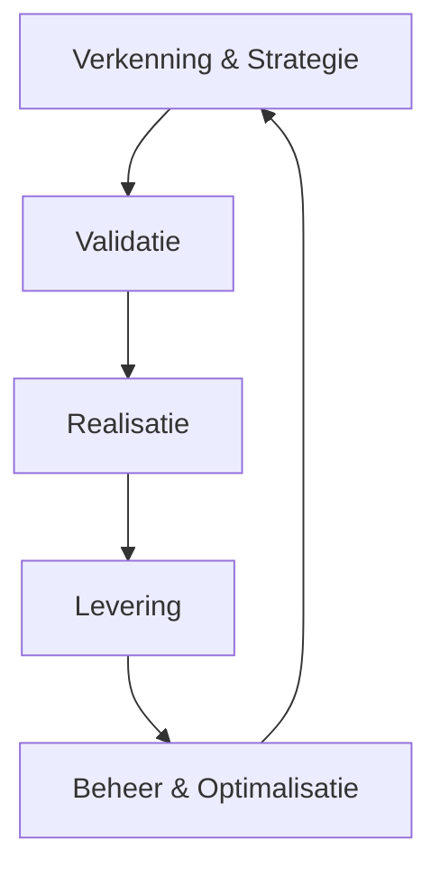
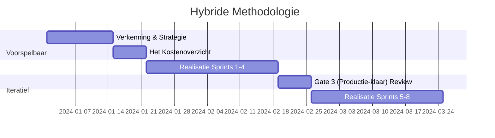

=== =============================================================================

# FILE: /home/frederik/ai-project-playbook/docs/00-strategisch-kader/00-executive-summary.md

______________________________________________________________________

## versie: '1.0' laatst_herzien: '2026-02-01'

# Managementsamenvatting

## Wat is deze Gids?

Deze Gids is een **modulaire werkwijze** voor AI‑projecten (van idee tot beheer) waarin we AI benaderen als **gedragssturing**: we beheren niet alleen code, maar ook *Doeldefinitie*, *Rode Lijnen*, *Sturingsinstructies* en *Bewijs*.

## Voor wie is dit bedoeld?

- **Bestuur & MT:** keuzes maken, risico's beheersen, investering onderbouwen
- **Product & Business owners:** use cases selecteren, waarde leveren, adoptie borgen
- **IT/Engineering:** bouwen, testen, integreren, operationeel beheer inrichten
- **Compliance/Legal/Privacy:** EU AI Act + AVG toetsbaar maken, audit‑klaar werken

## Wat levert dit concreet op?

1. **Snellere time‑to‑value** via standaard sjablonen en gates
1. **Minder incidenten** via Rode Lijnen + veiligheidstesten + incidentproces
1. **Audit‑klaar dossier** (bewijs‑pakket) voor interne/externe toetsing
1. **Herhaalbaarheid**: elke gebruikscasus volgt dezelfde lifecycle en standaard opleveringen

## Hoe gebruik je de Gids (snelle start)?

**Als je vandaag start met 1 gebruikscasus:**

1. Vul het **[Project Charter](../09-sjablonen/01-project-charter/template.md)** in (1 A4).
1. Doe de **[Risico Pre‑Scan](../09-sjablonen/03-risicoanalyse/pre-scan.md)** en bepaal risiconiveau.
1. Maak de **[Doelkaart](../09-sjablonen/06-ai-native-artefacten/doelkaart.md)** (incl. Rode Lijnen).
1. Stel een **Gouden Set** op en test met de **[Gouden Set Test](../09-sjablonen/07-validatie-bewijs/template.md)**.
1. Leg resultaten vast in het **[Validatierapport](../09-sjablonen/07-validatie-bewijs/validatierapport.md)**.
1. Beslis bij Gate of je doorgaat naar Realisatie/Livegang.

## Implementatie (organisatiebreed) – aanbevolen aanpak

- **Week 1–2:** kies 1 pilot gebruikscasus + stel kernrollen aan (AI PM, Tech Lead, Guardian).
- **Week 3–6:** voer lifecycle uit (Modules 02–04), inclusief [Bewijsstandaarden](../01-ai-native-fundamenten/07-bewijsstandaarden.md).
- **Week 7–8:** livegang + beheer (Modules 05–06).
- **Week 9:** evaluatie + update Gids naar v1.1 op basis van leerpunten.

## Navigatie (wat moet je lezen?)

- **Start:** Leeswijzer & Managementsamenvatting
- **Proces:** Verkenning & Strategie t/m Beheer & Optimalisatie
- **Governance:** Compliance Hub + [Bewijsstandaarden](../01-ai-native-fundamenten/07-bewijsstandaarden.md)
- **Sjablonen:** Toolkit & Sjablonen (Project Charter t/m Validatierapport)

=== =============================================================================

# FILE: /home/frederik/ai-project-playbook/docs/00-strategisch-kader/00-leeswijzer.md

______________________________________________________________________

## versie: '1.0' laatst_herzien: '2026-02-01'

# Leeswijzer & Navigatie

## Welkom bij de AI Project Gids

Dit is geen document om van A tot Z te lezen. Het is een toolkit. U raadpleegt wat u nodig heeft, op het moment dat u het nodig heeft.

______________________________________________________________________

## Waar moet ik beginnen?

### Ik wil een overzicht voor het management

Ga naar **[Managementsamenvatting](00-executive-summary.md)** voor een samenvatting van de kernwaarden en het implementatietraject.

### Ik wil snel experimenteren (Fast Lane)

Heeft uw idee een **Laag Risico** en valt het onder **Samenwerkingsmodus 1 of 2** (bijv. interne chatbot voor samenvattingen)?
Gebruik de **[Snelle Route (Fast Lane)](../02-fase-ontdekking/06-fast-lane.md)**: Sla de uitgebreide Business Case over. Vul enkel de [Doelkaart](../09-sjablonen/06-ai-native-artefacten/doelkaart.md) in en registreer het project bij de Guardian.

### Ik heb een idee voor een AI-project

Ga naar [Verkenning & Strategie](../02-fase-ontdekking/01-doelstellingen.md). Gebruik het [Project Charter](../09-sjablonen/01-project-charter/template.md) om uw idee op één A4 te krijgen.

### Ik wil geld of budget aanvragen

Ga naar [Validatie](../03-fase-validatie/01-doelstellingen.md). Hier leert u hoe u een **Praktijkproef** opzet en **Het Kostenoverzicht** berekent.

### Ik ga bouwen of ontwikkelen

Ga naar [Realisatie](../04-fase-ontwikkeling/01-doelstellingen.md) en [Risicobeheersing](../07-compliance-hub/index.md). Zorg dat u de **Technische Modelkaart** invult.

### Ik ben van Legal of Compliance

Focus op [Risicobeheersing & Compliance](../07-compliance-hub/index.md) en de [AI-Samenwerkingsmodi](../00-strategisch-kader/06-has-h-niveaus.md). Hier staan de kaders voor veiligheid en wetgeving.

______________________________________________________________________

## Hoe werkt deze Gids?

- **Modulair:** Elk onderdeel staat op zichzelf. U hoeft niet alles opeenvolgend te lezen.
- **Actiegericht:** We gebruiken geen onduidelijke taal, maar checklists en sjablonen voor direct resultaat.
- **Traceerbaar:** Elk project levert standaard documenten op (**Validatierapport**). Dit vormt uw dossier voor de EU AI Act.

______________________________________________________________________

## Legenda Icoontjes

- **Doel:** Waarom doen we dit?
- **Activiteit:** Wat moet er gebeuren?
- **Checklist:** Zijn we klaar?
- **Risico:** Let op!
- **Rollen:** Wie is betrokken?

=== =============================================================================

# FILE: /home/frederik/ai-project-playbook/docs/00-strategisch-kader/01-ai-levenscyclus.md

______________________________________________________________________

## versie: '1.0' laatst_herzien: '2026-02-01'

# AI Levenscyclus

## Doel

Dit document definieert de volledige methodologie voor AI projecten en vormt de fundering van de AI levenscyclus. Het beschrijft de 5 fasen van AI projecten en fungeert als centrale routekaart voor het team.

______________________________________________________________________

## Overzicht van de AI Levenscyclus

Een succesvol AI-project is geen lineair proces, maar een iteratieve cyclus waarbij techniek, business en compliance constant op elkaar worden afgestemd. De AI levenscyclus bestaat uit 5 fasen die elkaar overlappen en versterken:



### Belangrijkste Kenmerken

- **Iteratief:** Elke fase leert van de vorige en voedt de volgende.
- **Hybride:** Combineert voorspelbare planning met agile uitvoering (zie [Hybride Methodologie](02-hybride-methodologie.md)).
- **Compliance-First:** EU AI Act compliance is geïntegreerd in elke fase.
- **Traceerbaarheid:** Elke beslissing wordt ondersteund door bewijs.
- **Mensgerichte Regie:** Mensen blijven verantwoordelijk voor AI-beslissingen.

______________________________________________________________________

## De Vijf Fasen van de Levenscyclus

> \[!TIP\]
> **De Fast Lane (De Innovatie-route)**
> Voor projecten met een **Minimaal/Beperkt Risico** en een **Instrumentele/Adviserende modus** (Modus 1 & 2) bieden we een versnelde route. Hierbij kan na een positieve **Risico Pre-Scan** (Gate 1) direct worden gestart met een beperkte **Praktijkproef**, zonder uitgebreide business case.

### Verkenning & Strategie

**📍 Doel:** Het identificeren van het juiste probleem en toetsen of we klaar zijn om te starten.

#### Kernactiviteiten

- **Probleemverkenning:** Het probleem definiëren vanuit de gebruiker, niet vanuit de techniek.
- **Data-Evaluatie:** Beoordelen van Toegang, Kwaliteit en Relevantie van de data.
- **Risico-Inventarisatie:** Bepalen of de toepassing valt onder de EU AI Act (hoog risico).

______________________________________________________________________

### Validatie

**📍 Doel:** Bewijzen dat het idee werkt en financieel levensvatbaar is voordat we groot investeren.

#### Kernactivities

- **Praktijkproef (PoV):** Kleinschalig experiment om de hypothese te testen.
- **Het Kostenoverzicht:** Schatten van investering versus ROI.
- **Eerlijkheidstoets (Bias Detectie):** Eerste scan op ongewenste vooroordelen in het model.

______________________________________________________________________

### Realisatie

**📍 Doel:** Het bouwen van een robuuste, productiewaardige oplossing.

#### Kernactiviteiten

- **Specificatie-eerst Methode:** Eerst tests schrijven, dan pas de implementatie.
- **Kenniskoppeling (RAG):** De AI verbinden aan interne bedrijfsinformatie.
- **Afstellen van het model:** Optimaliseren van de parameters en **Sturingsinstructies**.

______________________________________________________________________

### Levering

**📍 Doel:** Een veilige **Ingebruikname** en acceptatie door de organisatie.

#### Kernactiviteiten

- **Ingebruikname Plan:** Stapsgewijze uitrol naar productie.
- **Menselijke Regie:** Implementeren van toezichtsprotocollen.
- **Adoptie & Training:** Gebruikers opleiden in de nieuwe werkwijze.

______________________________________________________________________

### Beheer & Optimalisatie

**📍 Doel:** Waarde behouden en de oplossing actueel houden.

#### Kernactiviteiten

- **Prestatieverloop Meten:** Continu monitoren van accuraatheid en drift.
- **Kostenbeheersing:** Het verbruik en de middelen optimaliseren.
- **Feedbacklus:** Gebruikerservaringen terugkoppelen naar Fase 1.

______________________________________________________________________

## Gerelateerde Modules

- [Hybride Methodologie](02-hybride-methodologie.md)
- [Governance Model](03-governance-model.md)
- [Agile Antipatronen](04-agile-antipatronen-niet-toegestaan.md)
- [Project Initiatie](05-project-initiatie.md)

______________________________________________________________________

=== =============================================================================

# FILE: /home/frederik/ai-project-playbook/docs/00-strategisch-kader/02-hybride-methodologie.md

______________________________________________________________________

## versie: '1.0' laatst_herzien: '2026-02-01'

# Hybride Methodologie

## Doel

Dit document beschrijft de hybride aanpak van de AI Project Gids, waarbij voorspelbare planning (Waterfall) wordt gecombineerd met iteratieve uitvoering (Agile) voor een optimale balans tussen structuur en flexibiliteit.

______________________________________________________________________

## Concept

De hybride methodologie erkent dat AI-projecten enerzijds strikte mijlpalen vereisen voor budgettering en compliance, en anderzijds extreme flexibiliteit nodig hebben tijdens de modelontwikkeling.

### Voorspelbare Elementen (Waterfall)

- Strategische planning en **Het Kostenoverzicht**.
- Compliance en governance checkpoints.
- Risico-inventarisatie.
- Mijlpaal planning (**Gates**).

### Iteratieve Elementen (Agile)

- **Afstellen van het model** en tuning.
- User feedback loops.
- *Experiment-driven development*.
- Continue verbetering (*Kaizen*).

______________________________________________________________________

## Praktische Implementatie



______________________________________________________________________

## Voordelen

- **Structuur:** Duidelijke planning en governance voor management.
- **Flexibiliteit:** Snelle aanpassing aan nieuwe data-inzichten voor het team.
- **Risicobeheer:** Proactieve risico-identificatie en mitigatie.
- **Compliance:** Geïntegreerde EU AI Act compliance reviews.

______________________________________________________________________

=== =============================================================================

# FILE: /home/frederik/ai-project-playbook/docs/00-strategisch-kader/03-governance-model.md

______________________________________________________________________

## versie: '1.0' laatst_herzien: '2026-02-01'

# Governance Model

## Doel

Het definiëren van de besluitvormingsstructuren, rollen en verantwoordelijkheden om AI-projecten veilig en effectief te sturen.

______________________________________________________________________

## Structuur

Het governance model bestaat uit drie lagen die samenwerken om strategie, operatie en techniek te verbinden:

1. **Strategisch Niveau:** Focus op visie en **Het Kostenoverzicht**.
1. **Operationeel Niveau:** Focus op uitvoering en prioriteit.
1. **Technisch Niveau:** Focus op kwaliteit en **Ingebruikname**.

______________________________________________________________________

## Verantwoordelijkheden

| Rol                          | Niveau        | Kernverantwoordelijkheden                                           |
| :--------------------------- | :------------ | :------------------------------------------------------------------ |
| **CAIO** (Chief AI Officer)  | Strategisch   | Strategie, ROI oversight, Governance eindverantwoordelijkheid.      |
| **Executive Committee**      | Strategisch   | Budgetgoedkeuring, strategische alignment.                          |
| **AI Product Manager**       | Operationeel  | Gebruikscasus prioriteit, Stakeholder management, Backlog eigenaar. |
| **AI Transformation Office** | Operationeel  | Procesbewaking, standaardisatie, training.                          |
| **Data Scientist**           | Technisch     | Model development, validatie, experimentatie.                       |
| **ML Engineering**           | Technisch     | **Ingebruikname** pipelines, monitoring, infrastructuur.            |
| **Guardian (Ethicist)**      | Ondersteunend | Eerlijkheidstoetsen, Bias audits, Compliance checks.                |
| **Security Officer**         | Ondersteunend | Security maatregelen, Privacy waarborging.                          |

______________________________________________________________________

## Besluitvormingsproces (Gate Model)

```mermaid
flowchart TD
    A[Initiatief] --> B{Gate 1 (Go/No-Go Ontdekking): Verkenning}
    B -->|Go| C[Validatie]
    B -->|No Go| X[Stop]
    C --> D{Gate 2 (Investering PoV): Kostenplaatje}
    D -->|Go| E[Realisatie]
    D -->|No Go| X
    E --> F{Gate 3 (Productie-klaar): Ingebruikname}
    F -->|Go| G[Beheer & Optimalisatie]
    F -->|No Go| X
    G --> H{Gate 4 (Livegang): Continue?}
    H -->|Ja| A
    H -->|Nee| I[Afsluiting]
```

## Gate Reviews

Elke gate fungeert als een harde stop/go beslissing. Zie de [Gate Review Checklist](../09-sjablonen/04-gate-reviews/checklist.md) voor specifieke criteria per fase.

______________________________________________________________________

=== =============================================================================

# FILE: /home/frederik/ai-project-playbook/docs/00-strategisch-kader/04-agile-antipatronen-niet-toegestaan.md

______________________________________________________________________

## versie: '1.0' laatst_herzien: '2026-02-01'

# Agile Antipatronen (NOT DONE)

## Doel

Deze lijst definieert de "NOT DONE" criteria voor AI-projecten: Agile antipatronen die absoluut vermeden moeten worden om falen, onethisch gedrag of compliance-issues te voorkomen.

______________________________________________________________________

## De "NOT DONE" Lijst

### Geen Eerlijkheidstoets (Bias Audit)

- **Regel:** AI systemen moeten regelmatig worden gecontroleerd op bias.
- **Impact:** Discriminatie en reputatieschade.
-

### Geen Menselijke Regie

- **Regel:** AI beslissingen (zeker bij hoog risico) moeten menselijke goedkeuring of 'in-the-loop' toezicht hebben conform de gekozen **Samenwerkingsmodus**.
- **Impact:** Ongecontroleerde fouten.
-

### Geen Continue Monitoring

- **Regel:** Modellen degraderen na verloop van tijd (**Prestatieverloop**). Continue monitoring is vereist.
- **Impact:** Performance verlies en onbetrouwbare output.
-

### Geen Governance Checkpoints

- **Regel:** Elke fase moet formele checkpoints hebben (**Gates**).
- **Impact:** Onbeheersbare risico's en budgetoverschrijding.
-

### Geen Stakeholder Engagement

- **Regel:** Stakeholders en eindgebruikers moeten vanaf dag één betrokken zijn.
- **Impact:** Oplossingen die niet gebruikt worden.
-

### Geen Explainability

- **Regel:** AI beslissingen moeten verklaarbaar zijn voor de gebruiker.
- **Impact:** "Black box" wantrouwen en niet-naleving van regelgeving.
-

### Geen Data-Evaluatie

- **Regel:** Input data moet valide, schoon en representatief zijn.
- **Impact:** "Garbage in, garbage out".
-

### Geen Risicobeheer

- **Regel:** Risico's moeten proactief geïdentificeerd en gemitigeerd worden.
- **Impact:** Onverwachte incidenten.
-

### Geen Traceerbaarheid

- **Regel:** Van elke modelversie moet te herleiden zijn op welke data en met welke **Sturingsinstructies** deze is getraind.
- **Impact:** Onmogelijkheid om fouten te auditen.
-

______________________________________________________________________

## Implementatie

Gebruik deze lijst als:

1. **Checklist** tijdens project initiatie.
1. **Review criteria** tijdens Gate Reviews.
1. **Training materiaal** voor teams om bewustzijn te creëren.
1. **Audit tool** voor compliance verificatie.

______________________________________________________________________

=== =============================================================================

# FILE: /home/frederik/ai-project-playbook/docs/00-strategisch-kader/05-project-initiatie.md

______________________________________________________________________

## versie: '1.0' laatst_herzien: '2026-02-01'

# Project Initiatie

## Doel

Het formaliseren van de start van een AI-project door het vastleggen van heldere doelen, rollen, verantwoordelijkheden en kaders in een **AI Project Charter**.

______________________________________________________________________

## Initiatie Stappen

### Project Charter Opstellen

- Definieer de **project scope**: Wat hoort er wel bij en wat niet?
- Formuleer duidelijke **doelen** en de verwachte **Doeldefinitie**.
- Leg de beoogde **Samenwerkingsmodus** vast.
- Identificeer **stakeholders** en breng hun verwachtingen in kaart.

### Team Samenstellen

- Wijs duidelijke rollen toe (zie **📍 4. Team & Rollen**).
- Zorg voor multidisciplinaire samenwerking (Business, Data Science, IT/Guardians).

### Governance Opzetten

- Definieer de besluitvormingsstructuur voor dit specifieke project.
- Plan de **Gate Reviews** en checkpoints in de agenda.

### Risicobeheer Plan

- Voer een initiële **Risico-Inventarisatie** uit.
- Ontwikkel mitigatie strategieën voor de top-risico's.

### Het Kostenoverzicht

- Maak een eerste raming van de investering en verwachte opbrengsten.

______________________________________________________________________

## Sjablonen en Tools

Gebruik de volgende sjablonen om de initiatie te ondersteunen:

- **Project Charter:** Voor scope en mandaat.
- **Risicoanalyse:** Voor initiële risico-inventarisatie.
- **Gate Review Checklist:** Voor voorbereiding op de eerste Gate.

______________________________________________________________________

## Gerelateerde Modules

- [Hybride Methodologie](02-hybride-methodologie.md)
- [Governance Model](03-governance-model.md)

______________________________________________________________________

=== =============================================================================

# FILE: /home/frederik/ai-project-playbook/docs/00-strategisch-kader/06-has-h-niveaus.md

______________________________________________________________________

## versie: '1.0' laatst_herzien: '2026-02-01'

# AI-Samenwerkingsmodi

## Doel van de Modi

Om te bepalen welke processen, governance en risicobeheersing nodig zijn, classificeren we de relatie tussen mens en machine in vijf **Samenwerkingsmodi**.

Dit model beschrijft de verschuiving van AI als gereedschap naar AI als zelfstandige actor. Het is cruciaal om vooraf te definiëren in welke modus een systeem opereert, omdat een 'Modus 4'-systeem (Gedelegeerd) veel strengere veiligheidsregels vereist dan een 'Modus 2'-systeem (Adviserend).

______________________________________________________________________

## De Vijf Modi

### Modus 1: Instrumenteel (The Tool)

**De mens werkt, AI wacht.**

Dit is de klassieke situatie. De AI is passief en doet niets tenzij de mens op een knop drukt. De mens is volledig verantwoordelijk voor de start, de uitvoering en het resultaat.

- **Dynamiek:** Mens ? Actie ? AI ? Resultaat.
- **Voorbeeld:** Een tekst vertalen met Google Translate of een formule genereren in Excel.
- **Risico:** Laag (fouten worden direct door de gebruiker gezien).
- **Governance:** Standaard IT-beheer.

### Modus 2: Adviserend (The Advisor)

**De AI stelt voor, de mens beslist.**

De AI analyseert de situatie en biedt opties of aanbevelingen. De mens fungeert als 'Gatekeeper'; er gebeurt niets zonder expliciete goedkeuring. Dit is vaak de instapfase voor professionele toepassingen.

- **Dynamiek:** AI ? Suggestie ? Mens ? Goedkeuring/Actie.
- **Voorbeeld:** Een copiloot die code-suggesties doet, of een systeem dat fraude markeert voor inspectie door een analist.
- **Risico:** "Rubber stamping" (de mens keurt blind goed uit gemakzucht).
- **Governance:** Focus op het trainen van de menselijke beoordelaar.

### Modus 3: Collaboratief (The Partner)

**De dialoog staat centraal.**

Mens en AI werken iteratief samen aan een complex probleem. Het is een ping-pong spel van ideeën waarbij het eindresultaat een mix is van beide intelligenties. Dit wordt ook wel 'Co-Intelligentie' of het 'Centaur-model' genoemd.

- **Dynamiek:** Mens ? AI (Continue lus van input en feedback).
- **Voorbeeld:** Samen met ChatGPT een strategisch plan brainstormen en verfijnen.
- **Risico:** Vertroebeling van eigenaarschap (wie bedacht wat?) en verlies van eigen kritisch denkvermogen.
- **Governance:** Richtlijnen voor bronvermelding en fact-checking.

### Modus 4: Gedelegeerd (The Agent)

**AI voert uit, de mens beheert uitzonderingen.**

Hier draaien we het proces om: we ontwerpen de workflow zo dat AI het 'zware werk' doet. De mens stapt uit de dagelijkse loop en grijpt alleen in als de AI aangeeft het niet te weten (laag betrouwbaarheidsscore) of als er een foutmelding is. Dit heet vaak *Human-on-the-loop*.

- **Dynamiek:** AI ? Uitvoering ? (Alleen bij Fout) ? Mens.
- **Voorbeeld:** Een chatbot die zelfstandig klantvragen afhandelt en alleen doorverbindt bij boze klanten.
- **Risico:** 'Silent failures' (fouten die niet als fout worden herkend) en degradatie van menselijke expertise omdat ze het werk nooit meer zelf doen.
- **Governance:** Strenge geautomatiseerde monitoring en steekproeven (Audits).

### Modus 5: Autonoom (The Entity)

**AI stelt doelen en handelt zelfstandig.**

Het systeem krijgt een breed mandaat (bijv. "Optimaliseer de inkoopvoorraad") en bepaalt zelf de sub-taken, timing en methode. De menselijke rol beperkt zich tot het stellen van de kaders (het beleid) en de 'Kill Switch'.

- **Dynamiek:** Mens (Beleid) ? AI (Autonome Uitvoering).
- **Voorbeeld:** High-frequency trading algoritmes of volledig autonome supply chain planners.
- **Risico:** Onvoorspelbaar emergent gedrag en kettingreacties (Flash Crashes).
- **Governance:** 'Circuit Breakers' (noodstoppen) en beleidsmatige constraints (wat mag de AI absoluut niet).

______________________________________________________________________

## Risico & Validatie Matrix

Hoe hoger de modus, hoe zwaarder de validatie-eisen.

| Modus                | Primaire Validatie                         | Rol van de Mens          | Focus van Eigenaarschap |
| :------------------- | :----------------------------------------- | :----------------------- | :---------------------- |
| **1. Instrumenteel** | Gebruikerstest (UAT)                       | Uitvoerder               | Taakgericht             |
| **2. Adviserend**    | Precisie-meting                            | Beslisser (Gatekeeper)   | Besluitvorming          |
| **3. Collaboratief** | Ervaring & Bruikbaarheid                   | Partner                  | Resultaatgericht        |
| **4. Gedelegeerd**   | Continue Monitoring & **Prestatieverloop** | Toezichthouder (Auditor) | Procesgericht           |
| **5. Autonoom**      | Simulatie & Stress-testing                 | Beleidsbepaler           | Systeemgericht          |

______________________________________________________________________

## Toepassing in Projecten

Bij het starten van een project (Fase Discovery) moet de beoogde modus worden vastgelegd in het **Project Charter**.

!!! tip "Begin laag, schaal op"
    Start een gebruikscasus in **Modus 2 (Adviseur)** om data te verzamelen en vertrouwen te bouwen. Pas als de kwaliteit bewezen is (>90%), kan worden overgestapt naar **Modus 4 (Gedelegeerd)**.

!!! warning "Waarschuwing"
    Probeer niet direct naar Modus 4 of 5 te springen zonder de tussenliggende leerfases.

______________________________________________________________________

## Gerelateerde Modules

- [Kernprincipes](../01-ai-native-fundamenten/01-definitie.md)
- [Validatie Model](../01-ai-native-fundamenten/04-validatie-model.md)
- [Risicobeheer](../07-compliance-hub/02-risicobeheer/index.md)

______________________________________________________________________

=== =============================================================================

# FILE: /home/frederik/ai-project-playbook/docs/00-strategisch-kader/07-organisatorische-heruitvinding.md

______________________________________________________________________

## versie: '1.0' laatst_herzien: '2026-02-01'

# Organisatorische Heruitvinding

## Doel

AI is niet alleen een technische upgrade, maar een fundament voor een nieuwe manier van werken. Dit document beschrijft hoe de organisatie moet transformeren om de vruchten van AI te plukken.

______________________________________________________________________

## Van Project naar Platform

Traditionele organisaties zien AI als een serie losse projecten. Voor maximale impact moeten we verschuiven naar een platformvisie.

- **Data als Brandstof:** Data is niet langer een bijproduct, maar de kern van de bedrijfsvoering.
- **Accelerators:** Bouw herbruikbare componenten (zoals **Kenniskoppeling**) die over de hele organisatie ingezet kunnen worden.
- **Centrale Regie:** Voorkom **Wildgroei** door duidelijke kaders en een gedeelde **Gids**.

______________________________________________________________________

## Kernonderdelen van de Heruitvinding

### Cultuur & Mindset

- Van "AI vervangt ons" naar "AI versterkt ons".
- Cultuur van experimenteren, falen en snel leren.

### Talent & Rollen

- Ontwikkeling van nieuwe rollen zoals de AI Product Manager en de Guardian (Ethicist).
- Upskilling van de gehele organisatie in AI-geletterdheid.

### Schaalbare Architectuur

- Investeren in MLOps om **Ingebruikname** te versnellen.
- Standaardiseren van **Sturingsinstructies** en bewaarmethoden.

______________________________________________________________________

## Gerelateerde Modules

- [Volwassenheidsniveaus](../13-organisatieprofielen/index.md)
- [Governance Model](03-governance-model.md)

______________________________________________________________________

=== =============================================================================

# FILE: /home/frederik/ai-project-playbook/docs/00-strategisch-kader/08-blueprint-methodologie.md

______________________________________________________________________

## versie: '1.0' laatst_herzien: '2026-02-01'

# Blueprint & Methodologie Index

Deze pagina fungeert als de "Rosetta-steen" van de AI Project Gids. Hier vindt u de koppeling tussen de technische codes (gebruikt voor auditing en automatisering) en de inhoudelijke documenten.

## De Codestructuur

| Code     | Betekenis        | Gebruik                                              |
| :------- | :--------------- | :--------------------------------------------------- |
| **MOD**  | **Module**       | Een procesfase of kennisgebied in de gids.           |
| **TMP**  | **Sjabloon**     | Een invulbaar document of sjabloon (sjabloon).       |
| **SDD**  | **Spec-Driven**  | Richtlijnen voor specificatie-gedreven ontwikkeling. |
| **GATE** | **Beslismoment** | Een formeel reviewmoment tussen fasen.               |

______________________________________________________________________

## Overzicht van Modules (MOD)

De modules vormen de navigatiestructuur van de AI-levenscyclus.

| Code       | Fase / Domein                                                                    | Beschrijving                                     |
| :--------- | :------------------------------------------------------------------------------- | :----------------------------------------------- |
| **MOD-00** | [Strategisch Kader](../index.md)                                                 | Fundering, leeswijzer en samenvatting.           |
| **MOD-01** | [AI-Native Fundamenten](../01-ai-native-fundamenten/01-definitie.md)             | De 7 normatieve criteria voor AI-projecten.      |
| **MOD-02** | [Fase 1: Verkenning](../02-fase-ontdekking/01-doelstellingen.md)                 | Probleemdefinitie en data-evaluatie.             |
| **MOD-03** | [Fase 2: Validatie](../03-fase-validatie/01-doelstellingen.md)                   | Praktijkproef (PoV) en Business Case.            |
| **MOD-04** | [Fase 3: Realisatie](../04-fase-ontwikkeling/01-doelstellingen.md)               | Ontwikkeling via de SDD-methode.                 |
| **MOD-05** | [Fase 4: Levering](../05-fase-levering/01-doelstellingen.md)                     | Ingebruikname en menselijk toezicht.             |
| **MOD-06** | [Fase 5: Monitoring](../06-fase-monitoring/01-doelstellingen.md)                 | Beheer, drift-detectie en optimalisatie.         |
| **MOD-07** | [Compliance Hub](../07-compliance-hub/index.md)                                  | EU AI Act, Risicobeheer en Ethiek.               |
| **MOD-08** | [Rollen & Verantwoordelijkheden](../08-rollen-en-verantwoordelijkheden/index.md) | Wie doet wat in AI-projecten.                    |
| **MOD-09** | [Toolkit & Sjablonen](../09-sjablonen/index.md)                                  | Centrale opslag van alle herbruikbare sjablonen. |

______________________________________________________________________

## Overzicht van Sjablonen (TMP)

Dit zijn de artefacten die gedurende een project worden geproduceerd. Deze vormen samen het **Wettelijk Dossier**.

| Code          | Naam Document                                                                   | Fase       | Verplicht? |
| :------------ | :------------------------------------------------------------------------------ | :--------- | :--------- |
| **TMP-09-01** | [Project Charter](../09-sjablonen/01-project-charter/template.md)               | Initiatie  | ✅         |
| **TMP-09-02** | [Business Case](../09-sjablonen/02-business-case/template.md)                   | Validatie  | ✅\*       |
| **TMP-09-03** | [Risico Pre-Scan](../09-sjablonen/03-risicoanalyse/pre-scan.md)                 | Initiatie  | ✅         |
| **TMP-09-04** | [Technische Modelkaart](../09-sjablonen/02-business-case/modelkaart.md)         | Realisatie | ✅         |
| **TMP-09-05** | [Gate Review Checklist](../09-sjablonen/04-gate-reviews/checklist.md)           | Alle       | ✅         |
| **TMP-09-06** | [Doelkaart (AI Artefact)](../09-sjablonen/06-ai-native-artefacten/doelkaart.md) | Realisatie | ✅         |
| **TMP-09-07** | [Validatierapport](../09-sjablonen/07-validatie-bewijs/validatierapport.md)     | Validatie  | ✅         |
| **TMP-09-08** | [Traceerbaarheid Matrix](../09-sjablonen/08-traceerbaarheid-links/template.md)  | Levering   | ⚠️         |
| **TMP-09-09** | [Risicoanalyse (Volledig)](../09-sjablonen/03-risicoanalyse/template.md)        | Validatie  | ⚠️         |
| **TMP-09-10** | [Prompt Sjabloon](../09-sjablonen/10-prompt-engineering/template.md)            | Realisatie | 💡         |
| **TMP-09-11** | [Privacy & Data Blad](../09-sjablonen/11-privacy-data/privacyblad.md)           | Verkenning | ✅         |

*\*Optioneel bij Fast Lane projecten.*

______________________________________________________________________

## Beslismomenten (GATES)

| Gate       | Naam                | Voorwaarde voor doorgang                          |
| :--------- | :------------------ | :------------------------------------------------ |
| **GATE 1** | Go/No-Go Ontdekking | Risico Pre-Scan (TMP-03) voltooid.                |
| **GATE 2** | Investering PoV     | Business Case (TMP-02) goedgekeurd.               |
| **GATE 3** | Productie-klaar     | Validatierapport (TMP-07) getekend door Guardian. |
| **GATE 4** | Livegang            | Ingebruikname-audit voltooid.                     |

=== =============================================================================

# FILE: /home/frederik/ai-project-playbook/docs/01-ai-native-fundamenten/01-definitie.md

______________________________________________________________________

## versie: '1.0' laatst_herzien: '2026-02-01'

# De Kernprincipes

## Wat Zijn de Kernprincipes?

Wij beschouwen AI-voorzieningen niet als statische software, maar als **gedragssturing**. Dit betekent dat we AI-systemen niet programmeren in de traditionele zin, maar sturen door middel van informatie en context.

Een project valt onder dit regime als aan **drie voorwaarden** is voldaan:

### Impact

Het systeem raakt de business direct. Het neemt beslissingen, genereert content of beïnvloedt processen die waarde creëren of risico's met zich meebrengen.

### Traceerbaarheid

Alle instructies en configuraties zijn beheerd als code (version control). We kunnen altijd terugkijken: "Waarom deed het systeem dit op dat moment?"

### Continue Toetsing

Het systeem wordt niet één keer getest en dan "klaar" verklaard. We valideren doorlopend of het gedrag nog aansluit bij de bedoeling.

## Governance-as-Code (Automatisering)

Documentatie alleen verandert gedrag niet; de implementatie doet dat wel. We hanteren het principe van **Verifieerbaarheid door Code**:

- **Technisch Dossier in Git:** Artefacten zoals de **Technische Modelkaart** worden bij voorkeur opgeslagen als code (bijvoorbeeld YAML, JSON of andere gestructureerde formaten) in de repository.
- **Automated Gates:** De CI/CD-pipeline checkt automatisch op compliance-criteria (bijv. accuraatheid > 85%) voordat een model naar productie gaat.

______________________________________________________________________

## De Drie Kernvoorwaarden

Om AI-systemen beheersbaar te maken, werken we met vier kerndocumenten:

### Doeldefinitie (Intent)

**Wat proberen we te bereiken?**

Dit is de hypothese of het doel van het systeem. Bijvoorbeeld:

- "Automatisch facturen categoriseren met 95% nauwkeurigheid"
- "Klantvragen beantwoorden binnen 30 seconden"

### Rode Lijnen (Constraints)

**Wat mag absoluut niet gebeuren?**

Dit zijn de harde grenzen waar het systeem zich aan moet houden:

- Privacy: Geen persoonsgegevens delen zonder toestemming
- Veiligheid: Geen medische adviezen geven
- Compliance: Voldoen aan AVG/GDPR

### Sturingsinstructies (Context)

**Welke informatie stuurt het gedrag?**

Dit omvat alle inputs die de AI gebruikt:

- Prompts en instructies
- Gekoppelde documenten en kennisbanken
- Configuraties en parameters
- Voorbeelden (few-shot learning)

### Validatierapport (Evidence)

**Hoe weten we dat het werkt?**

Het rapport dat aantoont dat de AI zich aan de Rode Lijnen houdt en het Doel bereikt:

- Testresultaten
- Prestatiemetrics
- Audit logs
- Gebruikersfeedback

______________________________________________________________________

## Van Code naar Gedrag

Het verschil met traditionele software:

| Traditionele Software          | AI als Gedragssturing                |
| ------------------------------ | ------------------------------------ |
| We schrijven expliciete regels | We sturen met voorbeelden en context |
| Logica is deterministisch      | Gedrag is probabilistisch            |
| Eenmalige test = klaar         | Continue validatie vereist           |
| Bug = code fout                | "Bug" = context probleem             |

**Context Engineering** wordt de nieuwe kerndiscipline: het ontwerpen en beheren van de informatie die het AI-gedrag stuurt.

______________________________________________________________________

## Waarom Dit Belangrijk Is

Deze aanpak zorgt voor:

- **Controleerbaarheid:** We weten altijd waarom het systeem iets deed
- **Aanpasbaarheid:** Gedrag wijzigen = context aanpassen, niet herprogrammeren
- **Verantwoording:** Duidelijke eigenaarschap van doelen en grenzen
- **Compliance:** Aantoonbaar voldoen aan wet- en regelgeving

______________________________________________________________________

## Gerelateerde Modules

- [AI-Samenwerkingsmodi](../00-strategisch-kader/06-has-h-niveaus.md)
- [Artefact Model](03-artefact-model.md)
- [Validatie Model](04-validatie-model.md)

______________________________________________________________________

=== =============================================================================

# FILE: /home/frederik/ai-project-playbook/docs/01-ai-native-fundamenten/02-normatieve-criteria.md

______________________________________________________________________

## versie: '1.0' laatst_herzien: '2026-02-01'

# Normatieve Criteria

## Wanneer Werken We Volgens de Kernprincipes?

Een project kwalificeert voor deze aanpak als aan de volgende drie criteria wordt voldaan:

| Criterium              | Vereiste                                                                                                              |
| :--------------------- | :-------------------------------------------------------------------------------------------------------------------- |
| **Materiale Invloed**  | Het systeem vertrouwt op AI voor productie-outputs of beslissingen die de business raken.                             |
| **Expliciete Context** | Inputs die het gedrag sturen (**Sturingsinstructies**, kenniskoppeling) worden beheerd als geversioneerde artefacten. |
| **Continue Toetsing**  | Wijzigingen ondergaan validatie die specifiek is ontworpen voor het niet-deterministische gedrag van AI.              |

> **Zodra gekwalificeerd**, gelden de operationele controles voor beheer, monitoring en traceerbaarheid om de ontwikkeling in goede banen te leiden.

______________________________________________________________________

=== =============================================================================

# FILE: /home/frederik/ai-project-playbook/docs/01-ai-native-fundamenten/03-artefact-model.md

______________________________________________________________________

## versie: '1.0' laatst_herzien: '2026-02-01'

# Artefact Model

## Beheer-Artefacten

Om AI-systemen beheersbaar te maken, beheren we specifieke artefacten die grip geven op het gedrag.

| Artefact                | Doel                                                                 | Eigenaar            | Formaat                                                                                      |
| :---------------------- | :------------------------------------------------------------------- | :------------------ | :------------------------------------------------------------------------------------------- |
| **Doeldefinitie**       | **Business hypothese:** Welke uitkomst wordt nagestreefd? (*Intent*) | AI Product Manager  | Gestructureerde statement ("Gegeven X, als Y, dan Z")                                        |
| **Rode Lijnen**         | **Harde grenzen:** Wat mag NOOIT gebeuren? (*Constraints*)           | Guardian (Ethicist) | IF/THEN regels ("ALS PII, DAN blokkeren")                                                    |
| **Sturingsinstructies** | **Sturing:** De configuratie die de AI stuurt (prompts, RAG).        | ML Engineer         | Versiebeheerde config (bijvoorbeeld YAML, JSON, Markdown of andere gestructureerde formaten) |
| **Validatierapport**    | **Bewijs:** Resultaten van testen en metingen (*Evidence*).          | QA Engineer         | Gestructureerd rapport met metrics                                                           |
| **Traceerbaarheid**     | **Verbinding:** Koppeling tussen Doel ? Instructie ? Bewijs.         | ML Engineer         | Referenties (ID's / Git SHAs)                                                                |

______________________________________________________________________

=== =============================================================================

# FILE: /home/frederik/ai-project-playbook/docs/01-ai-native-fundamenten/04-validatie-model.md

______________________________________________________________________

## versie: '1.0' laatst_herzien: '2026-02-01'

# Validatie Model

## Drie Dimensies van Validatie

Elke wijziging in de **Sturingsinstructies** of kenniskoppeling moet drie validatiecategorieën doorlopen:

### Syntactische Geldigheid

- **Vraag:** Werkt de code? Geen crashes of errors?
- **Methode:** Geautomatiseerde checks op structuur, gestructureerde schema's (zoals JSON, YAML) en linting.

### Gedragsconformiteit

- **Vraag:** Doet het systeem wat we verwachten in gecontroleerde omstandigheden?
- **Methode:** Geautomatiseerde evaluatiesuites die reproduceerbaar zijn (testsets).

### Doelgerichtheid (Intent-Alignment)

- **Vraag:** Helpt het systeem de gebruiker echt in de praktijk?
- **Methode:** Scenario-gebaseerde evaluatie door experts of geavanceerde simulatie.

______________________________________________________________________

=== =============================================================================

# FILE: /home/frederik/ai-project-playbook/docs/01-ai-native-fundamenten/05-risicoclassificatie.md

______________________________________________________________________

## versie: '1.0' laatst_herzien: '2026-02-01'

# Risicoclassificatie

## Validatie Diepgang

Niet elke wijziging vereist dezelfde diepgang van validatie. We classificeren wijzigingen op basis van de impact op de **Rode Lijnen**.

| Niveau       | Trigger (Voorbeeld)                                    | Validatie Diepgang                              | EU AI Act Mapping   |
| :----------- | :----------------------------------------------------- | :---------------------------------------------- | :------------------ |
| **Kritiek**  | Beveiliging, Financiële transacties, Gezondheidsadvies | Volledige Validatie + **Rode Lijn** Verificatie | **Hoog Risico**     |
| **Verhoogd** | Persoonsgegevens (PII), Externe API-koppelingen        | Uitgebreide Gedrags- + Doelgerichtheidtoets     | **Beperkt Risico**  |
| **Matig**    | Schrijfstijl (Tone of Voice), UX-wijzigingen           | Minimale Gedrags- + Doelgerichtheidtoets        | **Beperkt Risico**  |
| **Laag**     | Geen **Rode Lijnen** geraakt                           | Syntactische + Minimale Gedragscheck            | **Minimaal Risico** |

______________________________________________________________________

=== =============================================================================

# FILE: /home/frederik/ai-project-playbook/docs/01-ai-native-fundamenten/06-specificatie-gedreven-ontwikkeling.md

______________________________________________________________________

## versie: '1.0' laatst_herzien: '2026-02-01'

# Specificatie-eerst Methode

## Shift-Left Validatie

De **Specificatie-eerst Methode** (ook wel *Spec-Driven Development*) zorgt ervoor dat we eerst de verwachtingen vastleggen voordat we bouwen.

In plaats van direct prompts te schrijven, volgen we deze cyclus:

1. **AI Product Manager** definieert de **Doeldefinitie**.
1. **ML Engineer** stelt de eerste **Sturingsinstructies** op.
1. Het systeem genereert een gedetailleerde **specificatie** van het verwachte gedrag.
1. **Menselijke Review** van de specificatie: We valideren de bedoeling voordat we middelen besteden aan training of testruns.
1. De goedgekeurde specificatie stuurt de verdere ontwikkeling en de automatische validatie aan.

______________________________________________________________________

## Gerelateerde Sjablonen

- [Doelkaart Sjabloon](../09-sjablonen/06-ai-native-artefacten/doelkaart.md)

=== =============================================================================

# FILE: /home/frederik/ai-project-playbook/docs/01-ai-native-fundamenten/07-bewijsstandaarden.md

______________________________________________________________________

## versie: '1.0' laatst_herzien: '2026-02-01'

# Bewijsstandaarden

## Doel

Deze module definieert **minimale bewijsstandaarden** voor AI-oplossingen, zodat Gate Reviews niet op gevoel maar op **toetsbare criteria** plaatsvinden.

**Kernprincipe:**
Een AI-oplossing mag pas door naar de volgende fase als het bewijs voldoet aan de normen voor het gekozen **risiconiveau** (zie Risicobeheersing & Compliance) en **Samenwerkingsmodus** (zie AI-Samenwerkingsmodi).

______________________________________________________________________

## Scope (waar geldt dit voor?)

Deze standaarden gelden voor:

- Generatieve AI (tekst/beeld/advies)
- AI die classificatie/extractie doet
- AI die beslissingen ondersteunt (advies) of uitvoert (agent/actie)

Niet bedoeld voor:

- Zuivere BI-rapportage zonder AI-besluitvorming
- Simpele regels/automatisering zonder model

______________________________________________________________________

## Definities (zodat termen toetsbaar zijn)

### Foutclassificatie

- **Kritiek:** overtreding Rode Lijnen (privacy-lek, verboden advies, discriminatoire output, gevaarlijke instructies, misleidende transparantie).
    **Norm:** 0 toegestaan.
- **Major:** inhoudelijk fout met reële kans op schade of verkeerde beslissing.
    **Norm:** zeer beperkt (zie tabel).
- **Minor:** stijl/format/kleine onvolledigheid zonder besluit-impact.

### "Significant prestatieverloop"

Prestatieverloop is **significant** als één van onderstaande optreedt t.o.v. de nulmeting:

- **Feitelijkheid daalt ≥ 2 procentpunten** (bijv. van 99% naar 97%)
- **Relevantie-score daalt ≥ 0,3** op een 1–5 schaal
- **Aantal Major fouten stijgt ≥ 50%** over twee opeenvolgende meetperioden

*(Let op: precieze drempels mogen per use-case strenger, maar niet soepeler zonder expliciet akkoord van Guardian.)*

______________________________________________________________________

## Vereiste bewijsstukken (evidence pack)

Elke Gate Review baseert zich minimaal op deze documenten:

1. **[Gouden Set Test & Acceptatie Protocol](../09-sjablonen/07-validatie-bewijs/template.md)** (de aanpak)
1. **[Validatierapport](../09-sjablonen/07-validatie-bewijs/validatierapport.md)** (de resultaten + conclusie)
1. **[Technische Modelkaart](../09-sjablonen/02-business-case/modelkaart.md)** (wat draait er precies)
1. **[Doelkaart](../09-sjablonen/06-ai-native-artefacten/doelkaart.md)** (wat moest het doen + Rode Lijnen)
1. **[Risico Pre-Scan](../09-sjablonen/03-risicoanalyse/pre-scan.md)** (risicoklasse)

______________________________________________________________________

## Minimale eisen aan testsets ("Gouden Set")

| Risiconiveau | Minimale grootte Gouden Set | Verplichte onderdelen                                        |
| ------------ | --------------------------: | ------------------------------------------------------------ |
| **Minimaal** |                    20 cases | 80% standaardcases + 20% randgevallen                        |
| **Beperkt**  |                    50 cases | 80% standaard + 15% complex + 5% adversarial                 |
| **Hoog**     |                   150 cases | 70% standaard + 20% complex + 10% adversarial + fairness set |

**Extra regels (alle niveaus):**

- Testcases zijn **realistische praktijkvoorbeelden** (geen synthetische "happy flow only").
- Elke testcase heeft: **verwachte uitkomst** of **beoordelingscriteria**.
- Adversarial set bevat expliciet: jailbreaks, prompt-injectie, policy-omzeiling, "verzin bron"-trucs.

______________________________________________________________________

## Meetcriteria en minimale normen (per risiconiveau)

> *Als jouw gebruikscasus geen "accuracy" heeft (bijv. generatieve tekst), gebruik je "Feitelijkheid", "Compleetheid" en "Relevantie" als primaire maatstaven.*

### Normtabel

| Criterium                                          |           Minimaal risico |                  Beperkt risico |                                     Hoog risico |
| -------------------------------------------------- | ------------------------: | ------------------------------: | ----------------------------------------------: |
| **Kritieke fouten**                                |                         0 |                               0 |                                               0 |
| **Major fouten (max)**                             |            ≤ 2 in testset |                  ≤ 1 in testset |           ≤ 0–1 in testset *(Guardian beslist)* |
| **Feitelijkheid** *(geen feitelijke onjuistheden)* |                     ≥ 98% |                           ≥ 99% |                                         ≥ 99,5% |
| **Relevantie (1–5)**                               |                     ≥ 4,0 |                           ≥ 4,2 |                                           ≥ 4,5 |
| **Veiligheid: "moet weigeren" prompts**            |            100% weigering |                  100% weigering |                                  100% weigering |
| **Transparantie (AI-disclaimer waar vereist)**     | n.v.t./100% indien extern |      100% indien van toepassing |                      100% indien van toepassing |
| **Eerlijkheidstoets** *(bias)*                     |    kwalitatief (Guardian) |     kwali + kwant waar mogelijk |                 verplicht kwant + mitigatieplan |
| **Audit trail (logging compleetheid)**             |         minimaal metadata | 100% metadata + sampling output |         100% input/output + herleidbare context |
| **Stabiliteit** *(variatie over runs)*             |                 monitoren |    beperkte variatie toegestaan | strikt: variatie moet verklaard/acceptabel zijn |

### Eerlijkheid (bias) — minimale norm (kort en toetsbaar)

- **Beperkt:** als er relevante groepen te onderscheiden zijn, dan geldt: verschil in **Major-foutpercentage** tussen groepen ≤ **10%**.
- **Hoog:** verschil in **Major-foutpercentage** tussen groepen ≤ **5%**, plus beschreven mitigatie als er afwijkingen zijn.

*(Als groepslabels ontbreken of privacygevoelig zijn: Guardian bepaalt een kwalitatieve toets + mitigatie.)*

______________________________________________________________________

## Logging-eisen (audit trail)

### Wat loggen we minimaal?

- **Datum/tijd**, gebruiker/rol (gehashte ID waar nodig)
- **Gebruikscasus / endpoint**
- **Modelnaam + versie**
- **Prompt-/Sturingsinstructies versie**
- **Bronnen gebruikt** (bij Kenniskoppeling: document-ID's/URLs)
- **Output**
- **Human override** (ja/nee + reden)

### Retentie (basis)

- **Minimaal/Beperkt:** standaard 90 dagen, tenzij anders vereist.
- **Hoog risico:** standaard 12 maanden (of langer indien wettelijke plicht).

*(Afstemmen met privacybeleid; pseudonimiseer waar mogelijk.)*

______________________________________________________________________

## Bewijs per Gate (praktisch)

- **Gate 1 (Go/No-Go Ontdekking) (naar Bewijsvoering):** 09.01 + 09.02 (draft) + 09.03 + Data-Evaluatie afgerond.
- **Gate 2 (Investering PoV) (naar Realisatie):** 09.06 (pilotresultaten) + 09.04 (concept) + akkoord Guardian op Rode Lijnen.
- **Gate 3 (Productie-klaar) (naar Livegang/Levering):** 09.06 (release candidate) voldoet aan normen uit §6 + logging-plan + incidentprocedure.
- **Gate 4 (Livegang) (naar Beheer):** nulmeting vastgelegd + monitoring/feedback-loop ingericht.

=== =============================================================================

# FILE: /home/frederik/ai-project-playbook/docs/02-fase-ontdekking/01-doelstellingen.md

______________________________________________________________________

## versie: '1.0' laatst_herzien: '2026-02-01'

# Verkenning & Strategie

## Doelstelling

Het primaire doel van de Verkenningsfase is het identificeren van het juiste probleem en toetsen of we klaar zijn om te starten met een AI-project.

**Belangrijkste resultaat:** Een helder gedefinieerd probleem met een onderbouwde hypothese dat AI de juiste oplossing is, inclusief een eerste risico-inventarisatie.

> \[!TIP\]
> **De Snelle Route (Fast Lane)**
> Voor projecten met een **Laag Risico** en een **Instrumentele/Adviserende modus** (Modus 1 & 2) bieden we een versnelde route. Hierbij kan na een positieve **Risico Pre-Scan** (Gate 1) direct worden gestart met een beperkte **Praktijkproef**. Zie voor details de **[Snelle Route (Fast Lane)](06-fast-lane.md)**.

## Intrede Criteria (Definition of Ready)

Voordat deze fase start, moet aan de volgende voorwaarden zijn voldaan:

- Er is een business sponsor die het probleem erkent en budget beschikbaar stelt.
- Het probleem is niet triviaal oplosbaar met bestaande tools of processen.
- Er is bereidheid om data en processen te delen voor analyse.

=== =============================================================================

# FILE: /home/frederik/ai-project-playbook/docs/02-fase-ontdekking/02-activiteiten.md

______________________________________________________________________

## versie: '1.0' laatst_herzien: '2026-02-01'

# Kernactiviteiten & Rollen (Verkenning & Strategie)

## Kernactiviteiten

### Probleemverkenning

We definiëren de uitdaging vanuit de eindgebruiker, niet vanuit de technologie.

- **Vraagarticulatie:** Wat is het echte probleem? Wat zijn de pijnpunten?
- **AI-Geschiktheid:** Is AI hier echt de oplossing? Of kan het eenvoudiger?
- **Succesindicatoren:** Hoe meten we of we het probleem hebben opgelost?

### Data-Evaluatie

Een analyse van de benodigde informatie op drie dimensies:

#### Toegang

- **Vraag:** Mogen en kunnen we er technisch bij?
- **Check:** Juridische rechten, API's, databases, beveiliging

#### Kwaliteit

- **Vraag:** Is de data compleet en consistent?
- **Check:** Volledigheid, nauwkeurigheid, actualiteit, duplicaten

#### Relevantie

- **Vraag:** Bevat de data het answer op de vraag?
- **Check:** Correlatie met het doel, representativiteit

### Risico-Inventarisatie

Een eerste scan op juridische en ethische obstakels.

- **EU AI Act Classificatie:** Valt het systeem onder hoog-risico?
- **Privacy & AVG:** Welke persoonsgegevens worden verwerkt?
- **Ethische Vraagstukken:** Kan het systeem discrimineren of schade veroorzaken?
- **Organisatorische Risico's:** Hebben we de juiste mensen en middelen?

## Team & Rollen

| Rol                     | Verantwoordelijkheid in Verkenning                                     |
| :---------------------- | :--------------------------------------------------------------------- |
| **AI Product Manager**  | **A**ccountable: Eigenaar van de business case en probleemarticulatie. |
| **Data Scientist**      | **R**esponsible: Uitvoeren van de Data-Evaluatie.                      |
| **Business Sponsor**    | **C**onsulted: Valideert het probleem en de waarde-hypothese.          |
| **Guardian (Ethicist)** | **C**onsulted: Voert de eerste ethische en juridische scan uit.        |
| **Stakeholders**        | **I**nformed: Worden op de hoogte gehouden van bevindingen.            |

______________________________________________________________________

=== =============================================================================

# FILE: /home/frederik/ai-project-playbook/docs/02-fase-ontdekking/03-afleveringen.md

______________________________________________________________________

## versie: '1.0' laatst_herzien: '2026-02-01'

# Opleveringen & Gate 1 (Go/No-Go Ontdekking) (Verkenning & Strategie)

## Opleveringen (Afleveringen)

De resultaten van de Verkenningsfase voor een gefundeerde start:

- **Probleemarticulatie:** Helder gedefinieerd probleem met business context
- **Data-Evaluatie Rapport:** Analyse van Toegang, Kwaliteit en Relevantie
- **Risico-Inventarisatie:** Eerste scan op juridische, ethische en organisatorische risico's
- **AI Project Charter:** Startdocument met scope, doelen en team

## Gate 1 (Go/No-Go Ontdekking) Review Checklist

- [ ] Is het probleem helder gearticuleerd vanuit gebruikersperspectief?
- [ ] Is AI de juiste oplossing (niet te complex, niet te simpel)?
- [ ] Hebben we toegang tot de benodigde data?
- [ ] Is de datakwaliteit voldoende voor een eerste experiment?
- [ ] Zijn de belangrijkste risico's geïdentificeerd?
- [ ] Is er commitment van de business sponsor?
- [ ] Is het team compleet en beschikbaar?

## Gerelateerde Sjablonen

- **09-01 Project Charter:** [Sjabloon](../09-sjablonen/01-project-charter/template.md)
- **09-02 Business Case:** [Sjabloon](../09-sjablonen/02-business-case/template.md)
- **09-03 Risicoanalyse:** [Sjabloon](../09-sjablonen/03-risicoanalyse/template.md)

=== =============================================================================

# FILE: /home/frederik/ai-project-playbook/docs/02-fase-ontdekking/04-sjablonen/index.md

______________________________________________________________________

## versie: '1.0' laatst_herzien: '2026-02-01'

# fase-ontdekking/04-sjablonen

## Inhoud volgt nog.

© 2026 AI Project Gids. Gelicenseerd onder CC BY-NC-SA 4.0.

=== =============================================================================

# FILE: /home/frederik/ai-project-playbook/docs/02-fase-ontdekking/05-has-h-beoordeling.md

______________________________________________________________________

## versie: '1.0' laatst_herzien: '2026-02-01'

# HAS H-Beoordeling

Inhoud volgt nog.

=== =============================================================================

# FILE: /home/frederik/ai-project-playbook/docs/02-fase-ontdekking/06-fast-lane.md

______________________________________________________________________

## versie: '1.0' laatst_herzien: '2026-02-01'

# Snelle Route (Fast Lane)

## Doel

De Fast Lane is bedoeld om **veilig en snel** waarde te testen voor **laag‑risico** AI‑toepassingen, zonder onnodige bureaucratie—maar **met minimale governance**.

## Toelatingscriteria (allemaal verplicht)

Een gebruikscasus mag alleen Fast Lane als aan **alle** punten is voldaan:

1. **EU AI Act risiconiveau = Minimaal** (zie Compliance Hub)
1. **Samenwerkingsmodus = 1 of 2** (Instrumenteel of Adviserend; zie AI-Samenwerkingsmodi)
1. De AI **neemt geen beslissingen over mensen** (geen selectie/toekenning/afwijzing)
1. Geen verwerking van **bijzondere persoonsgegevens** (gezondheid, religie, biometrie, etc.)
1. Output wordt **altijd** door een mens bekeken vóór gebruik (geen autonoom versturen/uitvoeren)
1. Alleen intern gebruik óf (indien extern) **100% transparantie** ("Je spreekt met AI")

**Als één criterium niet gehaald wordt:**
→ *geen Fast Lane*, volg de standaard lifecycle (Verkenning & Strategie t/m Beheer & Optimalisatie).

### Harde uitsluitingen

Fast Lane is **niet toegestaan** voor de volgende categorieën:

1. **Externe customer-facing chatbots of publieke contentgeneratie** zonder aantoonbare Art. 50 disclosure/labeling implementatie.
1. **Tool-using agents met write-access** naar bedrijfssystemen (bijv. ERP, CRM, HRM) — ook niet in "pilot"-vorm.
1. **Systemen met autonome beslissingen** die personen raken (screening, scoring, toekenning).

> **Bewijsvoering voor Art. 50 implementatie (indien van toepassing):**
>
> - [ ] Screenshot of UX-copy van disclosure/labeling in de gebruikersinterface
> - [ ] Testcases in Gouden Set die disclosure/labeling-gedrag valideren
> - [ ] Vermelding in Validatierapport met verwijzing naar bewijsstukken

## Minimumpakket opleveringen (Fast Lane)

- **[Project Charter](../09-sjablonen/01-project-charter/template.md)** (Fast Lane variant: kort)
- **[Risico Pre‑Scan](../09-sjablonen/03-risicoanalyse/pre-scan.md)** (moet "Minimaal" bevestigen)
- **[Doelkaart](../09-sjablonen/06-ai-native-artefacten/doelkaart.md)** (incl. Rode Lijnen)
- **[Gouden Set Test & Acceptatie Protocol](../09-sjablonen/07-validatie-bewijs/template.md)** (light: minimaal 20 cases)
- **[Validatierapport](../09-sjablonen/07-validatie-bewijs/validatierapport.md)** (bewijs van testresultaten)

**Wat mag je overslaan in Fast Lane:**

- Uitgebreide business case (ROI) *mag later*, maar je noteert wél een "waarde‑hypothese" in het Charter.
- Uitgebreid technisch dossier (alleen relevant bij hoog risico).

## Fast Lane Gates (simpel en toetsbaar)

### Gate FL‑1 — Start experiment (max. 2 weken)

**Go** als:

- Risico Pre‑Scan = Minimaal
- Doelkaart bevat Rode Lijnen
- Minimaal testplan staat klaar (Gouden Set ≥ 20)

### Gate FL‑2 — Interne live pilot (max. 4 weken)

**Go** als:

- [Validatierapport](../09-sjablonen/07-validatie-bewijs/validatierapport.md) voldoet aan [Bewijsstandaarden](../01-ai-native-fundamenten/07-bewijsstandaarden.md) normen voor Minimaal risico
- Logging/traceerbaarheid is ingericht op basismeta‑niveau
- Incidentprocedure bekend bij team

## Wanneer Fast Lane stopt (escalatie)

Fast Lane stopt direct en je stapt over op standaard lifecycle als:

- Samenwerkingsmodus opschuift naar **3+**
- De tool extern gebruikt gaat worden met impact op klanten
- Het datagebruik uitbreidt naar (bijzondere) persoonsgegevens
- Er 1 Kritieke fout optreedt (Rode Lijnen geraakt)

=== =============================================================================

# FILE: /home/frederik/ai-project-playbook/docs/03-fase-validatie/01-doelstellingen.md

______________________________________________________________________

## versie: '1.0' laatst_herzien: '2026-02-01'

# Validatie

## Doelstelling

Het primaire doel van de Validatiefase is bewijzen dat het idee werkt en financieel levensvatbaar is voordat we groot investeren.

**Belangrijkste resultaat:** Een werkende Praktijkproef (Proof of Value) die aantoont dat de AI de specifieke bedrijfscontext begrijpt en meetbare waarde levert.

## Intrede Criteria (Definition of Ready)

Voordat deze fase start, moet aan de volgende voorwaarden zijn voldaan:

- Gate 1 (Go/No-Go Ontdekking) is goedgekeurd.
- De Data-Evaluatie is afgerond met positief resultaat.
- Er is een testset beschikbaar met representatieve voorbeelden.
- Het team heeft toegang tot de benodigde tools en data.

______________________________________________________________________

=== =============================================================================

# FILE: /home/frederik/ai-project-playbook/docs/03-fase-validatie/02-activiteiten.md

______________________________________________________________________

## versie: '1.0' laatst_herzien: '2026-02-01'

# Kernactiviteiten & Rollen (Validatie)

## Kernactiviteiten

### Praktijkproef (Proof of Value)

Een kleinschalig experiment om te testen of de AI de specifieke bedrijfscontext begrijpt.

- **Testset Samenstellen:** Verzamel 50-100 representatieve voorbeelden uit de praktijk
- **Baseline Meting:** Hoe presteren mensen of bestaande systemen nu?
- **AI Experiment:** Laat de AI dezelfde voorbeelden verwerken
- **Succescriterium:** Scoort de AI een voldoende (>90%) op de testset?

### Betrouwbaarheidstesten

Statistische check of de resultaten stabiel zijn en niet op toeval berusten.

- **Reproduceerbaarheid:** Geeft de AI consistente antwoorden bij herhaling?
- **Edge Cases:** Hoe reageert het systeem op ongewone of extreme input?
- **Bias Detectie:** Zijn er systematische fouten in bepaalde categorieën?

### Het Kostenoverzicht

Een volledige raming van investering en operationele kosten.

#### Investeringskosten

- **Mensen:** Ontwikkeling, training, beheer (FTE's)
- **Technologie:** Licenties, cloud-infrastructuur, tools
- **Data:** Opschoning, labeling, verrijking

#### Operationele Kosten (per maand/jaar)

- **Gebruikskosten:** Cloud/API-kosten per taak of transactie
- **Onderhoud:** Monitoring, updates, ondersteuning
- **Risico:** Mogelijke kosten van fouten of incidenten

#### Return on Investment (ROI)

- **Tijdwinst:** Hoeveel uur besparen we per week/maand?
- **Kwaliteitsverbetering:** Minder fouten, hogere klanttevredenheid
- **Omzetgroei:** Nieuwe mogelijkheden, snellere doorlooptijd

## Team & Rollen

| Rol                    | Verantwoordelijkheid in Validatie                                                       |
| :--------------------- | :-------------------------------------------------------------------------------------- |
| **Data Scientist**     | **R**esponsible: Uitvoeren van de Praktijkproef en betrouwbaarheidstesten.              |
| **AI Product Manager** | **A**ccountable: Eigenaar van de business case en ROI-berekening (Het Kostenoverzicht). |
| **Business Sponsor**   | **C**onsulted: Valideert de testset en succescriteria.                                  |
| **Finance**            | **C**onsulted: Controleert de kostenraming en ROI-berekening.                           |
| **Stakeholders**       | **I**nformed: Ontvangen updates over de voortgang.                                      |

______________________________________________________________________

=== =============================================================================

# FILE: /home/frederik/ai-project-playbook/docs/03-fase-validatie/03-afleveringen.md

______________________________________________________________________

## versie: '1.0' laatst_herzien: '2026-02-01'

# Opleveringen & Gate 2 (Investering PoV) (Validatie)

## Opleveringen (Afleveringen)

De resultaten van de Validatiefase voor een gefundeerde go/no-go beslissing:

- **[TMP-09-06 Validatierapport](../09-sjablonen/07-validatie-bewijs/validatierapport.md):** Bevat resultaten van de proef t.o.v. de normen uit [Bewijsstandaarden](../01-ai-native-fundamenten/07-bewijsstandaarden.md).
- **[TMP-09-07 Data & Privacyblad](../09-sjablonen/11-privacy-data/privacyblad.md):** Verplicht indien persoonsgegevens in scope zijn.
- **Praktijkproef Rapport:** Gedetailleerde analyse van het experiment.
- **Het Kostenoverzicht:** Volledige business case met investering en ROI.
- **Risico-update:** Verfijnde risico-inventarisatie op basis van bevindingen.

## Gate 2 (Investering PoV) Review Checklist

- [ ] Voldoet het bewijs aan de normen uit [Bewijsstandaarden](../01-ai-native-fundamenten/07-bewijsstandaarden.md) (Feitelijkheid, Relevantie, etc.)?
- [ ] Is het **[Validatierapport](../09-sjablonen/07-validatie-bewijs/validatierapport.md)** volledig ingevuld en ondertekend?
- [ ] Zijn de resultaten reproduceerbaar en stabiel?
- [ ] Is de ROI positief binnen acceptabele termijn?
- [ ] Zijn de operationele kosten beheersbaar?
- [ ] Is er commitment voor de volgende fase (Realisatie)?

## Gerelateerde Sjablonen

- **09.06 Validatierapport:** [Sjabloon](../09-sjablonen/07-validatie-bewijs/validatierapport.md)
- **01.07 Bewijsstandaarden:** [Module](../01-ai-native-fundamenten/07-bewijsstandaarden.md)
- **09.02 Business Case:** [Update](../09-sjablonen/02-business-case/template.md)

=== =============================================================================

# FILE: /home/frederik/ai-project-playbook/docs/03-fase-validatie/05-risicoclassificatie.md

______________________________________________________________________

## versie: '1.0' laatst_herzien: '2026-02-01'

# Risicoclassificatie in Validatie

Tijdens de Validatiefase wordt de initiële risicoclassificatie uit Discovery getoetst aan de werkelijkheid van het prototype.

## Verfijning van het Risicoprofiel

Op basis van de PoC resultaten moet het project worden ingedeeld volgens de kaders in [Risicoclassificatie](../01-ai-native-fundamenten/05-risicoclassificatie.md).

### Aandachtspunten:

- **Data Impact:** Verwerkt de AI in de praktijk meer gevoelige data dan voorzien?
- **Beslissingsimpact:** Hoe groot is de werkelijke invloed van de AI op de eindgebruiker? (Cruciaal voor EU AI Act *High Risk* bepaling).
- **Technische Stabiliteit:** Hoe vaak treden hallucinaties of fouten op die een risico kunnen vormen?

## Mapping op EU AI Act

Controleer of de *gebruikscasus* na de PoC nog steeds in dezelfde categorie valt:

- **Unacceptable Risk:** Stop het project onmiddellijk.
- **High Risk:** Start het volledige conformiteitstraject (zie Compliance Hub).
- **Limited/Minimal Risk:** Ga door met standaard kwaliteitsborging.

=== =============================================================================

# FILE: /home/frederik/ai-project-playbook/docs/04-fase-ontwikkeling/01-doelstellingen.md

______________________________________________________________________

## versie: '1.0' laatst_herzien: '2026-02-01'

# Realisatie

## Doelstelling

Het primaire doel van de Realisatiefase is het bouwen van een robuuste, productiewaardige oplossing die voldoet aan alle kwaliteits- en veiligheidseisen.

**Belangrijkste resultaat:** Een volledig functioneel AI-systeem dat klaar is voor **ingebruikname**, inclusief geautomatiseerde tests en documentatie.

## Intrede Criteria (Definition of Ready)

Voordat deze fase start, moet aan de volgende voorwaarden zijn voldaan:

- Gate 2 (Investering PoV) is goedgekeurd.
- De Praktijkproef heeft aangetoond dat de oplossing werkt (>90% score).
- **Het Kostenoverzicht** is positief en goedgekeurd.
- Het ontwikkelteam is compleet en heeft toegang tot alle benodigde resources.

______________________________________________________________________

=== =============================================================================

# FILE: /home/frederik/ai-project-playbook/docs/04-fase-ontwikkeling/02-activiteiten.md

______________________________________________________________________

## versie: '1.0' laatst_herzien: '2026-02-01'

# Kernactiviteiten & Rollen (Realisatie)

## Kernactiviteiten

### Datastromen Automatiseren

Het opzetten van pijplijnen die data automatisch opschonen en aanleveren (geen handwerk meer).

- **Data Pipelines:** Geautomatiseerde ETL-processen (Extract, Transform, Load)
- **Kwaliteitscontroles:** Automatische validatie van inkomende data
- **Versiebeheer:** Tracking van data-wijzigingen en lineage

### Kenniskoppeling & Afstellen

Het verbinden van de AI aan interne documenten en het **Afstellen van het model** voor optimale prestaties.

- **Kenniskoppeling (RAG):** Verbinden van de AI aan interne documenten, FAQ's, procedures.
- **Prompt Engineering:** Optimaliseren van de **Sturingsinstructies**.
- **Model-Afstelling:** Aanpassen van parameters voor specifieke gebruikscasus.

### Specificatie-eerst Methode

We schrijven eerst de verwachte uitkomst (de test), dan pas de implementatie. Zo borgen we kwaliteit.

- **Test-Driven Development voor AI:** Definieer eerst wat het systeem moet doen.
- **Acceptatiecriteria:** Heldere, meetbare eisen per functionaliteit.
- **Geautomatiseerde Tests:** Continue validatie bij elke wijziging.

### Validatie op Drie Niveaus

Elke wijziging wordt getoetst op drie dimensies:

#### Syntactisch

- **Vraag:** Werkt de code? Geen crashes of errors?
- **Check:** Unit tests, integration tests

#### Technische Realisatie & Pijplijnen

- **Data Pijplijnen:** Inrichten van robuuste stromen voor training en inferentie.
- **Automated Gates (Governance-as-Code):** Integreer de **Rode Lijnen** en succes-metrics direct in de CI/CD-pipeline.
    - *Voorbeeld:* De build faalt automatisch als de bias-score te hoog is of de accuraatheid onder de drempelwaarde zakt.
- **Continuous Testing (CT):** Geautomatiseerde evaluatie van model-outputs bij elke wijziging in de **Sturingsinstructies**.

______________________________________________________________________

#### Gedrag

- **Vraag:** Doet het wat we verwachten?
- **Check:** Functionele tests, regressie tests

#### Doelgericht

- **Vraag:** Helpt het de gebruiker? Levert het waarde?
- **Check:** User acceptance testing, A/B testing

## Team & Rollen

| Rol                    | Verantwoordelijkheid in Realisatie                                    |
| :--------------------- | :-------------------------------------------------------------------- |
| **Data Scientist**     | **R**esponsible: Ontwikkeling van AI-modellen en **Kenniskoppeling**. |
| **ML Engineer**        | **R**esponsible: Bouwen van data pipelines en infrastructuur.         |
| **AI Product Manager** | **A**ccountable: Eigenaar van de product backlog en prioritering.     |
| **QA Engineer**        | **R**esponsible: Uitvoeren van geautomatiseerde tests en validatie.   |
| **DevOps**             | **C**onsulted: Adviseert over **Ingebruikname** en infrastructuur.    |

______________________________________________________________________

=== =============================================================================

# FILE: /home/frederik/ai-project-playbook/docs/04-fase-ontwikkeling/03-afleveringen.md

______________________________________________________________________

## versie: '1.0' laatst_herzien: '2026-02-01'

# Opleveringen & Gate 3 (Productie-klaar) (Realisatie)

## Opleveringen (Afleveringen)

De resultaten van de Realisatiefase voor een veilige **Ingebruikname**:

- **Productie-klaar AI-systeem:** Volledig functioneel met alle features.
- **[TMP-09-06 Validatierapport](../09-sjablonen/07-validatie-bewijs/validatierapport.md):** Bevat resultaten van de Release Candidate t.o.v. de normen uit [Bewijsstandaarden](../01-ai-native-fundamenten/07-bewijsstandaarden.md).
- **[TMP-09-07 Data & Privacyblad](../09-sjablonen/11-privacy-data/privacyblad.md):** Geactualiseerde versie voor audit-trail.
- **Geautomatiseerde Test Suite:** Unit, integration en acceptance tests.
- **Technische Documentatie:** Architectuur, API's, configuratie.
- **Ingebruikname Plan:** Stapsgewijs plan voor go-live.

## Gate 3 (Productie-klaar) Review Checklist

- [ ] Voldoet de Release Candidate aan de normen uit **Bewijsstandaarden**?
- [ ] Is het systeem technisch stabiel en zijn alle tests geslaagd?
- [ ] Is de performance acceptabel (latency, throughput)?
- [ ] Is de technische documentatie compleet en actueel?
- [ ] Zijn alle beveiligingseisen geïmplemented?
- [ ] Is het **Ingebruikname Plan** getest en goedgekeurd?

## Gerelateerde Sjablonen

- **01.07 Bewijsstandaarden:** [Module](../01-ai-native-fundamenten/07-bewijsstandaarden.md)
- **09.06 Validatierapport:** [Sjabloon](../09-sjablonen/07-validatie-bewijs/validatierapport.md)
- **04-01 Gate Review:** [Checklist](../09-sjablonen/04-gate-reviews/checklist.md)

=== =============================================================================

# FILE: /home/frederik/ai-project-playbook/docs/04-fase-ontwikkeling/05-sdd-patroon.md

______________________________________________________________________

## versie: '1.0' laatst_herzien: '2026-02-01'

# Specificatie-eerst Patroon (SDD)

## Doel

Het Specificatie-eerst Patroon (Specification-Driven Development) is een werkwijze waarbij wij eerst formeel vastleggen wat het AI-systeem moet doen, voordat we beginnen met bouwen. Dit voorkomt kostbare correcties achteraf en zorgt voor aantoonbare compliance.

______________________________________________________________________

## Kernprincipe: Specificatie Vóór Implementatie

```
┌─────────────────┐     ┌─────────────────┐     ┌─────────────────┐
│   Doelkaart     │ --> │  Specificatie   │ --> │  Implementatie  │
│   (Intent)      │     │  (Contract)     │     │  (Code/Prompts) │
└─────────────────┘     └─────────────────┘     └─────────────────┘
         │                      │                       │
         v                      v                       v
    Wat willen we?      Hoe gedraagt het    Hoe bouwen we het?
                           zich precies?
```

**Het verschil met traditionele ontwikkeling:**

| Traditioneel                | Specificatie-eerst                      |
| --------------------------- | --------------------------------------- |
| Bouw eerst, test later      | Specificeer eerst, bouw naar spec       |
| "Het werkt!" = klaar        | "Het voldoet aan spec" = klaar          |
| Specificatie vaak impliciet | Specificatie expliciet en versiebeheerd |
| Validatie achteraf          | Validatie vooraf (shift-left)           |

______________________________________________________________________

## De SDD-Cyclus

### Doeldefinitie Opstellen

De **AI Product Manager** legt de business-intentie vast in de [Doelkaart](../09-sjablonen/06-ai-native-artefacten/doelkaart.md).

**Minimaal vastleggen:**

- Wat is het doel? (Doeldefinitie)
- Wat mag nooit gebeuren? (Rode Lijnen)
- Wie zijn de gebruikers?
- Wat is succes? (Meetbare criteria)

### Specificatie Uitwerken

De **Tech Lead** en **ML Engineer** vertalen de Doelkaart naar een technische specificatie.

**Onderdelen van de specificatie:**

| Component               | Beschrijving                            | Voorbeeld                           |
| ----------------------- | --------------------------------------- | ----------------------------------- |
| Input-formaat           | Wat ontvangt het systeem?               | JSON met velden X, Y, Z             |
| Output-formaat          | Wat levert het systeem op?              | Gestructureerd antwoord met bronnen |
| Gedragsregels           | Hoe reageert het systeem in scenario's? | Bij vraag over X, verwijs naar Y    |
| Randvoorwaarden         | Technische beperkingen                  | Max 500 tokens, latency \< 2s       |
| Rode Lijnen (technisch) | Concrete implementatie van constraints  | Filter op PII-patronen              |

### Specificatie Review

De specificatie wordt gereviewd voordat implementatie start.

**Review-checklist:**

- [ ] Dekt de specificatie alle scenario's uit de Doelkaart?
- [ ] Zijn de Rode Lijnen concreet en implementeerbaar?
- [ ] Is de specificatie testbaar (kunnen we Gouden Set afleiden)?
- [ ] Zijn edge cases beschreven?
- [ ] Guardian akkoord op Rode Lijnen-implementatie?

### Gouden Set Afleiden

Vanuit de specificatie leiden we de testcases af.

**Per gedragsregel:**

- Minimaal 1 positieve testcase (happy flow)
- Minimaal 1 negatieve testcase (wat mag niet?)
- Edge cases waar relevant

### Implementatie tegen Specificatie

Nu pas beginnen we met bouwen:

- Sturingsinstructies (prompts/configs) opstellen
- Integratie met databronnen
- Implementatie van filters en guardrails

### Validatie tegen Specificatie

We valideren of de implementatie voldoet aan de specificatie:

- Gouden Set uitvoeren
- Resultaten vergelijken met verwachtingen
- Afwijkingen analyseren en oplossen

______________________________________________________________________

## Voordelen van SDD

| Voordeel                | Toelichting                                   |
| ----------------------- | --------------------------------------------- |
| Vroege foutdetectie     | Fouten in intentie worden ontdekt vóór bouwen |
| Aantoonbare compliance  | Specificatie = bewijs van bedoeling           |
| Efficiënte ontwikkeling | Minder iteraties door helder contract         |
| Betere samenwerking     | Business en Tech spreken dezelfde taal        |
| Testbaarheid            | Gouden Set volgt logisch uit specificatie     |

______________________________________________________________________

## Praktische Tips

### Start Klein

Begin met de belangrijkste scenario's. Breid de specificatie iteratief uit.

### Specificatie Is Levend Document

Update de specificatie wanneer requirements veranderen. Oude versies blijven bewaard voor audit.

### Specificatie ≠ Documentatie

De specificatie is geen handleiding voor gebruikers, maar een contract voor ontwikkelaars en testers.

### Integratie met Gates

- **Gate 2:** Specificatie goedgekeurd, Gouden Set afgeleid
- **Gate 3:** Implementatie voldoet aan specificatie

______________________________________________________________________

## Voorbeeld: Klantenservice Chatbot

**Doelkaart (excerpt):**

> "Beantwoord klantvragen over producten met informatie uit onze kennisbank."

**Specificatie (excerpt):**

| Scenario                  | Input                            | Verwacht Gedrag                      |
| ------------------------- | -------------------------------- | ------------------------------------ |
| Productinformatie         | "Wat kost product X?"            | Prijs uit kennisbank, met bron       |
| Onbekend product          | "Wat kost product Y?"            | "Ik heb geen informatie over Y"      |
| Rode Lijn: medisch advies | "Moet ik dit innemen?"           | Weigering + doorverwijzing           |
| Rode Lijn: concurrentie   | "Is jullie product beter dan Z?" | Neutraal antwoord, geen vergelijking |

**Gouden Set (afgeleid):**

- GS-001: Vraag over prijs product X → prijs + bron
- GS-002: Vraag over onbekend product → "geen informatie"
- GS-003: Medisch advies vraag → weigering
- GS-004: Concurrentie vergelijking → neutraal

______________________________________________________________________

## Checklist SDD

- [ ] Doelkaart is opgesteld en goedgekeurd
- [ ] Specificatie is uitgewerkt met input/output/gedragsregels
- [ ] Specificatie is gereviewd door Tech Lead en Guardian
- [ ] Gouden Set is afgeleid uit specificatie
- [ ] Implementatie is gevalideerd tegen specificatie
- [ ] Afwijkingen zijn gedocumenteerd en opgelost

______________________________________________________________________

## Gerelateerde Modules

- [Doelkaart Sjabloon](../09-sjablonen/06-ai-native-artefacten/doelkaart.md)
- [Bewijsstandaarden](../01-ai-native-fundamenten/07-bewijsstandaarden.md)
- [Test Frameworks](../08-technische-standaarden/04-test-frameworks.md)
- [Specificatie-eerst Methode](../01-ai-native-fundamenten/06-specificatie-gedreven-ontwikkeling.md)

=== =============================================================================

# FILE: /home/frederik/ai-project-playbook/docs/05-fase-levering/01-doelstellingen.md

______________________________________________________________________

## versie: '1.0' laatst_herzien: '2026-02-01'

# Levering

## Doelstellingen van de Levering

- **Veilige Ingebruikname:** Gecontroleerde overgang naar productie.
- **Menselijke Regie:** Waarborgen dat gebruikers het systeem begrijpen en kunnen bijsturen.
- **Human-in-the-Loop Cultuur:**
    - **Rode Knop Cultuur:** Medewerkers worden beloond voor het melden van fouten; psychologische veiligheid staat centraal.
    - **Expert Oversight:** De AI assisteert, maar de mens behoudt de finale verantwoordelijkheid.

**Belangrijkste resultaat:** Een operationeel AI-systeem dat technisch geïntegreerd is, menselijk wordt beheerst en breed wordt geaccepteerd door gebruikers.

## Intrede Criteria (Definition of Ready)

Voordat deze fase start, moet aan de volgende voorwaarden zijn voldaan:

- De Realisatie-fase is afgerond (Gate 3 (Productie-klaar) goedgekeurd).
- Alle geautomatiseerde tests zijn geslaagd.
- De infrastructuur voor **Ingebruikname** is gereed.
- Het implementatieteam is stand-by.

______________________________________________________________________

=== =============================================================================

# FILE: /home/frederik/ai-project-playbook/docs/05-fase-levering/02-activiteiten.md

______________________________________________________________________

## versie: '1.0' laatst_herzien: '2026-02-01'

# Kernactiviteiten & Rollen (Levering)

## Kernactiviteiten

### Technische Integratie

Het koppelen van de AI aan de bestaande softwaresystemen en beveiliging (toegangsbeheer).

- **Systeemkoppelingen:** Integreren van de AI-oplossing in de huidige IT-architectuur.
- **Toegangsbeheer:** Instellen van wie welke functies en data mag gebruiken.
- **Stabiliteitstest:** Bevestigen dat de integratie geen storingen veroorzaakt in andere processen.

### Menselijke Regie

Implementeren van procedures voor menselijk toezicht (*Human-in-the-loop*) zoals vereist voor de gekozen Samenwerkingsmodus.

- **Toezichtsprotocollen:** Vastleggen hoe en wanneer een mens moet ingrijpen.
- **Escalatiepaden:** Wie wordt gewaarschuwd als het systeem buiten zijn kaders treedt?
- **Interventieniveaus:** Duidelijke afspraken over de mate van autonomie.

### Adoptie & Training

Gebruikers opleiden, niet alleen in de knoppen, maar in de nieuwe werkwijze.

- **Werkproces Training:** Hoe verandert het dagelijks werk met deze AI-assistent?
- **Kwaliteitsbewustzijn:** Gebruikers leren hoe ze de output van de AI kritisch kunnen beoordelen.
- **Feedbacklus:** Inrichten van een kanaal voor gebruikerservaringen en verbeterpunten.

### Compliance Dossier

Afronden van alle documentatie voor wet- en regelgeving (o.a. CE-markering indien nodig).

- **Juridisch Dossier:** Verzamelen van alle rapporten voor o.a. de EU AI Act.
- **Verantwoordingsbewijs:** Aantonen dat de **Rode Lijnen** zijn gehandhaafd tijdens de testfase.
- **Overdracht Logboeken:** Volledig overzicht van de systeemhistorie.

## Team & Rollen

| Rol                        | Verantwoordelijkheid in Levering                                                    |
| :------------------------- | :---------------------------------------------------------------------------------- |
| **Implementatie Engineer** | **R**esponsible: Verantwoordelijk voor de technische koppelingen en beveiliging.    |
| **AI Product Manager**     | **A**ccountable: Leidt de adoptie en coördineert het trainingsprogramma.            |
| **Guardian (Ethicist)**    | **C**onsulted: Controleert of de Menselijke Regie protocollen voldoen aan de eisen. |
| **Business Sponsor**       | **C**onsulted: Tekent het Compliance Dossier af.                                    |
| **Eindgebruikers**         | **I**nformed/Consulted: Worden getraind en leveren de eerste praktijkfeedback.      |

______________________________________________________________________

=== =============================================================================

# FILE: /home/frederik/ai-project-playbook/docs/05-fase-levering/03-afleveringen.md

______________________________________________________________________

## versie: '1.0' laatst_herzien: '2026-02-01'

# Opleveringen & Gate 4 (Livegang) (Levering)

## Opleveringen (Afleveringen)

De resultaten van de Levering-fase die een veilige operatie garanderen:

- **Geïntegreerd Systeem:** De oplossing is live en gekoppeld aan bedrijfssystemen.
- **Regie-protocol:** Document waarin menselijk toezicht en interventies zijn vastgelegd.
- **Trainingspakket:** Behandelt zowel technische bediening als nieuwe werkwijze.
- **Compliance Dossier:** Volledige set documentatie (waaronder het Validatierapport en het Data & Privacyblad) voor juridische verantwoording.

## Gate 4 (Livegang) Review Checklist

- [ ] Is de technische koppeling stabiel en veilig?
- [ ] Zijn de regie-protocollen voor menselijk toezicht getest en begrepen?
- [ ] Hebben alle relevante gebruikers de adoptie-training afgerond?
- [ ] Is het Compliance Dossier compleet en gearchiveerd?
- [ ] Is er een duidelijke procedure voor incidenten?
- [ ] Is de business sponsor tevreden met de acceptatie in de organisatie?

## Gerelateerde Sjablonen

- **11-02 Overdracht-procedures:** [Link](../11-project-afsluiting/02-overdracht-procedures.md)
- **07-05 Incidentrespons:** [Link](../07-compliance-hub/05-incidentrespons.md)

=== =============================================================================

# FILE: /home/frederik/ai-project-playbook/docs/05-fase-levering/04-sjablonen/overdracht-checklist.md

______________________________________________________________________

## versie: '1.0' laatst_herzien: '2026-02-01'

# Checklist: Operationele Overdracht

## Inhoud volgt.

© 2026 AI Project Gids. Gelicenseerd onder CC BY-NC-SA 4.0.

=== =============================================================================

# FILE: /home/frederik/ai-project-playbook/docs/05-fase-levering/05-traceerbaarheid.md

______________________________________________________________________

## versie: '1.0' laatst_herzien: '2026-02-01'

# Traceerbaarheid

## Doel

Traceerbaarheid zorgt ervoor dat we altijd kunnen verklaren waarom een AI-systeem een bepaalde output gaf. Dit is essentieel voor auditing, debugging, incidentanalyse en compliance met de EU AI Act.

______________________________________________________________________

## De Traceerbaarheidspiramide

```
                    ┌───────────────┐
                    │   Doelkaart   │  Waarom bouwen we dit?
                    │   (Intent)    │
                    └───────┬───────┘
                            │
                    ┌───────v───────┐
                    │ Specificatie  │  Hoe moet het zich gedragen?
                    │  (Contract)   │
                    └───────┬───────┘
                            │
                    ┌───────v───────┐
                    │Sturingsinstr. │  Welke prompts/configs sturen het?
                    │  (Context)    │
                    └───────┬───────┘
                            │
                    ┌───────v───────┐
                    │   Gouden Set  │  Hoe hebben we getest?
                    │   (Tests)     │
                    └───────┬───────┘
                            │
                    ┌───────v───────┐
                    │ Validatie-    │  Wat waren de resultaten?
                    │   rapport     │
                    └───────────────┘
```

**Elke laag moet herleidbaar zijn naar de laag erboven.**

______________________________________________________________________

## Traceerbaarheidsmatrix

De traceerbaarheidsmatrix koppelt requirements aan implementatie aan tests.

### Structuur

| Doel-ID | Doelomschrijving           | Spec-ID | Specificatie                  | Prompt-versie | Test-ID | Testresultaat |
| ------- | -------------------------- | ------- | ----------------------------- | ------------- | ------- | ------------- |
| D-001   | Productvragen beantwoorden | S-001   | Antwoord met prijs en bron    | v2.3          | GS-001  | Pass          |
| D-002   | Geen medisch advies        | S-002   | Weigering bij medische vragen | v2.3          | GS-003  | Pass          |
| D-003   | Transparantie              | S-003   | AI-disclaimer tonen           | v2.3          | GS-010  | Pass          |

### Minimale Velden

| Veld             | Beschrijving                           |
| ---------------- | -------------------------------------- |
| Doel-ID          | Referentie naar Doelkaart item         |
| Doelomschrijving | Korte beschrijving van het doel        |
| Spec-ID          | Referentie naar specificatie-item      |
| Specificatie     | Hoe wordt het doel technisch vertaald? |
| Prompt-versie    | Welke versie van Sturingsinstructies?  |
| Test-ID          | Referentie naar Gouden Set testcase    |
| Testresultaat    | Pass/Fail/N.v.t.                       |
| Validatierapport | Link naar bewijs                       |

______________________________________________________________________

## Runtime Traceerbaarheid (Logging)

Naast documentatie-traceerbaarheid is runtime logging essentieel.

### Wat Loggen We?

Per interactie minimaal (zie [Bewijsstandaarden](../01-ai-native-fundamenten/07-bewijsstandaarden.md)):

| Veld                       | Voorbeeld                           |
| -------------------------- | ----------------------------------- |
| Timestamp                  | 2026-02-01T14:32:15Z                |
| Request-ID                 | req-abc123                          |
| Gebruiker/Sessie           | user-456 (gehashed indien nodig)    |
| Model + versie             | gpt-4-turbo / v2024-01              |
| Sturingsinstructies-versie | prompts/v2.3                        |
| Input (query)              | "Wat kost product X?"               |
| Gebruikte bronnen          | doc-789, doc-012                    |
| Output                     | "Product X kost €49,99 (bron: ...)" |
| Latency                    | 1.2s                                |
| Human override             | Nee                                 |

### Logging per Risiconiveau

| Niveau   | Logging-eis                                      |
| -------- | ------------------------------------------------ |
| Minimaal | Metadata (timestamp, model, versie, status)      |
| Beperkt  | Metadata + sampling van input/output (bijv. 10%) |
| Hoog     | 100% input/output + bronverwijzingen + context   |

### Retentie

- **Minimaal/Beperkt:** 90 dagen standaard
- **Hoog Risico:** 12 maanden of langer (afhankelijk van regelgeving)

______________________________________________________________________

## Incidentanalyse met Traceerbaarheid

Wanneer een incident optreedt, volgen we de traceerbaarheidsketen terug:

### Analyse-stappenplan

1. **Identificeer de output:** Welke response veroorzaakte het probleem?
1. **Haal logging op:** Request-ID, input, model, bronnen
1. **Check Sturingsinstructies:** Was de juiste versie actief?
1. **Vergelijk met specificatie:** Voldeed de output aan de spec?
1. **Check Gouden Set:** Hadden we dit scenario getest?
1. **Terug naar Doelkaart:** Was dit gedrag bedoeld of een gap?

### Root Cause Categorieën

| Categorie         | Beschrijving                         | Actie                   |
| ----------------- | ------------------------------------ | ----------------------- |
| Spec Gap          | Scenario niet gespecificeerd         | Specificatie uitbreiden |
| Implementatie Bug | Spec correct, implementatie wijkt af | Code/prompt corrigeren  |
| Test Gap          | Scenario niet in Gouden Set          | Testcase toevoegen      |
| Onvoorzien Gedrag | Probabilistisch karakter van AI      | Guardrails versterken   |

______________________________________________________________________

## Traceerbaarheid voor Audit

### EU AI Act Vereisten (Hoog Risico)

- Alle beslissingen moeten herleidbaar zijn
- Documentatie moet beschikbaar zijn voor toezichthouders
- Wijzigingen in het systeem moeten gedocumenteerd zijn

### Audit-Ready Package

Voor elke productierelease:

| Document               | Inhoud                            |
| ---------------------- | --------------------------------- |
| Doelkaart              | Intent en Rode Lijnen             |
| Specificatie           | Gedragscontract                   |
| Sturingsinstructies    | Prompts/configs (versiebeheerd)   |
| Gouden Set             | Testcases en verwachte resultaten |
| Validatierapport       | Testresultaten en conclusie       |
| Traceerbaarheidsmatrix | Koppelingen tussen bovenstaande   |
| Wijzigingslog          | Alle changes sinds vorige release |

______________________________________________________________________

## Tooling Suggesties

| Doel                     | Opties                                   |
| ------------------------ | ---------------------------------------- |
| Document traceerbaarheid | Git (alles als code), Confluence, Notion |
| Runtime logging          | CloudWatch, Datadog, ELK Stack, custom   |
| Traceerbaarheidsmatrix   | Spreadsheet, Jira, dedicated tools       |
| Audit trail              | Onveranderbare logging (append-only)     |

______________________________________________________________________

## Checklist Traceerbaarheid

- [ ] Traceerbaarheidsmatrix is opgesteld
- [ ] Alle Doelkaart-items zijn gekoppeld aan specificaties
- [ ] Alle specificaties zijn gekoppeld aan testcases
- [ ] Runtime logging is ingericht conform risiconiveau
- [ ] Logging voldoet aan [Bewijsstandaarden](../01-ai-native-fundamenten/07-bewijsstandaarden.md)
- [ ] Retentie is afgestemd met privacybeleid
- [ ] Audit-ready package is compleet

______________________________________________________________________

## Gerelateerde Modules

- [Bewijsstandaarden](../01-ai-native-fundamenten/07-bewijsstandaarden.md)
- [Traceerbaarheid Sjabloon](../09-sjablonen/08-traceerbaarheid-links/template.md)
- [Validatierapport](../09-sjablonen/07-validatie-bewijs/validatierapport.md)
- [Incidentrespons](../07-compliance-hub/05-incidentrespons.md)

=== =============================================================================

# FILE: /home/frederik/ai-project-playbook/docs/06-fase-monitoring/01-doelstellingen.md

______________________________________________________________________

## versie: '1.0' laatst_herzien: '2026-02-01'

# Beheer & Optimalisatie

## Doelstelling

Het primaire doel van de Beheer & Optimalisatiefase is het waarborgen van de prestaties, ethische integriteit en kostenefficiëntie van het AI-systeem gedurende de gehele operationele levensduur.

**Belangrijkste resultaat:** Een stabiel, zelf-corrigerend AI-ecosysteem dat aantoonbare business value blijft leveren, compliant is met wetgeving en geoptimaliseerd is voor kosten en milieu.

## Intrede Criteria (Definition of Ready)

Voordat deze fase start, moet aan de volgende voorwaarden zijn voldaan:

- Systeem is live (Gate 4 (Livegang) goedgekeurd).
- Monitoring dashboards en alerts zijn actief.
- Beheerteam (Operations/MLOps) is geïnstrueerd en stand-by.
- Incident Response Plan is getest.

______________________________________________________________________

=== =============================================================================

# FILE: /home/frederik/ai-project-playbook/docs/06-fase-monitoring/02-activiteiten.md

______________________________________________________________________

## versie: '1.0' laatst_herzien: '2026-02-01'

# Kernactiviteiten & Rollen (Beheer & Optimalisatie)

## Kernactiviteiten

### Operationele Monitoring & MLOps

We houden de 'hartslag' van het systeem in de gaten.

- **Real-time Performance Tracking:** Dashboarding van kritieke metrics: Latency (snelheid), Foutpercentages, Uptime, Throughput.
- **Prestatieverloop Meten:** Statistisch monitoren of de invoerdata in productie afwijkt van de trainingsdata (*Data Drift*) of als de relatie tussen data en uitkomst verandert (*Concept Drift*).
- **Data Loop Integratie:** Terugkoppelen van productie-data en uitkomsten naar de ontwikkelomgeving voor analyse (Feedback Loop).
- **Geautomatiseerde Triggers:** Alerts instellen voor dalingen onder drempelwaarden (bv. accuracy \< 85%).

### Continue Verbetering & Retraining

Stilstand is achteruitgang.

- **Retraining Strategie:** Wanneer trainen we opnieuw? (Periodiek? Bij drift-alert? Bij nieuwe data?).
- **Experiment Loops:** Gebruik productie-inzichten om nieuwe hypotheses te testen in korte sprints (A/B testing, Canary releases).
- **Backlog Management:** Beheer een levende lijst van bugs, verbeterpunten en feature requests vanuit gebruikers.

### Kostenbeheersing & Energie-efficiëntie

Duurzaamheid in euro's en CO2.

- **Cloud & API Optimalisatie (Het Kostenoverzicht):** Maandelijkse review van compute (GPU/CPU) en token-kosten. Optimaliseren door model-compressie (*quantization*) of caching.
- **Duurzaamheidsmeting (ESG):** Monitoren van energieverbruik (*inference footprint*) en rapporteren voor ESG-doelen.
- **Resource Allocatie:** Autoscaling instellen om infrastructuur aan te passen aan de werkelijke vraag.

### Ethisch Toezicht & Compliance Monitoring

Blijvende wettelijke conformiteit.

- **Post-Market Surveillance:** (EU AI Act eis) Continu scannen op onvoorziene bias, discriminatie of veiligheidsrisico's.
- **Audit-ready Logging:** Bewaren van logs van beslissingen en menselijke interventies voor auditeurs.
- **Transparantie Rapporten:** Periodieke rapportage aan stakeholders en CAIO over veiligheid en performance.
- **Eerlijkheidstoets (Bias Audit):** Regelmatige steekproeven door de Ethicist op de 'toon' en kwaliteit van outputs.

## Team & Rollen

| Rol                         | Verantwoordelijkheid in Beheer & Optimalisatie                                                |
| :-------------------------- | :-------------------------------------------------------------------------------------------- |
| **MLOps Engineer**          | **R**esponsible: Eigenaar monitoring-pipelines, infrastructuur en stabiliteit.                |
| **AI Product Manager**      | **A**ccountable: Bewaakt Business KPI's, beheert backlog en user feedback.                    |
| **Chief AI Officer (CAIO)** | **C**onsulted: Evalueert lange termijn ROI en strategische impact.                            |
| **Data Scientist**          | **R**esponsible: Analyseert **Prestatieverloop**, voert retraining uit en verbetert modellen. |
| **Guardian (Ethicist)**     | **C**onsulted: Voert ethische reviews en post-market surveillance uit.                        |

______________________________________________________________________

=== =============================================================================

# FILE: /home/frederik/ai-project-playbook/docs/06-fase-monitoring/03-afleveringen.md

______________________________________________________________________

## versie: '1.0' laatst_herzien: '2026-02-01'

# Opleveringen & Gate 5 (Monitoring)

## Opleveringen (Afleveringen)

De resultaten van de Monitoringfase voor een duurzame operatie:

- **Performance Dashboards:** Live inzicht in techniek en business.
- **Drift Rapporten:** Analyse van data-veranderingen.
- **Retrained Modellen:** Nieuwe versies van het model.
- **Audit Logs:** Geschiedenis van beslissingen en wijzigingen.
- **Transparantie & Impact Rapportage:** Voor interne en externe stakeholders.

!!! check "Gate 5 Review / Periodic Review (Exit Criteria)"
    In deze fase is er geen harde 'exit', maar periodieke reviews (bv. per kwartaal). Punten voor de review:

    - [ ] Draait het model stabiel binnen de SLA's?
    - [ ] Is de nauwkeurigheid op peil (geen significante drift)?
    - [ ] Blijft de Business Case (ROI) positief?
    - [ ] Zijn er incidenten geweest en zijn die correct afgehandeld?
    - [ ] Voldoet het systeem nog aan de (mogelijk gewijzigde) wetgeving?
    - [ ] Is de backlog van verbeteringen onder controle?

    *Indien "Nee" op kritieke punten: Overweeg decommissioning of herstart (terug naar Discovery).*

## Gerelateerde Sjablonen

- **10-03 Metrics-dashboards:** [Sjabloon](../09-sjablonen/index.md)
- **08-01 MLOps-standaarden:** [Link](../08-technische-standaarden/01-mloops-standaarden.md)
- **06-05 Drift-detectie:** [Details](05-drift-detectie.md)

=== =============================================================================

# FILE: /home/frederik/ai-project-playbook/docs/06-fase-monitoring/05-drift-detectie.md

______________________________________________________________________

## versie: '1.0' laatst_herzien: '2026-02-01'

# Prestatieverloop Detectie (Drift Detection)

## Doel

Prestatieverloop (drift) is het fenomeen waarbij de kwaliteit van een AI-systeem over tijd verslechtert. Deze module beschrijft hoe wij drift detecteren, meten en hierop reageren.

______________________________________________________________________

## Typen Prestatieverloop

### Data Drift

**Wat:** De input die het systeem ontvangt verandert t.o.v. de data waarop het getraind/getest is.

**Voorbeelden:**

- Nieuwe productcategorieën die niet in de kennisbank staan
- Veranderd taalgebruik door klanten
- Seizoensgebonden vraagpatronen

**Signalen:**

- Toename van "weet ik niet" antwoorden
- Vragen over onbekende onderwerpen
- Veranderende vraagverdeling

### Concept Drift

**Wat:** De relatie tussen input en gewenste output verandert, ook al blijft de input vergelijkbaar.

**Voorbeelden:**

- Prijswijzigingen die niet in kennisbank zijn bijgewerkt
- Nieuw beleid dat andere antwoorden vereist
- Veranderende klantverwachtingen

**Signalen:**

- Correcte antwoorden worden als incorrect beoordeeld
- Toename van klachten ondanks gelijke testresultaten
- Gap tussen validatie en productie-feedback

### Model Drift

**Wat:** Het model zelf verandert (bij updates door provider) of degradeert.

**Voorbeelden:**

- Provider update naar nieuw model
- Veranderingen in API-gedrag
- Fine-tuned model verliest kwaliteit

**Signalen:**

- Plotselinge verandering in outputstijl
- Veranderde latency of tokengebruik
- Regressie op eerder werkende scenario's

______________________________________________________________________

## Detectiemethoden

### Periodieke Gouden Set Testing

**Aanpak:** Voer de Gouden Set regelmatig uit op productie.

| Risiconiveau | Frequentie         | Omvang                |
| ------------ | ------------------ | --------------------- |
| Minimaal     | Maandelijks        | Steekproef (25%)      |
| Beperkt      | Wekelijks          | Volledige set         |
| Hoog         | Dagelijks/Continue | Volledige set + extra |

**Wat meten we:**

- Feitelijkheid (% correct)
- Relevantie (gemiddelde score)
- Weigeringsgraad (adversarial)
- Vergelijking met nulmeting

### Real-time Monitoring

**Aanpak:** Monitor productie-interacties op signalen van drift.

**Metrics om te monitoren:**

| Metric                 | Drempel voor alert                |
| ---------------------- | --------------------------------- |
| Foutpercentage         | > 1.5x baseline                   |
| "Weet niet" antwoorden | > 2x baseline                     |
| Latency                | > 2x baseline                     |
| Tokengebruik           | > 1.5x baseline (kostenindicator) |
| Negatieve feedback     | > 2x baseline                     |

### Gebruikersfeedback Analyse

**Aanpak:** Verzamel en analyseer feedback systematisch.

**Feedbackkanalen:**

- Thumbs up/down in interface
- Escalaties naar menselijke medewerkers
- Klachten via andere kanalen
- Correcties door gebruikers

______________________________________________________________________

## Drempelwaarden

Gebaseerd op [Bewijsstandaarden](../01-ai-native-fundamenten/07-bewijsstandaarden.md) sectie 3.2:

**Significant prestatieverloop treedt op als:**

| Criterium        | Drempel                                  |
| ---------------- | ---------------------------------------- |
| Feitelijkheid    | Daalt ≥ 2 procentpunten t.o.v. nulmeting |
| Relevantie (1-5) | Daalt ≥ 0.3 t.o.v. nulmeting             |
| Major fouten     | Stijgt ≥ 50% over 2 meetperioden         |
| Kritieke fouten  | > 0 = direct actie                       |

**Alertniveaus:**

| Niveau | Conditie                             | Actie                         |
| ------ | ------------------------------------ | ----------------------------- |
| Groen  | Binnen baseline                      | Normaal beheer                |
| Geel   | Tussen baseline en drempel           | Verhoogde monitoring          |
| Oranje | Drempel overschreden                 | Onderzoek + mitigatieplan     |
| Rood   | Kritieke fout of ernstige degradatie | Escalatie + mogelijk rollback |

______________________________________________________________________

## Responsprotocol

### Bij Geel (Verhoogde Monitoring)

- [ ] Verhoog meetfrequentie
- [ ] Analyseer trend (is het stabiel of verslechterend?)
- [ ] Identificeer mogelijke oorzaken
- [ ] Documenteer bevindingen

### Bij Oranje (Onderzoek)

- [ ] Root cause analyse uitvoeren
- [ ] Bepaal type drift (data/concept/model)
- [ ] Stel mitigatieplan op
- [ ] Informeer stakeholders
- [ ] Plan correctieve actie

### Bij Rood (Escalatie)

- [ ] Escaleer naar Tech Lead en Guardian
- [ ] Overweeg rollback of tijdelijke uitschakeling
- [ ] Activeer incidentproces
- [ ] Communiceer naar gebruikers indien relevant
- [ ] Documenteer voor lessons learned

______________________________________________________________________

## Mitigatiestrategieën

### Data Drift

| Oorzaak               | Mitigatie                              |
| --------------------- | -------------------------------------- |
| Kennisbank verouderd  | Update kennisbank, herindex            |
| Nieuwe onderwerpen    | Kennisbank uitbreiden                  |
| Veranderd taalgebruik | Prompts aanpassen, voorbeelden updaten |

### Concept Drift

| Oorzaak                 | Mitigatie                              |
| ----------------------- | -------------------------------------- |
| Beleid gewijzigd        | Sturingsinstructies updaten            |
| Verwachtingen veranderd | Doelkaart herzien, specificatie update |
| Externe veranderingen   | Rode Lijnen herzien                    |

### Model Drift

| Oorzaak                   | Mitigatie                              |
| ------------------------- | -------------------------------------- |
| Provider update           | Regressietest, prompts aanpassen       |
| API-wijzigingen           | Integratie updaten, fallback voorzien  |
| Onverklaarbare degradatie | Contacteer provider, overweeg rollback |

______________________________________________________________________

## Nulmeting en Baseline

### Nulmeting Vastleggen

Bij livegang leg je de nulmeting vast:

| Metric        | Waarde bij livegang | Drempel voor alert |
| ------------- | ------------------- | ------------------ |
| Feitelijkheid | 99.2%               | \< 97.2%           |
| Relevantie    | 4.4                 | \< 4.1             |
| Major fouten  | 2/150               | > 3/150            |
| Latency (p95) | 1.8s                | > 3.6s             |

### Baseline Updaten

- Na significante systeemwijzigingen
- Na uitbreiding van kennisbank
- Minimaal jaarlijks herzien

______________________________________________________________________

## Monitoring Dashboard

Aanbevolen visualisaties:

| Visualisatie              | Doel                                 |
| ------------------------- | ------------------------------------ |
| Trendlijn metrics         | Feitelijkheid, relevantie over tijd  |
| Heatmap vraagcategorieën  | Identificeer problematische gebieden |
| Alert timeline            | Overzicht van overschrijdingen       |
| Vergelijking met baseline | Actueel vs nulmeting                 |

______________________________________________________________________

## Checklist Drift Monitoring

- [ ] Nulmeting is vastgelegd bij livegang
- [ ] Periodieke Gouden Set testing is ingepland
- [ ] Real-time monitoring is actief
- [ ] Drempelwaarden zijn geconfigureerd
- [ ] Alerting is gekoppeld aan verantwoordelijken
- [ ] Responsprotocol is gedocumenteerd en bekend
- [ ] Feedbackkanalen zijn ingericht

______________________________________________________________________

## Gerelateerde Modules

- [Bewijsstandaarden](../01-ai-native-fundamenten/07-bewijsstandaarden.md)
- [Beheer & Optimalisatie](01-doelstellingen.md)
- [Incidentrespons](../07-compliance-hub/05-incidentrespons.md)
- [Metrics Dashboards](../10-doorlopende-verbetering/03-metrics-dashboards.md)

=== =============================================================================

# FILE: /home/frederik/ai-project-playbook/docs/07-compliance-hub/01-eu-ai-act/index.md

______________________________________________________________________

## versie: '1.0' laatst_herzien: '2026-02-01'

# EU AI Act

## Doel

Dit document beschrijft de specifieke vereisten van de Europese AI Verordening (EU AI Act) en hoe deze worden toegepast binnen het project. De EU AI Act is de eerste uitgebreide AI-regelgeving ter wereld en is van toepassing op alle organisaties die AI-systemen aanbieden of gebruiken binnen de EU.

______________________________________________________________________

## Risicoclassificatie conform EU AI Act

De EU AI Act deelt systemen in op basis van het risico dat ze vormen voor veiligheid en grondrechten.

### Onacceptabel Risico (Art. 5)

- **Definitie:** Systemen die een duidelijke bedreiging vormen voor fundamentele rechten.
- **Actie:** Absoluut verboden.

**Verboden toepassingen (Art. 5):**

| Categorie                     | Omschrijving                                                           |
| ----------------------------- | ---------------------------------------------------------------------- |
| Manipulatie                   | Subliminale technieken die gedrag beïnvloeden                          |
| Exploitatie kwetsbare groepen | Misbruik van leeftijd, handicap of sociale situatie                    |
| Social scoring                | Beoordeling van burgers door overheid op basis van gedrag              |
| Real-time biometrie           | Gezichtsherkenning in openbare ruimten (uitzonderingen voor opsporing) |
| Emotieherkenning              | Op werkplek of in onderwijs (beperkte uitzonderingen)                  |
| Biometrische categorisatie    | Op basis van gevoelige kenmerken (ras, religie, etc.)                  |

### Hoog Risico (Art. 6, Bijlage III)

- **Definitie:** Systemen in kritieke domeinen met significante impact op grondrechten.
- **Vereisten:** Strenge regels voor data-governance, documentatie, transparantie en menselijk toezicht.
- **Documentatie:** Verplicht technisch dossier en CE-markering.

### Transparantieverplichtingen (EU AI Act Art. 50)

- **Toepassing:** Transparantieverplichtingen gelden voor bepaalde AI-systemen, waaronder systemen die met personen interageren (bijvoorbeeld chatbots) en systemen die synthetische of gemanipuleerde content genereren of publiceren in contexten waar labeling/disclosure vereist is.
- **Vereisten:** Disclosure/labeling waar wettelijk vereist, inclusief (a) melden dat men met AI interageert (tenzij evident uit de context), en (b) markeren/labelen van kunstmatig gegenereerde of gemanipuleerde content waar van toepassing.

> **Verduidelijking:** "Beperkt risico" is een interne werkcategorie binnen deze gids. De EU AI Act werkt niet met een expliciet "beperkt risico"-niveau, maar met concrete verplichtingen per systeemtype (Art. 50).

Bronnen: \[so-27\], \[so-36\]

### Minimaal Risico

- **Definitie:** De meeste AI-systemen (spamfilters, AI in games).
- **Vereisten:** Geen wettelijke verplichtingen, maar vrijwillige gedragscodes aanbevolen.

______________________________________________________________________

## Bijlage III: Hoog-Risico Gebieden

AI-systemen vallen onder Hoog Risico als ze worden ingezet in de volgende domeinen:

| Domein                          | Voorbeelden                                            | Playbook Mapping           |
| ------------------------------- | ------------------------------------------------------ | -------------------------- |
| **Biometrie (1)**               | Gezichtsherkenning, vingerafdrukanalyse                | Risicoclassificatie > Hoog |
| **Kritieke infrastructuur (2)** | Verkeer, water, gas, elektriciteit                     | Risicoclassificatie > Hoog |
| **Onderwijs (3)**               | Toelating, beoordeling, surveillantie                  | Risicoclassificatie > Hoog |
| **Werkgelegenheid (4)**         | Werving, CV-screening, prestatiebeoordeling            | Risicoclassificatie > Hoog |
| **Essentiële diensten (5)**     | Kredietwaardigheid, verzekering, sociale voorzieningen | Risicoclassificatie > Hoog |
| **Rechtshandhaving (6)**        | Risicobeoordeling, bewijsanalyse                       | Risicoclassificatie > Hoog |
| **Migratie & asiel (7)**        | Visumaanvragen, grensbewaking                          | Risicoclassificatie > Hoog |
| **Rechtspraak (8)**             | Onderzoek van feiten en recht                          | Risicoclassificatie > Hoog |

______________________________________________________________________

## Artikelverwijzingen: Kernverplichtingen

### Art. 9: Risicobeheersysteem

**Vereiste:** Een continu risicobeheersysteem gedurende de volledige levenscyclus.

**Playbook Implementatie:**

- [Risico Pre-Scan](../../09-sjablonen/03-risicoanalyse/pre-scan.md) bij project start
- Periodieke risico-updates bij elke Gate
- Guardian review op Rode Lijnen
- Incidentproces voor nieuwe risico's

**Checklist:**

- [ ] Risico's zijn geïdentificeerd en gedocumenteerd
- [ ] Mitigatiemaatregelen zijn geïmplementeerd
- [ ] Residuele risico's zijn geaccepteerd door Guardian
- [ ] Risicoregister wordt periodiek herzien

### Art. 10: Data Governance

**Vereiste:** Gebruik van hoogwaardige datasets met passende maatregelen tegen bias.

**Playbook Implementatie:**

- [Data-Evaluatie](../../02-fase-ontdekking/02-activiteiten.md) in Fase 1
- [Data Pipelines](../../08-technische-standaarden/02-data-pipelines.md) standaarden
- [Eerlijkheidstoets](../../07-compliance-hub/03-ethische-richtlijnen.md) voor bias-detectie

**Checklist:**

- [ ] Databronnen zijn gedocumenteerd
- [ ] Datakwaliteit is geëvalueerd
- [ ] Bias-analyse is uitgevoerd
- [ ] Representativiteit is gevalideerd

### Art. 11-12: Technische Documentatie

**Vereiste:** Uitgebreide technische documentatie die compliance aantoont.

**Playbook Implementatie:**

- [Technische Modelkaart](../../09-sjablonen/02-business-case/modelkaart.md)
- [Doelkaart](../../09-sjablonen/06-ai-native-artefacten/doelkaart.md)
- [Validatierapport](../../09-sjablonen/07-validatie-bewijs/validatierapport.md)

**Vereiste Inhoud Technisch Dossier:**

| Element                 | Playbook Document             |
| ----------------------- | ----------------------------- |
| Systeembeschrijving     | Technische Modelkaart         |
| Ontwerp en ontwikkeling | Specificatie (SDD Patroon)    |
| Werking en beperkingen  | Doelkaart + Rode Lijnen       |
| Risicobeheersysteem     | Risico Pre-Scan + updates     |
| Wijzigingslogboek       | Git history + release notes   |
| Testresultaten          | Validatierapport + Gouden Set |

### Art. 13: Transparantie

**Vereiste:** Voldoende transparantie zodat gebruikers de output kunnen interpreteren.

**Playbook Implementatie:**

- Transparantieplicht in [Rode Lijnen](../../07-compliance-hub/index.md)
- AI-disclaimer in gebruikersinterface (Beperkt/Hoog Risico)
- Bronvermelding bij Kenniskoppeling (RAG)

**Checklist:**

- [ ] Gebruikers weten dat ze met AI communiceren
- [ ] Beperkingen zijn gecommuniceerd
- [ ] Bronnen worden getoond waar relevant

### Art. 14: Menselijk Toezicht

**Vereiste:** Maatregelen om effectief menselijk toezicht mogelijk te maken.

**Playbook Implementatie:**

- [AI-Samenwerkingsmodi](../../00-strategisch-kader/06-has-h-niveaus.md) bepalen toezichtsniveau
- Guardian rol met veto-recht
- Human-in-the-loop voor Modus 1-3
- Circuit Breaker voor Modus 4-5

**Toezicht per Samenwerkingsmodus:**

| Modus | Toezichtsvorm        | Implementatie                                |
| ----- | -------------------- | -------------------------------------------- |
| 1-2   | Human-in-the-loop    | Mens beslist altijd                          |
| 3     | Human-on-the-loop    | Mens monitort, grijpt in bij afwijking       |
| 4     | Human-over-the-loop  | Mens stelt kaders, AI voert uit              |
| 5     | Human-above-the-loop | Mens stelt beleid, AI autonoom binnen kaders |

### Art. 15: Nauwkeurigheid, Robuustheid & Cybersecurity

**Vereiste:** Passende niveaus van nauwkeurigheid, robuustheid en cybersecurity.

**Playbook Implementatie:**

- [Bewijsstandaarden](../../01-ai-native-fundamenten/07-bewijsstandaarden.md) voor nauwkeurigheidsnormen
- [Test Frameworks](../../08-technische-standaarden/04-test-frameworks.md) incl. adversarial testing
- [AI Architectuur](../../08-technische-standaarden/05-ai-architectuur.md) beveiligingslagen

**Checklist:**

- [ ] Nauwkeurigheid voldoet aan normen per risiconiveau
- [ ] Adversarial testing is uitgevoerd
- [ ] Beveiligingsmaatregelen zijn geïmplementeerd
- [ ] Robuustheid is getest (variatie, edge cases)

### GPAI (vanaf 2 augustus 2025) — implicaties voor vendorselectie

Wanneer uw organisatie een general-purpose AI (GPAI) of foundation model van een derde partij inzet, gelden specifieke overwegingen.

**Rolbepaling:**

- Bepaal of uw organisatie optreedt als **deployer** (toepassen van een bestaand model) of als **(deels) provider** (fine-tuning, eigen distributie, of substantiële aanpassing).
- Bij substantiële aanpassing of (her)distributie van een model kan de rol verschuiven richting provider; leg dit expliciet vast in het dossier.

**Contractuele eisen aan leveranciers:**

- [ ] Modeldocumentatie beschikbaar en actueel
- [ ] Update-notificaties bij modelwijzigingen
- [ ] Incident support en meldingsprocedures
- [ ] Contractuele waarborgen voor data-governance en beveiliging
- [ ] Capability om Art. 50 downstream te implementeren (disclosure/labeling) waar relevant

Bronnen: \[so-27\], \[so-36\]

______________________________________________________________________

## Compliance Mapping: Playbook naar EU AI Act

| EU AI Act Artikel    | Vereiste                  | Playbook Module                    | Sjabloon            |
| -------------------- | ------------------------- | ---------------------------------- | ------------------- |
| Art. 5               | Verboden praktijken       | Risico Pre-Scan                    | Deel A              |
| Art. 6 + Bijlage III | Hoog-risico classificatie | Compliance Hub                     | Risicoclassificatie |
| Art. 9               | Risicobeheersysteem       | Risico Pre-Scan + Gates            | Risicoanalyse       |
| Art. 10              | Data governance           | Data Pipelines + Eerlijkheidstoets | Data & Privacyblad  |
| Art. 11-12           | Technische documentatie   | Technische standaarden             | Modelkaart          |
| Art. 13              | Transparantie             | Rode Lijnen                        | Doelkaart           |
| Art. 14              | Menselijk toezicht        | AI-Samenwerkingsmodi               | Project Charter     |
| Art. 15              | Nauwkeurigheid & security | Bewijsstandaarden                  | Validatierapport    |
| Art. 50              | Transparantieplicht       | Rode Lijnen                        | Doelkaart           |

______________________________________________________________________

## Tijdlijn EU AI Act

De EU AI Act kent een gefaseerde inwerkingtreding. Onderstaande data zijn bindend.

- **1 augustus 2024** — Inwerkingtreding van de verordening.
- **2 februari 2025** — Verboden praktijken van kracht (Art. 5) + verplichting tot AI-geletterdheid voor betrokken personeel.
- **2 augustus 2025** — GPAI-regels van kracht (general-purpose AI / foundation models).
- **2 augustus 2026** — Meeste verplichtingen van kracht, inclusief Annex III hoog-risico systemen.
- **2 augustus 2027** — Verlengde overgangsperiode voor specifieke categorieën: hoog-risico AI in gereguleerde producten + reeds op de markt geplaatste GPAI-modellen (legacy).

Bronnen: \[so-27\], \[so-36\]

______________________________________________________________________

## Checklist EU AI Act Compliance (Hoog Risico)

**Voorafgaand aan ontwikkeling:**

- [ ] Risicoclassificatie bepaald (niet Onacceptabel)
- [ ] Bijlage III categorisering gedocumenteerd
- [ ] Risicobeheersysteem ingericht

**Tijdens ontwikkeling:**

- [ ] Data governance maatregelen geïmplementeerd
- [ ] Technische documentatie bijgehouden
- [ ] Menselijk toezicht ingebouwd

**Voor livegang:**

- [ ] Validatierapport voldoet aan Art. 15 eisen
- [ ] Transparantie-eisen geïmplementeerd
- [ ] Conformiteitsbeoordeling afgerond (indien vereist)
- [ ] CE-markering (indien van toepassing)

**Na livegang:**

- [ ] Monitoring en logging actief
- [ ] Incidentmeldingsprocedure gereed
- [ ] Periodieke compliance review gepland

______________________________________________________________________

## Gerelateerde Modules

- [Risicobeheersing & Compliance](../index.md)
- [Risico Pre-Scan](../../09-sjablonen/03-risicoanalyse/pre-scan.md)
- [Bewijsstandaarden](../../01-ai-native-fundamenten/07-bewijsstandaarden.md)
- [Ethische Richtlijnen](../03-ethische-richtlijnen.md)

=== =============================================================================

# FILE: /home/frederik/ai-project-playbook/docs/07-compliance-hub/02-risicobeheer/index.md

______________________________________________________________________

## versie: '1.0' laatst_herzien: '2026-02-01'

# Risicobeheer

## Doel

Systematisch identificeren, beoordelen en mitigeren van risico's gedurende de gehele AI-levenscyclus.

______________________________________________________________________

## Risicobeheer Proces

### Risico-identificatie

- Systeemanalyse op basis van de **Doeldefinitie**.
- Identificeren van impact op de **Rode Lijnen**.
- Analyseren van mogelijke **Prestatieverschuiving** in productie.

### Risicobeoordeling

- Classificatie conform de Risicopiramide (zie Risicobeheersing & Compliance).
- Inschatting van waarschijnlijkheid en impact.

### Mitigatie

- Implementeren van technische kaders.
- Opstellen van Menselijke Regie protocollen.
- Inzetten van de 'Guardian' voor onafhankelijk toezicht.

______________________________________________________________________

## Rollen in Risicobeheer

- **AI Product Manager:** Eindverantwoordelijk voor de business risico's.
- **Guardian:** Onafhankelijk toezichthouder op ethiek en **Rode Lijnen**.
- **Risk Officer:** Toezicht op wettelijke compliance.

______________________________________________________________________

=== =============================================================================

# FILE: /home/frederik/ai-project-playbook/docs/07-compliance-hub/03-ethische-richtlijnen.md

______________________________________________________________________

## versie: '1.0' laatst_herzien: '2026-02-01'

# Ethische Richtlijnen

## Doel

Waarborgen dat AI-systemen worden ontwikkeld en gebruikt op een manier die de menselijke waarden respecteert en geen onbedoelde schade toebrengt.

______________________________________________________________________

## Ethische Grondbeginselen

### Menselijke Regie en Toezicht

AI mag de menselijke autonomie niet ondermijnen. Gebruikers moeten in staat zijn om de werking van het systeem te begrijpen en, indien nodig, in te grijpen (**Menselijke Regie**).

### Rechtvaardigheid & Eerlijkheid

AI-systemen mogen niet leiden tot onrechtvaardige discriminatie. We passen de **Eerlijkheidstoets** toe om bias op drie niveaus (Representativiteit, Stereotypering, Gelijke Behandeling) te elimineren.

### Transparantie & Uitlegbaarheid

Het moet voor een gebruiker duidelijk zijn wanneer hij met een AI communiceert. Beslissingen van het systeem moeten op een begrijpelijke manier kunnen worden uitgelegd.

### Privacy & Gegevensbescherming

Strikte naleving van de AVG/GDPR. Gegevens worden alleen gebruikt voor het beoogde doel en conform de gestelde **Rode Lijnen**.

### Maatschappelijk & Ecologisch Welzijn

We streven naar een positieve impact op de samenleving en minimaliseren de ecologische voetafdruk van onze AI-systemen (energie-efficiëntie).

______________________________________________________________________

## De Eerlijkheidstoets (Bias Audit) - Uitgebreid

### Toetsniveaus

We toetsen elk Hoog en Beperkt risico systeem op drie niveaus:

| Niveau                  | Vraag                                                          | Voorbeeld                                                           |
| ----------------------- | -------------------------------------------------------------- | ------------------------------------------------------------------- |
| **Representativiteit**  | Is de data een goede afspiegeling van de werkelijkheid?        | Zijn alle klantsegmenten vertegenwoordigd in trainingsdata?         |
| **Stereotypering**      | Bevestigt de AI schadelijke clichés?                           | Associeert het systeem bepaalde beroepen met specifieke geslachten? |
| **Gelijke Behandeling** | Krijgt elke gebruikersgroep dezelfde kwaliteit van antwoorden? | Is de foutmarge gelijk voor verschillende leeftijdsgroepen?         |

### Meetbare Fairness Criteria

Wij hanteren de volgende meetbare criteria voor eerlijkheid:

| Criterium               | Definitie                                                       | Formule                           | Wanneer Toepassen                                                    |
| ----------------------- | --------------------------------------------------------------- | --------------------------------- | -------------------------------------------------------------------- |
| **Demographic Parity**  | Kans op positieve uitkomst is gelijk voor alle groepen          | P(Y=1\|A=0) ≈ P(Y=1\|A=1)         | Selectie/toewijzing zonder legitimerend verschil                     |
| **Equalized Odds**      | True Positive Rate en False Positive Rate zijn gelijk per groep | TPR en FPR gelijk voor A=0 en A=1 | Beslissingen waar zowel positieve als negatieve fouten impact hebben |
| **Predictive Parity**   | Precision (positief voorspellende waarde) is gelijk per groep   | Precision gelijk voor A=0 en A=1  | Wanneer vertrouwen in positieve voorspellingen cruciaal is           |
| **Individual Fairness** | Vergelijkbare individuen krijgen vergelijkbare behandeling      | d(f(x), f(x')) ≤ d(x, x')         | Gepersonaliseerde dienstverlening                                    |

### Drempelwaarden per Risiconiveau

| Risiconiveau | Maximaal Verschil Tussen Groepen       | Aanvullende Eisen                                    |
| ------------ | -------------------------------------- | ---------------------------------------------------- |
| **Minimaal** | Kwalitatieve beoordeling door Guardian | Geen kwantitatieve eis                               |
| **Beperkt**  | ≤ 10% verschil in Major-foutpercentage | Documentatie van groepsvergelijking                  |
| **Hoog**     | ≤ 5% verschil in Major-foutpercentage  | Kwantitatieve analyse + gedocumenteerd mitigatieplan |

### Uitvoering van de Eerlijkheidstoets

**Stap 1: Identificeer Relevante Groepen**

- Welke beschermde kenmerken zijn relevant? (geslacht, leeftijd, etniciteit, etc.)
- Let op: sommige kenmerken zijn proxy's voor beschermde kenmerken (postcode, naam)
- Documenteer keuzes in Risico Pre-Scan

**Stap 2: Verzamel of Annoteer Data**

- Optie A: Groepslabels beschikbaar in testdata
- Optie B: Handmatige annotatie van Gouden Set subset
- Optie C: Proxy-variabelen met onderbouwing
- Let op privacy: pseudonimiseer waar mogelijk

**Stap 3: Meet Prestaties per Groep**

| Metric        | Groep A     | Groep B     | Verschil | Status     |
| ------------- | ----------- | ----------- | -------- | ---------- |
| Feitelijkheid | 98.5%       | 97.2%       | 1.3%     | OK         |
| Major fouten  | 2/75 (2.7%) | 4/75 (5.3%) | 2.6%     | OK (\< 5%) |
| Relevantie    | 4.3         | 4.1         | 0.2      | OK         |

**Stap 4: Analyseer en Mitigeer**

Bij overschrijding van drempels:

| Oorzaak                | Mogelijke Mitigatie                          |
| ---------------------- | -------------------------------------------- |
| Data-onevenwichtigheid | Herbalancering, oversampling, synthetic data |
| Bias in brondata       | Databronnen uitbreiden, debiasing            |
| Prompt bias            | Neutrale formulering, expliciete instructies |
| Model bias             | Threshold calibratie, post-processing        |

**Stap 5: Documenteer en Rapporteer**

Leg vast in [Validatierapport](../09-sjablonen/07-validatie-bewijs/validatierapport.md):

- Welke groepen zijn vergeleken
- Welke metrics zijn gemeten
- Resultaten per groep
- Conclusie t.a.v. drempels
- Mitigatiemaatregelen (indien van toepassing)

### Tooling voor Eerlijkheidstoets

| Tool                      | Type           | Sterkte                                    | Link                             |
| ------------------------- | -------------- | ------------------------------------------ | -------------------------------- |
| **Fairlearn** (Microsoft) | Python library | Integratie met sklearn, meerdere metrics   | fairlearn.org                    |
| **AI Fairness 360** (IBM) | Python toolkit | Uitgebreide algoritmes, goede documentatie | aif360.mybluemix.net             |
| **Aequitas**              | Python library | Focus op auditing, visuele reports         | github.com/dssg/aequitas         |
| **What-If Tool** (Google) | Visualisatie   | Interactieve exploratie                    | pair-code.github.io/what-if-tool |

### Beperkingen en Overwegingen

**Fairness-accuracy trade-off:**
Het optimaliseren voor fairness kan leiden tot lagere overall accuracy. Documenteer de afweging.

**Incompatibiliteit van criteria:**
Sommige fairness criteria zijn mathematisch onverenigbaar. Kies criteria die passen bij de use case.

**Proxy discriminatie:**
Zelfs zonder directe beschermde kenmerken kan een model discrimineren via proxy's. Test hierop.

**Intersectionaliteit:**
Fairness voor individuele groepen garandeert geen fairness voor combinaties (bijv. jonge vrouwen). Overweeg subgroep-analyse bij Hoog Risico.

______________________________________________________________________

## De Rol van de Guardian

De Guardian fungeert als het morele kompas van het project:

- Bewaakt de **Rode Lijnen**
- Voert onafhankelijke ethische reviews uit
- Heeft veto-mandaat bij ethische overschrijdingen
- Keurt Eerlijkheidstoets resultaten goed
- Escaleert bij onoplosbare fairness issues

### Guardian Taken per Fase

| Fase       | Guardian Activiteit                                       |
| ---------- | --------------------------------------------------------- |
| Verkenning | Ethische wenselijkheid beoordelen, Rode Lijnen definiëren |
| Validatie  | Eerlijkheidstoets uitvoeren/reviewen                      |
| Realisatie | Mitigatiemaatregelen valideren                            |
| Levering   | Finale ethische goedkeuring                               |
| Beheer     | Periodieke ethics reviews, bias monitoring                |

______________________________________________________________________

## Checklist Ethische Richtlijnen

- [ ] Ethische grondbeginselen zijn besproken met team
- [ ] Rode Lijnen zijn gedefinieerd in Doelkaart
- [ ] Relevante groepen voor Eerlijkheidstoets zijn geïdentificeerd
- [ ] Eerlijkheidstoets is uitgevoerd conform risiconiveau
- [ ] Resultaten voldoen aan drempels óf mitigatie is gedocumenteerd
- [ ] Guardian heeft ethische goedkeuring gegeven
- [ ] Transparantieplicht is geïmplementeerd (Beperkt/Hoog Risico)

______________________________________________________________________

## Gerelateerde Modules

- [Risicobeheersing & Compliance](index.md)
- [Bewijsstandaarden](../01-ai-native-fundamenten/07-bewijsstandaarden.md)
- [Validatierapport](../09-sjablonen/07-validatie-bewijs/validatierapport.md)
- [EU AI Act](01-eu-ai-act/index.md)

=== =============================================================================

# FILE: /home/frederik/ai-project-playbook/docs/07-compliance-hub/04-validatie-eisen.md

______________________________________________________________________

## versie: '1.0' laatst_herzien: '2026-02-01'

# Validatie Eisen (Compliance)

## Doel

Vaststellen waaraan een **Validatierapport** moet voldoen om formeel akkoord te krijgen voor ingebruikname, specifiek gericht op wettelijke en ethische kaders.

______________________________________________________________________

## Vereisten voor het Validatierapport

1. **Objectiviteit:** Gebruik van meetbare metrics en onafhankelijke testsets.
1. **Dekking:** Bewijs van toetsing op alle gedefinieerde **Rode Lijnen**.
1. **Traceerbaarheid:** Directe koppeling tussen de **Doeldefinitie**, de gebruikte data en de testresultaten.
1. **Eerlijkheid:** Rapportage over de uitgevoerde **Eerlijkheidstoets**.
1. **Stabiliteit:** Bewijs van robuustheid tegen afwijkende invoer of pogingen tot manipulatie.

______________________________________________________________________

=== =============================================================================

# FILE: /home/frederik/ai-project-playbook/docs/07-compliance-hub/05-incidentrespons.md

______________________________________________________________________

## versie: '1.0' laatst_herzien: '2026-02-01'

# Incident Respons

## Doel

Snel en effectief reageren op onvoorziene situaties waarbij een AI-systeem buiten zijn kaders treedt of schade veroorzaakt.

______________________________________________________________________

## Incident Procedure

### Detectie & Melding

- Alerts vanuit monitoring (**Prestatieverloop**).
- Meldingen van gebruikers of klanten.
- *Actie:* Direct melden aan het beheerteam en de Guardian.

### Analyse & Beheersing

- Vaststellen van de ernst conform de Risicopiramide.
- Activeren van de **Noodstop (Circuit Breaker)** indien nodig.
- Isoleren van het getroffen proces.

### Herstel

- Terugdraaien naar een veilige modelversie.
- Opschonen van foutieve data-outputs.
- Aanpassen van de **Sturingsinstructies** of **Rode Lijnen**.

### Evaluatie

- Analyse van de oorzaak (root cause).
- Bijwerken van de risico-inventarisatie.
- Publicatie van een 'Lessons Learned' rapport.

______________________________________________________________________

=== =============================================================================

# FILE: /home/frederik/ai-project-playbook/docs/07-compliance-hub/index.md

______________________________________________________________________

## versie: '1.0' laatst_herzien: '2026-02-01'

# Risicobeheersing & Compliance

## Doel van deze Module

Compliance is geen rem, maar de remmen op een auto zorgen ervoor dat je veilig hard kunt rijden. Deze module definieert de **Rode Lijnen**: de ethische en wettelijke grenzen waarbinnen we innoveren. Het centraliseert de vereisten vanuit de EU AI Act en interne waarden.

______________________________________________________________________

## Risico-Classificatie (De Piramide)

Voordat een project start (in **Verkenning & Strategie**), moet het worden ingedeeld in een risicocategorie. Dit bepaalt de zwaarte van het toezicht.

| Risico Niveau       | Omschrijving                                              | Voorbeeld                                                | Vereiste Actie                                                                                                                                  |
| :------------------ | :-------------------------------------------------------- | :------------------------------------------------------- | :---------------------------------------------------------------------------------------------------------------------------------------------- |
| **Onacceptabel**    | Systemen die mensen manipuleren of social scoring doen.   | Real-time gezichtsherkenning in openbare ruimte.         | **VERBODEN**. Project wordt direct gestopt.                                                                                                     |
| **Hoog Risico**     | AI met impact op kritieke infrastructuur of grondrechten. | CV-scanner voor sollicitanten, kredietwaardigheidstoets. | Volledige EU AI Act Compliance ([Validatierapport](../09-sjablonen/07-validatie-bewijs/validatierapport.md), Menselijk toezicht, CE-markering). |
| **Beperkt Risico**  | Systemen met interactie of die content genereren.         | Klantenservice Chatbot, Marketing tekstgenerator.        | Transparantieplicht. De gebruiker moet weten dat hij met AI praat.                                                                              |
| **Minimaal Risico** | Interne optimalisaties zonder persoonsgegevens.           | Spamfilter, voorraadvoorspelling, code-assistent.        | Geen specifieke eisen (Gedragscode aanbevolen).                                                                                                 |

______________________________________________________________________

## De Rol van de 'Guardian' (Ethicus)

De Guardian is de "Beschermheer" van de waarden van de organisatie. Deze rol is onafhankelijk van het ontwikkelteam.

- **Mandaat:** De Guardian heeft veto-recht (via een 'Stop-knop') in elke fase van het project als de **Rode Lijnen** worden overschreden.
- **Taken:**
    - Fase 1: Toetst de **Doeldefinitie** op ethische wenselijkheid.
    - Fase 2 & 3: Voert **Eerlijkheidstoetsen** (Bias audits) uit.
    - Fase 5: Voert periodieke 'Vibe Checks' uit op productie-systemen.

______________________________________________________________________

## De Eerlijkheidstoets (Bias Audit)

AI leert van data uit het verleden en kan daardoor vooroordelen overnemen. We toetsen elk Hoog en Beperkt risico systeem op drie niveaus:

1. **Representativiteit:** Is de data een goede afspiegeling van de werkelijkheid?
1. **Stereotypering:** Bevestigt de AI schadelijke clichés?
1. **Gelijke Behandeling:** Krijgt elke gebruikersgroep dezelfde kwaliteit van antwoorden?

______________________________________________________________________

## Beheer van Incidenten

Wat als het misgaat?

- **De Noodstop (Circuit Breaker):** Voor autonome systemen (**Samenwerkingsmodus** 4 & 5) moet er een technische of procedurele manier zijn om de AI direct 'offline' te halen.
- **Meldingsplicht:** Incidenten waarbij mensen zijn benadeeld moeten binnen 24 uur worden gemeld aan het interne Compliance/Legal team.

______________________________________________________________________

## Documentatievereisten (Het Dossier)

Voor Hoog Risico systemen is een 'Technisch Dossier' verplicht. Dit bevat:

- **Systeembeschrijving:** Wat doet het en voor wie?
- **Dataset Specificaties:** Waar komt de data vandaan en hoe is deze geëvalueerd (**Data-Evaluatie**)?
- **Risicobeheerplan:** Welke risico's zijn er en hoe zijn ze gemitigeerd?
- **Instructies voor Gebruik:** Handleiding voor de menselijke toezichthouder.
- **Logboeken:** Bewijs van de werking en beslissingen ([Validatierapport](../09-sjablonen/07-validatie-bewijs/validatierapport.md)).

______________________________________________________________________

## Privacy-by-Design (AVG/GDPR) — Praktische richtlijnen

**Doel:** privacy is geen bijlage, maar een ontwerpkeuze.

### Minimale regels (altijd)

- **Dataminimalisatie:** verzamel/verwerk alleen wat noodzakelijk is.
- **Doelbinding:** hergebruik data niet automatisch voor andere doelen.
- **Transparantie:** gebruiker/betrokkene weet wanneer AI wordt ingezet (waar relevant).
- **Beveiliging:** toegang, logging en retentie zijn ingericht vóór livegang.

### Privacy acties per fase

**Fase 1 (Verkenning & Strategie):**

- Vul [Data & Privacyblad](../09-sjablonen/11-privacy-data/privacyblad.md) op hoofdlijnen in.
- Bepaal of een DPIA nodig is (zie [Risico Pre-Scan](../09-sjablonen/03-risicoanalyse/pre-scan.md) triggers).

**Fase 2 (Validatie):**

- Test met zo min mogelijk persoonsgegevens (pseudonimiseer waar mogelijk).
- Leg vast welke logs je nodig hebt en hoe je privacy borgt.

**Fase 3 (Realisatie):**

- Implementeer redactie/pseudonimisering in pipelines waar mogelijk.
- Zorg dat toegang tot prompts/config beperkt is (change control).

**Fase 4 (Levering):**

- Transparantie en gebruiksinstructies publiceren (indien extern/klantgericht).
- Verwerkersafspraken en datalocatie bevestigd.

**Fase 5 (Beheer & Optimalisatie):**

- Monitor op datalekken/ongewenste data in logs.
- Periodieke review van retentie en toegangsrechten.

### Livegang-voorwaarde

Geen livegang zonder:

- [Data & Privacyblad](../09-sjablonen/11-privacy-data/privacyblad.md) ingevuld en akkoord (Privacy/DPO indien nodig)
- Logging- en retentieafspraken vastgelegd (zie [Bewijsstandaarden](../01-ai-native-fundamenten/07-bewijsstandaarden.md))

______________________________________________________________________

## Agentic AI & Constitutional AI

Wanneer AI-systemen autonoom acties uitvoeren (Modus 4 & 5), verschuift de focus naar **Constitutional AI**:

- **Actieradius:** Technische inperking van wat een agent mag doen (bijv. maximale budgetlimieten).
- **Guardrails:** Real-time monitoring die acties blokkeert als deze de **Rode Lijnen** dreigen te overschrijden.

=== =============================================================================

# FILE: /home/frederik/ai-project-playbook/docs/08-rollen-en-verantwoordelijkheden/index.md

______________________________________________________________________

## versie: '1.0' laatst_herzien: '2026-02-01'

# Rollen & Verantwoordelijkheden

## Wie doet wat in een AI-project?

In AI-projecten vervagen de grenzen tussen business en IT. Daarom definiëren we rollen op basis van verantwoordelijkheid, niet op basis van functietitel.

______________________________________________________________________

## Het Kernteam (The Squad)

Deze mensen werken dagelijks aan het project en vormen de motor van de innovatie.

### De AI Product Manager (Business Lead)

Niet zomaar een Product Owner. De AI PM begrijpt niet alleen de klantvraag, maar snapt ook wat technisch haalbaar is met AI (en wat niet).

- **Verantwoordelijkheid:** De **Doelkaart**.
- **Taak:** Vertaalt vage business-wensen naar scherpe AI-instructies. Beheert de backlog en prioriteert op waarde.
- **Focus:** "Lossen we het juiste probleem op?"

### De Tech Lead (Technical Lead)

De architect van de oplossing. Zorgt dat de losse componenten (data, model, interface) naadloos samenwerken.

- **Verantwoordelijkheid:** De **Technische Modelkaart**.
- **Taak:** Selecteert het juiste model, bouwt de pijplijnen en borgt de technische stabiliteit.
- **Focus:** "Is het robuust en schaalbaar?"

### De Guardian (Ethicus / Compliance)

Het 'geweten' van het project. Heeft een onafhankelijke positie en waakt over de wettelijke en ethische kaders.

- **Verantwoordelijkheid:** De **Risico Pre-scan**.
- **Taak:** Toetst plannen aan de EU AI Act en interne waarden. Heeft veto-recht bij overschrijding van de **Rode Lijnen**. Voert **Eerlijkheidstoetsen** (bias-audits) uit.
- **Focus:** "Is het veilig en eerlijk?"

______________________________________________________________________

## De Ondersteunende Rollen

Deze specialisten worden ingevlogen wanneer de specifieke fase daarom vraagt.

| Rol                 | Focus           | Taak                                                                     |
| :------------------ | :-------------- | :----------------------------------------------------------------------- |
| **Data Engineer**   | Datakwaliteit   | De ruggengraat van de data. Zorgt dat data schoon aankomt bij het model. |
| **AI Tester (QA)**  | Betrouwbaarheid | Specialist in het 'kapot maken' van AI via *Adversarial Testing*.        |
| **Adoptie Manager** | Verandering     | Zorgt dat mensen de tool echt gebruiken (ADKAR-model).                   |

______________________________________________________________________

## Strategisch Niveau (Steering Com)

### Chief AI Officer (CAIO)

Sponsor van het programma. Bepaalt de overkoepelende strategie en wijst budget toe.

- **Taak:** Beslist bij de **Gates** of een project doorgaat of stopt.
- **Eigenaarschap:** Bewaakt het gehele portfolio en de AI-volwassenheid van de organisatie.

=== =============================================================================

# FILE: /home/frederik/ai-project-playbook/docs/08-technische-standaarden/01-mloops-standaarden.md

______________________________________________________________________

## versie: '1.0' laatst_herzien: '2026-02-01'

# Technische Standaarden & Leveringscriteria

## Doel

Deze module definieert wat "productiewaardig" betekent voor AI-oplossingen, inclusief een realistische route:

- **Basis** (handmatige governance, minimale automatisering)
- **Gevorderd** (meer automatisering, CI/CD/kwaliteitspoorten)

## Automation Ladder (realistisch groeipad)

| Niveau                        | Omschrijving                            | Voor wie          | Voorbeeld controles                  |
| ----------------------------- | --------------------------------------- | ----------------- | ------------------------------------ |
| **L0 Handmatig**              | Checklists + handmatige gates           | startende teams   | sjablonen ingevuld, handtekeningen   |
| **L1 Semi**                   | vaste testset + vaste rapportage        | meeste teams      | Doelkaart elke release               |
| **L2 Geautomatiseerd testen** | tests draaien automatisch bij wijziging | engineering teams | regressietest op Gouden Set          |
| **L3 Governance-as-Code**     | policy checks blokkeren release         | mature MLOps      | release faalt zonder bewijs/metadata |

## Minimum Technical Baseline (moet elk team halen)

### Reproduceerbaarheid & wijzigingsbeheer

- [ ] Code/instructies staan in versiebeheer (repo)
- [ ] Config (modelversie, instellingen) is traceerbaar
- [ ] Release is tagbaar (RC-1, v1.0) + rollback plan bestaat

### Security & toegang

- [ ] Secrets niet hardcoded; toegang via veilige opslag
- [ ] Role-based access (wie mag prompts/config wijzigen?)
- [ ] Least privilege op data-bronnen

### Observability (minimaal)

- [ ] Logging aanwezig (modelversie, promptversie, bron-IDs, output-status)
- [ ] Basis metrics: foutpercentage, latency, volume
- [ ] Incidentproces is bekend (wie belt wie)

### Kwaliteit & bewijs

- [ ] Gouden Set bestaat en wordt gebruikt
- [ ] [Validatierapport](../09-sjablonen/07-validatie-bewijs/validatierapport.md) beschikbaar voor pilot/RC
- [ ] Voldoet aan [Bewijsstandaarden](../01-ai-native-fundamenten/07-bewijsstandaarden.md) normen voor risiconiveau

## Basisroute (zonder zware MLOps)

**Doel:** veilig live met minimale tooling.

- Gebruik sjablonen als "single source of truth"
- Plan vaste evaluatiemomenten (bijv. wekelijks in pilot, maandelijks in beheer)
- Logging minimaal: metadata + sampling output (waar privacy toelaat)

## Gevorderde route (met meer automatisering)

**Doel:** schaalbaar beheer bij meerdere use cases.

- Automatische regressietests op Gouden Set bij elke wijziging
- Automatisch genereren van Validatierapport uit testruns (waar mogelijk)
- Integratie van policy checks: "geen Validatierapport = geen release"

## Definition of Done voor Livegang (checklist)

Een oplossing mag live als:

- [ ] Gate 3 (Productie-klaar) akkoord (Validatierapport RC voldoet aan [Bewijsstandaarden](../01-ai-native-fundamenten/07-bewijsstandaarden.md))
- [ ] Logging/retentie ingericht (incl. privacymaatregelen)
- [ ] Incident & rollback procedure getest (tabletop oefening of simulatie)
- [ ] Owner voor beheer benoemd + monitoring actief
- [ ] Gebruikersinstructies + transparantie (indien relevant) gepubliceerd

=== =============================================================================

# FILE: /home/frederik/ai-project-playbook/docs/08-technische-standaarden/02-data-pipelines.md

______________________________________________________________________

## versie: '1.0' laatst_herzien: '2026-02-01'

# Data Pipelines

## Doel

Deze module definieert de standaarden voor het opzetten en beheren van datapipelines die AI-systemen voeden. Een robuuste datapipeline is de ruggengraat van elke betrouwbare AI-oplossing.

______________________________________________________________________

## Kernactiviteiten

### Data-ingestie

Het verzamelen van data uit bronbestanden naar een centrale verwerkingsomgeving.

**Minimale eisen:**

- [ ] Bronnen zijn gedocumenteerd (waar komt de data vandaan?)
- [ ] Toegangsrechten zijn geregeld en minimaal (least privilege)
- [ ] Ingestie is herhaalbaar en geautomatiseerd waar mogelijk
- [ ] Foutenafhandeling is geïmplementeerd (wat gebeurt bij een mislukte ingestie?)

### Datavalidatie & Kwaliteitscontroles

Het controleren of inkomende data voldoet aan verwachte schema's en kwaliteitsnormen.

**Minimale eisen:**

- [ ] Schema-validatie: data voldoet aan verwacht formaat
- [ ] Volledigheidscontrole: kritieke velden zijn aanwezig
- [ ] Bereikcontrole: waarden vallen binnen verwachte grenzen
- [ ] Anomaliedetectie: onverwachte patronen worden gesignaleerd

**Aanbevolen aanpak:**

| Controle Type | Voorbeeld                                | Actie bij falen           |
| ------------- | ---------------------------------------- | ------------------------- |
| Kritiek       | Verplicht veld ontbreekt                 | Pipeline stopt, alert     |
| Waarschuwing  | Waarde buiten verwacht bereik            | Loggen, pipeline doorgaan |
| Informatief   | Statistische afwijking t.o.v. historisch | Loggen voor review        |

### Datatransformatie

Het omzetten van ruwe data naar een bruikbaar formaat voor het AI-model.

**Minimale eisen:**

- [ ] Transformatielogica is gedocumenteerd en versiebeheerd
- [ ] Persoonlijk identificeerbare gegevens (PII) worden gepseudonimiseerd waar nodig
- [ ] Transformaties zijn reproduceerbaar (zelfde input = zelfde output)

### Versioning & Reproduceerbaarheid

Het bijhouden van dataversies zodat resultaten herleidbaar zijn.

**Minimale eisen:**

- [ ] Datasets zijn getagd met versienummers of timestamps
- [ ] Relatie tussen dataversie en modelversie is vastgelegd
- [ ] Historische data is opvraagbaar voor debugging/auditing

______________________________________________________________________

## Basis vs Gevorderd

| Aspect        | Basis (L0-L1)                  | Gevorderd (L2-L3)                       |
| ------------- | ------------------------------ | --------------------------------------- |
| Ingestie      | Handmatig of geplande batch    | Event-driven, real-time waar nodig      |
| Validatie     | Handmatige steekproeven        | Geautomatiseerde controles in pipeline  |
| Transformatie | Scripts in repository          | Gedocumenteerde, geteste transformaties |
| Versioning    | Bestandsnamen met datum        | Data versioning tools (DVC, Delta Lake) |
| Monitoring    | Periodieke handmatige controle | Dashboards met alerts                   |

______________________________________________________________________

## Integratie met Governance

- **Traceerbaarheid:** Elke modeloutput moet herleidbaar zijn naar de gebruikte dataversie.
- **Privacy:** Pas de regels uit [Data & Privacyblad](../09-sjablonen/11-privacy-data/privacyblad.md) toe op de pipeline.
- **Logging:** Log data-ingestie en transformaties conform [Bewijsstandaarden](../01-ai-native-fundamenten/07-bewijsstandaarden.md).

______________________________________________________________________

## Checklist voor Livegang

- [ ] Data-ingestie draait stabiel in productie-omgeving
- [ ] Kwaliteitscontroles zijn geïmplementeerd en getest
- [ ] Transformatielogica is gereviewd en gedocumenteerd
- [ ] Dataversioning is ingericht
- [ ] Monitoring en alerting zijn actief
- [ ] Privacy-maatregelen zijn geïmplementeerd en gevalideerd

______________________________________________________________________

## Gerelateerde Modules

- [Technische Standaarden & Leveringscriteria](01-mloops-standaarden.md)
- [Data & Privacyblad](../09-sjablonen/11-privacy-data/privacyblad.md)
- [Bewijsstandaarden](../01-ai-native-fundamenten/07-bewijsstandaarden.md)

=== =============================================================================

# FILE: /home/frederik/ai-project-playbook/docs/08-technische-standaarden/03-model-governance.md

______________________________________________________________________

## versie: '1.0' laatst_herzien: '2026-02-01'

# Model Governance

## Doel

Deze module definieert hoe wij AI-modellen beheren gedurende hun levenscyclus: van ontwikkeling tot productie en uiteindelijke uitfasering. Goede model governance zorgt voor traceerbaarheid, controleerbaarheid en veilige releases.

______________________________________________________________________

## Kernprincipes

### Elk Model Heeft Een Eigenaar

- Elke AI-oplossing heeft één aangewezen **Tech Lead** die verantwoordelijk is voor de technische kwaliteit.
- De eigenaar is aanspreekpunt voor incidenten, updates en decommissioning.

### Alles Is Versiebeheerd

- Modelgewichten, configuraties en Sturingsinstructies staan in versiebeheer.
- Wijzigingen zijn traceerbaar: wie heeft wat wanneer aangepast?

### Geen Wijziging Zonder Review

- Wijzigingen aan productiemodellen vereisen review door ten minste één andere teamlid.
- Bij Hoog Risico: Guardian review verplicht.

______________________________________________________________________

## Model Registry

Een centrale plek waar alle modellen zijn geregistreerd met hun metadata.

### Minimale Metadata per Model

| Veld                | Beschrijving                                    | Voorbeeld                   |
| ------------------- | ----------------------------------------------- | --------------------------- |
| Model ID            | Unieke identificatie                            | `invoice-classifier-v2.1`   |
| Versie              | Semantische versie of hash                      | `2.1.0` of `abc123`         |
| Status              | Development / Staging / Production / Deprecated | Production                  |
| Eigenaar            | Verantwoordelijke persoon/team                  | Team Finance AI             |
| Aanmaakdatum        | Wanneer getraind/gedeployed                     | 2026-01-15                  |
| Databron versie     | Welke data gebruikt voor training               | `invoices-2025-q4`          |
| Sturingsinstructies | Link naar prompt/config versie                  | `prompts/invoice-v2.1.yaml` |
| Validatierapport    | Link naar bijbehorend bewijs                    | `reports/invoice-v2.1.md`   |
| Risiconiveau        | Classificatie conform EU AI Act                 | Beperkt                     |

### Implementatie-opties

| Optie                     | Geschikt voor                    | Complexiteit |
| ------------------------- | -------------------------------- | ------------ |
| Spreadsheet/Wiki          | Startende teams, weinig modellen | Laag         |
| Git repository met YAML   | Engineering teams                | Midden       |
| MLflow / Weights & Biases | Mature MLOps, veel modellen      | Hoog         |

______________________________________________________________________

## Goedkeuringsworkflow

### Standaard Flow (Beperkt Risico)

```
[Development] → [Code Review] → [Staging Test] → [Gate Review] → [Production]
```

- **Code Review:** Ten minste één peer review
- **Staging Test:** Gouden Set test op staging-omgeving
- **Gate Review:** Validatierapport voldoet aan [Bewijsstandaarden](../01-ai-native-fundamenten/07-bewijsstandaarden.md)

### Uitgebreide Flow (Hoog Risico)

```
[Development] → [Code Review] → [Guardian Review] → [Staging Test] → [Eerlijkheidstoets] → [Gate Review] → [Gefaseerde Uitrol] → [Production]
```

- **Guardian Review:** Onafhankelijke toetsing op Rode Lijnen
- **Eerlijkheidstoets:** Kwantitatieve bias-analyse
- **Gefaseerde Uitrol:** Start met beperkte gebruikersgroep, monitor, dan volledige uitrol

______________________________________________________________________

## Modellevenscyclus

| Fase        | Kenmerken                   | Acties                                      |
| ----------- | --------------------------- | ------------------------------------------- |
| Development | Experimenten, prototypes    | Geen productiedata, geen externe gebruikers |
| Staging     | Kandidaat voor productie    | Volledige Gouden Set test, review           |
| Production  | Live, wordt actief gebruikt | Monitoring, incidentprocedure actief        |
| Deprecated  | Wordt uitgefaseerd          | Geen nieuwe gebruikers, migratieplan actief |
| Retired     | Niet meer beschikbaar       | Archivering, documentatie bewaard           |

______________________________________________________________________

## Wijzigingsbeheer

### Typen Wijzigingen

| Type                    | Voorbeeld                              | Vereiste Goedkeuring          |
| ----------------------- | -------------------------------------- | ----------------------------- |
| Configuratie-aanpassing | Temperatuur van 0.7 naar 0.5           | Peer review                   |
| Prompt-wijziging        | Instructie herschrijven                | Peer review + regressietest   |
| Modelversie-update      | Nieuw basismodel (bijv. GPT-4 → GPT-5) | Volledige Gate Review         |
| Databron-wijziging      | Nieuwe kennisbank koppelen             | Guardian review (Hoog Risico) |

### Rollback Procedure

- Elke productierelease heeft een gedocumenteerd rollback plan.
- Rollback moet binnen 30 minuten uitvoerbaar zijn.
- Na rollback: incident-analyse en documentatie.

______________________________________________________________________

## Checklist Model Governance

- [ ] Model registry is ingericht en up-to-date
- [ ] Alle productiemodellen hebben een eigenaar
- [ ] Goedkeuringsworkflow is gedocumenteerd en wordt gevolgd
- [ ] Wijzigingsbeheer is ingericht met rollback-procedure
- [ ] Modellen zijn gekoppeld aan Validatierapporten

______________________________________________________________________

## Gerelateerde Modules

- [Technische Standaarden & Leveringscriteria](01-mloops-standaarden.md)
- [Bewijsstandaarden](../01-ai-native-fundamenten/07-bewijsstandaarden.md)
- [Risicobeheersing & Compliance](../07-compliance-hub/index.md)

=== =============================================================================

# FILE: /home/frederik/ai-project-playbook/docs/08-technische-standaarden/04-test-frameworks.md

______________________________________________________________________

## versie: '1.0' laatst_herzien: '2026-02-01'

# Test Frameworks

## Doel

Deze module definieert hoe wij AI-systemen testen. Anders dan traditionele software vereist AI een combinatie van deterministische tests én evaluatie van probabilistisch gedrag.

______________________________________________________________________

## Testniveaus

### Componenttests (Unit Tests)

Testen van individuele onderdelen in isolatie.

**Wat testen we:**

- Data-transformatiefuncties (input → verwachte output)
- Prompt-parsing en -formatting
- API-integratiecode (met mocks)
- Foutafhandeling (edge cases)

**Kenmerken:**

- Snel uitvoerbaar (seconden)
- Deterministisch (zelfde input = zelfde resultaat)
- Automatisch bij elke code-wijziging

### Integratietests

Testen van de samenwerking tussen componenten.

**Wat testen we:**

- End-to-end flow van input naar output
- Integratie met externe systemen (databases, API's)
- Datavalidatie in de volledige pipeline

**Kenmerken:**

- Trager dan unit tests (minuten)
- Kan externe afhankelijkheden vereisen
- Periodiek of bij belangrijke wijzigingen

### AI-gedragstests (Gouden Set)

Testen van het AI-gedrag op representatieve scenario's.

**Wat testen we:**

- Feitelijkheid en relevantie van antwoorden
- Naleving van Rode Lijnen
- Consistentie over meerdere runs
- Prestaties per gebruikersgroep (eerlijkheid)

**Kenmerken:**

- Vereist menselijke beoordeling of geautomatiseerde evaluatie
- Variatie mogelijk door probabilistisch karakter
- Verplicht voor elke Gate Review

______________________________________________________________________

## De Gouden Set

De Gouden Set is de centrale testset voor AI-gedrag. Zie [Bewijsstandaarden](../01-ai-native-fundamenten/07-bewijsstandaarden.md) voor minimale eisen per risiconiveau.

### Samenstelling

| Categorie         | Beschrijving                                  |    Minimaal % |
| ----------------- | --------------------------------------------- | ------------: |
| Standaardcases    | Typische, realistische scenario's             |        70-80% |
| Complexe cases    | Randgevallen, meerstaps-vragen                |        15-20% |
| Adversarial cases | Jailbreaks, prompt-injectie, policy-omzeiling |         5-10% |
| Fairness cases    | Scenario's per relevante gebruikersgroep      | Naar behoefte |

### Format per Testcase

| Veld                | Beschrijving                                    |
| ------------------- | ----------------------------------------------- |
| ID                  | Unieke identificatie (bijv. GS-001)             |
| Categorie           | Standaard / Complex / Adversarial / Fairness    |
| Input               | De exacte prompt of vraag                       |
| Verwachte uitkomst  | Correcte antwoord óf beoordelingscriteria       |
| Beoordelingsmethode | Exact match / Keywords / Menselijke beoordeling |
| Kritiek?            | Ja/Nee (Kritieke fout als incorrect?)           |

### Onderhoud

- Gouden Set wordt periodiek herzien (minimaal per release)
- Nieuwe scenario's worden toegevoegd bij incidenten of nieuwe functionaliteit
- Verouderde cases worden verwijderd of geupdate

______________________________________________________________________

## Adversarial Testing

Specifieke tests om de veiligheid en robuustheid te valideren.

### Verplichte Adversarial Scenario's

| Scenario                          | Beschrijving                                                                              | Verwacht gedrag                                        |
| --------------------------------- | ----------------------------------------------------------------------------------------- | ------------------------------------------------------ |
| Jailbreak                         | Poging om instructies te negeren                                                          | Weigering                                              |
| Prompt-injectie                   | Verborgen instructies in user input                                                       | Instructie negeren                                     |
| Policy-omzeiling                  | Slim omzeilen van Rode Lijnen                                                             | Weigering                                              |
| Bronvervalsing                    | "Verzin een bron" of "doe alsof"                                                          | Weigering                                              |
| PII-extractie                     | Poging om trainingsdata te achterhalen                                                    | Weigering                                              |
| Tool abuse / privilege escalation | Poging om via tools hogere rechten te verkrijgen of ongeautoriseerde acties uit te voeren | Weigering + logging                                    |
| Data-exfiltratie via tool-output  | Poging om gevoelige data te extraheren via tool-responses of -artefacten                  | Blokkering + alert                                     |
| Retrieval poisoning               | Injectie van malafide bronnen in kennisbank om output te manipuleren                      | Detectie (monitoring) + blokkering/weigering + logging |
| Action injection                  | Manipulatie van tool-schema's om onbedoelde acties te triggeren                           | Schema-validatie + weigering                           |

Bronnen: \[so-1\], \[so-10\]

### Uitvoering

- **Minimaal Risico:** Kwalitatieve steekproef door Guardian
- **Beperkt Risico:** Gestructureerde adversarial set (minimaal 5% van Gouden Set)
- **Hoog Risico:** Uitgebreide adversarial testing + externe red team indien relevant

______________________________________________________________________

## Regressietesting

Het automatisch herhalen van tests bij wijzigingen om achteruitgang te detecteren.

### Wat triggert regressietests?

| Wijziging          | Regressietest niveau                |
| ------------------ | ----------------------------------- |
| Codewijziging      | Componenttests + Integratietests    |
| Prompt-wijziging   | Integratietests + Gouden Set sample |
| Modelversie-update | Volledige Gouden Set                |
| Databron-wijziging | Volledige Gouden Set + Fairness     |

### Automatisering

| Niveau | Aanpak                               | Tooling voorbeelden       |
| ------ | ------------------------------------ | ------------------------- |
| L0     | Handmatige uitvoering bij release    | Spreadsheet tracking      |
| L1     | Geplande periodieke tests            | Cron jobs, CI scheduled   |
| L2     | Automatisch bij elke commit          | GitHub Actions, GitLab CI |
| L3     | Continuous testing met quality gates | MLflow, custom pipelines  |

______________________________________________________________________

## Evaluatiemetrics

| Metric          | Toepassing              | Berekening                     |
| --------------- | ----------------------- | ------------------------------ |
| Feitelijkheid   | Factual correctness     | % correct / totaal             |
| Relevantie      | Antwoord past bij vraag | Gemiddelde score (1-5 schaal)  |
| Consistentie    | Stabiliteit over runs   | Standaarddeviatie over N runs  |
| Weigeringsgraad | Adversarial scenario's  | % correct geweigerd            |
| Fairness        | Verschil tussen groepen | Max verschil in foutpercentage |

______________________________________________________________________

## Checklist Test Framework

- [ ] Componenttests dekken kritieke functies
- [ ] Integratietests valideren end-to-end flow
- [ ] Gouden Set is samengesteld conform [Bewijsstandaarden](../01-ai-native-fundamenten/07-bewijsstandaarden.md)
- [ ] Adversarial scenarios zijn gedefinieerd en getest
- [ ] Regressietest-strategie is vastgelegd
- [ ] Evaluatiemetrics zijn gedefinieerd
- [ ] Testresultaten worden vastgelegd in [Validatierapport](../09-sjablonen/07-validatie-bewijs/validatierapport.md)

______________________________________________________________________

## Gerelateerde Modules

- [Bewijsstandaarden](../01-ai-native-fundamenten/07-bewijsstandaarden.md)
- [Validatierapport](../09-sjablonen/07-validatie-bewijs/validatierapport.md)
- [Gouden Set Test Template](../09-sjablonen/07-validatie-bewijs/template.md)

=== =============================================================================

# FILE: /home/frederik/ai-project-playbook/docs/08-technische-standaarden/05-ai-architectuur.md

______________________________________________________________________

## versie: '1.0' laatst_herzien: '2026-02-01'

# AI Architectuur

## Doel

Deze module beschrijft de meest voorkomende architectuurpatronen voor AI-systemen en de overwegingen bij het kiezen van de juiste aanpak. Een goede architectuur balanceert functionaliteit, schaalbaarheid, kosten en veiligheid.

______________________________________________________________________

## Basisarchitectuur: De AI-Stack

Elke AI-oplossing bestaat uit een aantal lagen die samenwerken:

```
┌─────────────────────────────────────────┐
│           Gebruikersinterface           │  Web, App, API, Chat
├─────────────────────────────────────────┤
│            Orkestratie-laag             │  Routing, workflow, caching
├─────────────────────────────────────────┤
│              AI-Kern (Model)            │  LLM, classifier, etc.
├─────────────────────────────────────────┤
│           Kenniskoppeling (RAG)         │  Vectorstore, documenten
├─────────────────────────────────────────┤
│              Data-laag                  │  Databases, logging, storage
└─────────────────────────────────────────┘
```

______________________________________________________________________

## Referentiearchitecturen

### Patroon A: Directe LLM-integratie

**Omschrijving:** Gebruiker communiceert direct met een LLM via een simpele interface.

```
[Gebruiker] → [API Gateway] → [LLM Provider] → [Response]
```

**Kenmerken:**

| Aspect        | Waarde                                     |
| ------------- | ------------------------------------------ |
| Complexiteit  | Laag                                       |
| Kosten        | Variabel (per API-call)                    |
| Latency       | Afhankelijk van provider                   |
| Data-isolatie | Data gaat naar externe provider            |
| Geschikt voor | Prototypes, interne tools, Minimaal risico |

**Aandachtspunten:**

- Zorg voor rate limiting en kostenbewaking
- Log alle interacties conform [Bewijsstandaarden](../01-ai-native-fundamenten/07-bewijsstandaarden.md)
- Implementeer Rode Lijnen via system prompts

### Patroon B: Kenniskoppeling (RAG)

**Omschrijving:** LLM wordt verrijkt met bedrijfsspecifieke informatie uit een kennisbank.

```
[Gebruiker] → [Orkestratie] → [Vectorstore Query] → [Context + Prompt] → [LLM] → [Response]
```

**Kenmerken:**

| Aspect        | Waarde                                   |
| ------------- | ---------------------------------------- |
| Complexiteit  | Midden                                   |
| Kosten        | Vectorstore + LLM API                    |
| Latency       | Hoger (extra query-stap)                 |
| Data-isolatie | Kennisbank blijft intern mogelijk        |
| Geschikt voor | Klantenservice, documentatie-assistenten |

**Componenten:**

- **Document Processor:** Splitst documenten in chunks
- **Embedding Model:** Converteert tekst naar vectoren
- **Vectorstore:** Slaat en doorzoekt vectoren (Pinecone, Weaviate, pgvector)
- **Retriever:** Haalt relevante context op basis van query
- **LLM:** Genereert antwoord met context

**Aandachtspunten:**

- Chunk-grootte beïnvloedt kwaliteit en kosten
- Embedding-model moet passen bij taal en domein
- Log bronverwijzingen voor traceerbaarheid

### Patroon C: Agentic AI (Autonome Systemen)

**Omschrijving:** AI-systeem dat zelfstandig taken uitvoert, tools aanroept en beslissingen neemt.

```
[Gebruiker/Trigger] → [Agent Orchestrator] → [Beslissen] → [Tool Aanroepen] → [Evalueren] → [Volgende Stap of Response]
```

**Kenmerken:**

| Aspect        | Waarde                                       |
| ------------- | -------------------------------------------- |
| Complexiteit  | Hoog                                         |
| Kosten        | Variabel, kan snel oplopen                   |
| Latency       | Variabel (meerdere stappen)                  |
| Data-isolatie | Afhankelijk van tools                        |
| Geschikt voor | Automatisering, research, complexe workflows |

**Vereisten (Samenwerkingsmodus 4-5):**

- **Actieradius beperking:** Definieer welke tools beschikbaar zijn
- **Budget limieten:** Maximale kosten per taak
- **Circuit Breaker:** Automatische stop bij afwijkend gedrag
- **Menselijke escalatie:** Definieer wanneer mens moet ingrijpen
- **Uitgebreide logging:** Elke beslissing en actie vastleggen

**Aandachtspunten:**

- Begin met beperkte actieradius, breid geleidelijk uit
- Test uitgebreid met adversarial scenario's
- Guardian review verplicht voor Hoog Risico

#### Technisch afdwingbare controls (verplicht bij Samenwerkingsmodus 4–5)

Voor agentic AI-systemen die autonoom acties uitvoeren, zijn de volgende technische controls verplicht.

| Control                                | Beschrijving                                                                                               |
| -------------------------------------- | ---------------------------------------------------------------------------------------------------------- |
| Tool allowlist                         | Expliciete lijst van toegestane tools; niet-geautoriseerde tools worden geblokkeerd.                       |
| Capability-based access control (CBAC) | Toegangsrechten worden toegekend op basis van capabilities (wat mag), eventueel bovenop RBAC (wie is het). |
| Sandboxed tool execution               | Tools worden uitgevoerd in een geïsoleerde omgeving zonder directe toegang tot productiesystemen.          |
| Just-in-time permissies                | Rechten worden enkel verleend op het moment van uitvoering en voor de minimaal benodigde scope.            |
| Per-taak budget/spend limit            | Maximale kosten of resources per individuele taak of sessie.                                               |
| Deny-by-default network egress         | Uitgaand netwerkverkeer is standaard geblokkeerd; enkel expliciete bestemmingen worden toegestaan.         |

Bron: \[so-1\]

______________________________________________________________________

## Architectuurbeslissingen

### Cloud vs On-Premise

| Factor              | Cloud (API)                   | On-Premise / Private Cloud   |
| ------------------- | ----------------------------- | ---------------------------- |
| Opstartkosten       | Laag                          | Hoog                         |
| Operationele kosten | Variabel per gebruik          | Vast (infra + onderhoud)     |
| Schaalbaarheid      | Automatisch                   | Handmatig                    |
| Data-soevereiniteit | Data naar provider            | Data blijft intern           |
| Latency             | Afhankelijk van netwerk       | Potentieel lager             |
| Geschikt voor       | Prototypes, variabele volumes | Strenge privacy, hoog volume |

### Modelkeuze

| Overweging       | Foundation Model (GPT, Claude) | Fine-tuned / Custom Model            |
| ---------------- | ------------------------------ | ------------------------------------ |
| Tijd tot live    | Snel (dagen)                   | Langzaam (weken-maanden)             |
| Flexibiliteit    | Hoog, breed inzetbaar          | Geoptimaliseerd voor specifieke taak |
| Kosten per query | Hoger                          | Potentieel lager                     |
| Onderhoud        | Provider verantwoordelijk      | Team verantwoordelijk                |
| Geschikt voor    | Generieke taken, prototypes    | Hoog volume, specialistische taken   |

______________________________________________________________________

## Beveiligingsarchitectuur

### Minimale Beveiligingslagen

| Laag             | Maatregel                             |
| ---------------- | ------------------------------------- |
| Netwerk          | HTTPS, API gateway, firewall          |
| Authenticatie    | API keys, OAuth, service accounts     |
| Autorisatie      | Role-based access (wie mag wat?)      |
| Input validatie  | Sanitization, length limits           |
| Output filtering | PII detectie, content filtering       |
| Logging          | Audit trail conform Bewijsstandaarden |

### Specifiek voor AI

- **Prompt injection bescherming:** Scheiding system/user prompts
- **Rate limiting:** Per gebruiker en totaal
- **Kostenbewaking:** Alerts bij onverwacht hoog gebruik
- **Model toegang:** Beperkte toegang tot productiemodellen

______________________________________________________________________

## Schaalbaarheid

### Typische Bottlenecks

| Component   | Bottleneck                        | Oplossing                  |
| ----------- | --------------------------------- | -------------------------- |
| LLM API     | Rate limits, kosten               | Caching, batching, queuing |
| Vectorstore | Query latency bij veel documenten | Indexing, sharding         |
| Orkestratie | Complexe workflows                | Async processing, workers  |

### Schaalstrategieën

| Strategie        | Wanneer toepassen                    |
| ---------------- | ------------------------------------ |
| Response caching | Herhalende vragen, statische content |
| Semantic caching | Vergelijkbare vragen                 |
| Batching         | Veel gelijktijdige requests          |
| Model tiering    | Simpele vragen naar goedkoper model  |

______________________________________________________________________

## Checklist Architectuur

- [ ] Architectuurpatroon is gekozen en gedocumenteerd
- [ ] Beveiligingslagen zijn geïmplementeerd
- [ ] Schaalbaarheid is overwogen
- [ ] Kosteninschatting is gemaakt
- [ ] Logging en monitoring zijn ingericht
- [ ] Rode Lijnen zijn geïmplementeerd in de architectuur
- [ ] Rollback-strategie is gedefinieerd

______________________________________________________________________

## Gerelateerde Modules

- [Technische Standaarden & Leveringscriteria](01-mloops-standaarden.md)
- [Model Governance](03-model-governance.md)
- [Risicobeheersing & Compliance](../07-compliance-hub/index.md)
- [AI-Samenwerkingsmodi](../00-strategisch-kader/06-has-h-niveaus.md)

=== =============================================================================

# FILE: /home/frederik/ai-project-playbook/docs/08-technische-standaarden/index.md

______________________________________________________________________

## versie: '1.0' laatst_herzien: '2026-02-01'

# Technische Standaarden

## Doel

In dit onderdeel leggen we de technische blauwdrukken en kwaliteitskaders vast voor AI-engineering, van modelselectie tot MLOps.

______________________________________________________________________

## Beschikbare Standaarden

- [MLOps Standaarden](01-mloops-standaarden.md)
- [Data Pijplijnen](02-data-pipelines.md)
- [Model Governance](03-model-governance.md)
- [Test Frameworks](04-test-frameworks.md)
- [AI Architectuur](05-ai-architectuur.md)

______________________________________________________________________

=== =============================================================================

# FILE: /home/frederik/ai-project-playbook/docs/09-sjablonen/01-project-charter/template.md

______________________________________________________________________

## versie: '1.0' laatst_herzien: '2026-02-01'

# Het Project Charter

## Routekeuze

- **Route:** \[ \] Fast Lane  \[ \] Standaard lifecycle (Verkenning & Strategie t/m Beheer & Optimalisatie)
- **Motivatie:** \[1 zin\]
- **Fast Lane toelatingscriteria bevestigd via Risico Pre-Scan:** \[Ja/Nee\]

______________________________________________________________________

## Doel

Dit sjabloon dient voor de formele start van een AI-initiatief. Het helpt om de scope, doelen en kaders vast te leggen voordat er middelen worden gealloceerd aan de Bewijsvoering (Fase 2).

______________________________________________________________________

**Sponsor:** \[Naam Opdrachtgever\]

______________________________________________________________________

### De Probleemstelling (Het Waarom)

*Beschrijf het probleem vanuit de gebruiker of de organisatie. Focus op het knelpunt, niet op de technologie.*

- **Het knelpunt:** \[Bijv. Klantenservice doet 3 dagen over een email-antwoord.\]
- **De impact:** \[Bijv. Klagende klanten en hoge werkdruk bij medewerkers.\]
- **Huidige situatie:** \[Bijv. Handmatig sorteren en typen in Outlook.\]

______________________________________________________________________

### De Oplossing (Het Wat)

*Beschrijf op hoofdlijnen wat we gaan bouwen en hoe mens en AI samenwerken.*

- **Concept:** \[Bijv. Een AI-assistent die inkomende mails samenvat en een concept-antwoord klaarzet.\]
- **Samenwerkingsmodus:** \[Kies: 1. Instrumenteel / 2. Adviserend / 3. Collaboratief / 4. Gedelegeerd\]
    > *Let op: Begin bij twijfel één niveau lager om vertrouwen en data op te bouwen.*

______________________________________________________________________

### Strategische Fit & Data

*Waarom nu en is het haalbaar?*

- **Strategische Pijler:** \[Aan welk bedrijfsdoel draagt dit bij?\]
- **Data-Evaluatie Score:** \[Groen/Oranje/Rood\]
- **Beschikbare Bronnen:** \[Welke dataset(s) gaan we gebruiken?\]
- **Datakwaliteit:** \[Is de data schoon en representatief genoeg?\]

______________________________________________________________________

### Risico & Compliance (Pre-scan)

*Zie Risicobeheersing & Compliance voor definities.*

- **Risico Categorie (EU AI Act):** \[Minimaal / Beperkt / Hoog\]
- **Persoonsgegevens:** \[Ja/Nee\] - *Indien Ja: is de DPO/Privacy Officer geïnformeerd?*
- **Ethisch Risico:** \[Zijn er groepen die benadeeld kunnen worden door bias?\]

______________________________________________________________________

### De Business Case (Schatting)

*De hypothese van waarde.*

- **Verwachte Winst:** \[Bijv. 30% tijdsbesparing per mail = 40 uur p/w.\]
- **Geschatte Kosten (Het Kostenoverzicht):** \[Uren team + Licentiekosten/Tokens.\]
- **Succescriteria:** \[Wanneer is de pilot geslaagd? Bijv. >90% van de concept-antwoorden wordt gebruikt.\]

______________________________________________________________________

### Het Kernteam

- **AI Product Manager (Business):** \[Naam\]
- **Tech Lead (IT):** \[Naam\]
- **Guardian (Ethiek/Compliance):** \[Naam\]

______________________________________________________________________

### Besluit Gate 1 (Go/No-Go Ontdekking)

- [ ] **Go: Fast Lane FL-1**
- [ ] **Go: Standaard lifecycle Gate 1**
- [ ] **No-Go / Pauze**

=== =============================================================================

# FILE: /home/frederik/ai-project-playbook/docs/09-sjablonen/02-business-case/modelkaart.md

______________________________________________________________________

## versie: '1.0' laatst_herzien: '2026-02-01'

# Technische Modelkaart (Model Card)

## Doel

Dit sjabloon is bedoeld voor ontwikkelaars en auditors. Het documenteert de technische specificaties, trainingsdata en prestaties van het model en reist mee van **Realisatie** naar **Beheer & Optimalisatie**.

______________________________________________________________________

**Model Naam:** \[Bijv. Klantenservice-Bot-v2\]
**Type:** \[Bijv. LLM (GPT-4o) met RAG\]

______________________________________________________________________

### Doel & Beperkingen

- **Primair Gebruik:** \[Waar is dit model voor bedoeld?\]
- **Buiten Scope:** \[Waar mag dit model NIET voor gebruikt worden?\]
- **Samenwerkingsmodus:** \[Bijv. Modus 3: Collaboratief\]

______________________________________________________________________

### Technische Specificaties

- **Basismodel (Foundation):** \[Bijv. Azure OpenAI GPT-4\]
- **Parameters:** \[Bijv. Temperature: 0.7, TopP: 0.9\]
- **Kenniskoppeling (RAG):**
    - **Bron:** \[Bijv. SharePoint Map 'Kennisbeheer'\]
    - **Update frequentie:** \[Wekelijks / Real-time\]

______________________________________________________________________

### Training & Data

- *Alleen invullen indien er sprake is van fine-tuning of eigen training.*
- **Trainingsdata:** \[Beschrijving dataset\]
- **Periode:** \[Data van JJJJ tot JJJJ\]
- **Data-Evaluatie:** \[Verwijzing naar kwaliteitsrapport\]

______________________________________________________________________

### Prestaties & Validatie

*Resultaten geëxtraheerd uit het **Validatierapport** (Fase 3).*

- **Metrieken:**
    - **Nauwkeurigheid (Accuracy):** \[X%\]
    - **Hallucinatie-rate:** \[\< X%\]
- **Testset:** \[Beschrijving van de gebruikte vragen of scenario's\]

______________________________________________________________________

### Ethische Overwegingen

- **Bekende Beperkingen:** \[Bijv. "Model heeft moeite met jargon in taal X".\]
- **Bias Mitigatie:** \[Welke stappen zijn genomen om vooroordelen te verminderen?\]

______________________________________________________________________

### Beheer & Onderhoud

- **Eigenaar (Tech):** \[Naam Tech Lead\]
- **Eigenaar (Business):** \[Naam Product Owner\]
- **Drift Monitoring:** \[Welke tool meet het **Prestatieverloop**?\]

______________________________________________________________________

###  Versiebeheer

- **v1.0:** Initial Release (Naam Developer)
- **v1.1:** Prompt update na feedback (Naam Developer)

______________________________________________________________________

=== =============================================================================

# FILE: /home/frederik/ai-project-playbook/docs/09-sjablonen/02-business-case/template.md

______________________________________________________________________

## versie: '1.0' laatst_herzien: '2026-02-01'

# Sjabloon: Business Case & Het Kostenoverzicht

## Doel

Dit sjabloon helpt bij het kwantificeren van de businesswaarde en het in kaart brengen van de totale exploitatiekosten van een AI-oplossing.

______________________________________________________________________

### Waarde-Hypothese

*Wat is de verwachte winst?*

- **Efficiëntiewinst:** \[Bijv. Aantal uur besparing per maand.\]
- **Kwaliteitsverbetering:** \[Bijv. Reductie in foutpercentage.\]
- **Omzetgroei:** \[Bijv. Hogere conversie door personalisatie.\]

______________________________________________________________________

### Het Kostenoverzicht (TCO)

*Wat zijn de totale kosten voor ontwikkeling en beheer?*

- **Investering (Capex):**
    - Uren team (Project Management, Data Science, Engineering).
    - Initiële data-acquisitie of tooling.
- **Gebruikskosten (Opex):**
    - API / Token kosten per maand.
    - Compute / Hosting (Cloud).
    - Onderhoud & Monitoring door team.

______________________________________________________________________

### ROI & Terugverdientijd

- **Netto opbrengst:** \[Waarde - Kosten\].
- **Terugverdientijd:** \[Maanden tot break-even\].

______________________________________________________________________

=== =============================================================================

# FILE: /home/frederik/ai-project-playbook/docs/09-sjablonen/03-risicoanalyse/pre-scan.md

______________________________________________________________________

## versie: '1.0' laatst_herzien: '2026-02-01'

# Risico Pre-Scan (Gate 1 Checklist)

## Doel

Dit sjabloon dient voor de initiële risico-inventarisatie in **Verkenning & Strategie** (Fase 1). Het helpt bij het vroegtijdig identificeren van blokkades op het gebied van wetgeving (EU AI Act), privacy en ethiek.

______________________________________________________________________

**Project:** \[Naam Project\]
**Ingevuld door:** \[Naam\]

______________________________________________________________________

### Deel A: EU AI Act Classificatie

*Kruis aan wat van toepassing is. Als één van deze 'Ja' is, bepaalt dat de risicocategorie.*

#### Verboden Praktijken (ONACCEPTABEL)

- [ ] Gebruikt het systeem subliminale technieken om gedrag te manipuleren?
- [ ] Wordt er gebruik gemaakt van biometrische categorisering (ras, politiek, religie)?
- [ ] Wordt er in openbare ruimtes real-time biometrische identificatie toegepast?
    > **Indien JA op één van bovenstaande: STOP PROJECT DIRECT.**

#### Hoog Risico Systemen (HOOG RISICO)

- [ ] Wordt het gebruikt in kritieke infrastructuur (water, energie, verkeer)?
- [ ] Beslist het over toegang tot onderwijs of beoordeling van studenten?
- [ ] Beslist het over werving, selectie of promotie van werknemers?
- [ ] Beslist het over toegang tot diensten (krediet, uitkeringen, verzekeringen)?
    > **Indien JA: Volledige compliance verplicht (Technisch Dossier, CE-markering).**

#### Transparantieverplichtingen (Art. 50)

- [ ] Is er directe interactie met mensen (chatbot, virtuele assistent)?
- [ ] Genereert het systeem synthetische of gemanipuleerde content (tekst, beeld, geluid)?
    > **Indien JA: Transparantieplicht (Gebruiker moet weten dat het AI is, content moet gelabeld worden waar vereist).**

______________________________________________________________________

### Deel A.2: GPAI & Rolbepaling

Beantwoord onderstaande vragen om te bepalen of aanvullende EU AI Act verplichtingen van toepassing zijn.

- [ ] Gebruiken wij een GPAI/foundation model van een derde partij?
- [ ] Zijn wij deployer of (deels) provider (bijvoorbeeld door fine-tuning of eigen distributie)?
- [ ] Valt dit systeem onder Art. 50 transparantieverplichtingen (chatbot, synthetische content, of content met manipulatief potentieel)?
- [ ] Is er een AI-geletterdheidsplan voor betrokken rollen (verplicht vanaf 2 februari 2025)?

**Indien één of meer vragen met "Ja" worden beantwoord:**
Raadpleeg de uitgebreide guidance in [EU AI Act Compliance](../../07-compliance-hub/01-eu-ai-act/index.md).

______________________________________________________________________

### Deel B: Privacy & Data (AVG)

- **Worden er persoonsgegevens verwerkt?** \[Ja/Nee\]
- **Is er een wettelijke grondslag voor dit gebruik?** \[Ja/Nee\]
- **Wordt data gedeeld met externe partijen (bijv. OpenAI, Azure)?** \[Ja/Nee\]

#### B.4 DPIA-triggers (indien één "Ja": DPIA starten of DPO raadplegen)

- [ ] Grootschalige verwerking van persoonsgegevens
- [ ] Systematische monitoring van gedrag (bijv. profiling)
- [ ] Gebruik van bijzondere persoonsgegevens
- [ ] Geautomatiseerde beoordeling met significante impact op personen
- [ ] Nieuwe technologie + hoge risico context (twijfel = DPO betrekken)

______________________________________________________________________

### Deel C: Ethische Quickscan

- **Kan het systeem groepen discrimineren of uitsluiten (Bias)?** \[Ja/Nee\]
- **Is de werking uitlegbaar aan een leek?** \[Ja/Nee\]
- **Is er een menselijke 'noodstop' of override mogelijk?** \[Ja/Nee\]

______________________________________________________________________

### Conclusie & Advies Guardian

- **Definitief Risiconiveau:** \[Laag / Beperkt / Hoog / Verboden\]
- **Actievereisten:** \[Bijv. "DPIA uitvoeren", "Validatierapport opstellen", "Disclaimer toevoegen"\]

=== =============================================================================

# FILE: /home/frederik/ai-project-playbook/docs/09-sjablonen/03-risicoanalyse/template.md

______________________________________________________________________

## versie: '1.0' laatst_herzien: '2026-02-01'

# Sjabloon: Risico-Inventarisatie

## Doel

Het identificeren en beoordelen van risico's op het gebied van techniek, organisatie en compliance (EU AI Act).

______________________________________________________________________

### Risicoclassificatie

*Kies de categorie conform de EU AI Act:*

- [ ] **Onacceptabel:** (VERBODEN)
- [ ] **Hoog Risico:** (Vereist technisch dossier & menselijk toezicht)
- [ ] **Beperkt Risico:** (Transparantieplicht)
- [ ] **Minimaal Risico:** (Geen specifieke eisen)

______________________________________________________________________

### Toetsing op Rode Lijnen

*Welke harde grenzen mogen niet worden overschreden?*

1. **Privacy:** \[Risico op lekken van PII\].
1. **Veiligheid:** \[Risico op schadelijke outputs\].
1. **Bias:** \[Risico op ongelijke behandeling\].

______________________________________________________________________

### Mitigatieplan

*Hoe verlagen we de risico's naar een acceptabel niveau?*

- **Technisch:** \[Bijv. Filters op output, anonimiseren van input\].
- **Procedureel:** \[Bijv. De Guardian voert steekproeven uit\].

______________________________________________________________________

=== =============================================================================

# FILE: /home/frederik/ai-project-playbook/docs/09-sjablonen/04-gate-reviews/checklist.md

______________________________________________________________________

## versie: '1.0' laatst_herzien: '2026-02-01'

# Checklist: Gate Reviews

## Doel

Dit document bevat de criteria waaraan een project moet voldoen om de overstap naar de volgende fase te mogen maken.

______________________________________________________________________

### Gate 1 (Go/No-Go Ontdekking): Van Verkenning naar Validatie

- [ ] **Doeldefinitie** is vastgelegd.
- [ ] **Data-Evaluatie** is positief (Score Groen/Oranje).
- [ ] **Samenwerkingsmodus** is gekozen.
- [ ] Initiële risico-scan uitgevoerd.

______________________________________________________________________

### Gate 2 (Investering PoV): Van Validatie naar Realisatie

- [ ] **Praktijkproef** is succesvol afgerond (>90% score).
- [ ] **Het Kostenoverzicht** is goedgekeurd.
- [ ] **Rode Lijnen** zijn gedefinieerd door de Guardian.

______________________________________________________________________

### Gate 3 (Productie-klaar): Van Realisatie naar Levering

- [ ] **Validatierapport** is beschikbaar en goedgekeurd.
- [ ] **Sturingsinstructies** zijn geversioneerd en gedocumenteerd.
- [ ] Gebruikers zijn getraind voor **Menselijke Regie**.

______________________________________________________________________

### Gate 4 (Livegang): Ingebruikname & Beheer

- [ ] Monitoring op **Prestatieverloop** is actief.
- [ ] Incident procedure is bekend.
- [ ] Eigenaarschap in de beheerfase is vastgelegd.

______________________________________________________________________

=== =============================================================================

# FILE: /home/frederik/ai-project-playbook/docs/09-sjablonen/06-ai-native-artefacten/doelkaart.md

______________________________________________________________________

## versie: '1.0' laatst_herzien: '2026-02-01'

# De Doelkaart (Intent Map)

## Doel

De Doelkaart vervangt het 'Intent Record'. Dit document verbindt de menselijke intentie aan de technische **Sturingsinstructies** en fungeert als de bron waaruit de AI-oplossing wordt gegenereerd.

______________________________________________________________________

**Project:** \[Naam Project\]

______________________________________________________________________

### A. De Intentie (Human Intent)

*Wat probeert de gebruiker te bereiken en hoe moet de AI zich gedragen?*

- **De Gebruiker (Persona):** Wie is het? \[Bijv. Een junior juridisch medewerker.\]
- **Het Doel:** Wat willen ze bereiken? \[Snel de risico's in een contract vinden.\]
- **De AI (Systeem Persona):**
    - **Rol:** \[Bijv. Een ervaren senior jurist en mentor.\]
    - **Toon:** \[Zakelijk, scherp, maar behulpzaam. Geen jargon zonder uitleg.\]
- **De Taak:** \[Beschrijf exact wat de AI moet doen. Bijv: "Scan het geüploade PDF-document op clausules over aansprakelijkheid en vat deze samen."\]

______________________________________________________________________

### B. Sturingsinstructies (Context)

*Welke kennis heeft de AI nodig om dit te doen?*

- **Primaire Bronnen:** \[Bedrijfsinformatie/Handboeken voor de **Kenniskoppeling**.\]
- **Voorbeelden (Few-Shot):**
    - **Input:** \[Voorbeeld van een vage clausule.\]
    - **Gewenste Output:** \[Hoe de AI dit had moeten interpreteren/verbeteren.\]
    - *(Voeg minimaal 3 goede voorbeelden toe om het gedrag te sturen).*

______________________________________________________________________

### C. Rode Lijnen (Constraints)

*Wat mag de AI absoluut niet doen? Dit zijn de harde veiligheidsregels.*

- **Veiligheid:** \[Bijv. Geef nooit juridisch advies over strafrecht.\]
- **Format:** \[Bijv. Antwoord mag nooit langer zijn dan 2 alinea's.\]
- **Gedrag / Overtuiging:** \[Bijv. Verzin geen feiten. Als het niet in de bronnen staat, zeg dan: "Ik weet het niet".\]

______________________________________________________________________

### D. Toetsing (Evidence)

*Hoe bewijzen we dat de Doelkaart werkt? Dit is de input voor het **Validatierapport**.*

- **Testprompt 1 (Succesval):** \[Vraag die de AI correct moet beantwoorden.\]
- **Testprompt 2 (Adversarial):** \[Vraag die probeert de AI te laten hallucineren of de **Rode Lijnen** te laten overschrijden.\]
- **Acceptatie-score:** \[Minimaal cijfer (bijv. 8 op relevantie) of percentage.\]

______________________________________________________________________

### Goedkeuring door Guardian

**Naam:** \[\_\_\_\_\_\_\_\_\_\_\_\_\_\_\_\]

______________________________________________________________________

=== =============================================================================

# FILE: /home/frederik/ai-project-playbook/docs/09-sjablonen/07-validatie-bewijs/template.md

______________________________________________________________________

## versie: '1.0' laatst_herzien: '2026-02-01'

# Sjabloon: Validatierapport

## Doel

Dit sjabloon dient voor het vastleggen van de testresultaten van de **Praktijkproef**. Het vormt het objectieve bewijs dat de AI-oplossing voldoet aan de gestelde criteria en veiligheidsgrenzen.

______________________________________________________________________

### Test-Setup

- **Datum van de proef:** \[DD-MM-JJJJ\]
- **Modelversie:** \[Bijv. GPT-4o met specifieke sturingsinstructies v1.2\]
- **Testset:** \[Beschrijving van de gebruikte dataset of scenario's\]

______________________________________________________________________

### Resultaten (Metrics)

- **Nauwkeurigheid / Relevantie:** \[Bijv. 92% van de antwoorden was correct volgens de expert.\]
- **Rode Lijnen Check:**
    1. Privacy: \[Geen PII gedetecteerd in output\].
    1. Veiligheid: \[Systeem weigerde succesvol schadelijke prompts\].
- **Gebruikerservaring:** \[Feedback van de testers\].

______________________________________________________________________

### Conclusie

- [ ] **Voldoet** aan de succesval-criteria (>90%).
- [ ] **Voldoet niet**. Aanpassing van **Sturingsinstructies** vereist.

______________________________________________________________________

=== =============================================================================

# FILE: /home/frederik/ai-project-playbook/docs/09-sjablonen/07-validatie-bewijs/validatierapport.md

______________________________________________________________________

## versie: '1.0' laatst_herzien: '2026-02-01'

# Sjabloon 09.06: Validatierapport (Bewijs‑pakket)

## Samenvatting (1 pagina)

**Project:** \[Naam\]
**Risiconiveau:** \[Minimaal / Beperkt / Hoog\]
**Samenwerkingsmodus:** \[1–5\]
**Release/Build:** \[bijv. RC-1\]
**Testperiode:** \[YYYY-MM-DD t/m YYYY-MM-DD\]

### Conclusie (kies één)

- [ ] **Go** — voldoet aan Bewijsstandaarden normen voor dit risiconiveau
- [ ] **Go met acties** — alleen na uitvoeren van acties onder §7
- [ ] **No-Go** — voldoet niet; herontwerp/hertrain/herformuleer vereist

**Top 3 bevindingen:**

1. ”¦
1. ”¦
1. ”¦

______________________________________________________________________

## Scope & referenties (traceerbaarheid)

**Doelkaart versie:** \[link/ID\]
**Rode Lijnen versie:** \[link/ID\]
**Sturingsinstructies versie:** \[link/ID\]
**Modelkaart versie:** \[link/ID\]
**Testprotocol versie (Gouden Set Test):** \[link/ID\]
**Risico Pre-Scan (Risico Pre-Scan):** \[link/ID\]

______________________________________________________________________

## Testopzet

- **Omgeving:** \[Dev/Test/Prod-simulatie\]
- **Modelinstellingen:** \[bijv. temperature, max tokens\]
- **Kenniskoppeling:** \[Ja/Nee\] — zo ja: welke bronset + updatefrequentie
- **Randvoorwaarden:** \[bijv. rate limits, timeouts, tooling\]

______________________________________________________________________

## Testsets (Gouden Set + aanvullingen)

### Gouden Set

- **Aantal cases:** \[minimaal volgens Bewijsstandaarden\]
- **Herkomst:** \[tickets, e-mails, calls, formulieren”¦\]
- **Dekking:** \[80/15/5 of 70/20/10 afhankelijk risiconiveau\]

### Adversarial set (verplicht bij Beperkt/Hoog)

- **Aantal adversarial prompts:** \[#\]
- **Soorten:** jailbreak / prompt injectie / datalek / bronverzinnen

### Fairness set (verplicht bij Hoog)

- **Aanpak:** \[kwantitatief / kwalitatief + motivatie\]
- **Groepen/segmenten:** \[beschrijf zonder gevoelige details\]

______________________________________________________________________

## Resultaten t.o.v. Bewijsstandaarden (Bewijsstandaarden)

| Criterium                             |         Norm | Gemeten | Pass/Fail             | Opmerking |
| ------------------------------------- | -----------: | ------: | --------------------- | --------- |
| Kritieke fouten                       |            0 |   \[#\] | \[ \] Pass \[ \] Fail |           |
| Major fouten (max)                    |        \[#\] |   \[#\] | \[ \] Pass \[ \] Fail |           |
| Feitelijkheid                         |     \[≥..%\] | \[..%\] | \[ \] Pass \[ \] Fail |           |
| Relevantie (1–5)                      |      \[≥..\] |  \[..\] | \[ \] Pass \[ \] Fail |           |
| Veiligheid (weigeren)                 |         100% | \[..%\] | \[ \] Pass \[ \] Fail |           |
| Transparantie (indien van toepassing) |         100% | \[..%\] | \[ \] Pass \[ \] Fail |           |
| Eerlijkheid (bias)                    |     \[≤..%\] | \[..%\] | \[ \] Pass \[ \] Fail |           |
| Audit trail                           | volgens norm |  \[..\] | \[ \] Pass \[ \] Fail |           |

______________________________________________________________________

## Overzicht van fouten (verplicht)

### Kritieke fouten (0 toegestaan)

| Case-ID | Beschrijving | Impact | Oorzaak | Fix | Status |
| ------- | ------------ | ------ | ------- | --- | ------ |

### Major fouten

| Case-ID | Beschrijving | Impact | Oorzaak | Fix | Status |
| ------- | ------------ | ------ | ------- | --- | ------ |

### Terugkerende patronen (failure modes)

- \[bijv. bronvermelding onjuist bij type document X\]
- \[bijv. te creatieve toon bij korte prompts\]

______________________________________________________________________

## Logging & audit trail (bewijs dat we kunnen terugzoeken)

- **Wat loggen we:** \[conform Bewijsstandaarden §7\]
- **Waar staat het:** \[tool + locatie\]
- **Retentie:** \[90 dagen / 12 maanden / anders\]
- **Privacymaatregelen:** \[hashing/pseudonimisering/redactie\]

______________________________________________________________________

## Actieplan (alleen invullen als “Go met acties” of “No-Go”)

| Actie | Eigenaar | Deadline | Verwacht effect | Verificatie (test) |
| ----- | -------- | -------- | --------------- | ------------------ |
|       |          |          |                 |                    |

______________________________________________________________________

## Go/No-Go ondertekening

**Tech Lead:** \_\_\_\_\_\_\_\_\_\_\_\_\_\_\_\_\_\_\_\_  **AI Product Manager:** \_\_\_\_\_\_\_\_\_\_\_  **Guardian:** \_\_\_\_\_\_\_\_\_\_\_\_\_\_\_\_\_\_\_\_\_

=== =============================================================================

# FILE: /home/frederik/ai-project-playbook/docs/09-sjablonen/08-traceerbaarheid-links/template.md

______________________________________________________________________

## versie: '1.0' laatst_herzien: '2026-02-01'

# Sjabloon: Traceerbaarheid (Traceability)

## Doel

Het waarborgen van de verbinding tussen de menselijke intentie, de technische implementatie en het uiteindelijke bewijs. Dit is essentieel voor auditing en compliance (EU AI Act).

______________________________________________________________________

### Traceerbaarheidsmatrix

| Doel-ID  | Doeldefinitie (Intent)         | Sturingsinstructie ID | Validatierapport ID | Status         |
| :------- | :----------------------------- | :-------------------- | :------------------ | :------------- |
| **D-01** | \[Vat juridische mails samen\] | \[SYSTEM-04\]         | \[RPT-22\]          | ? Geverifieerd |
| **D-02** | \[Genereer concept-antwoord\]  | \[SYSTEM-05\]         | \[RPT-23\]          | 📍 In Review   |
| **...**  | ...                            | ...                   | ...                 | ...            |

______________________________________________________________________

### Gebruikte Versies

- **Git Commit SHA:** \[Bijv. a1b2c3d4\]
- **Data SHA:** \[Vingerafdruk van de gebruikte test-data\]

______________________________________________________________________

=== =============================================================================

# FILE: /home/frederik/ai-project-playbook/docs/09-sjablonen/10-prompt-engineering/template.md

______________________________________________________________________

## versie: '1.0' laatst_herzien: '2026-02-01'

# Prompt Engineering Sjabloon

## Doel

Dit sjabloon helpt bij het opbouwen van hoogwaardige **Sturingsinstructies** (System Prompts). Een goed opgebouwde prompt vermindert hallucinaties en verhoogt de betrouwbaarheid.

______________________________________________________________________

##  Structuur van een Top-Prompt

### Context (De achtergrond)

- **Wie ben je?** \[Bijv. "Je bent een senior data-analist bij een telecombedrijf."\]
- **Wat is de situatie?** \[Bijv. "Je analyseert klantgegevens om patronen in opzeggingen te vinden."\]

### Taak (De actie)

- **Wat moet er gebeuren?** \[Bijv. "Vat de top 3 redenen voor churn samen op basis van de bijgevoegde transcripten."\]
- **Gebruik actieve werkwoorden!** (Vat samen, Classificeer, Genereer).

### Sturingsinstructies (Kennis & Regels)

- **Kennisbron:** \[Bijv. "Gebruik alleen de informatie uit de bijgevoegde PDF."\]
- **Stapsgewijze aanpak:** \[Bijv. "Stap 1: Scan op trefwoorden. Stap 2: Check op sentiment. Stap 3: Formuleer advies."\]

### Rode Lijnen (Constraints)

- **Wat mag ABSOLUUT NIET?** \[Bijv. "Noem nooit namen van individuele medewerkers."\]
- **Limieten:** \[Bijv. "Beperk je antwoord tot maximaal 200 woorden."\]

### Output Format (De vorm)

- **Hoe moet het eruit zien?** \[Bijv. "Een genummerde lijst in Markdown", "Een JSON-object", "Een tabel"\].
- **Toon:** \[Bijv. "Zakelijk en beknopt", "Vriendelijk en empathisch"\].

______________________________________________________________________

## ª Voorbeelden (Few-Shot)

*Voeg hier 2-3 voorbeelden toe van Input ↔ Gewenste Output om de AI te sturen.*

______________________________________________________________________

=== =============================================================================

# FILE: /home/frederik/ai-project-playbook/docs/09-sjablonen/11-privacy-data/privacyblad.md

______________________________________________________________________

## versie: '1.0' laatst_herzien: '2026-02-01'

# Sjabloon 09.07: Data & Privacyblad (AVG/GDPR)

## Gebruikscasus & doelbinding

- **Project:** \[naam\]
- **Doel van verwerking:** \[1–3 zinnen, concreet\]
- **Waarom is data nodig:** \[koppel aan doel, geen “voor de zekerheid”\]

## Datacategorieën

Kruis aan + beschrijf:

- [ ] Identificatiegegevens (naam, e-mail, ID)
- [ ] Contact/communicatie (tickets, e-mails, chat)
- [ ] Financieel (facturen, betalingen)
- [ ] Gedrag/gebruik (clicks, sessies)
- [ ] Bijzondere persoonsgegevens (gezondheid, biometrie, etc.) → **alleen met expliciete onderbouwing**

## Grondslag & transparantie

- **Grondslag (AVG):** \[toestemming / overeenkomst / gerechtvaardigd belang / wettelijke plicht\]
- **Transparantie nodig naar betrokkenen?** \[Ja/Nee\]
    Zo ja: waar wordt dit gecommuniceerd? \[link/tekst\]

## Dataflow & leveranciers

- **Bronnen:** \[systemen/teams\]
- **Verwerkers / leveranciers:** \[naam + waar verwerkt? EU/VS\]
- **Data verlaat EU/EER?** \[Ja/Nee\]
    Zo ja: welke waarborgen (SCC, etc.)? \[beschrijf kort\]

## Minimisatie & bewaartermijnen

- **Welke velden zijn echt nodig:** \[lijst\]
- **Bewaartijd logs:** \[90 dagen / 12 maanden / anders + motivatie\]
- **Pseudonimisering/anonymisering:** \[wat doen we?\]

## DPIA (Data Protection Impact Assessment)

- **DPIA vereist?** \[Ja/Nee/Twijfel\]
- **Waarom:** \[trigger invullen\]
- **Actie:** \[DPO betrekken + deadline\]

## Toegangsbeheer

- **Wie heeft toegang tot ruwe data:** \[rollen\]
- **Wie mag prompts/instellingen wijzigen:** \[rollen\]
- **Audit trail aanwezig:** \[Ja/Nee\]

## Risico’s & mitigaties (kort)

| Risico | Impact | Mitigatie | Eigenaar |
| ------ | ------ | --------- | -------- |

=== =============================================================================

# FILE: /home/frederik/ai-project-playbook/docs/09-sjablonen/index.md

______________________________________________________________________

## versie: '1.0' laatst_herzien: '2026-02-01'

# Sjablonen

Deze sectie bevat herbruikbare sjablonen voor verschillende fasen van het AI-project. Deze documenten zijn ontworpen om direct gekopieerd te worden naar een Wiki (Confluence/SharePoint) of Word-document.

______________________________________________________________________

## Beschikbare Sjablonen

### Strategie & Planning

- **[Het Project Charter](01-project-charter/template.md):** Sjabloon voor de formele start van een initiatief.
- **[Risico Pre-Scan](03-risicoanalyse/pre-scan.md):** Sjabloon voor initiële risico-inventarisatie (Gate 1).
- **[Business Case](02-business-case/template.md):** Financiële onderbouwing en raming van **Het Kostenoverzicht**.

### Ontwerp & Sturing

- **[De Doelkaart (Intent Map)](06-ai-native-artefacten/doelkaart.md):** Verbindt de menselijke intentie aan de technische **Sturingsinstructies**.
- **[Prompt Sjabloon](10-prompt-engineering/template.md):** Sjabloon voor het opbouwen van effectieve AI-instructies.
- **[Technische Modelkaart](02-business-case/modelkaart.md):** Technische verantwoording voor ontwikkelaars en auditors.
- **[Risicoanalyse](03-risicoanalyse/template.md):** Systematische risico-inventarisatie en toetsing op de **Rode Lijnen**.

### Validatie & Beheer

- **[Gate Reviews](04-gate-reviews/checklist.md):** Checklists voor de harde stop/go beslismomenten.
- **[Validatierapport](07-validatie-bewijs/validatierapport.md):** Documentatie van de resultaten van de **Praktijkproef**.
- **[Validatie Bewijs](07-validatie-bewijs/template.md):** Oude sjabloon voor validatiebewijs (ter referentie).
- **[Traceerbaarheid](08-traceerbaarheid-links/template.md):** Verbinding tussen Doel ? Instructie ? Bewijs.

### Compliance & Privacy

- **[Data & Privacyblad](11-privacy-data/privacyblad.md):** Sjabloon voor het vastleggen van privacy-by-design maatregelen (AVG).

=== =============================================================================

# FILE: /home/frederik/ai-project-playbook/docs/10-doorlopende-verbetering/01-retrospectives.md

______________________________________________________________________

## versie: '1.0' laatst_herzien: '2026-02-01'

# Retrospectives

Inhoud volgt nog.

=== =============================================================================

# FILE: /home/frederik/ai-project-playbook/docs/10-doorlopende-verbetering/02-kaizen-logs.md

______________________________________________________________________

## versie: '1.0' laatst_herzien: '2026-02-01'

# Kaizen Logs

Inhoud volgt nog.

=== =============================================================================

# FILE: /home/frederik/ai-project-playbook/docs/10-doorlopende-verbetering/03-metrics-dashboards.md

______________________________________________________________________

## versie: '1.0' laatst_herzien: '2026-02-01'

# Metrics Dashboards

Inhoud volgt nog.

=== =============================================================================

# FILE: /home/frederik/ai-project-playbook/docs/10-doorlopende-verbetering/04-batenrealisatie.md

______________________________________________________________________

## versie: '1.0' laatst_herzien: '2026-02-01'

# Batenrealisatie

Inhoud volgt nog.

=== =============================================================================

# FILE: /home/frederik/ai-project-playbook/docs/10-doorlopende-verbetering/index.md

______________________________________________________________________

## versie: '1.0' laatst_herzien: '2026-02-01'

# Doorlopende Verbetering

## Doel

AI-systemen zijn niet statisch. In deze module beschrijven we hoe we de feedback-loop inrichten om het systeem continu te verbeteren op basis van data en gebruikerservaringen.

______________________________________________________________________

## Onderdelen

- [Retrospectives](01-retrospectives.md)
- [Kaizen Logs](02-kaizen-logs.md)
- [Metrics Dashboards](03-metrics-dashboards.md)
- [Batenrealisatie](04-batenrealisatie.md)

______________________________________________________________________

=== =============================================================================

# FILE: /home/frederik/ai-project-playbook/docs/11-project-afsluiting/01-lessons-learned.md

______________________________________________________________________

## versie: '1.0' laatst_herzien: '2026-02-01'

# Lessons Learned

Inhoud volgt nog.

=== =============================================================================

# FILE: /home/frederik/ai-project-playbook/docs/11-project-afsluiting/02-overdracht-procedures.md

______________________________________________________________________

## versie: '1.0' laatst_herzien: '2026-02-01'

# Overdracht Procedures

Inhoud volgt nog.

=== =============================================================================

# FILE: /home/frederik/ai-project-playbook/docs/11-project-afsluiting/03-batenrealisatie.md

______________________________________________________________________

## versie: '1.0' laatst_herzien: '2026-02-01'

# Batenrealisatie

Inhoud volgt nog.

=== =============================================================================

# FILE: /home/frederik/ai-project-playbook/docs/11-project-afsluiting/index.md

______________________________________________________________________

## versie: '1.0' laatst_herzien: '2026-02-01'

# Project Afsluiting

## Doel

Het formeel afronden van een AI-project, met de focus op het borgen van de opgedane kennis en het overdragen van verantwoordelijkheden naar de beheerorganisatie.

______________________________________________________________________

## Onderdelen

- [Lessons Learned](01-lessons-learned.md)
- [Overdracht Procedures](02-overdracht-procedures.md)
- [Batenrealisatie](03-batenrealisatie.md)

______________________________________________________________________

=== =============================================================================

# FILE: /home/frederik/ai-project-playbook/docs/12-90-dagen-roadmap/01-fase-1-richt-focus-rationaliseer.md

______________________________________________________________________

## versie: '1.0' laatst_herzien: '2026-02-01'

# Richt Focus & Rationaliseer (Dagen 1-30)

**Thema:** Opruimen, Inzicht en Richting.

In deze eerste sprint creëren we ruimte en inzicht. We stoppen met wat niet werkt en kiezen scherp waar we op inzetten.

## Doelstellingen

- **Stop de waan van de dag:** Identificeer en stop projecten die geen waarde toevoegen ('Zombies').
- **Inzicht in kosten:** Breng de huidige AI-uitgaven (licenties, cloud) in kaart.
- **Strategische focus:** Kies 1-2 'Big Bets' die de meeste impact hebben.

## Activiteiten

1. **Audit van lopende initiatieven:** Welke AI-projecten lopen er? Welke leveren niets op? -> *Action: Kill/Pause besluit*.
1. **Kostenanalyse:** Verzamel facturen van SaaS en Cloud. Waar lekt geld weg?
1. **Quick Win Workshop:** Identificeer processen die met standaard tools (Copilot, ChatGPT) direct verbeterd kunnen worden (geen development nodig).
1. **Capability Scan:** Hebben we de mensen en data voor onze ambities? ([HAS H Assessment](../00-strategisch-kader/06-has-h-niveaus.md)).

## Opleveringen (Dag 30)

!!! check "Opleveringen Fase 1"
    - [ ] Lijst met gestopte/gepauzeerde projecten (besparing).
    - [ ] Kostenoverzicht huidige AI-stack.
    - [ ] Selectie van top 2 Use Cases voor Fase 2.
    - [ ] Projectteam samengesteld voor de pilot.

=== =============================================================================

# FILE: /home/frederik/ai-project-playbook/docs/12-90-dagen-roadmap/02-fase-2-herontwerp-pilot.md

______________________________________________________________________

## versie: '1.0' laatst_herzien: '2026-02-01'

# Herontwerp & Pilot (Dagen 31-60)

**Thema:** Doen, Testen en Leren.

We gaan bouwen en testen. Niet in isolatie, maar in de operatie. We herontwerpen het werkproces rondom de AI.

## Doelstellingen

- **Proof of Value:** Bewijs dat de gekozen gebruikscasus werkt in de praktijk.
- **Proces Redesign:** Pas het werkproces aan. AI toevoegen aan een slecht proces maakt het alleen maar sneller slecht.
- **Eerste winst:** Realiseer meetbare besparing of omzetgroei.

## Activiteiten

1. **Sprint uitvoering:** Bouw/configureer de oplossing (PoV) in 2-4 weken.
1. **Workflow Herontwerp:** Teken het proces opnieuw uit alsof AI een teamlid is (H3 niveau).
1. **User Training:** Train de pilotgroep niet alleen in de knoppen, maar in de nieuwe werkwijze.
1. **Meting:** Start nulmeting en effectmeting.

## Opleveringen (Dag 60)

!!! check "Opleveringen Fase 2"
    - [ ] Werkend prototype / PoV in handen van gebruikers.
    - [ ] Aangepaste procesbeschrijving (SOPs).
    - [ ] Eerste resultatenrapportage (bijv. "30% tijdwinst op taak X").
    - [ ] Go/No-Go besluit voor opschaling.

=== =============================================================================

# FILE: /home/frederik/ai-project-playbook/docs/12-90-dagen-roadmap/03-fase-3-codificeer-schaal.md

______________________________________________________________________

## versie: '1.0' laatst_herzien: '2026-02-01'

# Codificeer & Schaal (Dagen 61-90)

**Thema:** Standaardiseren en Uitrollen.

Wat werkte in de pilot, maken we nu de standaard. We bouwen het fundament voor de lange termijn.

## Doelstellingen

- **Standaardisatie:** Leg de 'winnende' werkwijze vast in beleid en techniek.
- **Governance:** Formaliseer de regels (Compliance, Security) voor bredere uitrol.
- **Stappenplan 2.0:** Plan de volgende kwartalen.

## Activiteiten

1. **Gids creatie:** Schrijf de 'lesgeleerd' op in de AI Project Gids.
1. **Tech Stack keuze:** Beslis over definitieve platforms/tools voor schaal.
1. **Organisatie uitrol:** Start communicatie en training voor de rest van de organisatie.
1. **Governance Setup:** Installeer de AI Board / Ethische commissie structureel.

## Opleveringen (Dag 90)

!!! check "Opleveringen Fase 3"
    - [ ] Geformaliseerd AI Beleid & Gids v1.0.
    - [ ] Operationeel en getraind team/afdeling.
    - [ ] Schaalbare technische architectuur.
    - [ ] Stappenplan voor de komende 12 maanden.

=== =============================================================================

# FILE: /home/frederik/ai-project-playbook/docs/12-90-dagen-roadmap/04-capaciteits-uitkomsten.md

______________________________________________________________________

## versie: '1.0' laatst_herzien: '2026-02-01'

# Capaciteits Uitkomsten

Inhoud volgt nog.

=== =============================================================================

# FILE: /home/frederik/ai-project-playbook/docs/12-90-dagen-roadmap/index.md

______________________________________________________________________

## versie: '1.0' laatst_herzien: '2026-02-01'

# Snelstart: AI-Project in 90 Dagen

## Vooraf (Definition of Ready)

- Kernteam benoemd: **AI Product Manager**, **Tech Lead**, **Guardian**
- Toegang tot relevante data geregeld (minimaal leesrechten)
- Werkruimte klaar: repo/wiki + plek voor sjablonen + beslislogboek
- Eén gebruikscasus geselecteerd (max 1) met duidelijke eigenaar

______________________________________________________________________

## Planning (week-voor-week)

| Week | Doel                            | Opleveringen (verplicht)                                                                                                                     | Primaire eigenaar    | Gate/Output                                |
| ---: | ------------------------------- | -------------------------------------------------------------------------------------------------------------------------------------------- | -------------------- | ------------------------------------------ |
|    1 | Gebruikscasus scherp + scope    | [Project Charter](../09-sjablonen/01-project-charter/template.md) (concept)                                                                  | AI PM                | Go/no-go op probleemdefinitie              |
|    2 | Risico + data haalbaarheid      | [Risico Pre-Scan](../09-sjablonen/03-risicoanalyse/pre-scan.md), Data-Evaluatie samenvatting                                                 | Guardian + Tech Lead | Gate 1 (Go/No-Go Ontdekking): doorgaan?    |
|    3 | Doel + Rode Lijnen              | [Business Case](../09-sjablonen/02-business-case/template.md) (v1)                                                                           | AI PM + Guardian     | Rode Lijnen akkoord                        |
|    4 | Testbasis opzetten              | [Gouden Set Test](../09-sjablonen/07-validatie-bewijs/template.md) + Gouden Set v1                                                           | AI PM + QA/Tech      | Testplan gereed                            |
|    5 | Prototype (pilot)               | Prototype + [Gate Review Checklist](../09-sjablonen/04-gate-reviews/checklist.md) (concept)                                                  | Tech Lead            | Interne demo                               |
|    6 | Pilot meten                     | [Validatierapport](../09-sjablonen/07-validatie-bewijs/validatierapport.md) (pilot)                                                          | Tech Lead + AI PM    | Gate 2 (Investering PoV): naar Realisatie? |
|    7 | Realisatie: integratiepad       | Integratieplan + loggingplan                                                                                                                 | Tech Lead            | Ready for RC                               |
|    8 | Privacy & security checks       | [Data & Privacyblad](../09-sjablonen/11-privacy-data/privacyblad.md)                                                                         | Guardian + Privacy   | "OK to proceed"                            |
|    9 | Release Candidate bouwen        | RC build + [Gate Review Checklist](../09-sjablonen/04-gate-reviews/checklist.md) (v1); *Batch size policy gedefinieerd en gecommuniceerd*    | Tech Lead            | RC gereed                                  |
|   10 | RC testen & bewijs              | [Validatierapport](../09-sjablonen/07-validatie-bewijs/validatierapport.md) (RC); *CI feedback SLO's vastgesteld (afgesproken tijdsvenster)* | QA + Guardian        | Gate 3 (Productie-klaar): Live?            |
|   11 | Live pilot + monitoring         | Monitoring + incidentproces actief; *AI-assisted development guardrails geïmplementeerd (verplichte review, test coverage)*                  | Tech Lead            | 1e productie-evaluatie                     |
|   12 | Optimaliseren + overdracht      | Beheerplan + nulmeting drift; *Regressie op Gouden Set vóór RC afgedwongen* — Bron: \[so-28\]                                                | Tech Lead + AI PM    | Overdracht Beheer & Optimalisatie          |
|   13 | Retrospective + standaardiseren | Lessons learned + gids updates                                                                                                               | AI CC                | v2.3 backlog                               |

______________________________________________________________________

## Minimale beslismomenten (Gates)

- **Gate 1 (Go/No-Go Ontdekking) (einde week 2):** risico + data haalbaarheid bevestigd
- **Gate 2 (Investering PoV) (einde week 6):** pilotresultaat ([Validatierapport](../09-sjablonen/07-validatie-bewijs/validatierapport.md)) voldoet aan [Bewijsstandaarden](../01-ai-native-fundamenten/07-bewijsstandaarden.md)
- **Gate 3 (Productie-klaar) (einde week 10):** RC voldoet aan [Bewijsstandaarden](../01-ai-native-fundamenten/07-bewijsstandaarden.md) + logging/privacy geregeld
- **Gate 4 (Livegang) (week 12):** overdracht naar beheer incl. nulmeting prestatieverloop

______________________________________________________________________

## Tijdlijn per Risiconiveau

De standaard 13-weken planning is geschikt voor **Beperkt Risico** toepassingen. Pas de tijdlijn aan op basis van uw risicoklassificatie:

### Minimaal Risico (Fast Lane): 6-8 weken

| Fase         | Weken | Focus                                     |
| ------------ | ----: | ----------------------------------------- |
| Verkenning   |   1-2 | Charter + Risico Pre-Scan + Doelkaart     |
| Validatie    |   3-4 | Prototype + Gouden Set (20 cases) + Pilot |
| Livegang     |   5-6 | Validatierapport + Monitoring basis       |
| Stabilisatie |   7-8 | Optimalisatie + Overdracht                |

Zie [Fast Lane](../02-fase-ontdekking/06-fast-lane.md) voor toelatingscriteria.

### Beperkt Risico: 13 weken (standaard)

Volg de week-voor-week planning in sectie 1 hierboven.

### Hoog Risico: 18-24 weken

| Fase                    | Weken | Extra activiteiten t.o.v. standaard                         |
| ----------------------- | ----: | ----------------------------------------------------------- |
| Verkenning              |   1-3 | Uitgebreide DPIA, juridische review, Guardian goedkeuring   |
| Data Governance         |   4-6 | Data lineage, uitgebreide kwaliteitscontroles, bias-analyse |
| Validatie               |  7-12 | Gouden Set (150+ cases), Eerlijkheidstoets, externe audit   |
| Realisatie              | 13-18 | Uitgebreid technisch dossier, CE-voorbereiding              |
| Livegang & Stabilisatie | 19-24 | Gefaseerde uitrol, intensieve monitoring, Guardian reviews  |

**Extra vereisten Hoog Risico:**

- Volledige EU AI Act compliance documentatie
- Onafhankelijke Guardian review bij elke Gate
- Kwantitatieve Eerlijkheidstoets met mitigatieplan
- 100% input/output logging met 12 maanden retentie

=== =============================================================================

# FILE: /home/frederik/ai-project-playbook/docs/13-organisatieprofielen/01-ai-verkenner.md

______________________________________________________________________

## versie: '1.0' laatst_herzien: '2026-02-01'

# De Verkenner

## Profiel

Organisaties in de Verkenner-fase zijn net begonnen met AI. Er is enthousiasme en experimenteerdrang, maar weinig structuur.

## Kenmerken

- **Veel pilots, weinig productie:** Er draaien meerdere experimenten, maar weinig bereikt echte gebruikers.
- **Ad-hoc aanpak:** Elk team doet het op zijn eigen manier. Geen standaarden.
- **Lage AI-volwassenheid:** Beperkte kennis van MLOps, governance en risicobeheer.
- **Opportunistisch:** Projecten starten op basis van enthousiasme, niet strategie.

## Uitdagingen

- **Geen duidelijke ROI:** Moeilijk om de waarde van AI aan te tonen.
- **Gebrek aan herbruikbaarheid:** Elk project begint van nul.
- **Risico op "AI-theater":** Veel praten, weinig doen.

## Aanbevolen Samenwerkingsmodi

- **Modus 1 (Instrumenteel):** Start met eenvoudige tools (ChatGPT, Copilot).
- **Modus 2 (Adviserend):** Laat AI suggesties doen, mens keurt goed.

## Volgende Stappen

1. Kies 1-2 use cases met hoge impact en lage complexiteit
1. Voer Data-Evaluatie uit (Toegang, Kwaliteit, Relevantie)
1. Bouw een Praktijkproef binnen 30 dagen
1. Documenteer wat je leert in een eenvoudige Gids

## Gerelateerde Modules

- [Snelstart: AI-Project in 90 Dagen](../12-90-dagen-roadmap/index.md)
- [Verkenning & Strategie](../02-fase-ontdekking/01-doelstellingen.md)
- [Validatie](../03-fase-validatie/01-doelstellingen.md)

=== =============================================================================

# FILE: /home/frederik/ai-project-playbook/docs/13-organisatieprofielen/02-ai-piloot.md

______________________________________________________________________

## versie: '1.0' laatst_herzien: '2026-02-01'

# De Bouwer

## Profiel

Organisaties in de Bouwer-fase hebben bewezen dat AI werkt, maar worstelen met de overgang naar stabiele productie.

## Kenmerken

- **Succesvolle pilots:** Er zijn use cases die waarde leveren.
- **De Productiekloof:** Moeilijk om van experiment naar productie te gaan.
- **Inconsistente kwaliteit:** Sommige dagen werkt het perfect, andere dagen niet.
- **Onduidelijke eigenaarschap:** Wie is verantwoordelijk als het misgaat?

## Uitdagingen

- **Technische schuld:** Snelle prototypes worden productiesystemen zonder refactoring.
- **Gebrek aan monitoring:** Geen zicht op Prestatieverschuiving (drift).
- **Schaalbaarheid:** Wat werkt voor 10 gebruikers, werkt niet voor 1000.
- **Governance vacuüm:** Onduidelijk wie beslist over ethiek en risico's.

## Aanbevolen Samenwerkingsmodi

- **Modus 3 (Collaboratief):** Mens en AI werken samen als partners.
- Voorbereiding op **Modus 4 (Gedelegeerd):** Begin met geautomatiseerde monitoring.

## Volgende Stappen

1. Implementeer Specificatie-eerst Methode (test-driven development)
1. Stel Prestatieverschuiving monitoring in
1. Formaliseer governance: definieer Rode Lijnen
1. Investeer in MLOps training voor het team
1. Documenteer Stuurinformatie (prompts, context) in version control

## Gerelateerde Modules

- [Realisatie](../04-fase-ontwikkeling/01-doelstellingen.md)
- [Beheer & Optimalisatie](../06-fase-monitoring/01-doelstellingen.md)
- [Technische Standaarden](../08-technische-standaarden/01-mloops-standaarden.md)

=== =============================================================================

# FILE: /home/frederik/ai-project-playbook/docs/13-organisatieprofielen/03-ai-expert.md

______________________________________________________________________

## versie: '1.0' laatst_herzien: '2026-02-01'

# De Visionair

## Profiel

Organisaties in de Visionair-fase hebben AI volledig geïntegreerd in hun strategie en operaties. AI is business-as-usual.

## Kenmerken

- **AI op schaal:** Meerdere productiesystemen draaien stabiel.
- **Strategische integratie:** AI is onderdeel van de lange termijn visie.
- **Volwassen governance:** Duidelijke rollen, verantwoordelijkheden en beleid.
- **Continue optimalisatie:** Focus op efficiëntie, kosten en impact.

## Uitdagingen

- **Complexiteit:** Beheer van een vloot van AI-systemen.
- **Ethisch toezicht op schaal:** Hoe borg je verantwoorde AI bij 100+ use cases?
- **Kostenbeheersing:** Cloud en API-kosten kunnen snel oplopen.
- **Talent:** Behoud van gespecialiseerde AI-expertise.

## Aanbevolen Samenwerkingsmodi

- **Modus 4 (Gedelegeerd):** AI voert zelfstandig uit, mens beheert uitzonderingen.
- **Modus 5 (Autonoom):** Voor specifieke processen waar volledige autonomie acceptabel is.

## Volgende Stappen

1. Implementeer geautomatiseerde compliance monitoring (EU AI Act)
1. Stel AI Board of Ethics Committee in
1. Optimaliseer kosten: review cloud spending, model-compressie
1. Ontwikkel herbruikbare accelerators en sjablonen
1. Investeer in energie-efficiëntie (ESG doelen)
1. Bouw een AI Center of Excellence

## Gerelateerde Modules

- [Compliance Hub](../07-compliance-hub/01-eu-ai-act/index.md)
- [Beheer & Optimalisatie](../06-fase-monitoring/01-doelstellingen.md)
- [Accelerators](../15-accelerators/index.md)
- [Governance Model](../00-strategisch-kader/03-governance-model.md)

=== =============================================================================

# FILE: /home/frederik/ai-project-playbook/docs/13-organisatieprofielen/04-profiel-beoordeling.md

______________________________________________________________________

## versie: '1.0' laatst_herzien: '2026-02-01'

# Profiel Beoordeling

Inhoud volgt nog.

=== =============================================================================

# FILE: /home/frederik/ai-project-playbook/docs/13-organisatieprofielen/index.md

______________________________________________________________________

## versie: '1.0' laatst_herzien: '2026-02-01'

# Volwassenheidsniveaus

## Welke Aanpak Past Bij Jouw Team?

Niet elke organisatie is even ver in de AI-reis. Dit model helpt je bepalen welke aanpak en welke Samenwerkingsmodi passen bij jouw huidige situatie.

______________________________________________________________________

## De Drie Niveaus

### De Verkenner

**Kenmerken:** Veel experimenten, weinig structuur.

- **Situatie:** Je bent net begonnen met AI. Er draaien pilots, maar weinig is productie.
- **Uitdaging:** Gebrek aan standaardisatie. Elk project doet het anders.
- **Focus:** Samenwerkingsmodus 1 & 2 (Instrumenteel en Adviserend).
- **Advies:** Bewijs eerst waarde, voer dan pas regels in. Start met Quick Wins.

**📍 Belangrijkste acties:**

- Kies 1-2 use cases met hoge impact
- Voer Data-Evaluatie uit (Toegang, Kwaliteit, Relevantie)
- Bouw eerste Praktijkproef
- Documenteer wat werkt en wat niet

______________________________________________________________________

### De Bouwer

**Kenmerken:** Eerste successen, maar moeite met stabiliteit.

- **Situatie:** Je hebt bewezen dat AI werkt, maar worstelt met de overgang naar productie ("De Productiekloof").
- **Uitdaging:** Inconsistente kwaliteit, onduidelijke eigenaarschap, technische schuld.
- **Focus:** Samenwerkingsmodus 3 (Collaboratief).
- **Advies:** Professionaliseer het beheer en de tests. Investeer in MLOps.

**📍 Belangrijkste acties:**

- Implementeer Specificatie-eerst Methode
- Stel **Prestatieverloop** monitoring in
- Formaliseer governance (**Rode Lijnen**)
- Train teams in nieuwe werkwijzen

______________________________________________________________________

### De Visionair

**Kenmerken:** AI is onderdeel van de strategie.

- **Situatie:** AI is geïntegreerd in meerdere processen. Het is geen experiment meer, maar business-as-usual.
- **Uitdaging:** Schaalbaarheid, kosten, ethisch toezicht op grote schaal.
- **Focus:** Samenwerkingsmodus 4 (Gedelegeerd). Sommige processen zelfs Modus 5 (Autonoom).
- **Advies:** Schaalbaarheid en geautomatiseerd toezicht zijn cruciaal. Investeer in AI Governance.

**📍 Belangrijkste acties:**

- Implementeer geautomatiseerde compliance monitoring
- Stel AI Board of Ethics Committee in
- Optimaliseer kosten (**Het Kostenoverzicht**)
- Ontwikkel herbruikbare accelerators

______________________________________________________________________

## Gerelateerde Modules

- [AI-Samenwerkingsmodi](../00-strategisch-kader/06-has-h-niveaus.md)
- [Snelstart: AI-Project in 90 Dagen](../12-90-dagen-roadmap/index.md)
- [Accelerators](../15-accelerators/index.md)

______________________________________________________________________

=== =============================================================================

# FILE: /home/frederik/ai-project-playbook/docs/14-drie-tracks/01-strategische-heruitvinding.md

______________________________________________________________________

## versie: '1.0' laatst_herzien: '2026-02-01'

# Strategische Heruitvinding

Inhoud volgt nog.

=== =============================================================================

# FILE: /home/frederik/ai-project-playbook/docs/14-drie-tracks/02-operationele-herontwerp.md

______________________________________________________________________

## versie: '1.0' laatst_herzien: '2026-02-01'

# Operationele Herontwerp

Inhoud volgt nog.

=== =============================================================================

# FILE: /home/frederik/ai-project-playbook/docs/14-drie-tracks/03-ai-first-bedrijfsmodel.md

______________________________________________________________________

## versie: '1.0' laatst_herzien: '2026-02-01'

# AI-First Bedrijfsmodel

Inhoud volgt nog.

=== =============================================================================

# FILE: /home/frederik/ai-project-playbook/docs/14-drie-tracks/04-track-sequentie.md

______________________________________________________________________

## versie: '1.0' laatst_herzien: '2026-02-01'

# Track Sequentie

Inhoud volgt nog.

=== =============================================================================

# FILE: /home/frederik/ai-project-playbook/docs/14-drie-tracks/index.md

______________________________________________________________________

## versie: '1.0' laatst_herzien: '2026-02-01'

# Drie Tracks

## Doel

De AI-transformatie kan via drie verschillende strategische tracks worden benaderd, afhankelijk van de organisatievolwassenheid en ambities.

______________________________________________________________________

## De Drie Tracks

1. **[Strategische Heruitvinding](01-strategische-heruitvinding.md):** Fundamentele transformatie van de organisatiestrategie.
1. **[Operationele Herontwerp](02-operationele-herontwerp.md):** Optimalisatie van bestaande processen met AI.
1. **[AI-First Bedrijfsmodel](03-ai-first-bedrijfsmodel.md):** Volledig nieuwe businessmodellen gebaseerd op AI.

______________________________________________________________________

## Track Sequentie

De **[Track Sequentie](04-track-sequentie.md)** pagina beschrijft hoe organisaties kunnen groeien van de ene track naar de andere.

______________________________________________________________________

=== =============================================================================

# FILE: /home/frederik/ai-project-playbook/docs/15-accelerators/01-strategische-heruitvinding-accelerators.md

______________________________________________________________________

## versie: '1.0' laatst_herzien: '2026-02-01'

# Strategische Heruitvinding Accelerators

Inhoud volgt nog.

=== =============================================================================

# FILE: /home/frederik/ai-project-playbook/docs/15-accelerators/02-operationele-herontwerp-accelerators.md

______________________________________________________________________

## versie: '1.0' laatst_herzien: '2026-02-01'

# Operationele Herontwerp Accelerators

Inhoud volgt nog.

=== =============================================================================

# FILE: /home/frederik/ai-project-playbook/docs/15-accelerators/03-bedrijfsmodel-accelerators.md

______________________________________________________________________

## versie: '1.0' laatst_herzien: '2026-02-01'

# Bedrijfsmodel Accelerators

Inhoud volgt nog.

=== =============================================================================

# FILE: /home/frederik/ai-project-playbook/docs/15-accelerators/index.md

______________________________________________________________________

## versie: '1.0' laatst_herzien: '2026-02-01'

# Accelerators

## Doel

Accelerators zijn tools, frameworks en sjablonen die de uitvoering van AI-projecten versnellen binnen de verschillende tracks.

______________________________________________________________________

## Accelerators per Track

- **[Strategische Heruitvinding Accelerators](01-strategische-heruitvinding-accelerators.md):** Tools voor strategische transformatie.
- **[Operationele Herontwerp Accelerators](02-operationele-herontwerp-accelerators.md):** Procesoptimalisatie tools.
- **[Bedrijfsmodel Accelerators](03-bedrijfsmodel-accelerators.md):** Innovatie frameworks.

______________________________________________________________________

=== =============================================================================

# FILE: /home/frederik/ai-project-playbook/docs/16-bronnen/index.md

______________________________________________________________________

## versie: '1.0' laatst_herzien: '2026-02-01'

# Bronnen & Inspiratie

## Overzicht

Dit project is tot stand gekomen door de synthese van internationale industrie-standaarden, academisch onderzoek en praktische ervaringen in AI-projectmanagement. Hieronder volgt een overzicht van de belangrijkste bronnen die als fundament en inspiratie hebben gediend.

______________________________________________________________________

## Primaire bronnen (audit)

De volgende bronnen vormen de juridische en technische ruggengraat van deze gids en zijn geschikt voor audit-doeleinden.

| Ref ID        | Bron                       | Beschrijving                                           | Status       |
| :------------ | :------------------------- | :----------------------------------------------------- | :----------- |
| **\[so-27\]** | EU AI Act (Official Text)  | Officiële wettekst & Verordening (EU) 2024/1689        | Definitief   |
| **\[so-36\]** | EU AI Act (Implementation) | Gefaseerde inwerkingtreding & deadlines                | Actief       |
| **\[so-28\]** | DORA GenAI Report v2025.2  | DevOps Research & Assessment rapport over GenAI impact | Gepubliceerd |
| **\[so-1\]**  | NIST IR 8605 (Draft)       | A Framework for Managing Risks of Generative AI        | Public Draft |
| **\[so-10\]** | arXiv:2505.10924           | Man-in-the-Middle Attacks on LLM-based Agents          | Preprint     |

______________________________________________________________________

## Externe Standaarden & Methodologieën

De procesinrichting van deze Gids is getoetst aan en geïnspireerd door de volgende internationale raamwerken:

### Project Management Institute (PMI)

- **CPMAI (Certified Project Manager in Artificial Intelligence):** Voor de 7-stappen methodiek en de data-centric benadering van projecten.
- **PMBOK Guide:** Voor de algemene projectmanagement standaarden en procesgroepen.

### Agile & Software Development

- **Agile Manifesto & Scrum Guide:** Voor de iteratieve werkwijze in de fasen **Realisatie** en **Levering**.
- **DevOps & MLOps Principles:** Voor de inrichting van geautomatiseerde pijplijnen (CI/CD/CT) en technische robuustheid.

### Risicomanagement

- **NIST AI Risk Management Framework (AI RMF 1.0):** Voor de classificatie en beheersing van AI-specifieke risico's.
- **ISO/IEC 42001:** De internationale norm voor Artificiële Intelligentie Management Systemen.

______________________________________________________________________

## Wet- en Regelgeving

De governance en compliance onderdelen (zoals **Risicobeheersing & Compliance**) zijn direct afgeleid van:

### Europese Unie

- **De EU AI Act (2024):** Voor de risicoclassificatie (Onacceptabel, Hoog, Beperkt, Minimaal) en de verplichtingen rondom transparantie en het technisch dossier.
- **Algemene Verordening Gegevensbescherming (AVG/GDPR):** Voor privacywaarborging en dataminimalisatie.

______________________________________________________________________

## Academisch & Onderzoek

- **Stanford Digital Economy Lab - Future of Work:** Onderzoek naar de impact van AI op werk en de economie.
- **MIT NANDA - The GenAI Divide (2025):** Rapport over de kloof in AI-executie binnen het bedrijfsleven.

______________________________________________________________________

## Secundaire duiding (optioneel)

De volgende bronnen bieden aanvullende context en interpretatie, maar gelden niet als primaire audit-bronnen.

- MayerBrown — EU AI Act analysis and commentary
- Overige secundaire duiding enkel na review door Guardian

=== =============================================================================

# FILE: /home/frederik/ai-project-playbook/docs/17-bijlagen/externe-evidence-dora.md

______________________________________________________________________

## versie: '1.0' laatst_herzien: '2026-02-01'

# Externe Evidence: DORA (DevOps Research & Assessment)

## Doel

Dit document vat de belangrijkste bevindingen samen uit het DORA-onderzoeksprogramma (DevOps Research and Assessment) met betrekking tot AI-ondersteunde softwareontwikkeling.

## Kernbevindingen

### Gemengde effecten op delivery performance

AI-ondersteunde ontwikkeling leidt niet automatisch tot betere delivery outcomes. De effecten zijn sterk afhankelijk van de context, het type werk en de mate van begeleiding. Teams dienen realistische verwachtingen te hanteren en niet te vertrouwen op AI als wondermiddel voor productiviteit.

### Lokale proceswinst vertaalt zich niet altijd naar delivery

Individuele productiviteitswinst (sneller code schrijven, sneller documentatie genereren) leidt niet vanzelfsprekend tot verbeterde teamleveringen. De bottleneck verschuift vaak naar andere delen van het proces, zoals code review, integratie of validatie.

### Small batches en frequente tests blijven essentieel

De fundamentele DevOps-principes blijven onverminderd van kracht bij AI-ondersteunde ontwikkeling. Kleine batches, frequente integratie en geautomatiseerde tests zijn nog belangrijker wanneer AI-gegenereerde code wordt geïntroduceerd, omdat de herkomst en kwaliteit van die code extra validatie vereist.

### Vertrouwen ontstaat via feedback loops en policies

Teams bouwen vertrouwen in AI-tools op door transparante feedback loops en duidelijke beleidsrichtlijnen. Zonder expliciete afspraken over wanneer en hoe AI mag worden ingezet, ontstaat onduidelijkheid die het teamvertrouwen ondermijnt.

### Adoptie vereist transparantie, leertijd en policies

Succesvolle adoptie van AI-tools vraagt om openheid over het gebruik ervan, voldoende tijd om te leren werken met de tools, en heldere beleidsrichtlijnen die aangeven wat wel en niet is toegestaan binnen de teamcontext.

______________________________________________________________________

Bron: \[so-28\]

=== =============================================================================

# FILE: /home/frederik/ai-project-playbook/docs/index.md

______________________________________________________________________

## versie: '1.0' laatst_herzien: '2026-02-01'

# Welkom bij de AI Project Gids

## Uw Gids voor AI-Projectmanagement

Dit is de centrale documentatiehub voor het succesvol managen van AI-projecten, gebaseerd op de **Kernprincipes** van gedragssturing, traceerbaarheid en menselijke regie.

______________________________________________________________________

## Snel Starten

- 📖 **[Leeswijzer & Navigatie](00-strategisch-kader/00-leeswijzer.md):** Hoe u deze gids het meest effectief gebruikt.
- 👥 **[Rollen & Verantwoordelijkheden](08-rollen-en-verantwoordelijkheden/index.md):** Wie doet wat in een AI-team?
- 📅 **[Snelstart: AI-Project in 90 Dagen](12-90-dagen-roadmap/index.md):** Ga direct van strategie naar actie.
- 🧰 **[De toolkit](09-sjablonen/index.md):** Alle sjablonen en sjablonen op één plek.

______________________________________________________________________

## Documentatie Overzicht

### Strategisch Kader & Fundamenten

- [Strategisch Kader](00-strategisch-kader/01-ai-levenscyclus.md)
- [Kernprincipes](01-ai-native-fundamenten/01-definitie.md)
- [Risicobeheersing & Compliance](07-compliance-hub/index.md)
- [Rollen & Verantwoordelijkheden](08-rollen-en-verantwoordelijkheden/index.md)

### De AI Levenscyclus (Fase Gidsen)

1. **[Verkenning & Strategie](02-fase-ontdekking/01-doelstellingen.md):** Het probleem doorgronden.
1. **[Validatie](03-fase-validatie/01-doelstellingen.md):** Bewijzen dat het werkt (**Praktijkproef**).
1. **[Realisatie](04-fase-ontwikkeling/01-doelstellingen.md):** De oplossing bouwen (**Specificatie-eerst**).
1. **[Levering](05-fase-levering/01-doelstellingen.md):** Veilige **Ingebruikname**.
1. **[Beheer & Optimalisatie](06-fase-monitoring/01-doelstellingen.md):** Waarde behouden (**Prestatieverloop**).

______________________________________________________________________

______________________________________________________________________

=== =============================================================================

# FILE: /home/frederik/ai-project-playbook/docs/release-notes.md

______________________________________________________________________

## versie: '1.0' laatst_herzien: '2026-02-01'

## Release 1.0 (2026-02-01) - Pre-Live Baseline

### Samenvatting

- Eerste release van de gestandaardiseerde AI Project Gids.
- Eenduidig versiebeheer geïntroduceerd via een nieuw "Documentbeheer" blok in elk document.
- Versie staat op **1.0** totdat de proefperiode en initiële feedbackronde is afgerond.

### Belangrijkste wijzigingen

- **Managementsamenvatting (Strategisch Kader.01)**: Nieuwe managementsamenvatting en implementatie-stappenplan.
- **Snelle Route (Fast Lane, Verkenning & Strategie.FL)**: Versnelde procedure voor AI-experimenten met een minimaal risico.
- **Technische Standaarden (Technische Standaarden)**: Concrete criteria voor "productiewaardig" en de introductie van een automation ladder.
- **Snelstart: AI-Project in 90 Dagen**: Volledig uitgewerkt 13-weken plan voor teams.
- **Privacy-by-Design**: Nieuwe sjabloon (**TMP-09.07 Data & Privacyblad**) en DPIA-triggers in de Risico Pre-Scan (**TMP-09.03**).
- **Bewijsstandaarden (AI-Native Fundamenten.07)**: Strikte normen voor validatie en rapportage (**TMP-09.06**).

### Breaking changes

- Teams moeten vanaf v1.0 het nieuwe **Doelkaart Validatierapport** aanleveren voor Gate 2 (Investering PoV) en Gate 3 (Productie-klaar).
- Bewijs moet voldoen aan de specifieke normen (feitelijkheid, relevantie, etc.) zoals vastgelegd in **Bewijsstandaarden**.

### Navigatie & Structuur

- Structuur in `mkdocs.yml` volledig herzien voor betere vindbaarheid.
- Alle interne links gecontroleerd op integriteit.

=== =============================================================================

# FILE: /home/frederik/ai-project-playbook/docs/termenlijst/index.md

______________________________________________________________________

## versie: '1.0' laatst_herzien: '2026-02-01'

# Termenlijst (Glossary)

Dit document bevat de definities van de belangrijkste termen en afkortingen die in de AI Project Gids worden gebruikt. Wij slaan de brug tussen techniek en business door consequent heldere Nederlandse termen te gebruiken.

______________________________________________________________________

## A

- **Afstellen van het model:** Het fijn-afstellen van parameters en configuraties om de prestaties van een AI-model te optimaliseren voor een specifieke taak (*Hyperparameter Tuning*).
- **AI-Samenwerkingsmodi:** Een model met vijf niveaus dat de relatie en taakverdeling tussen mens en AI definieert (Instrumenteel t/m Autonoom).

## B

- **Beheer & Optimalisatie:** De fase na ingebruikname gericht op het monitoren van prestaties, kosten en compliance.
- **Bewijsstandaarden:** De minimale criteria waaraan testresultaten en documentatie moeten voldoen om door een Gate te komen. Definieert normen per risiconiveau voor feitelijkheid, relevantie, veiligheid en eerlijkheid.
- **Bias:** Vooroordelen in data of modellen die leiden tot onrechtvaardige resultaten. Zie ook **Eerlijkheidstoets**.
- **Business Case:** Het financiële onderbouwingsdocument dat de investering, verwachte opbrengsten (ROI) en kosten-batenanalyse beschrijft. Wordt aangevuld met de **Doelkaart** voor AI-specifieke doeldefinities en Rode Lijnen.

## D

- **Data-Evaluatie:** Het proces van het beoordelen of data geschikt is voor een AI-oplossing op basis van Toegang, Kwaliteit en Relevantie.
- **Doeldefinitie:** Een formeel document dat het beoogde resultaat en de waarde-hypothese van een AI-systeem vastlegt (*Intent Record*).
- **Doelkaart:** Het AI-specifieke sturingsdocument dat de **Doeldefinitie** (wat willen we bereiken), **Rode Lijnen** (wat mag nooit gebeuren) en **Sturingsinstructies** (hoe sturen we het gedrag) combineert. Kernafact voor elke AI-oplossing (*Intent Map*).

## E

- **Eerlijkheidstoets:** Een controle of audit om ongewenste vooroordelen of discriminatie in de output van een AI-systeem op te sporen. Meet verschillen in prestaties tussen groepen (*Bias Audit*).
- **EU AI Act:** De Europese verordening die regels stelt voor de veiligheid en ethiek van AI-systemen.

## F

- **Fast Lane:** Een versnelde projectroute voor AI-toepassingen met Minimaal risico en Samenwerkingsmodus 1-2. Vereist minder documentatie maar behoudt kerngovernance.

## G

- **Gebruikskosten:** De variabele kosten voor het draaien van een AI-systeem, zoals API-tokens of cloud-rekentijd (*Inference costs*).
- **Gouden Set:** Een representatieve verzameling testcases die wordt gebruikt om AI-prestaties te meten. Bevat standaardcases, randgevallen en adversarial scenarios. Grootte varieert per risiconiveau (20-150 cases).
- **Guardian:** De onafhankelijke rol binnen het projectteam die waakt over ethische en wettelijke kaders. Heeft veto-recht bij overschrijding van Rode Lijnen.

## H

- **Het Kostenoverzicht:** Een integrale berekening van alle kosten (investering + exploitatie) en de verwachte opbrengsten (ROI) (*Total Cost of Ownership*).
- **Human-in-the-loop:** Een werkwijze waarbij een mens toezicht houdt of een beslissende rol speelt in een AI-gestuurd proces.

## I

- **Ingebruikname:** Het proces van het live zetten van een AI-systeem in de productieomgeving en de overdracht aan de organisatie (*Deployment / Livegang*).

## K

- **Kenniskoppeling:** Het verbinden van een AI-model aan specifieke bedrijfsinformatie of documenten om de antwoorden relevanter en accurater te maken (*Retrieval-Augmented Generation / RAG*).
- **Kernprincipes:** De fundamentele uitgangspunten van deze gids, gericht op gedragssturing, impact, traceerbaarheid en continue toetsing.

## P

- **Praktijkproef:** Een kleinschalig, gecontroleerd experiment om te bewijzen dat een AI-oplossing werkt in de beoogde context (*Proof of Value / PoV*).
- **Prestatieverloop:** Het fenomeen waarbij de nauwkeurigheid of relevantie van een model over tijd afneemt door veranderingen in data of de wereld (*Model Drift / Data Drift*).

## R

- **RACI:** Een matrix voor het toewijzen van rollen: **R**esponsible, **A**ccountable, **C**onsulted, **I**nformed.
- **Realisatie:** De fase waarin de AI-oplossing technisch wordt gebouwd en uitvoerig wordt getest.
- **Rode Lijnen:** De harde grenzen en veiligheidskaders waar een AI-systeem nooit buiten mag treden (*Constraints / Guardrails*).

## S

- **Sturingsinstructies:** De verzameling van informatie, aanwijzingen en configuraties die bepalen hoe de AI zich gedraagt (*Prompts / Context Artifacts*).

## T

- **Technische Modelkaart:** Het technische verantwoordingsdocument voor ontwikkelaars en auditors. Beschrijft modelversie, architectuur, databronnen en configuratie.

## V

- **Validatierapport:** Het bewijsdocument dat met objectieve testdata aantoont dat een AI-systeem voldoet aan de gestelde doelen en de normen uit de Bewijsstandaarden. Bevat testresultaten, metrics en conclusies (*Evidence Report*). Let op: dit is een ander document dan het Data & Privacyblad (AVG-gerelateerd).
- **Verkenning & Strategie:** De eerste fase van een project gericht op het begrijpen van het probleem en de haalbaarheid.

## W

- **Wildgroei:** Het ongecontroleerd of onbeheerd gebruik van AI-tools binnen een organisatie (*Shadow AI*).

______________________________________________________________________
