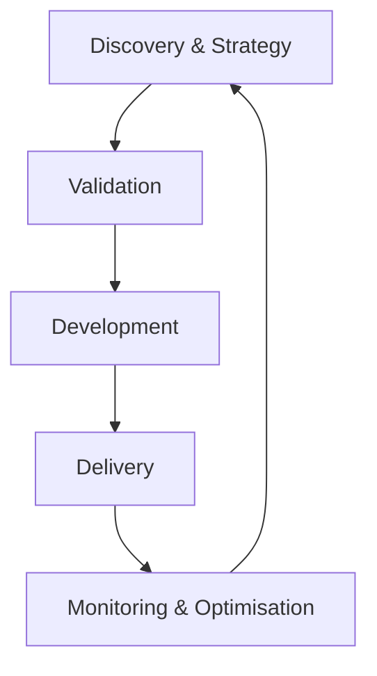

# 1. AI Lifecycle

## 1. Objective

This document defines the complete methodology for AI projects and forms the foundation of the AI lifecycle. It describes the 5 phases of AI projects and serves as the central roadmap for the team.

______________________________________________________________________

## 2. Overview of the AI Lifecycle

A successful AI project is not a linear process, but an iterative cycle in which technology, business and compliance are continuously aligned. The AI lifecycle consists of 5 phases that overlap and reinforce one another:

### Key Characteristics

- **Iterative:** Each phase learns from the previous and feeds the next.
- **Hybrid:** Combines predictable planning with agile execution (see [Hybrid Methodology](02-hybride-methodologie.md)).
- **Compliance-First:** EU AI Act compliance is integrated into every phase.
- **Traceability:** Every decision is supported by evidence.
- **Human Oversight:** Humans remain responsible for AI decisions.

______________________________________________________________________

## 3. The Five Lifecycle Phases

> \[!TIP\]
> **The Fast Lane (The Innovation Route)**
> For projects with a **Minimal/Limited Risk** level and an **Instrumental/Advisory mode** (Mode 1 & 2) we offer an accelerated route. Following a positive **Risk Pre-Scan** (Gate 1), a limited **Validation pilot** can be started directly, without an extensive business case.

### Discovery & Strategy

**📍 Objective:** Identifying the right problem and verifying that we are ready to start.

#### Core Activities

- **Problem Exploration:** Define the problem from the user's perspective, not from the technology's perspective.
- **Data Evaluation:** Assessing Access, Quality and Relevance of the data.
- **Risk Inventory:** Determining whether the application falls under the EU AI Act (high risk).

______________________________________________________________________

### Validation

**📍 Objective:** Proving that the idea works and is financially viable before making a major investment.

#### Core Activities

- **Validation Pilot (PoV):** Small-scale experiment to test the hypothesis.
- **Cost Overview:** Estimating investment versus ROI.
- **Fairness Check (Bias Detection):** Initial scan for undesired bias in the model.

______________________________________________________________________

### Development

**📍 Objective:** Building a robust, production-ready solution.

#### Core Activities

- **Specification-First Method:** Write tests first, then implement.
- **Knowledge Coupling:** Connecting the AI to internal business information.
- **Model Fine-Tuning:** Optimising the parameters and **Steering Instructions**.

______________________________________________________________________

### Delivery

**📍 Objective:** A safe **Go-live** and acceptance by the organisation.

#### Core Activities

- **Go-live Plan:** Phased rollout to production.
- **Human Oversight:** Implementing supervision protocols.
- **Adoption & Training:** Training users in the new way of working.

______________________________________________________________________

### Monitoring & Optimisation

**📍 Objective:** Retaining value and keeping the solution current.

#### Core Activities

- **Performance Degradation Monitoring:** Continuously monitoring accuracy and drift.
- **Cost Control:** Optimising consumption and resources.
- **Feedback Loop:** Feeding user experiences back to Phase 1.

______________________________________________________________________

## 4. Related Modules

- [Hybrid Methodology](02-hybride-methodologie.md)
- [Governance Model](03-governance-model.md)
- [Agile Anti-patterns](04-agile-antipatronen-niet-toegestaan.md)
- [Project Initiation](05-project-initiatie.md)

______________________________________________________________________
