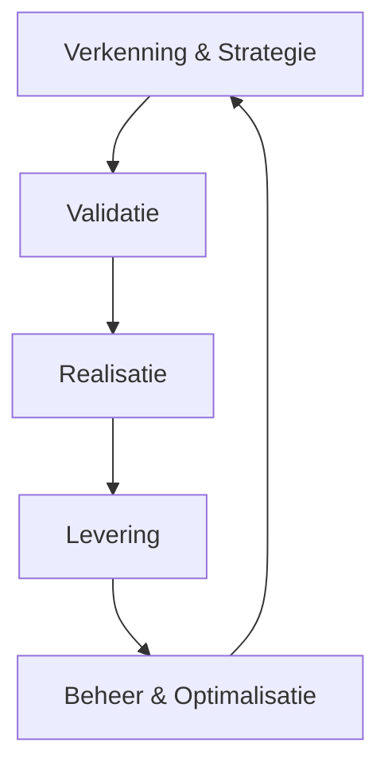

# 1. AI Levenscyclus

## 1. Doel

Dit document definieert de volledige methodologie voor AI projecten en vormt de fundering van de AI levenscyclus. Het beschrijft de 5 fasen van AI projecten en fungeert als centrale routekaart voor het team.

______________________________________________________________________

## 2. Overzicht van de AI Levenscyclus

Een succesvol AI-project is geen lineair proces, maar een iteratieve cyclus waarbij techniek, business en compliance constant op elkaar worden afgestemd. De AI levenscyclus bestaat uit 5 fasen die elkaar overlappen en versterken:

### Belangrijkste Kenmerken

- **Iteratief:** Elke fase leert van de vorige en voedt de volgende.
- **Hybride:** Combineert voorspelbare planning met agile uitvoering (zie [Hybride Methodologie](02-hybride-methodologie.md)).
- **Compliance-First:** EU AI Act compliance is geïntegreerd in elke fase.
- **Traceerbaarheid:** Elke beslissing wordt ondersteund door bewijs.
- **Mensgerichte Regie:** Mensen blijven verantwoordelijk voor AI-beslissingen.

______________________________________________________________________

## 3. De Vijf Fasen van de Levenscyclus

> \[!TIP\]
> **De Fast Lane (De Innovatie-route)**
> Voor projecten met een **Minimaal/Beperkt Risico** en een **Instrumentele/Adviserende modus** (Modus 1 & 2) bieden we een versnelde route. Hierbij kan na een positieve **Risico Pre-Scan** (Gate 1) direct worden gestart met een beperkte **Praktijkproef**, zonder uitgebreide business case.

### Verkenning & Strategie

**📍 Doel:** Het identificeren van het juiste probleem en toetsen of we klaar zijn om te starten.

#### Kernactiviteiten

- **Probleemverkenning:** Het probleem definiëren vanuit de gebruiker, niet vanuit de techniek.
- **Data-Evaluatie:** Beoordelen van Toegang, Kwaliteit en Relevantie van de data.
- **Risico-Inventarisatie:** Bepalen of de toepassing valt onder de EU AI Act (hoog risico).

______________________________________________________________________

### Validatie

**📍 Doel:** Bewijzen dat het idee werkt en financieel levensvatbaar is voordat we groot investeren.

#### Kernactivities

- **Praktijkproef (PoV):** Kleinschalig experiment om de hypothese te testen.
- **Het Kostenoverzicht:** Schatten van investering versus ROI.
- **Eerlijkheidstoets (Bias Detectie):** Eerste scan op ongewenste vooroordelen in het model.

______________________________________________________________________

### Realisatie

**📍 Doel:** Het bouwen van een robuuste, productiewaardige oplossing.

#### Kernactiviteiten

- **Specificatie-eerst Methode:** Eerst tests schrijven, dan pas de implementatie.
- **Kenniskoppeling (RAG):** De AI verbinden aan interne bedrijfsinformatie.
- **Afstellen van het model:** Optimaliseren van de parameters en **Sturingsinstructies**.

______________________________________________________________________

### Levering

**📍 Doel:** Een veilige **Ingebruikname** en acceptatie door de organisatie.

#### Kernactiviteiten

- **Ingebruikname Plan:** Stapsgewijze uitrol naar productie.
- **Menselijke Regie:** Implementeren van toezichtsprotocollen.
- **Adoptie & Training:** Gebruikers opleiden in de nieuwe werkwijze.

______________________________________________________________________

### Beheer & Optimalisatie

**📍 Doel:** Waarde behouden en de oplossing actueel houden.

#### Kernactiviteiten

- **Prestatieverloop Meten:** Continu monitoren van accuraatheid en drift.
- **Kostenbeheersing:** Het verbruik en de middelen optimaliseren.
- **Feedbacklus:** Gebruikerservaringen terugkoppelen naar Fase 1.

______________________________________________________________________

## 4. Gerelateerde Modules

- [Hybride Methodologie](02-hybride-methodologie.md)
- [Governance Model](03-governance-model.md)
- [Agile Antipatronen](04-agile-antipatronen-niet-toegestaan.md)
- [Project Initiatie](05-project-initiatie.md)

______________________________________________________________________
