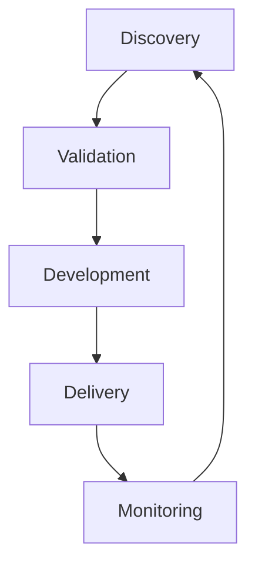

# AI Levenscyclus

## Doel
Dit document definieert de volledige methodologie voor AI projecten en vormt de fundering van de AI levenscyclus. Het beschrijft de 5 fasen van AI projecten en fungeert als centrale routekaart voor het team.

## Overzicht van de AI Levenscyclus
Een succesvol AI-project is geen lineair proces, maar een iteratieve cyclus waarbij techniek, business en compliance constant op elkaar worden afgestemd. De AI levenscyclus bestaat uit 5 fasen die elkaar overlappen en versterken:

### Belangrijkste Kenmerken
*   **Iteratief:** Elke fase leert van de vorige en voedt de volgende.
*   **Hybride:** Combineert voorspelbare planning met agile uitvoering (zie [Hybride Methodologie](02-hybride-methodologie.md)).
*   **Compliance-First:** EU AI Act compliance is geïntegreerd in elke fase.
*   **Evidence-Based:** Elke beslissing wordt ondersteund door bewijs (*Evidence-First*).
*   **Human-Centric:** Mensen blijven verantwoordelijk voor AI-beslissingen.

## De 5 Fasen van AI Projecten

### Fase 1: Discovery (Ontdekking & Strategie)
**Doel:** Het identificeren van use cases met een hoge businesswaarde.

#### Kernactiviteiten
*   **Problem Framing:** Het probleem definiëren vanuit de gebruiker, niet vanuit de techniek.
    *   *Vraag:* "Welk probleem lossen we op voor wie?"
*   **Data Readiness Check:** Beoordelen of er voldoende kwalitatieve data beschikbaar is.
    *   Identificeren van data silo's en aggregatie uitdagingen.
*   **EU AI Act Classificatie:** Bepalen of de toepassing valt onder de categorie 'hoog risico'.
*   **Use Case Identificatie:** Brainstormen en prioriteren op business value en haalbaarheid.

#### Checkpoint
*   [ ] Is er een duidelijk *Project Charter*?
*   [ ] Is het probleem met AI op te lossen?
*   [ ] Is de data beschikbaar en van voldoende kwaliteit?

---

### Fase 2: Validation & Business Case (Haalbaarheid)
**Doel:** Risico's minimaliseren en budget veiligstellen.

#### Kernactiviteiten
*   **Proof of Value (PoV):** Kleinschalig experiment om de hypothese te testen en technische haalbaarheid te valideren.
*   **ROI-Berekening:** Schatten van kosten (personeel, compute) versus baten (efficiëntie, omzet).
*   **Prioritering:** Matrix-analyse voor high-value, low-effort projecten.
*   **Risk Assessment:** Diepgaande risicoanalyse (data-acquisitie, model-bias) en ethische toetsing.

#### Checkpoint
*   [ ] Is de *PoV* succesvol (accuracy criteria behaald)?
*   [ ] Is de *ROI* positief binnen 12 maanden?
*   [ ] Zijn de risico's acceptabel en beheersbaar?

---

### Fase 3: Development & Engineering (De Bouwfase)
**Doel:** Het bouwen van een robuust, veilig en ethisch model.

#### Kernactiviteiten
*   **Data Pipelines:** Inrichten van geautomatiseerde cleaning en governance (*Data Lineage*).
*   **Model Training & Tuning:** Selecteren, trainen en optimaliseren van algoritmes (hyperparameter tuning).
*   **Compliance by Design:** Implementeren van bias-mitigatie en *Explainability*.
*   **Quality Checks:** Automatische testen op code-kwaliteit en model-accuraatheid.

#### Checkpoint
*   [ ] Is het model getraind en gevalideerd?
*   [ ] Zijn de tests geslaagd?
*   [ ] Is de documentatie volledig?

---

### Fase 4: Delivery & Deployment (Implementatie)
**Doel:** Een veilige overgang naar productie en adoptie door gebruikers.

#### Kernactiviteiten
*   **Infrastructuur:** Opzetten van schaalbare omgevingen (cloud/on-premise) en security.
*   **Change Management:** Training van medewerkers en stakeholder communicatie.
*   **Certificering:** Afronden technische documentatie (o.a. voor CE-markering bij hoog-risico).

#### Checkpoint
*   [ ] Is het systeem veilig gedeployed?
*   [ ] Zijn gebruikers getraind?
*   [ ] Is de compliance gedocumenteerd?

---

### Fase 5: Monitoring & Maintenance (Optimalisatie)
**Doel:** Het voorkomen van *model drift* en het continu verbeteren van de prestaties.

#### Kernactiviteiten
*   **Real-time Dashboards:** Monitoren van accuraatheid, latency, kosten en anomalieën.
*   **Drift Detection:** Signaleren van prestatieverlies; automatische triggers voor hertraining.
*   **Feedback Loops:** Gebruikerservaringen terugkoppelen naar Fase 1.
*   **Energie-efficiëntie:** Meten en minimaliseren van de ecologische voetafdruk.

#### Checkpoint
*   [ ] Is het systeem stabiel in productie?
*   [ ] Wordt *drift* gedetecteerd en aangepakt?
*   [ ] Wordt de business value gemeten?

## Gerelateerde Modules
*   [Hybride Methodologie](02-hybride-methodologie.md)
*   [Governance Model](03-governance-model.md)
*   [Agile Antipatronen](04-agile-antipatronen-niet-toegestaan.md)
*   [Project Initiatie](05-project-initiatie.md)

---
© 2026 AI Project Playbook. Gelicenseerd onder CC BY-NC-SA 4.0.
