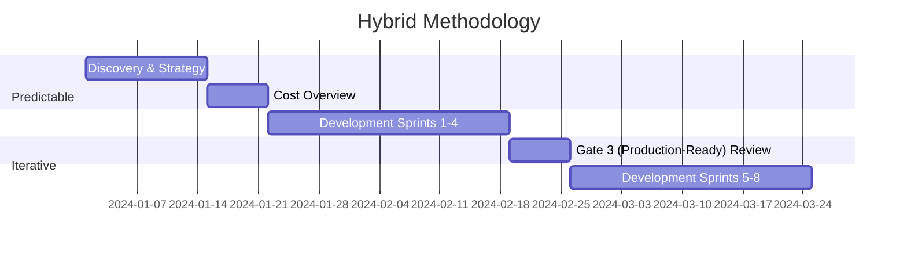

# 1. Hybrid Methodology

!!! abstract "Purpose"
    Explanation of the hybrid Agile-Waterfall approach that combines predictable planning with iterative AI development.

## 1. Objective

This document describes the hybrid approach of the AI Project Blueprint, combining predictable planning (Waterfall) with iterative execution (Agile) for an optimal balance between structure and flexibility.

______________________________________________________________________

## 2. Concept

The hybrid methodology recognises that AI projects require strict milestones for budgeting and compliance on the one hand, and extreme flexibility during model development on the other.

### Predictable Elements (Waterfall)

- Strategic planning and **Cost Overview**.
- Compliance and governance checkpoints.
- Risk inventory.
- Milestone planning (**Gates**).

### Iterative Elements (Agile)

- **Model Fine-Tuning**.
- User feedback loops.
- *Experiment-driven development*.
- Continuous improvement (*Kaizen*).

### When to use which element?

The choice between waterfall and agile is not binary. Use the following guideline:

| Situation                                          | Approach                 | Rationale                                                                                                                            |
| :------------------------------------------------- | :----------------------- | :----------------------------------------------------------------------------------------------------------------------------------- |
| Defining scope, budget and compliance requirements | Waterfall                | Stakeholders and budget owners need predictability. Gates serve as formal decision points.                                           |
| Model development and prompt engineering           | Agile (1-2 week sprints) | Outcomes are inherently uncertain; short iterations enable rapid feedback and course correction.                                     |
| Data exploration and feature engineering           | Agile with timeboxes     | Data quality only becomes visible after exploration. Set a fixed timebox (e.g. 2 weeks) for data exploration to prevent scope creep. |
| Gate Reviews and compliance audits                 | Waterfall                | Regulation (EU AI Act) requires documented checkpoints with formal approval.                                                         |
| User acceptance and adoption                       | Agile                    | End-user feedback is only meaningful with working prototypes. Iterate based on observations.                                         |

______________________________________________________________________

## 3. Uncertainty in AI versus traditional software

In traditional software projects, uncertainty is primarily technical: *can* it be built? In AI projects, uncertainty is fundamentally different:

- **Data quality is only visible late.** Unlike software where requirements are defined upfront, you only discover during the validation phase whether the data is suitable for the intended purpose.
- **Model behaviour is probabilistic.** An AI model does not deterministically produce the same output for the same input. This makes traditional testing methods insufficient.
- **The definition of "good enough" shifts.** In software, a feature is either complete or not. In AI, 85% accuracy may be acceptable for an internal tool, but not for a medical advisory model.
- **External factors change the playing field.** New model versions from providers (e.g. GPT updates), changing regulations, or shifting data distributions can destabilise a working system.

!!! tip "Practical implication"
    Always plan a **validation sprint** after every 2-3 development sprints. Use this sprint not for new features, but exclusively for re-evaluating assumptions and measuring model performance against the Golden Set.

______________________________________________________________________

## 4. Sprint Planning in AI Projects

AI sprints differ from classic Scrum sprints. Take the following adjustments into account:

### Sprint structure (example: 2-week sprint)

| Day     | Activity                                                               |
| :------ | :--------------------------------------------------------------------- |
| Day 1   | Sprint planning: review previous results, select experiments           |
| Day 2-3 | Data preparation and pipeline adjustments                              |
| Day 4-7 | Experiment execution (prompt iterations, fine-tuning, RAG adjustments) |
| Day 8-9 | Evaluation against Golden Set and metrics                              |
| Day 10  | Sprint review with stakeholders + retrospective                        |

### AI-specific backlog items

In addition to standard user stories, an AI backlog contains specific item types:

- **Experiment tickets:** Hypothesis-driven tasks with an expected outcome and a measurable metric (e.g. "If we adjust the system prompt with domain context, we expect >10% improvement on the Golden Set").
- **Data quality tickets:** Tasks focused on improving training or evaluation data.
- **Guardrail tickets:** Implementation or refinement of Hard Boundaries.
- **Validation tickets:** Evaluation runs, bias checks, and Red Teaming sessions.

!!! warning "Avoid the anti-pattern: 'infinite experimentation'"
    Set a maximum number of iterations per experiment (e.g. 3 sprints). If the target metric is not achieved after 3 sprints, escalate to a Gate Review for a go/no-go decision. See also [Agile Anti-patterns](04-agile-antipatronen-niet-toegestaan.md).

______________________________________________________________________

## 5. Practical Implementation

______________________________________________________________________

## 6. Benefits

- **Structure:** Clear planning and governance for management.
- **Flexibility:** Rapid adaptation to new data insights for the team.
- **Risk Management:** Proactive risk identification and mitigation.
- **Compliance:** Integrated EU AI Act compliance reviews.
- **Predictability for stakeholders:** Gates provide fixed reporting moments, while the team is free to experiment within sprints.

______________________________________________________________________
