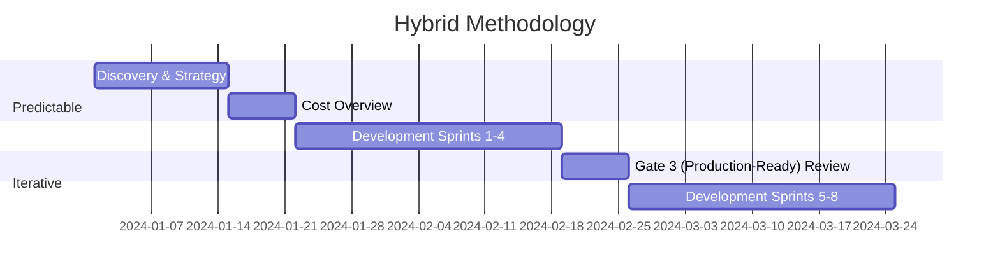

# 1. Hybrid Methodology

## 1. Objective

This document describes the hybrid approach of the AI Project Blueprint, combining predictable planning (Waterfall) with iterative execution (Agile) for an optimal balance between structure and flexibility.

______________________________________________________________________

## 2. Concept

The hybrid methodology recognises that AI projects require strict milestones for budgeting and compliance on the one hand, and extreme flexibility during model development on the other.

### Predictable Elements (Waterfall)

- Strategic planning and **Cost Overview**.
- Compliance and governance checkpoints.
- Risk inventory.
- Milestone planning (**Gates**).

### Iterative Elements (Agile)

- **Model Fine-Tuning**.
- User feedback loops.
- *Experiment-driven development*.
- Continuous improvement (*Kaizen*).

______________________________________________________________________

## 3. Practical Implementation

______________________________________________________________________

## 4. Benefits

- **Structure:** Clear planning and governance for management.
- **Flexibility:** Rapid adaptation to new data insights for the team.
- **Risk Management:** Proactive risk identification and mitigation.
- **Compliance:** Integrated EU AI Act compliance reviews.

______________________________________________________________________
