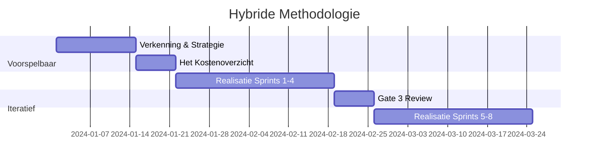

# 🚀 Hybride Methodologie

## 📖 Doel

Dit document beschrijft de hybride aanpak van het AI Project Playbook, waarbij voorspelbare planning (Waterfall) wordt gecombineerd met iteratieve uitvoering (Agile) voor een optimale balans tussen structuur en flexibiliteit.

______________________________________________________________________

## 📖 Concept

De hybride methodologie erkent dat AI-projecten enerzijds strikte mijlpalen vereisen voor budgettering en compliance, en anderzijds extreme flexibiliteit nodig hebben tijdens de modelontwikkeling.

### Voorspelbare Elementen (Waterfall)

- Strategische planning en **Het Kostenoverzicht**.
- Compliance en governance checkpoints.
- Risico-inventarisatie.
- Mijlpaal planning (**Gates**).

### Iteratieve Elementen (Agile)

- **Afstellen van het model** en tuning.
- User feedback loops.
- *Experiment-driven development*.
- Continue verbetering (*Kaizen*).

______________________________________________________________________

## 📖 Praktische Implementatie

______________________________________________________________________

## ? Voordelen

- **Structuur:** Duidelijke planning en governance voor management.
- **Flexibiliteit:** Snelle aanpassing aan nieuwe data-inzichten voor het team.
- **Risicobeheer:** Proactieve risico-identificatie en mitigatie.
- **Compliance:** Geïntegreerde EU AI Act compliance reviews.

______________________________________________________________________

**Versie:** 2.0
**Datum:** 31 januari 2026
**Status:** Draft
