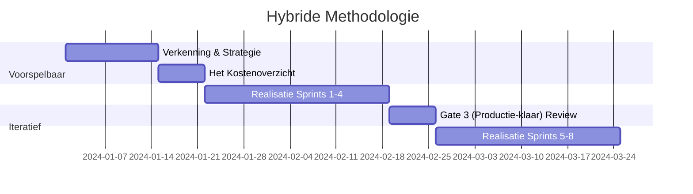

# 1. Hybride Methodologie

!!! abstract "Doel"
    Uitleg van de hybride Agile-Waterfall aanpak die voorspelbare planning combineert met iteratieve AI-ontwikkeling.

## 1. Doel

Dit document beschrijft de hybride aanpak van de AI Project Blauwdruk, waarbij voorspelbare planning (Waterfall) wordt gecombineerd met iteratieve uitvoering (Agile) voor een optimale balans tussen structuur en flexibiliteit.

______________________________________________________________________

## 2. Concept

De hybride methodologie erkent dat AI-projecten enerzijds strikte mijlpalen vereisen voor budgettering en compliance, en anderzijds extreme flexibiliteit nodig hebben tijdens de modelontwikkeling.

### Voorspelbare Elementen (Waterfall)

- Strategische planning en **Het Kostenoverzicht**.
- Compliance en governance checkpoints.
- Risico-inventarisatie.
- Mijlpaal planning (**Gates**).

### Iteratieve Elementen (Agile)

- **Fine-tuning** en tuning.
- User feedback loops.
- *Experiment-driven development*.
- Continue verbetering (*Kaizen*).

### Wanneer welk element?

De keuze tussen waterfall en agile is niet binair. Gebruik de volgende richtlijn:

| Situatie                                      | Aanpak                        | Reden                                                                                                                                     |
| :-------------------------------------------- | :---------------------------- | :---------------------------------------------------------------------------------------------------------------------------------------- |
| Scope, budget en compliance-eisen vaststellen | Waterfall                     | Stakeholders en budget-eigenaren hebben voorspelbaarheid nodig. Gates fungeren als formele beslismomenten.                                |
| Modelontwikkeling en prompt engineering       | Agile (sprints van 1-2 weken) | Resultaten zijn inherent onzeker; korte iteraties maken snelle feedback en bijsturing mogelijk.                                           |
| Data-exploratie en feature engineering        | Agile met timeboxes           | Data-kwaliteit is pas zichtbaar na exploratie. Stel een vaste timebox (bijv. 2 weken) in voor dataverkenning om scope creep te voorkomen. |
| Gate Reviews en compliance-audits             | Waterfall                     | Regelgeving (EU AI Act) vereist gedocumenteerde checkpoints met formele goedkeuring.                                                      |
| Gebruikersacceptatie en adoptie               | Agile                         | Feedback van eindgebruikers is pas zinvol met werkende prototypes. Itereer op basis van observaties.                                      |

______________________________________________________________________

## 3. Onzekerheid in AI versus traditionele software

In traditionele softwareprojecten is onzekerheid voornamelijk technisch: *kan* het gebouwd worden? Bij AI-projecten is de onzekerheid fundamenteel anders:

- **Datakwaliteit is pas laat zichtbaar.** Anders dan bij software waar requirements vooraf gedefinieerd zijn, ontdek je pas tijdens de validatiefase of de data geschikt is voor het beoogde doel.
- **Modelgedrag is probabilistisch.** Een AI-model geeft niet deterministisch hetzelfde antwoord bij dezelfde input. Dit maakt traditionele testmethoden ontoereikend.
- **De definitie van "goed genoeg" verschuift.** Bij software is een feature af of niet af. Bij AI is 85% accuracy misschien acceptabel voor een intern hulpmiddel, maar niet voor een medisch adviesmodel.
- **Externe factoren veranderen het speelveld.** Nieuwe modelversies van providers (bijv. GPT-updates), veranderende regelgeving of verschuivende data-distributies kunnen een werkend systeem destabiliseren.

!!! tip "Praktische implicatie"
    Plan altijd een **validatiesprint** na elke 2-3 ontwikkelsprints. Gebruik deze sprint niet voor nieuwe features, maar uitsluitend voor het herevalueren van aannames en het meten van modelprestaties tegen de Golden Set.

______________________________________________________________________

## 4. Sprint Planning in AI-projecten

AI-sprints wijken af van klassieke Scrum-sprints. Houd rekening met de volgende aanpassingen:

### Sprint-structuur (voorbeeld: 2-weekse sprint)

| Dag     | Activiteit                                                              |
| :------ | :---------------------------------------------------------------------- |
| Dag 1   | Sprint planning: review vorige resultaten, selecteer experimenten       |
| Dag 2-3 | Data-voorbereiding en pipeline-aanpassingen                             |
| Dag 4-7 | Experiment-uitvoering (prompt iteraties, fine-tuning, RAG-aanpassingen) |
| Dag 8-9 | Evaluatie tegen Golden Set en metrics                                   |
| Dag 10  | Sprint review met stakeholders + retrospective                          |

### AI-specifieke backlog items

Naast standaard user stories bevat een AI-backlog specifieke itemtypes:

- **Experiment tickets:** Hypothese-gedreven taken met een verwacht resultaat en een meetbare metric (bijv. "Als we de system prompt aanpassen met domeincontext, verwachten we >10% verbetering op de Golden Set").
- **Data quality tickets:** Taken gericht op het verbeteren van trainings- of evaluatiedata.
- **Guardrail tickets:** Implementatie of verfijning van Harde Grenzen.
- **Validatie tickets:** Evaluatie-runs, bias-checks en Red Teaming sessies.

!!! warning "Vermijd het anti-patroon: 'oneindige experimentatie'"
    Stel per experiment een maximaal aantal iteraties in (bijv. 3 sprints). Als na 3 sprints de doelmetric niet behaald is, escaleer naar een Gate Review voor een go/no-go beslissing. Zie ook [Agile Anti-patronen](04-agile-antipatronen-niet-toegestaan.md).

______________________________________________________________________

## 5. Praktische Implementatie

______________________________________________________________________

## 6. Voordelen

- **Structuur:** Duidelijke planning en governance voor management.
- **Flexibiliteit:** Snelle aanpassing aan nieuwe data-inzichten voor het team.
- **Risicobeheer:** Proactieve risico-identificatie en mitigatie.
- **Compliance:** Geïntegreerde EU AI Act compliance reviews.
- **Voorspelbaarheid voor stakeholders:** Gates bieden vaste rapportagemomenten, terwijl het team binnen de sprints vrij is om te experimenteren.

______________________________________________________________________
