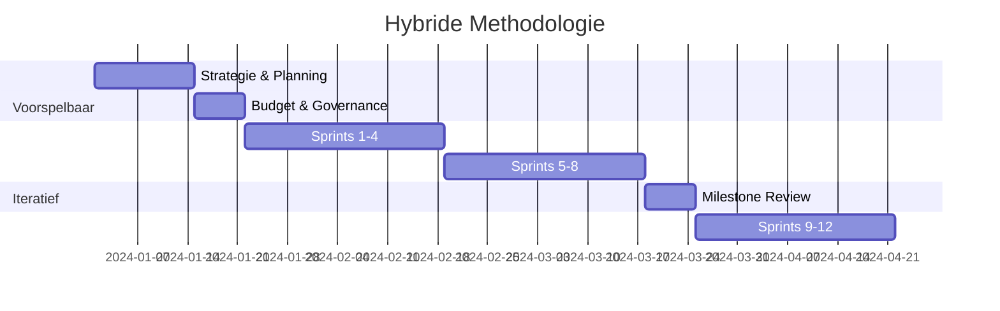

# Hybride Methodologie

## Doel
Dit document beschrijft de hybride aanpak van het AI Project Playbook, waarbij voorspelbare planning (Waterfall) wordt gecombineerd met iteratieve uitvoering (Agile) voor een optimale balans tussen structuur en flexibiliteit.

## Concept
De hybride methodologie erkent dat AI-projecten enerzijds strikte mijlpalen vereisen voor budgettering en compliance, en anderzijds extreme flexibiliteit nodig hebben tijdens de modelontwikkeling.

### Voorspelbare Elementen (Waterfall)
*   Strategische planning en budgettering.
*   Compliance en governance checkpoints.
*   Risk management.
*   Milestone planning.

### Iteratieve Elementen (Agile)
*   Model development en tuning.
*   User feedback loops.
*   *Experiment-driven development*.
*   Continuous improvement (*Kaizen*).

## Praktische Implementatie

## Voordelen
*   **Structuur:** Duidelijke planning en governance voor management.
*   **Flexibiliteit:** Snelle aanpassing aan nieuwe data-inzichten voor het team.
*   **Risicobeheer:** Proactieve risico-identificatie en mitigatie.
*   **Compliance:** Geïntegreerde EU AI Act compliance reviews.

---
© 2026 AI Project Playbook. Door **Frederik Vannieuwenhuyse** & **Hadrien-Joseph van Durme**. Gelicenseerd onder CC BY-NC-SA 4.0.

