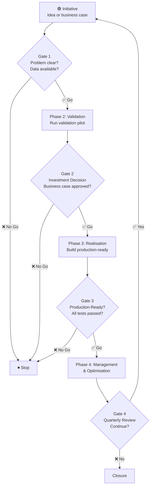

# 1. Governance Model

!!! abstract "Purpose"
    Definition of the decision-making structures, roles and oversight layers that steer AI projects safely and effectively.

## 1. Objective

Defining the decision-making structures, roles and responsibilities to steer AI projects safely and effectively.

!!! info "DORA: clear AI stance amplifies adoption outcomes [so-28]"
    The DORA AI Capabilities Model (2025) shows that a *clear and communicated AI stance* is the most important organisational capability for successful AI adoption. It provides psychological safety for experimentation and amplifies individual effectiveness, organisational performance and throughput. Governance is not a brake but an accelerator. See [External Evidence: DORA](../17-bijlagen/externe-evidence-dora.md#3-dora-ai-capabilities-model-2025).

______________________________________________________________________

## 2. Structure

The governance model consists of three layers that work together to connect strategy, operations and technology:

1. **Strategic Level:** Focus on vision and **Cost Overview**.
1. **Operational Level:** Focus on execution and priority.
1. **Technical Level:** Focus on quality and **Go-live**.

______________________________________________________________________

## 3. Responsibilities

| Role                         | Level       | Core Responsibilities                                                          |
| :--------------------------- | :---------- | :----------------------------------------------------------------------------- |
| **CAIO** (Chief AI Officer)  | Strategic   | Strategy, ROI oversight, Governance ultimate accountability.                   |
| **Executive Committee**      | Strategic   | Budget approval, strategic alignment.                                          |
| **AI Product Manager**       | Operational | Use case priority, Stakeholder management, Backlog owner.                      |
| **AI Transformation Office** | Operational | Process oversight, standardisation, training.                                  |
| **Data Scientist**           | Technical   | Model development, validation, experimentation.                                |
| **ML Engineering**           | Technical   | **Go-live** pipelines, monitoring, infrastructure.                             |
| **Guardian**                 | Supporting  | Safeguards all boundaries: Fairness Audits, Compliance checks, ethical review. |
| **Security Officer**         | Supporting  | Security measures, Privacy safeguarding.                                       |

______________________________________________________________________

## 4. Decision-Making Process (Gate Model)

## 5. Gate Reviews

Each gate acts as a hard stop/go decision. See the [Gate Review Checklist](../09-sjablonen/04-gate-reviews/checklist.md) for specific criteria per phase.

______________________________________________________________________
