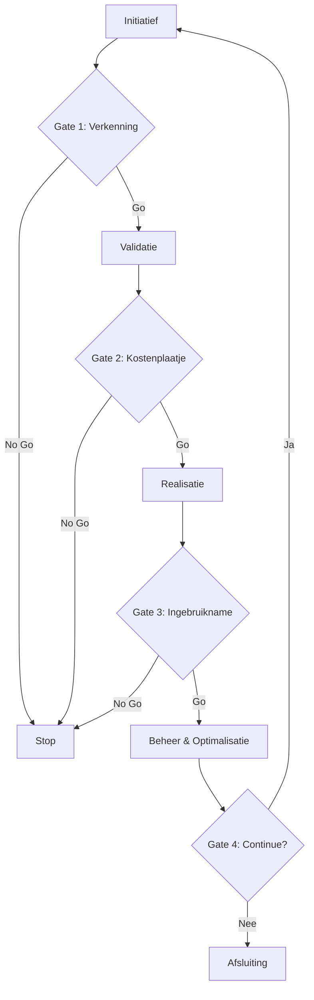

# 🚀 Governance Model
## Documentbeheer
- **Document-ID:** MOD-03
- **Titel:** 📍 Governance Model
- **Versie:** 1.0
- **Status:** Definitief
- **Eigenaar:** AI Competence Center
- **Laatst herzien:** 2026-02-01
- **Wijziging t.o.v. vorige versie:** Header gestandaardiseerd en versie naar 2.2 gezet.

---

## 📖 Doel
Het definiëren van de besluitvormingsstructuren, rollen en verantwoordelijkheden om AI-projecten veilig en effectief te sturen.

---

## 📖 Structuur
Het governance model bestaat uit drie lagen die samenwerken om strategie, operatie en techniek te verbinden:

1.  **Strategisch Niveau:** Focus op visie en **Het Kostenoverzicht**.
2.  **Operationeel Niveau:** Focus op uitvoering en prioriteit.
3.  **Technisch Niveau:** Focus op kwaliteit en **Ingebruikname**.

---

## 📖 Verantwoordelijkheden (RACI)

| Rol | Niveau | Kernverantwoordelijkheden |
| :--- | :--- | :--- |
| **CAIO** (Chief AI Officer) | Strategisch | Strategie, ROI oversight, Governance eindverantwoordelijkheid. |
| **Executive Committee** | Strategisch | Budgetgoedkeuring, strategische alignment. |
| **AI Product Manager** | Operationeel | Use case prioriteit, Stakeholder management, Backlog eigenaar. |
| **AI Transformation Office** | Operationeel | Procesbewaking, standaardisatie, training. |
| **Data Scientist** | Technisch | Model development, validatie, experimentatie. |
| **ML Engineering** | Technisch | **Ingebruikname** pipelines, monitoring, infrastructuur. |
| **Guardian (Ethicist)** | Ondersteunend | Eerlijkheidstoetsen, Bias audits, Compliance checks. |
| **Security Officer** | Ondersteunend | Security maatregelen, Privacy waarborging. |

---

## ? Besluitvormingsproces (Gate Model)

## ? Gate Reviews
Elke gate fungeert als een harde stop/go beslissing. Zie de [Gate Review Checklist](../09-sjablonen/04-gate-reviews/checklist.md) voor specifieke criteria per fase.

---
**Versie:** 2.0
**Datum:** 31 januari 2026
**Status:** Draft

---
---
© 2026 AI Project Playbook. Gelicenseerd onder CC BY-NC-SA 4.0.

