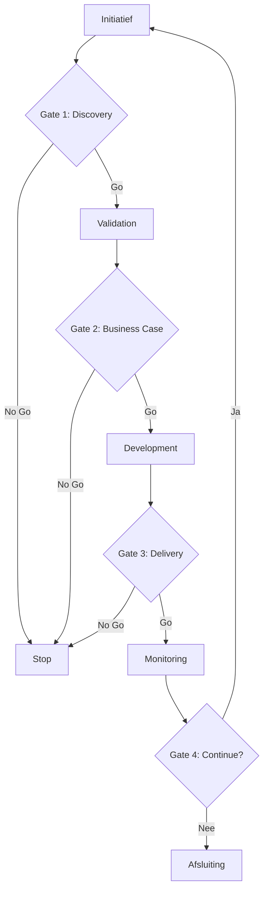

# Governance Model

## Doel
Het definiëren van de besluitvormingsstructuren, rollen en verantwoordelijkheden om AI-projecten veilig en effectief te sturen.

## Structuur
Het governance model bestaat uit drie lagen die samenwerken om strategie, operatie en techniek te verbinden:

1.  **Strategisch Niveau:** Focus op visie en ROI.
2.  **Operationeel Niveau:** Focus op uitvoering en prioriteit.
3.  **Technisch Niveau:** Focus op kwaliteit en implementatie.

## Verantwoordelijkheden (RACI)

| Rol | Niveau | Kernverantwoordelijkheden |
| :--- | :--- | :--- |
| **CAIO** (Chief AI Officer) | Strategisch | Strategie, ROI oversight, Governance eindverantwoordelijkheid. |
| **Executive Committee** | Strategisch | Budgetgoedkeuring, strategische alignment. |
| **AI Product Manager** | Operationeel | Use case prioriteit, Stakeholder management, Backlog eigenaar. |
| **AI Transformation Office** | Operationeel | Procesbewaking, standaardisatie, training. |
| **Data Scientist** | Technisch | Model development, validatie, experimentatie. |
| **MLOps Engineer** | Technisch | Deployment pipelines, monitoring, infrastructuur. |
| **Ethicist / Guardian** | Ondersteunend | Ethische evaluaties, Bias audits, Compliance checks. |
| **Security Officer** | Ondersteunend | Security maatregelen, Privacy waarborging. |

## Besluitvormingsproces (S-Gate Model)

## Gate Reviews
Elke gate fungeert als een harde stop/go beslissing. Zie de [Gate Review Checklist](../09-sjablonen/04-gate-reviews/checklist.md) voor specifieke criteria per fase.

---
© 2026 AI Project Playbook. Door **Frederik Vannieuwenhuyse** & **Hadrien-Joseph van Durme**. Gelicenseerd onder CC BY-NC-SA 4.0.

