# Module 12: 90-Dagen Roadmap

## Doel
Deze roadmap biedt een gestructureerd actieplan om binnen 90 dagen tastbare waarde te leveren met AI. Het doel is om van strategie naar uitvoering te gaan, quick wins te realiseren en een fundament te leggen voor schaalbaarheid.

**Belangrijkste inzicht:** Focus op snelheid en tractie in het begin, en verschuif dan naar structuur en schaalbaarheid.

---

## Fase 1: Richt Focus & Rationaliseer (Dagen 1-30)
**Thema:** Opruimen, Inzicht en Richting.

In deze eerste sprint creëren we ruimte en inzicht. We stoppen met wat niet werkt en kiezen scherp waar we op inzetten.

### Doelstellingen
*   **Stop de waan van de dag:** Identificeer en stop projecten die geen waarde toevoegen ('Zombies').
*   **Inzicht in kosten:** Breng de huidige AI-uitgaven (licenties, cloud) in kaart.
*   **Strategische focus:** Kies 1-2 'Big Bets' die de meeste impact hebben.

### Activiteiten
1.  **Audit van lopende initiatieven:** Welke AI-projecten lopen er? Welke leveren niets op? -> *Action: Kill/Pause besluit*.
2.  **Kostenanalyse:** Verzamel facturen van SaaS en Cloud. Waar lekt geld weg?
3.  **Quick Win Workshop:** Identificeer processen die met standaard tools (Copilot, ChatGPT) direct verbeterd kunnen worden (geen development nodig).
4.  **Capability Scan:** Hebben we de mensen en data voor onze ambities? ([HAS H Assessment](../00-strategisch-kader/06-has-h-niveaus.md)).

### Deliverables (Dag 30)
- [ ] Lijst met gestopte/gepauzeerde projecten (besparing).
- [ ] Kostenoverzicht huidige AI-stack.
- [ ] Selectie van top 2 Use Cases voor Fase 2.
- [ ] Projectteam samengesteld voor de pilot.

---

## Fase 2: Herontwerp & Pilot (Dagen 31-60)
**Thema:** Doen, Testen en Leren.

We gaan bouwen en testen. Niet in isolatie, maar in de operatie. We herontwerpen het werkproces rondom de AI.

### Doelstellingen
*   **Proof of Value:** Bewijs dat de gekozen use case werkt in de praktijk.
*   **Proces Redesign:** Pas het werkproces aan. AI toevoegen aan een slecht proces maakt het alleen maar sneller slecht.
*   **Eerste winst:** Realiseer meetbare besparing of omzetgroei.

### Activiteiten
1.  **Sprint uitvoering:** Bouw/configureer de oplossing (PoV) in 2-4 weken.
2.  **Workflow Herontwerp:** Teken het proces opnieuw uit alsof AI een teamlid is (H3 niveau).
3.  **User Training:** Train de pilotgroep niet alleen in de knoppen, maar in de nieuwe werkwijze.
4.  **Meting:** Start nulmeting en effectmeting.

### Deliverables (Dag 60)
- [ ] Werkend prototype / PoV in handen van gebruikers.
- [ ] Aangepaste procesbeschrijving (SOPs).
- [ ] Eerste resultatenrapportage (bijv. "30% tijdwinst op taak X").
- [ ] Go/No-Go besluit voor opschaling.

---

## Fase 3: Codificeer & Schaal (Dagen 61-90)
**Thema:** Standaardiseren en Uitrollen.

Wat werkte in de pilot, maken we nu de standaard. We bouwen het fundament voor de lange termijn.

### Doelstellingen
*   **Standaardisatie:** Leg de 'winnende' werkwijze vast in beleid en techniek.
*   **Governance:** Formaliseer de regels (Compliance, Security) voor bredere uitrol.
*   **Roadmap 2.0:** Plan de volgende kwartalen.

### Activiteiten
1.  **Playbook creatie:** Schrijf de 'lesgeleerd' op in dit AI Playbook.
2.  **Tech Stack keuze:** Beslis over definitieve platforms/tools voor schaal.
3.  **Organisatie uitrol:** Start communicatie en training voor de rest van de organisatie.
4.  **Governance Setup:** Installeer de AI Board / Ethische commissie structureel.

### Deliverables (Dag 90)
- [ ] Geformaliseerd AI Beleid & Playbook v1.0.
- [ ] Operationeel en getraind team/afdeling.
- [ ] Schaalbare technische architectuur.
- [ ] Roadmap voor de komende 12 maanden.

---

## Samenvatting Tijdlijn

```mermaid
gantt
    title 90-Dagen Roadmap
    dateFormat  X
    axisFormat Dag %x
    
    section Fase 1: Focus
    Audit & Rationalisatie      :0, 15
    Strategie & Selectie        :10, 30
    
    section Fase 2: Pilot
    PoV Bouwen                  :30, 50
    Proces Herontwerp           :35, 55
    User Testing                :50, 60
    
    section Fase 3: Schaal
    Standaardisatie             :60, 80
    Governance & Uitrol         :70, 90
```

---

## Gerelateerde Modules
*   [Module 15: Accelerators](../15-accelerators/index.md)
*   [Module 13: Organisatieprofielen](../13-organisatieprofielen/index.md)
*   [Module 02: Fase Ontdekking](../02-fase-ontdekking/index.md)
*   [Module 03: Fase Validatie](../03-fase-validatie/index.md)

---
© 2026 AI Project Playbook. Gelicenseerd onder CC BY-NC-SA 4.0.
