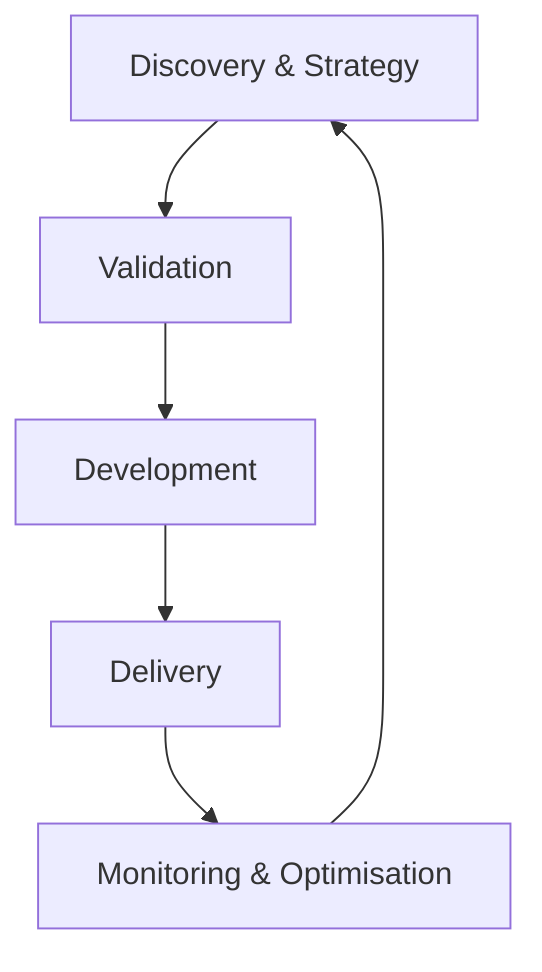
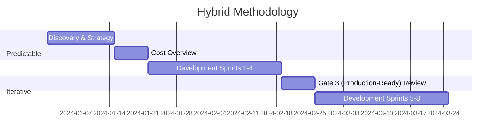

# AI Project Blueprint — English

*Generated from 99 source files*

______________________________________________________________________

<!-- SOURCE: docs/index.en.md -->

# Welcome to the AI Project Blueprint

!!! info "Translation in progress"
    This page is being translated. See the [Dutch original](index.md).

______________________________________________________________________

<!-- SOURCE: docs/release-notes.en.md -->

# Release Notes

!!! info "Translation in progress"
    This page is being translated. See the [Dutch original](release-notes.md).

______________________________________________________________________

<!-- SOURCE: docs/00-strategisch-kader/00-executive-summary.en.md -->

# Executive Summary

!!! info "Translation in progress"
    This page is being translated. See the [Dutch original](00-executive-summary.md).

______________________________________________________________________

<!-- SOURCE: docs/00-strategisch-kader/00-leeswijzer.en.md -->

# Reader's Guide & Navigation

!!! info "Translation in progress"
    This page is being translated. See the [Dutch original](00-leeswijzer.md).

______________________________________________________________________

<!-- SOURCE: docs/00-strategisch-kader/01-ai-levenscyclus.en.md -->

# 1. AI Lifecycle

## 1. Objective

This document defines the complete methodology for AI projects and forms the foundation of the AI lifecycle. It describes the 5 phases of AI projects and serves as the central roadmap for the team.

______________________________________________________________________

## 2. Overview of the AI Lifecycle

A successful AI project is not a linear process, but an iterative cycle in which technology, business and compliance are continuously aligned. The AI lifecycle consists of 5 phases that overlap and reinforce one another:



### Key Characteristics

- **Iterative:** Each phase learns from the previous and feeds the next.
- **Hybrid:** Combines predictable planning with agile execution (see [Hybrid Methodology](02-hybride-methodologie.md)).
- **Compliance-First:** EU AI Act compliance is integrated into every phase.
- **Traceability:** Every decision is supported by evidence.
- **Human Oversight:** Humans remain responsible for AI decisions.

______________________________________________________________________

## 3. The Five Lifecycle Phases

> \[!TIP\]
> **The Fast Lane (The Innovation Route)**
> For projects with a **Minimal/Limited Risk** level and an **Instrumental/Advisory mode** (Mode 1 & 2) we offer an accelerated route. Following a positive **Risk Pre-Scan** (Gate 1), a limited **Validation pilot** can be started directly, without an extensive business case.

### Discovery & Strategy

**📍 Objective:** Identifying the right problem and verifying that we are ready to start.

#### Core Activities

- **Problem Exploration:** Define the problem from the user's perspective, not from the technology's perspective.
- **Data Evaluation:** Assessing Access, Quality and Relevance of the data.
- **Risk Inventory:** Determining whether the application falls under the EU AI Act (high risk).

______________________________________________________________________

### Validation

**📍 Objective:** Proving that the idea works and is financially viable before making a major investment.

#### Core Activities

- **Validation Pilot (PoV):** Small-scale experiment to test the hypothesis.
- **Cost Overview:** Estimating investment versus ROI.
- **Fairness Check (Bias Detection):** Initial scan for undesired bias in the model.

______________________________________________________________________

### Development

**📍 Objective:** Building a robust, production-ready solution.

#### Core Activities

- **Specification-First Method:** Write tests first, then implement.
- **Knowledge Coupling:** Connecting the AI to internal business information.
- **Model Fine-Tuning:** Optimising the parameters and **Steering Instructions**.

______________________________________________________________________

### Delivery

**📍 Objective:** A safe **Go-live** and acceptance by the organisation.

#### Core Activities

- **Go-live Plan:** Phased rollout to production.
- **Human Oversight:** Implementing supervision protocols.
- **Adoption & Training:** Training users in the new way of working.

______________________________________________________________________

### Monitoring & Optimisation

**📍 Objective:** Retaining value and keeping the solution current.

#### Core Activities

- **Performance Degradation Monitoring:** Continuously monitoring accuracy and drift.
- **Cost Control:** Optimising consumption and resources.
- **Feedback Loop:** Feeding user experiences back to Phase 1.

______________________________________________________________________

## 4. Related Modules

- [Hybrid Methodology](02-hybride-methodologie.md)
- [Governance Model](03-governance-model.md)
- [Agile Anti-patterns](04-agile-antipatronen-niet-toegestaan.md)
- [Project Initiation](05-project-initiatie.md)

______________________________________________________________________

______________________________________________________________________

<!-- SOURCE: docs/00-strategisch-kader/02-hybride-methodologie.en.md -->

# 1. Hybrid Methodology

## 1. Objective

This document describes the hybrid approach of the AI Project Blueprint, combining predictable planning (Waterfall) with iterative execution (Agile) for an optimal balance between structure and flexibility.

______________________________________________________________________

## 2. Concept

The hybrid methodology recognises that AI projects require strict milestones for budgeting and compliance on the one hand, and extreme flexibility during model development on the other.

### Predictable Elements (Waterfall)

- Strategic planning and **Cost Overview**.
- Compliance and governance checkpoints.
- Risk inventory.
- Milestone planning (**Gates**).

### Iterative Elements (Agile)

- **Model Fine-Tuning**.
- User feedback loops.
- *Experiment-driven development*.
- Continuous improvement (*Kaizen*).

______________________________________________________________________

## 3. Practical Implementation



______________________________________________________________________

## 4. Benefits

- **Structure:** Clear planning and governance for management.
- **Flexibility:** Rapid adaptation to new data insights for the team.
- **Risk Management:** Proactive risk identification and mitigation.
- **Compliance:** Integrated EU AI Act compliance reviews.

______________________________________________________________________

______________________________________________________________________

<!-- SOURCE: docs/00-strategisch-kader/03-governance-model.en.md -->

# 1. Governance Model

## 1. Objective

Defining the decision-making structures, roles and responsibilities to steer AI projects safely and effectively.

______________________________________________________________________

## 2. Structure

The governance model consists of three layers that work together to connect strategy, operations and technology:

1. **Strategic Level:** Focus on vision and **Cost Overview**.
1. **Operational Level:** Focus on execution and priority.
1. **Technical Level:** Focus on quality and **Go-live**.

______________________________________________________________________

## 3. Responsibilities

| Role                         | Level       | Core Responsibilities                                        |
| :--------------------------- | :---------- | :----------------------------------------------------------- |
| **CAIO** (Chief AI Officer)  | Strategic   | Strategy, ROI oversight, Governance ultimate accountability. |
| **Executive Committee**      | Strategic   | Budget approval, strategic alignment.                        |
| **AI Product Manager**       | Operational | Use case priority, Stakeholder management, Backlog owner.    |
| **AI Transformation Office** | Operational | Process oversight, standardisation, training.                |
| **Data Scientist**           | Technical   | Model development, validation, experimentation.              |
| **ML Engineering**           | Technical   | **Go-live** pipelines, monitoring, infrastructure.           |
| **Guardian (Ethicist)**      | Supporting  | Fairness checks, Bias audits, Compliance checks.             |
| **Security Officer**         | Supporting  | Security measures, Privacy safeguarding.                     |

______________________________________________________________________

## 4. Decision-Making Process (Gate Model)

```mermaid
flowchart TD
 A[Initiative] --> B{Gate 1 (Go/No-Go Discovery): Discovery}
 B -->|Go| C[Validation]
 B -->|No Go| X[Stop]
 C --> D{Gate 2 (PoV Investment): Cost Overview}
 D -->|Go| E[Development]
 D -->|No Go| X
 E --> F{Gate 3 (Production-Ready): Go-live}
 F -->|Go| G[Monitoring & Optimisation]
 F -->|No Go| X
 G --> H{Gate 4 (Go-live): Continue?}
 H -->|Yes| A
 H -->|No| I[Closure]
```

## 5. Gate Reviews

Each gate acts as a hard stop/go decision. See the [Gate Review Checklist](../09-sjablonen/04-gate-reviews/checklist.md) for specific criteria per phase.

______________________________________________________________________

______________________________________________________________________

<!-- SOURCE: docs/00-strategisch-kader/04-agile-antipatronen-niet-toegestaan.en.md -->

# 1. Agile Anti-patterns

## 1. Objective

This list defines the "NOT DONE" criteria for AI projects: Agile anti-patterns that must be absolutely avoided to prevent failure, unethical behaviour or compliance issues.

______________________________________________________________________

## 2. The "NOT DONE" List

### No Fairness Check (Bias Audit)

- **Rule:** AI systems must be regularly checked for bias.
- **Impact:** Discrimination and reputational damage.

### No Human Oversight

- **Rule:** AI decisions (especially at high risk) must have human approval or 'in-the-loop' supervision in line with the chosen **Collaboration Mode**.
- **Impact:** Uncontrolled errors.

### No Continuous Monitoring

- **Rule:** Models degrade over time (**Performance Degradation**). Continuous monitoring is required.
- **Impact:** Performance loss and unreliable output.

### No Governance Checkpoints

- **Rule:** Every phase must have formal checkpoints (**Gates**).
- **Impact:** Unmanageable risks and budget overruns.

### No Stakeholder Engagement

- **Rule:** Stakeholders and end users must be involved from day one.
- **Impact:** Solutions that are not used.

### No Explainability

- **Rule:** AI decisions must be explainable to the user.
- **Impact:** "Black box" distrust and non-compliance with regulations.

### No Data Evaluation

- **Rule:** Input data must be valid, clean and representative.
- **Impact:** "Garbage in, garbage out".

### No Risk Management

- **Rule:** Risks must be proactively identified and mitigated.
- **Impact:** Unexpected incidents.

### No Traceability

- **Rule:** For every model version it must be traceable on which data and with which **Steering Instructions** it was trained.
- **Impact:** Inability to audit errors.

______________________________________________________________________

## 3. Implementation

Use this list as:

1. **Checklist** during project initiation.
1. **Review criteria** during Gate Reviews.
1. **Training material** for teams to create awareness.
1. **Audit tool** for compliance verification.

______________________________________________________________________

______________________________________________________________________

<!-- SOURCE: docs/00-strategisch-kader/05-project-initiatie.en.md -->

# 1. Project Initiation

## 1. Objective

Formalising the start of an AI project by recording clear objectives, roles, responsibilities and frameworks in an **AI Project Charter**.

______________________________________________________________________

## 2. Initiation Steps

### Draft the Project Charter

- Define the **project scope**: What is in scope and what is not?
- Formulate clear **objectives** and the expected **Goal Definition**.
- Record the intended **Collaboration Mode**.
- Identify **stakeholders** and map their expectations.

### Assemble the Team

- Assign clear roles (see **📍 4. Team & Roles**).
- Ensure multidisciplinary collaboration (Business, Data Science, IT/Guardians).

### Set Up Governance

- Define the decision-making structure for this specific project.
- Schedule the **Gate Reviews** and checkpoints in the agenda.

### Risk Management Plan

- Perform an initial **Risk Inventory**.
- Develop mitigation strategies for the top risks.

### Cost Overview

- Produce an initial estimate of the investment and expected returns.

______________________________________________________________________

## 3. Templates and Tools

Use the following templates to support the initiation:

- **Project Charter:** For scope and mandate.
- **Risk Analysis:** For initial risk inventory.
- **Gate Review Checklist:** For preparation of the first Gate.

______________________________________________________________________

## 4. Related Modules

- [Hybrid Methodology](02-hybride-methodologie.md)
- [Governance Model](03-governance-model.md)

______________________________________________________________________

______________________________________________________________________

<!-- SOURCE: docs/00-strategisch-kader/06-has-h-niveaus.en.md -->

# 1. AI Collaboration Modes

## 1. Purpose of the Modes

To determine which processes, governance and risk controls are needed, we classify the relationship between human and machine into five **Collaboration Modes**.

This model describes the shift from AI as a tool to AI as an independent actor. It is crucial to define upfront in which mode a system operates, because a 'Mode 4' system (Delegated) requires far stricter safety rules than a 'Mode 2' system (Advisory).

______________________________________________________________________

## 2. The Five Modes

### Mode 1: Instrumental (The Tool)

**The human works, AI waits.**

This is the classic situation. The AI is passive and does nothing unless the human presses a button. The human is fully responsible for the initiation, execution and result.

- **Dynamic:** Human Action → AI Result.
- **Example:** Translating a text with Google Translate or generating a formula in Excel.
- **Risk:** Low (errors are seen directly by the user).
- **Governance:** Standard IT management.

### Mode 2: Advisory (The Advisor)

**AI proposes, the human decides.**

The AI analyses the situation and offers options or recommendations. The human acts as 'Gatekeeper'; nothing happens without explicit approval. This is often the entry level for professional applications.

- **Dynamic:** AI Suggestion → Human Approval/Action.
- **Example:** A copilot making code suggestions, or a system flagging fraud for inspection by an analyst.
- **Risk:** "Rubber stamping" (the human approves blindly out of convenience).
- **Governance:** Focus on training the human reviewer.

### Mode 3: Collaborative (The Partner)

**Dialogue is central.**

Human and AI work iteratively together on a complex problem. It is a ping-pong game of ideas where the end result is a mix of both intelligences. This is also called 'Co-Intelligence' or the 'Centaur model'.

- **Dynamic:** Human ↔ AI (Continuous loop of input and feedback).
- **Example:** Brainstorming and refining a strategic plan together with an AI assistant.
- **Risk:** Blurring of ownership (who thought of what?) and loss of independent critical thinking.
- **Governance:** Guidelines for attribution and fact-checking.

### Mode 4: Delegated (The Agent)

**AI executes, the human manages exceptions.**

Here we reverse the process: we design the workflow so that AI does the 'heavy lifting'. The human steps out of the daily loop and only intervenes when the AI indicates it does not know (low confidence score) or when there is an error. This is often called *Human-on-the-loop*.

- **Dynamic:** AI Execution → (Only on Error) → Human.
- **Example:** A chatbot handling customer queries independently and only escalating with upset customers.
- **Risk:** 'Silent failures' (errors not recognised as errors) and degradation of human expertise because they never do the work themselves.
- **Governance:** Strict automated monitoring and sampling (Audits).

Human oversight in this context does not mean continuous manual checking, but clear agreements about when, how and by whom to intervene in the event of deviating behaviour or exceeding established hard boundaries.

### Mode 5: Autonomous (The Entity)

**AI sets goals and acts independently.**

The system receives a broad mandate (e.g. "Optimise the purchasing inventory") and determines the sub-tasks, timing and method itself. The human role is limited to setting the frameworks (the policy) and the 'Kill Switch'.

- **Dynamic:** Human (Policy) → AI (Autonomous Execution).
- **Example:** High-frequency trading algorithms or fully autonomous supply chain planners.
- **Risk:** Unpredictable emergent behaviour and chain reactions (Flash Crashes).
- **Governance:** 'Circuit Breakers' (emergency stops) and policy constraints (what the AI is absolutely not allowed to do).

Human oversight in this context does not mean continuous manual checking, but clear agreements about when, how and by whom to intervene in the event of deviating behaviour or exceeding established hard boundaries.

______________________________________________________________________

## 3. Risk & Validation Matrix

The higher the mode, the heavier the validation requirements.

| Mode                 | Primary Validation                                  | Human Role                  | Ownership Focus  |
| :------------------- | :-------------------------------------------------- | :-------------------------- | :--------------- |
| **1. Instrumental**  | User Acceptance Testing (UAT)                       | Executor                    | Task-oriented    |
| **2. Advisory**      | Precision measurement                               | Decision-maker (Gatekeeper) | Decision-making  |
| **3. Collaborative** | Experience & Usability                              | Partner                     | Result-oriented  |
| **4. Delegated**     | Continuous Monitoring & **Performance Degradation** | Supervisor (Auditor)        | Process-oriented |
| **5. Autonomous**    | Simulation & Stress-testing                         | Policy-setter               | System-oriented  |

______________________________________________________________________

## 4. Application in Projects

When starting a project (Discovery phase), the intended mode must be recorded in the **Project Charter**.

!!! tip "Start low, scale up"

Start a use case in **Mode 2 (Advisor)** to collect data and build trust. Only when quality is proven (>90%) can you transition to **Mode 4 (Delegated)**.

!!! warning "Warning"

Do not try to jump directly to Mode 4 or 5 without the intermediate learning phases.

______________________________________________________________________

## 5. Related Modules

- [Core Principles](../01-ai-native-fundamenten/01-definitie.md)
- [Validation Model](../01-ai-native-fundamenten/04-validatie-model.md)
- [Risk Management](../07-compliance-hub/02-risicobeheer/index.md)

______________________________________________________________________

______________________________________________________________________

<!-- SOURCE: docs/00-strategisch-kader/07-organisatorische-heruitvinding.en.md -->

# 1. Organisational Reinvention

## 1. Objective

AI is not just a technical upgrade, but a foundation for a new way of working. This document describes how the organisation must transform to reap the benefits of AI.

______________________________________________________________________

## 2. From Project to Platform

Traditional organisations see AI as a series of separate projects. For maximum impact, we must shift to a platform vision.

- **Data as Fuel:** Data is no longer a by-product, but the core of business operations.
- **Accelerators:** Build reusable components (such as **Knowledge Coupling**) that can be deployed across the entire organisation.
- **Central Governance:** Prevent **Uncontrolled AI use** through clear frameworks and a shared **Blueprint**.

______________________________________________________________________

## 3. Core Elements of the Reinvention

### Culture & Mindset

- From "AI replaces us" to "AI empowers us".
- Culture of experimenting, failing and learning quickly.

### Talent & Roles

- Development of new roles such as the AI Product Manager and the Guardian (Ethicist).
- Upskilling of the entire organisation in AI literacy.

### Scalable Architecture

- Investing in MLOps to accelerate **Go-live**.
- Standardising **Steering Instructions** and storage methods.

______________________________________________________________________

## 4. Related Modules

- [Maturity Levels](../13-organisatieprofielen/index.md)
- [Governance Model](03-governance-model.md)

______________________________________________________________________

______________________________________________________________________

<!-- SOURCE: docs/00-strategisch-kader/08-blueprint-methodologie.en.md -->

# 1. Blueprint & Methodology Index

This page serves as the "Rosetta Stone" of the AI Project Blueprint. Here you will find the mapping between the technical codes (used for auditing and automation) and the content documents.

## 1. The Code Structure

| Code     | Meaning            | Use                                                   |
| :------- | :----------------- | :---------------------------------------------------- |
| **MOD**  | **Module**         | A process phase or knowledge domain in the blueprint. |
| **TMP**  | **Template**       | A fillable document or template.                      |
| **SDD**  | **Spec-Driven**    | Guidelines for specification-driven development.      |
| **GATE** | **Decision Point** | A formal review moment between phases.                |

______________________________________________________________________

## 2. Module Overview (MOD)

The modules form the navigation structure of the AI lifecycle.

| Code       | Phase / Domain                                                             | Description                                                     |
| :--------- | :------------------------------------------------------------------------- | :-------------------------------------------------------------- |
| **MOD-00** | [Strategic Framework](../index.md)                                         | Foundation, reading guide and summary.                          |
| **MOD-01** | [AI-Native Foundations](../01-ai-native-fundamenten/01-definitie.md)       | The 7 normative criteria for AI projects.                       |
| **MOD-02** | [Phase 1: Discovery](../02-fase-ontdekking/01-doelstellingen.md)           | Problem definition and data evaluation.                         |
| **MOD-03** | [Phase 2: Validation](../03-fase-validatie/01-doelstellingen.md)           | Validation Pilot (PoV) and Business Case.                       |
| **MOD-04** | [Phase 3: Development](../04-fase-ontwikkeling/01-doelstellingen.md)       | Development via the SDD method.                                 |
| **MOD-05** | [Phase 4: Delivery](../05-fase-levering/01-doelstellingen.md)              | Go-live and human oversight.                                    |
| **MOD-06** | [Phase 5: Monitoring](../06-fase-monitoring/01-doelstellingen.md)          | Management, performance degradation detection and optimisation. |
| **MOD-07** | [Compliance Hub](../07-compliance-hub/index.md)                            | EU AI Act, Risk Management and Ethics.                          |
| **MOD-08** | [Roles & Responsibilities](../08-rollen-en-verantwoordelijkheden/index.md) | Who does what in AI projects.                                   |
| **MOD-09** | [Toolkit & Templates](../09-sjablonen/index.md)                            | Central storage of all reusable templates.                      |

______________________________________________________________________

## 3. Template Overview (TMP)

These are the artefacts produced during a project. Together they form the **Legal Dossier**.

| Code          | Document Name                                                                         | Phase       | Mandatory? |
| :------------ | :------------------------------------------------------------------------------------ | :---------- | :--------- |
| **TMP-09-01** | [Project Charter](../09-sjablonen/01-project-charter/template.md)                     | Initiation  | ✅         |
| **TMP-09-02** | [Business Case](../09-sjablonen/02-business-case/template.md)                         | Validation  | ✅\*       |
| **TMP-09-03** | [Risk Pre-Scan](../09-sjablonen/03-risicoanalyse/pre-scan.md)                         | Initiation  | ✅         |
| **TMP-09-04** | [Technical Model Card](../09-sjablonen/02-business-case/modelkaart.md)                | Development | ✅         |
| **TMP-09-05** | [Gate Review Checklist](../09-sjablonen/04-gate-reviews/checklist.md)                 | All         | ✅         |
| **TMP-09-06** | [Goal Definition (AI Artefact)](../09-sjablonen/06-ai-native-artefacten/doelkaart.md) | Development | ✅         |
| **TMP-09-07** | [Validation Report](../09-sjablonen/07-validatie-bewijs/validatierapport.md)          | Validation  | ✅         |
| **TMP-09-08** | [Traceability Matrix](../09-sjablonen/08-traceerbaarheid-links/template.md)           | Delivery    | ⚠️         |
| **TMP-09-09** | [Risk Analysis (Full)](../09-sjablonen/03-risicoanalyse/template.md)                  | Validation  | ⚠️         |
| **TMP-09-10** | [Prompt Template](../09-sjablonen/10-prompt-engineering/template.md)                  | Development | 💡         |
| **TMP-09-11** | [Privacy & Data Sheet](../09-sjablonen/11-privacy-data/privacyblad.md)                | Discovery   | ✅         |

*\*Optional for Fast Lane projects.*

______________________________________________________________________

## 4. Decision Points (GATES)

| Gate       | Name               | Condition for Passage                          |
| :--------- | :----------------- | :--------------------------------------------- |
| **GATE 1** | Go/No-Go Discovery | Risk Pre-Scan (TMP-03) completed.              |
| **GATE 2** | PoV Investment     | Business Case (TMP-02) approved.               |
| **GATE 3** | Production-Ready   | Validation Report (TMP-07) signed by Guardian. |
| **GATE 4** | Go-live            | Go-live audit completed.                       |

______________________________________________________________________

<!-- SOURCE: docs/01-ai-native-fundamenten/01-definitie.en.md -->

# 1. Core Principles

## 1. What Are the Core Principles?

We treat AI systems not as static software, but as **behaviour steering**. This means we do not programme AI systems in the traditional sense, but steer them through information and context.

Behaviour steering means not only formulating objectives and boundaries, but also explicitly managing all information, configurations and permitted actions that steer the system's behaviour. This steering is recorded, made version-controllable and verified, so that changes remain auditable.

A project falls under this regime if **three conditions** are met:

### Impact

The system directly touches the business. It makes decisions, generates content or influences processes that create value or carry risks.

### Traceability

All instructions and configurations are managed as code (version control). We can always look back: "Why did the system do this at that moment?"

### Continuous Validation

The system is not tested once and then declared "done". We continuously validate whether the behaviour still matches the intent.

## 2. Governance-as-Code (Automation)

Documentation alone does not change behaviour; the implementation does. We apply the principle of **Verifiability through Code**:

- **Technical Dossier in Git:** Artefacts such as the **Technical Model Card** are preferably stored as code (e.g. YAML, JSON or other structured formats) in the repository.
- **Automated Gates:** The CI/CD pipeline automatically checks compliance criteria (e.g. accuracy > 85%) before a model goes to production.

______________________________________________________________________

## 3. The Four Core Documents

To make AI systems governable, we work with four core documents:

### Goal Definition (Intent)

**What are we trying to achieve?**

This is the hypothesis or objective of the system. For example:

- "Automatically categorise invoices with 95% accuracy"
- "Answer customer queries within 30 seconds"

### Hard Boundaries (Constraints)

**What must absolutely never happen?**

These are the hard limits the system must adhere to:

- Privacy: Do not share personal data without consent
- Safety: Do not give medical advice
- Compliance: Comply with GDPR

### Steering Instructions (Context)

**What information steers the behaviour?**

This includes all inputs the AI uses:

- Prompts and instructions
- Linked documents and knowledge bases
- Configurations and parameters
- Examples (few-shot learning)

### Validation Report (Evidence)

**How do we know it works?**

The report demonstrating that the AI adheres to the Hard Boundaries and achieves the Goal:

- Test results
- Performance metrics
- Audit logs
- User feedback

______________________________________________________________________

## 4. From Code to Behaviour

The difference from traditional software:

| Traditional Software    | AI as Behaviour Steering           |
| ----------------------- | ---------------------------------- |
| We write explicit rules | We steer with examples and context |
| Logic is deterministic  | Behaviour is probabilistic         |
| Single test = done      | Continuous validation required     |
| Bug = code error        | "Bug" = context problem            |

**Context Engineering** becomes the new core discipline: designing and managing the information that steers AI behaviour.

______________________________________________________________________

## 5. Why This Matters

This approach ensures:

- **Accountability:** We always know why the system did something
- **Adaptability:** Changing behaviour = adjusting context, not reprogramming
- **Ownership:** Clear ownership of objectives and boundaries
- **Compliance:** Demonstrably complying with laws and regulations

______________________________________________________________________

## 6. Related Modules

- [AI Collaboration Modes](../00-strategisch-kader/06-has-h-niveaus.md)
- [Artefact Model](03-artefact-model.md)
- [Validation Model](04-validatie-model.md)

______________________________________________________________________

______________________________________________________________________

<!-- SOURCE: docs/01-ai-native-fundamenten/02-normatieve-criteria.en.md -->

# 1. Normative Criteria

## 1. When Do We Apply the Core Principles?

A project qualifies for this approach if the following three criteria are met:

| Criterion                 | Requirement                                                                                                     |
| :------------------------ | :-------------------------------------------------------------------------------------------------------------- |
| **Material Impact**       | The system relies on AI for production outputs or decisions that affect the business.                           |
| **Explicit Context**      | Inputs that steer behaviour (**Steering Instructions**, knowledge coupling) are managed as versioned artefacts. |
| **Continuous Validation** | Changes undergo validation specifically designed for the non-deterministic behaviour of AI.                     |

> **Once qualified**, operational controls for management, monitoring and traceability apply to guide development.

______________________________________________________________________

______________________________________________________________________

<!-- SOURCE: docs/01-ai-native-fundamenten/03-artefact-model.en.md -->

# 1. Artefact Model

## 1. Management Artefacts

To make AI systems governable, we manage specific artefacts that give control over behaviour.

| Artefact                  | Purpose                                                                           | Owner               | Format                                                                            |
| :------------------------ | :-------------------------------------------------------------------------------- | :------------------ | :-------------------------------------------------------------------------------- |
| **Goal Definition**       | **Business hypothesis:** Which outcome is being pursued? (*Intent*)               | AI Product Manager  | Structured statement ("Given X, when Y, then Z")                                  |
| **Hard Boundaries**       | **Hard limits:** What must NEVER happen? (*Constraints*)                          | Guardian (Ethicist) | IF/THEN rules ("IF PII, THEN block")                                              |
| **Steering Instructions** | **Steering:** The configuration that steers the AI (prompts, knowledge coupling). | ML Engineer         | Version-controlled config (e.g. YAML, JSON, Markdown or other structured formats) |
| **Validation Report**     | **Evidence:** Results of tests and measurements (*Evidence*).                     | QA Engineer         | Structured report with metrics                                                    |
| **Traceability**          | **Connection:** Linking Goal → Instruction → Evidence.                            | ML Engineer         | References (IDs / Git SHAs)                                                       |

Steering Instructions encompass not only prompts, but all information and configurations that influence the system's behaviour, including linked knowledge sources, permitted actions, technical constraints, retention periods and rules for use and escalation.

______________________________________________________________________

______________________________________________________________________

<!-- SOURCE: docs/01-ai-native-fundamenten/04-validatie-model.en.md -->

# 1. Validation Model

## 1. Three Dimensions of Validation

Every change to **Steering Instructions** or knowledge coupling must pass through three validation categories:

### Syntactic Validity

- **Question:** Does the code work? No crashes or errors?
- **Method:** Automated checks on structure, structured schemas (such as JSON, YAML) and linting.

### Behavioural Conformance

- **Question:** Does the system do what we expect under controlled conditions?
- **Method:** Automated evaluation suites that are reproducible (test sets).

### Goal Alignment (Intent-Alignment)

- **Question:** Does the system genuinely help the user in practice?
- **Method:** Scenario-based evaluation by experts or advanced simulation.

______________________________________________________________________

______________________________________________________________________

<!-- SOURCE: docs/01-ai-native-fundamenten/05-risicoclassificatie.en.md -->

# 1. Risk Classification

## 1. Validation Depth

Not every change requires the same depth of validation. We classify changes based on their impact on the **Hard Boundaries**.

| Level        | Trigger (Example)                               | Validation Depth                                 | EU AI Act Mapping |
| :----------- | :---------------------------------------------- | :----------------------------------------------- | :---------------- |
| **Critical** | Security, Financial transactions, Health advice | Full Validation + **Hard Boundary** Verification | **High Risk**     |
| **Elevated** | Personal data (PII), External API connections   | Extended Behavioural + Goal Alignment check      | **Limited Risk**  |
| **Moderate** | Writing style (Tone of Voice), UX changes       | Minimal Behavioural + Goal Alignment check       | **Limited Risk**  |
| **Low**      | No **Hard Boundaries** affected                 | Syntactic + Minimal Behavioural check            | **Minimal Risk**  |

______________________________________________________________________

______________________________________________________________________

<!-- SOURCE: docs/01-ai-native-fundamenten/06-specificatie-gedreven-ontwikkeling.en.md -->

# 1. Specification-First Method

## 1. Shift-Left Validation

The **Specification-First Method** (also known as *Spec-Driven Development*) ensures that we record expectations before we build.

Instead of writing prompts directly, we follow this cycle:

1. **AI Product Manager** defines the **Goal Definition**.
1. **ML Engineer** drafts the initial **Steering Instructions**.
1. The system generates a detailed **specification** of the expected behaviour.
1. **Human Review** of the specification: We validate the intent before spending resources on training or test runs.
1. The approved specification drives further development and automated validation.

For systems with a higher degree of autonomy, behaviour changes are implemented in small, bounded steps. The intent of the change, applicable boundaries and how to verify the change works correctly are all recorded upfront before it is permanently applied.

______________________________________________________________________

## 2. Related Templates

- [Goal Definition Template](../09-sjablonen/06-ai-native-artefacten/doelkaart.md)

______________________________________________________________________

<!-- SOURCE: docs/01-ai-native-fundamenten/07-bewijsstandaarden.en.md -->

# 1. Evidence Standards

## 1. Objective

This module defines **minimum evidence standards** for AI solutions, so that Gate Reviews are based on **verifiable criteria** rather than intuition.

The evidence for an AI system consists of a coherent set of documents and log data that together provide insight into: what the system was supposed to do, how its behaviour was steered, how it was tested and what happened in practice. This coherence enables assessment, auditing and incident analysis.

**Core principle:**
An AI solution may only proceed to the next phase when the evidence meets the standards for the chosen **risk level** (see Risk Management & Compliance) and **Collaboration Mode** (see AI Collaboration Modes).

______________________________________________________________________

## 2. Scope (what does this apply to?)

These standards apply to:

- Generative AI (text/image/advice)
- AI performing classification/extraction
- AI supporting decisions (advisory) or executing them (agent/action)

Not intended for:

- Pure BI reporting without AI decision-making
- Simple rules/automation without a model

______________________________________________________________________

## 3. Definitions (to make terms verifiable)

### Error Classification

- **Critical:** violation of Hard Boundaries (privacy breach, prohibited advice, discriminatory output, dangerous instructions, misleading transparency).
    **Norm:** 0 permitted.
- **Major:** substantively incorrect with a real risk of harm or wrong decision.
    **Norm:** very limited (see table).
- **Minor:** style/format/minor incompleteness without decision impact.

### "Significant Performance Degradation"

Performance degradation is **significant** if any of the following occurs relative to the baseline:

- **Factual accuracy drops ≥ 2 percentage points** (e.g. from 99% to 97%)
- **Relevance score drops ≥ 0.3** on a 1–5 scale
- **Number of Major errors increases ≥ 50%** over two consecutive measurement periods

*(Note: precise thresholds may be stricter per use case, but not more lenient without explicit approval from the Guardian.)*

______________________________________________________________________

## 4. Required evidence (evidence pack)

Each Gate Review is based at minimum on these documents:

1. **[Golden Set Test & Acceptance Protocol](../09-sjablonen/07-validatie-bewijs/template.md)** (the approach)
1. **[Validation Report](../09-sjablonen/07-validatie-bewijs/validatierapport.md)** (the results + conclusion)
1. **[Technical Model Card](../09-sjablonen/02-business-case/modelkaart.md)** (what is actually running)
1. **[Goal Definition](../09-sjablonen/06-ai-native-artefacten/doelkaart.md)** (what it was supposed to do + Hard Boundaries)
1. **[Risk Pre-Scan](../09-sjablonen/03-risicoanalyse/pre-scan.md)** (risk class)

______________________________________________________________________

## 5. Minimum requirements for test sets ("Golden Set")

| Risk Level  | Minimum Golden Set size | Required components                                         |
| ----------- | ----------------------: | ----------------------------------------------------------- |
| **Minimal** |                20 cases | 80% standard cases + 20% edge cases                         |
| **Limited** |                50 cases | 80% standard + 15% complex + 5% adversarial                 |
| **High**    |               150 cases | 70% standard + 20% complex + 10% adversarial + fairness set |

**Additional rules (all levels):**

- Test cases are **realistic real-world examples** (not synthetic "happy flow only").
- Each test case has: **expected outcome** or **assessment criteria**.
- Adversarial set explicitly includes: jailbreaks, prompt injection, policy circumvention, "invent a source" tricks.
- **Synthetic Data Generation:** To reduce the workload of 150+ test cases, a "red-teaming AI" may be used to generate draft test cases. **Requirement:** A human expert must validate and approve each generated test case and the "expected answer" (Ground Truth) before inclusion in the Golden Set.

______________________________________________________________________

## 6. Measurement criteria and minimum standards (per risk level)

> *If your use case has no "accuracy" (e.g. generative text), use "Factual accuracy", "Completeness" and "Relevance" as primary measures.*

### Standards Table

| Criterion                                        |            Minimal risk |                    Limited risk |                                      High risk |
| ------------------------------------------------ | ----------------------: | ------------------------------: | ---------------------------------------------: |
| **Critical errors**                              |                       0 |                               0 |                                              0 |
| **Major errors (max)**                           |         ≤ 2 in test set |                 ≤ 1 in test set |         ≤ 0–1 in test set *(Guardian decides)* |
| **Factual accuracy** *(no factual inaccuracies)* |                   ≥ 98% |                           ≥ 99% |                                        ≥ 99.5% |
| **Relevance (1–5)**                              |                   ≥ 4.0 |                           ≥ 4.2 |                                          ≥ 4.5 |
| **Safety: "must refuse" prompts**                |          100% rejection |                  100% rejection |                                 100% rejection |
| **Transparency (AI disclaimer where required)**  | n/a or 100% if external |           100% where applicable |                          100% where applicable |
| **Fairness check** *(bias)*                      |  qualitative (Guardian) |     qual + quant where possible |               required quant + mitigation plan |
| **Audit trail (logging completeness)**           |        minimal metadata | 100% metadata + output sampling |          100% input/output + traceable context |
| **Stability** *(variation across runs)*          |                 monitor |     limited variation permitted | strict: variation must be explained/acceptable |

### Fairness (bias) — minimum norm (brief and verifiable)

- **Limited:** if relevant groups can be distinguished, then: difference in **Major error rate** between groups ≤ **10%**.
- **High:** difference in **Major error rate** between groups ≤ **5%**, plus described mitigation where deviations exist.

*(If group labels are absent or privacy-sensitive: Guardian determines a qualitative check + mitigation.)*

______________________________________________________________________

## 7. Logging requirements (audit trail)

### What do we log at minimum?

- **Date/time**, user/role (hashed ID where required)
- **Use case / endpoint**
- **Model name + version**
- **Prompt/Steering Instructions version**
- **Sources used** (for Knowledge coupling: document IDs/URLs)
- **Output**
- **Human override** (yes/no + reason)

### Retention (baseline)

- **Minimal/Limited:** standard 90 days, unless otherwise required.
- **High risk:** standard 12 months (or longer if legally required).

*(Align with privacy policy; pseudonymise where possible.)*

______________________________________________________________________

## 8. Evidence per Gate (practical)

- **Gate 1 (Go/No-Go Discovery) (to Evidence):** 09.01 + 09.02 (draft) + 09.03 + Data Evaluation completed.
- **Gate 2 (PoV Investment) (to Development):** 09.06 (pilot results) + 09.04 (draft) + Guardian approval on Hard Boundaries.
- **Gate 3 (Production-Ready) (to Go-live/Delivery):** 09.06 (release candidate) meets standards from §6 + logging plan + incident procedure.
- **Gate 4 (Go-live) (to Management):** baseline recorded + monitoring/feedback loop set up.

______________________________________________________________________

<!-- SOURCE: docs/02-fase-ontdekking/01-doelstellingen.en.md -->

# 1. Discovery & Strategy

## 1. Objective

The primary objective of the Discovery phase is to identify the right problem and verify that we are ready to start an AI project.

**Key result:** A clearly defined problem with a substantiated hypothesis that AI is the right solution, including an initial risk inventory.

> \[!TIP\]
> **The Fast Lane**
> For projects with a **Minimal Risk** level and an **Instrumental/Advisory mode** (Mode 1 & 2) we offer an accelerated route. Following a positive **Risk Pre-Scan** (Gate 1), a limited **Validation pilot** can be started directly. See **[Fast Lane](06-fast-lane.md)** for details.

## 2. Entry Criteria (Definition of Ready)

Before this phase starts, the following conditions must be met:

- A business sponsor is in place who recognises the problem and has allocated budget.
- The problem cannot be trivially solved with existing tools or processes.
- There is willingness to share data and processes for analysis.

______________________________________________________________________

## 3. Related Modules

**Templates for this phase:**

- [Project Charter](../09-sjablonen/01-project-charter/template.md)
- [Risk Analysis](../09-sjablonen/03-risicoanalyse/template.md)
- [Risk Pre-Scan](../09-sjablonen/03-risicoanalyse/pre-scan.md)
- [Gate Reviews (Go/No-Go checklist)](../09-sjablonen/04-gate-reviews/checklist.md)

**Further reading within this phase:**

- [Activities](02-activiteiten.md)
- [Deliverables](03-afleveringen.md)
- [Fast Lane](06-fast-lane.md)
- [HAS-H Assessment](05-has-h-beoordeling.md)

**Next step:** [➡ Phase 2: Validation](../03-fase-validatie/01-doelstellingen.md)

______________________________________________________________________

<!-- SOURCE: docs/02-fase-ontdekking/02-activiteiten.en.md -->

# 1. Core Activities & Roles (Discovery & Strategy)

## 1. Core Activities

### Problem Exploration

We define the challenge from the end user's perspective, not from the technology's perspective.

- **Question Articulation:** What is the real problem? What are the pain points?
- **AI Suitability:** Is AI truly the right solution here? Or can it be solved more simply?
- **Success Indicators:** How do we measure whether we have solved the problem?

### Data Evaluation

An analysis of the required information across three dimensions:

#### Access

- **Question:** Are we legally permitted and technically able to access it?
- **Check:** Legal rights, APIs, databases, security

#### Quality

- **Question:** Is the data complete and consistent?
- **Check:** Completeness, accuracy, currency, duplicates

#### Relevance

- **Question:** Does the data contain the answer to the question?
- **Check:** Correlation with the objective, representativeness

### Risk Inventory

An initial scan for legal and ethical obstacles.

- **EU AI Act Classification:** Does the system fall under the high-risk category?
- **Privacy & GDPR:** Which personal data is being processed?
- **Ethical Questions:** Can the system discriminate or cause harm?
- **Organisational Risks:** Do we have the right people and resources?

## 2. Team & Roles

| Role                    | Responsibility in Discovery                                           |
| :---------------------- | :-------------------------------------------------------------------- |
| **AI Product Manager**  | **A**ccountable: Owner of the business case and problem articulation. |
| **Data Scientist**      | **R**esponsible: Performing the Data Evaluation.                      |
| **Business Sponsor**    | **C**onsulted: Validates the problem and the value hypothesis.        |
| **Guardian (Ethicist)** | **C**onsulted: Conducts the initial ethical and legal scan.           |
| **Stakeholders**        | **I**nformed: Are kept informed of findings.                          |

______________________________________________________________________

## 5. Related Modules

**Templates:**

- [Project Charter](../09-sjablonen/01-project-charter/template.md)
- [Risk Pre-Scan](../09-sjablonen/03-risicoanalyse/pre-scan.md)
- [Gate Reviews](../09-sjablonen/04-gate-reviews/checklist.md)

**See also:** [Phase 1 Overview](01-doelstellingen.md) · [Deliverables](03-afleveringen.md)

______________________________________________________________________

<!-- SOURCE: docs/02-fase-ontdekking/03-afleveringen.en.md -->

# 1. Deliverables & Gate 1 (Go/No-Go Discovery) (Discovery & Strategy)

## 1. Deliverables

The results of the Discovery phase for a substantiated start:

- **Problem Articulation:** Clearly defined problem with business context
- **Data Evaluation Report:** Analysis of Access, Quality and Relevance
- **Risk Inventory:** Initial scan for legal, ethical and organisational risks
- **AI Project Charter:** Starting document with scope, objectives and team

## 2. Gate 1 (Go/No-Go Discovery) Review Checklist

!!! check "Review Checklist"

- [ ] Is the problem clearly articulated from the user's perspective?
- [ ] Is AI the right solution (not too complex, not too simple)?
- [ ] Do we have access to the required data?
- [ ] Is the data quality sufficient for an initial experiment?
- [ ] Are the key risks identified?
- [ ] Is there commitment from the business sponsor?
- [ ] Is the team complete and available?

## 3. Related Templates

- **09-01 Project Charter:** [Template](../09-sjablonen/01-project-charter/template.md)
- **09-02 Business Case:** [Template](../09-sjablonen/02-business-case/template.md)
- **09-03 Risk Analysis:** [Template](../09-sjablonen/03-risicoanalyse/template.md)

______________________________________________________________________

<!-- SOURCE: docs/02-fase-ontdekking/05-has-h-beoordeling.en.md -->

# 5. HAS-H Assessment

## 1. Objective

During the Discovery phase, we determine which [Collaboration Mode](../00-strategisch-kader/06-has-h-niveaus.md) (Mode 1 through 5) is appropriate for the use case being developed. This choice forms the basis for the governance requirements, technical specifications and human oversight structure of the project.

The intended mode is recorded in the [Project Charter](../09-sjablonen/01-project-charter/template.md).

______________________________________________________________________

## 2. Assessment Process

The HAS-H assessment consists of three steps:

1. **Risk Analysis** — What are the consequences if the system makes an error?
1. **Decision Analysis** — Who makes the final decision?
1. **Mode Selection** — Which mode best fits the risk and decision structure?

______________________________________________________________________

## 3. Step 1: Risk Analysis

Score the following questions. Each question yields 0, 1 or 2 points.

| Question                                                      | 0 points            | 1 point             | 2 points                          | Score |
| :------------------------------------------------------------ | :------------------ | :------------------ | :-------------------------------- | :---: |
| What is the impact of an error by the AI system?              | None or recoverable | Limited, internal   | Major or external (client, legal) |       |
| How quickly must an error be corrected?                       | No time pressure    | Within days         | Immediately (real-time)           |       |
| Is personal data being processed?                             | No                  | Anonymised          | Yes, directly identifiable        |       |
| Does this system fall under the EU AI Act high-risk category? | No                  | Unknown             | Yes                               |       |
| Can decisions by the system harm an individual?               | No                  | Indirectly possible | Yes, directly                     |       |

**Total risk score:** \_\_\_\_\_ (max. 10)

______________________________________________________________________

## 4. Step 2: Decision Analysis

Answer the following questions:

**a. Who approves the output of the AI system before use?**

- [ ] Nobody — the system acts directly (→ high mode)
- [ ] An employee approves each proposal (→ low/middle mode)
- [ ] Sample: an employee checks periodically (→ middle/high mode)

**b. How quickly must the system respond?**

- [ ] Real-time (\< 1 second) → human approval per decision is not feasible
- [ ] Near real-time (seconds to minutes) → limited human intervention possible
- [ ] Asynchronous (hours to days) → full human approval feasible

**c. What is the volume of decisions?**

- [ ] Fewer than 100 per day → individual review feasible
- [ ] 100–10,000 per day → sampling feasible
- [ ] More than 10,000 per day → automated monitoring required

______________________________________________________________________

## 5. Step 3: Mode Selection

Combine the risk score with the decision analysis to determine the recommended mode:

| Risk score | Human decision per case | Recommended starting mode                            |
| :--------- | :---------------------- | :--------------------------------------------------- |
| 0 – 3      | Yes                     | **Mode 2 (Advisory)**                                |
| 0 – 3      | No, too high volume     | **Mode 3 (Collaborative)**                           |
| 4 – 6      | Yes, every decision     | **Mode 2 (Advisory)**                                |
| 4 – 6      | Sample / monitoring     | **Mode 3 (Collaborative)**                           |
| 7 – 10     | Every decision required | **Mode 2 (Advisory)**                                |
| 7 – 10     | Not feasible by volume  | **Mode 4 (Delegated)** — with strict Hard Boundaries |

!!! tip "Start low, scale up"
    Start in the lowest feasible mode to build trust and data. Only raise the mode after evidence of reliability (≥ 90% accuracy over at least 4 weeks of production).

!!! warning "Mode 5 (Autonomous)"
    Mode 5 always requires an explicit decision by the steering committee and approval from the Guardian. It is not an automatic next step after Mode 4.

______________________________________________________________________

## 6. Recording

The outcome of the HAS-H assessment is recorded in:

1. **Project Charter** — Section 'Collaboration Mode': record the chosen mode and the rationale.
1. **Hard Boundaries** — Define the boundaries appropriate to the chosen mode.
1. **Validation Plan** — Link the mode to the required validation intensity (see [Validation Model](../01-ai-native-fundamenten/04-validatie-model.md)).

| To document                           | Where               | Owner          |
| :------------------------------------ | :------------------ | :------------- |
| Chosen mode (1–5)                     | Project Charter     | AI PM          |
| Risk score and rationale              | Project Charter     | Guardian       |
| Hard Boundaries linked to mode        | Hard Boundaries doc | Guardian       |
| Validation requirements based on mode | Validation Plan     | Tech Lead + QA |

______________________________________________________________________

## 7. Related Modules

- [Discovery & Strategy — Core Activities](02-activiteiten.md)
- [AI Collaboration Modes](../00-strategisch-kader/06-has-h-niveaus.md)
- [Project Charter Template](../09-sjablonen/01-project-charter/template.md)
- [Validation Model](../01-ai-native-fundamenten/04-validatie-model.md)
- [Risk Management](../07-compliance-hub/02-risicobeheer/index.md)

______________________________________________________________________

<!-- SOURCE: docs/02-fase-ontdekking/06-fast-lane.en.md -->

# 1. Fast Lane

## 1. Objective

The Fast Lane is designed to **safely and quickly** test value for **low-risk** AI applications, without unnecessary bureaucracy — but **with minimal governance**.

## 2. Admission Criteria (all mandatory)

A use case may only use the Fast Lane if **all** of the following conditions are met:

1. **EU AI Act risk level = Minimal** (see Compliance Hub)
1. **Collaboration mode = 1 or 2** (Instrumental or Advisory; see AI Collaboration Modes)
1. The AI **makes no decisions about people** (no selection/allocation/rejection)
1. No processing of **special categories of personal data** (health, religion, biometrics, etc.)
1. Output is **always** reviewed by a human before use (no autonomous sending/execution)
1. Internal use only, or (if external) **100% transparency** ("You are interacting with AI")

**If one criterion is not met:**
→ *no Fast Lane* — follow the standard lifecycle (Discovery & Strategy through Monitoring & Optimisation).

### Hard exclusions

The Fast Lane is **not permitted** for the following categories:

1. **External customer-facing chatbots or public content generation** without demonstrable Art. 50 disclosure/labelling implementation.
1. **Tool-using agents with write-access** to business systems (e.g. ERP, CRM, HRM) — even in "pilot" form.
1. **Systems with autonomous decisions** affecting individuals (screening, scoring, allocation).

!!! check "Evidence for Art. 50 implementation (if applicable)"

- [ ] Screenshot or UX copy of disclosure/labelling in the user interface
- [ ] Test cases in the Golden Set that validate disclosure/labelling behaviour
- [ ] Reference in the Validation Report with links to evidence

## 3. Minimum deliverable package (Fast Lane)

- **[Project Charter](../09-sjablonen/01-project-charter/template.md)** (Fast Lane variant: brief)
- **[Risk Pre-Scan](../09-sjablonen/03-risicoanalyse/pre-scan.md)** (must confirm "Minimal")
- **[Goal Definition](../09-sjablonen/06-ai-native-artefacten/doelkaart.md)** (incl. Hard Boundaries)
- **[Golden Set Test & Acceptance Protocol](../09-sjablonen/07-validatie-bewijs/template.md)** (light: minimum 20 cases)
- **[Validation Report](../09-sjablonen/07-validatie-bewijs/validatierapport.md)** (evidence of test results)

**What you may skip in Fast Lane:**

- Extensive business case (ROI) *may come later*, but note a "value hypothesis" in the Charter.
- Extensive technical dossier (only relevant at high risk).

## 4. Fast Lane Gates (simple and verifiable)

### Gate FL-1 — Start experiment (max. 2 weeks)

**Go** if:

- Risk Pre-Scan = Minimal
- Goal Definition contains Hard Boundaries
- Minimum test plan is ready (Golden Set ≥ 20)

### Gate FL-2 — Internal live pilot (max. 4 weeks)

**Go** if:

- [Validation Report](../09-sjablonen/07-validatie-bewijs/validatierapport.md) meets [Evidence Standards](../01-ai-native-fundamenten/07-bewijsstandaarden.md) norms for Minimal risk
- Logging/traceability is set up at basic meta-level
- Incident procedure is known to the team

## 5. When Fast Lane stops (escalation)

The Fast Lane stops immediately and we switch to the standard lifecycle if:

- Collaboration mode shifts to **3+**
- The tool will be used externally with impact on customers
- Data usage expands to (special categories of) personal data
- 1 Critical error occurs (Hard Boundaries breached)

______________________________________________________________________

<!-- SOURCE: docs/02-fase-ontdekking/04-sjablonen/index.en.md -->

# Templates Discovery & Strategy

## Available Templates

The following templates support the Discovery phase. They are stored in the central template library.

| Template                                                                  | Description                                          | Phase              |
| :------------------------------------------------------------------------ | :--------------------------------------------------- | :----------------- |
| [Project Charter](../../09-sjablonen/01-project-charter/template.md)      | Defines scope, objectives, roles and Hard Boundaries | Discovery          |
| [Risk Pre-Scan](../../09-sjablonen/03-risicoanalyse/pre-scan.md)          | Initial assessment of legal and ethical risks        | Discovery          |
| [Gate Review Checklist](../../09-sjablonen/04-gate-reviews/checklist.md)  | Go/No-Go decision basis for Gate 1                   | Discovery → Gate 1 |
| [Business Case](../../09-sjablonen/02-business-case/template.md)          | Cost-benefit analysis and ROI calculation            | Discovery          |
| [Data & Privacy Sheet](../../09-sjablonen/11-privacy-data/privacyblad.md) | GDPR check and data quality assessment               | Discovery          |

______________________________________________________________________

## Usage

1. Download or copy the template to the project environment (your wiki, knowledge base or documentation environment).
1. Complete the template together with the relevant team members.
1. Store the completed version in the project archive.
1. Reference it in the decision log at each Gate.

______________________________________________________________________

## Related Modules

- [Discovery & Strategy — Overview](../01-doelstellingen.md)
- [Core Activities](../02-activiteiten.md)
- [All Templates](../../09-sjablonen/index.md)

______________________________________________________________________

<!-- SOURCE: docs/03-fase-validatie/01-doelstellingen.en.md -->

# 1. Validation

## 1. Objective

The primary objective of the Validation phase is to prove that the idea works and is financially viable before making a major investment.

**Key result:** A working Validation Pilot demonstrating that the AI understands the specific business context and delivers measurable value.

## 2. Entry Criteria (Definition of Ready)

Before this phase starts, the following conditions must be met:

- Gate 1 (Go/No-Go Discovery) is approved.
- The Data Evaluation has been completed with a positive result.
- A test set is available with representative examples.
- The team has access to the required tools and data.

______________________________________________________________________

## 3. Related Modules

**Templates for this phase:**

- [Business Case & Model Card](../09-sjablonen/02-business-case/template.md)
- [Validation Report](../09-sjablonen/07-validatie-bewijs/validatierapport.md)
- [Gate Reviews (Go/No-Go checklist)](../09-sjablonen/04-gate-reviews/checklist.md)

**Further reading:**

- [Evidence Standards](../01-ai-native-fundamenten/07-bewijsstandaarden.md)
- [Activities](02-activiteiten.md)
- [Deliverables](03-afleveringen.md)
- [Risk Assessment](05-risicoclassificatie.md)

**Next step:** [➡ Phase 3: Development](../04-fase-ontwikkeling/01-doelstellingen.md)

______________________________________________________________________

<!-- SOURCE: docs/03-fase-validatie/02-activiteiten.en.md -->

# 1. Core Activities & Roles (Validation)

## 1. Core Activities

### Validation Pilot

A small-scale experiment to test whether the AI understands the specific business context.

- **Assemble Test Set:** Collect 50–100 representative real-world examples
- **Baseline Measurement:** How do humans or existing systems perform currently?
- **AI Experiment:** Have the AI process the same examples
- **Success Criterion:** Does the AI score a sufficient result (>90%) on the test set?

### Reliability Testing

Statistical check whether the results are stable and not based on chance.

- **Reproducibility:** Does the AI give consistent answers when repeated?
- **Edge Cases:** How does the system respond to unusual or extreme input?
- **Bias Detection:** Are there systematic errors in certain categories?

### Cost Overview

A complete estimate of investment and operational costs.

#### Investment Costs

- **People:** Development, training, management (FTEs)
- **Technology:** Licences, cloud infrastructure, tools
- **Data:** Cleaning, labelling, enrichment

#### Operational Costs (per month/year)

- **Usage Costs:** Cloud/API costs per task or transaction
- **Maintenance:** Monitoring, updates, support
- **Risk:** Potential costs of errors or incidents

#### Return on Investment (ROI)

- **Time Savings:** How many hours do we save per week/month?
- **Quality Improvement:** Fewer errors, higher customer satisfaction
- **Revenue Growth:** New opportunities, faster turnaround

## 2. Team & Roles

| Role                   | Responsibility in Validation                                                     |
| :--------------------- | :------------------------------------------------------------------------------- |
| **Data Scientist**     | **R**esponsible: Performing the Validation Pilot and reliability testing.        |
| **AI Product Manager** | **A**ccountable: Owner of the business case and ROI calculation (Cost Overview). |
| **Business Sponsor**   | **C**onsulted: Validates the test set and success criteria.                      |
| **Finance**            | **C**onsulted: Reviews the cost estimate and ROI calculation.                    |
| **Stakeholders**       | **I**nformed: Receive updates on progress.                                       |

______________________________________________________________________

## 5. Related Modules

**Templates:**

- [Business Case & Model Card](../09-sjablonen/02-business-case/template.md)
- [Validation Report](../09-sjablonen/07-validatie-bewijs/validatierapport.md)
- [Evidence Standards](../01-ai-native-fundamenten/07-bewijsstandaarden.md)
- [Gate Reviews](../09-sjablonen/04-gate-reviews/checklist.md)

**See also:** [Phase 2 Overview](01-doelstellingen.md) · [Deliverables](03-afleveringen.md)

______________________________________________________________________

<!-- SOURCE: docs/03-fase-validatie/03-afleveringen.en.md -->

# 1. Deliverables & Gate 2 (PoV Investment) (Validation)

## 1. Deliverables

The results of the Validation phase for a substantiated go/no-go decision:

- **[TMP-09-06 Validation Report](../09-sjablonen/07-validatie-bewijs/validatierapport.md):** Contains results of the pilot against the standards from [Evidence Standards](../01-ai-native-fundamenten/07-bewijsstandaarden.md).
- **[TMP-09-07 Data & Privacy Sheet](../09-sjablonen/11-privacy-data/privacyblad.md):** Mandatory if personal data is in scope.
- **Validation Pilot Report:** Detailed analysis of the experiment.
- **Cost Overview:** Complete business case with investment and ROI.
- **Risk Update:** Refined risk inventory based on findings.

## 2. Gate 2 (PoV Investment) Review Checklist

!!! check "Review Checklist"

- [ ] Does the evidence meet the standards from [Evidence Standards](../01-ai-native-fundamenten/07-bewijsstandaarden.md) (Factual accuracy, Relevance, etc.)?
- [ ] Is the **[Validation Report](../09-sjablonen/07-validatie-bewijs/validatierapport.md)** fully completed and signed?
- [ ] Are the results reproducible and stable?
- [ ] Is the ROI positive within an acceptable timeframe?
- [ ] Are the operational costs manageable?
- [ ] Is there commitment for the next phase (Development)?

## 3. Related Templates

- **09.06 Validation Report:** [Template](../09-sjablonen/07-validatie-bewijs/validatierapport.md)
- **01.07 Evidence Standards:** [Module](../01-ai-native-fundamenten/07-bewijsstandaarden.md)
- **09.02 Business Case:** [Update](../09-sjablonen/02-business-case/template.md)

______________________________________________________________________

<!-- SOURCE: docs/03-fase-validatie/05-risicoclassificatie.en.md -->

# 1. Risk Classification in Validation

During the Validation phase, the initial risk classification from Discovery is tested against the reality of the prototype.

## 1. Refining the Risk Profile

Based on the PoC results, the project must be classified according to the frameworks in [Risk Classification](../01-ai-native-fundamenten/05-risicoclassificatie.md).

### Key considerations:

- **Data Impact:** Does the AI process more sensitive data in practice than originally anticipated?
- **Decision Impact:** How significant is the actual influence of the AI on the end user? (Crucial for EU AI Act *High Risk* determination).
- **Technical Stability:** How often do hallucinations or errors occur that could pose a risk?

## 2. Mapping to the EU AI Act

Verify whether the *use case* still falls within the same category after the PoC:

- **Unacceptable Risk:** Stop the project immediately.
- **High Risk:** Start the full conformity process (see Compliance Hub).
- **Limited/Minimal Risk:** Continue with standard quality assurance.

______________________________________________________________________

<!-- SOURCE: docs/04-fase-ontwikkeling/01-doelstellingen.en.md -->

# 1. Development

## 1. Objective

The primary objective of the Development phase is to build a robust, production-ready solution that meets all quality and safety requirements.

**Key result:** A fully functional AI system ready for **go-live**, including automated tests and documentation.

## 2. Entry Criteria (Definition of Ready)

Before this phase starts, the following conditions must be met:

- Gate 2 (PoV Investment) is approved.
- The Validation Pilot has demonstrated that the solution works (>90% score).
- The Cost Overview is positive and approved.
- The development team is complete and has access to all required resources.

______________________________________________________________________

### Controlled Behaviour Changes

Changes to the behaviour of an AI system are implemented in bounded steps. Per change, we record:

- the intended effect,
- the applicable boundaries and limits,
- how it is determined that the change meets the objective and Hard Boundaries.

Only after successful verification is a change permanently applied.

______________________________________________________________________

## 3. Related Modules

**Templates for this phase:**

- [AI Artefacts (Goal Definition)](../09-sjablonen/06-ai-native-artefacten/doelkaart.md)
- [Gate Reviews (Go/No-Go checklist)](../09-sjablonen/04-gate-reviews/checklist.md)

**Further reading:**

- [Spec-Driven Development](../01-ai-native-fundamenten/06-specificatie-gedreven-ontwikkeling.md)
- [SDD Pattern](05-sdd-patroon.md)
- [Activities](02-activiteiten.md)
- [Deliverables](03-afleveringen.md)

**Next step:** [➡ Phase 4: Delivery](../05-fase-levering/01-doelstellingen.md)

______________________________________________________________________

<!-- SOURCE: docs/04-fase-ontwikkeling/02-activiteiten.en.md -->

# 1. Core Activities & Roles (Development)

## 1. Core Activities

### Automating Data Flows

Setting up pipelines that automatically clean and supply data (no more manual work).

- **Data Pipelines:** Automated ETL processes (Extract, Transform, Load)
- **Quality Controls:** Automatic validation of incoming data
- **Version Control:** Tracking of data changes and lineage

### Knowledge Coupling & Fine-Tuning

Connecting the AI to internal documents and **model fine-tuning** for optimal performance.

- **Knowledge Coupling:** Connecting the AI to internal documents, FAQs, procedures.
- **Prompt Engineering:** Optimising the **Steering Instructions**.
- **Model Fine-Tuning:** Adjusting parameters for the specific use case.

### Specification-First Method

We write the expected outcome (the test) first, then the implementation. This ensures quality.

- **Test-Driven Development for AI:** First define what the system must do.
- **Acceptance Criteria:** Clear, measurable requirements per feature.
- **Automated Tests:** Continuous validation with every change.

### Variant: SaaS & Procurement (Buy vs. Build)

Not all AI solutions are built in-house. When purchasing standard AI software (SaaS), the focus of the Development phase changes:

- **From Building to Configuring:** Focus on setting up the right system prompts, knowledge coupling sources and safety filters within the vendor environment.
- **Validation Remains Identical:** Even a purchased tool must pass the **Validation Pilot** and **Golden Set** test before going live. Do not blindly trust the vendor's "demo".
- **Model Card becomes Configuration Card:** Document which settings, plugins and data connections are active.
- **Vendor Lock-in Check:** Verify that data and logs are exportable for compliance (EU AI Act).

______________________________________________________________________

### Validation at Three Levels

Every change is tested on three dimensions:

#### Syntactic

- **Question:** Does the code work? No crashes or errors?
- **Check:** Unit tests, integration tests

#### Technical Delivery & Pipelines

- **Data Pipelines:** Setting up robust flows for training and inference.
- **Automated Gates (Governance-as-Code):** Integrate the **Hard Boundaries** and success metrics directly into the CI/CD pipeline.
- *Example:* The build automatically fails if the bias score is too high or accuracy drops below the threshold.
- **Continuous Testing (CT):** Automated evaluation of model outputs with every change to the **Steering Instructions**.

______________________________________________________________________

#### Behavioural

- **Question:** Does it do what we expect?
- **Check:** Functional tests, regression tests

#### Goal-Aligned

- **Question:** Does it help the user? Does it deliver value?
- **Check:** User acceptance testing, A/B testing

## 2. Team & Roles

| Role                   | Responsibility in Development                                         |
| ---------------------- | --------------------------------------------------------------------- |
| **Data Scientist**     | **R**esponsible: Development of AI models and **Knowledge Coupling**. |
| **ML Engineer**        | **R**esponsible: Building data pipelines and infrastructure.          |
| **AI Product Manager** | **A**ccountable: Owner of the product backlog and prioritisation.     |
| **QA Engineer**        | **R**esponsible: Performing automated tests and validation.           |
| **DevOps**             | **C**onsulted: Advises on **Go-live** and infrastructure.             |

______________________________________________________________________

## 5. Related Modules

**Templates:**

- [Goal Definition](../09-sjablonen/06-ai-native-artefacten/doelkaart.md)
- [Gate Reviews](../09-sjablonen/04-gate-reviews/checklist.md)

**Further reading:**

- [Spec-Driven Development](../01-ai-native-fundamenten/06-specificatie-gedreven-ontwikkeling.md)
- [SDD Pattern](05-sdd-patroon.md)

**See also:** [Phase 3 Overview](01-doelstellingen.md) · [Deliverables](03-afleveringen.md)

______________________________________________________________________

<!-- SOURCE: docs/04-fase-ontwikkeling/03-afleveringen.en.md -->

# 1. Deliverables & Gate 3 (Production-Ready) (Development)

## 1. Deliverables

The results of the Development phase for a safe **Go-live**:

- **Production-Ready AI System:** Fully functional with all features.
- **[TMP-09-06 Validation Report](../09-sjablonen/07-validatie-bewijs/validatierapport.md):** Contains results of the Release Candidate against the standards from [Evidence Standards](../01-ai-native-fundamenten/07-bewijsstandaarden.md).
- **[TMP-09-07 Data & Privacy Sheet](../09-sjablonen/11-privacy-data/privacyblad.md):** Updated version for audit trail.
- **Automated Test Suite:** Unit, integration and acceptance tests.
- **Technical Documentation:** Architecture, APIs, configuration.
- **Go-live Plan:** Step-by-step plan for go-live.

## 2. Gate 3 (Production-Ready) Review Checklist

!!! check "Review Checklist"

- [ ] Does the Release Candidate meet the standards from **Evidence Standards**?
- [ ] Is the system technically stable and have all tests passed?
- [ ] Is performance acceptable (latency, throughput)?
- [ ] Is the technical documentation complete and up to date?
- [ ] Are all security requirements implemented?
- [ ] Has the **Go-live Plan** been tested and approved?

## 3. Related Templates

- **01.07 Evidence Standards:** [Module](../01-ai-native-fundamenten/07-bewijsstandaarden.md)
- **09.06 Validation Report:** [Template](../09-sjablonen/07-validatie-bewijs/validatierapport.md)
- **04-01 Gate Review:** [Checklist](../09-sjablonen/04-gate-reviews/checklist.md)

______________________________________________________________________

<!-- SOURCE: docs/04-fase-ontwikkeling/05-sdd-patroon.en.md -->

# 1. Specification-First Pattern (SDD)

## 1. Objective

The Specification-First Pattern (Specification-Driven Development) is a working method in which we formally record what the AI system must do before we start building. This prevents costly corrections afterwards and ensures demonstrable compliance.

______________________________________________________________________

## 2. Core Principle: Specification Before Implementation

```
┌─────────────────┐ ┌─────────────────┐ ┌─────────────────┐
│ Goal Definition │ --> │ Specification   │ --> │ Implementation  │
│ (Intent)        │     │ (Contract)      │     │ (Code/Prompts)  │
└─────────────────┘     └─────────────────┘     └─────────────────┘
         │                       │                       │
         v                       v                       v
 What do we want?    How does it behave    How do we build it?
                          exactly?
```

**The difference from traditional development:**

| Traditional                  | Specification-First                           |
| ---------------------------- | --------------------------------------------- |
| Build first, test later      | Specify first, build to spec                  |
| "It works!" = done           | "It meets the spec" = done                    |
| Specification often implicit | Specification explicit and version-controlled |
| Validation after the fact    | Validation upfront (shift-left)               |

______________________________________________________________________

## 3. The SDD Cycle

### Draft the Goal Definition

The **AI Product Manager** records the business intent in the [Goal Definition](../09-sjablonen/06-ai-native-artefacten/doelkaart.md).

**Minimum to record:**

- What is the objective? (Goal Definition)
- What must never happen? (Hard Boundaries)
- Who are the users?
- What is success? (Measurable criteria)

### Elaborate the Specification

The **Tech Lead** and **ML Engineer** translate the Goal Definition into a technical specification.

**Components of the specification:**

| Component               | Description                               | Example                          |
| ----------------------- | ----------------------------------------- | -------------------------------- |
| Input format            | What does the system receive?             | JSON with fields X, Y, Z         |
| Output format           | What does the system produce?             | Structured answer with sources   |
| Behaviour rules         | How does the system respond in scenarios? | For question about X, refer to Y |
| Constraints             | Technical limitations                     | Max 500 tokens, latency \< 2s    |
| Hard Boundaries (tech.) | Concrete implementation of constraints    | Filter on PII patterns           |

### Specification Review

The specification is reviewed before implementation starts.

**Review checklist:**

- [ ] Does the specification cover all scenarios from the Goal Definition?
- [ ] Are the Hard Boundaries concrete and implementable?
- [ ] Is the specification testable (can we derive a Golden Set from it)?
- [ ] Are edge cases described?
- [ ] Guardian approval on Hard Boundaries implementation?

### Derive the Golden Set

We derive the test cases from the specification.

**Per behaviour rule:**

- At least 1 positive test case (happy flow)
- At least 1 negative test case (what is not allowed?)
- Edge cases where relevant

### Implement Against the Specification

Only now do we start building:

- Draft Steering Instructions (prompts/configs)
- Integration with data sources
- Implementation of filters and hard boundaries

### Validate Against the Specification

We validate whether the implementation meets the specification:

- Execute the Golden Set
- Compare results with expectations
- Analyse and resolve deviations

______________________________________________________________________

## 4. Benefits of SDD

| Benefit                 | Explanation                                         |
| ----------------------- | --------------------------------------------------- |
| Early error detection   | Intent errors discovered before building            |
| Demonstrable compliance | Specification = evidence of intent                  |
| Efficient development   | Fewer iterations thanks to a clear contract         |
| Better collaboration    | Business and Tech speak the same language           |
| Testability             | Golden Set follows logically from the specification |

______________________________________________________________________

## 5. Practical Tips

### Start Small

Begin with the most important scenarios. Extend the specification iteratively.

### Specification Is a Living Document

Update the specification when requirements change. Old versions are retained for audit.

### Specification ≠ Documentation

The specification is not a user manual, but a contract for developers and testers.

### Integration with Gates

- **Gate 2:** Specification approved, Golden Set derived
- **Gate 3:** Implementation meets the specification

______________________________________________________________________

## 6. Example: Customer Service Chatbot

**Goal Definition (excerpt):**

> "Answer customer queries about products using information from our knowledge base."

**Specification (excerpt):**

| Scenario                   | Input                            | Expected Behaviour                     |
| -------------------------- | -------------------------------- | -------------------------------------- |
| Product information        | "What does product X cost?"      | Price from knowledge base, with source |
| Unknown product            | "What does product Y cost?"      | "I have no information about Y"        |
| Hard Boundary: medical     | "Should I take this?"            | Refusal + referral                     |
| Hard Boundary: competition | "Is your product better than Z?" | Neutral answer, no comparison          |

**Golden Set (derived):**

- GS-001: Query about price of product X → price + source
- GS-002: Query about unknown product → "no information"
- GS-003: Medical advice query → refusal
- GS-004: Competition comparison → neutral

______________________________________________________________________

## 7. Fallback & Failure Experience

Define how the system fails (*Graceful Degradation*). A "white screen" or a technical error is unacceptable.

| Scenario                                | Expected Behaviour                                                                                                      |
| --------------------------------------- | ----------------------------------------------------------------------------------------------------------------------- |
| No answer possible / Hallucination risk | "I do not have enough information about this in my knowledge base." + Referral to a human expert.                       |
| Service Down / API Error                | Message "The AI assistant is temporarily unavailable" + Showing an alternative route (e.g. phone number or search bar). |
| Hard Boundary triggered                 | Neutral refusal ("I cannot answer this question due to safety guidelines").                                             |

______________________________________________________________________

## 8. SDD Checklist

!!! check "8. SDD Checklist"
    - [ ] Goal Definition is drafted and approved
    - [ ] Specification is elaborated with input/output/behaviour rules
    - [ ] Specification is reviewed by Tech Lead and Guardian
    - [ ] Golden Set is derived from the specification
    - [ ] Implementation is validated against the specification
    - [ ] Deviations are documented and resolved

______________________________________________________________________

## 9. Related Modules

- [Goal Definition Template](../09-sjablonen/06-ai-native-artefacten/doelkaart.md)
- [Evidence Standards](../01-ai-native-fundamenten/07-bewijsstandaarden.md)
- [Test Frameworks](../08-technische-standaarden/04-test-frameworks.md)
- [Specification-First Method](../01-ai-native-fundamenten/06-specificatie-gedreven-ontwikkeling.md)

______________________________________________________________________

<!-- SOURCE: docs/05-fase-levering/01-doelstellingen.en.md -->

# 1. Delivery

## 1. Delivery Objectives

- **Safe Go-live:** Controlled transition to production.
- **Human Oversight:** Ensuring that users understand the system and can intervene.
- **Human-in-the-Loop Culture:**
- **Red Button Culture:** Employees are rewarded for reporting errors; psychological safety is central.
- **Expert Oversight:** The AI assists, but the human retains final responsibility.

**Key result:** An operational AI system that is technically integrated, humanly controlled and broadly accepted by users.

## 2. Entry Criteria (Definition of Ready)

Before this phase starts, the following conditions must be met:

- The Development phase is completed (Gate 3 (Production-Ready) approved).
- All automated tests have passed.
- The infrastructure for **Go-live** is ready.
- The implementation team is on standby.

______________________________________________________________________

## 3. Related Modules

**Templates for this phase:**

- [Operational Handover Checklist](04-sjablonen/overdracht-checklist.md)
- [Gate Reviews (Go/No-Go checklist)](../09-sjablonen/04-gate-reviews/checklist.md)
- [Traceability & Links](../09-sjablonen/08-traceerbaarheid-links/template.md)

**Further reading:**

- [Traceability](05-traceerbaarheid.md)
- [Roles & Responsibilities](../08-rollen-en-verantwoordelijkheden/index.md)
- [Activities](02-activiteiten.md)
- [Deliverables](03-afleveringen.md)

**Next step:** [➡ Phase 5: Monitoring & Optimisation](../06-fase-monitoring/01-doelstellingen.md)

______________________________________________________________________

<!-- SOURCE: docs/05-fase-levering/02-activiteiten.en.md -->

# 1. Core Activities & Roles (Delivery)

## 1. Core Activities

### Technical Integration

Connecting the AI to the existing software systems and security (access management).

- **System Connections:** Integrating the AI solution into the current IT architecture.
- **Access Management:** Setting up who may use which functions and data.
- **Stability Test:** Confirming that the integration does not cause disruptions to other processes.

### Human Oversight

Implementing human supervision procedures (*Human-in-the-loop*) as required for the chosen Collaboration Mode.

- **Oversight Protocols:** Recording how and when a human must intervene.
- **Escalation Paths:** Who is notified when the system operates outside its boundaries?
- **Intervention Levels:** Clear agreements on the degree of autonomy.

### Adoption & Training

Training users not only in the buttons, but in the new way of working.

- **Workflow Training:** How does daily work change with this AI assistant?
- **Quality Awareness:** Users learn how to critically evaluate the AI's output.
- **Feedback Loop:** Setting up a channel for user experiences and improvement points.

### Compliance Dossier

Completing all documentation for laws and regulations (including CE marking where required).

- **Legal Dossier:** Collecting all reports for e.g. the EU AI Act.
- **Accountability Evidence:** Demonstrating that the **Hard Boundaries** have been maintained during the testing phase.
- **Handover Logs:** Complete overview of the system history.

## 2. Team & Roles

| Role                        | Responsibility in Delivery                                                        |
| :-------------------------- | :-------------------------------------------------------------------------------- |
| **Implementation Engineer** | **R**esponsible: Responsible for technical connections and security.              |
| **AI Product Manager**      | **A**ccountable: Leads adoption and coordinates the training programme.           |
| **Guardian (Ethicist)**     | **C**onsulted: Verifies that the Human Oversight protocols meet the requirements. |
| **Business Sponsor**        | **C**onsulted: Signs off the Compliance Dossier.                                  |
| **End Users**               | **I**nformed/Consulted: Are trained and provide initial practical feedback.       |

______________________________________________________________________

## 5. Related Modules

**Templates:**

- [Operational Handover Checklist](04-sjablonen/overdracht-checklist.md)
- [Traceability & Links](../09-sjablonen/08-traceerbaarheid-links/template.md)
- [Gate Reviews](../09-sjablonen/04-gate-reviews/checklist.md)

**Further reading:**

- [Roles & Responsibilities](../08-rollen-en-verantwoordelijkheden/index.md)
- [Incident Response](../07-compliance-hub/05-incidentrespons.md)

**See also:** [Phase 4 Overview](01-doelstellingen.md) · [Deliverables](03-afleveringen.md)

______________________________________________________________________

<!-- SOURCE: docs/05-fase-levering/03-afleveringen.en.md -->

# 1. Deliverables & Gate 4 (Go-live) (Delivery)

## 1. Deliverables

The results of the Delivery phase that guarantee safe operation:

- **Integrated System:** The solution is live and connected to business systems.
- **Oversight Protocol:** Document recording human supervision and interventions.
- **Training Package:** Covers both technical operation and the new way of working.
- **Compliance Dossier:** Complete set of documentation (including the Validation Report and the Data & Privacy Sheet) for legal accountability.

## 2. Gate 4 (Go-live) Review Checklist

!!! check "Review Checklist"

- Is the technical connection stable and secure?
- Have the oversight protocols for human supervision been tested and understood?
- Have all relevant users completed the adoption training?
- Is the Compliance Dossier complete and archived?
- Is there a clear incident procedure?
- Is the business sponsor satisfied with acceptance in the organisation?

## 3. Related Templates

- **Operational Handover Checklist:** [Template](04-sjablonen/overdracht-checklist.md)
- **Traceability & Links:** [Template](../09-sjablonen/08-traceerbaarheid-links/template.md)
- **Gate Reviews:** [Checklist](../09-sjablonen/04-gate-reviews/checklist.md)
- **Incident Response:** [Module](../07-compliance-hub/05-incidentrespons.md)

______________________________________________________________________

<!-- SOURCE: docs/05-fase-levering/05-traceerbaarheid.en.md -->

# 1. Traceability

## 1. Objective

Traceability ensures that we can always explain why an AI system produced a particular output. This is essential for auditing, debugging, incident analysis and compliance with the EU AI Act.

______________________________________________________________________

## 2. The Traceability Pyramid

```
 ┌───────────────┐
 │ Goal          │  Why are we building this?
 │ Definition    │
 └───────┬───────┘
         │
 ┌───────v───────┐
 │ Specification │  How must it behave?
 │ (Contract)    │
 └───────┬───────┘
         │
 ┌───────v───────┐
 │ Steering      │  Which prompts/configs steer it?
 │ Instructions  │
 └───────┬───────┘
         │
 ┌───────v───────┐
 │ Golden Set    │  How have we tested?
 │ (Tests)       │
 └───────┬───────┘
         │
 ┌───────v───────┐
 │ Validation    │  What were the results?
 │ Report        │
 └───────────────┘
```

**Each layer must be traceable back to the layer above it.**

______________________________________________________________________

## 3. Traceability Matrix

The traceability matrix links requirements to implementation to tests.

### Structure

| Goal-ID | Goal Description       | Spec-ID | Specification                | Prompt version | Test-ID | Test Result |
| ------- | ---------------------- | ------- | ---------------------------- | -------------- | ------- | ----------- |
| D-001   | Answer product queries | S-001   | Answer with price and source | v2.3           | GS-001  | Pass        |
| D-002   | No medical advice      | S-002   | Refusal for medical queries  | v2.3           | GS-003  | Pass        |
| D-003   | Transparency           | S-003   | Show AI disclaimer           | v2.3           | GS-010  | Pass        |

### Minimum Fields

| Field             | Description                                  |
| ----------------- | -------------------------------------------- |
| Goal-ID           | Reference to Goal Definition item            |
| Goal Description  | Brief description of the objective           |
| Spec-ID           | Reference to specification item              |
| Specification     | How is the objective technically translated? |
| Prompt version    | Which version of Steering Instructions?      |
| Test-ID           | Reference to Golden Set test case            |
| Test Result       | Pass/Fail/N/A                                |
| Validation Report | Link to evidence                             |

______________________________________________________________________

## 4. Runtime Traceability (Logging)

In addition to documentation traceability, runtime logging is essential.

### What Do We Log?

Per interaction, at minimum (see [Evidence Standards](../01-ai-native-fundamenten/07-bewijsstandaarden.md)):

| Field                         | Example                                |
| ----------------------------- | -------------------------------------- |
| Timestamp                     | 2026-02-01T14:32:15Z                   |
| Request-ID                    | req-abc123                             |
| User/Session                  | user-456 (hashed if required)          |
| Model + version               | gpt-4-turbo / v2024-01                 |
| Steering Instructions version | prompts/v2.3                           |
| Input (query)                 | "What does product X cost?"            |
| Sources used                  | doc-789, doc-012                       |
| Output                        | "Product X costs €49.99 (source: ...)" |
| Latency                       | 1.2s                                   |
| Human override                | No                                     |

For systems that execute tasks autonomously, we additionally record which actions were taken, within which pre-established boundaries, and whether human intervention or approval took place.

### Logging per Risk Level

| Level   | Logging requirement                             |
| ------- | ----------------------------------------------- |
| Minimal | Metadata (timestamp, model, version, status)    |
| Limited | Metadata + sampling of input/output (e.g. 10%)  |
| High    | 100% input/output + source references + context |

### Retention

- **Minimal/Limited:** 90 days standard
- **High Risk:** 12 months or longer (depending on regulations)

______________________________________________________________________

## 5. Incident Analysis with Traceability

When an incident occurs, we follow the traceability chain back:

### Analysis Procedure

1. **Identify the output:** Which response caused the problem?
1. **Retrieve logging:** Request-ID, input, model, sources
1. **Check Steering Instructions:** Was the correct version active?
1. **Compare with specification:** Did the output comply with the spec?
1. **Check Golden Set:** Had we tested this scenario?
1. **Back to Goal Definition:** Was this behaviour intended or a gap?

### Root Cause Categories

| Category             | Description                           | Action                     |
| -------------------- | ------------------------------------- | -------------------------- |
| Spec Gap             | Scenario not specified                | Extend specification       |
| Implementation Bug   | Spec correct, implementation deviates | Fix code/prompt            |
| Test Gap             | Scenario not in Golden Set            | Add test case              |
| Unforeseen Behaviour | Probabilistic nature of AI            | Strengthen Hard Boundaries |

______________________________________________________________________

## 6. Traceability for Audit

### EU AI Act Requirements (High Risk)

- All decisions must be traceable
- Documentation must be available to supervisory authorities
- Changes to the system must be documented

### Audit-Ready Package

For each production release:

| Document              | Content                              |
| --------------------- | ------------------------------------ |
| Goal Definition       | Intent and Hard Boundaries           |
| Specification         | Behaviour contract                   |
| Steering Instructions | Prompts/configs (version-controlled) |
| Golden Set            | Test cases and expected results      |
| Validation Report     | Test results and conclusion          |
| Traceability Matrix   | Links between the above              |
| Change Log            | All changes since previous release   |

______________________________________________________________________

## 7. Tooling Suggestions

| Purpose               | Options                                   |
| --------------------- | ----------------------------------------- |
| Document traceability | Git (everything as code), your wiki or KB |
| Runtime logging       | CloudWatch, Datadog, ELK Stack, custom    |
| Traceability matrix   | Spreadsheet, Jira, dedicated tools        |
| Audit trail           | Immutable logging (append-only)           |

______________________________________________________________________

## 8. Traceability Checklist

!!! check "8. Traceability Checklist"
    - [ ] Traceability matrix is established
    - [ ] All Goal Definition items are linked to specifications
    - [ ] All specifications are linked to test cases
    - [ ] Runtime logging is set up in line with the risk level
    - [ ] Logging meets [Evidence Standards](../01-ai-native-fundamenten/07-bewijsstandaarden.md)
    - [ ] Retention is aligned with privacy policy
    - [ ] Audit-ready package is complete

______________________________________________________________________

## 9. Related Modules

- [Evidence Standards](../01-ai-native-fundamenten/07-bewijsstandaarden.md)
- [Traceability Template](../09-sjablonen/08-traceerbaarheid-links/template.md)
- [Validation Report](../09-sjablonen/07-validatie-bewijs/validatierapport.md)
- [Incident Response](../07-compliance-hub/05-incidentrespons.md)

______________________________________________________________________

<!-- SOURCE: docs/05-fase-levering/04-sjablonen/overdracht-checklist.en.md -->

# 1. Checklist: Operational Handover

Use this checklist for the formal handover of the AI system from the project team to the operations organisation (Gate 4 — Go-live). All items must be ticked and documented before the handover is officially complete.

______________________________________________________________________

## 1. Technical Readiness

- [ ] **Model documentation complete:** Technical Model Card is completed and approved by the Guardian.
- [ ] **Code repository delivered:** All source code, configurations and model definitions are in a repository accessible to the operations organisation (version control).
- [ ] **Environment documentation in place:** Infrastructure requirements (compute, storage, network, access rights) are documented.
- [ ] **Runbook available:** Step-by-step guide for daily operation, restart procedures and scaling has been written and tested by the operations organisation.
- [ ] **Monitoring active:** Dashboards, alerts and thresholds are set up and visible to the operations team.
- [ ] **Logging configured:** Input/output logging is active in line with the requirements of the risk level (minimum 30 days retention for Limited Risk, 12 months for High Risk).

______________________________________________________________________

## 2. Operational Readiness

- [ ] **Operations team assigned:** There is a designated owner (Accountable) for the system in the operations organisation.
- [ ] **Escalation path defined:** Incident procedures are documented: who to contact, when, how? → [Incident Response](../../07-compliance-hub/05-incidentrespons.md)
- [ ] **SLOs established:** Service norms (latency, availability, accuracy threshold) have been agreed in writing between the project team and the operations organisation.
- [ ] **Retraining protocol documented:** When and how is the model retrained? Who may initiate this?
- [ ] **Baseline recorded:** Baseline performance (accuracy, latency, usage costs) has been measured and documented as a reference for future performance degradation monitoring.

______________________________________________________________________

## 3. Governance & Compliance

- [ ] **Guardian transferred:** The Guardian role has been formally transferred to a person within the operations organisation or an independent party.
- [ ] **Hard Boundaries communicated:** The operations organisation knows and understands the system's Hard Boundaries. Written confirmation in place.
- [ ] **EU AI Act dossier complete:** For High Risk systems, the Technical Dossier is complete and approved by the Guardian. → [EU AI Act](../../07-compliance-hub/01-eu-ai-act/index.md)
- [ ] **Privacy & Data compliant:** Data & Privacy Sheet (GDPR/DPIA) is approved and included in the dossier.
- [ ] **Licences and contracts arranged:** All external API contracts, data licences and vendor agreements have been transferred to the operations organisation.

______________________________________________________________________

## 4. Knowledge Transfer

- [ ] **User training completed:** End users are trained. Training materials are available and up to date.
- [ ] **Administrator training completed:** Technical operations team has had a hands-on session with the MLOps engineer from the project team.
- [ ] **Lessons Learned transferred:** Insights from the project are documented and available for future projects. → [Lessons Learned](../../11-project-afsluiting/01-lessons-learned.md)
- [ ] **Contact list delivered:** Names and contact details of data providers, model vendors and technical contacts have been transferred.

______________________________________________________________________

## 5. Formal Closure

- [ ] **Handover acceptance signed:** Project team and operations organisation have signed the handover form.
- [ ] **Gate 4 (Go-live) approved:** All Gate Review criteria are ticked and documented. → [Gate Reviews](../../09-sjablonen/04-gate-reviews/checklist.md)
- [ ] **Benefit realisation plan activated:** The plan for measuring realised benefits has been transferred to the owner in the operations organisation. → [Benefit Realisation](../../11-project-afsluiting/03-batenrealisatie.md)
- [ ] **Project archive closed:** All project documents are archived at the agreed location.

______________________________________________________________________

## Signatures

| Role                          | Name | Date | Signature |
| :---------------------------- | :--- | :--- | :-------- |
| Project Lead (AI PM)          |      |      |           |
| Tech Lead                     |      |      |           |
| Guardian                      |      |      |           |
| Operations Organisation Owner |      |      |           |

______________________________________________________________________

**Related modules:**

- [Phase 4: Delivery — Overview](../01-doelstellingen.md)
- [Gate Reviews Checklist](../../09-sjablonen/04-gate-reviews/checklist.md)
- [Lessons Learned](../../11-project-afsluiting/01-lessons-learned.md)
- [Incident Response](../../07-compliance-hub/05-incidentrespons.md)

______________________________________________________________________

<!-- SOURCE: docs/06-fase-monitoring/01-doelstellingen.en.md -->

# 1. Monitoring & Optimisation

## 1. Objective

The primary objective of the Monitoring & Optimisation phase is to safeguard the performance, ethical integrity and cost efficiency of the AI system throughout its entire operational lifespan.

**Key result:** A stable, self-correcting AI ecosystem that continues to deliver demonstrable business value, is compliant with legislation and is optimised for cost and sustainability.

## 2. Entry Criteria (Definition of Ready)

Before this phase starts, the following conditions must be met:

- System is live (Gate 4 (Go-live) approved).
- Monitoring dashboards and alerts are active.
- Operations team (Operations/MLOps) is instructed and on standby.
- Incident Response Plan has been tested.

In the event of significant deviations, no automatic corrections are made. We first investigate the cause, determine what adjustment is needed and how it can be implemented in a controlled manner, including verification and documentation.

______________________________________________________________________

## 3. Related Modules

**Further reading:**

- [Performance Degradation Detection](05-drift-detectie.md)
- [Activities](02-activiteiten.md)
- [Deliverables](03-afleveringen.md)

**Compliance & Technology:**

- [EU AI Act](../07-compliance-hub/01-eu-ai-act/index.md)
- [MLOps Standards](../08-technische-standaarden/01-mloops-standaarden.md)

**Next step:** [➡ Phase 6: Continuous Improvement](../10-doorlopende-verbetering/index.md)

______________________________________________________________________

<!-- SOURCE: docs/06-fase-monitoring/02-activiteiten.en.md -->

# 1. Core Activities & Roles (Monitoring & Optimisation)

## 1. Core Activities

### Operational Monitoring & MLOps

We monitor the 'heartbeat' of the system.

- **Real-time Performance Tracking:** Dashboarding of critical metrics: Latency (speed), Error rates, Uptime, Throughput.
- **Performance Degradation Monitoring:** Statistically monitoring whether production input data deviates from training data (*Data Drift*) or whether the relationship between data and outcomes changes (*Concept Drift*).
- **Data Loop Integration:** Feeding production data and outcomes back into the development environment for analysis (Feedback Loop).
- **Automated Triggers:** Setting alerts for drops below thresholds (e.g. accuracy \< 85%).

### Continuous Improvement & Retraining

Standing still means falling behind.

- **Retraining Strategy:** When do we retrain? (Periodically? On drift alert? On new data?).
- **Experiment Loops:** Use production insights to test new hypotheses in short sprints (A/B testing, Canary releases).
- **Backlog Management:** Maintain a living list of bugs, improvements and feature requests from users.

### Cost Control & Energy Efficiency

Sustainability in euros and CO2.

- **Cloud & API Optimisation (Cost Overview):** Monthly review of compute (GPU/CPU) and token costs. Optimise through model compression (*quantisation*) or caching.
- **Sustainability Measurement (ESG):** Monitoring energy consumption (*inference footprint*) and reporting for ESG goals.
- **Resource Allocation:** Set up autoscaling to adjust infrastructure to actual demand.

### Ethical Oversight & Compliance Monitoring

Ongoing legal conformity.

- **Post-Market Surveillance:** (EU AI Act requirement) Continuously scanning for unforeseen bias, discrimination or safety risks.
- **Audit-ready Logging:** Retaining logs of decisions and human interventions for auditors.
- **Transparency Reports:** Periodic reporting to stakeholders and CAIO on safety and performance.
- **Fairness Check (Bias Audit):** Regular sampling by the Ethicist of the 'tone' and quality of outputs.

## 2. Team & Roles

| Role                        | Responsibility in Monitoring & Optimisation                                                     |
| :-------------------------- | :---------------------------------------------------------------------------------------------- |
| **MLOps Engineer**          | **R**esponsible: Owner of monitoring pipelines, infrastructure and stability.                   |
| **AI Product Manager**      | **A**ccountable: Guards Business KPIs, manages backlog and user feedback.                       |
| **Chief AI Officer (CAIO)** | **C**onsulted: Evaluates long-term ROI and strategic impact.                                    |
| **Data Scientist**          | **R**esponsible: Analyses **Performance Degradation**, performs retraining and improves models. |
| **Guardian (Ethicist)**     | **C**onsulted: Performs ethical reviews and post-market surveillance.                           |

______________________________________________________________________

## 5. Related Modules

**Further reading:**

- [Performance Degradation Detection](05-drift-detectie.md)
- [MLOps Standards](../08-technische-standaarden/01-mloops-standaarden.md)
- [EU AI Act compliance](../07-compliance-hub/01-eu-ai-act/index.md)

**See also:** [Phase 5 Overview](01-doelstellingen.md) · [Deliverables](03-afleveringen.md)

______________________________________________________________________

<!-- SOURCE: docs/06-fase-monitoring/03-afleveringen.en.md -->

# 1. Deliverables & Gate 5 (Monitoring)

## 1. Deliverables

The results of the Monitoring phase for sustainable operation:

- **Performance Dashboards:** Live insight into technology and business.
- **Performance Degradation Reports:** Analysis of data changes.
- **Retrained Models:** New versions of the model.
- **Audit Logs:** History of decisions and changes.
- **Transparency & Impact Reporting:** For internal and external stakeholders.

!!! check "Gate 5 Review / Periodic Review (Exit Criteria)"

In this phase there is no hard 'exit', but periodic reviews (e.g. quarterly). Points for the review:

- [ ] Is the model running stably within the SLAs?
- [ ] Is accuracy maintained (no significant performance degradation)?
- [ ] Does the Business Case (ROI) remain positive?
- [ ] Have there been incidents and were they handled correctly?
- [ ] Does the system still comply with (potentially updated) legislation?
- [ ] Is the backlog of improvements under control?

*If "No" on critical points: Consider decommissioning or restart (back to Discovery).*

## 2. Related Templates

- **10-03 Metrics dashboards:** [Template](../09-sjablonen/index.md)
- **08-01 MLOps standards:** [Link](../08-technische-standaarden/01-mloops-standaarden.md)
- **06-05 Performance degradation detection:** [Details](05-drift-detectie.md)

______________________________________________________________________

<!-- SOURCE: docs/06-fase-monitoring/05-drift-detectie.en.md -->

# 1. Performance Degradation Detection (Drift Detection)

## 1. Objective

Performance degradation (drift) is the phenomenon where the quality of an AI system deteriorates over time. This module describes how we detect, measure and respond to drift.

______________________________________________________________________

## 2. Types of Performance Degradation

### Data Drift

**What:** The input the system receives changes relative to the data on which it was trained/tested.

**Examples:**

- New product categories not present in the knowledge base
- Changed language use by customers
- Seasonal demand patterns

**Signals:**

- Increase in "I don't know" answers
- Queries about unknown topics
- Changing query distribution

### Concept Drift

**What:** The relationship between input and desired output changes, even if the input remains similar.

**Examples:**

- Price changes not updated in the knowledge base
- New policy requiring different answers
- Changing customer expectations

**Signals:**

- Correct answers are assessed as incorrect
- Increase in complaints despite unchanged test results
- Gap between validation and production feedback

### Performance Degradation

**What:** The model itself changes (through provider updates) or degrades.

**Examples:**

- Provider update to a new model
- Changes in API behaviour
- Fine-tuned model loses quality

**Signals:**

- Sudden change in output style
- Changed latency or token usage
- Regression on previously working scenarios

______________________________________________________________________

## 3. Detection Methods

### Periodic Golden Set Testing

**Approach:** Run the Golden Set regularly in production.

| Risk Level | Frequency        | Scope                 |
| ---------- | ---------------- | --------------------- |
| Minimal    | Monthly          | Sample (25%)          |
| Limited    | Weekly           | Full set              |
| High       | Daily/Continuous | Full set + additional |

**What we measure:**

- Factual accuracy (% correct)
- Relevance (average score)
- Refusal rate (adversarial)
- Comparison with baseline

### Real-time Monitoring

**Approach:** Monitor production interactions for signals of drift.

**Metrics to monitor:**

| Metric               | Threshold for alert              |
| -------------------- | -------------------------------- |
| Error rate           | > 1.5x baseline                  |
| "Don't know" answers | > 2x baseline                    |
| Latency              | > 2x baseline                    |
| Token usage          | > 1.5x baseline (cost indicator) |
| Negative feedback    | > 2x baseline                    |

### User Feedback Analysis

**Approach:** Collect and analyse feedback systematically.

**Feedback channels:**

- Thumbs up/down in interface
- Escalations to human staff
- Complaints via other channels
- Corrections by users

______________________________________________________________________

## 4. Thresholds

Based on [Evidence Standards](../01-ai-native-fundamenten/07-bewijsstandaarden.md) section 3.2:

**Significant performance degradation occurs when:**

| Criterion        | Threshold                                  |
| ---------------- | ------------------------------------------ |
| Factual accuracy | Drops ≥ 2 percentage points vs baseline    |
| Relevance (1–5)  | Drops ≥ 0.3 vs baseline                    |
| Major errors     | Increases ≥ 50% over 2 measurement periods |
| Critical errors  | > 0 = immediate action                     |

**Alert levels:**

| Level  | Condition                            | Action                          |
| ------ | ------------------------------------ | ------------------------------- |
| Green  | Within baseline                      | Normal management               |
| Yellow | Between baseline and threshold       | Increased monitoring            |
| Orange | Threshold exceeded                   | Investigation + mitigation plan |
| Red    | Critical error or severe degradation | Escalation + possible rollback  |

______________________________________________________________________

## 5. Response Protocol

### On Yellow (Increased Monitoring)

- [ ] Increase measurement frequency
- [ ] Analyse trend (is it stable or worsening?)
- [ ] Identify possible causes
- [ ] Document findings

### On Orange (Investigation)

- [ ] Perform root cause analysis
- [ ] Determine type of drift (data/concept/model)
- [ ] Draft mitigation plan
- [ ] Inform stakeholders
- [ ] Plan corrective action

### On Red (Escalation)

- [ ] Escalate to Tech Lead and Guardian
- [ ] Consider rollback or temporary shutdown
- [ ] Activate incident process
- [ ] Communicate to users if relevant
- [ ] Document for lessons learned

______________________________________________________________________

## 6. Mitigation Strategies

### Data Drift

| Cause                   | Mitigation                      |
| ----------------------- | ------------------------------- |
| Knowledge base outdated | Update knowledge base, reindex  |
| New topics              | Extend knowledge base           |
| Changed language use    | Adjust prompts, update examples |

### Concept Drift

| Cause                | Mitigation                          |
| -------------------- | ----------------------------------- |
| Policy changed       | Update Steering Instructions        |
| Expectations changed | Revise Goal Definition, update spec |
| External changes     | Revise Hard Boundaries              |

### Performance Degradation

| Cause                   | Mitigation                           |
| ----------------------- | ------------------------------------ |
| Provider update         | Regression test, adjust prompts      |
| API changes             | Update integration, provide fallback |
| Unexplained degradation | Contact provider, consider rollback  |

______________________________________________________________________

## 7. Baseline Measurement

### Recording the Baseline

At go-live, record the baseline:

| Metric        | Value at go-live | Alert threshold |
| ------------- | ---------------- | --------------- |
| Factual acc.  | 99.2%            | \< 97.2%        |
| Relevance     | 4.4              | \< 4.1          |
| Major errors  | 2/150            | > 3/150         |
| Latency (p95) | 1.8s             | > 3.6s          |

### Updating the Baseline

- After significant system changes
- After knowledge base expansion
- Minimum annual review

______________________________________________________________________

## 8. Monitoring Dashboard

Recommended visualisations:

| Visualisation            | Purpose                               |
| ------------------------ | ------------------------------------- |
| Trend line metrics       | Factual accuracy, relevance over time |
| Heatmap query categories | Identify problematic areas            |
| Alert timeline           | Overview of threshold breaches        |
| Comparison with baseline | Current vs baseline                   |

______________________________________________________________________

## 9. Performance Degradation Monitoring Checklist

!!! check "9. Performance Degradation Monitoring Checklist"
    - [ ] Baseline is recorded at go-live
    - [ ] Periodic Golden Set testing is scheduled
    - [ ] Real-time monitoring is active
    - [ ] Thresholds are configured
    - [ ] Alerting is linked to responsible parties
    - [ ] Response protocol is documented and known
    - [ ] Feedback channels are set up

______________________________________________________________________

## 10. Related Modules

- [Evidence Standards](../01-ai-native-fundamenten/07-bewijsstandaarden.md)
- [Monitoring & Optimisation](01-doelstellingen.md)
- [Incident Response](../07-compliance-hub/05-incidentrespons.md)
- [Metrics Dashboards](../10-doorlopende-verbetering/03-metrics-dashboards.md)

______________________________________________________________________

<!-- SOURCE: docs/07-compliance-hub/03-ethische-richtlijnen.en.md -->

# 1. Ethical Guidelines

## 1. Purpose

Ensure that AI systems are developed and used in a way that respects human values and causes no unintended harm.

______________________________________________________________________

## 2. Ethical Principles

### Human Oversight and Control

AI must not undermine human autonomy. Users must be able to understand how the system works and, where necessary, intervene (**Human Oversight**).

### Justice & Fairness

AI systems must not lead to unjust discrimination. We apply the **Fairness Check** to eliminate bias at three levels (Representativeness, Stereotyping, Equal Treatment).

### Transparency & Explainability

It must be clear to a user when they are communicating with an AI. Decisions made by the system must be explainable in an understandable way.

### Privacy & Data Protection

Strict compliance with GDPR. Data is only used for the intended purpose and in accordance with the established **Hard Boundaries**.

### Societal & Environmental Wellbeing

We strive for a positive impact on society and minimise the ecological footprint of our AI systems (energy efficiency).

______________________________________________________________________

## 3. The Fairness Check (Bias Audit) — Extended

### Audit Levels

We assess every High and Limited risk system at three levels:

| Level                  | Question                                                     | Example                                                              |
| ---------------------- | ------------------------------------------------------------ | -------------------------------------------------------------------- |
| **Representativeness** | Is the data a good reflection of reality?                    | Are all customer segments represented in training data?              |
| **Stereotyping**       | Does the AI reinforce harmful clichés?                       | Does the system associate certain professions with specific genders? |
| **Equal Treatment**    | Does every user group receive the same quality of responses? | Is the error margin equal for different age groups?                  |

### Measurable Fairness Criteria

We use the following measurable criteria for fairness:

| Criterion               | Definition                                                     | Formula                           | When to Apply                                                 |
| ----------------------- | -------------------------------------------------------------- | --------------------------------- | ------------------------------------------------------------- |
| **Demographic Parity**  | Probability of positive outcome is equal for all groups        | P(Y=1\|A=0) ≈ P(Y=1\|A=1)         | Selection/assignment without legitimising difference          |
| **Equalized Odds**      | True Positive Rate and False Positive Rate are equal per group | TPR and FPR equal for A=0 and A=1 | Decisions where both positive and negative errors have impact |
| **Predictive Parity**   | Precision (positive predictive value) is equal per group       | Precision equal for A=0 and A=1   | When confidence in positive predictions is crucial            |
| **Individual Fairness** | Similar individuals receive similar treatment                  | d(f(x), f(x')) ≤ d(x, x')         | Personalised service delivery                                 |

### Thresholds per Risk Level

| Risk Level  | Maximum Difference Between Groups    | Additional Requirements                            |
| ----------- | ------------------------------------ | -------------------------------------------------- |
| **Minimal** | Qualitative assessment by Guardian   | No quantitative requirement                        |
| **Limited** | ≤ 10% difference in Major error rate | Documentation of group comparison                  |
| **High**    | ≤ 5% difference in Major error rate  | Quantitative analysis + documented mitigation plan |

### Performing the Fairness Check

**Step 1: Identify Relevant Groups**

- Which protected characteristics are relevant? (gender, age, ethnicity, etc.)
- Note: some characteristics are proxies for protected characteristics (postcode, name)
- Document choices in Risk Pre-Scan

**Step 2: Collect or Annotate Data**

- Option A: Group labels available in test data
- Option B: Manual annotation of Golden Set subset
- Option C: Proxy variables with justification
- Note privacy: pseudonymise where possible

**Step 3: Measure Performance per Group**

| Metric       | Group A     | Group B     | Difference | Status     |
| ------------ | ----------- | ----------- | ---------- | ---------- |
| Factuality   | 98.5%       | 97.2%       | 1.3%       | OK         |
| Major errors | 2/75 (2.7%) | 4/75 (5.3%) | 2.6%       | OK (\< 5%) |
| Relevance    | 4.3         | 4.1         | 0.2        | OK         |

**Step 4: Analyse and Mitigate**

When thresholds are exceeded:

| Cause               | Possible Mitigation                       |
| ------------------- | ----------------------------------------- |
| Data imbalance      | Rebalancing, oversampling, synthetic data |
| Bias in source data | Expand data sources, debiasing            |
| Prompt bias         | Neutral phrasing, explicit instructions   |
| Model bias          | Threshold calibration, post-processing    |

**Step 5: Document and Report**

Record in [Validation Report](../09-sjablonen/07-validatie-bewijs/validatierapport.md):

- Which groups were compared
- Which metrics were measured
- Results per group
- Conclusion relative to thresholds
- Mitigation measures (if applicable)

### Tooling for Fairness Check

| Tool                      | Type           | Strength                                   | Link                             |
| ------------------------- | -------------- | ------------------------------------------ | -------------------------------- |
| **Fairlearn** (Microsoft) | Python library | Integration with sklearn, multiple metrics | fairlearn.org                    |
| **AI Fairness 360** (IBM) | Python toolkit | Extensive algorithms, good documentation   | aif360.mybluemix.net             |
| **Aequitas**              | Python library | Focus on auditing, visual reports          | github.com/dssg/aequitas         |
| **What-If Tool** (Google) | Visualisation  | Interactive exploration                    | pair-code.github.io/what-if-tool |

### Limitations and Considerations

**Fairness-accuracy trade-off:**
Optimising for fairness can lead to lower overall accuracy. Document the trade-off.

**Incompatibility of criteria:**
Some fairness criteria are mathematically incompatible. Choose criteria that fit the use case.

**Proxy discrimination:**
Even without direct protected characteristics a model can discriminate via proxies. Test for this.

**Intersectionality:**
Fairness for individual groups does not guarantee fairness for combinations (e.g. young women). Consider subgroup analysis for High Risk.

______________________________________________________________________

## 4. The Role of the Guardian

The Guardian acts as the moral compass of the project:

- Guards the **Hard Boundaries**
- Performs independent ethical reviews
- Has veto mandate for ethical violations
- Approves Fairness Check results
- Escalates for unresolvable fairness issues

### Guardian Tasks per Phase

| Phase       | Guardian Activity                                   |
| ----------- | --------------------------------------------------- |
| Discovery   | Assess ethical desirability, define Hard Boundaries |
| Validation  | Perform/review Fairness Check                       |
| Development | Validate mitigation measures                        |
| Delivery    | Final ethical approval                              |
| Management  | Periodic ethics reviews, bias monitoring            |

______________________________________________________________________

## 5. Ethical Guidelines Checklist

!!! check "5. Ethical Guidelines Checklist"
    - [ ] Ethical principles have been discussed with the team
    - [ ] Hard Boundaries are defined in the Objective Card
    - [ ] Relevant groups for Fairness Check have been identified
    - [ ] Fairness Check has been performed according to risk level
    - [ ] Results meet thresholds or mitigation is documented
    - [ ] Guardian has given ethical approval
    - [ ] Transparency obligation is implemented (Limited/High Risk)

______________________________________________________________________

## 6. Related Modules

- [Risk Management & Compliance](index.md)
- [Evidence Standards](../01-ai-native-fundamenten/07-bewijsstandaarden.md)
- [Validation Report](../09-sjablonen/07-validatie-bewijs/validatierapport.md)
- [EU AI Act](01-eu-ai-act/index.md)

______________________________________________________________________

<!-- SOURCE: docs/07-compliance-hub/04-validatie-eisen.en.md -->

# 1. Validation Requirements (Compliance)

## 1. Purpose

Define what a **Validation Report** must meet in order to receive formal approval for deployment, specifically focused on legal and ethical frameworks.

______________________________________________________________________

## 2. Requirements for the Validation Report

1. **Objectivity:** Use of measurable metrics and independent test sets.
1. **Coverage:** Evidence of testing against all defined **Hard Boundaries**.
1. **Traceability:** Direct link between the **Objective Definition**, the data used and the test results.
1. **Fairness:** Reporting on the performed **Fairness Check**.
1. **Stability:** Evidence of robustness against deviating input or manipulation attempts.

______________________________________________________________________

______________________________________________________________________

<!-- SOURCE: docs/07-compliance-hub/05-incidentrespons.en.md -->

# 1. Incident Response

## 1. Purpose

Respond quickly and effectively to unforeseen situations in which an AI system operates outside its boundaries or causes harm.

______________________________________________________________________

## 2. Incident Procedure

### Detection & Reporting

- Alerts from monitoring (**Performance Degradation**).
- Reports from users or customers.
- *Action:* Report immediately to the management team and the Guardian.

### Analysis & Containment

- Determine severity according to the Risk Pyramid.
- Activate the **Emergency Stop (Circuit Breaker)** if necessary.
- Isolate the affected process.

### Recovery

- Roll back to a safe model version.
- Clean up erroneous data outputs.
- Adjust the **System Prompts** or **Hard Boundaries**.

### Evaluation

- Root cause analysis.
- Update the risk inventory.
- Publish a 'Lessons Learned' report.

______________________________________________________________________

______________________________________________________________________

<!-- SOURCE: docs/07-compliance-hub/index.en.md -->

# 1. Risk Management & Compliance

## 1. Purpose of This Module

Compliance is not a brake — it is the brakes on a car that allow you to drive fast safely. This module defines the **Hard Boundaries**: the ethical and legal limits within which we innovate. It centralises requirements from the EU AI Act and internal values.

______________________________________________________________________

## 2. Risk Classification (The Pyramid)

Before a project starts (in **Discovery & Strategy**), it must be assigned to a risk category. This determines the intensity of oversight required.

| Risk Level       | Description                                                      | Example                                                     | Required Action                                                                                                                        |
| :--------------- | :--------------------------------------------------------------- | :---------------------------------------------------------- | :------------------------------------------------------------------------------------------------------------------------------------- |
| **Unacceptable** | Systems that manipulate people or perform social scoring.        | Real-time facial recognition in public spaces.              | **PROHIBITED**. Project is stopped immediately.                                                                                        |
| **High Risk**    | AI with impact on critical infrastructure or fundamental rights. | CV scanner for job applicants, creditworthiness assessment. | Full EU AI Act Compliance ([Validation Report](../09-sjablonen/07-validatie-bewijs/validatierapport.md), Human oversight, CE marking). |
| **Limited Risk** | Systems that interact with users or generate content.            | Customer service chatbot, marketing text generator.         | Transparency obligation. The user must know they are interacting with AI.                                                              |
| **Minimal Risk** | Internal optimisations without personal data.                    | Spam filter, inventory forecasting, code assistant.         | No specific requirements (code of conduct recommended).                                                                                |

______________________________________________________________________

## 3. The Role of the Guardian (Ethicist)

The Guardian is the "Protector" of the organisation's values. This role is independent of the development team.

- **Mandate:** The Guardian has veto rights (via a 'Stop button') in every phase of the project if the **Hard Boundaries** are crossed.
- **Tasks:**
- Phase 1: Assesses the **Objective Definition** for ethical desirability.
- Phase 2 & 3: Performs **Fairness Checks** (Bias audits).
- Phase 5: Performs periodic 'Vibe Checks' on production systems.

______________________________________________________________________

## 4. The Fairness Check (Bias Audit)

AI learns from historical data and can therefore inherit biases. We assess every High and Limited risk system on three levels:

1. **Representativeness:** Is the data a good reflection of reality?
1. **Stereotyping:** Does the AI reinforce harmful clichés?
1. **Equal Treatment:** Does every user group receive the same quality of responses?

______________________________________________________________________

## 5. Incident Management

What if something goes wrong?

- **The Emergency Stop (Circuit Breaker):** For autonomous systems (**Collaboration Mode** 4 & 5) there must be a technical or procedural way to take the AI offline immediately.
- **Reporting Obligation:** Incidents in which people have been harmed must be reported to the internal Compliance/Legal team within 24 hours.

______________________________________________________________________

## 6. Documentation Requirements (The Dossier)

For High Risk systems a 'Technical Dossier' is mandatory. This contains:

- **System Description:** What does it do and for whom?
- **Dataset Specifications:** Where does the data come from and how was it evaluated (**Data Evaluation**)?
- **Risk Management Plan:** What risks exist and how are they mitigated?
- **Instructions for Use:** Manual for the human supervisor.
- **Logs:** Evidence of operation and decisions ([Validation Report](../09-sjablonen/07-validatie-bewijs/validatierapport.md)).

______________________________________________________________________

## 7. Privacy-by-Design (GDPR) — Practical Guidelines

**Goal:** privacy is not an afterthought, but a design choice.

### Minimum Rules (Always)

- **Data minimisation:** collect/process only what is necessary.
- **Purpose limitation:** do not automatically reuse data for other purposes.
- **Transparency:** user/data subject knows when AI is being used (where relevant).
- **Security:** access, logging and retention are in place before go-live.

### Privacy Actions Per Phase

**Phase 1 (Discovery & Strategy):**

- Complete the [Data & Privacy Sheet](../09-sjablonen/11-privacy-data/privacyblad.md) at a high level.
- Determine whether a DPIA is required (see [Risk Pre-Scan](../09-sjablonen/03-risicoanalyse/pre-scan.md) triggers).

**Phase 2 (Validation):**

- Test with as little personal data as possible (pseudonymise where possible).
- Document which logs you need and how you safeguard privacy.

**Phase 3 (Development):**

- Implement redaction/pseudonymisation in pipelines where possible.
- Ensure access to prompts/config is restricted (change control).

**Phase 4 (Delivery):**

- Publish transparency and usage instructions (if external/customer-facing).
- Confirm processor agreements and data location.

**Phase 5 (Management & Optimisation):**

- Monitor for data leaks/unwanted data in logs.
- Periodic review of retention and access rights.

### Go-Live Condition

No go-live without:

- [Data & Privacy Sheet](../09-sjablonen/11-privacy-data/privacyblad.md) completed and approved (Privacy/DPO if required)
- Logging and retention agreements documented (see [Evidence Standards](../01-ai-native-fundamenten/07-bewijsstandaarden.md))

______________________________________________________________________

## 8. Agentic AI & Constitutional AI

When AI systems perform actions autonomously (Mode 4 & 5), the focus shifts to **Constitutional AI**:

- **Action Radius:** Technical restriction of what an agent may do (e.g. maximum budget limits).
- **Hard Boundary Monitoring:** Real-time monitoring that blocks actions if they risk crossing the **Hard Boundaries**.

When an AI system can perform actions in other systems, it is explicitly documented which systems and functions are accessible, under what conditions this may occur and how access can be immediately restricted or revoked in the event of deviations or incidents.

______________________________________________________________________

<!-- SOURCE: docs/07-compliance-hub/01-eu-ai-act/index.en.md -->

# 1. EU AI Act

## 1. Purpose

This document describes the specific requirements of the European AI Regulation (EU AI Act) and how they are applied within the project. The EU AI Act is the world's first comprehensive AI regulation and applies to all organisations that offer or use AI systems within the EU.

______________________________________________________________________

## 2. Risk Classification under the EU AI Act

The EU AI Act categorises systems based on the risk they pose to safety and fundamental rights.

### Unacceptable Risk (Art. 5)

- **Definition:** Systems that pose a clear threat to fundamental rights.
- **Action:** Absolutely prohibited.

**Prohibited applications (Art. 5):**

| Category                          | Description                                                          |
| --------------------------------- | -------------------------------------------------------------------- |
| Manipulation                      | Subliminal techniques that influence behaviour                       |
| Exploitation of vulnerable groups | Abuse of age, disability or social situation                         |
| Social scoring                    | Government assessment of citizens based on behaviour                 |
| Real-time biometrics              | Facial recognition in public spaces (exceptions for law enforcement) |
| Emotion recognition               | In the workplace or in education (limited exceptions)                |
| Biometric categorisation          | Based on sensitive characteristics (race, religion, etc.)            |

### High Risk (Art. 6, Annex III)

- **Definition:** Systems in critical domains with significant impact on fundamental rights.
- **Requirements:** Strict rules for data governance, documentation, transparency and human oversight.
- **Documentation:** Mandatory technical dossier and CE marking.

### Transparency Obligations (EU AI Act Art. 50)

- **Scope:** Transparency obligations apply to certain AI systems, including systems that interact with persons (e.g. chatbots) and systems that generate or publish synthetic or manipulated content in contexts where labelling/disclosure is required.
- **Requirements:** Disclosure/labelling where legally required, including (a) notifying that one is interacting with AI (unless evident from context), and (b) marking/labelling artificially generated or manipulated content where applicable.

> **Clarification:** "Limited risk" is an internal working category within this blueprint. The EU AI Act does not work with an explicit "limited risk" level, but with concrete obligations per system type (Art. 50).

Sources: \[so-27\], \[so-36\]

### Minimal Risk

- **Definition:** Most AI systems (spam filters, AI in games).
- **Requirements:** No legal obligations, but voluntary codes of conduct recommended.

______________________________________________________________________

## 3. Annex III: High-Risk Domains

AI systems fall under High Risk if they are deployed in the following domains:

| Domain                          | Examples                                          | Playbook Mapping           |
| ------------------------------- | ------------------------------------------------- | -------------------------- |
| **Biometrics (1)**              | Facial recognition, fingerprint analysis          | Risk Classification > High |
| **Critical infrastructure (2)** | Traffic, water, gas, electricity                  | Risk Classification > High |
| **Education (3)**               | Admission, assessment, surveillance               | Risk Classification > High |
| **Employment (4)**              | Recruitment, CV screening, performance assessment | Risk Classification > High |
| **Essential services (5)**      | Creditworthiness, insurance, social benefits      | Risk Classification > High |
| **Law enforcement (6)**         | Risk assessment, evidence analysis                | Risk Classification > High |
| **Migration & asylum (7)**      | Visa applications, border control                 | Risk Classification > High |
| **Justice (8)**                 | Investigation of facts and law                    | Risk Classification > High |

______________________________________________________________________

## 4. Article References: Core Obligations

### Art. 9: Risk Management System

**Requirement:** A continuous risk management system throughout the full lifecycle.

**Playbook Implementation:**

- [Risk Pre-Scan](../../09-sjablonen/03-risicoanalyse/pre-scan.md) at project start
- Periodic risk updates at every Gate
- Guardian review on Hard Boundaries
- Incident process for new risks

**Checklist:**

- [ ] Risks are identified and documented
- [ ] Mitigation measures are implemented
- [ ] Residual risks are accepted by the Guardian
- [ ] Risk register is periodically reviewed

### Art. 10: Data Governance

**Requirement:** Use of high-quality datasets with appropriate measures against bias.

**Playbook Implementation:**

- [Data Evaluation](../../02-fase-ontdekking/02-activiteiten.md) in Phase 1
- [Data Pipelines](../../08-technische-standaarden/02-data-pipelines.md) standards
- [Fairness Check](../../07-compliance-hub/03-ethische-richtlijnen.md) for bias detection

**Checklist:**

- [ ] Data sources are documented
- [ ] Data quality has been evaluated
- [ ] Bias analysis has been performed
- [ ] Representativeness has been validated

### Art. 11-12: Technical Documentation

**Requirement:** Comprehensive technical documentation demonstrating compliance.

**Playbook Implementation:**

- [Technical Model Card](../../09-sjablonen/02-business-case/modelkaart.md)
- [Objective Card](../../09-sjablonen/06-ai-native-artefacten/doelkaart.md)
- [Validation Report](../../09-sjablonen/07-validatie-bewijs/validatierapport.md)

**Required Content of Technical Dossier:**

| Element                   | Playbook Document                |
| ------------------------- | -------------------------------- |
| System description        | Technical Model Card             |
| Design and development    | Specification (SDD Pattern)      |
| Operation and limitations | Objective Card + Hard Boundaries |
| Risk management system    | Risk Pre-Scan + updates          |
| Change log                | Git history + release notes      |
| Test results              | Validation Report + Golden Set   |

### Art. 13: Transparency

**Requirement:** Sufficient transparency so that users can interpret the output.

**Playbook Implementation:**

- Transparency obligation in [Hard Boundaries](../../07-compliance-hub/index.md)
- AI disclaimer in user interface (Limited/High Risk)
- Source attribution with Knowledge Coupling (RAG)

**Checklist:**

- [ ] Users know they are communicating with AI
- [ ] Limitations have been communicated
- [ ] Sources are shown where relevant

### Art. 14: Human Oversight

**Requirement:** Measures to enable effective human oversight.

**Playbook Implementation:**

- [AI Collaboration Modes](../../00-strategisch-kader/06-has-h-niveaus.md) determine oversight level
- Guardian role with veto rights
- Human-in-the-loop for Mode 1-3
- Circuit Breaker for Mode 4-5

**Oversight per Collaboration Mode:**

| Mode | Oversight Form       | Implementation                                     |
| ---- | -------------------- | -------------------------------------------------- |
| 1-2  | Human-in-the-loop    | Human always decides                               |
| 3    | Human-on-the-loop    | Human monitors, intervenes on deviation            |
| 4    | Human-over-the-loop  | Human sets boundaries, AI executes                 |
| 5    | Human-above-the-loop | Human sets policy, AI autonomous within boundaries |

### Art. 15: Accuracy, Robustness & Cybersecurity

**Requirement:** Appropriate levels of accuracy, robustness and cybersecurity.

**Playbook Implementation:**

- [Evidence Standards](../../01-ai-native-fundamenten/07-bewijsstandaarden.md) for accuracy norms
- [Test Frameworks](../../08-technische-standaarden/04-test-frameworks.md) incl. adversarial testing
- [AI Architecture](../../08-technische-standaarden/05-ai-architectuur.md) security layers

**Checklist:**

- [ ] Accuracy meets norms per risk level
- [ ] Adversarial testing has been performed
- [ ] Security measures are implemented
- [ ] Robustness is tested (variation, edge cases)

### GPAI (from 2 August 2025) — Implications for Vendor Selection

When your organisation deploys a general-purpose AI (GPAI) or foundation model from a third party, specific considerations apply.

**Role determination:**

- Determine whether your organisation acts as a **deployer** (applying an existing model) or as a **(partial) provider** (fine-tuning, own distribution, or substantial modification).
- In case of substantial modification or (re)distribution of a model, the role may shift towards provider; document this explicitly in the dossier.

**Contractual requirements for vendors:**

- [ ] Model documentation available and up to date
- [ ] Update notifications for model changes
- [ ] Incident support and reporting procedures
- [ ] Contractual guarantees for data governance and security
- [ ] Capability to implement Art. 50 downstream (disclosure/labelling) where relevant

Sources: \[so-27\], \[so-36\]

______________________________________________________________________

## 5. Compliance Mapping: Playbook to EU AI Act

| EU AI Act Article  | Requirement              | Playbook Module                 | Template             |
| ------------------ | ------------------------ | ------------------------------- | -------------------- |
| Art. 5             | Prohibited practices     | Risk Pre-Scan                   | Section A            |
| Art. 6 + Annex III | High-risk classification | Compliance Hub                  | Risk Classification  |
| Art. 9             | Risk management system   | Risk Pre-Scan + Gates           | Risk Analysis        |
| Art. 10            | Data governance          | Data Pipelines + Fairness Check | Data & Privacy Sheet |
| Art. 11-12         | Technical documentation  | Technical standards             | Model Card           |
| Art. 13            | Transparency             | Hard Boundaries                 | Objective Card       |
| Art. 14            | Human oversight          | AI Collaboration Modes          | Project Charter      |
| Art. 15            | Accuracy & security      | Evidence Standards              | Validation Report    |
| Art. 50            | Transparency obligation  | Hard Boundaries                 | Objective Card       |

______________________________________________________________________

## 6. EU AI Act Timeline

The EU AI Act has a phased entry into force. The dates below are binding.

- **1 August 2024** — Regulation enters into force.
- **2 February 2025** — Prohibited practices take effect (Art. 5) + obligation for AI literacy for involved personnel.
- **2 August 2025** — GPAI rules take effect (general-purpose AI / foundation models).
- **2 August 2026** — Most obligations take effect, including Annex III high-risk systems.
- **2 August 2027** — Extended transition period for specific categories: high-risk AI in regulated products + GPAI models already on the market (legacy).

Sources: \[so-27\], \[so-36\]

______________________________________________________________________

## 7. EU AI Act Compliance Checklist (High Risk)

**Prior to development:**

- [ ] Risk classification determined (not Unacceptable)
- [ ] Annex III categorisation documented
- [ ] Risk management system established

**During development:**

- [ ] Data governance measures implemented
- [ ] Technical documentation maintained
- [ ] Human oversight built in

**Before go-live:**

- [ ] Validation Report meets Art. 15 requirements
- [ ] Transparency requirements implemented
- [ ] Conformity assessment completed (if required)
- [ ] CE marking (if applicable)

**After go-live:**

- [ ] Monitoring and logging active
- [ ] Incident reporting procedure ready
- [ ] Periodic compliance review planned

______________________________________________________________________

## 8. Related Modules

- [Risk Management & Compliance](../index.md)
- [Risk Pre-Scan](../../09-sjablonen/03-risicoanalyse/pre-scan.md)
- [Evidence Standards](../../01-ai-native-fundamenten/07-bewijsstandaarden.md)
- [Ethical Guidelines](../03-ethische-richtlijnen.md)

______________________________________________________________________

<!-- SOURCE: docs/07-compliance-hub/02-risicobeheer/index.en.md -->

# 1. Risk Management

## 1. Purpose

Systematically identify, assess and mitigate risks throughout the entire AI lifecycle.

______________________________________________________________________

## 2. Risk Management Process

### Risk Identification

- System analysis based on the **Objective Definition**.
- Identifying impact on the **Hard Boundaries**.
- Analysing possible **Performance Degradation** in production.

### Risk Assessment

- Classification according to the Risk Pyramid (see Risk Management & Compliance).
- Estimation of probability and impact.

### Mitigation

- Implementing technical boundaries.
- Establishing Human Oversight protocols.
- Deploying the Guardian for independent oversight.

______________________________________________________________________

## 3. Roles in Risk Management

- **AI Product Manager:** Ultimately responsible for business risks.
- **Guardian:** Independent supervisor of ethics and **Hard Boundaries**.
- **Risk Officer:** Oversight of legal compliance.

______________________________________________________________________

______________________________________________________________________

<!-- SOURCE: docs/08-rollen-en-verantwoordelijkheden/index.en.md -->

# 1. Roles & Responsibilities

## 1. Who Does What in an AI Project?

In AI projects the boundaries between business and IT blur. That is why we define roles based on responsibility, not job title.

______________________________________________________________________

## 2. The Core Team (The Squad)

These people work on the project daily and are the engine of innovation.

### The AI Product Manager (Business Lead)

Not just a Product Owner. The AI PM understands not only the customer need, but also what is technically feasible with AI (and what is not).

- **Responsibility:** The **Objective Card**.
- **Task:** Translates vague business wishes into sharp AI instructions. Manages the backlog and prioritises on value.
- **Focus:** "Are we solving the right problem?"

### The Tech Lead (Technical Lead)

The architect of the solution. Ensures that the separate components (data, model, interface) work together seamlessly.

- **Responsibility:** The **Technical Model Card**.
- **Task:** Selects the right model, builds the pipelines and safeguards technical stability.
- **Focus:** "Is it robust and scalable?"

### The Guardian (Role & Responsibilities)

The 'Guardian' is not a single job title, but a role with veto rights that guards the ethical and legal frameworks. Given the complexity, this role is in practice often fulfilled by a duo ("Two-man rule"):

- **Privacy & Legal Officer:** Tests against GDPR, EU AI Act and legal risks. Focus: *Is this legally permitted?*
- **AI Quality Ethicist (or QA Lead):** Tests for bias in the dataset, quality of the Golden Set and output safety. Focus: *Is this fair and safe?*

For projects with a **High Risk** classification, explicit approval from both is required at Gate Reviews. For small projects one person can carry the role, provided sufficient mandate.

- **Responsibility:** The **Risk Pre-Scan**.
- **Focus:** "Is it safe and fair?"

______________________________________________________________________

## 3. Supporting Roles

These specialists are brought in when the specific phase requires them.

| Role                 | Focus        | Task                                                               |
| :------------------- | :----------- | :----------------------------------------------------------------- |
| **Data Engineer**    | Data quality | The backbone of the data. Ensures data arrives clean at the model. |
| **AI Tester (QA)**   | Reliability  | Specialist in 'breaking' AI via *Adversarial Testing*.             |
| **Adoption Manager** | Change       | Ensures people actually use the tool (ADKAR model).                |

______________________________________________________________________

## 4. Strategic Level (Steering Committee)

### Chief AI Officer (CAIO)

Programme sponsor. Determines the overarching strategy and allocates budget.

- **Task:** Decides at the **Gates** whether a project continues or stops.
- **Ownership:** Guards the entire portfolio and the AI maturity of the organisation.

______________________________________________________________________

<!-- SOURCE: docs/08-technische-standaarden/01-mloops-standaarden.en.md -->

# 1. Technical Standards & Delivery Criteria

## 1. Purpose

This module defines what "production-ready" means for AI solutions, including a realistic pathway:

- **Basic** (manual governance, minimal automation)
- **Advanced** (more automation, CI/CD/quality gates)

## 2. Automation Ladder (Realistic Growth Path)

| Level                     | Description                       | For whom          | Example controls                        |
| ------------------------- | --------------------------------- | ----------------- | --------------------------------------- |
| **L0 Manual**             | Checklists + manual gates         | starting teams    | templates completed, signatures         |
| **L1 Semi**               | fixed test set + fixed reporting  | most teams        | Objective Card every release            |
| **L2 Automated testing**  | tests run automatically on change | engineering teams | regression test on Golden Set           |
| **L3 Governance-as-Code** | policy checks block release       | mature MLOps      | release fails without evidence/metadata |

## 3. Minimum Technical Baseline (Every Team Must Reach)

!!! check "Reproducibility & version control"
    - [ ] Code/instructions are in version control (repo)
    - [ ] Config (model version, settings) is traceable
    - [ ] Release is taggable (RC-1, v1.0) + rollback plan exists

!!! check "Security & access"
    - [ ] Secrets not hardcoded; access via secure storage
    - [ ] Role-based access (who may change prompts/config?)
    - [ ] Least privilege on data sources

!!! check "Observability (minimum)"
    - [ ] Logging in place (model version, prompt version, source IDs, output status)
    - [ ] Basic metrics: error rate, latency, volume
    - [ ] Incident process is known (who calls whom)

!!! check "Quality & evidence"
    - [ ] Golden Set exists and is used
    - [ ] [Validation Report](../09-sjablonen/07-validatie-bewijs/validatierapport.md) available for pilot/RC
    - [ ] Meets [Evidence Standards](../01-ai-native-fundamenten/07-bewijsstandaarden.md) norms for risk level

## 4. Basic Route (Without Heavy MLOps)

**Goal:** safely go live with minimal tooling.

- Use templates as "single source of truth"
- Plan fixed evaluation moments (e.g. weekly in pilot, monthly in management)
- Logging minimum: metadata + sampling output (where privacy allows)

## 5. Advanced Route (With More Automation)

**Goal:** scalable management with multiple use cases.

- Automatic regression tests on Golden Set at every change
- Automatic generation of Validation Report from test runs (where possible)
- Integration of policy checks: "no Validation Report = no release"

## 6. Definition of Done for Go-Live

!!! check "Go-Live Checklist"
    - [ ] Gate 3 (Production-Ready) approved (Validation Report RC meets [Evidence Standards](../01-ai-native-fundamenten/07-bewijsstandaarden.md))
    - [ ] Logging/retention set up (incl. privacy measures)
    - [ ] Incident & rollback procedure tested (tabletop exercise or simulation)
    - [ ] Owner for management appointed + monitoring active
    - [ ] User instructions + transparency (if relevant) published

______________________________________________________________________

<!-- SOURCE: docs/08-technische-standaarden/02-data-pipelines.en.md -->

# 1. Data Pipelines

## 1. Purpose

This module defines the standards for setting up and managing data pipelines that feed AI systems. A robust data pipeline is the backbone of every reliable AI solution.

______________________________________________________________________

## 2. Core Activities

### Data Ingestion

Collecting data from source files into a central processing environment.

**Minimum requirements:**

- [ ] Sources are documented (where does the data come from?)
- [ ] Access rights are arranged and minimal (least privilege)
- [ ] Ingestion is repeatable and automated where possible
- [ ] Error handling is implemented (what happens on failed ingestion?)

### Data Validation & Quality Controls

Checking whether incoming data meets expected schemas and quality standards.

**Minimum requirements:**

- [ ] Schema validation: data meets expected format
- [ ] Completeness check: critical fields are present
- [ ] Range check: values fall within expected bounds
- [ ] Anomaly detection: unexpected patterns are flagged

**Recommended approach:**

| Control Type  | Example                             | Action on Failure       |
| ------------- | ----------------------------------- | ----------------------- |
| Critical      | Required field missing              | Pipeline stops, alert   |
| Warning       | Value outside expected range        | Log, pipeline continues |
| Informational | Statistical deviation vs historical | Log for review          |

### Data Transformation

Converting raw data into a usable format for the AI model.

**Minimum requirements:**

- [ ] Transformation logic is documented and version-controlled
- [ ] Personally identifiable information (PII) is pseudonymised where necessary
- [ ] Transformations are reproducible (same input = same output)

### Versioning & Reproducibility

Tracking data versions so that results are traceable.

**Minimum requirements:**

- [ ] Datasets are tagged with version numbers or timestamps
- [ ] Relationship between data version and model version is recorded
- [ ] Historical data is queryable for debugging/auditing

______________________________________________________________________

## 3. Basic vs Advanced

| Aspect         | Basic (L0-L1)             | Advanced (L2-L3)                        |
| -------------- | ------------------------- | --------------------------------------- |
| Ingestion      | Manual or scheduled batch | Event-driven, real-time where needed    |
| Validation     | Manual sampling           | Automated controls in pipeline          |
| Transformation | Scripts in repository     | Documented, tested transformations      |
| Versioning     | File names with date      | Data versioning tools (DVC, Delta Lake) |
| Monitoring     | Periodic manual check     | Dashboards with alerts                  |

______________________________________________________________________

## 4. Integration with Governance

- **Traceability:** Every model output must be traceable to the data version used.
- **Privacy:** Apply the rules from [Data & Privacy Sheet](../09-sjablonen/11-privacy-data/privacyblad.md) to the pipeline.
- **Logging:** Log data ingestion and transformations according to [Evidence Standards](../01-ai-native-fundamenten/07-bewijsstandaarden.md).

______________________________________________________________________

## 5. Go-Live Checklist

!!! check "5. Go-Live Checklist"
    - [ ] Data ingestion runs stably in production environment
    - [ ] Quality controls are implemented and tested
    - [ ] Transformation logic has been reviewed and documented
    - [ ] Data versioning is set up
    - [ ] Monitoring and alerting are active
    - [ ] Privacy measures are implemented and validated

______________________________________________________________________

## 6. Related Modules

- [Technical Standards & Delivery Criteria](01-mloops-standaarden.md)
- [Data & Privacy Sheet](../09-sjablonen/11-privacy-data/privacyblad.md)
- [Evidence Standards](../01-ai-native-fundamenten/07-bewijsstandaarden.md)

______________________________________________________________________

<!-- SOURCE: docs/08-technische-standaarden/03-model-governance.en.md -->

# 1. Model Governance

## 1. Purpose

This module defines how we manage AI models throughout their lifecycle: from development to production and eventual retirement. Good model governance ensures traceability, controllability and safe releases.

______________________________________________________________________

## 2. Core Principles

### Every Model Has an Owner

- Every AI solution has one designated **Tech Lead** responsible for technical quality.
- The owner is the point of contact for incidents, updates and decommissioning.

### Everything Is Version-Controlled

- Model weights, configurations and System Prompts are in version control.
- Changes are traceable: who changed what and when?

### No Change Without Review

- Changes to production models require review by at least one other team member.
- For High Risk: Guardian review mandatory.

______________________________________________________________________

## 3. Model Registry

A central location where all models are registered with their metadata.

### Minimum Metadata per Model

| Field               | Description                                     | Example                     |
| ------------------- | ----------------------------------------------- | --------------------------- |
| Model ID            | Unique identification                           | `invoice-classifier-v2.1`   |
| Version             | Semantic version or hash                        | `2.1.0` or `abc123`         |
| Status              | Development / Staging / Production / Deprecated | Production                  |
| Owner               | Responsible person/team                         | Team Finance AI             |
| Creation date       | When trained/deployed                           | 2026-01-15                  |
| Data source version | Which data used for training                    | `invoices-2025-q4`          |
| System Prompt       | Link to prompt/config version                   | `prompts/invoice-v2.1.yaml` |
| Validation Report   | Link to accompanying evidence                   | `reports/invoice-v2.1.md`   |
| Risk level          | Classification according to EU AI Act           | Limited                     |

### Implementation Options

| Option                       | Suitable for                          | Complexity |
| ---------------------------- | ------------------------------------- | ---------- |
| Spreadsheet/Wiki             | Starting teams, few models            | Low        |
| Git repository with YAML     | Engineering teams                     | Medium     |
| Experiment tracking platform | Mature MLOps environment, many models | High       |

______________________________________________________________________

## 4. Approval Workflow

### Standard Flow (Limited Risk)

```
[Development] → [Code Review] → [Staging Test] → [Gate Review] → [Production]
```

- **Code Review:** At least one peer review
- **Staging Test:** Golden Set test on staging environment
- **Gate Review:** Validation Report meets [Evidence Standards](../01-ai-native-fundamenten/07-bewijsstandaarden.md)

### Extended Flow (High Risk)

```
[Development] → [Code Review] → [Guardian Review] → [Staging Test] → [Fairness Check] → [Gate Review] → [Phased Rollout] → [Production]
```

- **Guardian Review:** Independent assessment against Hard Boundaries
- **Fairness Check:** Quantitative bias analysis
- **Phased Rollout:** Start with limited user group, monitor, then full rollout

______________________________________________________________________

## 5. Model Lifecycle

| Phase       | Characteristics          | Actions                               |
| ----------- | ------------------------ | ------------------------------------- |
| Development | Experiments, prototypes  | No production data, no external users |
| Staging     | Candidate for production | Full Golden Set test, review          |
| Production  | Live, actively used      | Monitoring, incident procedure active |
| Deprecated  | Being phased out         | No new users, migration plan active   |
| Retired     | No longer available      | Archiving, documentation preserved    |

______________________________________________________________________

## 6. Change Management

### Types of Changes

| Type                 | Example                             | Required Approval             |
| -------------------- | ----------------------------------- | ----------------------------- |
| Configuration change | Temperature from 0.7 to 0.5         | Peer review                   |
| Prompt change        | Rewriting instruction               | Peer review + regression test |
| Model version update | New base model (e.g. GPT-4 → GPT-5) | Full Gate Review              |
| Data source change   | Coupling new knowledge base         | Guardian review (High Risk)   |

### Rollback Procedure

- Every production release has a documented rollback plan.
- Rollback must be executable within 30 minutes.
- After rollback: incident analysis and documentation.

______________________________________________________________________

## 7. Model Governance Checklist

!!! check "Model Governance Checklist"
    - [ ] Model registry is set up and up to date
    - [ ] All production models have an owner
    - [ ] Approval workflow is documented and followed
    - [ ] Change management is set up with rollback procedure
    - [ ] Models are linked to Validation Reports

______________________________________________________________________

## 8. Related Modules

- [Technical Standards & Delivery Criteria](01-mloops-standaarden.md)
- [Evidence Standards](../01-ai-native-fundamenten/07-bewijsstandaarden.md)
- [Risk Management & Compliance](../07-compliance-hub/index.md)

______________________________________________________________________

<!-- SOURCE: docs/08-technische-standaarden/04-test-frameworks.en.md -->

# 1. Test Frameworks

## 1. Purpose

This module defines how we test AI systems. Unlike traditional software, AI requires a combination of deterministic tests and evaluation of probabilistic behaviour.

______________________________________________________________________

## 2. Test Levels

### Component Tests (Unit Tests)

Testing individual components in isolation.

**What we test:**

- Data transformation functions (input → expected output)
- Prompt parsing and formatting
- API integration code (with mocks)
- Error handling (edge cases)

**Characteristics:**

- Fast to execute (seconds)
- Deterministic (same input = same result)
- Automatic at every code change

### Integration Tests

Testing the cooperation between components.

**What we test:**

- End-to-end flow from input to output
- Integration with external systems (databases, APIs)
- Data validation in the full pipeline

**Characteristics:**

- Slower than unit tests (minutes)
- May require external dependencies
- Periodic or at important changes

### AI Behaviour Tests (Golden Set)

Testing AI behaviour on representative scenarios.

**What we test:**

- Factuality and relevance of answers
- Compliance with Hard Boundaries
- Consistency over multiple runs
- Performance per user group (fairness)

**Characteristics:**

- Requires human assessment or automated evaluation
- Variation possible due to probabilistic nature
- Mandatory for every Gate Review

______________________________________________________________________

## 3. The Golden Set

The Golden Set is the central test set for AI behaviour. See [Evidence Standards](../01-ai-native-fundamenten/07-bewijsstandaarden.md) for minimum requirements per risk level.

### Composition

| Category          | Description                                    | Minimum % |
| ----------------- | ---------------------------------------------- | --------: |
| Standard cases    | Typical, realistic scenarios                   |    70-80% |
| Complex cases     | Edge cases, multi-step questions               |    15-20% |
| Adversarial cases | Jailbreaks, prompt injection, policy bypassing |     5-10% |
| Fairness cases    | Scenarios per relevant user group              | As needed |

### Format per Test Case

| Field             | Description                                 |
| ----------------- | ------------------------------------------- |
| ID                | Unique identification (e.g. GS-001)         |
| Category          | Standard / Complex / Adversarial / Fairness |
| Input             | The exact prompt or question                |
| Expected outcome  | Correct answer or assessment criteria       |
| Assessment method | Exact match / Keywords / Human assessment   |
| Critical?         | Yes/No (Critical error if incorrect?)       |

### Maintenance

- Golden Set is periodically reviewed (minimum per release)
- New scenarios are added at incidents or new functionality
- Outdated cases are removed or updated

______________________________________________________________________

## 4. Adversarial Testing

Specific tests to validate safety and robustness.

### Required Adversarial Scenarios

| Scenario                          | Description                                                               | Expected Behaviour                                  |
| --------------------------------- | ------------------------------------------------------------------------- | --------------------------------------------------- |
| Jailbreak                         | Attempt to ignore instructions                                            | Refusal                                             |
| Prompt injection                  | Hidden instructions in user input                                         | Ignore instruction                                  |
| Policy bypass                     | Cleverly circumventing Hard Boundaries                                    | Refusal                                             |
| Source fabrication                | "Make up a source" or "pretend"                                           | Refusal                                             |
| PII extraction                    | Attempt to retrieve training data                                         | Refusal                                             |
| Tool abuse / privilege escalation | Attempt to obtain higher rights or perform unauthorised actions via tools | Refusal + logging                                   |
| Data exfiltration via tool output | Attempt to extract sensitive data via tool responses or artefacts         | Blocking + alert                                    |
| Retrieval poisoning               | Injection of malicious sources into knowledge base to manipulate output   | Detection (monitoring) + blocking/refusal + logging |
| Action injection                  | Manipulation of tool schemas to trigger unintended actions                | Schema validation + refusal                         |

Sources: \[so-1\], \[so-10\]

### Execution

- **Minimal Risk:** Qualitative sampling by Guardian
- **Limited Risk:** Structured adversarial set (minimum 5% of Golden Set)
- **High Risk:** Extended adversarial testing + external red team where relevant

______________________________________________________________________

## 5. Regression Testing

Automatically repeating tests at changes to detect degradation.

### What Triggers Regression Tests?

| Change               | Regression test level                 |
| -------------------- | ------------------------------------- |
| Code change          | Component tests + Integration tests   |
| Prompt change        | Integration tests + Golden Set sample |
| Model version update | Full Golden Set                       |
| Data source change   | Full Golden Set + Fairness            |

### Automation

| Level | Approach                              | Tooling examples          |
| ----- | ------------------------------------- | ------------------------- |
| L0    | Manual execution at release           | Spreadsheet tracking      |
| L1    | Scheduled periodic tests              | Cron jobs, CI scheduled   |
| L2    | Automatic at every commit             | GitHub Actions, GitLab CI |
| L3    | Continuous testing with quality gates | MLflow, custom pipelines  |

______________________________________________________________________

## 6. Evaluation Metrics

| Metric       | Application               | Calculation                    |
| ------------ | ------------------------- | ------------------------------ |
| Factuality   | Factual correctness       | % correct / total              |
| Relevance    | Answer fits question      | Average score (1-5 scale)      |
| Consistency  | Stability over runs       | Standard deviation over N runs |
| Refusal rate | Adversarial scenarios     | % correctly refused            |
| Fairness     | Difference between groups | Max difference in error rate   |

______________________________________________________________________

## 7. Test Framework Checklist

!!! check "7. Test Framework Checklist"
    - [ ] Component tests cover critical functions
    - [ ] Integration tests validate end-to-end flow
    - [ ] Golden Set is composed according to [Evidence Standards](../01-ai-native-fundamenten/07-bewijsstandaarden.md)
    - [ ] Adversarial scenarios are defined and tested
    - [ ] Regression test strategy is documented
    - [ ] Evaluation metrics are defined
    - [ ] Test results are recorded in [Validation Report](../09-sjablonen/07-validatie-bewijs/validatierapport.md)

______________________________________________________________________

## 8. Related Modules

- [Evidence Standards](../01-ai-native-fundamenten/07-bewijsstandaarden.md)
- [Validation Report](../09-sjablonen/07-validatie-bewijs/validatierapport.md)
- [Golden Set Test Template](../09-sjablonen/07-validatie-bewijs/template.md)

______________________________________________________________________

<!-- SOURCE: docs/08-technische-standaarden/05-ai-architectuur.en.md -->

# 1. AI Architecture

## 1. Purpose

This module describes the most common architecture patterns for AI systems and the considerations when choosing the right approach. Good architecture balances functionality, scalability, cost and security.

______________________________________________________________________

## 2. Basic Architecture: The AI Stack

Every AI solution consists of a number of layers that work together:

```
┌─────────────────────────────────────────┐
│ User Interface    │ Web, App, API, Chat
├─────────────────────────────────────────┤
│ Orchestration Layer │ Routing, workflow, caching
├─────────────────────────────────────────┤
│ AI Core (Model)   │ LLM, classifier, etc.
├─────────────────────────────────────────┤
│ Knowledge Coupling (RAG) │ Vectorstore, documents
├─────────────────────────────────────────┤
│ Data Layer        │ Databases, logging, storage
└─────────────────────────────────────────┘
```

______________________________________________________________________

## 3. Reference Architectures

### Pattern A: Direct LLM Integration

**Description:** User communicates directly with an LLM via a simple interface.

```
[User] → [API Gateway] → [LLM Provider] → [Response]
```

**Characteristics:**

| Aspect         | Value                                    |
| -------------- | ---------------------------------------- |
| Complexity     | Low                                      |
| Cost           | Variable (per API call)                  |
| Latency        | Dependent on provider                    |
| Data isolation | Data goes to external provider           |
| Suitable for   | Prototypes, internal tools, Minimal risk |

**Considerations:**

- Ensure rate limiting and cost monitoring
- Log all interactions according to [Evidence Standards](../01-ai-native-fundamenten/07-bewijsstandaarden.md)
- Implement Hard Boundaries via system prompts

### Pattern B: Knowledge Coupling (RAG)

**Description:** LLM is enriched with company-specific information from a knowledge base.

```
[User] → [Orchestration] → [Vectorstore Query] → [Context + Prompt] → [LLM] → [Response]
```

**Characteristics:**

| Aspect         | Value                                      |
| -------------- | ------------------------------------------ |
| Complexity     | Medium                                     |
| Cost           | Vectorstore + LLM API                      |
| Latency        | Higher (extra query step)                  |
| Data isolation | Knowledge base can remain internal         |
| Suitable for   | Customer service, documentation assistants |

**Components:**

- **Document Processor:** Splits documents into chunks
- **Embedding Model:** Converts text to vectors
- **Vectorstore:** Stores and searches vectors (Pinecone, Weaviate, pgvector)
- **Retriever:** Retrieves relevant context based on query
- **LLM:** Generates response with context

**Considerations:**

- Chunk size affects quality and cost
- Embedding model must fit language and domain
- Log source references for traceability

### Pattern C: Agentic AI (Autonomous Systems)

**Description:** AI system that independently executes tasks, calls tools and makes decisions.

```
[User/Trigger] → [Agent Orchestrator] → [Decide] → [Call Tool] → [Evaluate] → [Next Step or Response]
```

**Characteristics:**

| Aspect         | Value                                   |
| -------------- | --------------------------------------- |
| Complexity     | High                                    |
| Cost           | Variable, can escalate quickly          |
| Latency        | Variable (multiple steps)               |
| Data isolation | Dependent on tools                      |
| Suitable for   | Automation, research, complex workflows |

**Requirements (Collaboration Mode 4-5):**

- **Action radius restriction:** Define which tools are available
- **Budget limits:** Maximum cost per task
- **Circuit Breaker:** Automatic stop on deviant behaviour
- **Human escalation:** Define when a human must intervene
- **Extended logging:** Record every decision and action

**Considerations:**

- Start with limited action radius, expand gradually
- Test extensively with adversarial scenarios
- Guardian review mandatory for High Risk

#### Technically Enforceable Controls (Mandatory for Collaboration Mode 4–5)

For agentic AI systems that perform actions autonomously, the following technical controls are mandatory.

| Control                                | Description                                                                                                                  |
| -------------------------------------- | ---------------------------------------------------------------------------------------------------------------------------- |
| Tool allowlist                         | Explicit list of permitted tools; unauthorised tools are blocked.                                                            |
| Capability-based access control (CBAC) | Access rights are granted based on capabilities (what is permitted), optionally on top of RBAC (who is it).                  |
| Sandboxed tool execution               | Tools are executed in an isolated environment without direct access to production systems.                                   |
| Just-in-time permissions               | Rights are granted only at the moment of execution and for the minimum required scope.                                       |
| Per-task budget/spend limit            | Maximum cost or resources per individual task or session.                                                                    |
| Deny-by-default network egress         | Outgoing network traffic is blocked by default; only explicit destinations are permitted.                                    |
| Hard Budget Cap (Cost Hard Boundary)   | Technical limit on API costs per day/month (via API gateway or provider). Prevents "bill shock" from infinite loops or DDoS. |
| Rate Limiting                          | Maximum number of requests per user per minute. Protects against misuse and cost explosion.                                  |

Source: \[so-1\]

______________________________________________________________________

## 4. Architecture Decisions

### Cloud vs On-Premise

| Factor            | Cloud (API)                  | On-Premise / Private Cloud  |
| ----------------- | ---------------------------- | --------------------------- |
| Start-up costs    | Low                          | High                        |
| Operational costs | Variable per use             | Fixed (infra + maintenance) |
| Scalability       | Automatic                    | Manual                      |
| Data sovereignty  | Data goes to provider        | Data stays internal         |
| Latency           | Dependent on network         | Potentially lower           |
| Suitable for      | Prototypes, variable volumes | Strict privacy, high volume |

### Model Choice

| Consideration  | Foundation Model (GPT, Claude) | Fine-tuned / Custom Model     |
| -------------- | ------------------------------ | ----------------------------- |
| Time to live   | Fast (days)                    | Slow (weeks-months)           |
| Flexibility    | High, broadly applicable       | Optimised for specific task   |
| Cost per query | Higher                         | Potentially lower             |
| Maintenance    | Provider responsible           | Team responsible              |
| Suitable for   | Generic tasks, prototypes      | High volume, specialist tasks |

______________________________________________________________________

## 5. Security Architecture

### Minimum Security Layers

| Layer            | Measure                              |
| ---------------- | ------------------------------------ |
| Network          | HTTPS, API gateway, firewall         |
| Authentication   | API keys, OAuth, service accounts    |
| Authorisation    | Role-based access (who may do what?) |
| Input validation | Sanitisation, length limits          |
| Output filtering | PII detection, content filtering     |
| Logging          | Audit trail per Evidence Standards   |

### Specific to AI

- **Prompt injection protection:** Separation of system/user prompts
- **Rate limiting:** Per user and total
- **Cost monitoring:** Alerts on unexpectedly high usage
- **Model access:** Restricted access to production models

______________________________________________________________________

## 6. Scalability

### Typical Bottlenecks

| Component     | Bottleneck                        | Solution                   |
| ------------- | --------------------------------- | -------------------------- |
| LLM API       | Rate limits, cost                 | Caching, batching, queuing |
| Vectorstore   | Query latency with many documents | Indexing, sharding         |
| Orchestration | Complex workflows                 | Async processing, workers  |

### Scaling Strategies

| Strategy         | When to Apply                        |
| ---------------- | ------------------------------------ |
| Response caching | Repetitive questions, static content |
| Semantic caching | Similar questions                    |
| Batching         | Many concurrent requests             |
| Model tiering    | Simple questions to cheaper model    |

______________________________________________________________________

## 7. Architecture Checklist

!!! check "7. Architecture Checklist"
    - [ ] Architecture pattern is chosen and documented
    - [ ] Security layers are implemented
    - [ ] Scalability is considered
    - [ ] Cost estimate is made
    - [ ] Logging and monitoring are set up
    - [ ] Hard Boundaries are implemented in the architecture
    - [ ] Rollback strategy is defined

______________________________________________________________________

## 8. Related Modules

- [Technical Standards & Delivery Criteria](01-mloops-standaarden.md)
- [Model Governance](03-model-governance.md)
- [Risk Management & Compliance](../07-compliance-hub/index.md)
- [AI Collaboration Modes](../00-strategisch-kader/06-has-h-niveaus.md)

______________________________________________________________________

<!-- SOURCE: docs/08-technische-standaarden/index.en.md -->

# 1. Technical Standards

## 1. Purpose

In this section we record the technical blueprints and quality frameworks for AI engineering, from model selection to MLOps.

______________________________________________________________________

## 2. Available Standards

- [MLOps Standards](01-mloops-standaarden.md)
- [Data Pipelines](02-data-pipelines.md)
- [Model Governance](03-model-governance.md)
- [Test Frameworks](04-test-frameworks.md)
- [AI Architecture](05-ai-architectuur.md)

______________________________________________________________________

______________________________________________________________________

<!-- SOURCE: docs/09-sjablonen/index.en.md -->

# 1. Templates

This section contains reusable templates for different phases of the AI project. These documents are designed to be copied directly into your wiki, knowledge base or document environment.

______________________________________________________________________

## 1. Available Templates

### Strategy & Planning

- **[The Project Charter](01-project-charter/template.md):** Template for the formal start of an initiative.
- **[Risk Pre-Scan](03-risicoanalyse/pre-scan.md):** Template for initial risk inventory (Gate 1).
- **[Business Case](02-business-case/template.md):** Financial substantiation and estimation of **The Cost Overview**.

### Design & Guidance

- **[The Objective Card (Intent Map)](06-ai-native-artefacten/doelkaart.md):** Connects human intent to the technical **System Prompts**.
- **[Prompt Template](10-prompt-engineering/template.md):** Template for building effective AI instructions.
- **[Technical Model Card](02-business-case/modelkaart.md):** Technical accountability for developers and auditors.
- **[Risk Analysis](03-risicoanalyse/template.md):** Systematic risk inventory and assessment against **Hard Boundaries**.

### Validation & Management

- **[Gate Reviews](04-gate-reviews/checklist.md):** Checklists for the hard stop/go decision moments.
- **[Validation Report](07-validatie-bewijs/validatierapport.md):** Documentation of the results of the **Validation Pilot**.
- **[Traceability](08-traceerbaarheid-links/template.md):** Connection between Objective Instruction Evidence.

### Delivery & Closure

- **[Handover Checklist](../05-fase-levering/04-sjablonen/overdracht-checklist.md):** Checklist for the structured handover of the AI system to the management organisation.

### Compliance & Privacy

- **[Data & Privacy Sheet](11-privacy-data/privacyblad.md):** Template for recording privacy-by-design measures (GDPR).

______________________________________________________________________

<!-- SOURCE: docs/09-sjablonen/01-project-charter/template.en.md -->

# 1. The Project Charter

## 1. Route Selection

- **Route:** \[ \] Fast Lane \[ \] Standard lifecycle (Discovery & Strategy through Management & Optimisation)
- **Motivation:** \[1 sentence\]
- **Fast Lane admission criteria confirmed via Risk Pre-Scan:** \[Yes/No\]

______________________________________________________________________

## 2. Purpose

This template serves the formal start of an AI initiative. It helps to record the scope, objectives and frameworks before resources are allocated to the Validation (Phase 2).

______________________________________________________________________

**Sponsor:** \[Name Sponsor\]

______________________________________________________________________

### The Problem Statement (The Why)

*Describe the problem from the perspective of the user or the organisation. Focus on the bottleneck, not the technology.*

- **The bottleneck:** \[E.g. Customer service takes 3 days to respond to an email.\]
- **The impact:** \[E.g. Complaining customers and high workload for employees.\]
- **Current situation:** \[E.g. Manual sorting and typing in Outlook.\]

______________________________________________________________________

### The Solution (The What)

*Describe at a high level what we are going to build and how human and AI collaborate.*

- **Concept:** \[E.g. An AI assistant that summarises incoming emails and prepares a draft response.\]
- **Collaboration Mode:** \[Choose: 1. Instrumental / 2. Advisory / 3. Collaborative / 4. Delegated\]

> *Note: When in doubt, start one level lower to build trust and data.*

______________________________________________________________________

### Strategic Fit & Data

*Why now and is it feasible?*

- **Strategic Pillar:** \[Which business objective does this contribute to?\]
- **Data Evaluation Score:** \[Green/Orange/Red\]
- **Available Sources:** \[Which dataset(s) will we use?\]
- **Data Quality:** \[Is the data clean and representative enough?\]

______________________________________________________________________

### Risk & Compliance (Pre-scan)

*See Risk Management & Compliance for definitions.*

- **Risk Category (EU AI Act):** \[Minimal / Limited / High\]
- **Personal Data:** \[Yes/No\] - *If Yes: has the DPO/Privacy Officer been informed?*
- **Ethical Risk:** \[Are there groups that could be disadvantaged by bias?\]

______________________________________________________________________

### The Business Case (Estimate)

*The value hypothesis.*

- **Expected Gain:** \[E.g. 30% time saving per email = 40 hours p/w.\]
- **Estimated Costs (The Cost Overview):** \[Team hours + Licence costs/Tokens.\]
- **Success Criteria:** \[When is the pilot successful? E.g. >90% of draft responses are used.\]

______________________________________________________________________

### The Core Team

- **AI Product Manager (Business):** \[Name\]
- **Tech Lead (IT):** \[Name\]
- **Guardian (Ethics/Compliance):** \[Name\]

______________________________________________________________________

### Decision Gate 1 (Go/No-Go Discovery)

!!! check "Decision"

- [ ] **Go: Fast Lane FL-1**
- [ ] **Go: Standard lifecycle Gate 1**
- [ ] **No-Go / Pause**

______________________________________________________________________

<!-- SOURCE: docs/09-sjablonen/02-business-case/modelkaart.en.md -->

# 1. Technical Model Card

## 1. Purpose

This template is intended for developers and auditors. It documents the technical specifications, training data and performance of the model and travels from **Development** to **Management & Optimisation**.

______________________________________________________________________

**Model Name:** \[E.g. Customer-Service-Bot-v2\]
**Type:** \[E.g. LLM (GPT-4o) with RAG\]

______________________________________________________________________

### Purpose & Limitations

- **Primary Use:** \[What is this model intended for?\]
- **Out of Scope:** \[What must this model NOT be used for?\]
- **Collaboration Mode:** \[E.g. Mode 3: Collaborative\]

______________________________________________________________________

### Technical Specifications

- **Base Model (Foundation):** \[E.g. Azure OpenAI GPT-4\]
- **Parameters:** \[E.g. Temperature: 0.7, TopP: 0.9\]
- **Knowledge Coupling (RAG):**
- **Source:** \[E.g. SharePoint folder 'Knowledge Management'\]
- **Update frequency:** \[Weekly / Real-time\]

______________________________________________________________________

### Training & Data

- *Only complete if fine-tuning or own training is involved.*
- **Training data:** \[Dataset description\]
- **Period:** \[Data from YYYY to YYYY\]
- **Data Evaluation:** \[Reference to quality report\]

______________________________________________________________________

### Performance & Validation

*Results extracted from the **Validation Report** (Phase 3).*

- **Metrics:**
- **Accuracy:** \[X%\]
- **Hallucination rate:** \[\< X%\]
- **Test set:** \[Description of the questions or scenarios used\]

______________________________________________________________________

### Ethical Considerations

- **Known Limitations:** \[E.g. "Model struggles with jargon in language X".\]
- **Bias Mitigation:** \[What steps have been taken to reduce bias?\]

______________________________________________________________________

### Management & Maintenance

- **Owner (Tech):** \[Name Tech Lead\]
- **Owner (Business):** \[Name Product Owner\]
- **Performance Degradation Monitoring:** \[Which tool measures the **Performance Degradation**?\]

______________________________________________________________________

### Version Control

- **v1.0:** Initial Release (Name Developer)
- **v1.1:** Prompt update after feedback (Name Developer)

______________________________________________________________________

______________________________________________________________________

<!-- SOURCE: docs/09-sjablonen/02-business-case/template.en.md -->

# 1. Template: Business Case & The Cost Overview

## 1. Purpose

This template helps to quantify the business value and map the total operating costs of an AI solution.

______________________________________________________________________

### Value Hypothesis

*What is the expected gain?*

- **Efficiency gain:** \[E.g. Number of hours saved per month.\]
- **Quality improvement:** \[E.g. Reduction in error rate.\]
- **Revenue growth:** \[E.g. Higher conversion through personalisation.\]

______________________________________________________________________

### The Cost Overview (TCO)

*What are the total costs for development and management?*

- **Investment (Capex):**
- Team hours (Project Management, Data Science, Engineering).
- Initial data acquisition or tooling.
- **Usage Costs (Opex):**
- API / Token costs per month.
- Compute / Hosting (Cloud).
- Maintenance & Monitoring by team.

______________________________________________________________________

### ROI & Payback Period

- **Net return:** \[Value - Costs\].
- **Payback period:** \[Months to break-even\].

______________________________________________________________________

______________________________________________________________________

<!-- SOURCE: docs/09-sjablonen/03-risicoanalyse/pre-scan.en.md -->

# 1. Risk Pre-Scan (Gate 1 Checklist)

## 1. Purpose

This template serves the initial risk inventory in **Discovery & Strategy** (Phase 1). It helps to identify blockers in the area of legislation (EU AI Act), privacy and ethics at an early stage.

______________________________________________________________________

**Project:** \[Project Name\]
**Completed by:** \[Name\]

______________________________________________________________________

### Section A: EU AI Act Classification

*Tick what applies. If one of these is 'Yes', that determines the risk category.*

!!! check "Prohibited Practices (UNACCEPTABLE)"

- [ ] Does the system use subliminal techniques to manipulate behaviour?
- [ ] Is biometric categorisation used (race, politics, religion)?
- [ ] Is real-time biometric identification applied in public spaces?

**If YES to any of the above: STOP PROJECT IMMEDIATELY.**

!!! check "High Risk Systems (HIGH RISK)"

- [ ] Is it used in critical infrastructure (water, energy, traffic)?
- [ ] Does it decide on access to education or assessment of students?
- [ ] Does it decide on recruitment, selection or promotion of employees?
- [ ] Does it decide on access to services (credit, benefits, insurance)?

**If YES: Full compliance mandatory (Technical Dossier, CE marking).**

!!! check "Transparency Obligations (Art. 50)"

- [ ] Is there direct interaction with people (chatbot, virtual assistant)?
- [ ] Does the system generate synthetic or manipulated content (text, image, audio)?

**If YES: Transparency obligation (User must know it is AI, content must be labelled where required).**

______________________________________________________________________

### Section A.2: GPAI & Role Determination

!!! check "Role Determination & Obligations"

- [ ] Are we using a GPAI/foundation model from a third party?
- [ ] Are we a deployer or (partial) provider (e.g. through fine-tuning or own distribution)?
- [ ] Does this system fall under Art. 50 transparency obligations (chatbot, synthetic content, or content with manipulative potential)?
- [ ] Is there an AI literacy plan for involved roles (mandatory from 2 February 2025)?

**If one or more questions are answered with "Yes":**
Consult the extended guidance in [EU AI Act Compliance](../../07-compliance-hub/01-eu-ai-act/index.md).

______________________________________________________________________

### Section B: Privacy & Data (GDPR)

- **Are personal data being processed?** \[Yes/No\]
- **Is there a legal basis for this use?** \[Yes/No\]
- **Is data shared with external parties (e.g. OpenAI, Azure)?** \[Yes/No\]

#### B.4 DPIA Triggers (if one "Yes": start DPIA or consult DPO)

!!! check "DPIA Triggers"

- [ ] Large-scale processing of personal data
- [ ] Systematic monitoring of behaviour (e.g. profiling)
- [ ] Use of special categories of personal data
- [ ] Automated assessment with significant impact on persons
- [ ] New technology + high risk context (doubt = involve DPO)

______________________________________________________________________

### Section C: Ethical Quick Scan

- **Can the system discriminate or exclude groups (Bias)?** \[Yes/No\]
- **Is the operation explainable to a layperson?** \[Yes/No\]
- **Is a human 'emergency stop' or override possible?** \[Yes/No\]

______________________________________________________________________

### Conclusion & Guardian Advice

- **Final Risk Level:** \[Low / Limited / High / Prohibited\]
- **Required Actions:** \[E.g. "Conduct DPIA", "Prepare Validation Report", "Add disclaimer"\]

______________________________________________________________________

<!-- SOURCE: docs/09-sjablonen/03-risicoanalyse/template.en.md -->

# 1. Template: Risk Inventory

## 1. Purpose

Identifying and assessing risks in the areas of technology, organisation and compliance (EU AI Act).

______________________________________________________________________

### Risk Classification

*Choose the category according to the EU AI Act:*

- [ ] **Unacceptable:** (PROHIBITED)
- [ ] **High Risk:** (Requires technical dossier & human oversight)
- [ ] **Limited Risk:** (Transparency obligation)
- [ ] **Minimal Risk:** (No specific requirements)

______________________________________________________________________

### Assessment Against Hard Boundaries

*Which hard limits must not be crossed?*

1. **Privacy:** \[Risk of leaking PII\].
1. **Safety:** \[Risk of harmful outputs\].
1. **Bias:** \[Risk of unequal treatment\].

______________________________________________________________________

### Mitigation Plan

*How do we reduce risks to an acceptable level?*

- **Technical:** \[E.g. Filters on output, anonymising input\].
- **Procedural:** \[E.g. The Guardian performs spot checks\].

______________________________________________________________________

______________________________________________________________________

<!-- SOURCE: docs/09-sjablonen/04-gate-reviews/checklist.en.md -->

# 1. Checklist: Gate Reviews

## 1. Purpose

This document contains the criteria a project must meet in order to advance to the next phase.

______________________________________________________________________

## 2. Gate Review Overview

!!! check "Gate 1 (Go/No-Go Discovery): From Discovery to Validation"

- [ ] **Objective Definition** is recorded.
- [ ] **Data Evaluation** is positive (Score Green/Orange).
- [ ] **Collaboration Mode** is chosen.
- [ ] Initial risk scan performed.

!!! check "Gate 2 (Validation Pilot Investment): From Validation to Development"

- [ ] **Validation Pilot** has been completed successfully (>90% score).
- [ ] **The Cost Overview** has been approved.
- [ ] **Hard Boundaries** are defined by the Guardian.

!!! check "Gate 3 (Production-Ready): From Development to Delivery"

- [ ] **Validation Report** is available and approved.
- [ ] **System Prompts** are versioned and documented.
- [ ] Users are trained for **Human Oversight**.
    - [ ] Behavioural guidance and permitted actions are explicitly recorded and reviewed.
    - [ ] Changes since the previous release are demonstrably tested and documented.
    - [ ] The oversight and escalation path is clearly described.

!!! check "Gate 4 (Go-Live): Deployment & Management"

- [ ] Monitoring on **Performance Degradation** is active.
- [ ] Incident procedure is known.
- [ ] Ownership in the management phase is documented.

______________________________________________________________________

<!-- SOURCE: docs/09-sjablonen/06-ai-native-artefacten/doelkaart.en.md -->

# 1. The Objective Card (Intent Map)

## 1. Purpose

The Objective Card formalises the **Objective Definition** of the AI project. This document connects human intent to the technical **System Prompts** and serves as the source from which the AI solution is generated.

______________________________________________________________________

**Project:** \[Project Name\]

______________________________________________________________________

### A. The Intent (Human Intent)

*What is the user trying to achieve and how should the AI behave?*

- **The User (Persona):** Who are they? \[E.g. A junior legal employee.\]
- **The Goal:** What do they want to achieve? \[Quickly find the risks in a contract.\]
- **The AI (System Persona):**
- **Role:** \[E.g. An experienced senior lawyer and mentor.\]
- **Tone:** \[Professional, sharp, but helpful. No jargon without explanation.\]
- **The Task:** \[Describe exactly what the AI must do. E.g: "Scan the uploaded PDF document for liability clauses and summarise them."\]

______________________________________________________________________

### B. System Prompts (Context)

*What knowledge does the AI need to do this?*

- **Primary Sources:** \[Company information/Manuals for the **Knowledge Coupling**.\]
- **Examples (Few-Shot):**
- **Input:** \[Example of a vague clause.\]
- **Desired Output:** \[How the AI should have interpreted/improved it.\]
- *(Add at least 3 good examples to guide the behaviour).*

______________________________________________________________________

### C. Hard Boundaries (Constraints)

*What must the AI absolutely not do? These are the hard safety rules.*

- **Safety:** \[E.g. Never give legal advice on criminal law.\]
- **Format:** \[E.g. Response may never be longer than 2 paragraphs.\]
- **Behaviour / Conviction:** \[E.g. Do not fabricate facts. If it is not in the sources, say: "I don't know".\]

______________________________________________________________________

### D. Assessment (Evidence)

*How do we prove that the Objective Card works? This is the input for the **Validation Report**.*

- **Test prompt 1 (Success case):** \[Question the AI must answer correctly.\]
- **Test prompt 2 (Adversarial):** \[Question that tries to make the AI hallucinate or cross the **Hard Boundaries**.\]
- **Acceptance score:** \[Minimum score (e.g. 8 on relevance) or percentage.\]

______________________________________________________________________

### Approval by Guardian

**Name:** \[\_\_\_\_\_\_\_\_\_\_\_\_\_\_\_\_\]

______________________________________________________________________

______________________________________________________________________

<!-- SOURCE: docs/09-sjablonen/07-validatie-bewijs/template.en.md -->

# 1. Template: Validation Report

!!! warning "Outdated template"
    This is the **old** template for validation reporting. For new projects use the updated **[Validation Report](validatierapport.md)**.

## 1. Purpose

This template serves to record the test results of the **Validation Pilot**. It forms the objective evidence that the AI solution meets the established criteria and safety boundaries.

______________________________________________________________________

### Test Setup

- **Date of the pilot:** \[DD-MM-YYYY\]
- **Model version:** \[E.g. GPT-4o with specific system prompts v1.2\]
- **Test set:** \[Description of the dataset or scenarios used\]

______________________________________________________________________

### Results (Metrics)

- **Accuracy / Relevance:** \[E.g. 92% of answers were correct according to the expert.\]
- **Hard Boundaries Check:**

1. Privacy: \[No PII detected in output\].
1. Safety: \[System successfully refused harmful prompts\].

- **User experience:** \[Feedback from the testers\].

______________________________________________________________________

### Conclusion

!!! check "Conclusion"
    - [ ] **Meets** the success criteria (>90%).
    - [ ] **Does not meet**. Adjustment of **System Prompts** required.

______________________________________________________________________

______________________________________________________________________

<!-- SOURCE: docs/09-sjablonen/07-validatie-bewijs/validatierapport.en.md -->

# 1. Template 09.06: Validation Report (Evidence Package)

## 1. Summary (1 page)

**Project:** \[Name\]
**Risk Level:** \[Minimal / Limited / High\]
**Collaboration Mode:** \[1–5\]
**Release/Build:** \[e.g. RC-1\]
**Test period:** \[YYYY-MM-DD to YYYY-MM-DD\]

### Conclusion (choose one)

!!! check "Conclusion (choose one)"
    - [ ] **Go** — meets Evidence Standards norms for this risk level
    - [ ] **Go with actions** — only after completing actions under §7
    - [ ] **No-Go** — does not meet; redesign/retrain/reformulate required

**Top 3 findings:**

1. ...
1. ...
1. ...

______________________________________________________________________

## 2. Scope & references (traceability)

**Objective Card version:** \[link/ID\]
**Hard Boundaries version:** \[link/ID\]
**System Prompts version:** \[link/ID\]
**Model Card version:** \[link/ID\]
**Test protocol version (Golden Set Test):** \[link/ID\]
**Risk Pre-Scan:** \[link/ID\]

______________________________________________________________________

## 3. Test Setup

- **Environment:** \[Dev/Test/Prod-simulation\]
- **Model settings:** \[e.g. temperature, max tokens\]
- **Knowledge Coupling:** \[Yes/No\] — if yes: which source set + update frequency
- **Preconditions:** \[e.g. rate limits, timeouts, tooling\]

______________________________________________________________________

## 4. Test Sets (Golden Set + supplements)

### Golden Set

- **Number of cases:** \[minimum according to Evidence Standards\]
- **Origin:** \[tickets, emails, calls, forms...\]
- **Coverage:** \[80/15/5 or 70/20/10 depending on risk level\]

### Adversarial set (required for Limited/High)

- **Number of adversarial prompts:** \[#\]
- **Types:** jailbreak / prompt injection / data leak / source fabrication

### Fairness set (required for High)

- **Approach:** \[quantitative / qualitative + motivation\]
- **Groups/segments:** \[describe without sensitive details\]

______________________________________________________________________

## 5. Results vs Evidence Standards

| Criterion                    |         Norm | Measured | Pass/Fail             | Note |
| ---------------------------- | -----------: | -------: | --------------------- | ---- |
| Critical errors              |            0 |    \[#\] | \[ \] Pass \[ \] Fail |      |
| Major errors (max)           |        \[#\] |    \[#\] | \[ \] Pass \[ \] Fail |      |
| Factuality                   |     \[≥..%\] |  \[..%\] | \[ \] Pass \[ \] Fail |      |
| Relevance (1–5)              |      \[≥..\] |   \[..\] | \[ \] Pass \[ \] Fail |      |
| Safety (refusal)             |         100% |  \[..%\] | \[ \] Pass \[ \] Fail |      |
| Transparency (if applicable) |         100% |  \[..%\] | \[ \] Pass \[ \] Fail |      |
| Fairness (bias)              |     \[≤..%\] |  \[..%\] | \[ \] Pass \[ \] Fail |      |
| Audit trail                  | per standard |   \[..\] | \[ \] Pass \[ \] Fail |      |

______________________________________________________________________

## 6. Error Overview (mandatory)

### Critical errors (0 permitted)

| Case-ID | Description | Impact | Cause | Fix | Status |
| ------- | ----------- | ------ | ----- | --- | ------ |

### Major errors

| Case-ID | Description | Impact | Cause | Fix | Status |
| ------- | ----------- | ------ | ----- | --- | ------ |

### Recurring patterns (failure modes)

- \[e.g. source attribution incorrect for document type X\]
- \[e.g. overly creative tone on short prompts\]

______________________________________________________________________

## 7. Logging & Audit Trail (evidence that we can trace back)

- **What we log:** \[according to Evidence Standards §7\]
- **Where it is stored:** \[tool + location\]
- **Retention:** \[90 days / 12 months / other\]
- **Privacy measures:** \[hashing/pseudonymisation/redaction\]

______________________________________________________________________

## 8. Action Plan (complete only if "Go with actions" or "No-Go")

| Action | Owner | Deadline | Expected effect | Verification (test) |
| ------ | ----- | -------- | --------------- | ------------------- |
|        |       |          |                 |                     |

______________________________________________________________________

## 9. Go/No-Go Sign-off

**Tech Lead:** \_\_\_\_\_\_\_\_\_\_\_\_\_\_\_\_\_\_\_\_ **AI Product Manager:** \_\_\_\_\_\_\_\_\_ **Guardian:** \_\_\_\_\_\_\_\_\_\_\_\_\_\_\_\_\_\_\_\_

______________________________________________________________________

<!-- SOURCE: docs/09-sjablonen/08-traceerbaarheid-links/template.en.md -->

# 1. Template: Traceability

## 1. Purpose

Ensuring the connection between human intent, technical implementation and the ultimate evidence. This is essential for auditing and compliance (EU AI Act).

______________________________________________________________________

### Traceability Matrix

| Objective-ID | Objective Definition (Intent) | System Prompt ID | Validation Report ID | Status       |
| :----------- | :---------------------------- | :--------------- | :------------------- | :----------- |
| **O-01**     | \[Summarise legal emails\]    | \[SYSTEM-04\]    | \[RPT-22\]           | Verified     |
| **O-02**     | \[Generate draft response\]   | \[SYSTEM-05\]    | \[RPT-23\]           | 📍 In Review |
| **...**      | ...                           | ...              | ...                  | ...          |

______________________________________________________________________

### Versions Used

- **Git Commit SHA:** \[E.g. a1b2c3d4\]
- **Data SHA:** \[Fingerprint of the test data used\]

______________________________________________________________________

______________________________________________________________________

<!-- SOURCE: docs/09-sjablonen/10-prompt-engineering/template.en.md -->

# 1. Prompt Engineering Template

## 1. Purpose

This template helps build high-quality **System Prompts**. A well-structured prompt reduces hallucinations and increases reliability.

______________________________________________________________________

## 2. Structure of a Top Prompt

### Context (The Background)

- **Who are you?** \[E.g. "You are a senior data analyst at a telecoms company."\]
- **What is the situation?** \[E.g. "You are analysing customer data to find patterns in cancellations."\]

### Task (The Action)

- **What needs to happen?** \[E.g. "Summarise the top 3 reasons for churn based on the attached transcripts."\]
- **Use active verbs!** (Summarise, Classify, Generate).

### System Prompts (Knowledge & Rules)

- **Knowledge source:** \[E.g. "Use only the information from the attached PDF."\]
- **Step-by-step approach:** \[E.g. "Step 1: Scan for keywords. Step 2: Check sentiment. Step 3: Formulate advice."\]

### Hard Boundaries (Constraints)

- **What is ABSOLUTELY NOT ALLOWED?** \[E.g. "Never mention individual employee names."\]
- **Limits:** \[E.g. "Limit your response to a maximum of 200 words."\]

### Output Format (The Form)

- **What should it look like?** \[E.g. "A numbered list in Markdown", "A JSON object", "A table"\].
- **Tone:** \[E.g. "Professional and concise", "Friendly and empathetic"\].

______________________________________________________________________

## 3. Examples (Few-Shot)

*Add 2-3 examples of Input ↔ Desired Output here to guide the AI.*

______________________________________________________________________

______________________________________________________________________

<!-- SOURCE: docs/09-sjablonen/11-privacy-data/privacyblad.en.md -->

# 1. Template 09.07: Data & Privacy Sheet (GDPR)

## 1. Use Case & Purpose Limitation

- **Project:** \[name\]
- **Purpose of processing:** \[1–3 sentences, concrete\]
- **Why data is needed:** \[link to purpose, not "just in case"\]

## 2. Data Categories

Tick + describe:

- [ ] Identification data (name, email, ID)
- [ ] Contact/communication (tickets, emails, chat)
- [ ] Financial (invoices, payments)
- [ ] Behaviour/usage (clicks, sessions)
- [ ] Special categories of personal data (health, biometrics, etc.) → **only with explicit justification**

## 3. Legal Basis & Transparency

- **Legal basis (GDPR):** \[consent / contract / legitimate interest / legal obligation\]
- **Transparency required to data subjects?** \[Yes/No\]
    If yes: where is this communicated? \[link/text\]

## 4. Data Flow & Vendors

- **Sources:** \[systems/teams\]
- **Processors / vendors:** \[name + where processed? EU/US\]
- **Data leaving EU/EEA?** \[Yes/No\]
    If yes: which safeguards (SCC, etc.)? \[describe briefly\]

## 5. Minimisation & Retention Periods

- **Which fields are really necessary:** \[list\]
- **Log retention:** \[90 days / 12 months / other + motivation\]
- **Pseudonymisation/anonymisation:** \[what do we do?\]

## 6. DPIA (Data Protection Impact Assessment)

- **DPIA required?** \[Yes/No/Unclear\]
- **Why:** \[fill in trigger\]
- **Action:** \[Involve DPO + deadline\]

## 7. Access Management

- **Who has access to raw data:** \[roles\]
- **Who may change prompts/settings:** \[roles\]
- **Audit trail present:** \[Yes/No\]

## 8. Risks & Mitigations (brief)

| Risk | Impact | Mitigation | Owner |
| ---- | ------ | ---------- | ----- |

______________________________________________________________________

<!-- SOURCE: docs/10-doorlopende-verbetering/01-retrospectives.en.md -->

# 1. Retrospectives

## 1. Objective

We evaluate the functioning of the AI system and the team in a structured and periodic manner to identify improvement points, make adjustments and embed them in the next cycle.

______________________________________________________________________

## 2. Entry Criteria

- The system is in production (Gate 4 approved).
- Monitoring is active and delivering measurable data.
- The management team is assembled and has agreed a fixed cadence.

______________________________________________________________________

## 3. Core Activities

### Sprint Retrospective (Bi-weekly)

The sprint retrospective evaluates the functioning of the team and the system over the past sprint. Use the **Start / Stop / Continue** format as a basis, supplemented with AI-specific questions:

- What data quality problems have emerged?
- What outputs surprised us (positively or negatively)?
- Have any Hard Boundaries been approached or crossed?
- How did the collaboration with the Guardian go?

**Duration:** 60 minutes. **Owner:** AI Product Manager. **Output:** Action list in the backlog.

### Quarterly Model Retrospective

Every quarter we evaluate the model itself — not just the team:

- Evolution of accuracy compared to the baseline.
- Signals of Performance Degradation: has the distribution of input data changed?
- Comparison with the original Business Case: are we still delivering the promised value?
- Assessment of the Golden Set: are the test cases still representative?

**Duration:** 3 hours. **Owner:** Data Scientist + AI PM. **Output:** Quarterly Model Health Report.

### AI-Specific Retrospective Questions

In addition to the usual team insights, we also ask at every AI project:

| Dimension     | Question                                                               |
| :------------ | :--------------------------------------------------------------------- |
| Data quality  | Are our training data and production data still aligned?               |
| Governance    | Have we complied with all Hard Boundaries this sprint?                 |
| Transparency  | Can we explain to the Guardian why the system made specific decisions? |
| Team capacity | Does the team have sufficient AI knowledge to manage the system?       |
| User feedback | What are end users saying about the quality of the output?             |

______________________________________________________________________

## 4. Team & Roles

| Role               | Responsibility                                           | R/A/C/I |
| :----------------- | :------------------------------------------------------- | :------ |
| AI Product Manager | Facilitates the retrospective, guards action list        | A       |
| Data Scientist     | Reports on model performance and Performance Degradation | R       |
| MLOps Engineer     | Reports on infrastructure and monitoring                 | R       |
| Guardian           | Evaluates compliance with Hard Boundaries and ethics     | C       |
| End users          | Provide feedback on quality of outputs                   | C       |

______________________________________________________________________

## 5. Exit Criteria

- [ ] Action list is documented in the backlog with owner and deadline.
- [ ] Model Health Report (quarterly) has been shared with the CAIO.
- [ ] Significant findings have been passed on to the project Lessons Learned.
- [ ] Decision on retraining or adjustment is documented.

______________________________________________________________________

## 6. Deliverables

| Deliverable                   | Description                                                    | Owner          |
| :---------------------------- | :------------------------------------------------------------- | :------------- |
| Sprint action list            | Concrete improvement points with deadline                      | AI PM          |
| Quarterly Model Health Report | Performance, Performance Degradation, Business Case comparison | Data Scientist |
| Retrospective Minutes         | Decisions and discussion points                                | AI PM          |

______________________________________________________________________

**Related modules:**

- [Continuous Improvement — Overview](index.md)
- [Kaizen Logs](02-kaizen-logs.md)
- [Metrics & Dashboards](03-metrics-dashboards.md)
- [Performance Degradation Detection](../06-fase-monitoring/05-drift-detectie.md)
- [Lessons Learned](../11-project-afsluiting/01-lessons-learned.md)

______________________________________________________________________

<!-- SOURCE: docs/10-doorlopende-verbetering/02-kaizen-logs.en.md -->

# 2. Kaizen Logs

## 1. Objective

We record every small, targeted improvement to the AI system in a continuous Kaizen Log so that improvements are traceable, repeatable and aggregately visible.

______________________________________________________________________

## 2. Entry Criteria

- The system is in production and actively in use.
- The retrospective cadence is operational.
- A shared document or backlog is available for the team.

______________________________________________________________________

## 3. Core Activities

### Recording a Kaizen Entry

Every improvement — however small — is logged with a fixed structure:

| Field       | Description                                                    |
| :---------- | :------------------------------------------------------------- |
| **ID**      | Unique sequence number (e.g. KZ-2026-001)                      |
| **Date**    | Date on which the problem was identified                       |
| **Owner**   | Who is responsible for implementation?                         |
| **Problem** | What is not working well or could be better? (max 2 sentences) |
| **Measure** | What is the concrete improvement?                              |
| **Result**  | What is the measured effect after implementation?              |
| **Status**  | Open / In progress / Closed                                    |

**Example:**

> KZ-2026-007 · 15-03-2026 · Data Scientist · Accuracy in category X drops structurally 3% per month. · Supplement Golden Set with 20 new edge cases and retrain. · Accuracy restored to baseline +1.2%. · Closed.

### Monitoring the Kaizen Cycle

- **Weekly:** Discuss status of open entries in the stand-up.
- **Monthly:** Overview of closed entries and measured effects to the team.
- **Quarterly:** Aggregated Kaizen analysis as input for the Model Retrospective.

### Distinction Kaizen Log vs. Incident Log

| Kaizen Log                     | Incident Log                       |
| :----------------------------- | :--------------------------------- |
| Proactive improvements         | Reactive outages and incidents     |
| Focused on quality improvement | Focused on recovery and root cause |
| No time pressure               | SLO-bound response times           |
| Owner: AI PM / Data Scientist  | Owner: MLOps Engineer              |

______________________________________________________________________

## 4. Team & Roles

| Role               | Responsibility                                       | R/A/C/I |
| :----------------- | :--------------------------------------------------- | :------ |
| AI Product Manager | Manages the Kaizen Log, prioritises entries          | A       |
| Data Scientist     | Records and analyses model-related improvements      | R       |
| MLOps Engineer     | Records infrastructure and pipeline improvements     | R       |
| Guardian           | Assesses whether improvements affect Hard Boundaries | C       |

______________________________________________________________________

## 5. Exit Criteria

- [ ] All open entries older than 30 days have a status update or have been escalated.
- [ ] Monthly overview has been shared with the team.
- [ ] Quarterly analysis has been included in the Model Health Report.

______________________________________________________________________

## 6. Deliverables

| Deliverable        | Description                                | Owner          |
| :----------------- | :----------------------------------------- | :------------- |
| Kaizen Log         | Living overview of all improvements        | AI PM          |
| Monthly overview   | Summary of closed entries and effects      | AI PM          |
| Quarterly analysis | Aggregated insight into improvement trends | Data Scientist |

______________________________________________________________________

**Related modules:**

- [Continuous Improvement — Overview](index.md)
- [Retrospectives](01-retrospectives.md)
- [Metrics & Dashboards](03-metrics-dashboards.md)
- [Management & Optimisation — Activities](../06-fase-monitoring/02-activiteiten.md)

______________________________________________________________________

<!-- SOURCE: docs/10-doorlopende-verbetering/03-metrics-dashboards.en.md -->

# 3. Metrics & Dashboards

## 1. Objective

We make the health of the AI system continuously visible via layered dashboards and unambiguous KPIs, so that the management team can intervene in a timely manner when deviations occur.

______________________________________________________________________

## 2. Entry Criteria

- System is in production (Gate 4 approved).
- SLOs are agreed in writing.
- Logging and telemetry are actively set up.

______________________________________________________________________

## 3. Core Activities

### The Four KPI Categories

We measure at four levels. Each category has a fixed owner and reporting cadence:

| Category              | Example metrics                                                          | Owner          | Cadence   |
| :-------------------- | :----------------------------------------------------------------------- | :------------- | :-------- |
| **Model performance** | Accuracy, F1-score, deviation vs Golden Set                              | Data Scientist | Daily     |
| **Operational**       | Latency P95, error rate, uptime, throughput (requests/min)               | MLOps Engineer | Real-time |
| **Usage costs**       | Cost per call, monthly compute costs                                     | AI PM          | Monthly   |
| **Governance**        | Number of Hard Boundary violations, Guardian interventions, bias signals | Guardian       | Weekly    |

### Dashboard Layers

We distinguish three layers. Each dashboard has a different audience and granularity:

**Layer 1 — Operational (real-time):** Visible to MLOps and tech team. Shows system health, alerts and active incidents.

**Layer 2 — Model quality (daily/weekly):** Visible to Data Scientist and AI PM. Shows accuracy trends, Performance Degradation signals and comparison with the Golden Set.

**Layer 3 — Strategic (monthly/quarterly):** Visible to CAIO and management. Shows ROI realisation, cost trends and compliance status.

### Thresholds and Alerts

For each critical metric we define three levels:

| Level                  | Action                                                                   |
| :--------------------- | :----------------------------------------------------------------------- |
| 🟡 **Warning**         | Notification to management team; investigation required within 48 hours  |
| 🟠 **Critical**        | Immediate intervention required; Guardian is informed                    |
| 🔴 **Circuit Breaker** | Automatic blocking or escalation; human approval required before restart |

**Example:** If accuracy drops below 85% (Warning), below 80% (Critical) or below 70% (Circuit Breaker).

### SLO Definition and Monitoring

An SLO (Service Level Objective) is an internally binding target. We define at a minimum:

- **Availability:** e.g. ≥ 99.5% uptime per month.
- **Latency:** e.g. P95 response time ≤ 2 seconds.
- **Accuracy floor:** e.g. F1-score ≥ 0.80 on the Golden Set.

SLOs are established before Gate 4 and included in the handover documentation.

______________________________________________________________________

## 4. Team & Roles

| Role               | Responsibility                                   | R/A/C/I |
| :----------------- | :----------------------------------------------- | :------ |
| MLOps Engineer     | Manages operational dashboard, configures alerts | R       |
| Data Scientist     | Manages model quality dashboard, analyses trends | R       |
| AI Product Manager | Manages strategic dashboard, guards ROI and SLOs | A       |
| Guardian           | Guards governance dashboard, reports deviations  | C       |
| CAIO               | Receives monthly strategic report                | I       |

______________________________________________________________________

## 5. Exit Criteria

- [ ] All four KPI categories are visible in the right dashboard.
- [ ] Thresholds and alert rules are documented and tested.
- [ ] SLOs are established and shared with the management organisation.
- [ ] First monthly report has been delivered to the CAIO.

______________________________________________________________________

## 6. Deliverables

| Deliverable              | Description                                  | Owner          |
| :----------------------- | :------------------------------------------- | :------------- |
| Operational dashboard    | Real-time health monitoring                  | MLOps Engineer |
| Model quality report     | Weekly summary of performance vs Golden Set  | Data Scientist |
| Monthly Strategic Report | ROI, cost, compliance status                 | AI PM          |
| SLO document             | Established service standards and thresholds | AI PM          |

______________________________________________________________________

**Related modules:**

- [Continuous Improvement — Overview](index.md)
- [Retrospectives](01-retrospectives.md)
- [Benefits Realisation](04-batenrealisatie.md)
- [Performance Degradation Detection](../06-fase-monitoring/05-drift-detectie.md)
- [Management & Optimisation — Activities](../06-fase-monitoring/02-activiteiten.md)

______________________________________________________________________

<!-- SOURCE: docs/10-doorlopende-verbetering/04-batenrealisatie.en.md -->

# 4. Benefits Realisation (Operational)

## 1. Objective

We measure quarter by quarter whether the AI system is actually realising the benefits promised in the Business Case, and make adjustments when realisation falls short.

______________________________________________________________________

## 2. Entry Criteria

- System is in production and baseline measurement is recorded (see [Handover Checklist](../05-fase-levering/04-sjablonen/overdracht-checklist.md)).
- The original Business Case with benefit KPIs is available.
- The benefits realisation plan has been handed over to the owner in the management organisation.

______________________________________________________________________

## 3. Core Activities

### Quarterly Benefits Realisation Review

Every three months the AI PM compares the actual benefits with the Business Case. The review includes:

1. **Measurement:** Collecting current values for all benefit KPIs.
1. **Comparison:** Actual value vs. target value vs. baseline.
1. **Analysis:** Explain deviations. Is the deviation structural or temporary?
1. **Adjustment:** Propose changes (better adoption, retraining, different approach).
1. **Reporting:** Present findings to the CAIO or steering committee.

### Benefits Register

We maintain a living Benefits Register per AI system:

| Benefit                             | Target  | Baseline | Q1     | Q2     | Q3  | Q4  | Trend       |
| :---------------------------------- | :------ | :------- | :----- | :----- | :-- | :-- | :---------- |
| Processing time saving (hours/week) | -20 hrs | 48 hrs   | 35 hrs | 31 hrs | —   | —   | ↓ on track  |
| Error rate in output                | \< 5%   | 12%      | 8%     | 6%     | —   | —   | ↓ declining |
| User satisfaction (NPS)             | ≥ 30    | 12       | 18     | 24     | —   | —   | ↑ rising    |

### Adjustment Protocol

If a benefit remains more than 20% below the target after two quarters:

1. Root cause analysis by Data Scientist + AI PM.
1. Draw up an adjustment plan (retraining, process redesign, additional user training).
1. Submit adjustment plan to Guardian (do adjustments affect Hard Boundaries?).
1. Document decision in the Kaizen Log.

______________________________________________________________________

## 4. Team & Roles

| Role                      | Responsibility                                      | R/A/C/I |
| :------------------------ | :-------------------------------------------------- | :------ |
| AI Product Manager        | Manages Benefits Register, coordinates review       | A       |
| Data Scientist            | Delivers data-driven analysis of benefit shortfalls | R       |
| CAIO / Steering Committee | Receives quarterly report, approves adjustments     | C       |
| Guardian                  | Assesses whether adjustments affect Hard Boundaries | C       |
| Management organisation   | Provides operational data (actual measurements)     | R       |

______________________________________________________________________

## 5. Exit Criteria

- [ ] Quarterly report has been delivered to the CAIO.
- [ ] All benefit KPIs have been measured and documented in the Benefits Register.
- [ ] Structural shortfalls have a documented adjustment plan.

______________________________________________________________________

## 6. Deliverables

| Deliverable               | Description                                                      | Owner                  |
| :------------------------ | :--------------------------------------------------------------- | :--------------------- |
| Benefits Register         | Living overview of targets, baseline and realisation per quarter | AI PM                  |
| Quarterly Benefits Report | Analysis and adjustment recommendations for CAIO                 | AI PM                  |
| Adjustment Plan           | Concrete actions for structural benefit shortfall                | AI PM + Data Scientist |

______________________________________________________________________

**Related modules:**

- [Continuous Improvement — Overview](index.md)
- [Metrics & Dashboards](03-metrics-dashboards.md)
- [Project Closure — Benefits Realisation](../11-project-afsluiting/03-batenrealisatie.md)
- [Business Case template](../09-sjablonen/02-business-case/template.md)

______________________________________________________________________

<!-- SOURCE: docs/10-doorlopende-verbetering/index.en.md -->

# 1. Continuous Improvement

!!! warning "Section under development"
    The sub-pages of this section will be elaborated in a future version. See the [Release Notes](../release-notes.md) for the planning.

## 1. Purpose

AI systems are not static. In this module we describe how we set up the feedback loop to continuously improve the system based on data and user experiences.

______________________________________________________________________

## 2. Components

- [Retrospectives](01-retrospectives.md)
- [Kaizen Logs](02-kaizen-logs.md)
- [Metrics Dashboards](03-metrics-dashboards.md)
- [Benefits Realisation](04-batenrealisatie.md)

______________________________________________________________________

______________________________________________________________________

<!-- SOURCE: docs/11-project-afsluiting/01-lessons-learned.en.md -->

# 1. Lessons Learned

## 1. Objective

We formally close the project by structuring, documenting and making available the insights gained for future AI projects within the organisation.

______________________________________________________________________

## 2. Entry Criteria

- Gate 4 (Go-Live) has been approved and the system has been handed over to the management organisation.
- All project members are available for the closing session.
- The project dossier (artefacts, validation reports, decision log) is complete.

______________________________________________________________________

## 3. Core Activities

### Lessons Learned Session

Organise one structured closing session of 3 to 4 hours with the full project team. Use the **4L format**:

| L              | Question                                 | Focus                                  |
| :------------- | :--------------------------------------- | :------------------------------------- |
| **Liked**      | What worked well and do we want to keep? | Strong approach, good collaboration    |
| **Learned**    | What did we learn that we didn't know?   | Surprises in data, model, governance   |
| **Lacked**     | What was missing and would have helped?  | Knowledge, tools, time, mandate        |
| **Longed for** | What did we wish had been different?     | Structural wishes for the organisation |

**AI-specific additional questions:**

- How accurate was our initial risk assessment (Pre-Scan)?
- Which data quality problems surprised us the most?
- Was the Golden Set representative enough? What would we compose differently?
- How effective was the Guardian role in practice?
- Which Hard Boundaries turned out to be too narrow or too broad in retrospect?
- Were the chosen Collaboration Modes (HAS-H) correctly estimated?

### Documentation and Dissemination

After the session:

1. Write a summary (max. 2 A4) with the top 5 insights per category.
1. Include the summary in the project archive.
1. Report relevant insights to the AI CoE or knowledge management officer.
1. Translate critical findings into adjustments to the Blueprint (via `feature/<topic>` branch).

### Feedback Loop to the Blueprint

Lessons Learned are the most important source of improvement for this Blueprint. If a finding shows that a template, checklist or procedure is inadequate, we follow this process:

1. Register it as an improvement proposal (GitHub Issue or internal equivalent).
1. Discuss it with the authors of the Blueprint.
1. Process it in the next version with a mention in the [Release Notes](../release-notes.md).

______________________________________________________________________

## 4. Team & Roles

| Role                 | Responsibility                                       | R/A/C/I |
| :------------------- | :--------------------------------------------------- | :------ |
| AI Product Manager   | Facilitates the session, writes the summary          | A       |
| Tech Lead            | Delivers technical insights and modelling experience | R       |
| Guardian             | Reports on governance effectiveness                  | R       |
| Data Scientist       | Reports on data trajectory and model development     | R       |
| End users (optional) | Provide perspective on usability and adoption        | C       |

______________________________________________________________________

## 5. Exit Criteria

- [ ] Lessons Learned session has taken place with all core team members.
- [ ] Summary has been prepared and included in the project archive.
- [ ] Relevant insights have been passed on to the knowledge management officer.
- [ ] Improvement proposals for the Blueprint have been registered.

______________________________________________________________________

## 6. Deliverables

| Deliverable                     | Description                                | Owner |
| :------------------------------ | :----------------------------------------- | :---- |
| Lessons Learned Summary         | Top 5 insights per 4L category (max. 2 A4) | AI PM |
| Blueprint Improvement Proposals | Registered change requests                 | AI PM |
| Project Archive                 | Fully archived dossier                     | AI PM |

______________________________________________________________________

**Related modules:**

- [Project Closure — Overview](index.md)
- [Handover Procedures](02-overdracht-procedures.md)
- [Benefits Realisation](03-batenrealisatie.md)
- [Gate Reviews Checklist](../09-sjablonen/04-gate-reviews/checklist.md)
- [Retrospectives](../10-doorlopende-verbetering/01-retrospectives.md)

______________________________________________________________________

<!-- SOURCE: docs/11-project-afsluiting/02-overdracht-procedures.en.md -->

# 2. Handover Procedures

## 1. Objective

We formally and structurally hand over the AI system to the management organisation so that continuity, compliance and quality are guaranteed after project closure.

______________________________________________________________________

## 2. Entry Criteria

- Gate 3 (Production-Ready) has been approved.
- The management team has been designated and is available for training.
- The Handover Checklist has been prepared. → [Handover Checklist](../05-fase-levering/04-sjablonen/overdracht-checklist.md)

______________________________________________________________________

## 3. Core Activities

### Drawing Up the Handover Plan

At least two weeks before Gate 4, the AI PM draws up a handover plan with:

- **Scope:** Which systems, data sources and processes are being handed over?
- **Timeline:** When are which components handed over?
- **Acceptance criteria:** When does the management organisation consider the handover successful?
- **Points of contact:** Who is the first point of contact after handover?

### Technical Handover

The Tech Lead organises the technical handover in three steps:

1. **Documentation review:** Technical Model Card, runbook and infrastructure documentation are reviewed together with the administrator.
1. **Hands-on session:** The administrator independently performs the most important management tasks (restart, scaling, viewing monitoring) under the guidance of the Tech Lead.
1. **Shadow period:** The administrator runs the system independently for at least 5 working days while the project team is still available for questions.

### Guardian Handover

The handover of the Guardian role requires a separate procedure:

1. New Guardian is designated by the management organisation.
1. Joint session: current Guardian + new Guardian review the Hard Boundaries.
1. Written transfer of the compliance dossier.
1. New Guardian signs acceptance of the Guardian responsibilities.

### Formal Acceptance

The handover is only complete when:

- The Handover Checklist is fully ticked off.
- Both project team and management organisation have signed the handover form.
- Gate 4 (Go-Live) has been approved by the Guardian.

______________________________________________________________________

## 4. Team & Roles

| Role                          | Responsibility                                    | R/A/C/I |
| :---------------------------- | :------------------------------------------------ | :------ |
| AI Product Manager            | Coordinates the full handover process             | A       |
| Tech Lead                     | Performs technical handover and hands-on sessions | R       |
| Guardian (project)            | Hands over compliance dossier and Hard Boundaries | R       |
| Guardian (management)         | Accepts Guardian role and compliance dossier      | R       |
| Management organisation owner | Signs formal acceptance                           | A       |

______________________________________________________________________

## 5. Exit Criteria

- [ ] Handover Checklist is fully ticked off and signed.
- [ ] Shadow period of at least 5 working days is completed.
- [ ] Guardian handover has been formally confirmed.
- [ ] Gate 4 has been approved.
- [ ] Project team officially has no more operational responsibility.

______________________________________________________________________

## 6. Deliverables

| Deliverable                    | Description                                       | Owner     |
| :----------------------------- | :------------------------------------------------ | :-------- |
| Handover Plan                  | Timeline, scope and acceptance criteria           | AI PM     |
| Handover Checklist (completed) | Fully ticked checklist with signatures            | AI PM     |
| Handover Form                  | Formal document with signatures from both parties | AI PM     |
| Runbook                        | Step-by-step guide for the administrator          | Tech Lead |

______________________________________________________________________

**Related modules:**

- [Project Closure — Overview](index.md)
- [Handover Checklist Template](../05-fase-levering/04-sjablonen/overdracht-checklist.md)
- [Gate Reviews Checklist](../09-sjablonen/04-gate-reviews/checklist.md)
- [Lessons Learned](01-lessons-learned.md)
- [Benefits Realisation](03-batenrealisatie.md)

______________________________________________________________________

<!-- SOURCE: docs/11-project-afsluiting/03-batenrealisatie.en.md -->

# 3. Benefits Realisation (Project Closure)

## 1. Objective

We measure the definitive realisation of the promised benefits at project closure, report on this to the steering committee and hand over the benefits realisation plan to the management organisation for continued monitoring.

______________________________________________________________________

## 2. Entry Criteria

- Gate 4 (Go-Live) has been approved.
- The system has been running in production for at least 4 weeks (sufficient measurement period).
- The baseline measurement and Business Case are available as reference.

______________________________________________________________________

## 3. Core Activities

### Final Benefits Measurement

We measure all benefit KPIs defined in the Business Case and compare:

| KPI               | Baseline  | Target     | Final Measurement | Delta | Status       |
| :---------------- | :-------- | :--------- | :---------------- | :---- | :----------- |
| \[Time saving\]   | \[value\] | \[target\] | \[actual\]        |       | ✅ / ⚠️ / ❌ |
| \[Error rate\]    | \[value\] | \[target\] | \[actual\]        |       | ✅ / ⚠️ / ❌ |
| \[Quality score\] | \[value\] | \[target\] | \[actual\]        |       | ✅ / ⚠️ / ❌ |

### Closure of Business Case

The Business Case is definitively closed with:

- **Realised ROI:** calculated based on the final measurements.
- **Deviation analysis:** explanation for benefits that are above or below the target value.
- **Residual risks:** benefits that are not yet measurable (too short a production period) are passed on to the management organisation for monitoring.

### Transfer of Benefits Realisation Plan

The benefits realisation plan is handed over to the owner in the management organisation:

1. Overview of all benefit KPIs with definition and measurement method.
1. Quarterly review schedule (see [Benefits Realisation — Operational](../10-doorlopende-verbetering/04-batenrealisatie.md)).
1. Point of contact for escalation in case of structural benefit shortfall.

### Final Report to Steering Committee

The AI PM presents the benefits realisation in a final report (max. 10 slides or 3 A4):

- Summary of realised vs. promised benefits.
- Top 3 learnings for future AI projects.
- Recommendations for further growth (e.g. expansion to Mode 4 or other use cases).

______________________________________________________________________

## 4. Team & Roles

| Role                          | Responsibility                                             | R/A/C/I |
| :---------------------------- | :--------------------------------------------------------- | :------ |
| AI Product Manager            | Coordinates final measurement and prepares final report    | A       |
| Data Scientist                | Delivers measurement data and analyses deviations          | R       |
| CAIO / Steering Committee     | Receives and assesses final report                         | C       |
| Management organisation owner | Accepts benefits realisation plan for continued monitoring | R       |

______________________________________________________________________

## 5. Exit Criteria

- [ ] All benefit KPIs have been measured and documented.
- [ ] Final report has been presented to and approved by the steering committee.
- [ ] Benefits realisation plan has been handed over to the management organisation.
- [ ] Business Case has been formally closed.

______________________________________________________________________

## 6. Deliverables

| Deliverable                          | Description                                              | Owner                  |
| :----------------------------------- | :------------------------------------------------------- | :--------------------- |
| Final Benefits Measurement           | Comparison of baseline / target / realisation per KPI    | AI PM + Data Scientist |
| Final Report                         | Presentation for steering committee with definitive ROI  | AI PM                  |
| Benefits Realisation Plan (transfer) | Plan for continued monitoring by management organisation | AI PM                  |

______________________________________________________________________

**Related modules:**

- [Project Closure — Overview](index.md)
- [Benefits Realisation — Operational](../10-doorlopende-verbetering/04-batenrealisatie.md)
- [Business Case template](../09-sjablonen/02-business-case/template.md)
- [Lessons Learned](01-lessons-learned.md)

______________________________________________________________________

<!-- SOURCE: docs/11-project-afsluiting/index.en.md -->

# 1. Project Closure

!!! warning "Section under development"
    The sub-pages of this section will be elaborated in a future version. See the [Release Notes](../release-notes.md) for the planning.

## 1. Purpose

Formally concluding an AI project, with a focus on securing the knowledge gained and transferring responsibilities to the management organisation.

______________________________________________________________________

## 2. Components

- [Lessons Learned](01-lessons-learned.md)
- [Handover Procedures](02-overdracht-procedures.md)
- [Benefits Realisation](03-batenrealisatie.md)

______________________________________________________________________

______________________________________________________________________

<!-- SOURCE: docs/12-90-dagen-roadmap/01-fase-1-richt-focus-rationaliseer.en.md -->

# 1. Focus, Direct & Rationalise (Days 1-30)

**Theme:** Clean up, Insight and Direction.

In this first sprint we create space and insight. We stop what is not working and choose sharply where we invest.

## 1. Objectives

- **Stop the daily chaos:** Identify and stop projects that add no value ('Zombies').
- **Cost insight:** Map the current AI expenditure (licences, cloud).
- **Strategic focus:** Choose 1-2 'Big Bets' with the most impact.

## 2. Activities

1. **Audit of running initiatives:** Which AI projects are running? Which deliver nothing? -> *Action: Kill/Pause decision*.
1. **Cost analysis:** Collect invoices from SaaS and Cloud. Where is money leaking?
1. **Quick Win Workshop:** Identify processes that can be immediately improved with standard tools (Copilot, ChatGPT) — no development needed.
1. **Capability Scan:** Do we have the people and data for our ambitions? ([HAS H Assessment](../00-strategisch-kader/06-has-h-niveaus.md)).

## 3. Deliverables (Day 30)

!!! check "Phase 1 Deliverables"

- [ ] List of stopped/paused projects (savings).
- [ ] Cost overview of current AI stack.
- [ ] Selection of top 2 use cases for Phase 2.
- [ ] Project team assembled for the pilot.

______________________________________________________________________

<!-- SOURCE: docs/12-90-dagen-roadmap/02-fase-2-herontwerp-pilot.en.md -->

# 1. Redesign & Pilot (Days 31-60)

**Theme:** Build, Test and Learn.

We are going to build and test. Not in isolation, but in operations. We redesign the work process around the AI.

## 1. Objectives

- **Validation Pilot:** Prove that the chosen use case works in practice.
- **Process Redesign:** Adapt the work process. Adding AI to a bad process only makes it faster at being bad.
- **First win:** Realise measurable savings or revenue growth.

## 2. Activities

1. **Sprint execution:** Build/configure the solution (PoV) in 2-4 weeks.
1. **Workflow Redesign:** Redraw the process as if AI is a team member (H3 level).
1. **User Training:** Train the pilot group not just on the buttons, but on the new way of working.
1. **Measurement:** Start baseline and effect measurement.

## 3. Deliverables (Day 60)

!!! check "Phase 2 Deliverables"

- [ ] Working prototype / PoV in the hands of users.
- [ ] Adapted process description (SOPs).
- [ ] First results report (e.g. "30% time saving on task X").
- [ ] Go/No-Go decision for scaling.

______________________________________________________________________

<!-- SOURCE: docs/12-90-dagen-roadmap/03-fase-3-codificeer-schaal.en.md -->

# 1. Codify & Scale (Days 61-90)

**Theme:** Standardise and Roll Out.

What worked in the pilot, we now make the standard. We build the foundation for the long term.

## 1. Objectives

- **Standardisation:** Record the 'winning' approach in policy and technology.
- **Governance:** Formalise the rules (Compliance, Security) for broader rollout.
- **Roadmap 2.0:** Plan the next quarters.

## 2. Activities

1. **Blueprint creation:** Write the 'lessons learned' into the AI Project Blueprint.
1. **Tech Stack choice:** Decide on definitive platforms/tools for scale.
1. **Organisation rollout:** Start communication and training for the rest of the organisation.
1. **Governance Setup:** Install the AI Board / Ethics committee structurally.

## 3. Deliverables (Day 90)

!!! check "Phase 3 Deliverables"

- [ ] Formalised AI Policy & Blueprint v1.0.
- [ ] Operational and trained team/department.
- [ ] Scalable technical architecture.
- [ ] Roadmap for the next 12 months.

______________________________________________________________________

<!-- SOURCE: docs/12-90-dagen-roadmap/04-capaciteits-uitkomsten.en.md -->

# 4. Capacity Outcomes

## 1. Objective

Upon completion of the 90-day roadmap, the organisation has a demonstrably increased AI capability. This chapter describes which competencies and capacities are built at each level and how you determine whether the desired outcomes have been achieved.

______________________________________________________________________

## 2. Outcomes per Phase

### Phase 1 — Focus, Direct & Rationalise (Day 1-30)

| Capacity Domain        | Outcome                                                                                                                       |
| :--------------------- | :---------------------------------------------------------------------------------------------------------------------------- |
| **Strategic insight**  | The leadership team has one shared view of the AI portfolio: what is running, what is being stopped, what the 'Big Bets' are. |
| **Cost awareness**     | A cost overview of current AI expenditure (licences, cloud, hours) is available.                                              |
| **Team composition**   | A core team (AI PM, Tech Lead, Guardian) has been designated and has agreed a working arrangement.                            |
| **Use case selection** | Maximum 2 use cases have been selected based on feasibility and impact.                                                       |

### Phase 2 — Redesign & Pilot (Day 31-60)

| Capacity Domain        | Outcome                                                                                           |
| :--------------------- | :------------------------------------------------------------------------------------------------ |
| **Technical building** | The team has brought a working prototype into the hands of real users.                            |
| **Process insight**    | The team understands how AI changes the work process and has adapted the standard way of working. |
| **Measurement skills** | A baseline and a first effect measurement have been performed.                                    |
| **Risk awareness**     | The first Hard Boundaries have been defined and tested in the pilot.                              |

### Phase 3 — Codify & Scale (Day 61-90)

| Capacity Domain             | Outcome                                                                  |
| :-------------------------- | :----------------------------------------------------------------------- |
| **Governance**              | An AI policy and a Guardian role have been formally established.         |
| **Knowledge retention**     | The approach is documented so that new team members can get up to speed. |
| **Scale preparation**       | The technical architecture is ready for more users and more use cases.   |
| **Organisational learning** | Lessons learned are recorded and available for future projects.          |

______________________________________________________________________

## 3. Maturity Indicators

Use the indicators below to determine the level achieved after day 90:

| Indicator                         | Insufficient | Sufficient | Good                 |
| :-------------------------------- | :----------- | :--------- | :------------------- |
| Number of use cases in production | 0            | 1          | 2+                   |
| Cost overview available           | No           | Partial    | Complete             |
| Hard Boundaries defined           | None         | Draft      | Formally established |
| Process change documented         | No           | Verbally   | In writing in SOPs   |
| Guardian appointed                | No           | Informal   | Formal with mandate  |
| First benefits measurable         | No           | Direction  | Number with baseline |

**Target level after 90 days:** at least 'Sufficient' on all indicators.

______________________________________________________________________

## 4. Growth After Day 90

The 90-day roadmap builds the foundation. Afterwards, two growth paths are possible:

1. **Broadening:** start more use cases in parallel, using the built-up templates and governance.
1. **Deepening:** scale the pilot use case to a higher Collaboration Mode (e.g. from Mode 2 to Mode 4), or expand to more users.

Use the [Three Tracks](../14-drie-tracks/index.md) as a strategic compass for the choice after day 90.

______________________________________________________________________

## 5. Related Modules

- [Quick Start: AI Project in 90 Days](index.md)
- [Organisation Profiles](../13-organisatieprofielen/index.md)
- [Three Tracks](../14-drie-tracks/index.md)
- [Lessons Learned](../11-project-afsluiting/01-lessons-learned.md)
- [Benefits Realisation — Operational](../10-doorlopende-verbetering/04-batenrealisatie.md)

______________________________________________________________________

<!-- SOURCE: docs/12-90-dagen-roadmap/index.en.md -->

# 1. Quick Start: AI Project in 90 Days

## 1. Prerequisites (Definition of Ready)

- Core team designated: **AI Product Manager**, **Tech Lead**, **Guardian**
- Access to relevant data arranged (minimum read rights)
- Workspace ready: repo/wiki + space for templates + decision log
- One use case selected (max 1) with a clear owner

______________________________________________________________________

## 2. Planning (Week by Week)

| Week | Goal                          | Deliverables (mandatory)                                                                                                               | Primary owner        | Gate/Output                                   |
| ---: | ----------------------------- | -------------------------------------------------------------------------------------------------------------------------------------- | -------------------- | --------------------------------------------- |
|    1 | Use case sharp + scope        | [Project Charter](../09-sjablonen/01-project-charter/template.md) (concept)                                                            | AI PM                | Go/no-go on problem definition                |
|    2 | Risk + data feasibility       | [Risk Pre-Scan](../09-sjablonen/03-risicoanalyse/pre-scan.md), Data Evaluation summary                                                 | Guardian + Tech Lead | Gate 1 (Go/No-Go Discovery): continue?        |
|    3 | Objective + Hard Boundaries   | [Business Case](../09-sjablonen/02-business-case/template.md) (v1)                                                                     | AI PM + Guardian     | Hard Boundaries approved                      |
|    4 | Set up test basis             | [Golden Set Test](../09-sjablonen/07-validatie-bewijs/template.md) + Golden Set v1                                                     | AI PM + QA/Tech      | Test plan ready                               |
|    5 | Prototype (pilot)             | Prototype + [Gate Review Checklist](../09-sjablonen/04-gate-reviews/checklist.md) (concept)                                            | Tech Lead            | Internal demo                                 |
|    6 | Measure pilot                 | [Validation Report](../09-sjablonen/07-validatie-bewijs/validatierapport.md) (pilot)                                                   | Tech Lead + AI PM    | Gate 2 (Validation Pilot Investment): to Dev? |
|    7 | Development: integration path | Integration plan + logging plan                                                                                                        | Tech Lead            | Ready for RC                                  |
|    8 | Privacy & security checks     | [Data & Privacy Sheet](../09-sjablonen/11-privacy-data/privacyblad.md)                                                                 | Guardian + Privacy   | "OK to proceed"                               |
|    9 | Build Release Candidate       | RC build + [Gate Review Checklist](../09-sjablonen/04-gate-reviews/checklist.md) (v1); *Batch size policy defined and communicated*    | Tech Lead            | RC ready                                      |
|   10 | Test RC & evidence            | [Validation Report](../09-sjablonen/07-validatie-bewijs/validatierapport.md) (RC); *CI feedback SLOs established (agreed time window)* | QA + Guardian        | Gate 3 (Production-Ready): Go Live?           |
|   11 | Live pilot + monitoring       | Monitoring + incident process active; *AI-assisted development hard boundaries implemented (mandatory review, test coverage)*          | Tech Lead            | 1st production evaluation                     |
|   12 | Optimise + handover           | Management plan + baseline performance degradation; *Regression on Golden Set enforced before RC* — Source: \[so-28\]                  | Tech Lead + AI PM    | Handover Management & Optimisation            |
|   13 | Retrospective + standardise   | Lessons learned + blueprint updates                                                                                                    | AI CC                | v2.3 backlog                                  |

______________________________________________________________________

## 3. Minimum Decision Moments (Gates)

- **Gate 1 (Go/No-Go Discovery) (end of week 2):** risk + data feasibility confirmed
- **Gate 2 (Validation Pilot Investment) (end of week 6):** pilot result ([Validation Report](../09-sjablonen/07-validatie-bewijs/validatierapport.md)) meets [Evidence Standards](../01-ai-native-fundamenten/07-bewijsstandaarden.md)
- **Gate 3 (Production-Ready) (end of week 10):** RC meets [Evidence Standards](../01-ai-native-fundamenten/07-bewijsstandaarden.md) + logging/privacy arranged
- **Gate 4 (Go-Live) (week 12):** handover to management incl. baseline performance degradation

______________________________________________________________________

## 4. Timeline per Risk Level

The standard 13-week planning is suitable for **Limited Risk** applications. Adjust the timeline based on your risk classification:

### Minimal Risk (Fast Lane): 6-8 weeks

| Phase         | Weeks | Focus                                     |
| ------------- | ----: | ----------------------------------------- |
| Discovery     |   1-2 | Charter + Risk Pre-Scan + Objective Card  |
| Validation    |   3-4 | Prototype + Golden Set (20 cases) + Pilot |
| Go-Live       |   5-6 | Validation Report + Monitoring basics     |
| Stabilisation |   7-8 | Optimisation + Handover                   |

See [Fast Lane](../02-fase-ontdekking/06-fast-lane.md) for admission criteria.

### Limited Risk: 13 weeks (standard)

Follow the week-by-week planning in section 1 above.

### High Risk: 18-24 weeks

| Phase                   | Weeks | Additional activities vs standard                       |
| ----------------------- | ----: | ------------------------------------------------------- |
| Discovery               |   1-3 | Extended DPIA, legal review, Guardian approval          |
| Data Governance         |   4-6 | Data lineage, extended quality controls, bias analysis  |
| Validation              |  7-12 | Golden Set (150+ cases), Fairness Check, external audit |
| Development             | 13-18 | Extended technical dossier, CE preparation              |
| Go-Live & Stabilisation | 19-24 | Phased rollout, intensive monitoring, Guardian reviews  |

**Additional requirements High Risk:**

- Full EU AI Act compliance documentation
- Independent Guardian review at every Gate
- Quantitative Fairness Check with mitigation plan
- 100% input/output logging with 12-month retention

______________________________________________________________________

<!-- SOURCE: docs/13-organisatieprofielen/01-ai-verkenner.en.md -->

# 1. The Explorer

## 1. Profile

Organisations in the Explorer phase have just started with AI. There is enthusiasm and a desire to experiment, but little structure.

## 2. Characteristics

- **Many pilots, little production:** Multiple experiments are running, but few reach real users.
- **Ad-hoc approach:** Each team does it their own way. No standards.
- **Low AI maturity:** Limited knowledge of MLOps, governance and risk management.
- **Opportunistic:** Projects start based on enthusiasm, not strategy.

## 3. Challenges

- **No clear ROI:** Difficult to demonstrate the value of AI.
- **Lack of reusability:** Every project starts from scratch.
- **Risk of "AI theatre":** Lots of talking, little doing.

## 4. Recommended Collaboration Modes

- **Mode 1 (Instrumental):** Start with simple tools (ChatGPT, Copilot).
- **Mode 2 (Advisory):** Let AI make suggestions, human approves.

## 5. Next Steps

1. Choose 1-2 use cases with high impact and low complexity
1. Perform Data Evaluation (Access, Quality, Relevance)
1. Build a Validation Pilot within 30 days
1. Document what you learn in a simple Blueprint

## 6. Related Modules

- [Quick Start: AI Project in 90 Days](../12-90-dagen-roadmap/index.md)
- [Discovery & Strategy](../02-fase-ontdekking/01-doelstellingen.md)
- [Validation](../03-fase-validatie/01-doelstellingen.md)

______________________________________________________________________

<!-- SOURCE: docs/13-organisatieprofielen/02-ai-piloot.en.md -->

# 1. The Builder

## 1. Profile

Organisations in the Builder phase have proven that AI works, but struggle with the transition to stable production.

## 2. Characteristics

- **Successful pilots:** There are use cases that deliver value.
- **The Production Gap:** Difficult to move from experiment to production.
- **Inconsistent quality:** Some days it works perfectly, other days not.
- **Unclear ownership:** Who is responsible when something goes wrong?

## 3. Challenges

- **Technical debt:** Quick prototypes become production systems without refactoring.
- **Lack of monitoring:** No insight into Performance Degradation (drift).
- **Scalability:** What works for 10 users does not work for 1000.
- **Governance vacuum:** Unclear who decides on ethics and risks.

## 4. Recommended Collaboration Modes

- **Mode 3 (Collaborative):** Human and AI work together as partners.
- Preparation for **Mode 4 (Delegated):** Start with automated monitoring.

## 5. Next Steps

1. Implement Specification-First Method (test-driven development)
1. Set up Performance Degradation monitoring
1. Formalise governance: define Hard Boundaries
1. Invest in MLOps training for the team
1. Document System Prompts (prompts, context) in version control

## 6. Related Modules

- [Development](../04-fase-ontwikkeling/01-doelstellingen.md)
- [Management & Optimisation](../06-fase-monitoring/01-doelstellingen.md)
- [Technical Standards](../08-technische-standaarden/01-mloops-standaarden.md)

______________________________________________________________________

<!-- SOURCE: docs/13-organisatieprofielen/03-ai-expert.en.md -->

# 1. The Visionary

## 1. Profile

Organisations in the Visionary phase have fully integrated AI into their strategy and operations. AI is business-as-usual.

## 2. Characteristics

- **AI at scale:** Multiple production systems running stably.
- **Strategic integration:** AI is part of the long-term vision.
- **Mature governance:** Clear roles, responsibilities and policy.
- **Continuous optimisation:** Focus on efficiency, cost and impact.

## 3. Challenges

- **Complexity:** Management of a fleet of AI systems.
- **Ethical oversight at scale:** How do you guarantee responsible AI with 100+ use cases?
- **Cost control:** Cloud and API costs can escalate quickly.
- **Talent:** Retaining specialised AI expertise.

## 4. Recommended Collaboration Modes

- **Mode 4 (Delegated):** AI executes independently, human manages exceptions.
- **Mode 5 (Autonomous):** For specific processes where full autonomy is acceptable.

## 5. Next Steps

1. Implement automated compliance monitoring (EU AI Act)
1. Establish AI Board or Ethics Committee
1. Optimise costs: review cloud spending, model compression
1. Develop reusable accelerators and templates
1. Invest in energy efficiency (ESG goals)
1. Build an AI Center of Excellence

## 6. Related Modules

- [Compliance Hub](../07-compliance-hub/01-eu-ai-act/index.md)
- [Management & Optimisation](../06-fase-monitoring/01-doelstellingen.md)
- [Accelerators](../15-accelerators/index.md)
- [Governance Model](../00-strategisch-kader/03-governance-model.md)

______________________________________________________________________

<!-- SOURCE: docs/13-organisatieprofielen/04-profiel-beoordeling.en.md -->

# 4. Profile Assessment

## 1. Objective

This self-assessment helps you determine in ten minutes which organisational profile — Explorer, Builder or Visionary — best matches your current situation. The result guides you to the right modules and recommended Collaboration Modes.

!!! tip "Use this as a starting point, not a final verdict"
    Maturity is not a fixed label. Your organisation can have a different level per use case or per department. Adapt the profile to the specific context of your project.

______________________________________________________________________

## 2. Assessment Rubric

Score each dimension from 1 (low) to 4 (high). Record the number in the 'Score' column.

### Dimension A — Strategy & Leadership

| Statement                                              |    1    |      2       |        3        |       4        | Score |
| :----------------------------------------------------- | :-----: | :----------: | :-------------: | :------------: | :---: |
| AI is explicitly included in our multi-year planning.  |   No    | Sporadically |    Partially    |     Fully      |       |
| Our CAIO or equivalent has a clear mandate and budget. | No role |   Unclear    | Formal, limited |  Full mandate  |       |
| We actively stop projects that deliver no value.       |  Never  |    Rarely    |    Sometimes    | Systematically |       |

**Subtotal A:** \_\_\_\_\_

### Dimension B — Technical Capacity

| Statement                                                        |  1   |     2     |      3      |     4      | Score |
| :--------------------------------------------------------------- | :--: | :-------: | :---------: | :--------: | :---: |
| We have AI systems running in production (not just demos).       | None | 1 system  | 2–5 systems | 6+ systems |       |
| Our team understands MLOps (monitoring, retraining, versioning). |  No  |  Limited  |   Mostly    |   Fully    |       |
| Our data is accessible, documented and of sufficient quality.    |  No  | Partially |   Mostly    |   Fully    |       |

**Subtotal B:** \_\_\_\_\_

### Dimension C — Governance & Risk Management

| Statement                                                              |  1   |     2     |         3          |         4         | Score |
| :--------------------------------------------------------------------- | :--: | :-------: | :----------------: | :---------------: | :---: |
| We have formally established Hard Boundaries for our AI systems.       | None | Informal  |       Draft        | Formally approved |       |
| There is a designated Guardian or equivalent monitoring ethical risks. | None |  Ad hoc   | Appointed, limited |   Fully active    |       |
| We log decisions from AI systems for audits.                           |  No  | Partially |       Mostly       |       Fully       |       |

**Subtotal C:** \_\_\_\_\_

### Dimension D — Organisational Learning Capacity

| Statement                                                              |   1   |      2       |      3       |      4       | Score |
| :--------------------------------------------------------------------- | :---: | :----------: | :----------: | :----------: | :---: |
| We conduct structured Lessons Learned sessions after every AI project. | Never | Incidentally |  Regularly   |    Always    |       |
| Knowledge from AI projects is actively shared with other teams.        |  No   |  On request  | Periodically | Continuously |       |
| We measure the impact of AI projects with concrete KPIs.               |  No   |  Informally  |  Partially   | Structurally |       |

**Subtotal D:** \_\_\_\_\_

______________________________________________________________________

## 3. Score Calculation and Profile

**Total score:** Subtotal A + B + C + D = \_\_\_\_\_

| Total score | Profile                | Recommended starting point         |
| :---------- | :--------------------- | :--------------------------------- |
| 12 – 20     | **Explorer**           | [The Explorer](01-ai-verkenner.md) |
| 21 – 32     | **Pilot (Builder)**    | [The Builder](02-ai-piloot.md)     |
| 33 – 48     | **Expert (Visionary)** | [The Visionary](03-ai-expert.md)   |

______________________________________________________________________

## 4. Next Steps per Profile

### Explorer (12–20)

- Start with the [Quick Start 90-day roadmap](../12-90-dagen-roadmap/index.md).
- Choose one use case with low complexity and high visibility.
- Focus on Collaboration Modes 1 and 2.

### Pilot / Builder (21–32)

- Use the [Three Tracks](../14-drie-tracks/index.md) to determine your strategic growth perspective.
- Invest in MLOps and formal governance (Guardian, Hard Boundaries).
- Focus on Collaboration Mode 3, preparation for Mode 4.

### Expert / Visionary (33–48)

- Use the [Accelerators](../15-accelerators/index.md) to accelerate rollout.
- Focus on cost optimisation, EU AI Act compliance and scalable governance.
- Focus on Collaboration Modes 4 and 5, with strict monitoring.

______________________________________________________________________

## 5. Related Modules

- [Organisation Profiles — Overview](index.md)
- [AI Collaboration Modes](../00-strategisch-kader/06-has-h-niveaus.md)
- [Quick Start: AI Project in 90 Days](../12-90-dagen-roadmap/index.md)
- [Three Tracks](../14-drie-tracks/index.md)
- [Accelerators](../15-accelerators/index.md)

______________________________________________________________________

<!-- SOURCE: docs/13-organisatieprofielen/index.en.md -->

# 1. Maturity Levels

## 1. Which Approach Fits Your Team?

Not every organisation is equally advanced on the AI journey. This model helps you determine which approach and which Collaboration Modes fit your current situation.

Maturity is not a fixed organisational label, but can differ per use case. The chosen approach and degree of oversight follow the risk and impact of the application, not the general maturity level of the organisation.

______________________________________________________________________

## 2. The Explorer

Organisations in the Explorer phase have just started with AI. There is enthusiasm and a desire to experiment, but little structure.

### Characteristics

- **Many pilots, little production:** Multiple experiments are running, but few reach real users.
- **Ad-hoc approach:** Each team does it their own way. No standards.
- **Low AI maturity:** Limited knowledge of MLOps, governance and risk management.
- **Opportunistic:** Projects start based on enthusiasm, not strategy.

### Challenges

- **No clear ROI:** Difficult to demonstrate the value of AI.
- **Lack of reusability:** Every project starts from scratch.
- **Risk of "AI theatre":** Lots of talking, little doing.

### Recommended Collaboration Modes

- **Mode 1 (Instrumental):** Start with simple tools (ChatGPT, Copilot).
- **Mode 2 (Advisory):** Let AI make suggestions, human approves.

### Next Steps

1. Choose 1-2 use cases with high impact and low complexity
1. Perform Data Evaluation (Access, Quality, Relevance)
1. Build a Validation Pilot within 30 days
1. Document what you learn in a simple Blueprint

______________________________________________________________________

## 3. The Builder

Organisations in the Builder phase have proven that AI works, but struggle with the transition to stable production.

### Characteristics

- **Successful pilots:** There are use cases that deliver value.
- **The Production Gap:** Difficult to move from experiment to production.
- **Inconsistent quality:** Some days it works perfectly, other days not.
- **Unclear ownership:** Who is responsible when something goes wrong?

### Challenges

- **Technical debt:** Quick prototypes become production systems without refactoring.
- **Lack of monitoring:** No insight into Performance Degradation (drift).
- **Scalability:** What works for 10 users does not work for 1000.
- **Governance vacuum:** Unclear who decides on ethics and risks.

### Recommended Collaboration Modes

- **Mode 3 (Collaborative):** Human and AI work together as partners.
- Preparation for **Mode 4 (Delegated):** Start with automated monitoring.

### Next Steps

1. Implement Specification-First Method (test-driven development)
1. Set up Performance Degradation monitoring
1. Formalise governance: define Hard Boundaries
1. Invest in MLOps training for the team
1. Document System Prompts (prompts, context) in version control

______________________________________________________________________

## 4. The Visionary

Organisations in the Visionary phase have fully integrated AI into their strategy and operations. AI is business-as-usual.

### Characteristics

- **AI at scale:** Multiple production systems running stably.
- **Strategic integration:** AI is part of the long-term vision.
- **Mature governance:** Clear roles, responsibilities and policy.
- **Continuous optimisation:** Focus on efficiency, cost and impact.

### Challenges

- **Complexity:** Management of a fleet of AI systems.
- **Ethical oversight at scale:** How do you guarantee responsible AI with 100+ use cases?
- **Cost control:** Cloud and API costs can escalate quickly.
- **Talent:** Retaining specialised AI expertise.

### Recommended Collaboration Modes

- **Mode 4 (Delegated):** AI executes independently, human manages exceptions.
- **Mode 5 (Autonomous):** For specific processes where full autonomy is acceptable.

### Next Steps

1. Implement automated compliance monitoring (EU AI Act)
1. Establish AI Board or Ethics Committee
1. Optimise costs: review cloud spending, model compression
1. Develop reusable accelerators and templates
1. Invest in energy efficiency (ESG goals)
1. Build an AI Center of Excellence

______________________________________________________________________

## 5. Related Modules

- [AI Collaboration Modes](../00-strategisch-kader/06-has-h-niveaus.md)
- [Quick Start: AI Project in 90 Days](../12-90-dagen-roadmap/index.md)
- [Accelerators](../15-accelerators/index.md)
- [Discovery & Strategy](../02-fase-ontdekking/01-doelstellingen.md)
- [Development](../04-fase-ontwikkeling/01-doelstellingen.md)
- [Management & Optimisation](../06-fase-monitoring/01-doelstellingen.md)
- [Compliance Hub](../07-compliance-hub/01-eu-ai-act/index.md)
- [Governance Model](../00-strategisch-kader/03-governance-model.md)

______________________________________________________________________

______________________________________________________________________

<!-- SOURCE: docs/14-drie-tracks/01-strategische-heruitvinding.en.md -->

# 1. Strategic Reinvention

## 1. What is this track?

Strategic Reinvention is the most fundamental of the three tracks. Organisations choosing this track recalibrate their strategy, business model and competitive position from an AI-first perspective. It is not about adding AI to existing processes, but the question: *"If AI had always existed, would we do this work in the same way?"*

This track is suitable for organisations in the Visionary profile that are ready for systemic change.

______________________________________________________________________

## 2. Characteristics of this Track

- **Scope:** Entire organisation or strategic business unit.
- **Time horizon:** 18–36 months.
- **Risk profile:** High — requires leadership, mandate and adaptability.
- **Typical driver:** Competitive displacement, new market entrants or a strategic board decision.

______________________________________________________________________

## 3. Core Activities

### Step 1 — Strategic Recalibration

Analyse the current strategic position and define an AI-driven future vision:

1. **Value chain analysis:** Which links in the value chain are affected by AI?
1. **Competitive intelligence:** How quickly are competitors adopting AI capabilities?
1. **Scenario planning:** Sketch three scenarios for the market in five years, each with a different AI maturity level.
1. **Strategic choice:** Deliberately choose a position (leader, follower, niche player).

### Step 2 — Organisational Design

A new strategy requires an adapted organisational design:

- **Role definition:** Which functions disappear, transform or emerge?
- **Competency model:** Which AI skills are critical for each role?
- **Governance:** Expand the Guardian role to an AI Board with company-wide mandate.

### Step 3 — Phased Execution

Execute the reinvention in phases, so that the organisation can learn and adjust:

| Phase                | Duration    | Focus                                 |
| :------------------- | :---------- | :------------------------------------ |
| Initiation           | Month 1–3   | Vision, strategy, mandate, Quick Wins |
| Pilot phase          | Month 4–12  | 3–5 strategic use cases in production |
| Scale rollout        | Month 13–24 | Breadth: all relevant domains         |
| Institutionalisation | Month 25–36 | AI is 'business as usual'             |

______________________________________________________________________

## 4. Success Factors

- **Board commitment:** Without active leadership from the board or management team, this track fails.
- **Fail fast, learn fast:** Expect that some strategic bets will not pay off — build this into the planning.
- **Communication:** Be transparent about what is changing and what this means for people.
- **External benchmark:** Use external parties to identify strategic blind spots.

______________________________________________________________________

## 5. Risks

| Risk                              | Measure                                              |
| :-------------------------------- | :--------------------------------------------------- |
| Resistance from middle management | Involve middle management early as co-designers      |
| Technology overestimation         | Set realistic milestones; pilot before scale         |
| Data quality underestimated       | Perform Data Evaluation before strategic commitments |
| Loss of human capital             | Invest in retraining alongside automation            |

______________________________________________________________________

## 6. Related Modules

- [Three Tracks — Overview](index.md)
- [Track Sequence](04-track-sequentie.md)
- [Strategic Reinvention Accelerators](../15-accelerators/01-strategische-heruitvinding-accelerators.md)
- [Organisation Profiles](../13-organisatieprofielen/index.md)
- [Governance Model](../00-strategisch-kader/03-governance-model.md)
- [Compliance Hub](../07-compliance-hub/01-eu-ai-act/index.md)

______________________________________________________________________

<!-- SOURCE: docs/14-drie-tracks/02-operationele-herontwerp.en.md -->

# 2. Operational Redesign

## 1. What is this track?

Operational Redesign focuses on fundamentally improving existing processes with AI, without completely revising the business model or strategy. The core question is: *"Which repetitive, time-consuming or error-prone steps in our processes can AI take over or support?"*

This is the most common track and the most direct path to measurable ROI. It is suitable for organisations in the Builder profile that are ready to move from experiment to production scale.

______________________________________________________________________

## 2. Characteristics of this Track

- **Scope:** Specific processes or departments.
- **Time horizon:** 6–18 months per cycle.
- **Risk profile:** Medium — manageable scope, controllable risks.
- **Typical driver:** Capacity problems, quality complaints or explicit efficiency objectives.

______________________________________________________________________

## 3. Core Activities

### Step 1 — Process Inventory

Create an overview of all relevant processes and evaluate them for AI suitability:

| Criterion           | Low AI suitability        | High AI suitability       |
| :------------------ | :------------------------ | :------------------------ |
| Structure           | Unstructured, variable    | Structured, repetitive    |
| Data volume         | Little data               | Large volume with history |
| Decision complexity | High — context and nuance | Low — regular pattern     |
| Error impact        | Critical, high risk       | Limited, recoverable      |

**Select 2–4 processes** with the highest AI suitability and highest expected savings.

### Step 2 — Process Redesign (Work-First)

!!! warning "Adding AI to a bad process only makes it faster at being bad"
    Redesign the process before you implement AI. Remove unnecessary steps, clarify ownership and define the desired output exactly.

Use the following questions as a guide:

1. Who performs this step now and how much time does it take?
1. What decisions are made and based on what information?
1. What errors occur most often and what is the cause?
1. What is the desired end result in measurable terms?

### Step 3 — Implementation and Measurement

1. Build or configure the AI solution for the selected processes.
1. Establish a baseline before go-live.
1. Run a pilot period of 4–8 weeks with a defined user group.
1. Measure the impact on the KPIs (time saving, error rate, quality score).
1. Decide based on data: stop, adjust or scale.

______________________________________________________________________

## 4. Examples per Process Type

| Process type           | Typical AI deployment                          | Expected Collaboration Mode |
| :--------------------- | :--------------------------------------------- | :-------------------------- |
| Document processing    | Extraction, classification, summarisation      | Mode 3–4                    |
| Customer communication | Draft responses, prioritisation                | Mode 2–3                    |
| Quality control        | Automatic inspection with exception escalation | Mode 4                      |
| Reporting              | Automatic data collection and formatting       | Mode 3–4                    |
| Planning               | Optimisation proposals for approval            | Mode 2–3                    |

______________________________________________________________________

## 5. Success Factors

- **User involvement:** Involve the employees who perform the process from the beginning.
- **Small batches:** Start with one process, learn from it, then expand.
- **Clear owner:** Designate a process person who is responsible for the result.
- **Change management:** Plan actively for resistance and communicate the 'why'.

______________________________________________________________________

## 6. Related Modules

- [Three Tracks — Overview](index.md)
- [Track Sequence](04-track-sequentie.md)
- [Operational Redesign Accelerators](../15-accelerators/02-operationele-herontwerp-accelerators.md)
- [Quick Start: AI Project in 90 Days](../12-90-dagen-roadmap/index.md)
- [Management & Optimisation](../06-fase-monitoring/01-doelstellingen.md)
- [Metrics & Dashboards](../10-doorlopende-verbetering/03-metrics-dashboards.md)

______________________________________________________________________

<!-- SOURCE: docs/14-drie-tracks/03-ai-first-bedrijfsmodel.en.md -->

# 3. AI-First Business Model

## 1. What is this track?

The AI-First Business Model is the most radical track: the organisation builds an entirely new business model in which AI forms the core of value creation. The question is no longer *"How do we improve our existing process with AI?"*, but: *"Which new product, service or market position only becomes possible thanks to AI?"*

This track is intended for organisations or business units that deliberately choose innovation as a growth strategy, or that see their current business model coming under structural pressure.

______________________________________________________________________

## 2. Characteristics of this Track

- **Scope:** New business unit, product or service — separate from the existing core activity.
- **Time horizon:** 12–36 months to commercial product.
- **Risk profile:** High — much uncertainty, experimentation is the norm.
- **Typical driver:** Market displacement, technological breakthrough, or strategic choice for growth through innovation.

______________________________________________________________________

## 3. Core Activities

### Step 1 — Opportunity Identification

Analyse which new value AI makes possible that was previously unavailable or unaffordable:

1. **Scale without linear costs:** Which services could not previously be offered because they were too labour-intensive?
1. **Personalisation at scale:** Which customer needs are now too expensive to serve individually?
1. **Speed as product:** Which decisions or outputs can now be delivered in real-time?
1. **Data as asset:** Does the organisation have unique data that, combined with AI, produces a distinctive product?

### Step 2 — Business Model Design

Use a structured framework to design the new model:

| Building block        | Question                                                                |
| :-------------------- | :---------------------------------------------------------------------- |
| **Value proposition** | Which problem do we solve, for whom, and why is AI essential?           |
| **Customer segment**  | For which customer are we creating value? Is this a new segment?        |
| **Channels**          | How do we reach and serve this customer?                                |
| **Revenue model**     | How do we generate revenue? (Subscription, transaction, licence, data?) |
| **Key resources**     | Which data, models and competencies are critical?                       |
| **Cost structure**    | What are the dominant costs? (Training, compute, data acquisition?)     |

### Step 3 — Validation before Scale

Validate the model in small iterations before significant investment:

1. **Problem validation:** Confirm that the customer experiences the problem as painful.
1. **Solution validation:** Test the value proposition with an early version (Validation Pilot).
1. **Business validation:** Confirm willingness to pay and scalable revenue model.
1. **Technical validation:** Prove that the AI core achieves the required quality (see [Evidence Standards](../01-ai-native-fundamenten/07-bewijsstandaarden.md)).

______________________________________________________________________

## 4. Governance for New Business Models

AI-first products bring new compliance questions:

- **Product liability:** Who is liable if the AI product causes harm?
- **Intellectual property:** Who owns the model outputs?
- **Data sovereignty:** May customer data be used to improve the model?
- **Transparency obligation:** Does the customer need to know that AI made a decision?

Involve the Guardian and legal advisors early in the design phase.

______________________________________________________________________

## 5. Success Factors

- **Separate from the core:** Keep the innovation unit organisationally and budgetary separate from the existing operation to avoid corporate immunity.
- **Customer first:** Go to the customer early — avoid internal echo chambers.
- **Build iteratively:** Launching small versions quickly and learning is superior to building internally for a long time.
- **Leadership as champion:** A visible sponsor at board level is essential.

______________________________________________________________________

## 6. Related Modules

- [Three Tracks — Overview](index.md)
- [Track Sequence](04-track-sequentie.md)
- [Business Model Accelerators](../15-accelerators/03-bedrijfsmodel-accelerators.md)
- [Strategic Reinvention](01-strategische-heruitvinding.md)
- [Business Case Template](../09-sjablonen/02-business-case/template.md)
- [Evidence Standards](../01-ai-native-fundamenten/07-bewijsstandaarden.md)

______________________________________________________________________

<!-- SOURCE: docs/14-drie-tracks/04-track-sequentie.en.md -->

# 4. Track Sequence

## 1. Purpose

Most organisations do not follow a single track, but move from one track to another over time. This chapter describes the logical progression and the decision points for switching tracks.

______________________________________________________________________

## 2. The Most Common Progression

### Path A: Operational → Strategic → AI-First

The most common path for established organisations:

```
Operational Redesign          Strategic Reinvention          AI-First Business Model
(Efficiency)              →   (Transformation)           →   (Innovation)
Month 0–18                    Month 12–36                    Month 24+
```

**When to move from Operational to Strategic?**

- Multiple use cases are running stably in production.
- The governance structure (Guardian, Hard Boundaries) is mature.
- Leadership sees AI as a strategic differentiator, not just an efficiency tool.
- The business case for existing use cases is demonstrably positive.

**When to move from Strategic to AI-First?**

- The organisation has a clear data or domain position that is unique.
- There is identifiable market potential outside the current customer portfolio.
- Technical capability and governance are mature enough for product innovation.

______________________________________________________________________

### Path B: Direct AI-First (Start-ups and Scale-ups)

New organisations or spin-offs sometimes start directly in the AI-First track:

```
AI-First Business Model
(from day 1)
```

This is feasible when:

- The organisation was founded with AI as its core resource.
- There is no legacy of existing processes or systems.
- The team has AI-native competencies from the outset.

______________________________________________________________________

### Path C: Parallel Tracks

Large organisations run multiple tracks simultaneously:

| Business Unit         | Track                   | Rationale              |
| :-------------------- | :---------------------- | :--------------------- |
| Operations            | Operational Redesign    | Efficiency in the core |
| Strategy & Innovation | Strategic Reinvention   | Future positioning     |
| Digital / Ventures    | AI-First Business Model | New growth engines     |

**Prerequisite for parallel tracks:** A central AI governance function (CAIO, AI Board) that maintains coherence and resolves conflicts between tracks.

______________________________________________________________________

## 3. Decision Tree: Which Track Now?

Use the following questions to determine priority:

```
1. Does your organisation have stable AI use cases in production?
   → No: Start with Operational Redesign.
   → Yes: go to question 2.

2. Is your organisation's strategy actively being influenced by AI at competitors?
   → No: go to question 3.
   → Yes: Consider Strategic Reinvention (alongside Operational).

3. Do you have unique data or domain knowledge that makes a new product possible?
   → No: Stay with Operational or Strategic.
   → Yes: Explore AI-First Business Model as a parallel track.
```

______________________________________________________________________

## 4. Signals for a Track Switch

| Signal                                             | Possible action                                      |
| :------------------------------------------------- | :--------------------------------------------------- |
| ROI of existing use cases is stagnating            | Broaden scope to Strategic Reinvention               |
| Competitors are launching AI-first products        | Evaluate AI-First Business Model as a parallel track |
| Existing governance cannot handle the scale        | Strengthen governance before further expansion       |
| Team is exhausted by too many parallel initiatives | Focus on Operational, pause other tracks             |

______________________________________________________________________

## 5. Related Modules

- [Three Tracks — Overview](index.md)
- [Strategic Reinvention](01-strategische-heruitvinding.md)
- [Operational Redesign](02-operationele-herontwerp.md)
- [AI-First Business Model](03-ai-first-bedrijfsmodel.md)
- [Organisation Profiles](../13-organisatieprofielen/index.md)
- [Profile Assessment](../13-organisatieprofielen/04-profiel-beoordeling.md)

______________________________________________________________________

<!-- SOURCE: docs/14-drie-tracks/index.en.md -->

# 1. Three Tracks

## 1. Purpose

The AI transformation can be approached via three different strategic tracks, depending on organisational maturity and ambitions.

______________________________________________________________________

## 2. The Three Tracks

1. **[Strategic Reinvention](01-strategische-heruitvinding.md):** Fundamental transformation of the organisational strategy.
1. **[Operational Redesign](02-operationele-herontwerp.md):** Optimisation of existing processes with AI.
1. **[AI-First Business Model](03-ai-first-bedrijfsmodel.md):** Entirely new business models based on AI.

______________________________________________________________________

## 3. Track Sequence

The **[Track Sequence](04-track-sequentie.md)** page describes how organisations can grow from one track to another.

______________________________________________________________________

______________________________________________________________________

<!-- SOURCE: docs/15-accelerators/01-strategische-heruitvinding-accelerators.en.md -->

# 1. Strategic Reinvention Accelerators

## 1. Purpose

These accelerators speed up the execution of the [Strategic Reinvention](../14-drie-tracks/01-strategische-heruitvinding.md) track. They provide ready-to-use frameworks, checklists and working formats that leaders and AI PMs can apply directly.

______________________________________________________________________

## 2. Accelerator: AI Strategy Canvas

Use this canvas in a half-day strategy session with the leadership team to determine the strategic position.

| Quadrant               | Questions                                                                             |
| :--------------------- | :------------------------------------------------------------------------------------ |
| **Current position**   | What is our AI maturity today? Which use cases are running in production?             |
| **Market pressure**    | How quickly are competitors integrating AI? Which customer expectations are shifting? |
| **Strategic options**  | Are we choosing for leadership, followership or a niche?                              |
| **Critical resources** | Which data, competencies and partners do we need? What is missing?                    |
| **Commitment**         | Which budget, FTEs and time horizon are we willing to commit?                         |

**Output:** A one-page strategic AI compass that serves as a decision document for the board.

______________________________________________________________________

## 3. Accelerator: Value Chain Analysis

Map the AI impact on your value chain using the following format:

| Value Chain Link | Current Activity | AI Potential    | Priority (H/M/L) | Dependencies |
| :--------------- | :--------------- | :-------------- | :--------------- | :----------- |
| \[Link 1\]       | \[Description\]  | \[Opportunity\] |                  |              |
| \[Link 2\]       |                  |                 |                  |              |

**Rule of thumb:** Focus first on links with high repetition frequency, large data volumes and limited discretionary decisions.

______________________________________________________________________

## 4. Accelerator: Scenario Planning (3 Worlds)

Use the '3 Worlds' method to plan under uncertainty:

| Scenario                 | Assumption                                   | Strategic response                                    |
| :----------------------- | :------------------------------------------- | :---------------------------------------------------- |
| **Slow adoption**        | Market adopts AI moderately; 3–5 years       | Operational Redesign as base, deliberate monitoring   |
| **Accelerated adoption** | Market moves fast; 1–2 years                 | Accelerated Strategic Reinvention, partnerships       |
| **Disruptive leap**      | Dominant player redefines market in \<1 year | Emergency protocol: focus on distinctive data funding |

**Instruction:** Elaborate each scenario on two A4 pages and discuss which strategic decisions must be made now to survive in all three worlds.

______________________________________________________________________

## 5. Accelerator: Competency Roadmap

Use this format to plan the required AI competencies over the next 12 months:

| Competency             | Currently present? | Desired level     | How to acquire?    | Owner     | Date |
| :--------------------- | :----------------- | :---------------- | :----------------- | :-------- | :--- |
| AI Product Management  | Partial            | Full              | Hire + training    | CAIO      | Q2   |
| MLOps & monitoring     | No                 | Basic             | External training  | Tech Lead | Q1   |
| AI Ethics & Governance | No                 | Full              | Training programme | Guardian  | Q2   |
| Prompting & AI use     | No                 | Basic (all staff) | Internal workshop  | HR        | Q1   |

______________________________________________________________________

## 6. Related Modules

- [Accelerators — Overview](index.md)
- [Strategic Reinvention](../14-drie-tracks/01-strategische-heruitvinding.md)
- [Track Sequence](../14-drie-tracks/04-track-sequentie.md)
- [Organisation Profiles](../13-organisatieprofielen/index.md)
- [Business Case Template](../09-sjablonen/02-business-case/template.md)

______________________________________________________________________

<!-- SOURCE: docs/15-accelerators/02-operationele-herontwerp-accelerators.en.md -->

# 2. Operational Redesign Accelerators

## 1. Purpose

These accelerators speed up the execution of the [Operational Redesign](../14-drie-tracks/02-operationele-herontwerp.md) track. They provide ready-to-use frameworks for process analysis, prioritisation and implementation planning.

______________________________________________________________________

## 2. Accelerator: Process Scorecard

Use this format to evaluate processes on AI suitability. Score each criterion from 1 (low) to 3 (high).

| Criterion            | Score (1–3) | Notes                                             |
| :------------------- | :---------- | :------------------------------------------------ |
| **Repeatability**    |             | How often is this process executed?               |
| **Data richness**    |             | Is sufficient historical data available?          |
| **Rule-based**       |             | Are decisions based on clear rules?               |
| **Error-proneness**  |             | How often do errors occur in the current process? |
| **Time-intensity**   |             | How many hours per week does this process cost?   |
| **Low error impact** |             | Are AI errors recoverable without major damage?   |

**Total score:** Sum of all scores (max. 18). Processes with score ≥ 12 are strong candidates.

______________________________________________________________________

## 3. Accelerator: AI Process Redesign Template

Use this format for each selected process before implementation:

### Current State ('As-Is')

- **Process name:** \[name\]
- **Process owner:** \[name + role\]
- **Frequency:** \[daily / weekly / per request\]
- **Steps:** \[list the steps as a numbered list\]
- **Current KPI:** \[e.g. 45 min/document, 8% error rate\]
- **Bottlenecks:** \[what costs the most time or causes the most errors?\]

### Desired State ('To-Be')

- **Role of AI:** \[which steps does AI take over or support?\]
- **Role of human:** \[what does the employee still do?\]
- **Collaboration mode:** \[Mode 2 / 3 / 4 — see [AI Collaboration Modes](../00-strategisch-kader/06-has-h-niveaus.md)\]
- **KPI target value:** \[e.g. 10 min/document, \<2% error rate\]
- **Hard Boundaries:** \[which decisions may AI never make independently?\]

### Baseline Measurement

| KPI       | Current value | Target value | Measurement method |
| :-------- | :------------ | :----------- | :----------------- |
| \[KPI 1\] |               |              |                    |
| \[KPI 2\] |               |              |                    |

______________________________________________________________________

## 4. Accelerator: Implementation Sprint Plan

Divide the implementation into four two-week sprints:

| Sprint   | Week | Goal                     | Deliverables                                               |
| :------- | :--- | :----------------------- | :--------------------------------------------------------- |
| Sprint 1 | 1–2  | Build & internal testing | Working basic version + internal test report               |
| Sprint 2 | 3–4  | User pilot (small group) | Pilot feedback + first measurements                        |
| Sprint 3 | 5–6  | Adjust & expand          | Improved version + broader pilot group                     |
| Sprint 4 | 7–8  | Scale & embed            | Production version + process description + monitoring live |

**Go/No-Go after Sprint 2:** If pilot results are not moving towards target values, stop and analyse the cause before Sprint 3.

______________________________________________________________________

## 5. Accelerator: Adoption Plan

Technology alone is not enough — adoption determines success.

| Phase       | Activity                                                       | Owner              |
| :---------- | :------------------------------------------------------------- | :----------------- |
| Awareness   | Communication about the 'why' of the change                    | AI PM + Management |
| Training    | Hands-on session in the new way of working (not just the tool) | Tech Lead + HR     |
| Guidance    | Buddy system: experienced users help new users                 | Process owner      |
| Measurement | Weekly check-in: how is usage going?                           | AI PM              |
| Embedding   | Include KPIs in regular performance conversations              | Management         |

______________________________________________________________________

## 6. Related Modules

- [Accelerators — Overview](index.md)
- [Operational Redesign](../14-drie-tracks/02-operationele-herontwerp.md)
- [Quick Start: AI Project in 90 Days](../12-90-dagen-roadmap/index.md)
- [Metrics & Dashboards](../10-doorlopende-verbetering/03-metrics-dashboards.md)
- [Benefits Realisation — Operational](../10-doorlopende-verbetering/04-batenrealisatie.md)

______________________________________________________________________

<!-- SOURCE: docs/15-accelerators/03-bedrijfsmodel-accelerators.en.md -->

# 3. Business Model Accelerators

## 1. Purpose

These accelerators speed up the execution of the [AI-First Business Model](../14-drie-tracks/03-ai-first-bedrijfsmodel.md) track. They provide frameworks for designing, validating and scaling new AI-driven business models.

______________________________________________________________________

## 2. Accelerator: AI-First Business Model Canvas

Use this canvas (adapted for the AI context) as a starting point for designing a new business model:

| Building block            | Fill-in questions                                                  | Your input |
| :------------------------ | :----------------------------------------------------------------- | :--------- |
| **Value proposition**     | Which problem do we solve? Why is AI essential here?               |            |
| **Customer segment**      | For whom? Is this an existing or new segment?                      |            |
| **Channels**              | How do we reach and serve the customer?                            |            |
| **Customer relationship** | Self-service, collaboration or fully automated?                    |            |
| **Revenue model**         | Subscription, transaction, licence, freemium or data-as-a-service? |            |
| **Key resources**         | Data, models, APIs, domain knowledge, talent                       |            |
| **Key activities**        | Model development, data acquisition, customer onboarding           |            |
| **Key partners**          | Cloud providers, data suppliers, distributors                      |            |
| **Cost structure**        | Training, compute, data purchase, compliance                       |            |

______________________________________________________________________

## 3. Accelerator: New Business Model Validation Checklist

Work through this checklist before significant investment:

**Problem validation**

- [ ] We have interviewed ≥ 10 potential customers about the problem.
- [ ] ≥ 7 of 10 recognise the problem as urgent and relevant.
- [ ] We understand how customers currently solve the problem (alternatives).

**Solution validation**

- [ ] We have tested a Validation Pilot (minimal version) with real customers.
- [ ] Customers could clearly articulate the value proposition.
- [ ] The AI core meets the minimum quality threshold (see [Evidence Standards](../01-ai-native-fundamenten/07-bewijsstandaarden.md)).

**Business validation**

- [ ] At least 3 customers have demonstrated willingness to pay (pilot contract or letter of intent).
- [ ] We have drawn up a simple financial model with break-even analysis.
- [ ] Unit economics are positive at sufficient scale.

**Technical validation**

- [ ] The scaling architecture is designed and discussed with the Tech Lead.
- [ ] The Hard Boundaries for the product are defined and approved by the Guardian.
- [ ] Compliance risks (EU AI Act, GDPR) are identified and documented.

______________________________________________________________________

## 4. Accelerator: Go-to-Market Plan (Simplified)

Use this format for the first commercial rollout:

| Phase              | Duration   | Goal                                                    | Success indicator                             |
| :----------------- | :--------- | :------------------------------------------------------ | :-------------------------------------------- |
| **Early Adopters** | Month 1–3  | 5–10 customers, direct relationship, intensive guidance | NPS ≥ 30, first renewals                      |
| **Productisation** | Month 4–6  | Automate onboarding, self-service possible              | Onboarding \< 1 day without manual assistance |
| **Scale**          | Month 7–12 | Growth via channels, partnerships, or marketing         | MRR (monthly recurring revenue) on track      |

**Note:** Do not move to the next phase if the previous phase has not met the success indicator.

______________________________________________________________________

## 5. Accelerator: Risk Radar New Business Model

Use this radar to identify blind spots early:

| Risk category        | Question                                                     | Score (1–5) |
| :------------------- | :----------------------------------------------------------- | :---------- |
| **Market risk**      | Does the market actually want this?                          |             |
| **Technical risk**   | Can the AI achieve the promised quality level?               |             |
| **Data risk**        | Is the required data sustainably available?                  |             |
| **Compliance risk**  | Are there regulatory obstacles that could block the rollout? |             |
| **Competition risk** | Can a large player quickly copy this product?                |             |
| **Operational risk** | Does the team have the capacity to build and sell this?      |             |

**Risk threshold:** Scores of 4 or 5 require a mitigation plan before further investment.

______________________________________________________________________

## 6. Related Modules

- [Accelerators — Overview](index.md)
- [AI-First Business Model](../14-drie-tracks/03-ai-first-bedrijfsmodel.md)
- [Track Sequence](../14-drie-tracks/04-track-sequentie.md)
- [Business Case Template](../09-sjablonen/02-business-case/template.md)
- [Evidence Standards](../01-ai-native-fundamenten/07-bewijsstandaarden.md)
- [Compliance Hub](../07-compliance-hub/01-eu-ai-act/index.md)

______________________________________________________________________

<!-- SOURCE: docs/15-accelerators/index.en.md -->

# 1. Accelerators

## 1. Purpose

Accelerators are tools, frameworks and templates that speed up the execution of AI projects within the different tracks.

______________________________________________________________________

## 2. Accelerators per Track

- **[Strategic Reinvention Accelerators](01-strategische-heruitvinding-accelerators.md):** Tools for strategic transformation.
- **[Operational Redesign Accelerators](02-operationele-herontwerp-accelerators.md):** Process optimisation tools.
- **[Business Model Accelerators](03-bedrijfsmodel-accelerators.md):** Innovation frameworks.

______________________________________________________________________

______________________________________________________________________

<!-- SOURCE: docs/16-bronnen/index.en.md -->

# 1. Sources & Inspiration

## 1. Overview

This project was created through the synthesis of international industry standards, academic research and practical experience in AI project management. Below is an overview of the most important sources that have served as the foundation and inspiration.

______________________________________________________________________

## 2. Primary Sources (Audit)

The following sources form the legal and technical backbone of this blueprint and are suitable for audit purposes.

| Ref ID        | Source                     | Description                                           | Status       |
| :------------ | :------------------------- | :---------------------------------------------------- | :----------- |
| **\[so-27\]** | EU AI Act (Official Text)  | Official legislative text & Regulation (EU) 2024/1689 | Final        |
| **\[so-36\]** | EU AI Act (Implementation) | Phased entry into force & deadlines                   | Active       |
| **\[so-28\]** | DORA GenAI Report v2025.2  | DevOps Research & Assessment report on GenAI impact   | Published    |
| **\[so-1\]**  | NIST IR 8605 (Draft)       | A Framework for Managing Risks of Generative AI       | Public Draft |
| **\[so-10\]** | arXiv:2505.10924           | Man-in-the-Middle Attacks on LLM-based Agents         | Preprint     |

______________________________________________________________________

## 3. External Standards & Methodologies

The process design of this Blueprint has been tested against and inspired by the following international frameworks:

### Project Management Institute (PMI)

- **CPMAI (Certified Project Manager in Artificial Intelligence):** For the 7-step methodology and the data-centric approach to projects.
- **PMBOK Guide:** For general project management standards and process groups.

### Agile & Software Development

- **Agile Manifesto & Scrum Guide:** For the iterative approach in the **Realisation** and **Delivery** phases.
- **DevOps & MLOps Principles:** For the setup of automated pipelines (CI/CD/CT) and technical robustness.

### Risk Management

- **NIST AI Risk Management Framework (AI RMF 1.0):** For the classification and management of AI-specific risks.
- **ISO/IEC 42001:** The international standard for Artificial Intelligence Management Systems.

______________________________________________________________________

## 4. Legislation & Regulation

The governance and compliance sections (such as **Risk Management & Compliance**) are directly derived from:

### European Union

- **The EU AI Act (2024):** For risk classification (Unacceptable, High, Limited, Minimal) and the obligations around transparency and the technical dossier.
- **General Data Protection Regulation (GDPR):** For privacy safeguards and data minimisation.

______________________________________________________________________

## 5. Academic & Research

- **Stanford Digital Economy Lab - Future of Work:** Research into the impact of AI on work and the economy.
- **MIT NANDA - The GenAI Divide (2025):** Report on the gap in AI execution within the business world.

______________________________________________________________________

## 6. Secondary Interpretation (Optional)

The following sources provide additional context and interpretation, but do not serve as primary audit sources.

- MayerBrown — EU AI Act analysis and commentary
- Other secondary interpretation only after review by Guardian

______________________________________________________________________

<!-- SOURCE: docs/17-bijlagen/externe-evidence-dora.en.md -->

# 1. External Evidence: DORA (DevOps Research & Assessment)

## 1. Purpose

This document summarises the key findings from the DORA research programme (DevOps Research and Assessment) regarding AI-assisted software development.

## 2. Key Findings

### Mixed effects on delivery performance

AI-assisted development does not automatically lead to better delivery outcomes. The effects are strongly dependent on context, the type of work and the degree of guidance. Teams should maintain realistic expectations and not rely on AI as a silver bullet for productivity.

### Local process gains do not always translate to delivery

Individual productivity gains (writing code faster, generating documentation faster) do not automatically lead to improved team deliveries. The bottleneck often shifts to other parts of the process, such as code review, integration or validation.

### Small batches and frequent tests remain essential

The fundamental DevOps principles remain fully applicable in AI-assisted development. Small batches, frequent integration and automated tests are even more important when AI-generated code is introduced, because the provenance and quality of that code requires additional validation.

### Trust is built through feedback loops and policies

Teams build trust in AI tools through transparent feedback loops and clear policy guidelines. Without explicit agreements about when and how AI may be used, ambiguity arises that undermines team confidence.

### Adoption requires transparency, learning time and policies

Successful adoption of AI tools requires openness about their use, sufficient time to learn to work with the tools, and clear policy guidelines indicating what is and is not permitted within the team context.

______________________________________________________________________

Source: \[so-28\]

______________________________________________________________________

<!-- SOURCE: docs/termenlijst/index.en.md -->

# Glossary

!!! info "Translation in progress"
    This page is being translated. See the [Dutch original](index.md).

______________________________________________________________________
